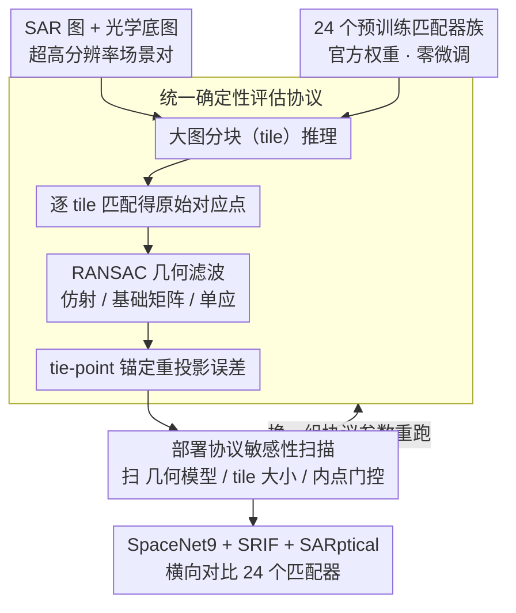

# Are Pretrained Image Matchers Good Enough for SAR-Optical Satellite Registration?

**会议**: CVPR 2026  
**arXiv**: [2604.10217](https://arxiv.org/abs/2604.10217)  
**代码**: 无  
**领域**: 遥感图像  
**关键词**: SAR-光学配准, 图像匹配, 跨模态, 零样本迁移, 卫星图像

## 一句话总结

本文在零样本设置下评估了24个预训练图像匹配器族在SAR-光学卫星配准上的表现，发现部署协议选择（几何模型、tile大小等）对精度的影响可达33倍，有时超过更换匹配器本身的效果。

## 研究背景与动机

**领域现状**：灾难响应中云层覆盖常使光学图像不可用，需将SAR图像配准到光学底图以生成地理参考损伤评估。但最佳图像匹配器是为室内/城市自然图像设计的。

**现有痛点**：光学和SAR传感器通过根本不同的物理观测同一场景——光学记录反射光（纹理丰富），SAR记录雷达回波（散斑噪声、透视叠掩、辐射反转）。预训练匹配器是否能在这种极端域偏移下工作？

**核心矛盾**：跨模态匹配需要模态不变的特征表示，但预训练数据中几乎没有卫星或SAR图像。

**本文目标**：在不进行任何微调或域适应的纯零样本设置下，评估24个匹配器族的跨模态卫星配准性能。

**切入角度**：统一的确定性评估协议，包括大图像分块推理、鲁棒几何滤波和tie-point锚定指标。

**核心idea**：跨模态迁移是不对称的——显式跨模态训练不总是优于纯自然图像训练，基础模型特征可能部分替代跨模态监督。

## 方法详解

### 整体框架

这篇论文不提新匹配器，而是搭一套公平的「考场」，让 24 个预训练匹配器族在 SAR-光学卫星配准上同台竞技。整条流水线是：把一对超高分辨率的 SAR 图与光学底图切成 tile 分别匹配，得到的原始对应点先过 RANSAC 几何滤波剔除外点，再用锚定的 tie-point 算重投影误差作为最终精度。所有匹配器都用官方预训练权重、零微调，区别只在于喂进同一套确定性协议；在此基础上系统性扫描部署协议的各项选择（几何模型、tile 大小、内点门控），在 SpaceNet9 加另外两个跨模态基准（SRIF、SARptical）上跑完整对比。

### 关键设计

**1. 统一确定性评估协议：让 24 个匹配器真正可比**

不同匹配器的原论文各用各的评估设置——有人按室内场景调阈值，有人在城市自然图像上报数，直接拿各自论文里的数字横向比毫无意义。本文把整个评估链固定成一条确定性流水线：针对卫星图像动辄上万像素的尺寸做大图分块（tile）推理，避免一次性塞进网络导致显存爆炸或分辨率被迫下采样；匹配后统一用 RANSAC 做几何滤波，可切换仿射、基础矩阵、单应等几何模型来剔除误匹配；最后不看匹配器自报的置信度，而是用人工标注的 tie-point 锚定重投影误差作为唯一精度口径。因为每个环节都被钉死成同一套参数，任意两个匹配器之间的差异才能干净地归因到匹配器本身。

**2. 部署协议敏感性扫描：把「超参」当成一等变量来量化**

实践者常默认换个更强的匹配器就能涨点，却忽略了部署时的协议选择本身就是巨大的性能杠杆。本文把这些通常被一笔带过的旋钮——几何模型（仿射 / 基础矩阵 / 单应）、tile 大小、内点门控阈值——当成一等变量，在 SpaceNet9 上跑了 16 组协议配置（共 64 次运行）系统扫描，并在另外两个数据集上交叉验证。结果相当反直觉：单是把几何模型切到仿射，平均误差就从 12.34 px 降到 9.74 px（约降 21%）；而同一个匹配器在不同协议组合下，精度波动可达 33 倍，有时甚至超过换一个匹配器带来的差异。换句话说，协议没调好时，再强的匹配器也会被埋没——在灾害响应这种真实部署里，调协议有时比换算法更划算。这一扫描同时也是后文「跨模态迁移不对称」（XoFTR、RoMa 零跨模态训练却并列最优）等结论的公平性前提：只有把协议钉死，匹配器之间的排序才可信。

### 损失函数 / 训练策略

纯零样本评估，全程不涉及任何训练或域适应，所有匹配器一律加载官方预训练权重，变量只落在评估协议上。

## 实验关键数据

### 主实验

| 匹配器 | SpaceNet9平均误差(px) | 跨模态训练 |
|--------|---------------------|-----------|
| XoFTR | 3.0 | 是（可见-热红外） |
| RoMa | 3.0 | 否 |
| MatchAnything-ELoFTR | 3.4 | 是（合成跨模态） |
| MASt3R/DUSt3R | 协议敏感 | 否（3D重建） |

### 消融实验

| 协议选择 | 平均误差变化 | 说明 |
|---------|-------------|------|
| 仿射几何 vs 其他 | 12.34→9.74px | 降低21% |
| Tile大小变化 | 最高33×差异 | 对单个匹配器 |
| 内点门控变化 | 显著影响 | 过严过松都差 |

### 关键发现

- 部署协议选择的影响可以超过更换匹配器本身——仿射几何单独降低21%误差
- 3D重建匹配器（MASt3R/DUSt3R）在默认设置下非常脆弱，高度依赖协议
- DINOv2基础模型特征可能提供了一种隐式的模态不变性

## 亮点与洞察

- **"协议比算法更重要"的发现**：对实践者来说，优化部署协议可能比更换匹配器更有效
- **跨模态迁移不对称性**：挑战了直觉——RoMa没有任何跨模态训练却达到了最低误差
- **DINOv2的隐式模态不变性假说**：基础模型特征可能天然具有跨模态泛化能力

## 局限与展望

- 仅评估零样本性能，未探索少量样本微调的效果
- SpaceNet9的场景覆盖可能有限（主要是城市）
- DINOv2的模态不变性假说尚需更深入的机制性分析

## 相关工作与启发

- **vs RemoteCLIP**: RemoteCLIP通过大规模遥感预训练实现域适应，本文证明零样本可能就够
- **vs LoFTR/ELoFTR**: 标准自然图像匹配器在卫星跨模态上表现不均，部署协议是关键

## 评分

- 新颖性: ⭐⭐⭐ 实证研究，但发现有价值
- 实验充分度: ⭐⭐⭐⭐⭐ 24个匹配器族×多协议×多基准，极其全面
- 写作质量: ⭐⭐⭐⭐ 分析深入，实践导向
- 价值: ⭐⭐⭐⭐ 对灾害响应等实际部署有直接指导

<!-- RELATED:START -->

## 相关论文

- [\[CVPR 2026\] SDF-Net: Structure-Aware Disentangled Feature Learning for Optical-SAR Ship Re-identification](sdfnet_structureaware_disentangled_feature_learnin.md)
- [\[ECCV 2024\] Weakly-Supervised Camera Localization by Ground-to-Satellite Image Registration](../../ECCV2024/remote_sensing/weakly-supervised_camera_localization_by_ground-to-satellite_image_registration.md)
- [\[ICCV 2025\] WildSAT: Learning Satellite Image Representations from Wildlife Observations](../../ICCV2025/remote_sensing/wildsat_learning_satellite_image_representations_from_wildlife_observations.md)
- [\[CVPR 2026\] Joint and Streamwise Distributed MIMO Satellite Communications with Multi-Antenna Ground Users](joint_and_streamwise_distributed_mimo_satellite_communications_with_multi-antenn.md)
- [\[ICLR 2026\] TAMMs: Change Understanding and Forecasting in Satellite Image Time Series with Temporal-Aware Multimodal Models](../../ICLR2026/remote_sensing/tamms_change_understanding_and_forecasting_in_satellite_image_time_series_with_t.md)

<!-- RELATED:END -->
