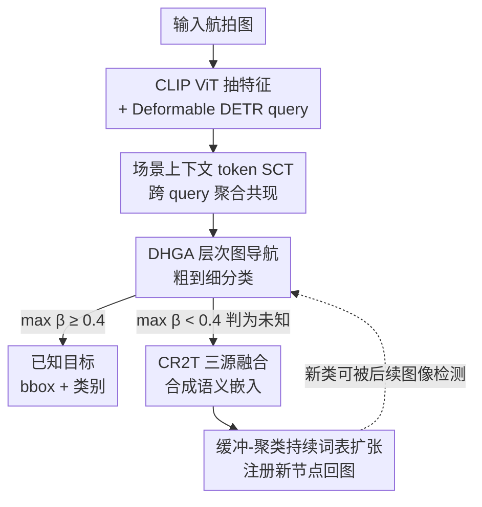

# Prompt-Free Unknown Label Generation for Open World Detection in Remote Sensing

**会议**: CVPR 2026  
**论文**: [CVF Open Access](https://openaccess.thecvf.com/content/CVPR2026/html/Azeem_Prompt-Free_Unknown_Label_Generation_for_Open_World_Detection_in_Remote_CVPR_2026_paper.html)  
**代码**: 无  
**领域**: 遥感 / 开放世界目标检测  
**关键词**: 开放世界检测, 遥感, 层次语义图, 上下文共现, 无提示标注

## 一句话总结
HSGDet 让遥感检测器在部署时不靠任何文本提示，就能一边发现未知目标、一边借助"层次语义图 + 场景共现上下文"自动给它合成一个 CLIP 语义标签并把新类塞回词表，从而在 Known mAP 上比 SOTA 高 6.6 分、Unknown Recall 高 9.9 分、Wilderness Impact 降 36%。

## 研究背景与动机
**领域现状**：遥感目标检测要么走开放词表路线（OVD），用 CLIP 这类视觉-语言预训练在测试时识别任意"被提示过"的类别；要么走开放世界路线（OWOD），不靠提示、专门去发现训练集之外的新实例并标成"unknown"。近期还有统一模型（OW-OVD）把两者缝合，既识别被提示的已知类、又把没提示的实例标成 unknown。

**现有痛点**：三条路线各缺一块。OVD 必须预先给定词表和 prompt，遇到真正没预料到的物体（论文里反复举的例子是航拍图里的"路灯 lamp"）只能视而不见；OWOD 能发现 unknown 却给不出名字，留下一堆匿名占位符，必须人工标注才能用；统一模型虽然缓解了 prompt 依赖，但给 unknown 命名时仍要靠外部 LLM 生成属性或基础模型出伪标签，部署时谈不上真正自治。

**核心矛盾**："自主发现"和"自主命名"这两件事，现有范式从没在同一个测试时刻、且不借外援地同时做到。而遥感场景又额外加难：同样的视觉 pattern 在不同周边环境里语义完全不同（机场跑道旁的小目标是飞机、码头旁的是船），扁平的视觉-语言对齐根本利用不上这种上下文。

**本文目标**：做一个部署时无需任何外部 prompt、外部模型或人工标注，就能同时完成「检测已知类 → 标记未知区域 → 给未知合成可用语义标签 → 把新类注册进词表持续扩张」的端到端检测器。

**切入角度**：作者的关键观察是——遥感里"周边一起出现了什么"本身就是强判别信号。与其只看一个 region 的视觉特征，不如把类别组织成一张层次语义图（WordNet 的 IS-A 树），让检测 query 在场景上下文的引导下从粗到细在图上"导航"，语义由周围环境决定而非孤立外观决定。

**核心 idea**：用「场景共现引导的层次图导航」替代「扁平的提示式分类」，并对低置信区域用「视觉 + 层次父节点 + 场景上下文」三源融合直接合成 CLIP 空间里的语义嵌入，让发现的未知物当场拿到名字、当场进词表。

## 方法详解

### 整体框架
HSGDet 建在 Deformable DETR 上：用冻结的 CLIP ViT-B/32 抽多尺度特征 $\{F_1,F_2,F_3,F_4\}$，decoder 拿 $N=300$ 个可学习 object query $Q\in\mathbb{R}^{N\times d}$，在每层依次过 self-attention、deformable 空间注意力、**Deformable Hierarchical Graph Attention (DHGA)** 和前馈网络。所有类别预先组织成一张层次语义图 $G=(V,E)$，节点是类别（带 CLIP 文本嵌入 $t_v$ 和可学习 key 嵌入 $e_v$），边是"is-a"父子关系。

整条 pipeline 这样转：query 先被一个全局的**场景上下文 token (SCT)** 注入共现信息，然后在 DHGA 里沿层次图做从粗（父节点）到细（子节点）的导航分类，最终层的注意力权重 $\beta_{i,v}$ 直接当分类分数、省掉独立分类头；当某 query 对所有已知类的最大注意力 $\max_v\beta_{i,v}<\tau_{unk}=0.4$，它被判为 unknown 并送进 **CR2T**，由 CR2T 融合视觉 query、场景上下文、最近父节点合成一个文本嵌入，作为这个未知物的语义标签；最后通过"缓冲-聚类"策略把反复出现的一致未知嵌入注册成图里的新节点，实现持续词表扩张。

### 关键设计

**1. 层次语义图：把类别从扁平词表升级成可导航的 IS-A 树**

针对的痛点是扁平视觉-语言对齐既给不了"粗到细"的推理路径、也没法承接新类。作者把类别建成有向图 $G=(V,E)$，每个节点 $v$ 既有 CLIP 文本嵌入 $t_v$（用于语义对齐）又有可学习 key 嵌入 $e_v$（用于导航时被 query 检索），边编码父子"is-a"关系，邻接矩阵 $A_{uv}=1$ 当 $(u,v)\in E$。这张图同时承担三件事：给 DHGA 提供粗到细的层级骨架、给 unknown 提供"最近父节点"做语义锚点、以及在部署时把新节点 $v_{new}$（带 $t_{new}$ 和 $e_{new}$）挂到父节点 $v_p$ 下实现无缝扩张。它是后面两个模块的共同地基。

**2. DHGA：用场景共现条件化的层次图注意力做粗到细分类**

针对的痛点是标准 Deformable Graph Attention 把所有图节点一视同仁、用不上父子层级，也不看场景。DHGA 先引入一个可学习的场景上下文 token $c$，它在每层 decoder 通过 cross-attention 聚合所有 query 的共现信息再残差注入每个 query：$c_{new}=\mathrm{CrossAttn}(c_{prev},q_i,q_i)$，$\tilde q_i=q_i+c_{new}$，这一步把"周围有什么"的全局线索打进每个 query。随后对 context-enriched query 用 Top-K 采样选语义相关节点：先算相关分 $\delta_{i,v}=\tilde q_i^T e_v$，取 $S_i=\mathrm{Top\text{-}K}(\mathrm{softmax}(\delta_i),K)$，把复杂度从 $O(N|V|)$ 降到 $O(NK)$。对选中节点取其 CLIP 文本嵌入做注意力融合：$\beta_{i,v}=\mathrm{softmax}(\tilde q_i^T t_v/\sqrt d)$，$q_i^{next}=q_i+\sum_{v\in S_i}\beta_{i,v}t_v$。妙处在于权重依赖 $\tilde q_i$（已含场景上下文），所以语义融合天然偏向"上下文合适"的类别。粗到细是从 decoder 层数里自然涌现的：浅层 query 视觉细节弱、注意力广撒在粗粒度父节点，深层 query 视觉细节变强、注意力转向子节点，再配合层次损失 $L_{hier}$ 约束祖先路径一致性。最终层 $\beta_{i,v}$ 直接当分类分数，$\max_v\beta_{i,v}<\tau_{unk}=0.4$ 的 query 被路由去 CR2T。

**3. CR2T：给未知物三源融合合成 CLIP 空间里的语义标签**

针对的痛点是 OWOD 发现 unknown 后给不出名字、统一模型命名还得靠外部 LLM。CR2T 不外求，而是用图结构里现成的信息当锚点。对一个未知 query，先取它在采样节点里注意力最大的节点作"最近父节点"$v_p=\arg\max_{v\in S_i}\beta_{i,v}$——虽然最大分都没过 unknown 阈值，但 $v_p$ 仍指明了这个未知物大致落在分类树的哪一支（比如视觉像船但不匹配任何已知船型，父节点可能是"ship"或"vehicle"）。然后用一个可学习 MLP 融合函数 $f$ 把三源拼起来合成嵌入：$t_{new}=f([q_i^{final};c;t_{v_p}])$，分别是 DHGA 精炼后的视觉 query、场景上下文 token、父节点文本嵌入。由于 $t_{new}$ 直接落在 CLIP 嵌入空间，它本身就是语义标签，不需要任何固定词表；只有要给人看可读名字时，才在父节点 $v_p$ 的子类里做一次"层次约束的最近邻检索"把嵌入转成词，这纯属事后输出转换，内部检测/分类/扩图全程在连续 CLIP 嵌入上跑。

**4. 缓冲-聚类的持续词表扩张：只让反复出现的一致未知物升级成新类**

针对的痛点是单次合成的未知嵌入可能是噪声/虚检，直接入图会污染词表。HSGDet 用"先缓冲再聚类"做门槛：推理时把 $t_{new}$ 累积进 buffer，当出现一个 $M=5$ 个嵌入的簇、且簇内每对余弦相似度都超 $\tau_{sim}=0.7$，才自动建新节点 $v_{new}$，新节点文本嵌入取簇成员平均 $t_{new}=\frac1M\sum_i t_i$，视觉原型继承父节点 $e_{new}=e_{v_p}$，并设父子关系 $p(v_{new})=v_p$。新类一旦建立立刻对后续图像可用，实现持续增长又被一致性观测过滤掉杂质。

### 损失函数 / 训练策略
端到端多任务损失 $L=L_{det}+\lambda_1 L_{hier}+\lambda_2 L_{CR2T}$，$\lambda_1=0.5,\lambda_2=0.3$。检测损失 $L_{det}$ 只保留 bbox 回归（L1 + GIoU），分类完全由层次图导航替代。层次导航损失监督路径遍历，对每个真值类 $\hat c$ 让模型对从根到 $\hat c$ 的所有祖先节点都给高注意力：

$$L_{hier}=-\frac{1}{N_{gt}}\sum_{i=1}^{N_{gt}}\sum_{v\in P(c_i)}\log\beta_{i,v}$$

CR2T 损失训练时把 30% 已知类随机掩成"伪未知"来监督嵌入合成，用 L1 对齐 + 兄弟对比约束：$L_{CR2T}=\frac{1}{N_{mask}}\sum_i\big[(1-\cos(t_i^{pred},t_i^{gt}))+\lambda_c L_i^{contrast}\big]$，对比项 $L_i^{contrast}=\max(0,\cos(t_i^{pred},t_i^{neg})-\cos(t_i^{pred},t_i^{gt})+\gamma)$（$t^{neg}$ 采自兄弟类，$\lambda_c=0.1,\gamma=0.2$）防止语义坍缩、逼网络学"物体怎么和父类组合"的可迁移规律。训练用 AdamW（lr=1e-4，weight decay=1e-5），cosine annealing 跑 50 epoch、5 epoch warmup，decoder $L=4$ 层、$N=300$ query，CR2T 是 3 层 MLP [768→512→256] dropout 0.1。

## 实验关键数据

### 主实验
在 DOTA-v2（18 类）、FAIR1M（37 类）、DIOR（20 类）、COCO（80 类）上评，指标用 Known mAP（K-mAP↑）、Unknown Recall（U-R↑）、Wilderness Impact（WI↓）。DOTA-v2/COCO 用四任务增量评测，其余单任务。DOTA-v2 上与 OWOD 系列对比（Task 1）：

| 方法 | 来源 | K-mAP ↑ | U-R ↑ | WI ↓ |
|------|------|---------|-------|------|
| ORE | CVPR-21 | 42.3 | 18.5 | 15.2 |
| PROB | CVPR-23 | 45.7 | 24.3 | 10.8 |
| OrthogonalDet | CVPR-24 | 47.8 | 28.6 | 09.3 |
| OW-OVD | CVPR-25 | 48.3 | 29.5 | 08.9 |
| SkySense-O† | CVPR-25 | 50.2 | 31.5 | 08.1 |
| **HSGDet** | CVPR-26 | **54.8** | **41.2** | **05.8** |

相比最强对手 SkySense-O，K-mAP +4.6、U-R +9.7、WI 从 8.1 降到 5.8；论文摘要口径的"6.6 分 K-mAP / 9.9 分 U-R / WI -36%"是跨数据集综合提升。增量四任务里随任务推进 HSGDet 的 K-mAP 反而走高（Task 1→4：54.8→57.9→60.1→62.3），说明持续词表扩张确实在累积收益。

### 消融实验
组件消融（DOTA-v2 Task 1，baseline 是 CLIP-Vision Deformable DETR + ORE 式能量检测，能标 unknown 但不能命名）：

| 配置 | K-mAP ↑ | U-R ↑ | WI ↓ | 说明 |
|------|---------|-------|------|------|
| Baseline | 44.7 | 20.5 | 14.3 | 只标 unknown 不命名 |
| + DHGA | 48.9 | 28.0 | 11.2 | 层次图导航，U-R +7.5 |
| + DHGA + SCT | 52.1 | 33.8 | 08.4 | 加场景共现，U-R +5.8 |
| + DHGA + SCT + CR2T (Full) | 54.8 | 41.2 | 05.8 | 全模型，比 baseline K-mAP +10.1 / U-R +20.7 |

CR2T 内部三源融合消融（TA=与真值 CLIP 嵌入的余弦对齐，SMC=类内视觉一致性）：

| CR2T 变体 | TA ↑ | SMC ↑ | U-R ↑ | WI ↓ |
|-----------|------|-------|-------|------|
| Visual-Only | 0.56 | 0.67 | 37.4 | 07.5 |
| + 层次父节点 (HP) | 0.63 | 0.71 | 38.6 | 06.7 |
| + 场景上下文 (SC) | 0.66 | 0.74 | 39.1 | 06.4 |
| Full | 0.79 | 0.82 | 41.2 | 05.8 |

伪未知掩码比例从 10%→20%→30%，TA 0.74→0.77→0.79、U-R 39.2→40.3→41.2，30% 最佳（论文采用值）。

### 关键发现
- 三个组件层层叠加都在涨且方向一致：DHGA 主要拉 U-R（+7.5）说明层级导航最有助于"发现未知"，SCT 继续把 U-R 推到 33.8 印证遥感里场景共现是强判别信号（如跑道旁认车），CR2T 把 U-R 一举抬到 41.2 并把 WI 压到 5.8。
- CR2T 的三源缺一不可：纯视觉只有 0.56 文本对齐，加层次父节点 +0.07、再加场景上下文到 0.66，三源全开冲到 0.79——"父节点 + 场景"提供的结构化锚点比视觉本身贡献更大。
- 摘要声称 CR2T 合成嵌入与真值文本嵌入有 0.79 对齐度，且全程不用外部语言模型，这是"无提示自治命名"成立的核心证据。

## 亮点与洞察
- **把"命名"变成嵌入空间里的合成而非词表里的检索**：$t_{new}=f([q^{final};c;t_{v_p}])$ 直接产 CLIP 空间向量当标签，可读名字只是事后最近邻转换——这套"内部全连续、输出才离散"的设计绕开了固定词表约束，是 prompt-free 的关键。
- **场景上下文 token 的用法很巧**：一个全局 token 跨所有 query 聚合共现再残差注回，等于给每个 region 的分类决策都注入"我周围还有啥"，这正是遥感消歧最需要的信号，且几乎零额外结构。
- **缓冲-聚类当词表扩张的"质检"**：用 $M=5$ 一致性簇 + 余弦阈值过滤噪声入图，这个"先攒证据再立类"的思路可迁移到任何在线增量发现新类的开放世界系统。
- **粗到细分类从层数里涌现、不需显式路径规划**：浅层管粗、深层管细 + 层次损失约束祖先一致，省掉了独立分类头和人工路径设计。

## 局限与展望
- 词表扩张依赖超参 $M=5$、$\tau_{sim}=0.7$、$\tau_{unk}=0.4$，论文没给这些阈值的敏感性分析 ⚠️，部署到共现统计差异大的新场景时可能要重调。
- 整套机制建立在"层次语义图来自 WordNet IS-A + 场景共现稳定"两个前提上：当新类与已有树关系很远（没有合适父节点）时，三源融合的"父节点锚点"会失效，论文未讨论这种 out-of-taxonomy 情况。
- 自动命名最终落到父节点子类的最近邻检索，可读标签的正确性受限于父节点选对与否；合成嵌入对齐 0.79 也意味着约两成偏差，细粒度近似类（多种船型）上是否会张冠李戴值得进一步验证。
- 评测虽含 COCO，但方法的核心增益论证主要在遥感场景（强共现先验），自然图像上的相对优势是否同样显著，正文给出的证据相对偏少。

## 相关工作与启发
- **vs OVD（开放词表检测）**：OVD 测试时必须给预定义词表和 prompt，发现不了没预料的物体；HSGDet 无 prompt、靠图导航自主发现并命名，区别在"是否需要外部指定词表"。
- **vs OWOD（开放世界检测，如 ORE/PROB/OrthogonalDet）**：它们能发现 unknown 但只留匿名占位符、要人工标注；HSGDet 多了一条 CR2T 自动语义生成 + 词表扩张链路，把"发现"和"命名"在测试时一次做完。
- **vs OW-OVD（统一模型）**：OW-OVD 缝合了 OVD 和 OWOD，但给 unknown 命名仍依赖预定义属性或外部 LLM、且用扁平分类；HSGDet 训练时就学好了一套全自治的语义生成机制，部署时不需任何外部模型，且用层次推理而非扁平对齐。
- **vs 标准 Deformable Graph Attention**：DHGA 在 DGA 基础上加了层次语义导航 + 可学习 key + 场景条件化，把"一视同仁的节点聚合"升级成"按父子关系和上下文自适应选路"。

## 评分
- 新颖性: ⭐⭐⭐⭐⭐ 首个在测试时同时做自主发现 + 自主命名且完全不靠外部 LLM 的 OWOD，命名机制（嵌入合成 + 层次图扩张）设计扎实。
- 实验充分度: ⭐⭐⭐⭐ 四个数据集 + 增量四任务 + 双层消融，证据较全；阈值敏感性和 out-of-taxonomy 情形缺分析。
- 写作质量: ⭐⭐⭐⭐ 动机递进清晰、图文对照到位；部分公式排版和 OCR 残留略影响阅读。
- 价值: ⭐⭐⭐⭐⭐ 解决遥感自治监测里"发现易、命名难"的真实痛点，无 prompt 持续扩张的范式对开放世界部署很有参考意义。

<!-- RELATED:START -->

## 相关论文

- [\[CVPR 2026\] ReAttnCLIP: Training-Free Open-Vocabulary Remote Sensing Image Segmentation via Re-defined Attention in CLIP](reattnclip_training-free_open-vocabulary_remote_sensing_image_segmentation_via_r.md)
- [\[CVPR 2026\] UniGeoSeg: Towards Unified Open-World Segmentation for Geospatial Scenes](unigeoseg_towards_unified_open-world_segmentation_for_geospatial_scenes.md)
- [\[CVPR 2026\] MM-OVSeg: Multimodal Optical-SAR Fusion for Open-Vocabulary Segmentation in Remote Sensing](mm-ovseg_multimodal_optical-sar_fusion_for_open-vocabulary_segmentation_in_remot.md)
- [\[CVPR 2026\] VLM4RSDet: Collaborative Optimization with Vision-Language Model for Enhancing Remote Sensing Object Detection](vlm4rsdet_collaborative_optimization_with_vision-language_model_for_enhancing_re.md)
- [\[CVPR 2026\] Rotation Invariant and Symmetry Aware Pixel Difference Network for Remote Sensing Object Detection](rotation_invariant_and_symmetry_aware_pixel_difference_network_for_remote_sensin.md)

<!-- RELATED:END -->
