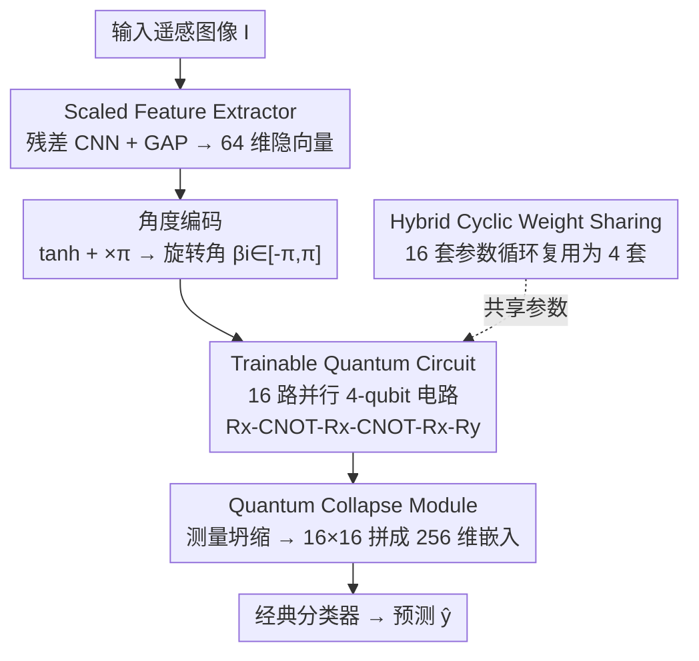

# QuCNet: Quantum Deep Learning Driven Multi-Circuit Network for Remote Sensing Image Classification

**会议**: CVPR 2026  
**论文**: [CVF Open Access](https://openaccess.thecvf.com/content/CVPR2026/html/Komal_QuCNet_Quantum_Deep_Learning_Driven_Multi-Circuit_Network_for_Remote_Sensing_CVPR_2026_paper.html)  
**代码**: 无  
**领域**: 遥感图像分类 / 量子深度学习  
**关键词**: 混合量子-经典网络, 可训练量子电路, 表达力分析, 权重共享, 遥感场景分类

## 一句话总结
QuCNet 把一个极轻量的卷积编码器和 16 路并行的 4-qubit 可训练量子电路（TQC）缝在一起，用「混合循环权重共享（HCWS）」让 16 路电路只用 64 个独立参数，并以 KL 散度表达力分析挑选门序列来回避贫瘠高原，最终在 7 个遥感基准上用 8.7 万参数（比同类混合模型小 85×）跑出超过经典 CNN 的精度，还在真实 IBM 量子处理器上完成了硬件推理。

## 研究背景与动机
**领域现状**：遥感场景分类（RSISC）是土地利用、城市监测、灾害响应的底座任务。经典 CNN 和 ViT 精度已经很高，但跨传感器、跨分辨率、跨光照的异构地理数据上泛化吃力；MobileNet/EfficientNet 这类轻量网络省了算力，表达能力却受限。

**现有痛点**：量子深度学习（QDL）借助纠缠和叠加，理论上能用更少参数编码更丰富的特征交互，是一条新路。但近期量子硬件（NISQ）有硬约束——量子比特数少、门噪声、退相干；电路一深、参数一多，梯度方差会随参数量指数衰减，陷入贫瘠高原（barren plateau）训不动。

**核心矛盾**：现有 RSISC 的混合量子-经典方案，基本都是在预训练 CNN 后面挂一个浅的变分量子电路（VQC）当孤立分类器。这些量子组件彼此之间几乎不交换特征、参数冗余，既限制了可扩展性又卡住了梯度流。于是「表达力（要够丰富）」和「可训练性（梯度别消失）」之间形成直接对立——加深加宽提表达力就掉梯度，砍深砍宽稳梯度就丢表达力。

**本文目标**：在 NISQ 硬件可行的前提下，造一个统一的混合网络，让量子组件真正参与特征学习而不是当摆设，同时把参数压到极低、梯度稳得住、还能搬上真机跑。

**核心 idea**：不堆一个深电路，而是用 **16 路并行的浅 4-qubit 电路** 做量子特征混合，再用 **循环权重共享** 把 16 路电路的参数压缩复用（16 套→4 套），并用 **表达力（KL 散度）指标反向指导门序列设计**，在表达力和可训练性之间卡到一个稳定区间。

## 方法详解

### 整体框架
QuCNet 是一条「经典域→量子域→经典域」往返的流水线，由三个主模块组成：**Scaled Feature Extractor（SFE）** 负责把输入图像压成适合量子处理的 64 维隐向量；**Trainable Quantum Circuit（TQC）** 把这 64 维切成 16 段、各喂给一路 4-qubit 量子电路做纠缠式特征混合，16 路电路的参数由 **HCWS** 策略循环共享；**Quantum Collapse Module（QCM）** 把每路电路测量坍缩出的 16 维概率向量拼成 256 维量子增强嵌入，交给经典分类器出预测。整套网络的经典参数和量子参数通过 PennyLane/PyTorch 的反传接口联合优化。

### 关键设计

**1. Scaled Feature Extractor（SFE）：把图像压成量子能吃的 64 维相位**

量子电路只有 4 个 qubit，吞不下原始图像，必须先有个经典前端把图压成低维隐向量——但又不能压得太狠丢信息。SFE 用一个轻量残差 CNN 做这件事：主路是两层 $3\times3$ 卷积夹 AvgPool，残差路是 $1\times1$ 卷积 + AvgPool，两路相加 $F = F_{main} + F_{res} \in \mathbb{R}^{C'\times H'\times W'}$（$C'=64$，stride=1、padding=1 保持空间分辨率）。融合特征过全局平均池化（GAP）得到 64 维通道描述子 $f_c = \frac{1}{H'W'}\sum_{h,w} F_{c,h,w}$，拼成 $f'_c \in \mathbb{R}^{64}$。

关键一步是「量子化」前的归一化：先 $f^{final}_c = \tanh(f'_c)$ 把值域压到 $[-1,1]$，再乘 $\pi$ 得到合法的旋转角 $\beta_i = \pi f^{final}_c[i] \in [-\pi,\pi]$，作为后续 $R_z(\beta_i)$ 角度编码门的相位。这一步保证了经典特征能无歧义地映射进量子相位空间，是经典域和量子域的接口。

**2. Trainable Quantum Circuit（TQC）：表达力反推出来的 16 路并行浅电路**

这是全文核心，也是对抗「孤立 VQC 分类器」痛点的主力。SFE 输出的 64 维被切成 16 段，每段喂一路 TQC；每路 TQC 只有 4 个 qubit、30 个门（4-H、4-Rz、12-Rx、4-Ry、6-CNOT）、电路深度 12，16 路并行共 480 个门。

单路电路的演化是这样：先对 4 个 $|0\rangle$ 施加 Hadamard 建立均匀叠加 $|\psi_0\rangle = H^{\otimes 4}|0000\rangle = \frac{1}{\sqrt{16}}\sum_{x=0}^{15}|x\rangle$，让电路同时探索全部 16 个基态；再用 $R_z$ 把 SFE 特征编码进量子相位 $|\psi_{f(i)}\rangle = R_z(f_3)\otimes R_z(f_2)\otimes R_z(f_1)\otimes R_z(f_0)\cdot H^{\otimes 4}|0000\rangle$；然后交替施加可训练的 $R_x$ 变分门和 CNOT 纠缠链。纠缠用线性链 CNOT $U_{CNOT} = CNOT(2,3)\cdot CNOT(1,2)\cdot CNOT(0,1)$ 把相邻 qubit 关联起来，捕捉经典系统复制不出的依赖。整路按 $R_x$-CNOT-$R_x$-CNOT-$R_x$-$R_y$ 的序列堆叠，最终态

$$|\psi_{final}\rangle = U''\cdot U_{CNOT}\cdot U'\cdot U_{CNOT}\cdot U\,|\psi_{f(i)}\rangle$$

其中末尾 $U''=\bigotimes_{i=0}^{3} R_x(\theta_{2i+8})\cdot R_y(\theta_{2i+9})$ 引入 $R_y$ 非 Clifford 变换，扩大可达 Hilbert 空间。测量在计算基坍缩得到 16 维概率向量 $p(x) = |\langle x|\psi_{final}\rangle|^2$。

为什么是这套门序列而非随便堆？作者用 **表达力指标** 反向指导：表达力定义为 TQC 生成态的保真度分布 $\hat{P}_{TQC}(F;\theta)$ 与 Haar 随机分布 $P_{Haar}(F)$ 之间的 KL 散度 $\mathrm{Expr} = D_{KL}(\hat{P}_{TQC}\,\|\,P_{Haar})$，**KL 越小表达力越高**。逐步添加旋转和纠缠门时 $D_{KL}$ 从 0.694 降到 0.01，且与 AID 上的分类精度正相关——这条经验曲线直接验证了最终架构，而不是拍脑袋选的。

**3. Hybrid Cyclic Weight Sharing（HCWS）：16 路电路只留 64 个独立参数**

16 路 TQC 若各自独立，参数量 $\Theta_{full} = \{\theta^{(1)},\dots,\theta^{(16)}\}\in\mathbb{R}^{16\times k}$（$k=16$），过参数化会让梯度方差按 $\mathrm{Var}[\partial L/\partial\theta_j] \propto \exp(-\alpha\,n_{active})$ 指数衰减，正中贫瘠高原。HCWS 借鉴 CNN 的参数共享思路并搬进量子电路：只保留 4 套独立参数 $\Theta_{HCWS} = \{\theta^{(1)},\theta^{(2)},\theta^{(3)},\theta^{(4)}\}\in\mathbb{R}^{4\times k}$，按循环规则 $q1\!\to\!q2\!\to\!q3\!\to\!q4$ 重复 4 次，第 $r$ 套参数被 $\{r, r{+}4, r{+}8, r{+}12\}$ 这几路电路共享，最终只有 64 个独立可训练参数。

这一招正好踩在「全共享 vs 全独立」的中间：全共享（$q1\to q1\times16$）梯度稳但表达多样性差，全独立灵活但冗余易过拟合，HCWS 循环复用参数兼顾两者，既压低了 $n_{active}$ 稳住梯度，又靠 16 路并行结构保住了表达多样性。它也是把整网参数压到 87K（比同类混合模型小 85×）的关键。

**4. Quantum Collapse Module（QCM）：测量坍缩拼成量子增强嵌入**

每路 TQC 实现一个变分映射 $Q_\theta: \mathbb{R}^4 \to \mathbb{R}^{16}$——4 维输入经电路演化后在计算基测量，坍缩成 16 维概率向量 $z^{(i)}$。QCM 把 16 路的输出沿通道拼接 $z = [z^{(1)}\|z^{(2)}\|\dots\|z^{(16)}]\in\mathbb{R}^{256}$，形成量子增强嵌入，再喂给最终经典分类层出预测。它把「量子域的概率分布」翻译回「经典域的特征向量」，是返回经典侧的出口。

### 损失函数 / 训练策略
端到端用交叉熵损失，Adam 优化器（lr=0.001，cosine 衰减），batch size 32，训练 200 epoch，80/20 分层划分 + 固定随机种子。经典与量子参数通过 PennyLane（0.28.0）/ PyTorch（2.0.1）反传接口联合优化，量子层用 `qml.qnn.TorchLayer` + 精确态矢量模拟（`default.qubit`）。真机推理时先在无噪模拟器训练，冻结量子参数后移植到 Qiskit，用 Qiskit Runtime SamplerV2 在 IBM 处理器上每图 512 shots 推理。

## 实验关键数据

### 主实验
7 个遥感基准（AID/AIDER/UCM/NPU-45/EuroSAT/USTC SmokeRS/IIITDMJ Smoke），QuCNet 用约 0.08M 参数在多数数据集上超过经典 CNN 和同类混合模型，且参数量小 1~3 个数量级。

| 数据集 | 指标 | QuCNet | 对比方法 | 备注 |
|--------|------|--------|----------|------|
| EuroSAT | Acc% | **97.56**（0.08M） | HQNNC 97.00（0.098M）/ ResNet50 96.72（25.6M） | 比 ResNet50 小 320× |
| UCM | Acc% | **98.00**（0.081M） | HybridQC 95.89（1.89M） | +2.11%，小 24× |
| AID | Acc% | 88.84（0.083M） | HybridQC 86.13 / GoogleNet 83.44 | 超 HybridQC +3.14%（ATMFormer 96.40 但大 891×） |
| NPU-45 | Acc% | 86.60（0.087M） | HybridQC 79.32 | +9.17%，比 MobileNetV2 小 89× |
| AIDER | Acc% | **92.38**（0.077M） | WATT-EffNet 88.50 / EfficientNet 80.00 | +4.38% / +12.38% |
| USTC SmokeRS | Acc% | **95.75**（0.077M） | FireClassNet 86.14 / MAIN 85.61 | 大幅领先 |
| IIITDMJ Smoke | Acc% | **99.28**（0.077M） | MAIN 97.68 | 超全部 CNN 基线 |

跨域验证：在 CIFAR-10 上同等参数预算下 QuCNet 86.78% vs 无 TQC 的经典对照 84.27%。运行时：训练每 epoch 约 123.82s、推理 1.2ms/图、仅 0.17 GFLOPs。

### 消融实验

**TQC 模块有效性（Table 4，七基准 w/i vs w/o TQC）**

| 数据集 | w/i TQC | w/o TQC | 增益 |
|--------|---------|---------|------|
| USTC SmokeRS | 95.75 | 92.23 | +3.52% |
| AID | 88.84 | 86.26 | +2.58% |
| AIDER | 92.38 | 90.47 | +1.91% |
| NPU-45 | 86.60 | 84.75 | +1.85% |
| UCM | 98.00 | 96.71 | +1.29% |
| EuroSAT | 97.56 | 96.78 | +0.78% |

**门序列 & 权重共享策略（Table 5，AID 数据集）**

| 类别 | 配置 | Acc% |
|------|------|------|
| TQC（本文） | Rx-CNOT-Rx-CNOT-Rx-Ry | **88.84** |
| TQC-3 | Rx-CNOT-Rx-Ry | 87.05 |
| All Shared | q1→q1×16 | 88.05 |
| All Independent | q1→…→q16 | 87.59 |
| HCWS（本文） | q1→q2→q3→q4 ×4 | **88.84** |

**硬件后端迁移（Table 3，精度跌幅）**：从无噪模拟到真机，AID 从 88.84%（CPU+Ideal）→ 86.31%（Qiskit 理想）→ 81.25%（含噪）→ ibm_torino 77.53% / ibm_fez 76.21%，平均跌幅约 -12.63%；USTC Smoke 真机仍保 86%，平均跌幅仅 -9.37%。转译到 IBM 原生门集后电路深度从 12 膨胀到 43。

### 关键发现
- TQC 模块在「强基线」数据集上增益反而更大（USTC SmokeRS +3.52%），说明量子特征变换对高层表示学习有实质帮助，而非只在弱基线上凑数。
- 门序列里末尾的 $R_y$ 旋转是表达力的关键来源——它引入非 Clifford 变换扩大可达 Hilbert 空间，去掉后（TQC-3）掉到 87.05%。
- HCWS 相比全共享/全独立分别 +0.79% / +1.25%，验证「循环复用」确实在稳定性和表达多样性间找到了更好的折中。
- 真机推理跌幅被 HCWS 压住——作者归因于它限制了参数冗余，减少了 16 路子电路上的累积门噪声。
- 编码方式有数据依赖：角度编码在结构化图像（EuroSAT/AIDER）更好，幅度编码在紧凑数据集（UCM/NPU-45）更稳。

## 亮点与洞察
- **用表达力指标反推架构**：把 KL 散度表达力分析当成「设计指南针」逐门验证（$D_{KL}$ 0.694→0.01 与精度正相关），而不是事后解释，这种「指标驱动电路设计」的范式可迁移到其他 VQC 任务。
- **把 CNN 的权重共享搬进量子电路**：HCWS 用一个极朴素的循环复用，同时解决了参数量、梯度消失、真机噪声累积三个问题，是「老思想新场景」的漂亮迁移。
- **16 路浅并行 > 1 路深电路**：作者没去堆深电路，而是用宽而浅的并行结构既保表达力又避开贫瘠高原，这个「宽 vs 深」的取舍对 NISQ 时代很有启发。
- **真机闭环**：是少数把训练好的 RSISC 模型真正跑上 IBM 量子处理器并报告完整跌幅的工作，证明了 4-qubit 浅电路设计的硬件可行性。

## 局限性 / 可改进方向
- 量子层训练用的是精确态矢量模拟（`default.qubit`），并非真机训练；真机只做冻结参数后的推理，模拟到真机仍有 9~13% 的精度跌幅。
- 4-qubit、深度 12 的电路转译到 IBM 原生门集后深度膨胀到 43，随 qubit 数/电路复杂度上升，门分解带来的噪声放大可能成为扩展瓶颈（作者把更高 qubit 架构列为未来工作）。
- 多数对比方法的更高绝对精度（如 ATMFormer 99.46%/96.40%）来自数百到上千倍的参数，本文卖点是效率-精度折中而非绝对 SOTA，需读者注意对比口径。
- ⚠️ 表达力公式与 87K 参数量的具体拆解、各数据集类别数等细节作者放在补充材料，正文未完整给出，复现时以原文+补充为准。

## 相关工作与启发
- **vs HybridQC / HQNN（早期混合 RSISC）**：他们在预训练 CNN 后挂一个浅 VQC 当孤立分类器，经典-量子特征几乎不交互、参数冗余；本文用 16 路并行 TQC + HCWS 做深度耦合的量子特征混合，参数小 24× 而 AID/NPU-45 精度反超 +3~9%。
- **vs QuanV4EO / QSCdNet / RemoteQ-ResNet（单电路深骨干）**：他们用更深骨干 + 单电路模块，仍受冗余、弱耦合电路限制且多停留在仿真；本文走「多电路 + 权重共享」路线，并补上真机验证。
- **vs 经典轻量网络（MobileNet / EfficientNet / WATT-EffNet）**：经典轻量网络在受限环境表达力有限；QuCNet 借量子纠缠在更小参数预算下提升类间可分性，烟雾等低对比场景增益尤其明显。

## 评分
- 新颖性: ⭐⭐⭐⭐ 表达力指标驱动电路设计 + 把 CNN 权重共享搬进量子电路（HCWS），组合很新；单点技术偏工程整合。
- 实验充分度: ⭐⭐⭐⭐⭐ 7 个遥感基准 + CIFAR-10 跨域 + 真实 IBM 量子硬件三类后端，消融覆盖门序列/共享策略/TQC 模块。
- 写作质量: ⭐⭐⭐⭐ 公式和流水线交代清楚，但表达力定义、参数拆解等关键细节外放补充材料。
- 价值: ⭐⭐⭐⭐ 给出了一条 NISQ 硬件可行的轻量 RSISC 路线，真机闭环对量子遥感落地有参考意义。

<!-- RELATED:START -->

## 相关论文

- [\[CVPR 2026\] Uncertainty-Guided Edge Learning for Deep Image Regression in Remote Sensing](uncertainty-guided_edge_learning_for_deep_image_regression_in_remote_sensing.md)
- [\[CVPR 2026\] Robust Remote Sensing Image–Text Retrieval with Noisy Correspondence](robust_remote_sensing_image-text_retrieval_with_noisy_correspondence.md)
- [\[CVPR 2026\] Rotation Invariant and Symmetry Aware Pixel Difference Network for Remote Sensing Object Detection](rotation_invariant_and_symmetry_aware_pixel_difference_network_for_remote_sensin.md)
- [\[CVPR 2026\] SkySense-VITA: Towards Universal In-context Segmentation of Multi-modal Remote Sensing Imagery](skysense-vita_towards_universal_in-context_segmentation_of_multi-modal_remote_se.md)
- [\[CVPR 2026\] Orthogonal Spatial-Aware Multi-View Anchor Graph Clustering for Incomplete Remote Sensing Data](orthogonal_spatial-aware_multi-view_anchor_graph_clustering_for_incomplete_remot.md)

<!-- RELATED:END -->
