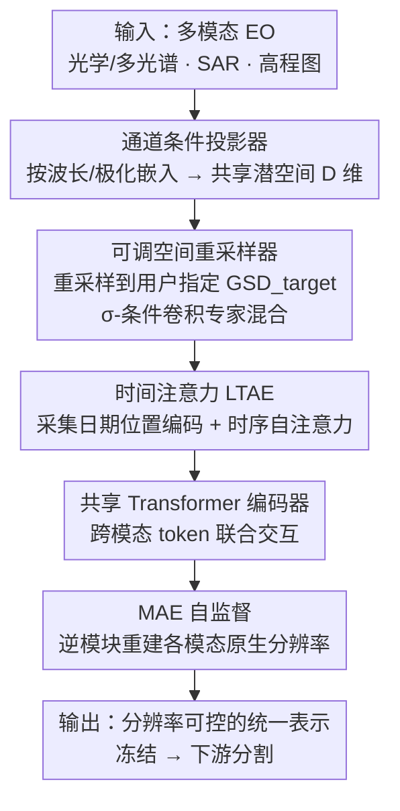

# RAMEN: Resolution-Adjustable Multimodal Encoder for Earth Observation

**会议**: CVPR 2026  
**论文**: [CVF Open Access](https://openaccess.thecvf.com/content/CVPR2026/html/Houdre_RAMEN_Resolution-Adjustable_Multimodal_Encoder_for_Earth_Observation_CVPR_2026_paper.html)  
**代码**: https://github.com/nicolashoudre/RAMEN （有）  
**领域**: 遥感 / 地球观测多模态基础模型  
**关键词**: 地球观测、分辨率可调、多模态编码器、传感器无关、掩码自监督

## 一句话总结
RAMEN 是一个"传感器无关、分辨率可调"的统一 Transformer 编码器：它把模态、空间分辨率（GSD）、时间分辨率都当作输入特征显式编码进共享潜空间，并**把空间分辨率做成推理时可控的输出参数**，让用户在精度与算力之间自由权衡；用一次掩码重建预训练在异质地球观测语料上，冻结编码器后在 PANGAEA 基准 8 个下游任务上以更轻的 ViT-Base 超越体量更大的 TerraMind-L 等 SOTA。

## 研究背景与动机
**领域现状**：地球观测（EO）数据天生异质——从 0.2m 航拍 RGB 到 10–30m 多光谱卫星、SAR、高程图，在通道含义、地面采样距离（GSD，即相邻像素中心在地面上的实际距离）、时间采样上差异巨大。已有多模态 EO 基础模型大多用**传感器专属编码器**整合多模态。

**现有痛点**：(1) 传感器专属编码器换到新模态就得改架构、重训部分网络，泛化受限；(2) 近期改进要么只管光谱（DOFA、SMARTIES）、要么只管空间（Scale-MAE、FlexiMo）、要么只管时间（AnySat、Galileo），**没有一个同时处理模态/空间/时间三个异质轴**；(3) 几乎所有模型输出**固定分辨率**特征，无法按任务调节空间细节或算力。

**核心矛盾**：EO 的异质性既是价值来源（支撑多样应用）又是建模障碍——不同 GSD、不同通道、不同时间采样的输入无法直接对齐或拼接；而下游任务对空间细节的需求又各不相同（火灾大面积均质 vs 海洋污染物细小目标），固定分辨率必然在某些任务上吃亏。

**本文目标**：训练一个单一统一编码器，能处理任意传感器与配置而无需重训，并让用户在推理时显式选择目标空间分辨率。

**切入角度**：把"模态、空间分辨率、时间分辨率"都视为可被显式编码的关键输入特征，并保留其物理含义（波长、极化、GSD、采集日期）；尤其把空间分辨率从"固定属性"翻转成"可控输出参数"。

**核心 idea**：用三个分辨率感知模块（通道条件投影 + 可调空间重采样 + 时间注意力）把异质输入投到统一的"分辨率感知"潜空间，再用共享 Transformer + MAE 自监督学到模态无关、分辨率一致的表示。

## 方法详解

### 整体框架
RAMEN 把一组地理对齐的多模态影像 $(x_1,\dots,x_M)$（每个 $x_m\in\mathbb{R}^{T_m\times C_m\times H_m\times W_m}$，分别是时间步/通道/高/宽）逐模态送过三个分辨率感知模块，统一到共享潜空间，再拼成一条多模态 token 序列由共享 Transformer 联合处理；预训练用掩码自编码（MAE）重建各模态在**原生**光谱/空间/时间分辨率下的被遮挡像素。关键在于每次迭代会随机采样一个数据集、一个模态子集和一个目标 GSD（$\text{GSD}_{target}$），逼模型学会跨尺度泛化；推理时该 GSD 由用户按任务选定。

### 关键设计

**1. 通道条件投影器：让模型理解每个波段的物理含义而非当作通用通道**

EO 传感器不只通道数不同，物理解释也不同（红/近红外/SWIR/SAR 极化/高程）。RAMEN 用携带物理含义的逐通道嵌入来统一异质通道：对光学/多光谱模态，沿用 DOFA 思路把每个通道的**中心波长** $\lambda^i_m$（纳米）用正弦位置编码嵌入，$\text{PE}(\lambda^i_m,2k)=\sin(\lambda^i_m/10000^{2k/D})$、奇数维取 $\cos$；对非光学模态（SAR 的 VV/VH/HH/HV 升降轨、高程的 DSM/DTM/坡度）用专门的可学习嵌入。这些编码拼接后过一个轻量 MLP 得到通道投影矩阵 $M_m\in\mathbb{R}^{C_m\times D}$，把原始输入映射到潜空间：$x^S_m(t,d,h,w)=\sum_{c=1}^{C_m}x_m(t,c,h,w)M_m(c,d)$。这样任意通道配置都能投到同一 $D$ 维空间，是"传感器无关"的第一步。

**2. 可调空间重采样器：把空间分辨率做成推理时可控的输出参数**

这是论文的核心方法贡献，直击"固定分辨率"痛点。它把投影后特征 $x^S_m$（原生 $\text{GSD}_m$）映射到用户定义的 $\text{GSD}_{target}$。由于传感器分辨率可能差几个数量级，作者引入一个**卷积专家混合**机制按尺度自适应：定义对数缩放插值比 $\sigma_m=\log(\text{GSD}_m/\text{GSD}_{target})$，它对称地刻画上/下采样幅度与方向；每个专家是一个 $1\times1$ 卷积，最终对齐表示为 $x^R_m=I_{\sigma_m}(x^S_m)+\sum_{n=1}^{N_{conv}}w_n\,\text{Conv}_n(I_{\sigma_m}(x^S_m))$，其中 $I_{\sigma_m}$ 是以 $\sigma_m$ 参数化的双线性插值，$H_{target}=\exp(\sigma_m)H_m$。$\sigma_m$ 经正弦编码 + MLP + softmax 产生归一化专家权重 $\sum w_n=1$。这套设计在不改变空间结构的前提下、按缩放幅度与方向轻量地校正插值后的特征统计——既支持跨分辨率连续插值，又让用户在微调/推理时直接选 GSD 来换取精度或省算力。

**3. 时间注意力：用采集日期编码把多时相观测聚合成单一表示**

很多 EO 应用（作物监测、灾害响应）依赖多日期观测。RAMEN 用轻量时间注意力编码器（LTAE）处理时序：为保持时间连续性，给每个时间戳加一个基于**采集日期**的正弦-余弦位置编码，再沿时间轴对已做光谱/空间投影的特征 $x^R_m$ 做自注意力，得到时间聚合表示 $x^T_m=\text{LTAE}(x^R_m)\in\mathbb{R}^{D\times H_{target}\times W_{target}}$。这让单时相与多时相模态都能进同一框架。

**4. 共享 Transformer + 分辨率可调 MAE 自监督：一套参数吃下所有模态**

时间聚合后，每个模态得到一张特征图，每个空间位置当作一个 token（一个 $\text{GSD}_{target}$ 像素对应一个 $D$ 维嵌入），并仿照 Scale-MAE 加 GSD 位置编码以携带目标分辨率信息。所有模态 token 沿序列维拼成 $Z\in\mathbb{R}^{N\times D}$（$N=M\cdot H_{target}\cdot W_{target}$），由**共享** Transformer 联合处理，实现跨模态交互而不需任何模态专属分支——除三个输入类型感知嵌入（光谱影像/雷达/高程）外所有参数共享。预训练用 MAE：对 $Z$ 按 75% 比例随机掩码，ViT 编码可见 token + [CLS]，解码端用"逆模块"把表示投回各模态原生分辨率三步重建（时间扩展回 $T_m$ → 空间重采样回 $\text{GSD}_m$ → 通道投影矩阵转置恢复通道），MSE 监督被遮挡像素：$L=\frac{1}{M}\sum_{m=1}^{M}\frac{(\hat{x}^{masked}_m-x^{masked}_m)^2}{H_mW_m}$。每次迭代随机采样数据集/模态子集/目标 GSD 的策略，一方面逼模型学模态无关、分辨率一致的表示，一方面让最耗内存的高分辨率序列只偶尔出现，大幅省算力。

### 损失函数 / 训练策略
ViT-Base 主干，专家数 $N_{conv}=4$，掩码率 75%，AdamW，基础学习率 $1.5\times10^{-4}$，warmup 20 epoch + 余弦衰减，共 100 epoch，16×H100。预训练语料拼三个互补数据集：FLAIR-HUB（法国高分 RGB-NIR + S2 时序 + S1 + 高程，GSD 3–20m 采样）、WorldStrat（全球 RGB-NIR + 低分 S2 时序，5–20m）、MMEarth64（120 万地点 S2/S1/高程，20–100m，按生物群落分层采 60%）；输入按通道做标准化以缓解跨传感器/跨数据集分布漂移。

## 实验关键数据

### 主实验
在 PANGAEA 基准 8 个下游语义分割任务上评测（涵盖航拍/多光谱/SAR、0.2–30m、单时相/时序）；按标准协议冻结预训练编码器，只微调 UPerNet 解码器。

| 模型 | 规模 | Avg. mIoU | Avg. Rank |
|------|------|-----------|-----------|
| U-Net（从头训） | — | 57.22 | 4.25 |
| CROMA | Large | 55.72 | 6.50 |
| DOFA | Base | 54.89 | 7.50 |
| TerraMind v1-B | Base | 58.18 | 4.25 |
| TerraMind v1-L | Large | 59.10 | 3.75 |
| **RAMEN (ours)** | **Base** | **60.03** | **2.63** |

RAMEN 用更轻的 ViT-Base 拿到最高平均 mIoU 60.03 与最佳平均排名 2.63，并在 8 个任务里有 6 个进前 2，体现跨传感器泛化与一致性。尤其在细节关键的 AI4SmallFarms 上达 38.78 mIoU，而所有固定分辨率基础模型都卡在 ~30 mIoU 以下。

### 消融与分析

| 分析 | 任务 | 设置 | mIoU |
|------|------|------|------|
| GSD 可调（粗更好） | HLS BurnScars 火灾 | GSD 30→360 / 240 | 87.07 / **88.30** |
| GSD 可调（细更好） | MADOS 海洋污染物 | GSD 80→10 | 57.09→**78.07** |
| 多模态融合 | Sen1Floods11 | S2 → S2+S1 | 89.96→**91.20** |
| 多模态融合 | Pastis | S2 → S2+S1 | 40.99→**44.25** |
| 算力-性能权衡 | Pastis | 359 GFLOPs（粗 GSD） | 33.26（≈峰值 80%，~7.4× 提速） |

> ⚠️ 缓存中波长编码消融（Table 4a，把编码波长从粗近似逐步逼近真实 Sentinel-2 波长在 Sen1Floods11 上涨 mIoU）表头被截断，具体逐档数值以原文为准。SMARTIES-B 一行缓存也有缺列。

### 关键发现
- **最优分辨率随任务而变，且不一定越细越好**：火灾这类大面积均质区域用**更粗** GSD 反而更准（240m 时 88.30）；海洋污染物这类细小目标用**更细** GSD 大幅提升（10m 时 78.07）——这正是"分辨率可控"的价值所在，单模型即可覆盖从快速灾害响应到精细监测。
- **可调分辨率突破固定分辨率上限**：访问更细分辨率让 RAMEN 在 AI4SmallFarms 上超过所有固定分辨率模型的天花板。
- **多模态即插即融**：共享潜空间天然支持 S2+S1 融合，三个任务一致涨点，无需模态专属架构改动。
- **算力可主动调**：Transformer 随 token 数二次增长，但选粗 GSD 能在 Pastis 上以 ~7.4× 提速拿到约 80% 峰值性能；BurnScars 上 817 GFLOPs 达 85.02 mIoU，优于 TerraMind-L 980 GFLOPs 的 82.93。

## 亮点与洞察
- **把分辨率从"属性"翻成"旋钮"**：最核心的范式转变——空间分辨率成为推理时可控输出参数，用户能按任务/算力自由权衡，这是以往固定分辨率 EO 模型做不到的。
- **σ-条件卷积专家混合**：用一个对数缩放比 $\sigma_m$ 同时编码缩放幅度与方向去条件化专家权重，轻量（$1\times1$ 卷积）却能对称处理上/下采样、校正插值统计，思路可迁移到任何需要跨尺度对齐的场景。
- **物理含义进编码**：波长/极化/采集日期都被显式编码，模型不是把通道当匿名维度，而是理解其物理意义，这是跨传感器零重训泛化的关键。
- **一套参数吃所有模态**：除三个类型嵌入外全部参数共享，配合随机模态/GSD 采样，既省算力又逼出模态无关表示。

## 局限与展望
- **二次复杂度**：基于 Transformer，GFLOPs 随 token 数（∝ 分辨率）二次上升，细分辨率下开销增长快——可调性缓解了但没消除这个根本瓶颈。
- **下游只验证了分割**：PANGAEA 8 任务全是语义分割，对检测、回归（如生物量）、检索等任务的迁移性未充分验证（且作者按 TerraMind 排除了 BioMassters 等不可复现任务）。
- **预训练语料偏向**：三数据集对欧洲/全球有覆盖，但 GSD 范围与生物群落采样比例（MMEarth 仅 60%）可能引入偏差。
- **波长消融数据不全**：缓存中相关表头截断，物理编码的逐档收益需查原文确认。
- **改进方向**：引入线性注意力/稀疏 token 缓解二次复杂度；扩展到非分割下游；把 GSD 选择自动化（按任务自适应而非人工指定）。

## 相关工作与启发
- **vs DOFA / SMARTIES（光谱感知）**: 它们用中心波长做光谱感知投影/通道注意力，只解决光谱异质；RAMEN 借用波长编码思路但同时覆盖空间与时间三轴。
- **vs Scale-MAE / FlexiMo（空间感知）**: Scale-MAE 用 GSD 位置编码、FlexiMo 动态适配 patch 权重，但输出仍偏固定设定；RAMEN 把 GSD 做成可调输出参数 + 专家混合重采样。
- **vs AnySat / Galileo（时间感知）**: 它们建模时间动态（AnySat 用 LTAE，但引入模态专属投影器降低泛化）；RAMEN 同样用 LTAE 但保持全参数共享、模态无关。
- **vs TerraMind**: 体量更大（含 Large 版）的强 SOTA；RAMEN 用更轻 ViT-Base 在平均 mIoU 与排名上反超，靠的正是分辨率可调 + 统一多模态预训练。

## 评分
- 新颖性: ⭐⭐⭐⭐⭐ "分辨率作为可控输出参数 + σ-条件专家重采样"在 EO 基础模型里是首个同时统一模态/空间/时间三轴的设计。
- 实验充分度: ⭐⭐⭐⭐ PANGAEA 8 任务 + GSD/融合/算力多角度消融较扎实，但下游仅分割、波长消融数据有缺。
- 写作质量: ⭐⭐⭐⭐ 模块清晰、公式完整、动机具体；部分表格在公开版里信息略密。
- 价值: ⭐⭐⭐⭐⭐ 传感器无关 + 推理时调分辨率 + 轻量超 SOTA + 已开源，对实际 EO 落地价值高。

<!-- RELATED:START -->

## 相关论文

- [\[CVPR 2026\] OlmoEarth: Stable Latent Image Modeling for Multimodal Earth Observation](olmoearth_stable_latent_image_modeling_for_multimodal_earth_observation.md)
- [\[CVPR 2026\] NeighborMAE: Exploiting Spatial Dependencies between Neighboring Earth Observation Images in Masked Autoencoders Pretraining](neighbormae_exploiting_spatial_dependencies_between_neighboring_earth_observatio.md)
- [\[ICLR 2026\] Earth-Agent: Unlocking the Full Landscape of Earth Observation with Agents](../../ICLR2026/remote_sensing/earth-agent_unlocking_the_full_landscape_of_earth_observation_with_agents.md)
- [\[CVPR 2026\] YieldSAT: A Multimodal Benchmark Dataset for High-Resolution Crop Yield Prediction](yieldsat_a_multimodal_benchmark_dataset_for_high-resolution_crop_yield_predictio.md)
- [\[ICML 2025\] High-Resolution Live Fuel Moisture Content (LFMC) Maps for Wildfire Risk from Multimodal Earth Observation Data](../../ICML2025/remote_sensing/high-resolution_live_fuel_moisture_content_lfmc_maps_for_wildfire_risk_from_mult.md)

<!-- RELATED:END -->
