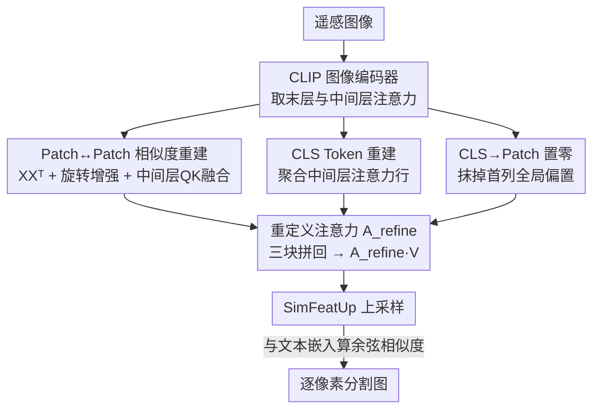

# ReAttnCLIP: Training-Free Open-Vocabulary Remote Sensing Image Segmentation via Re-defined Attention in CLIP

**会议**: CVPR 2026  
**论文**: [CVF Open Access](https://openaccess.thecvf.com/content/CVPR2026/html/Niu_ReAttnCLIP_Training-Free_Open-Vocabulary_Remote_Sensing_Image_Segmentation_via_Re-defined_Attention_CVPR_2026_paper.html)  
**代码**: 无  
**领域**: 遥感 / 开放词表分割  
**关键词**: 遥感分割, 开放词表, CLIP, 注意力重定义, 免训练

## 一句话总结
本文把 CLIP 最后一层注意力图拆成「patch↔patch、CLS→patch、patch→CLS」三块分别动手术——用原始 patch 嵌入的余弦相似度（外加旋转增强）重建 patch 间关系、用中间层注意力重建更富类别信息的全局表示、并把 [CLS] 对 patch 的那一列直接置零，从而在**完全不训练**的前提下，把 CLIP 拉到遥感开放词表分割的 SOTA（八数据集平均 +1.7%）。

## 研究背景与动机
**领域现状**：遥感图像分割（建筑/道路提取、灾害监测、精准农业）传统上依赖大量像素级标注训练，且类别固定。开放词表分割（用自然语言描述任意类别、无需为新类重训）成为更灵活的范式，而其中**免训练（training-free）** 路线最诱人——直接复用 CLIP 这类大规模预训练模型，省掉标注与训练开销。

**现有痛点**：CLIP 的预训练目标是**图像级**的图文对齐（靠 [CLS] token 做全局表示），而分割需要的是**patch 级**的判别特征。两者根本错位。已有的免训练适配（如 SCLIP 的 query-query、SegEarth-OV 的 QKV 加权和）都把 CLIP 最后一层的注意力图当成**一个整体**来"重构"，没有拆开看内部各分量各自起什么作用。

**核心矛盾**：注意力图里其实混了几股不同的信息流——patch 之间的相互关系、[CLS] 怎么聚合全局、[CLS] 又怎么反过来污染每个 patch。把它们捆在一起整体改写，就没法在「全局语义」和「局部细节」之间取得平衡，对遥感这种尺度剧变、地物异质、目标分布复杂的图像尤其吃亏。

**切入角度**：作者把最后一层注意力更新 $x_i = A_{i0}v_{\text{CLS}} + \sum_{j=1}^{196} A_{ij}v_j$ 按行展开，发现每个 patch 嵌入的信息来源可以**显式拆成三个可解释分量**：(i) patch↔patch 子矩阵、(ii) [CLS] 行（[CLS] 如何由各 token 组成）、(iii) [CLS] 列（[CLS] 对各 patch 的贡献）。既然能拆开，就能逐个分量针对性地修。

**核心 idea**：不重构整张注意力图，而是把它**分解成三块、对每块单独做手术**，再拼回一张"重定义"的注意力矩阵 $A_{\text{refine}}$ 喂回 $X = A_{\text{refine}}V$，得到干净的稠密特征。

## 方法详解

### 整体框架
ReAttnCLIP 是一条**纯推理、无训练**的管线：输入遥感图像，过 CLIP 的 ViT-B/16 图像编码器，**只在最后一个 transformer block 动手脚**——把这一层的注意力矩阵按 [CLS] 行/列和 patch 子块拆成三个分量，分别替换/重建/置零后拼成 $A_{\text{refine}}$，再做一次 $A_{\text{refine}}V$ 得到 patch 稠密特征；这些特征经 SimFeatUp（一个为遥感设计、**预训练好直接拿来用**的上采样模块）放大分辨率，最后与 CLIP 文本编码器对 80 个模板取平均得到的类别文本嵌入算余弦相似度，逐像素分类出分割图。推理时用 224×224 滑窗在 448×448 图上扫并拼接。

整张图最核心的就是那个被重定义的注意力矩阵：

$$A_{\text{refine}} = \begin{pmatrix} \bar{A}^{(l)}_{0,0} & \bar{A}^{(l)}_{0,1:196} \\ 0 & S \end{pmatrix}$$

其中 $S$ 是重建后的 patch↔patch 相似度（右下子块），$\bar{A}^{(l)}_{0,:}$ 是从**中间层**聚合出来的 [CLS] 行（左上+第一行），而第一列（[CLS]→patch）被整列置零。三块各对应下面一个关键设计。

### 关键设计

**1. Patch↔Patch 相似度重建：去投影、加旋转、融中间层，把 patch 间关系做扎实**

这一块针对的痛点是：标准 query-key 注意力 $A=\mathrm{softmax}(QK^\top/\sqrt{d})$ 因为 Q、K 各自有独立投影，会引入投影偏差，patch 间相似度不可靠。SegEarth-OV 的做法是把 $QQ^\top$、$KK^\top$、$VV^\top$ 加权求和（$A=\alpha QQ^\top+\beta KK^\top+\gamma VV^\top$）来缓解，但仍带投影。作者更激进：**直接砍掉所有可学习投影，用原始 patch 嵌入算相似度** $\mathrm{Attention}^{\text{raw}}_{i,j} = x_i^\top x_j/\sqrt{d}$（即 $XX^\top$）。这个对称、无投影的形式提供了一个可解释的几何基线，可视化（Fig.3）显示它生成的注意力图比 RCS/SCSA 更干净。

在此之上叠两个增强。其一是**旋转增强**：遥感目标朝向千变万化，作者把图分别旋转 $0°/90°/180°/270°$，每个旋转 $r$、每个选定中间层 $k$ 算一份相似度 $S^{(r,k)}=X^{(r,k)}X^{(r,k)\top}$，再加权聚合并跨层平均得 $S_{\text{rot}}=\frac{1}{|K|}\sum_{k\in K}\sum_r \lambda_r S^{(r,k)}$（$\lambda_0{=}1$，其余 $\lambda_i{=}0.4$，$K$ 取第 9–11 层）。其二是再把若干中间层的 query-key 注意力 $A^{(l)}$ 也融进来：$S=\alpha S_{\text{rot}}+\sum_{l\in L}\beta_l A^{(l)}$（$\alpha{=}0.2$）。消融里 $XX^\top$ 单独就给 UDD5 带来 +2.8%，旋转在小目标多的 VDD 增益最大，再加中间层 QK 还能继续涨。

**2. CLS Token 重建：用中间层注意力行拼一个"信息更全"的全局表示来去偏**

痛点在于 patch token 在预训练时与 [CLS] 反复交互，编码进了大量全局上下文，直接用会污染稠密判别。SegEarth-OV 的去偏是 $\tilde{x}_i = x_i - x_{\text{cls}}$，但作者论证**末层 [CLS] 本身已经信息贫瘠**：可视化（Fig.4）显示某个"植被"patch 的相似图里"建筑"区域也被激活，说明 patch 携带多类别信息；而对 [CLS] 注意力熵随层加深单调下降（Fig.5），意味着深层 [CLS] 的注意力只盯住一小撮 patch、类别覆盖窄。用这样一个贫信息的末层 [CLS] 去减，去偏参照本身就不靠谱。

作者的修法是**从中间层重建 [CLS] 行**：对每个选定中间层 $l\in L$，取其注意力图的整条第一行 $A^{(l)}_{0,:}$（[CLS] 对所有 token 包括自身的注意力权重），跨层求平均 $\bar{A}^{(l)}_{0,:}=\frac{1}{|L|}\sum_{l\in L}A^{(l)}_{0,:}$（$l$ 取第 6–9 层间，逐数据集按 [CLS] 熵图定）。这条重建出的全局注意力行同时整合了跨网络深度的空间与语义信息，作为更全面、更鲁棒的去偏参照填进 $A_{\text{refine}}$ 的第一行。

**3. CLS→Patch 置零：直接抹掉 [CLS] 注入每个 patch 的那一列**

[CLS] 对每个 patch 的贡献由注意力矩阵的**第一列** $A_{i0}$ 给出，这种全局→局部的注入会在 patch 级引入不想要的偏置（前面 $x_i$ 展开式里的 $A_{i0}v_{\text{CLS}}$ 项）。既然 [CLS] 在预训练阶段就已经偏置了 patch 嵌入，作者干脆把这一列**整列置零**：$A_{\text{refine}}[i,0]=0,\ i=1,\dots,N$，从源头切断末层 [CLS] 对局部特征的二次污染。它和设计 2 是互补的两条去偏路径——一条置零阻断直接注入，一条重建并替换残留的全局成分。消融显示三块各自单独开启都能涨点，全开在 UDD5/VDD/WHUSAT.II 上达到 53.7/49.7/29.5。

## 实验关键数据

### 主实验
开放词表语义分割（mIoU），与六个免训练 SOTA 比，八数据集**全面领先**，平均 +1.7%：

| 数据集 | CLIP | SCLIP | ClearCLIP | ResCLIP | SegEarth-OV | 本文 |
|--------|------|-------|-----------|---------|-------------|------|
| OpenEarthMap | 12.0 | 29.3 | 31.0 | 34.3 | 40.3 | **41.1** |
| iSAID | 7.5 | 16.1 | 18.2 | 8.8 | 21.7 | **23.2** |
| Potsdam | 14.5 | 36.6 | 40.9 | 42.6 | 47.1 | **48.7** |
| UAVid | 10.9 | 31.4 | 36.2 | 36.0 | 42.5 | **44.0** |
| UDD5 | 9.5 | 38.7 | 41.8 | 41.9 | 50.6 | **53.7** |
| VDD | 14.2 | 37.9 | 39.3 | 39.6 | 45.3 | **49.7** |
| 平均(8 集) | 11.4 | 31.1 | 33.4 | 32.6 | 39.2 | **40.9** |

建筑/道路提取（mIoU），泛化到目标提取任务同样领先约 1.1%：

| 数据集 | SegEarth-OV | 本文 |
|--------|-------------|------|
| WHUSAT.II（建筑） | 28.4 | **29.7** |
| Massachusetts（道路） | 11.5 | **12.4** |
| 平均 | 20.0 | **21.1** |

### 消融实验
三模块逐个开启与全开（UDD5 / VDD / WHUSAT.II）：

| 配置 | UDD5 | VDD | WHUSAT.II | 说明 |
|------|------|-----|-----------|------|
| baseline | 50.4 | 45.3 | 28.4 | 都不开 |
| +P-P | 53.1 | 47.8 | 29.0 | patch↔patch 相似度，单独增益最大 |
| +CLS | 52.5 | 46.8 | 28.9 | 重建全局表示 |
| +CLS-Patch | 51.5 | 46.7 | 28.8 | 首列置零 |
| 全开 | **53.7** | **49.7** | **29.5** | 三块互补叠加 |

P-P 模块内部计算策略消融（UDD5 / VDD / WHUSAT.II）：

| 配置 | UDD5 | VDD | WHUSAT.II | 说明 |
|------|------|-----|-----------|------|
| baseline | 50.4 | 45.3 | 28.4 | QK 注意力 |
| $XX^\top$ | 53.2 | 46.7 | 29.1 | 去投影原始相似度，单项 +2.8% |
| $XX^\top$+Rotation | 53.4 | 48.8 | 29.3 | 旋转对小目标(VDD)增益显著 |
| 全部 | **53.7** | **49.7** | **29.5** | 再融中间层 QK |

### 关键发现
- **P-P 模块贡献最大**：在三块里单独开启时涨点最多（UDD5 +2.7），说明把 patch 间关系做扎实是免训练遥感分割的主要瓶颈。
- **去投影 $XX^\top$ 是核心 trick**：仅此一项就在 UDD5 上 +2.8%，印证"独立 Q/K 投影引入偏差"的判断。
- **旋转增强专治小目标**：在小目标占多数的 VDD 上增益最大，符合遥感目标朝向多变的直觉。
- **层选择很鲁棒**：$XX^\top$ 融合层从 7→9 到 9→11 的多种组合，UDD5/VDD 仅毫厘之差，作者据效率取 9–11 层。
- **失败场景**：LoveDA 仅 +0.1%，作者归因于该集图像模糊、小目标多，加上 ViT 在自然图上预训练与遥感存在域差。

## 亮点与洞察
- **把"整体重构注意力图"换成"分量级手术"**：先按 $x_i=A_{i0}v_{\text{CLS}}+\sum_j A_{ij}v_j$ 展开看清三股信息流，再逐块针对性地改，这种"先解剖再下刀"的思路比黑盒重构更可解释，也更容易组合优化。
- **末层 [CLS] 信息贫瘠的实证**（注意力熵随层下降 + 多类别激活可视化）很有说服力，直接推翻了"减末层 [CLS] 就能去偏"的常规做法，改用中间层重建——这个观察可迁移到任何用 CLIP 做稠密预测的任务。
- **全程零训练**只复用现成 SimFeatUp，却能压过 CVPR25 的 SegEarth-OV，证明 CLIP 里"被浪费的稠密判别力"还有不少可榨。

## 局限与展望
- **域差是硬伤**：ViT-B/16 在自然图上预训练，遇到模糊/小目标密集的遥感图（LoveDA）几乎不涨，作者也承认这点；换遥感预训练 backbone 或许能突破。
- **逐数据集调层/调参**：中间层 $l$ 要按每个数据集的 [CLS] 熵图来定，并非完全 zero-shot 即插即用，迁移到新数据集需要一点调参成本。⚠️ 论文未给出自动选层的统一规则。
- **计算开销上升**：旋转增强（4 个角度 × 多层相似度）让延迟与 FLOPs 高于此前方法，作者称"在可接受范围"，但对实时遥感应用仍是负担。
- 仍受限于 CLIP 文本端的开放词表能力，对极细粒度/罕见地物类别的描述对齐未深入探讨。

## 相关工作与启发
- **vs SegEarth-OV (CVPR25)**：都做免训练遥感开放词表分割、都用 SimFeatUp 上采样。SegEarth-OV 把注意力当整体（QKV 加权和）、靠 $x_i-x_{\text{cls}}$ 启发式去偏；本文把注意力拆三块逐个修、用中间层重建 [CLS]，八数据集平均反超 1.7%。
- **vs SCLIP / ResCLIP**：SCLIP 用 query-query 相似度、ResCLIP 证明中间层注意力能增强 patch 表示；本文更进一步直接去掉投影用 $XX^\top$，并把"中间层信息"同时用在 patch 相似度和 [CLS] 重建两处。
- **vs MaskCLIP / ClearCLIP**：MaskCLIP 指出 CLIP 特征主要由 V 决定并用 1×1 卷积替 Q/K，ClearCLIP 删残差连接降噪；本文不改结构、只重定义注意力矩阵，思路更轻量且专门照顾遥感的尺度与朝向问题。

## 评分
- 新颖性: ⭐⭐⭐⭐ 把注意力图按信息流拆三块逐个手术的视角清晰且有实证支撑，但单项 trick（$XX^\top$、中间层、置零）多为已有思路的重组。
- 实验充分度: ⭐⭐⭐⭐⭐ 十数据集三任务、模块/计算策略/层选择/复杂度多维消融，覆盖扎实。
- 写作质量: ⭐⭐⭐⭐ 注意力分解推导清楚、可视化到位；部分符号（$\bar{A}^{(l)}$ 跨层平均记法）略易混。
- 价值: ⭐⭐⭐⭐ 免训练即达遥感开放词表 SOTA，部署友好，对 CLIP 稠密化研究有直接借鉴。

<!-- RELATED:START -->

## 相关论文

- [\[CVPR 2026\] MM-OVSeg: Multimodal Optical-SAR Fusion for Open-Vocabulary Segmentation in Remote Sensing](mm-ovseg_multimodal_optical-sar_fusion_for_open-vocabulary_segmentation_in_remot.md)
- [\[CVPR 2026\] HarmoniDiff-RS: Training-Free Diffusion Harmonization for Satellite Image Composition](harmonidiff-rs_training-free_diffusion_harmonization_for_satellite_image_composi.md)
- [\[CVPR 2026\] Prompt-Free Unknown Label Generation for Open World Detection in Remote Sensing](prompt-free_unknown_label_generation_for_open_world_detection_in_remote_sensing.md)
- [\[CVPR 2026\] UniGeoSeg: Towards Unified Open-World Segmentation for Geospatial Scenes](unigeoseg_towards_unified_open-world_segmentation_for_geospatial_scenes.md)
- [\[CVPR 2026\] HySeg: Learning Generative Priors for Structure-Aware Remote Sensing Segmentation](hyseg_learning_generative_priors_for_structure-aware_remote_sensing_segmentation.md)

<!-- RELATED:END -->
