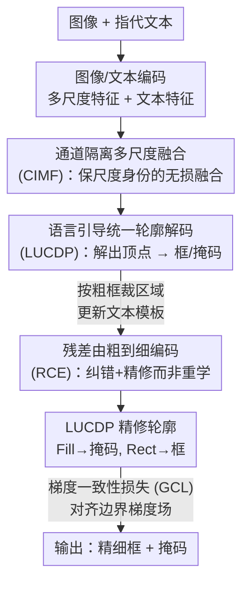

# RECS4R: Bridging Semantics and Geometry for Referring Remote Sensing Interpretation

**会议**: CVPR 2026  
**论文**: [CVF Open Access](https://openaccess.thecvf.com/content/CVPR2026/html/Chai_RECS4R_Bridging_Semantics_and_Geometry_for_Referring_Remote_Sensing_Interpretation_CVPR_2026_paper.html)  
**代码**: https://github.com/IPIU-XDU/RSFM （论文称将公开）  
**领域**: 遥感 / 多模态VLM  
**关键词**: 指代理解与分割, 遥感, 统一轮廓解码, 由粗到细, 多尺度融合

## 一句话总结
RECS4R 把遥感的指代检测（VG）和指代分割（RIS）统一成"解码一串语言条件下的多边形轮廓顶点"这一件事——轮廓的外接矩形当框、轮廓的填充区域当掩码——再叠加残差式由粗到细编码、通道隔离的多尺度融合和梯度域边界监督，在 RefDIOR、RRSIS-D、RefCOCO 系列等 6 个数据集上把 RECS 综合分数大幅刷到新高。

## 研究背景与动机
**领域现状**：遥感里的"指代表达理解与分割"（RECS）想让一个模型同时做两件事：根据一句自由文本，既框出目标（Visual Grounding, VG），又分割出目标掩码（Referring Image Segmentation, RIS）。主流做法是"多头"范式——共享骨干和多模态编码器，然后挂两个任务专属解码头，再加些跨任务协作模块（如 MCN 的一致性能量最大化）。

**现有痛点**：多头范式把框和掩码放在**两条互相分离的分支**里分别优化，几何（框关注位置）和语义（掩码关注纹理）的对齐被打散，对微小目标、非凸/细长/多部件这类复杂形状尤其伤——可学习性和可解释性都掉。即便是 Transformer 时代的"统一头"范式（如 PolyFormer 用 seq2seq 回归坐标序列），它回归的序列本质还是多个子任务的拼接，是"隐式多头"，优化方向仍然部分错位，无法在同一表示空间里共享结构知识。

**核心矛盾**：RECS 卡在一个**表示不充分**的瓶颈上——缺一个**统一且可约束的几何中间体**来桥接语义空间和几何空间。再叠加遥感特有的极端尺度（超大/微小目标）和复杂形状，现有的由粗到细策略既没榨干多尺度信息，粗阶段定位也不可靠，经典 FPN 式求和还会把多尺度语义糊在一起。

**本文目标**：让 RECS 同时做到"结构正确"（geometric/semantic 一致）和"感知充分"（极端尺度+复杂轮廓也吃得下），并且要轻量高效。

**核心 idea**：用**单一几何表示——多边形轮廓顶点**同时承载检测和分割，让"框=轮廓外接矩形、掩码=轮廓填充区域"在构造上天然一致；再围绕这个表示从"细化、再聚合、正则化"三个层面各补一块。作者把四块创新对应到 4 个 R：Representation(LUCDP)、Refinement(RCE)、Reaggregation(CIMF)、Regularization(GCL)。

## 方法详解

### 整体框架
RECS4R 建立在 PolyFormer 之上，采用**由粗到细两阶段**流程。粗阶段：输入图像 $I_c \in \mathbb{R}^{B\times3\times H\times W}$ 和文本 $L$ 分别过图像/文本编码器，得到多尺度视觉特征 $\{F^i_{global}\}_{i=1}^4$ 和文本特征 $T_c$；**CIMF** 把四个尺度无损融合为 $F'_{global}$（带 $T_c$ 的语义引导），送进多模态 Transformer，再由 **LUCDP** 自回归输出轮廓顶点序列 $P_c$，取 $\text{Rect}(P_c)$ 得到粗框 $B_c$。细阶段：按 $B_c$ 从原图裁出目标区域、resize 回原分辨率得 $I_f$，并用模板（"The large {类别} in the middle {方位} of the image"）更新文本为 $T_f$；细阶段走和粗阶段一样的管线，但视觉特征经 **RCE** 用粗阶段的 $F_{global}$ 和 $B_c$ 作残差增强，最后 LUCDP 输出精细轮廓 $P_f$，分别经 $\text{Fill}(P_f)$ 得掩码、$\text{Rect}(P_f)$ 得框。优化上加 **GCL** 强化边界、加粗阶段定位约束 $\mathcal{L}_{coarse}$ 在精修前先纠偏。

### 关键设计

**1. LUCDP：用一条语言条件的轮廓顶点流，同时解出框和掩码**

针对"多头/隐式多头让几何与语义分裂"的痛点，LUCDP 把解码目标统一成**轮廓顶点**这一个接口：解码层共享同一套表示，轮廓点的填充区域 $\text{Fill}(\cdot)$ 就是分割掩码，轮廓点的外接矩形 $\text{Rect}(\cdot)$ 就是检测框，于是"框"和"掩码"在构造上不可能不一致——几何与语义的一致性是被结构强制保证的，而不是靠额外的协作损失去拉。整个解码过程注入语言条件，强化"语言↔区域"对齐、降低指代歧义。作者点出两个额外好处：① 把定位风险从框的 4 个点**分摊到 $n$ 个轮廓点**，REC 定位更稳；② 这个接口可扩展，能在同一界面下对极端尺度和复杂形状施加约束与精修。消融里只加 LUCDP 就把 VG 的 mIoU 从 40.10% 拉到 78.63%，是四块里对"几何-语义优化冲突"最直接的解药。

**2. RCE：把细阶段从"从零重学"变成"在粗阶段先验上纠错+精修"**

针对"由粗到细里细阶段往往重新学一遍、粗阶段定位还不可靠"的痛点，RCE 把粗阶段的全局视觉-语言特征作为**残差**显式注入细阶段。先用粗框 $B_c$ 给全局特征 $F_{global}$ 加权，让模型聚焦目标；通道调制上用全局语义生成缩放 $\gamma$ 和偏移 $\beta$，对局部特征做 $f=(1+\gamma)\cdot F_{global}+\beta$；空间调制用一个注意力门按粗阶段语义线索选择性增强关键区域；再用一个轻量 cross-attention 把粗阶段特征对齐进局部表示；最后把空间调制特征 $F_{spatial}$、跨注意力增强特征 $F_{CA}$ 与原始局部特征 $F_{local}$ 做残差融合。配套的 $\mathcal{L}_{coarse}$ 把误差经残差路径传回细阶段，形成定位优化的闭环。这样细阶段做的是"修正+补细节"，而非推倒重来，消融显示它给 RIS 的 mIoU 带来 10.42% 提升，主要受益者是微小目标。

**3. CIMF：把每个尺度投到独立通道子空间，避免 FPN 式求和糊掉尺度身份**

针对"遥感极端尺度目标多、FPN 式求和/朴素拼接会稀释各尺度专属信息"的痛点，CIMF 先把四个尺度各自投影到固定维度 $C_m$ 的**专属通道子空间**，沿通道拼成 $4\times C_m$ 的特征图——尺度身份保留在通道维度里，从源头避免语义混淆、实现跨尺度的无损融合。再引入可学习的尺度权重和跨模态注意力，在语言语义和目标尺寸的**联合引导**下自适应挑选并增强不同尺度，于是超大和微小目标可以被同一模块兼顾。消融里加入 CIMF 让 RECS 综合 Sum 大幅抬升，验证了"保身份再选择"比"先混合"更适合尺度极端的遥感场景。

**4. GCL：在梯度域对齐预测与真值的边界场，补 IoU/CE 对边缘方向的不敏感**

针对"IoU/CE 损失对边缘方向不敏感、复杂轮廓（高曲率、非凸、细长）画不锐"的痛点，GCL 把监督搬到**梯度域**。对由解码轮廓得到的预测掩码 $M^p$ 和真值掩码 $M^g$，用固定 Sobel 算子 $E_x,E_y$ 卷积算梯度幅值 $\nabla M=\sqrt{(E_x*M)^2+(E_y*M)^2}$，损失为 $\mathcal{L}_{gcl}=\lVert\nabla M^p-\nabla M^g\rVert_1$。关键在于梯度能经 SoftRas 软光栅化从掩码反传回顶点 $P_f$，驱动解码器去对齐边缘强度。它在高曲率/非凸/细长结构上收益显著，消融中给 RIS 的 oIoU 带来最大单项提升，说明显式边界约束直接提升了轮廓的锐度与保真度。

### 损失函数 / 训练策略
完整损失为 $\mathcal{L}=\mathcal{L}_{cls}+\lambda_1\mathcal{L}^{\ell_1}_{reg}+\lambda_2\mathcal{L}^{smooth\text{-}\ell_2}_{reg}+\lambda_3\mathcal{L}_{coarse}+\lambda_4\mathcal{L}_{gcl}$。其中 $\mathcal{L}_{cls}$ 分类每个解码 token（分隔符/起始/结束/坐标），$\ell_1$ 与 smooth-$\ell_2$ 共同监督顶点序列回归（smooth-$\ell_2$ 近零处二次、大误差处线性，抑制离群点），$\mathcal{L}_{coarse}$ 监督粗框纠偏。训练设 $\lambda_1:\lambda_2:\lambda_3:\lambda_4=1:1:0.1:0.1$ 让各损失同量级；batch size 4，训练 50 epoch，Adam（$\beta_1=0.9,\beta_2=0.999$，weight decay 0.01），学习率 warmup 到 $5\times10^{-4}$；先在 Visual Genome/RefCOCO 系列/Flickr30k-entities 上预训练初始化。图像编码器支持 Swin-Transformer、ConvNeXt、VMamba 三类骨干，文本编码器用 BERT，4 卡 V100 训练。

## 实验关键数据

### 主实验
在遥感 RefDIOR 测试集上与 SOTA 对比（Swin-Tiny 骨干，oIoU/mIoU，Sum 为 VG+RIS 两任务 oIoU+mIoU 之和）：

| 方法 | VG oIoU | VG mIoU | RIS oIoU | RIS mIoU | RECS Sum | FLOPs |
|------|---------|---------|----------|----------|----------|-------|
| PolyFormer (CVPR'23, baseline) | 61.59 | 40.10 | 82.40 | 55.30 | 239.39 | 49.53G |
| CCFormer (GRSM'25, 前 SOTA) | 82.39 | 74.09 | 80.89 | 70.96 | 308.33 | 119.39G |
| **RECS4R** | **94.69** | **82.68** | **90.01** | **74.45** | **341.83** | **45.37G** |

RECS4R 不仅 Sum 比 CCFormer 高 33.5，而且 FLOPs（45.37G）反而比 CCFormer（119.39G）更省。换 ConvNeXt-Tiny 骨干时 Sum 仍达 346.36，VMamba-Tiny 达 339.64，三种骨干都稳。

自然域 RefCOCO 系列 VG 任务（Precision@0.5，Swin-Tiny）也全面超越更重的 PolyFormer-Large：

| 数据集 | PolyFormer-L (val) | RECS4R Swin-T (val) | 提升 |
|--------|--------------------|--------------------|------|
| RefCOCO | 90.38 | 94.24 | +3.86 |
| RefCOCO+ | 84.98 | 94.51 | +9.53 |
| RefCOCOg | 81.5 | 92.85 | +11.35 |

### 消融实验
RefDIOR 测试集，PolyFormer 为 baseline，逐块加入 4R 组件（单加 / 全加）：

| LUCDP | RCE | CIMF | GCL | VG mIoU | RIS mIoU | RECS Sum |
|:-:|:-:|:-:|:-:|---------|----------|----------|
| ✗ | ✗ | ✗ | ✗ | 40.10 | 55.30 | 239.39 |
| ✓ | ✗ | ✗ | ✗ | 78.63 | 60.86 | 318.49 |
| ✗ | ✓ | ✗ | ✗ | 42.90 | 65.72 | 260.34 |
| ✗ | ✗ | ✓ | ✗ | 45.62 | 62.11 | 264.54 |
| ✗ | ✗ | ✗ | ✓ | 48.09 | 60.78 | 266.33 |
| ✓ | ✓ | ✓ | ✓ | **82.68** | **74.45** | **341.83** |

解码范式消融（Table 5）进一步说明轮廓表示的价值：在 polygon-based 表示下，Unified Head 的 Sum（341.83）显著高于 Multi Head（290.19）；而在 mask-based 表示下两者差距很小（306.79 vs 308.33）——说明"统一头"只有配上"多边形轮廓"这个统一几何中间体才真正发挥作用。

### 关键发现
- **LUCDP 是地基，贡献最大**：单加它就把 VG mIoU 从 40.10% 提到 78.63%，因为它直接消除了几何-语义的优化方向冲突；其余三块都是在这个统一轮廓表示上做增益。
- **每块各司其职**：RCE 主补 RIS（微小目标，+10.42% RIS mIoU），CIMF 主补整体 Sum（极端尺度），GCL 主补 RIS oIoU（边界锐度）。
- **效率反超**：在比 CCFormer 省一半多 FLOPs 的情况下还全面领先，说明"统一表示"既涨点又省参，不是靠堆算力。

## 亮点与洞察
- **"框=矩形外接、掩码=填充"的统一轮廓表示**很巧：它把跨任务一致性从"额外损失去拉"变成"结构上不可能不一致"，是把约束写进表示本身，而不是写进 loss——这种思路可迁移到任何需要同时输出多种几何形态（框/掩码/关键点）的任务。
- **把定位风险从 4 个框点分摊到 $n$ 个轮廓点**是个反直觉但合理的稳健性来源：多点冗余对遥感里抖动/遮挡更鲁棒。
- **GCL 把监督搬进梯度域 + SoftRas 反传回顶点**，绕过了 IoU/CE 对边缘方向不敏感的老问题，对细长/非凸结构这种遥感常见形态特别对症。

## 局限与展望
- 论文未在正文充分讨论失败案例与推理时延的绝对值（只给 FLOPs），轮廓顶点数 $n$ 的选取、自回归解码的实际速度对实时遥感应用的影响存疑 ⚠️。
- 细阶段依赖粗框裁剪，若粗阶段严重漏检/错框，残差先验可能把误差也带进细阶段——闭环纠偏对"粗阶段彻底失败"的情形覆盖多少未深入分析。
- 多边形轮廓对**带孔洞或多连通**目标（如环形、断裂结构）的表达能力有天然局限，单一外轮廓难以刻画内部空洞，遥感里这类目标如何处理值得后续验证。

## 相关工作与启发
- **vs PolyFormer**：同样用多边形顶点序列，但 PolyFormer 的序列本质是多子任务拼接的"隐式多头"，优化方向仍部分错位；RECS4R 用单一语言条件轮廓真正统一了框与掩码，并补上 RCE/CIMF/GCL 三块，自然/遥感数据集上全面超越更大的 PolyFormer-L。
- **vs CCFormer（前 SOTA）**：CCFormer 走多头+跨任务 Transformer 路线，框和掩码仍分支输出；RECS4R 用统一轮廓表示，在 RefDIOR 上 Sum 高 33.5 且 FLOPs 仅其约 1/3。
- **vs MCN / WeakMCN 等多头 RECS**：它们靠一致性能量/知识迁移在解码后"拉"一致性，RECS4R 把一致性前移到表示构造层面，从源头免去跨头冲突。

## 评分
- 新颖性: ⭐⭐⭐⭐⭐ 用统一轮廓表示把 RECS 的几何-语义一致性写进结构，配 4R 系统性补强，思路清晰且有效。
- 实验充分度: ⭐⭐⭐⭐⭐ 6 个数据集 + 3 类骨干 + 逐块/解码范式双重消融，覆盖遥感与自然域。
- 写作质量: ⭐⭐⭐⭐ 4R 框架叙事清楚，但缓存中部分公式/图注 OCR 受损，细节需对照原文。
- 价值: ⭐⭐⭐⭐⭐ 既涨点又省算力的统一表示，对遥感多任务指代解释有实用与方法论双重价值。

<!-- RELATED:START -->

## 相关论文

- [\[CVPR 2026\] Sparsely Timing the Change: A Spiking Temporal Framework for Remote Sensing Interpretation](sparsely_timing_the_change_a_spiking_temporal_framework_for_remote_sensing_inter.md)
- [\[CVPR 2026\] Geo2: Geometry-Guided Cross-view Geo-Localization and Image Synthesis](geo2_geometry-guided_cross-view_geo-localization_and_image_synthesis.md)
- [\[CVPR 2026\] Fast Kernel-Space Diffusion for Remote Sensing Pansharpening](fast_kernel-space_diffusion_for_remote_sensing_pansharpening.md)
- [\[CVPR 2026\] GeoCoT: Towards Reliable Remote Sensing Reasoning with Manifold Perspective](geocot_towards_reliable_remote_sensing_reasoning_with_manifold_perspective.md)
- [\[CVPR 2026\] Robust Remote Sensing Image–Text Retrieval with Noisy Correspondence](robust_remote_sensing_image-text_retrieval_with_noisy_correspondence.md)

<!-- RELATED:END -->
