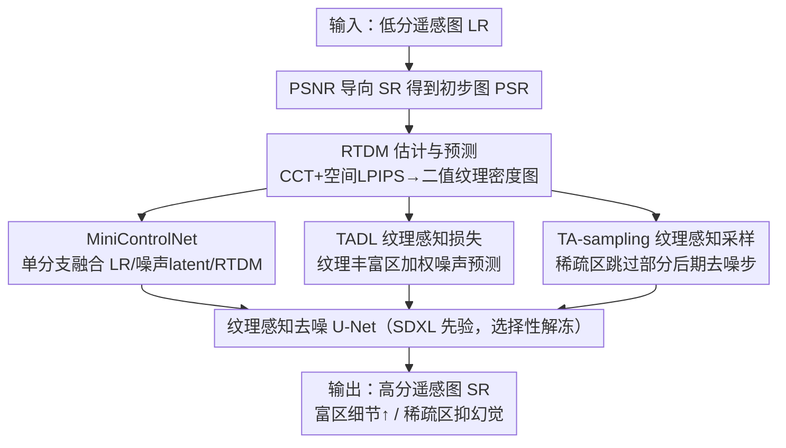

# Remote Sensing Image Super-Resolution for Imbalanced Textures: A Texture-Aware Diffusion Framework

**会议**: CVPR 2026  
**论文**: [CVF Open Access](https://openaccess.thecvf.com/content/CVPR2026/html/Zhang_Remote_Sensing_Image_Super-Resolution_for_Imbalanced_Textures_A_Texture-Aware_Diffusion_CVPR_2026_paper.html)  
**代码**: https://github.com/ZezFuture/TexAdiff  
**领域**: 遥感图像 / 超分辨率 / 扩散模型  
**关键词**: 遥感超分、纹理不均衡、扩散先验、相对纹理密度图、纹理感知采样

## 一句话总结
针对遥感图像"纹理全局随机、局部成团，导致纹理极度不均衡"这一与自然图像不同的特性，本文提出 TexADiff：先估计一张相对纹理密度图（RTDM）刻画纹理分布，再把它当作"空间条件 + 损失调制 + 采样调度"三管齐下地注入扩散超分流程，让模型在纹理丰富区生成更多真实高频细节、在纹理稀疏区抑制幻觉，从而在多数遥感基准上取得更优的感知指标。

## 研究背景与动机

**领域现状**：遥感图像超分（RSISR）要从低分输入重建高分图像，直接服务目标检测、语义分割、变化检测等下游任务。近期把预训练文生图（T2I）扩散先验引入超分，在自然图像上能生成锐利逼真的细节，是处理未知退化的有力方向。

**现有痛点**：遥感图像有一个自然图像没有的特性——**空间异质性极强**：少量纹理丰富区（路网、建成区）承载了绝大部分高频能量，而大片纹理稀疏区（水体、雪地、农田）结构简单。纹理分布高度不均衡且局部成团，且这些团块位置随场景而变、没有全局位置先验。现有扩散 RSISR 却对全图施加**统一的复原强度**，于是出现两种可预测的失败：在纹理稀疏区"用力过猛"，凭空造出冗余/幻觉细节引入伪影（如水面条纹）；在纹理丰富区"用力不足"，重建模糊、细节丢失。

**核心矛盾**：遥感图像内部"哪里该多生成细节、哪里该少生成"是空间变化的，而空间不变（spatially-invariant）的统一处理无法识别区域纹理差异、也无法自适应分配模型的表征能力。

**本文目标**：让扩散超分具备"纹理感知"能力——能识别低分图里的区域纹理差异，并据此自适应地把生成能力分配到真正需要细节的地方。

**切入角度**：用一张能量化逐像素纹理密度的图（RTDM）作为统一的纹理先验，把"哪里纹理多"这件事显式告诉扩散模型，并在条件、损失、采样三个环节同时利用它。

**核心 idea**：用相对纹理密度图 RTDM 三处协同地"指挥"扩散过程——既当空间条件、又当损失调制项、还当采样步数调度器，从而在纹理丰富区强化细节、在稀疏区抑制幻觉。

## 方法详解

### 整体框架
TexADiff 建在预训练 T2I 扩散先验（SDXL）之上，由三块组成：① **RTDM 估计与预测模块**——训练时从 HR-LR 对直接估计纹理密度图，推理时因为没有 HR，改用一个预测网络从 LR/PSR 预测 RTDM；② **轻量 MiniControlNet**——把 LR、噪声 latent、RTDM 等多个异质条件在单一高效分支里融合注入，避免给每个条件各配一个 ControlNet 的参数/显存膨胀；③ **纹理感知去噪扩散模型**——用 RTDM 同时做空间条件、损失调制（TADL）和采样调度（TA-sampling）。整条流程：LR 先过一个 PSNR 导向的超分得到去噪平滑的初步图 PSR，再据 PSR 与 LR 预测 RTDM，二值化后连同 LR、噪声 latent 经 MiniControlNet 注入主干 U-Net，并在训练损失和采样步数上按纹理密度区别对待，最终输出 SR 图。

### 关键设计

**1. RTDM 相对纹理密度图：用统计 + 感知双判据量化"哪里纹理多"**

这是整套方法的先验来源，直接对应"模型分不清区域纹理差异"的痛点。RTDM 捕捉 HR $I_{HR}$ 与 LR $I_{LR}$ 之间的局部纹理密度差异，也就是退化过程中丢失的高频细节，从而刻画目标 SR 图的逐像素纹理分布。训练时因为有 HR，先用 PSNR 导向超分得到去噪、在纹理丰富区偏过平滑的初步图 $I_{PSR}$，再用两个互补判据：一是基于 SSIM 的局部对比一致性项 $M_{CCT}=\mathrm{CCT}(I_{PSR},I_{HR})$（对退化局部纹理敏感），二是空间 LPIPS 响应 $M_{SL}$（捕捉感知差异、对各向异性纹理鲁棒），组合成 $M=(1-M_{SL})\cdot M_{CCT}$，$M$ 越低代表纹理密度差异越强。由于连续值 $M$ 直接引导会让输出不稳定，作者按阈值 $\tau$（每个 batch 从 $[0.35,0.4]$ 随机采）二值化得 $M_b$，再经形态学腐蚀/膨胀/去小连通域后处理、8× 最大池化下采到 latent 分辨率，得到最终二值 RTDM $\hat M_b$。推理时 HR 不可得，改用一个 RTDM 预测网络：以 LR 与 PSR 为输入、分支编码 + 门控机制选择性送入 U-Net 解码器，以连续 $M$ 作为伪标签用 L1 监督，输出后再用同样方式二值化。预测准确率在四个数据集为 71%–80%。

**2. MiniControlNet：单分支高效融合多个异质条件**

引入 RTDM 后，模型要同时吃 LR 图和 RTDM 两类条件，痛点是常规做法给每个条件各配一个 ControlNet 会让参数、推理延迟和显存都暴涨。受 ControlNext 启发，本文设计轻量 MiniControlNet：用并行条件嵌入分支分别编码不同条件，配时间感知残差块（接收 timestep）和空间特征变换层（SFT）把 RTDM 特征注入主特征流，并用 Cross Normalization 把融合后的控制特征与主干特征对齐、在首个 U-Net block 之后注入控制。整个控制分支被压到仅约 20M 参数，相对庞大的去噪 U-Net 几乎可忽略。为补偿这种压缩带来的引导能力不足、并弥合"自然图先验 ↔ 遥感数据"的域差，作者**选择性解冻** U-Net 的一部分参数（首个下采样 block + 全部上采样 block），而非全冻或全调。

**3. 纹理感知去噪：把 RTDM 同时用作损失调制(TADL)与采样调度(TA-sampling)**

光把 RTDM 当条件还不够，本文进一步在训练和采样两端利用它。训练端提出**纹理感知扩散损失 TADL**：在纹理丰富区给噪声预测误差更高权重，$L_{TADL}=\mathbb{E}\big[(1+\alpha\hat M_b)\odot\|\epsilon-\epsilon_\theta(z_t,c,t,I_{LR},\hat M_b)\|^2\big]$（$\alpha=1$），逼模型把表征能力分配到高纹理区——这建立在"像素空间的空间结构在 VAE 编码后的 latent 空间基本保留"的观察上，因此 latent 域的空间调制可行有效。采样端提出**纹理感知动态采样调度 TA-sampling**：扩散早期步搭全局布局、后期步注入高频细节，而纹理稀疏区不需要那么多细节，于是在预设的后期时间区间（如 $t\in[100,500]$）对稀疏区 latent 采用隔步更新——这些被 $\hat M_b$ 标记的稀疏区 latent 每隔一步才更新一次，中间步保持不变，等于暂停其细化，与全局更新交替进行。消融显示这种步数分配让 LPIPS/DISTS 进一步变好，说明扩散模型受益于"合理的步数分配"而非一味增加去噪步数。

### 损失函数 / 训练策略
主干训练用 TADL（上式）。RTDM 预测网络单独用 L1（对连续 $M$ 伪标签）训练。整体在约 30 万张遥感图（LoveDA-train + DOTA-train + MillionAID 子集）上训 30,000 步、batch size 256，LR 用 Real-ESRGAN 退化管线合成（与 FaithDiff 一致），所有对比方法在同一数据/退化设置下重训以求公平。

## 实验关键数据

### 主实验
合成评测集为 AID、DOTA-Test、LoveDA-Val、RSC11，指标含参考型（PSNR/SSIM/LPIPS/DISTS）与无参考型（NIQE/BRISQUE/CLIP-IQA+）；真实集为 SIRI-WHU（无 GT，只用无参考指标 + 用户研究）。下表摘录关键感知指标（本文报告两个推理阈值，取代表值）：

| 数据集 | 指标 | 本文 | 次优 | 说明 |
|--------|------|------|------|------|
| LoveDA-Val | LPIPS↓ | **0.3253** | 0.3548 (PASD) | 参考型感知指标领先 |
| LoveDA-Val | DISTS↓ | **0.1751** | 0.1594 (PASD)* | *PASD 略低，本文次优 |
| RSC11 | LPIPS↓ | **0.4693** | 0.4861 (FaithDiff) | — |
| RSC11 | DISTS↓ | **0.2364** | 0.2586 (FaithDiff) | — |
| AID | DISTS↓ | **0.1939** | 0.2065 (FaithDiff) | — |
| SIRI-WHU(真实) | 用户研究↑ | **46.4%** | 36.7% (PASD) | 18 位遥感专家盲选最清晰最真实 |

注：扩散类方法普遍 PSNR/SSIM 偏低（牺牲像素对齐换感知真实），故本文在 LPIPS/DISTS 等感知指标上"持续排进前二"是主要卖点，而非 PSNR。⚠️ 无参考指标（NIQE/BRISQUE/CLIP-IQA+）为自然图设计、对遥感未必适用，作者只当辅助参考。

### 消融实验
在 AID 上逐策略叠加（baseline 仅扩散先验）：

| RTDM 条件 | TADL | TA-sampling | PSNR↑ | LPIPS↓ | DISTS↓ |
|------|------|------|-------|--------|--------|
| – | – | – | 21.86 | 0.4173 | 0.2042 |
| ✓ | – | – | 22.58 | 0.4023 | 0.2049 |
| ✓ | – | ✓ | 22.59 | 0.4001 | 0.2039 |
| ✓ | ✓ | – | 22.78 | 0.3887 | 0.2044 |
| ✓ | ✓ | ✓ | 22.78 | 0.3883 | 0.2038 |

RTDM 掩码变体（推理时）：

| 掩码变体 | PSNR↑ | LPIPS↓ | DISTS↓ | 说明 |
|------|-------|--------|--------|------|
| 全 1（全富） | 21.82 | 0.4098 | 0.2059 | 全图当纹理丰富 |
| 全 0（全稀疏） | 23.70 | 0.4205 | 0.2142 | PSNR 最高但感知差 |
| 反转 RTDM | 23.16 | 0.4305 | 0.2115 | 富/稀疏弄反，感知明显变差 |
| 预测 RTDM（本文） | 22.62 | 0.3823 | 0.1953 | 感知最佳 |
| GT RTDM（oracle） | 22.84 | 0.3493 | 0.1831 | 上界，预测越准越好 |

### 关键发现
- **三策略累计生效**：RTDM 条件 → +TADL → +TA-sampling 逐步把 PSNR 从 21.86 提到 22.78、LPIPS 从 0.4173 降到 0.3883，TADL 对感知质量贡献最明显。
- **采样步数应"按需分配"而非一味增多**：TA-sampling 在稀疏区减少采样步反而让 LPIPS/DISTS 更好，挑战了"步数越多越好"的直觉。
- **RTDM 必须"指对方向"**：把预测 RTDM 反转（富/稀疏弄反）导致感知指标显著下降，反证了正确纹理引导的有效性；全 0 掩码 PSNR 最高但感知差，说明零值在抑制细节合成、偏向像素保真。
- **下游获益**：在 LoveDA 用 DeepLabV3+ 做语义分割，本文 mIoU 44.06 / OA 64.57 / mF1 60.27 全面优于 PASD、FaithDiff，重建质量提升直接转化为下游收益。
- **更省**：可训练参数仅 1.3B（FaithDiff 2.6B），总参数同为 2.7B，用更少可训练参数超过全量微调的 FaithDiff（推理时间 9.0s vs 7.8s，略慢）。

## 亮点与洞察
- **"一图三用"的设计很经济**：同一张 RTDM 同时服务条件注入、损失加权、采样调度，三处协同把"空间异质"这件事贯穿到扩散全流程，而不是只在某一环打补丁。
- **训练/推理 RTDM 解耦**：训练用 HR 直接估计、推理用预测网络补位，巧妙绕开"推理时没有 HR"的死结，是可复用的模式。
- **把扩散步数当资源做空间分配**：TA-sampling 提出"稀疏区隔步更新"，揭示步数应按区域纹理需求分配，对扩散加速/质量权衡有启发。
- **MiniControlNet 用 20M 参数融合多条件**，相比多 ControlNet 大幅省参，是落地友好的工程点。

## 局限与展望
- 受算力限制，消融用了更小 batch、更少迭代，消融结论的强度需打折看待（作者明示）。
- 无参考指标（NIQE/BRISQUE/CLIP-IQA+）源自自然图域，对遥感未必可靠，缺乏公认 RSISR 基准，评测主要靠参考型感知指标 + 用户研究，客观性有限。
- RTDM 预测准确率仅 71%–80%，oracle（GT RTDM）与预测之间仍有感知差距，预测网络是当前瓶颈，作者也指出其改进空间。
- 推理略慢于 FaithDiff（9.0s vs 7.8s @1024²），多出的 RTDM 预测与交替采样有额外开销。

## 相关工作与启发
- **vs FaithDiff / PASD（同基于 T2I 扩散先验）**：它们对全图统一复原强度，稀疏区造幻觉、富区欠细节；本文用 RTDM 做空间自适应，在 LPIPS/DISTS 与用户研究上更优，且可训练参数更少。
- **vs ResShiftL / SRDiff（无生成先验的扩散超分）**：缺预训练生成先验，细节生成能力受限、结构易偏离真实几何；本文站在 SDXL 先验上并补纹理感知。
- **vs Real-ESRGAN（GAN 超分）**：GAN 易模式坍塌、纹理过合成或结构不一致；扩散 + RTDM 在结构一致与真实细节上更稳。
- **vs ControlNet/Multi-ControlNet**：多条件各配一个控制网代价大，本文 MiniControlNet 单分支融合，借鉴 ControlNext 思路把控制分支压到 20M。

## 评分
- 新颖性: ⭐⭐⭐⭐ 把遥感纹理不均衡显式建成 RTDM 并三处协同注入扩散，切入点新颖具体
- 实验充分度: ⭐⭐⭐⭐ 四合成+一真实数据集、多指标、用户研究、下游分割、丰富消融，但消融受算力限制缩水
- 写作质量: ⭐⭐⭐⭐ 动机—方法—实验链条清晰，图示完整，RTDM 推理流程讲得明白
- 价值: ⭐⭐⭐⭐ 思路（按纹理密度做空间自适应生成）可迁移到其他异质场景超分，且开源

<!-- RELATED:START -->

## 相关论文

- [\[CVPR 2026\] Sparsely Timing the Change: A Spiking Temporal Framework for Remote Sensing Interpretation](sparsely_timing_the_change_a_spiking_temporal_framework_for_remote_sensing_inter.md)
- [\[CVPR 2026\] Fast Kernel-Space Diffusion for Remote Sensing Pansharpening](fast_kernel-space_diffusion_for_remote_sensing_pansharpening.md)
- [\[CVPR 2026\] HySeg: Learning Generative Priors for Structure-Aware Remote Sensing Segmentation](hyseg_learning_generative_priors_for_structure-aware_remote_sensing_segmentation.md)
- [\[CVPR 2026\] Robust Remote Sensing Image–Text Retrieval with Noisy Correspondence](robust_remote_sensing_image-text_retrieval_with_noisy_correspondence.md)
- [\[CVPR 2026\] HarmoniDiff-RS: Training-Free Diffusion Harmonization for Satellite Image Composition](harmonidiff-rs_training-free_diffusion_harmonization_for_satellite_image_composi.md)

<!-- RELATED:END -->
