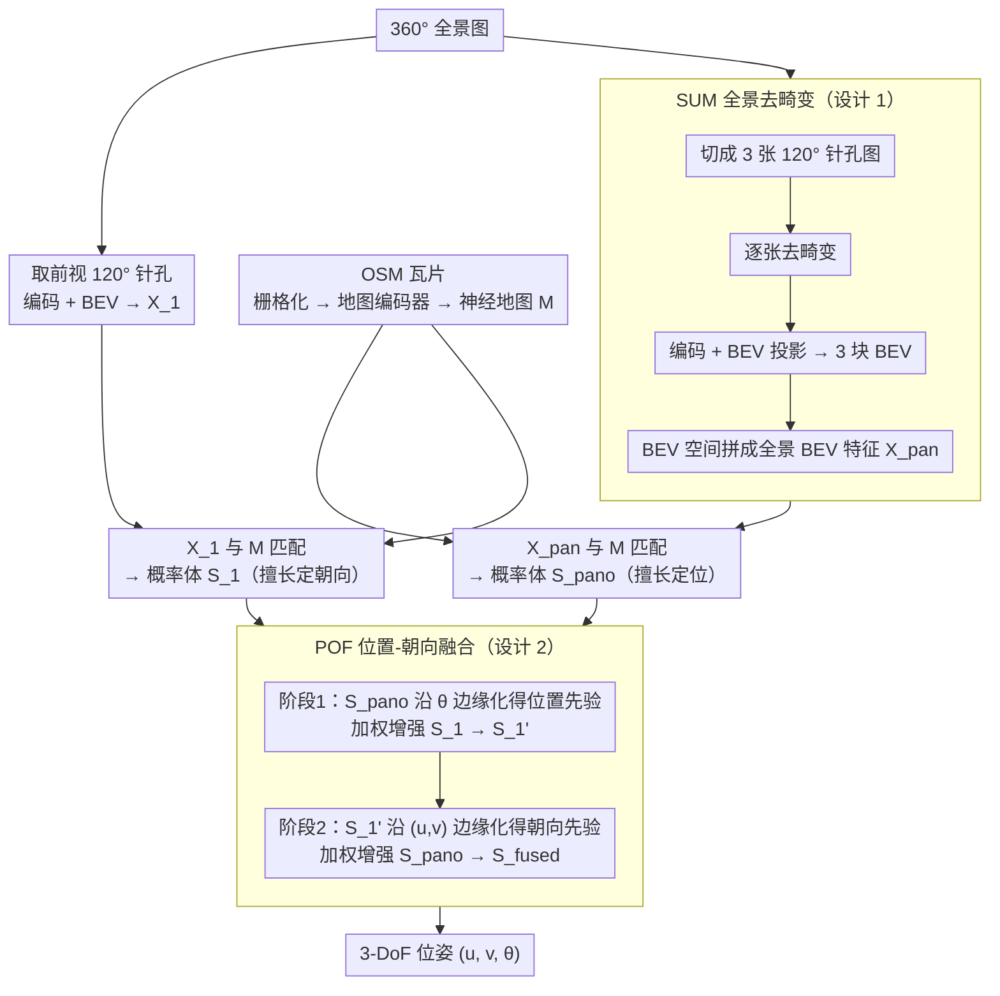

# RHO: Robust Holistic OSM-Based Metric Cross-View Geo-Localization

**会议**: CVPR 2026  
**arXiv**: [2603.27758](https://arxiv.org/abs/2603.27758)  
**代码**: [https://github.com/InSAI-Lab/RHO](https://github.com/InSAI-Lab/RHO)  
**领域**: Remote Sensing / Visual Localization  
**关键词**: Cross-View Geo-Localization, OpenStreetMap, Panorama, Robustness, BEV

## 一句话总结

提出首个面向恶劣天气和传感器噪声的OSM-based度量级跨视角定位基准CV-RHO（270万+ 图像），并设计双分支Pin-Pan架构RHO模型，结合全景去畸变（SUM）和位置-朝向融合（POF）机制，在多种退化条件下将定位性能提升高达20%。

## 研究背景与动机

跨视角地理定位（CVGL）是计算机视觉的基础任务，可分为大范围检索（LCVGL）和度量级精细定位（MCVGL）两个方向。MCVGL从粗糙GPS先验出发、通过匹配地面-卫星图像确定米级位置和朝向，在自动驾驶和遥感中有重要价值。

然而，现有研究存在三个关键不足：

**鲁棒性缺失**：已有MCVGL方法几乎全部假设理想光照和天气条件，但真实场景中雨、雪、雾、夜间等退化条件普遍存在。作者实验表明，在理想条件训练的OrienterNet在退化条件下Position Recall大幅下降（平均-8.22%@1m）。

**全景信息未利用**：相比针孔图像，360° 全景图提供了更丰富的视觉信息，有利于位置和朝向的估计，但全景图直接输入存在严重畸变问题。

**OSM优势未充分发挥**：OpenStreetMap相比卫星图更新更频繁，存储开销仅为卫星图的1/15（4.8MB/km² vs 75MB/km²），但尚无大规模OSM-MCVGL鲁棒性基准。

## 方法详解

### 整体框架

RHO要解决的是「在恶劣天气和传感器噪声下，仅凭一张地面图和一块OpenStreetMap瓦片，把相机定位到米级位置和度级朝向」。它没有沿用单一图像源，而是同时吃下360°全景和120°针孔两路输入，做成一个双分支的Pin-Pan架构。OSM瓦片先栅格化再过地图编码器得到神经地图 $M$，作为两路共享的匹配底图。全景分支在SUM去畸变后过「编码 → BEV投影」、和 $M$ 匹配得到概率体 $S_{pano}$（擅长定位）；针孔分支取前视120°图、同样编码-BEV-匹配得到 $S_1$（擅长定朝向）。两个概率体都覆盖位置和朝向的三维 $(u, v, \theta)$，最后由POF模块把它们融成一个 $S_{fused}$，读出最终的3-DoF相机位姿。之所以要两路并行，是因为全景和针孔在「定位」和「定朝向」上各有所长（见下文POF），单独用哪一路都偏科。

### 关键设计

**1. Split-Undistort-Merge（SUM）：把全景图拆成针孔再拼回去，绕开等矩投影的畸变**

全景图能看满360°、信息最全，但直接喂进网络几乎没法用——作者实测把原始360°等矩全景图丢给OrienterNet，PR@1m只有3.79%，反而远低于普通针孔版本的21.83%，因为等矩投影把场景拉得严重变形，BEV投影学不到正确的几何。SUM的做法很直白：先把一张全景图按视角切成3张120°的针孔图（覆盖0°–120°、120°–240°、240°–360°），逐张做标准的全景→针孔去畸变，再各自过图像编码器和BEV投影得到3块BEV特征，最后在BEV空间里拼回一张完整的360° BEV特征图。关键在于它不引入任何新参数、不需要额外训练，只是把「畸变的全景」换成「三块无畸变针孔的几何拼接」，让后续匹配在正确的鸟瞰几何上进行——这一步是全景分支能跑起来的前提。

**2. Position-Orientation Fusion（POF）：让全景管定位、针孔管朝向，双向互注**

为什么要分工？作者用Shannon熵给了个信息论解释：全景图视野绕一圈是封闭的，相机原地旋转时看到的内容不变，熵在旋转下保持不变，所以它对「我在哪」更敏感、适合估位置；针孔图视野有限，一转朝向看到的东西就变，熵随旋转而变，所以它对「我朝哪」更敏感、适合估朝向。POF据此设计了两阶段的互相增强。第一阶段先用LogSumExp把全景概率体沿朝向维 $\theta$ 边缘化，压成一张2D空间先验，再拿它去加权增强针孔概率体的位置部分（公式2–5）——等于让擅长定位的全景去补针孔的位置短板。第二阶段反过来：把刚增强过的针孔概率体沿空间维 $(u,v)$ 边缘化得到朝向先验，再去加权增强全景概率体的朝向部分（公式6–8）。两次注入各带一个可学习权重 $\alpha$、$\beta$ 控制融合强度。相比简单把两个概率体拼接或取单分支，POF让两路把各自的强项定向喂给对方的弱项，消融里它在SUM之上还能再加约+3.5 PR@3m / +3.6 OR@3°。

**3. CV-RHO 数据集：首个大规模OSM-MCVGL鲁棒性基准**

这条针对的是「现有MCVGL几乎都假设理想天气、又没有OSM版鲁棒性基准」的空白。CV-RHO覆盖美德法三国的7个城市，含11.4万张全景图、34.2万张针孔图，并系统地造出8种退化变体：雨、雪、雾、夜间这4种语义级退化用FLUX.1 Kontext生成（光这一项就烧了30.7k A100 GPU小时），过曝、欠曝、运动模糊这3种传感器级退化用OpenCV合成，连同clean版本总计272万+图像。为检验泛化，还额外收了跨区域测试集（Mount Vernon）和Sim2Real测试集，用来回答「合成退化上训练的模型能不能迁到真实退化场景」。选OSM而非卫星图，是因为它更新更勤、存储只要卫星图的约1/15（4.8MB/km² vs 75MB/km²），更适合做大规模、可持续维护的定位底图。

### 损失函数 / 训练策略

- 训练目标：最大化3-DoF相机位姿的概率估计，使用NLL loss
- 训练资源：12×A100 GPU
- 旋转角采样：训练64个、评估256个
- 批大小36，学习率2e-5，使用Adam优化器 + ReduceLROnPlateau调度器
- 最佳模型出现在2-4 epoch（约20k-40k步）

## 实验关键数据

### 主实验

**Clean条件** (Table 3)

| 方法 | FoV | PR@1m | PR@3m | PR@5m | OR@1° | OR@3° | OR@5° |
|------|-----|-------|-------|-------|-------|-------|-------|
| OrienterNet | 90° | 18.02 | 58.37 | 71.04 | 27.72 | 63.86 | 77.50 |
| OrienterNet | 120° | 21.83 | 66.16 | 78.03 | 35.02 | 74.89 | 85.62 |
| OrienterNet | 360° | 3.79 | 19.35 | 28.78 | 10.29 | 28.43 | 36.87 |
| **RHO** | **360°** | **24.59** | **73.55** | **84.36** | **43.46** | **83.61** | **90.44** |

**退化条件鲁棒性** (Table 4, Clean训→各条件测)

| 方法 | 训练/平均退化 | PR@1m下降 | OR@1°下降 |
|------|-------------|----------|----------|
| OrienterNet | Clean→AV | -8.22 | -10.98 |
| **RHO** | **Clean→AV** | **-5.97** | **-9.95** |

**退化条件训→测** (Table 4下半)

| 方法 | 匹配条件训→测/平均退化 | PR@1m | OR@1° |
|------|----------------------|-------|-------|
| OrienterNet | AV→AV | -2.04 | -1.82 |
| **RHO** | **AV→AV** | **+0.03** | **-1.10** |

RHO在匹配训测条件下几乎不退化，PR@1m甚至略有提升。

### 消融实验

| 配置 | PR@3m | OR@3° | 说明 |
|------|-------|-------|------|
| 仅针孔分支 | ~66 | ~75 | 基线OrienterNet 120° |
| 仅全景（无SUM） | ~19 | ~28 | 畸变严重 |
| 全景+SUM | ~70 | ~80 | SUM有效解决畸变 |
| 全景+SUM+POF | **73.55** | **83.61** | POF进一步增强+3.5/+3.6 |

### 关键发现

- 直接使用360°全景图训练效果极差（PR@1m仅3.79%），SUM模块是全景分支工作的关键
- POF双阶段融合显著优于简单的概率体拼接或单分支方案
- 在匹配退化条件训练后，RHO的平均退化接近0（PR@1m: +0.03），展现极强鲁棒性
- 运动模糊是最难处理的退化类型，即使RHO在MB条件下的退化也最为显著

## 亮点与洞察

1. **信息论驱动的架构设计**：用Shannon熵分析全景/针孔图在位置和朝向估计上的互补性，为双分支设计提供了理论依据
2. **轻量高效的畸变处理**：SUM模块无须额外训练，利用标准的全景→针孔投影解决畸变问题
3. **首个OSM-MCVGL鲁棒性基准**：CV-RHO填补了该领域的数据空白，对推动鲁棒定位研究有重要意义
4. **Sim2Real可行性**：利用FLUX.1 Kontext生成的退化图像训练后，模型在真实退化场景中的零样本测试也表现良好

## 局限与展望

- 运动模糊条件下性能下降最大，提示需要针对性的数据增强或特征抗模糊设计
- SUM将全景分为3个120°视图是固定设计，可探索自适应分割策略
- 合成退化与真实退化仍有域差距，可引入更多domain adaptation手段
- 未讨论计算开销，双分支架构可能限制实时性
- OSM数据更新虽快但并非实时，在施工区域等快速变化场景仍可能失效

## 相关工作与启发

- 本文是OrienterNet的鲁棒化和全景化扩展，将单分支针孔→双分支全景+针孔
- POF的双阶段互注入思路可迁移至其他多模态概率融合场景
- CV-RHO数据集的构建流程（FLUX.1 Kontext + OpenCV模拟退化）可为其他视觉鲁棒性基准提供参考

## 评分

- **新颖性**: ⭐⭐⭐⭐ — 双分支架构和POF融合设计新颖，但核心方法仍基于BEV匹配框架
- **实验充分度**: ⭐⭐⭐⭐⭐ — 多条件、多设置、跨区域、Sim2Real实验全面覆盖
- **写作质量**: ⭐⭐⭐⭐ — 结构清晰，图表丰富
- **价值**: ⭐⭐⭐⭐ — 数据集和鲁棒性分析对社区有较大贡献

<!-- RELATED:START -->

## 相关论文

- [\[ECCV 2024\] ConGeo: Robust Cross-View Geo-Localization Across Ground View Variations](../../ECCV2024/remote_sensing/congeo_robust_cross-view_geo-localization_across_ground_view_variations.md)
- [\[AAAI 2026\] UniABG: Unified Adversarial View Bridging and Graph Correspondence for Unsupervised Cross-View Geo-Localization](../../AAAI2026/remote_sensing/uniabg_unified_adversarial_view_bridging_and_graph_correspondence_for_unsupervis.md)
- [\[CVPR 2026\] GeoFlow: Real-Time Fine-Grained Cross-View Geolocalization via Iterative Flow Prediction](geoflow_real-time_fine-grained_cross-view_geolocalization.md)
- [\[CVPR 2026\] Cross-Scale Pansharpening via ScaleFormer and the PanScale Benchmark](cross-scale_pansharpening_via_scaleformer_and_the_panscale_benchmark.md)
- [\[CVPR 2026\] Cross-modal Fuzzy Alignment Network for Text-Aerial Person Retrieval and A Large-scale Benchmark](cross-modal_fuzzy_alignment_network_for_text-aerial_person_retrieval_and_a_large.md)

<!-- RELATED:END -->
