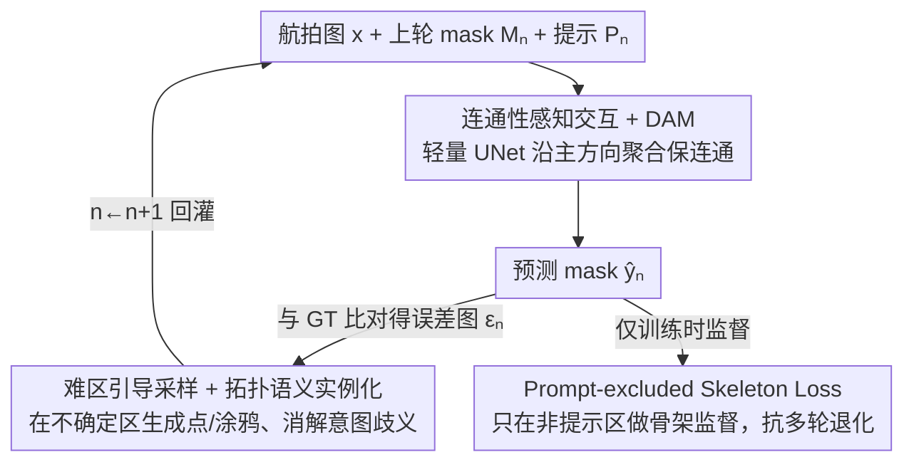

# RoadGIE: Towards A Global-Scale Aerial Benchmark for Generalizable Interactive Road Extraction

**会议**: CVPR 2026  
**论文**: [CVF Open Access](https://openaccess.thecvf.com/content/CVPR2026/html/Peng_RoadGIE_Towards_A_Global-Scale_Aerial_Benchmark_for_Generalizable_Interactive_Road_CVPR_2026_paper.html)  
**代码**: https://github.com/chaineypung/RoadGIE  
**领域**: 遥感  
**关键词**: 路网提取, 交互式分割, 遥感基准, 拓扑连通性, 涂鸦提示

## 一句话总结
本文先造了 WorldRoadSeg-360K——一个覆盖 38 国 223 城、36.7 万张像素级标注的全球航拍路网分割基准，再基于它提出 RoadGIE：一个仅 3.7M 参数、支持点击/涂鸦"连通性感知"交互的实时路网提取框架，在分割精度和拓扑一致性上都刷到 SOTA，同时把人工标注时间砍掉约 79%。

## 研究背景与动机

**领域现状**：从航拍/卫星影像里提取道路是地图更新、空间结构分析、GIS 构建的基础任务。现有数据集分两类——图标注（vector centerline，如 Global-Scale、SpaceNet）和分割标注（pixel mask，如 DeepGlobe、LSRV）。

**现有痛点**：没有一个数据集能同时兼顾场景多样性、语义粒度、结构连续性。Global-Scale 虽然全球覆盖，但用的是 OSM 矢量中心线，丢了道路宽度和边界连续性，做不了细粒度分割；LSRV 是高精度像素级 mask，但样本少、几乎只覆盖城市，缺多样地形和复杂形态。多数像素级数据集还被局限在单个国家或城市。

**核心矛盾**：道路是高长宽比、强连续、拓扑敏感的细长结构。纯自动分割模型容易输出断裂的路网；而 SAM 这类交互式基础模型虽泛化强，但点/框提示只能给粗糙的空间线索，**与路网拓扑天然不对齐**，再叠加高延迟和用户意图歧义，交互体验很差。

**本文目标**：(1) 造一个真正全球尺度、像素级、地形多样的路网分割基准；(2) 设计一个交互范式，让提示形式与道路形态对齐，并在多轮交互中保持结构一致、不退化。

**切入角度**：作者的观察是——**视觉提示的形式应当匹配目标物体的形态特征**。涂鸦（scribble）本身就编码了形状、连续性和连通性，比孤立的点更适合细长道路，且更接近标注员的真实操作习惯。

**核心 idea**：用"连通性感知提示（点击+涂鸦）+ 难区引导 + 拓扑感知损失"替代点/框提示来做交互式路网提取，并配一个全球尺度数据集把泛化打满。

## 方法详解

### 整体框架

本文是"基准 + 方法"双轨。基准侧是 **WorldRoadSeg-360K**：366,947 张 512×512、0.8–1.1m 分辨率的卫星图，跨 38 国 223 城（除南极外所有大陆），并额外用 LSRV 的 1,789 张图（Boston/Birmingham/Shanghai）当 OOD 测试集来考察跨域泛化。数据靠 Google Static Maps 取图、OSM 取粗标，再用 SAM/HQ-SAM/RobustSAM 把粗标当 prompt 精修融合，最后人工分高/低质量子集。

方法侧是 **RoadGIE** 的迭代式交互流程：第 $n$ 轮输入当前图像 $x$、上一轮预测 $M_n=\hat{y}_{n-1}$（$M_0=\mathbf{0}$）和一组提示 $P_n$，网络输出更新预测 $\hat{y}_n = f_\theta(x, M_n, P_n)$。预测与 GT 比对得到误差图，由模拟标注器在出错处生成纠正提示，回灌进下一轮，循环若干步直到精度达标。

### 关键设计

**1. WorldRoadSeg-360K：全球尺度像素级路网分割基准**

针对"现有数据集顾此失彼"的痛点，作者从全球城市普查出发，系统选取 15–45km 的矩形区域覆盖不同规模城市，每个区域含密集城区、乡村、山地等多种地形。构建流程是一条半自动管线：Google Static Maps 取高分卫星图、OSM 取粗略道路标注，把粗标当 prompt 喂给 SAM、HQ-SAM、RobustSAM 多个 SOTA 分割模型，**融合多模型输出与原始标注**得到精修 mask，再人工校验分成高/低质量两档（高质量子集留作后期微调）。最终规模 366,947 张图、223 城、38 国，地理覆盖约为 Global-Scale 的 4 倍，并单独留 LSRV 全量作 OOD 测试集。它的价值不只是"大"，而是同时把像素级精度、地形多样性、跨域评测三件事凑齐，能当通用预训练基准（Table 3 验证）。

**2. 连通性感知交互 + DAM：让提示和网络都顺着路网拓扑走**

针对"点/框提示与道路形态不对齐"的痛点，RoadGIE 在两端都注入连通性先验。提示端支持点击和涂鸦，训练时用 prompt simulation 合成"类用户纠正"——每轮算误差图 $\varepsilon_n = y - \hat{y}_{n-1}$，在纠正区域 $V$ 里采样：点提示按中心偏置的距离变换采样 $P(x)=\dfrac{\exp(\alpha E(x))}{\sum_{z\in V}\exp(\alpha E(z))}$（$E$ 为 $V$ 内归一化欧氏距离变换，$\alpha\in[1,10]$ 控中心偏置）；涂鸦则分中心涂鸦（从 $V$ 的骨架截取）、直线涂鸦、贝塞尔涂鸦（三控制点拟合的平滑曲线）三种，并加平滑位移场扰动模拟真实抖动。网络端用轻量 UNet 主干，在解码器输出接 **方向聚合模块 DAM**：对四个方向 $D\in\{(1,0),(0,1),(1,1),(-1,1)\}$ 各做 1D 卷积捕捉长程方向依赖，$Z_D[i,j,c]=\sum_{l=-k}^{k} F_n[i+l d_h, j+l d_w, c]\cdot w_D[k-l]+b_D$，再 concat + $1\times1$ 卷积 + sigmoid 出二值 mask。沿主方向聚合特征，正好补上道路被遮挡处的断裂。

**3. Expert-guided prompt 与拓扑语义实例化：把监督导向难区、消解用户意图歧义**

这一组设计专治"模型在简单区反复刷分、却学不会难区，且用户意图模糊"的问题。**Expert-guided prompt（EG-Prompt）** 用一组预训练分割模型 $\{M_j\}_{j=1}^N$ 与 GT 的平均绝对误差作不确定性图 $U(x)=\frac{1}{N}\sum_j |M_j(x)-y|$，再把提示采样概率写成 $P(u{=}{+}1\mid x)=\dfrac{U(x)^\beta}{\sum_{z\in\Omega} U(z)^\beta}$（$\beta>1$ 控尖锐度），让正提示更多落在高不确定的遮挡/模糊路段，逼模型从难样本里学。**拓扑语义耦合实例化（Algorithm 1）** 则解决"有人只想标主干道、有人要标所有路"的歧义：模型不直接出 mask，而是先用 $F_{clean}$ 规整道路结构、$F_{thin}$ 抽中心线、$F_{attr}$ 算段级属性并分组，再用一个 prompt 条件打分器 $\text{Score}(\cdot, q; \theta_{sel})$ 对候选段按与提示的相关性排序，选出 top 段后用 $\Psi$ 迭代扩张、$F_{refine}$ 精修。把"实例化"推迟到结构抽象之后，模型对不同地区、不同提示风格的泛化更稳。

**4. Prompt-excluded skeleton loss：只在非提示区做骨架监督，抑制多轮退化**

作者观察到一个反直觉现象：多轮交互反而掉点——后面的提示会覆盖前面已正确的区域，最后只剩稀疏的细线痕迹（Fig 5）。根因是骨架类损失若全图施加，会在已被提示充分监督的区域过拟合。解法是把骨架召回损失只作用在**非提示区**：定义提示掩码 $\mathcal{M}_n$（被提示覆盖处为 1），用 $\bar{\mathcal{M}}_n = 1 - \mathcal{M}_n$ 限制骨架项的计算范围。总损失为 Focal + Soft Dice + Prompt-excluded Skeleton 三项之和，其中骨架项形如 $\dfrac{\sum_i \bar{\mathcal{M}}_n[i]\cdot\hat{y}_i\cdot \text{Skel}(y_i)+\epsilon}{2\sum_i \bar{\mathcal{M}}_n[i]\cdot \text{Skel}(y_i)+\epsilon}$。这样把学习压力导向尚未标注的路级几何，而不是在用户已经标好的地方反复纠结，从而跨轮保持连通性。

### 损失函数 / 训练策略
总损失 $\mathcal{L}_{total}$ = Focal Loss + Soft Dice Loss + Prompt-excluded Skeleton Loss（上式公式 6）。训练每个 batch 跑 5 轮交互、每轮 1–3 个提示；数据增强含旋转、翻转、对比度/亮度调整、高斯模糊；bf16 精度、AdamW、初始学习率 0.0003、cosine 调度，4×RTX 3090 (24GB) 训练。

## 实验关键数据

### 主实验
在 Baseline dataset（多个路网数据集合并）和 WorldRoadSeg-360K 上对比各交互式分割模型（点+涂鸦提示，5 轮交互后）：

| 方法 | Baseline Dice↑ | Baseline APLS↑ | WorldRoadSeg Dice↑ | WorldRoadSeg APLS↑ |
|------|------|------|------|------|
| EISeg | 0.701 | 0.511 | 0.706 | 0.515 |
| ScribbleSeg-B3 | 0.761 | 0.556 | 0.788 | 0.580 |
| SAM (ViT-h) | 0.738 | 0.539 | 0.756 | 0.553 |
| PRISM-2D | 0.622 | 0.463 | 0.643 | 0.481 |
| ScribblePrompt | 0.791 | 0.584 | 0.809 | 0.592 |
| **RoadGIE** | **0.807** | **0.593** | **0.835** | **0.620** |

RoadGIE 在两个数据集上都拿第一，比次优的 ScribblePrompt 分别高 1.6 / 2.6 Dice 点，而其它模型在两个数据集上的提升都不超过 0.8 点。

### 消融实验

**数据集泛化（固定 LSRV 为测试集，5 轮交互后）**——验证 WorldRoadSeg-360K 当预训练集的价值：

| 预训练数据集 | Dice↑ | Recall↑ | clDice↑ | APLS↑ | β0↓ | β1↓ |
|------|------|------|------|------|------|------|
| Global-Scale | 0.686 | 0.605 | 0.783 | 0.512 | 13.582 | 37.886 |
| Baseline dataset | 0.807 | 0.897 | 0.869 | 0.593 | 8.150 | 3.061 |
| **WorldRoadSeg-360K** | **0.835** | **0.934** | **0.905** | **0.620** | **5.823** | **2.752** |

**损失策略消融（5 轮均值）**——验证 prompt-exclusion 该配哪种损失：

| Prompt-exclude 配置 | Dice↑ | APLS↑ | 说明 |
|------|------|------|------|
| 全图（不排除） | 0.818 | 0.603 | 基准 |
| Focal 上排除 | 0.806 | 0.595 | 反而掉点，局部损失不适合排除 |
| Dice 上排除 | 0.823 | 0.609 | 略升 |
| **Skeleton-recall 上排除** | **0.829** | **0.615** | 骨架级结构监督 + 排除最契合 |

### 关键发现
- **WorldRoadSeg-360K 当预训练集全面碾压**：相比 Global-Scale，β0（连通分量数）从 13.58 降到 5.82、β1（环洞数）从 37.89 降到 2.75，拓扑断裂与冗余环大幅减少；矢量中心线数据（Global-Scale）训出来的模型连通性最差。
- **EG-Prompt 在后期轮次增益最大**（Table 4）：第 5 轮 Dice +2.7、APLS +2.9；因为后几轮标注员都在啃硬区，正好对应 EG-Prompt 把监督导向难样本的设计意图。
- **提示类型上贝塞尔涂鸦最强**：10 轮后 Dice 达 87.1，明显优于点提示（<80）；点提示在高长宽比道路上难以提供连通性先验，印证"提示形态要匹配目标形态"的核心假设。
- **效率与可用性**：仅 3.7M 参数，GPU 单次预测 39.52ms（仅次于 ScribblePrompt 的 30.76ms，远快于 SAM-ViT-b 的 283.65ms）；用户研究里把人工标注 Dice 0.827 提到 0.885（达专家级），单图标注时间从 73s 降到 15s（约 7 次交互），省时约 79%。

## 亮点与洞察
- **"提示形态匹配目标形态"是贯穿全文的统一观点**：从涂鸦设计到 DAM 方向聚合，再到骨架损失，都在围绕"道路是细长连通结构"这一先验做文章，逻辑自洽且可迁移到血管、河流等管状目标分割。
- **Prompt-excluded skeleton loss 是个反直觉但巧妙的 trick**：发现"多轮交互越标越差"后，用提示掩码把骨架监督挡在已标注区之外，把模型注意力逼向未标注的路级几何——这种"把监督从已知区移开"的思路可复用到任何 human-in-the-loop 迭代任务。
- **拓扑语义实例化"先抽象后实例化"**：通过中心线/段属性/可学习打分器把用户意图对齐到结构化表示，再延迟实例化，缓解了"主干道 vs 全部道路"这类标注口径不一致带来的训练噪声。
- **半自动多模型融合造数据**：用现成 SAM 家族把 OSM 粗标精修成像素 mask，把构造大规模高精度数据集的成本压下来，是工程上很实用的数据飞轮范式。

## 局限与展望
- **作者承认**：数据与模型都基于 0.8–1.1m 分辨率遥感图，可能难以泛化到更高分辨率场景；受 GPU 显存所限，训练只跑 6 轮交互，复杂场景推理时可能需要更多轮，超出训练分布会影响精度。
- **自己发现**：⚠️ 拓扑语义实例化（Algorithm 1）的可视化与定量证据被放在补充材料，正文只给了定性结论，其相对其它组件的独立增益未在正文清晰量化；半自动标注用 SAM 家族精修 OSM 粗标，数据 mask 质量上限受这些预训练模型在遥感域的表现约束，可能引入系统性偏差。
- **改进思路**：可探索分辨率自适应或多尺度训练以放宽 0.8–1.1m 的约束；把交互轮数从固定 6 轮改为按不确定性自适应早停，缓解训练/推理轮数不匹配。

## 相关工作与启发
- **vs ScribblePrompt**：两者都用涂鸦模拟引擎训练交互模型，但 ScribblePrompt 面向医学分割、通用涂鸦；RoadGIE 专门注入道路连通性先验（DAM + 骨架损失 + 拓扑实例化），在路网上高出 1.6–2.6 Dice，且参数更省。
- **vs SAM 家族（含 HQ-SAM/RobustSAM）**：SAM 用点/框提示做类无关分割、泛化强但对细长遮挡结构粗糙；RoadGIE 用连通性感知提示对齐路网拓扑，且把 SAM 家族当作数据构造工具而非最终模型。
- **vs Global-Scale 数据集**：Global-Scale 靠 OSM 矢量中心线实现全球覆盖但丢宽度与边界连续性；WorldRoadSeg-360K 提供像素级 mask、地形更多样、规模约 4 倍，连通性指标（β0/β1）显著更好。
- **vs clDice / 骨架损失系列**：传统骨架损失全图施加易过拟合；本文把它适配到交互场景并加 prompt-exclusion，专门抗多轮交互退化。

## 评分
- 新颖性: ⭐⭐⭐⭐ 全球尺度像素级路网基准 + 连通性感知交互范式，数据与方法都有实质贡献，但单项组件多为已有思路的领域化适配。
- 实验充分度: ⭐⭐⭐⭐ 主对比 + 数据集/损失/提示类型/EG-Prompt 多维消融 + 用户研究 + 运行时，较扎实；拓扑实例化的独立量化稍欠。
- 写作质量: ⭐⭐⭐⭐ 动机与设计对应清晰，公式完整；部分组件证据外置到补充材料。
- 价值: ⭐⭐⭐⭐⭐ 提供可当通用预训练集的大规模基准 + 3.7M 实时模型，标注提效 79%，对遥感路网社区落地价值高。

<!-- RELATED:START -->

## 相关论文

- [\[CVPR 2026\] Beyond Endpoints: Path-Centric Reasoning for Vectorized Off-Road Network Extraction](beyond_endpoints_path-centric_reasoning_for_vectorized_off-road_network_extracti.md)
- [\[CVPR 2026\] Cross-modal Fuzzy Alignment Network for Text-Aerial Person Retrieval and A Large-scale Benchmark](cross-modal_fuzzy_alignment_network_for_text-aerial_person_retrieval_and_a_large.md)
- [\[CVPR 2026\] Cross-Scale Pansharpening via ScaleFormer and the PanScale Benchmark](cross-scale_pansharpening_via_scaleformer_and_the_panscale_benchmark.md)
- [\[CVPR 2026\] Olbedo: An Albedo and Shading Aerial Dataset for Large-Scale Outdoor Environments](olbedo_an_albedo_and_shading_aerial_dataset_for_large-scale_outdoor_environments.md)
- [\[CVPR 2026\] UniGeoRS: A Unified Benchmark for Tri-view Geo-Localization](unigeors_a_unified_benchmark_for_tri-view_geo-localization.md)

<!-- RELATED:END -->
