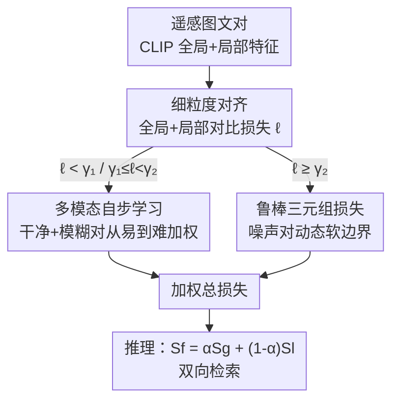

# Robust Remote Sensing Image–Text Retrieval with Noisy Correspondence

**会议**: CVPR 2026  
**论文**: [CVF Open Access](https://openaccess.thecvf.com/content/CVPR2026/html/Song_Robust_Remote_Sensing_Image-Text_Retrieval_with_Noisy_Correspondence_CVPR_2026_paper.html)  
**代码**: https://github.com/MSFLabX/RRSITR  
**领域**: 遥感图文检索 / 多模态VLM  
**关键词**: 噪声对应, 遥感图文检索, 自步学习, 鲁棒三元组损失, CLIP

## 一句话总结
本文首次在遥感图文检索（RSITR）中揭示并研究「噪声对应」（Noisy Correspondence，图文对本身就配错了）问题，提出 RRSITR 框架：按对比损失把训练对分成干净 / 模糊 / 噪声三类，用多模态自步学习从易到难调度训练，再对噪声对施加动态软边界的鲁棒三元组损失，在三个数据集、尤其高噪声率下显著超过现有 SOTA。

## 研究背景与动机
**领域现状**：遥感图文检索（RSITR）要把卫星 / 航拍图像和自然语言描述映射到同一嵌入空间，实现「文搜图」「图搜文」的双向检索。主流方法分两类：基于 CNN+RNN 的（如 SIRS 用语义分割做细粒度对齐、MSA 做多尺度对齐），以及基于 Transformer / 视觉语言预训练的（如遥感基础模型 RemoteCLIP、轻量化的 CUP）。

**现有痛点**：几乎所有 RSITR 方法都**默认训练集里的图文对是完美匹配的**。但遥感图像大多是俯视 / 垂直视角，缺乏人类「正面 / 侧面」那种自我中心的视觉先验，导致文本描述天然带歧义；大规模精确标注又极其昂贵甚至不可行。作者注意到主流数据集 RSITMD 里**确实存在描述错配的图文对**——比如一张有很多房子和池塘的图，却配上「这是一片像蓝宝石一样美丽的湖」。这种错误监督信号会持续误导模型，拉低检索性能。

**核心矛盾**：以往工作即便隐约察觉到「弱相关 / 无意义图文对」的存在，也**没有任何方法显式地把这些噪声对识别出来并区别对待**。模型在训练时根本不知道哪些对是噪声，于是把错配当正确监督硬学，越学越偏。

**本文目标**：在不依赖额外干净标注的前提下，让模型对训练数据中的噪声对应具备鲁棒性——既要能区分出噪声对，又要不让它污染对齐学习。

**切入角度**：作者借鉴人类「由易到难」的认知学习规律（自步学习 SPL），假设噪声对在训练早期会表现出**更大的对比损失**，因此可以用损失幅值作为信号来判别样本可靠性，并据此安排训练顺序与权重。

**核心 idea**：把训练对按损失分成干净 / 模糊 / 噪声三档，用多模态自步函数从易到难地动态加权调度（噪声对直接踢出），并对潜在噪声对改用「动态软边界」的鲁棒三元组损失。

## 方法详解

### 整体框架
RRSITR 的输入是遥感图文对 $(I_i, T_i)$，输出是用于检索的跨模态相似度。整体走四步：先用 CLIP 双编码器抽特征，做**全局 + 局部双路细粒度对齐**得到每对的对比损失 $\ell_i$；再按 $\ell_i$ 的大小把这一批样本**动态划分**为干净对、模糊对、噪声对；对干净 / 模糊对用**多模态自步学习**动态分配权重与学习次序（噪声对权重置零、暂不参与）；对被判为噪声的对则用**鲁棒三元组损失**以自适应软边界做受控学习。三部分损失加权求和共同优化；推理时把全局与局部相似度加权融合成细粒度相似度 $S_f$ 做检索。

### 关键设计

**1. 细粒度对齐：用全局+局部双路对比损失同时当对齐目标和噪声探针**

跨模态检索只看全局相似度容易漏掉局部细节，本文用 CLIP 编码器同时抽全局特征 $f_v^g, f_t^g$ 和局部特征 $\{f_v^1,\dots\}, \{f_t^1,\dots\}$。全局相似度是 $S^g = \cos(f_v^g, f_t^g)$；局部相似度先算每个局部块对的 $S_{ij}^l = \cos(f_v^i, f_t^j)$，再做**两次连续 L2 归一化** $S^l = \|S_{ij}^l\|_{2,2}$ 聚合成对级局部相似度。两路都用 InfoNCE 对称损失（图→文、文→图双向）拉近正样本、推远负样本，合成 $L^{gl}_{info} = L^g_{info} + L^l_{info}$。这一步的巧妙之处在于：它不仅完成对齐，还**顺手产出了每对样本的总对比损失 $\ell_i = L^g_i + L^l_i$**，后两个模块正是拿这个 $\ell_i$ 当作判别样本可靠性的信号——损失越大越可能是错配。

**2. 多模态自步学习：以损失幅值三分类 + 自步正则器实现从易到难的渐进训练**

针对「模型不知道哪些对是噪声」这个痛点，本设计用两个阈值 $\gamma_1, \gamma_2$ 把样本按 $\ell_i$ 三分：$\ell_i < \gamma_1$ 为干净对（可靠、易学，早期就纳入）；$\gamma_1 \le \ell_i < \gamma_2$ 为模糊对（较可靠但有难度，优先学习）；$\ell_i \ge \gamma_2$ 为噪声对（权重 $w_i$ 直接置零，排除出当前训练）。干净 / 模糊对各自的损失写成 $L_{S}= \frac{1}{N}\sum_i w_i \ell_i + \frac{1}{N}\sum_i R(w_i, \gamma)$，其中 $R(w_i,\gamma)$ 是自步正则器，控制每个样本以多大权重参与。

本文设计的正则器是 $R(w_i,\gamma) = -\frac{2}{\pi}\gamma\big[w_i\arccos(w_i) - \sqrt{1-w_i^2}\big]$（当 $\ell_i < \gamma$，否则为 0）。固定网络参数交替优化时，对 $w_i$ 求导置零可解出闭式最优权重：

$$w_i^* = \cos\!\Big(\frac{\pi}{2}\cdot\frac{\ell_i}{\gamma}\Big), \quad \ell_i < \gamma; \qquad w_i^* = 0, \quad \ell_i \ge \gamma.$$

这个 $\cos$ 形式天然保证 $w_i \in [0,1]$，且损失越小（越「易」）权重越大、随训练推进损失下降权重单调上升——等价于让模型先吃透简单可靠的样本、再逐步纳入更难的，平滑地把噪声对应的干扰压下去。相比需要手工设计权重函数的传统 SPL（引入额外超参、适用性受限），这里权重有闭式解、由损失自适应决定。

**3. 鲁棒三元组损失：对噪声对用动态软边界替代固定边界，避免过自信**

被判为噪声的对不是简单丢弃，而是交给鲁棒三元组损失（RTL）做受控学习。传统硬三元组损失用固定边界 + 最难负样本挖掘，但当正样本对本身错配、其全局相似度 $S^g(v_i,t_i)$ 偏低时，正负样本相似度差会被放大、边界被迫拉大，逼模型用过严标准去区分——反而在易样本上过自信、对难样本欠学习。RTL 改用**自适应软边界**：

$$\hat{\mu}_i = \sigma\cdot\big(1 + \max(0,\, S^g(v_i,\hat{t}_h) - S^g(v_i,t_i))\big),$$

$\hat{\zeta}_i$ 对称定义，其中 $\hat{v}_h, \hat{t}_h$ 是 batch 内最难负样本，$\sigma$ 是基础边界超参。损失 $L_{soft}$ 用双向（图→文、文→图）的 $[\hat{\mu}_i - S^g(v_i,t_i) + S^g(v_i,\hat{t}_h)]_+$ 形式（$[x]_+ \equiv \max(x,0)$）。直觉是：当正样本相似度异常低（疑似噪声）时，软边界自适应放大，使模型不被错配对牵着走；双向对称处理则保证两个模态的噪声都能被覆盖，平衡学习焦点、防止在噪声数据上过拟合。

### 损失函数 / 训练策略
总目标 $L_{overall} = L_{S1} + \lambda_1 L_{S2} + \lambda_2 L_{soft}$，其中 $L_{S1}, L_{S2}$ 分别是干净对、模糊对的自步损失。推理时融合全局与局部相似度 $S_f = \alpha S^g + (1-\alpha)S^l$。主干用 OpenCLIP 的 ViT-B/32，Adam 优化、50 epoch、batch 100，学习率 $7\times10^{-6}$、weight decay 0.7；超参在所有数据集统一取 $\gamma_1=5, \gamma_2=18, \sigma=0.6, \lambda_1=0.8, \lambda_2=0.9, \alpha=0.9$，单卡 A800 训练。

## 实验关键数据

三个基准：RSITMD、RSICD、NWPU，按 8:1:1 划分。通过随机打乱文本描述合成噪声对应，分别在 20% / 40% / 60% / 80% 四档噪声率下评测；指标为 R@1/5/10 与平均 mR，跑 5 次取均值±方差。

### 主实验（RSITMD，mR，越高越好）

| 噪声率 | CUP（次优） | RRSITR（本文） | 提升 |
|--------|------------|---------------|------|
| 20% | 38.99 | **45.58** | +6.59 |
| 40% | 36.73 | **43.64** | +6.91 |
| 60% | 33.68 | **42.06** | +8.38 |
| 80% | 27.59 | **35.93** | +8.34 |

关键观察：噪声率从 20% 升到 80% 时，几乎所有 baseline 性能急剧崩塌（如 KAMCL、MSA、S-CLIP 在 60%~80% 几乎归零，mR 跌到个位数甚至 ~1），而 RRSITR 在极端 80% 噪声下仍保持 mR 35.93，**噪声越高、领先优势越大**，体现出认知式渐进学习对错误监督的强抑制能力。

### 消融实验（RSITMD，80% 噪声，mR）

| 配置 | mR | 说明 |
|------|----|------|
| #1 去掉局部对比学习 | 33.38 | 丢失局部细粒度对齐 |
| #2 去掉 SPL 模块 | 29.80 | **掉点最多**，验证自步调度最关键 |
| #3 去掉 RTL 模块 | 30.21 | 噪声对失去软边界保护 |
| #4 去掉全部组件 | 32.24 | 退化为基础对齐 |
| #5 SPL 改「由难到易」 | 1.22 | 顺序反了直接崩溃 |
| #6 SPL 改随机加权 | 26.52 | 权重失去损失依据 |
| #7 SPL 去掉模糊类 | 1.10 | 三分类缺一不可 |
| #8 RTL 换固定边界 | 33.90 | 验证动态软边界有效 |
| **RRSITR（完整）** | **35.93** | — |

### 关键发现
- **SPL 模块贡献最大**：去掉后 mR 从 35.93 跌到 29.80；而把自步顺序改成「由难到易」（#5）或删掉模糊类（#7）会让模型**几乎完全崩溃**（mR ≈ 1），说明「从易到难 + 三分类」的调度逻辑是整套方法的命脉，不是可有可无的 trick。
- **随机加权（#6, 26.52）远差于损失驱动加权**，证明用对比损失幅值作可靠性信号确实抓住了噪声对的关键特征。
- **动态软边界优于固定边界**（#8 33.90 → 完整 35.93），且各模块协同后整体大于各自相加，体现模块间的互补增益。

## 亮点与洞察
- **把对齐损失「一物两用」**：同一个 InfoNCE 对比损失既是优化目标，又是判别样本是否噪声的探针——不需要额外的噪声检测网络，干净利落，这是整套方法能轻量落地的关键。
- **自步正则器有闭式最优解**：$w_i^* = \cos(\frac{\pi}{2}\cdot\frac{\ell_i}{\gamma})$ 这个余弦权重天然落在 $[0,1]$ 且随损失单调，省去了传统 SPL 手工设计权重函数的麻烦，可迁移到任何「按样本难度调度」的噪声鲁棒训练场景。
- **噪声越高优势越大**：在 80% 这种极端噪声下仍稳住性能，对真实世界标注质量参差的遥感数据格外有现实意义。

## 局限与展望
- 评测里的噪声是**人工随机打乱文本合成**的，与真实数据集里天然存在的、语义弱相关型噪声分布未必一致，对真实噪声的提升幅度有待进一步验证。⚠️
- 三个阈值 / 超参（$\gamma_1, \gamma_2, \sigma$ 等）虽在三个数据集上统一取值，但仍是固定常数，若噪声率或数据分布大幅变化，是否需要重新调参、能否自适应估计阈值，论文未深入。
- 方法绑定 CLIP 类双编码器架构与对比损失范式，对非对比式或单塔检索框架是否同样有效尚不清楚。
- 训练细节（完整训练流程、0% 噪声结果）被放到补充材料，正文未给，复现需结合补充。⚠️

## 相关工作与启发
- **vs CUP（次优 baseline）**：CUP 走「上下文 + 不确定性感知提示」降低 RemoteCLIP 的资源开销，但仍默认图文对干净；本文显式建模噪声对应、在各噪声档全面反超（80% 下 mR 27.59 → 35.93），区别在于把「数据本身错配」当成一等问题来治。
- **vs 传统自步学习（SPL / SCSM / Meta-SPN）**：传统 SPL 多在单模态、且仅在实例级评估难度、常需手工权重函数；本文把 SPL 扩展到多模态对比学习、用损失闭式解自适应加权，并专门针对「噪声对应」而非一般离群点。
- **vs 硬三元组损失**：硬三元组用固定边界 + 最难负挖掘，遇错配正样本会过度拉大边界；RTL 用语义相似度驱动的动态软边界，避免在噪声样本上过自信，是对经典度量学习目标的鲁棒化改造。

## 评分
- 新颖性: ⭐⭐⭐⭐⭐ 首次在 RSITR 中提出并系统处理「噪声对应」问题，问题定义本身有开创性
- 实验充分度: ⭐⭐⭐⭐ 三数据集 × 四噪声档 + 8 变体消融较充分，但真实噪声评测、阈值敏感性分析偏弱
- 写作质量: ⭐⭐⭐⭐ 动机清晰、公式完整，自步正则器推导给到闭式解
- 价值: ⭐⭐⭐⭐⭐ 直击遥感标注昂贵 / 易错配的真实痛点，高噪声下优势显著，代码开源

<!-- RELATED:START -->

## 相关论文

- [\[CVPR 2026\] PAUL: Uncertainty-Guided Partition and Augmentation for Robust Cross-View Geo-Localization under Noisy Correspondence](paul_uncertainty-guided_partition_and_augmentation_for_robust_cross-view_geo-loc.md)
- [\[CVPR 2026\] Cross-modal Fuzzy Alignment Network for Text-Aerial Person Retrieval and A Large-scale Benchmark](cross-modal_fuzzy_alignment_network_for_text-aerial_person_retrieval_and_a_large.md)
- [\[CVPR 2026\] ReAttnCLIP: Training-Free Open-Vocabulary Remote Sensing Image Segmentation via Re-defined Attention in CLIP](reattnclip_training-free_open-vocabulary_remote_sensing_image_segmentation_via_r.md)
- [\[CVPR 2026\] Remote Sensing Image Super-Resolution for Imbalanced Textures: A Texture-Aware Diffusion Framework](remote_sensing_image_super-resolution_for_imbalanced_textures_a_texture-aware_di.md)
- [\[CVPR 2026\] QuCNet: Quantum Deep Learning Driven Multi-Circuit Network for Remote Sensing Image Classification](qucnet_quantum_deep_learning_driven_multi-circuit_network_for_remote_sensing_ima.md)

<!-- RELATED:END -->
