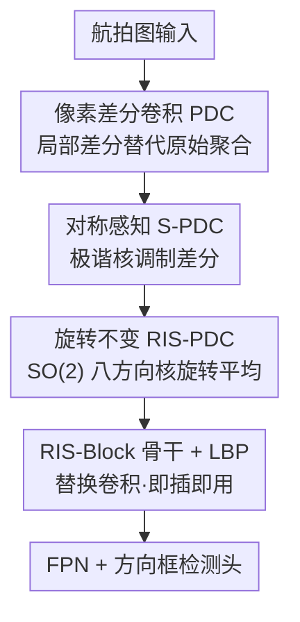

# Rotation Invariant and Symmetry Aware Pixel Difference Network for Remote Sensing Object Detection

**会议**: CVPR 2026  
**论文**: [CVF Open Access](https://openaccess.thecvf.com/content/CVPR2026/html/Zhan_Rotation_Invariant_and_Symmetry_Aware_Pixel_Difference_Network_for_Remote_CVPR_2026_paper.html)  
**代码**: https://github.com/yuhua666/RIS-PiDiNet  
**领域**: 遥感目标检测  
**关键词**: 旋转不变性, 对称性建模, 像素差分卷积, SO(2)群, 极谐变换

## 一句话总结
把"连续旋转不变性"和"结构对称性"两个几何先验直接焊进卷积核里，提出 RIS-PDC 算子（像素差分 + 极谐对称核 + SO(2) 八方向核旋转平均），即插即用地替换主流遥感检测器的卷积，在 DOTA-v1.0 单尺度拿到 78.53% mAP 且不增加参数量。

## 研究背景与动机

**领域现状**：遥感（航拍）目标检测近年的主流改进集中在两条线——给检测框加方向（oriented bounding box，配角度回归 + 方向敏感损失），以及增强小目标特征（大核卷积扩大感受野，如 LSKNet、PKINet）。

**现有痛点**：航拍图里的目标天然以任意角度出现（俯视视角），而且很多目标本身有强对称结构（飞机左右对称、环岛径向对称）。但现有方法几乎不显式建模这两条几何性质：角度回归类方法在极端视角下框会抖动失稳；旋转不变类方法（等变网络/数据增广）又会把镜像对称这种细节"抹平"。作者在 DOTA 上量化发现，基线模型的 ROI 响应强度随旋转角剧烈波动（方向偏置），说明网络学到的表示和旋转目标的几何先验是错位的。

**核心矛盾**：卷积本身对旋转和对称都没有内建机制。要么靠堆数据/堆感受野去"近似"，要么用 group-equivariant 卷积（如 ReDet），但后者依赖很重的特征重对齐、计算代价高、还容易牺牲对称细节。也就是说，几何先验和"效率/即插即用"之间存在 trade-off。

**本文目标**：设计一个**轻量、即插即用**的卷积算子，同时编码 (i) 连续 SO(2) 旋转不变性、(ii) 结构对称性，且不改动检测框架、不增加参数。

**切入角度**：与其在特征图层面做对齐/增广，不如把几何先验**直接写进卷积核的数学形式**——用极谐变换（Polar Harmonic Transform）的谐波核去捕捉对称频率，用李群 SO(2) 对核做旋转平均去获得旋转不变。

**核心 idea**：用"像素差分卷积 + 极谐对称核 + 核域旋转平均"这一个统一算子（RIS-PDC）替换普通卷积，让几何一致性内生于网络权重，而非靠数据学出来。

## 方法详解

### 整体框架
RIS-PiDiNet 的输入是航拍图，输出是带方向的检测框，骨干沿用 LSKNet 风格的堆叠 block 设计（block×2 / ×2 / ×4 / ×2 四个 stage + FPN + 分类/回归头），唯一但关键的改动是：把其中的卷积换成本文的 **RIS-PDC** 算子。这个算子不是凭空设计，而是分三层递进搭出来的——先把普通卷积改成对局部差分敏感的**像素差分卷积（PDC）**，再用极谐核给 PDC 注入**对称感知（S-PDC）**，最后对核做 SO(2) 八方向旋转平均得到完整的**旋转不变（RIS-PDC）**。算子内部还配一个 LBP（局部二值模式）分支强化细粒度纹理。因为只换算子、参数量不变，所以能即插即用地塞进 layer1 / layer2 / 检测头等多个位置。

### 关键设计

**1. S-PDC：用极谐核给像素差分注入对称感知**

普通卷积把局部像素加权求和，对"哪里对称、哪里不对称"毫无感知。本文先回顾**像素差分卷积（PDC）**：它不直接聚合像素值，而是聚合每个像素相对参考值 $q$ 的差分，$y=\sum_{i\neq c} w_i\,(x_i-q)$（实践取固定 $q=0.2$ 保数值稳定），这让算子天然像个高频滤波器、对小目标边缘敏感。在此之上，作者引入**对称感知像素差分卷积 S-PDC**：用一组从极谐变换（PHT）导出的谐波核 $H_i^{(n,l)}$ 去调制差分项。单个谐波阶 $(n,l)$ 的核在极坐标下写作

$$H_i^{(n,l)} = \cos\!\big(2\pi n r_i^2 + l\,\theta_i\big),$$

其中 $r_i$ 是像素到 patch 中心的归一化径向距离、$\theta_i$ 是角度，整数 $n$ 控制径向频率、$l$ 控制角向频率（极坐标由 $r_i^2=(u_i^2+v_i^2)/(k^2+\epsilon)$、$\theta_i=\arctan2(v_i,u_i+\epsilon)$ 离散化得到）。真实对称往往不是单一频率，所以最终响应是多阶谐波的可学习线性组合：

$$y = \sum_{(n,l)\in O}\alpha_{n,l}\sum_{i\neq c} w_i\,\cos(2\pi n r_i^2 + l\theta_i)\,(x_i-q),$$

可学习系数 $\alpha_{n,l}$ 让网络自动稀疏地挑出"对称一致"的谐波、压掉非对称噪声。其效果是：对一个具备 $K$ 重旋转/镜像对称的输入 $x$，在对称变换 $S_k\in G_{\text{sym}}$ 下 S-PDC 的响应几乎不变，即 $\text{S-PDC}(S_k x)\approx\text{S-PDC}(x)$，从而能据可见部分**推断被遮挡的对称残缺结构**。

**2. RIS-PDC：在核域做 SO(2) 旋转平均换取旋转不变**

S-PDC 解决了对称，但还没解决"任意角度"。作者用李群 SO(2) 给出连续旋转的严格数学基础：任意角 $\theta$ 对应旋转矩阵 $R_\theta=\left[\begin{smallmatrix}\cos\theta & -\sin\theta\\ \sin\theta & \cos\theta\end{smallmatrix}\right]$。关键巧思是——**旋转卷积核而不是旋转特征图**。对每个采样角 $\theta$ 生成旋转核 $K_\theta=R_\theta(K)$，输入 $x$ 保持不动；由卷积线性性可得等变性 $y_\theta=(R_\theta K)*x=R_\theta(K*x)$。要把"等变"变成"不变"，就对 $n$ 个离散角的响应做平均：

$$y_{\text{final}} = \frac{1}{n}\sum_{j=1}^{n}(R_{\theta_j}K)*x.$$

这种核域平均会抵消方向相关的波动，最终满足 $\text{RIS-PDC}(R_\varphi x)\approx\text{RIS-PDC}(x)$。实现上作者在循环群 $C_n$ 上做离散群卷积、对核的旋转轨道做池化来逼近不变性，并取 $n=8$（八方向）：方向太少欠采样朝向空间，$n=16$ 则收益饱和且离散网格上插值伪影增多，八方向是精度/代价的甜点。这条设计让对称（S-PDC）和旋转（核旋转平均）在**同一个算子**里统一，且因为只在核域操作、不重排特征图，比 ReDet 那种特征级重对齐轻得多。

**3. RIS-Block 骨干 + LBP：把算子做成即插即用且不增参**

光有算子还要能落地。作者把 RIS-PDC 嵌进 LSKNet 风格的堆叠 RIS-block 骨干（四 stage 的 block×2/2/4/2），并在算子里并联一个 **LBP（局部二值模式）算子**强化局部一致性与细粒度纹理表达。整套设计的工程价值在于"零成本替换"：RIS-PDC 可以插在 layer1、layer2、检测头等不同位置，**参数量不变**、FLOPs 仅小幅增加，因此能直接换进 YOLO、O-RCNN、RoI Transformer、S²A-Net、R3Det 等主流单/双阶段框架而无需改动检测流程。这正是它相对 group-equivariant 架构的最大差异——后者是架构级改造，本文是算子级插件。

### 损失函数 / 训练策略
沿用 ImageNet-1K 预训练 + 遥感检测微调两段式。消融统一训 100 epoch（lr 0.0005、batch 512、drop-path 0.1），最终模型训 300 epoch；DOTA-v1.0 / HRSC2016 / DIOR-R 微调分别 12 / 36 / 12 epoch。优化器 AdamW（$\beta_1=0.9,\beta_2=0.999$，weight decay 0.05），DOTA 图裁成 $1024\times1024$（200–500 像素重叠）。

## 实验关键数据

### 主实验
在三个遥感检测基准上均达到 SOTA，且参数量不增、计算开销可接受。

| 数据集 | 指标 | 本文(RIS-PiDiNet-S) | 之前最强对比 | 提升 |
|--------|------|------|----------|------|
| DOTA-v1.0（单尺度） | mAP | 78.53% | PKINet-S 78.39% | +0.14（vs LSKNet-S 77.49 为 +1.04） |
| DOTA-v1.0（多尺度） | mAP | 81.81% | LSKNet-S 81.64% | +0.17 |
| HRSC2016 | mAP(12) | 98.60% | PKINet-S 98.54% | +0.06 |
| DIOR-R | mAP | 67.28% | PKINet-S 67.03% | +0.25 |

轻量版 RIS-PiDiNet-T 单尺度 76.92% mAP，仅 21.0M 参数 / 159G FLOPs，与 LSKNet-T（74.83%）同量级参数下高约 2 个点。

### 消融实验

谐波核配置消融（DOTA-v1.0 单尺度，A1=普通卷积、A2=PDC+LBP 基线）：

| 配置 | 谐波阶 (n,l) | mAP | 说明 |
|------|------|---------|------|
| A1 | – | 76.57% | 普通卷积 |
| A2 | – | 76.68% | PDC + LBP |
| A3 | (1,0) 单阶 | 76.92% | 加单个谐波，极坐标略增益 |
| A5 | {(1,0),(2,1),(3,2)} 固定三阶 | 77.23% | 多阶固定谐波 |
| A7 | Learned（可学习三阶） | **77.75%** | 最佳；去掉极坐标项(A8)→77.31 |
| A9 | Learned 五阶 | 77.48% | 阶数增多饱和，收益边际 |

对称建模方式对比（同骨干，换不同对称算子）：

| 对称建模方法 | #P | FLOPs | mAP |
|------|------|---------|------|
| Laplacian | 31.0M | 206G | 76.98% |
| Hu/Zernike 矩 | 31.0M | 206G | 75.12% |
| Gabor 滤波 | 31.0M | 216G | 76.10% |
| Steerable 滤波 | 32.1M | 211G | 77.05% |
| RIS-PDC（本文） | 31.0M | 206G | **77.75%** |

### 关键发现
- **可学习谐波 + 极坐标是对称建模的关键**：从普通卷积 76.57% 到可学习三阶谐波 77.75%，且去掉极坐标项就掉到 77.31%；阶数加到五阶饱和，说明三阶可学习谐波已足够表达常见对称模式。
- **八方向是旋转采样甜点**：在 2/4/8/16 方向中 SO(2)-8 最优，方向太少欠采样、太多收益饱和且插值伪影增多。
- **算子插入位置可权衡精度/效率**：layer1+layer2+head 全开最高（77.75%）；只去掉 layer2 可省 42G FLOPs 仍有 77.60%，性价比高。
- **骨干通用性强**：作为骨干换进 YOLO/O-RCNN/RoI Trans./S²A-Net/R3Det 五种框架均拿到最高 mAP，且 RIS-PiDiNet-T 骨干仅 4.3M 参数。
- **角度鲁棒性**：在多旋转角下 RIS-PiDiNet-S 精度几乎不随角度波动，而 LSKNet-S/PKINet-S/MA3E 有明显方向性起伏，印证了几何一致性。

## 亮点与洞察
- **"旋转核而非旋转特征图"** 是整篇最巧的工程取舍：核域做 SO(2) 平均只动权重、不重排特征图，因此能做到零增参、即插即用，避开了 ReDet 类等变架构的重对齐开销——把"几何不变"从架构问题降维成了算子问题。
- **用极谐变换把"对称"显式编码成可学习频率**：$\cos(2\pi n r^2 + l\theta)$ 这种极坐标谐波天然对应径向/角向对称模式，配可学习系数 $\alpha_{n,l}$ 就能让网络自适应挑对称频率、压非对称噪声，比 Gabor/Steerable 等手工滤波更灵活（实验也确实更高）。
- **可迁移性**：这种"把几何先验写进卷积核数学形式 + 核域群平均"的思路，可迁移到任何有强对称/任意朝向先验的任务（医学影像、显微图像、工业缺陷检测）；PDC 的差分思想也可与谐波核解耦复用。

## 局限与展望
- 三个基准上相对最强对比（PKINet-S）的绝对提升其实很小（DOTA-v1.0 单尺度仅 +0.14、HRSC2016 +0.06），主要优势体现在**角度鲁棒性/可解释性**而非刷点幅度，⚠️ 在常规 mAP 榜上领先并不显著。
- 旋转不变靠 $C_8$ 循环群离散逼近 SO(2)，本质仍是离散采样，对非 8 的整除角度可能有残余插值误差；"连续 SO(2)"更多是数学动机而非严格实现。
- 对称建模假设目标具备明确的旋转/镜像对称（飞机、环岛），对**无明显对称结构**的类别，对称核的增益机理不清晰，论文未深入讨论这类目标是否会被谐波核引入偏置。
- FLOPs 相比纯 LSKNet 仍有增加（如 S 版 161G→206G），虽不增参但推理算力有一定代价。

## 相关工作与启发
- **vs ReDet / 群等变卷积**：它们在架构层做等变/不变，依赖重的特征重对齐、计算代价高；本文 RIS-PDC 是即插即用算子，只在核域做群平均，不改检测框架也不增参，效率优势明显。
- **vs LSKNet / PKINet（大核感受野派）**：它们靠扩大上下文感受野提小目标，但不显式建模旋转和对称；本文在相近参数下把几何先验内建进算子，角度鲁棒性更强、对遮挡对称结构能"脑补"。
- **vs 角度回归类（R3Det / S²A-Net / 各种 oriented loss）**：它们让框带方向但对极端视角易抖；本文从特征表示层面追求旋转不变，二者正交、且本文算子可作骨干直接增益这些检测器（实验已验证）。

## 评分
- 新颖性: ⭐⭐⭐⭐ 首个在统一算子里联合建模旋转不变 + 对称的遥感检测器，核域 SO(2) 平均 + 极谐对称核组合有理论也有巧思。
- 实验充分度: ⭐⭐⭐⭐⭐ 三基准 + 多框架骨干替换 + 谐波/方向/插入位置/对称建模多组消融 + 角度鲁棒性/TIDE/t-SNE 分析，相当扎实。
- 写作质量: ⭐⭐⭐⭐ 数学推导清晰、几何动机明确，公式与图配合好；少数符号（循环群实现 vs 连续 SO(2)）表述略含糊。
- 价值: ⭐⭐⭐⭐ 即插即用、零增参、可迁移到任意朝向/对称先验任务，工程实用性高；但纯刷点提升有限。

<!-- RELATED:START -->

## 相关论文

- [\[CVPR 2026\] VLM4RSDet: Collaborative Optimization with Vision-Language Model for Enhancing Remote Sensing Object Detection](vlm4rsdet_collaborative_optimization_with_vision-language_model_for_enhancing_re.md)
- [\[CVPR 2026\] Prompt-Free Unknown Label Generation for Open World Detection in Remote Sensing](prompt-free_unknown_label_generation_for_open_world_detection_in_remote_sensing.md)
- [\[CVPR 2026\] ORSATR-X: A Foundation Model based on Differential-and-Excitation Networks for Optical Remote Sensing Object Recognition](orsatr-x_a_foundation_model_based_on_differential-and-excitation_networks_for_op.md)
- [\[CVPR 2026\] HySeg: Learning Generative Priors for Structure-Aware Remote Sensing Segmentation](hyseg_learning_generative_priors_for_structure-aware_remote_sensing_segmentation.md)
- [\[CVPR 2026\] QuCNet: Quantum Deep Learning Driven Multi-Circuit Network for Remote Sensing Image Classification](qucnet_quantum_deep_learning_driven_multi-circuit_network_for_remote_sensing_ima.md)

<!-- RELATED:END -->
