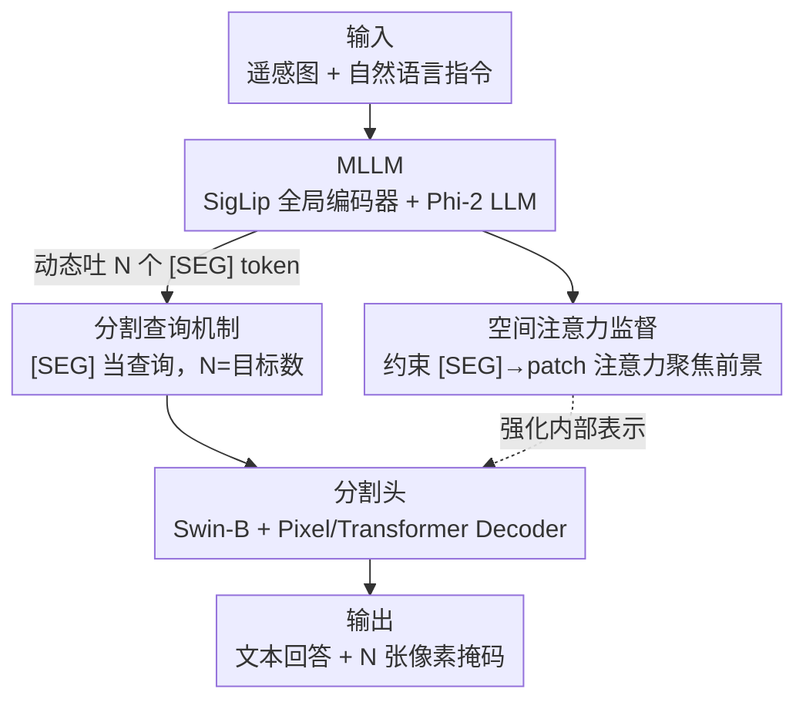

# SegEarth-R2: Towards Comprehensive Language-guided Segmentation for Remote Sensing Images

**会议**: CVPR 2026  
**论文**: [CVF Open Access](https://openaccess.thecvf.com/content/CVPR2026/html/Xin_SegEarth-R2_Towards_Comprehensive_Language-guided_Segmentation_for_Remote_Sensing_Images_CVPR_2026_paper.html)  
**代码**: https://github.com/earth-insights/SegEarth-R2  
**领域**: 遥感 / 语言引导分割 / 多模态VLM  
**关键词**: 遥感分割, 推理分割, 语言引导, 多目标分割, 注意力监督

## 一句话总结
针对遥感场景里"小目标 + 多粒度 + 多目标 + 隐式指令"四类复杂语言引导分割需求，本文先造了第一个系统覆盖这四个维度的大规模数据集 LaSeRS（40k 掩码、122 类、30k QA 三元组），再提出仅 3B 参数的 MLLM 分割模型 SegEarth-R2，靠"空间注意力监督 + 灵活分割查询"两个机制在多个基准上超越 7B/8B 甚至 13B 大模型。

## 研究背景与动机
**领域现状**：遥感语言引导分割（referring / reasoning segmentation）要把一句自然语言落到像素级掩码上，用于灾害响应、城市规划、环境监测等。主流做法是用 MLLM 当推理引擎、吐出 `[SEG]` token 再驱动 SAM 或 Mask2Former 类分割头出掩码。

**现有痛点**：现有模型只能处理"分割图中的飞机"这种**单目标、显式**指令，一旦遇到真实地理场景就崩——既要在不同粒度（语义级 / 实例级 / 部件级，如飞机机翼上那个只有几像素的发动机）上分割，又要一句话同时分出多个目标，还要理解"地震时往哪躲"这种**隐式意图**。

**核心矛盾**：问题的根源有两层。一是数据层——已有遥感分割数据集（RRSIS-D、RefSegRS、EarthReason 等）只覆盖单目标 + 显式查询，类别也少（≤28 类），训出来的模型对真实复杂指令极其敏感；二是模型层——遥感图像目标尺度跨度极大，只用"最终掩码"做监督时，反传到浅层的学习信号被严重稀释，小/细粒度目标定位差，而且"propose-then-select"式查询设计要先生成上百个候选掩码再匹配，既慢又不支持多目标。

**本文目标**：(1) 构建一个系统覆盖四个维度（层级粒度 / 目标多重性 / 推理要求 / 语言多样性）的训练 + 评测基准；(2) 设计一个能同时搞定小目标精定位和单/多目标动态分割的高效模型。

**核心 idea**：数据上用半自动流水线造 LaSeRS 把四个维度一次性补齐；模型上用**空间注意力监督**直接给 MLLM 内部注意力打监督信号（而不是只盯最终掩码），用**可动态吐多个 `[SEG]` token 的分割查询**取代笨重的候选-匹配范式。

## 方法详解
本文由"一套数据集 + 一个模型"组成。先看模型 SegEarth-R2：输入是一张遥感图 + 一句指令，输出是文本回答 + 对应的像素掩码。它由两大组件构成——一个 MLLM 负责读图读指令、做推理并在回答里吐出若干 `[SEG]` 查询 token；一个独立的分割头负责把这些 `[SEG]` token 翻译成掩码。两个核心机制分别挂在这两个组件上：空间注意力监督作用于 MLLM 内部注意力，灵活分割查询机制作用于掩码生成。

### 整体框架
完整流程：图像经全局视觉编码器（SigLip-so400M，384×384→27×27 image token）和指令文本一起喂进 LLM（Phi-2-2.7B），LLM 自回归生成文本回答，并在需要分割的地方吐出 `[SEG]` token；与此同时，从 `[SEG]` token 指向各图像 patch 的注意力图被**空间注意力监督**约束去聚焦前景。生成的 `[SEG]` token 作为查询送入分割头：分割头里 Swin-B 层级编码器对 1024×1024 输入抽多尺度特征，Pixel Decoder（Mask2Former）融合层级特征，Transformer Decoder（Mask2Former）让 `[SEG]` 查询与融合特征交互，最终每个 `[SEG]` 对应输出一张掩码——一条指令吐几个 `[SEG]` 就分出几个目标。整个模型仅 3B 参数，视觉编码器全部冻结，LLM 用 LoRA（rank 8）微调，两个 Decoder 全量微调。

### 关键设计

**1. 空间注意力监督：直接给 MLLM 内部注意力打监督，救小目标定位**

针对"只用最终掩码监督、信号稀释导致小/细粒度目标定位差"这个痛点，本文不再等最终输出来反推焦点，而是直接干预模型的推理路径，在注意力层面就逼它分清前景/背景。具体作用于 `[SEG]` token 到各图像 patch token 的注意力图：设第 $m$ 个 transformer block、第 $n$ 个 head 的注意力图为 $A^{(m,n)}\in\mathbb{R}^{d\times d}$，先跨所有 $M$ 层 $N$ 头平均聚合成统一注意力网格 $A_S=\frac{1}{MN}\sum_{m}\sum_{n}A^{(m,n)}$。用下采样后的 GT 掩码 $\hat G\in\{0,1\}^{d\times d}$，先算背景区域的平均注意力分数

$$a=\frac{\sum_{i,j}A_S(i,j)\cdot(1-\hat G(i,j))}{\sum_{i,j}(1-\hat G(i,j))}$$

再用一个损失逼前景注意力与该背景均值 $a$ 拉开最大距离：

$$L_S=-\log\frac{\sum_{i,j}\big(A_S(i,j)-a\big)^2\cdot\hat G(i,j)}{\sum_{i,j}\hat G(i,j)}$$

直观看就是：让前景 patch 的注意力强度尽量偏离背景均值，从而把注意力"锐化"到目标上。好处是给中间层一个清晰、局部化的学习信号，绕开了"只靠掩码反传、浅层学不到东西"的稀释问题——这也是它在最难的部件级分割上能比第二名高出约 20 个点的关键。⚠️ 上述两个公式按原文转写，符号细节以原文为准。

**2. 灵活分割查询机制：用动态 `[SEG]` token 取代"先提候选再匹配"，原生支持多目标**

针对"旧查询设计要么慢要么不支持多目标"这个痛点：InstructSeg 那类 "propose-then-select" 要先生成上百个候选掩码再做冗余匹配，既费算力又不灵活；SegEarth-R1 的 "instruction-as-query" 虽简单，却假设一条指令只对一个目标，天生搞不定多目标。本文借鉴 LISA 的 `[SEG]` token 思路，让模型**根据指令上下文动态输出任意多个 `[SEG]` token**（如"远离左上角的 `
building
[SEG]`、跑向 `
ground track field
[SEG]`"会吐两个），每个 `[SEG]` 充当一个独立分割查询送进 Transformer Decoder 出一张掩码。这样既不用"提候选-再匹配"的冗余流程，又天然支持单/多目标——目标数等于 `[SEG]` 数。一个额外收益：查询数减少时算力（TFLOPs）和推理时间同步下降，而 gIoU 反而小幅上升（见消融），说明少而准的查询比一大堆候选更好。

### 损失函数 / 训练策略
统一损失为四项加权和：$L=L_t+L_b+L_d+\lambda_S L_S$。其中 $L_t$ 是文本生成的自回归交叉熵；$L_b$（逐像素 BCE）+ $L_d$（DICE）做掩码监督；$L_S$ 即空间注意力监督，由系数 $\lambda_S$ 控制强度，最终取 $\lambda_S=0.01$。基座为 Mipha-3B，视觉编码器冻结、LLM 用 LoRA(rank 8)、两个 Decoder 全量微调。

## 实验关键数据

### 主实验
LaSeRS 基准上跨四个维度对比（gIoU/cIoU，越高越好），SegEarth-R2 仅 3B 参数却拿下平均最优：

| 维度 / 模型 | LISA-13B | PixelLM-13B | GeoPixel-8B | SegEarth-R2-3B |
|------|------|------|------|------|
| 部件级 Part | 17.7/13.1 | 15.8/17.6 | 43.9/52.4 | **64.8/68.3** |
| 单目标 Single | 38.4/34.2 | 42.2/40.5 | 55.0/45.8 | **55.1/69.2** |
| 多目标 Multiple | 19.9/23.5 | 20.9/22.4 | **49.2/49.7** | 38.3/56.2 |
| 隐式 Implicit | 22.6/25.8 | 25.9/22.1 | 41.1/58.3 | **42.8/59.7** |
| 平均 Avg. | 27.6/26.1 | 29.9/29.4 | 50.4/55.2 | **57.2/67.9** |

在三个公开 referring 分割基准上单独训练评测（gIoU），也都达到/超过 SOTA：

| 方法 | RRSIS-D test | RefSegRS test | RISBench test |
|------|------|------|------|
| GeoPixel-8B | 67.3 | - | - |
| SegEarth-R1 | 66.4 | 72.5 | - |
| SegEarth-R2 | **67.9** | **74.8** | **70.5** |

在 reasoning 分割基准 EarthReason 上，平均 70.9 超过 Text4Seg++(70.1) 与用 RL 的 RemoteReasoner(69.2)。

### 消融实验
注意力监督强度 $\lambda_S$ 与分割头组合的消融（gIoU）：

| 配置 | RRSIS-D test | EarthReason test | 说明 |
|------|------|------|------|
| $\lambda_S=0$（去掉 $L_S$） | 66.6 | 72.9 | 无注意力监督，整体最差 |
| $\lambda_S=0.1$ | 67.3 | 71.8 | 约束过强，损害 LLM 推理 |
| $\lambda_S=0.01$（采用） | **67.9** | **73.5** | 最佳平衡点 |
| SAM + ViT-H 分割头 | - | 65.4 | 换分割头，EarthReason val 仅 62.7 |
| M2F + Swin-B 分割头（采用） | - | **73.5** | val 72.3，明显优于 SAM/SAM2 |

### 关键发现
- **空间注意力监督在细粒度上收益最大**：去掉 $L_S$ 全面变差，且部件级分割比第二名高约 20 点，说明给中间层直接打注意力信号确实救活了小目标定位；但 $\lambda_S$ 不能太大（0.1/0.05 反而掉点），过度约束会压垮 LLM 的推理能力。
- **少而准的查询优于一大堆候选**：减少分割查询数时 TFLOPs 与推理时间下降，gIoU 反升——印证"propose-then-select"的冗余候选并无必要。
- **分割头选型很关键**：M2F+Swin-B 远好于 SAM/SAM2+ViT-H，遥感小目标更吃多尺度层级特征。
- **唯一短板是多目标**：3B 体量在多目标场景上不及 8B 的 GeoPixel（38.3 vs 49.2 gIoU），作者归因于参数规模限制，但仍是同体量里最强。

## 亮点与洞察
- **把监督直接打到注意力层**：跳过"等最终掩码反传"的稀释链路，用一个简单的前景/背景注意力分离损失给中间层强信号，是个可迁移到任意 `[SEG]`-based MLLM 分割模型的轻量 trick。
- **`[SEG]` 数 = 目标数的优雅设计**：把"几个目标"交给语言模型上下文动态决定，一举解决多目标，又顺手省掉候选匹配的算力。
- **数据 + 模型协同**：LaSeRS 的四维度切分（122 类、部件级掩码）本身就是把"复杂遥感指令"形式化的贡献，给后续工作提供了可量化的难度坐标系。

## 局限与展望
- **多目标仍是弱项**：3B 规模在多目标场景被 8B 模型反超，提示该任务对模型容量敏感，未来需要更强基座或针对多目标的专门设计。
- **依赖 Gemini-2.5-pro 生成 QA**：数据流水线靠大模型生成问答再人工过滤，存在幻觉残留风险，规模化时质量把控成本高。
- **注意力监督的超参敏感**：$\lambda_S$ 区间很窄（0.01 附近最优、0.05 就掉点），跨数据集是否需要重调有待验证。⚠️ 论文也提到更细粒度搜索可能得到略优值。

## 相关工作与启发
- **vs SegEarth-R1**: 同一团队前作用 "instruction-as-query" 假设单目标，本文用动态 `[SEG]` 查询支持多目标，并新增空间注意力监督；多个基准上全面超越前作。
- **vs GeoPixel**: GeoPixel 靠 8B 大基座在多目标上更稳，但本文用 3B + 注意力监督在部件级、隐式、平均指标上反超，体现"小模型 + 巧监督"的性价比。
- **vs LISA / InstructSeg**: 借鉴 LISA 的 `[SEG]` token，但抛弃 InstructSeg 的 "propose-then-select" 冗余匹配；相比通用域方法，本文针对遥感小目标专门用 M2F+Swin-B 层级特征 + 注意力监督。

## 评分
- 新颖性: ⭐⭐⭐⭐ 注意力层监督 + 动态查询的组合在遥感语言分割里较新，但两个组件均有出处（LISA / 注意力监督思想）。
- 实验充分度: ⭐⭐⭐⭐⭐ 自建基准 + 3 个 referring + 1 个 reasoning 基准，含 $\lambda_S$、分割头、查询数多组消融。
- 写作质量: ⭐⭐⭐⭐ 动机与失败分析清晰，四维度叙事完整；部分公式符号需对照原文。
- 价值: ⭐⭐⭐⭐⭐ LaSeRS 基准 + 高效 3B 模型对遥感语言引导分割社区有明确推动作用，数据与代码开源。

<!-- RELATED:START -->

## 相关论文

- [\[CVPR 2026\] CrossEarth-Gate: Fisher-Guided Adaptive Tuning Engine for Efficient Adaptation of Cross-Domain Remote Sensing Semantic Segmentation](crossearth-gate_fisher-guided_adaptive_tuning_engine_for_efficient_adaptation_of.md)
- [\[CVPR 2026\] HySeg: Learning Generative Priors for Structure-Aware Remote Sensing Segmentation](hyseg_learning_generative_priors_for_structure-aware_remote_sensing_segmentation.md)
- [\[CVPR 2026\] SkySense-VITA: Towards Universal In-context Segmentation of Multi-modal Remote Sensing Imagery](skysense-vita_towards_universal_in-context_segmentation_of_multi-modal_remote_se.md)
- [\[CVPR 2026\] ReAttnCLIP: Training-Free Open-Vocabulary Remote Sensing Image Segmentation via Re-defined Attention in CLIP](reattnclip_training-free_open-vocabulary_remote_sensing_image_segmentation_via_r.md)
- [\[CVPR 2026\] UniGeoSeg: Towards Unified Open-World Segmentation for Geospatial Scenes](unigeoseg_towards_unified_open-world_segmentation_for_geospatial_scenes.md)

<!-- RELATED:END -->
