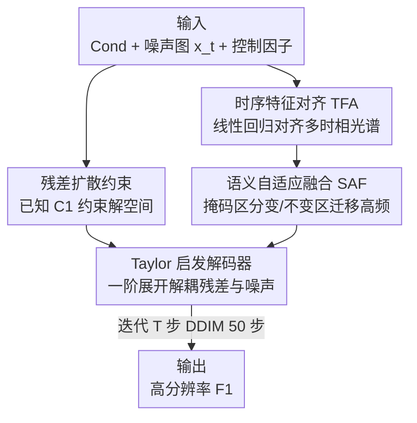

# Semantic-Adaptive Diffusion for Dynamic Spatiotemporal Fusion

**会议**: CVPR 2026  
**论文**: [CVF Open Access](https://openaccess.thecvf.com/content/CVPR2026/html/Zhang_Semantic-Adaptive_Diffusion_for_Dynamic_Spatiotemporal_Fusion_CVPR_2026_paper.html)  
**代码**: 无  
**领域**: 遥感 / 时空融合 / 扩散模型  
**关键词**: 时空融合, 残差扩散, 语义自适应, 时序对齐, 遥感影像

## 一句话总结
SA-STF 用一个由低分辨率观测约束、并经 Taylor 展开解耦残差与噪声的残差扩散框架，配合时序特征对齐（TFA）和语义自适应融合（SAF）两个模块，把 MODIS/Landsat 等多源卫星影像融合成高时空分辨率影像，尤其能恢复传统/数据驱动方法做不好的动态地物语义变化。

## 研究背景与动机

**领域现状**：单颗卫星无法同时兼顾高时间分辨率和高空间分辨率——MODIS 每 1–2 天重访但空间分辨率只有 250–1000 m，Landsat 空间分辨率 30 m 却约 16 天才重访一次。时空融合（Spatiotemporal Fusion, STF）就是为了打破这个权衡：用两对参考时刻的「粗-细」影像对 $(F_0,C_0)$、$(F_2,C_2)$ 加上目标时刻的粗影像 $C_1$，去重建目标时刻缺失的细影像 $F_1$，从而生成既频繁又精细的连续观测。

**现有痛点**：传统方法（加权函数 ESTARFM、解混、贝叶斯、字典学习、混合策略 FSDAF）依赖线性模型和手工特征，地物变化小时还行，长时间跨度的复杂动态就失效。深度学习方法（CNN/Transformer/GAN/Mamba-STF）虽能自动建模非线性，但纯数据驱动、缺乏显式约束，会在粗细尺度差异大的复杂动态区产生三类问题：① **伪影**——没有显式约束，尺度差大时容易出现明显 artifact；② **光谱失真**——不同采集时间、物候期带来时序光谱不一致，方法没显式建模时序动态就会扭曲光谱；③ **对语义变化不敏感**——地物转换（自然或人类活动驱动）带来语义变化，数据驱动框架难以充分利用参考影像里的高频信息去重建这些变化。

**核心矛盾**：粗影像和细影像之间存在巨大的尺度鸿沟（最高十几到几十倍分辨率差），而真正难恢复的恰恰是地物发生语义变化的「变化区」；纯数据驱动既缺约束去抑制伪影，又分不清「哪里没变可以直接照搬、哪里变了需要从语义匹配的参考块迁移细节」。

**切入角度**：作者借鉴残差去噪扩散模型 RDDM 的思路——把已知的低分辨率观测 $C_1$ 当成对解空间的强约束，让扩散过程从「$F_1$ + 残差 + 噪声」的退化态反向重建，而不是从纯噪声盲生成。同时观察到：残差扩散里噪声与残差在特征空间会非线性纠缠，可以用一阶 Taylor 展开在特征级把它们解耦。

**核心 idea**：用「低分辨率观测 + 中间融合特征」显式约束扩散解空间，用 Taylor 启发的解码器解耦残差与噪声保证重建稳定，再用 TFA 对齐时序光谱、用 SAF 按语义相似度自适应迁移高频细节，从而精准恢复动态地物的语义变化。

## 方法详解

### 整体框架
SA-STF 是一个条件残差扩散网络，目标是建模 $p(F_1\mid \mathrm{Cond})$，其中条件集 $\mathrm{Cond}=\{C_1,F_0,C_0,F_2,C_2\}$。前向过程对目标细影像 $F_1$ 同时注入残差和噪声：

$$x_t = F_1 + \bar\alpha_t x_{res} + \bar\beta_t\,\varepsilon,\qquad x_{res} = C_1 - F_1$$

其中 $\varepsilon\sim\mathcal N(0,I)$，$\bar\alpha_t$ 是残差权重、$\bar\beta_t$ 是噪声方差，$t$ 足够大时 $x_t$ 近似为噪声与低分观测 $C_1$ 的线性组合。和 RDDM 用两个独立网络分别估计 $\varepsilon_\theta$ 和 $x_{res}^\theta$ 不同，SA-STF 引入中间变量 $F_1^t$ 把两者的反向过程统一成一个网络，反向迭代为：

$$x_{t-1} = \tfrac{\bar\beta_{t-1}}{\bar\beta_t}x_t + \gamma_t F_1^t + \lambda_t\,(C_1 - F_1^t)$$

单网络估计 $F_1^t$ 既提升训练稳定性又降低计算成本。整个网络由三大件组成：**噪声编码器**（从 $x_t$ 提多尺度特征）、**融合编码器**（含浅层融合 + 深层融合，深层里嵌 TFA 和 SAF）、**Taylor 启发解码器**（含深度残差移除 De-Res + 去噪解码器）。融合编码器把 $\mathrm{Cond}$ 投影到统一隐空间、产出可靠的语义引导特征 $F_d$；解码器据 Taylor 展开把残差从 $f_\theta(x_t)$ 里减掉、再去噪，逐步重建出中间变量 $F_1^t$。

### 关键设计

**1. 残差扩散约束解空间：把已知的低分观测当成「锚」而非从噪声盲生成**

针对纯生成模型缺约束、易出伪影和光谱漂移的痛点，SA-STF 不从纯高斯噪声重建，而是把退化态显式写成 $x_t = F_1 + \bar\alpha_t x_{res} + \bar\beta_t\varepsilon$，其中残差 $x_{res}=C_1-F_1$ 正是「目标细影像和已知粗影像之间的差」。由于 $C_1$ 在推理时已知，反向过程天然被低分观测牵引，解空间被压缩在「与 $C_1$ 光谱一致」的流形附近，从源头抑制了无约束生成的伪影和光谱失真。相比 RDDM 用两个网络分别估噪声和残差，本文通过中间变量 $F_1^t$ 把两者的反向更新（式 2 的 $\gamma_t,\lambda_t$ 系数）耦合进单一网络预测，既减少参数与计算、又让残差与噪声的去除共享同一套特征，训练更稳。

**2. Taylor 启发解码器：在特征空间把纠缠的残差和噪声一阶展开拆开**

残差与噪声在像素级是线性叠加，但经过网络后在特征空间会非线性纠缠，直接去噪会累积误差。作者在 $x_t=F_1$ 附近对特征提取器做一阶 Taylor 展开：

$$f_\theta(x_t) = f_\theta(F_1) + \eta_{res}x_{res} + \eta_\varepsilon\varepsilon + o(F_1),\quad \eta_\varepsilon=\bar\beta_t\nabla f_\theta(F_1),\ \eta_{res}=\bar\alpha_t\nabla f_\theta(F_1)$$

其中 $\nabla f_\theta(F_1)$ 是充当局部线性近似的 Jacobian。据此，先用「深度残差移除模块 De-Res」估计并减掉残差项 $\eta_{res}x_{res}$——它具体把深层融合特征 $F_d$ 从 $C_1$ 里减出 $\nabla f_\theta(F_1)x_{res}$、经两个 TE-Block（内含残差卷积+MLP）把残差强度 $\bar\alpha_t$ 显式嵌入后预测出残差分量；减掉残差后剩下 $f_\theta(F_1)+\eta_\varepsilon\varepsilon$ 这类「干净+噪声」特征，再交给去噪解码器结合噪声强度 $\bar\beta_t$ 逐级去噪、放大分辨率。把「解耦」做成显式的数学结构，而不是让网络黑箱学，既稳定又更可解释。

**3. 时序特征对齐 TFA：用线性回归对齐多时相光谱，消除物候导致的光谱失真**

由于参考影像与目标时刻采集时间、物候不同，多时相特征光谱不一致。作者注意到多时相特征的逐像素变化用线性回归就足够建模、且优化更稳，于是 TFA 从粗分辨率特征里学一对系数把细分辨率特征对齐到目标时刻：

$$a_l = f_a(\mathrm{Concat}(C_1^5, C_0^5)),\quad b = f_b(F_0^5 - C_0^5),\quad HR_0^5(i,j)=a_h(i,j)\times F_0^5(i,j)+b$$

其中 $a$ 是时序动态系数、$b$ 是差异系数；但粗细尺度差大，直接把粗特征上估的系数套到细特征会有对齐偏差，于是再加一个跨注意力适配模块 $a_h=g(a_l,C_0^5,F_0^5)$ 在尺度间建立语义对应、细化回归系数。系数估计前还用自注意力增强特征判别性。两个 TFA 分别把 $F_0^5$、$F_2^5$ 对齐成 $HR_0^5$、$HR_2^5$，送入 SAF。这一步专治「光谱失真」，且训练时配 warm-up（式 14 余弦调度）逐渐激活时序建模、避免早期干扰主目标。

**4. 语义自适应融合 SAF：用相似度掩码区分变化/不变区，只在变化区从语义匹配块迁移高频**

针对「对语义变化不敏感」的痛点，SAF 的核心思路是「不变区直接照搬、变化区精挑细节」。先算欧氏相似度 $S^{hr}$（$F_0^5$ 与 $F_2^5$ 之间）和 $S_0^{lr}/S_2^{lr}$（$F_0^5/F_2^5$ 与 $C_1^5$），据此构造区域掩码：

$$M(i,j)=\begin{cases}1 & \text{if } S^{hr}<\min(S_0^{lr},S_2^{lr})\\0 & \text{if } S^{hr}>\min(S_0^{lr},S_2^{lr})\end{cases}$$

直觉是：若某区域在 $t_0$ 和 $t_2$ 两个参考时刻高度相似（$S^{hr}$ 很小），则中间时刻很可能也没变，判为不变区（$M=1$），直接用先验细特征 $F_0^5$ 表示；否则判为潜在变化区。对变化区，再比较 TFA 对齐后的 $HR_0^5$、$HR_2^5$ 与当前 $C_1^5$ 的相似度 $S_0^r,S_2^r$，选更相似的那个参考来填：

$$F_d = \begin{cases}M\times F_0^5 + (1-M)\times HR_0^5 & \text{if } S_0^r<S_2^r\\ M\times F_0^5 + (1-M)\times HR_2^5 & \text{if } S_0^r>S_2^r\end{cases}$$

这样得到的深层语义特征 $F_d$ 只在真正变化的地方从「语义最匹配的参考块」迁移高频细节，避免无关区域互相干扰，为后续重建提供精准语义引导。

### 损失函数 / 训练策略
总损失整合三项：重建损失 $L_{rec}=\frac{1}{CHW}\|F_1-F_1^t\|_1$（L1）、感知损失 $L_{per}$（VGG-16 第 $i$ 层特征的 L2 距离）、时序对齐损失 $L_{time}=\frac1N\|f_{C_1}-\hat f_{C_1}\|_2^2$（约束 TFA 预测的目标时刻粗影像深特征）：

$$L_{overall}=\lambda_{rec}L_{rec}+\lambda_{per}L_{per}+\lambda_{time}L_{time}$$

$\lambda_{time}$ 用余弦 warm-up（式 14）随 epoch 渐增，先专注主目标再激活时序建模。实现上：扩散步 $T=100$，推理用 DDIM 采样 50 步；训练 200 epoch、batch=4、Adam，$\lambda_{rec}=1,\lambda_{per}=0.01,\lambda_{lr}=10^{-4}$，初始学习率 $10^{-4}$、每 40 epoch 减半。

## 实验关键数据

### 主实验
在三个异质区域基准数据集上评测：CIA（南新南威尔士灌溉水稻区）、LGC（北新南威尔士洪涝区）、AHB（内蒙古农牧混合区），对比 ESTARFM、MLFF-GAN、SwinSTFM、STFDiff、STFMamba 五个 SOTA。指标：CC↑、SSIM↑、ERGAS↓、RMSE↓、SAM↓。

| 数据集 | 指标 | SA-STF(本文) | 次优 | 说明 |
|--------|------|------|----------|------|
| CIA | SSIM↑ / ERGAS↓ / SAM↓ | 0.8924 / 0.8910 / 0.0538 | 0.8885 / 0.9293 / 0.0611(ESTARFM) | 短时跨度，传统 ESTARFM 反超多数深度法，本文仍最优 |
| LGC | CC↑ / RMSE↓ / SAM↓ | 0.9360 / 0.0169 / 0.0531 | 0.9284 / 0.0174 / 0.0565(STFMamba) | 洪涝大变化场景，本文全指标第一 |
| AHB | CC↑ / SSIM↑ / RMSE↓ | 0.8729 / 0.8962 / 0.0283 | 0.8658 / 0.8830 / 0.0314 | 多季节物候动态，本文全指标第一 |

在 CIA 这种变化小的短跨度场景，线性的 ESTARFM 甚至优于若干深度法（深度法因粗细尺度差产生模糊），但 SA-STF 凭语义自适应迁移仍拿到最优；在 LGC、AHB 这类大变化/强物候动态场景优势更明显。

### 消融实验（LGC 数据集）
| 配置 | CC↑ | SSIM↑ | ERGAS↓ | RMSE↓ | SAM↓ | 说明 |
|------|-----|-------|--------|-------|------|------|
| RDDM | 0.9194 | 0.9319 | 0.8504 | 0.0191 | 0.0683 | 基线残差扩散 |
| Taylor 框架 | 0.9194 | 0.9387 | 0.8486 | 0.0180 | 0.0652 | 仅 Taylor 解码器，去掉 TFA/SAF |
| +TFA | 0.9262 | 0.9386 | 0.8083 | 0.0177 | 0.0621 | 加时序对齐 |
| +SAF | 0.9271 | 0.9432 | 0.7230 | 0.0172 | 0.0562 | 加语义融合 |
| **OURS(全)** | **0.9360** | **0.9440** | **0.6751** | **0.0169** | **0.0531** | 全组件 |
| Only TFA+SAF | 0.9306 | 0.9437 | 0.7045 | 0.0178 | 0.0545 | 去掉扩散，仅两模块 |

### 关键发现
- 只留 Taylor 解码器时除 ERGAS 外与 RDDM 相当——因为缺了 SAF/TFA，残差估计不准、Taylor 结构发挥不出来；TFA、SAF 单独加入都带来稳定提升，SAF 对 SAM/ERGAS（光谱与综合误差）贡献尤其大（ERGAS 0.8083→0.7230）。
- 「Only TFA+SAF」去掉扩散后仍很有竞争力，说明 TFA/SAF 可作为即插即用组件用于其他 STF 方法；但当粗细分辨率差距大时，去掉扩散会让 ERGAS 明显变差、细节恢复变弱——扩散约束在大尺度差场景不可或缺。
- 在变化小的短跨度数据（CIA）上线性传统法很强，说明扩散/深度法的真正价值体现在长间隔、强语义变化的动态场景。

## 亮点与洞察
- **把扩散退化建模成「残差+噪声」并用 Taylor 一阶展开显式解耦**：这是最巧妙的一步——不让网络黑箱学解耦，而是给出 $f_\theta(x_t)=f_\theta(F_1)+\eta_{res}x_{res}+\eta_\varepsilon\varepsilon$ 的可分析结构，De-Res 减残差、解码器去噪各司其职，既稳又可解释。
- **单网络统一残差/噪声反向过程**：用中间变量 $F_1^t$ 把 RDDM 的双网络合一，降本增稳，是把已有扩散范式工程化落地到遥感的实用改进。
- **变化区/不变区的相似度掩码思路可迁移**：SAF 用「两参考时刻互相似 → 中间也没变」的时序先验构造掩码、只在变化区迁移高频，这套「先判稳定性再决定照搬还是精修」的逻辑可迁移到视频插帧、时序医学影像等其他时序重建任务。
- **TFA 用线性回归 + 跨尺度跨注意力对齐**：承认逐像素时序变化用线性回归即可、再用跨注意力补尺度差，是「简单模型 + 针对性补丁」而非一味堆容量的好范例。

## 局限与展望
- 作者承认：对**罕见的突变且无匹配参考**的情形，SA-STF 虽能借学到的分布保住粗观测的光谱趋势，但精细细节的重建能力受限；未来计划引入额外先验提升鲁棒性。
- SAF 的不变/变化掩码基于「两参考时刻相似即中间不变」的假设，对「先变后变回」的往复变化或参考时刻本身就落在变化中途的情形可能误判。
- 评测只在 CIA/LGC/AHB 三个 MODIS-Landsat 数据集、固定两对参考影像设置下进行；对更多源传感器、更大时间跨度、云遮挡缺失等真实退化的泛化未充分验证。
- 论文未公开运行时/参数量对比，扩散 50 步采样相对单次前向的 GAN/Mamba 在推理开销上的代价没有量化（消融已显示去掉扩散仍可用，但代价细节缺失）。

## 相关工作与启发
- **vs ESTARFM（加权函数传统法）**：ESTARFM 用线性加权参考观测，短跨度小变化时反而优于多数深度法，但长间隔复杂动态失效；SA-STF 用扩散约束+语义自适应在动态场景全面反超，代价是更高的训练/推理复杂度。
- **vs STFMamba（数据驱动 SOTA）**：STFMamba 用 Mamba 高效建模全局时空依赖、在 LGC 上是次优，但纯数据驱动难捕捉剧烈语义变化；SA-STF 靠 TFA 对齐时序、SAF 显式区分变化区取胜。
- **vs STFDiff / RDDM（扩散类）**：STFDiff 用条件扩散生成融合图但缺约束、变化区光谱保不住；RDDM 引入残差+噪声双扩散但用双网络。SA-STF 在 RDDM 基础上用中间变量合并单网络、加 Taylor 解耦和 TFA/SAF，把残差扩散针对性地适配到遥感时空融合。
- **vs MLFF-GAN / SwinSTFM（GAN/Transformer 生成）**：能生成细节但缺约束、变化区易光谱失真；SA-STF 用低分观测当锚 + 语义匹配迁移，兼顾细节与光谱一致性。

## 评分
- 新颖性: ⭐⭐⭐⭐ 把残差扩散 + Taylor 一阶解耦 + 时序对齐 + 语义自适应掩码组合到遥感时空融合，单网络统一与解耦结构有原创性，但单个组件多为已有思路的迁移整合。
- 实验充分度: ⭐⭐⭐⭐ 三个异质数据集、五指标、五个对比方法、完整消融且含即插即用验证，较扎实；但缺运行时/参数量对比、突变与跨传感器泛化未充分测。
- 写作质量: ⭐⭐⭐⭐ 动机三大挑战清晰、公式推导（残差扩散、Taylor 展开、掩码）完整，方法与实验对应得上；部分符号（$F_d$、$HR$ 上下标）密集需对照图看。
- 价值: ⭐⭐⭐⭐ 对精准农业、灾害监测等需高时空分辨率的遥感应用实用，TFA/SAF 可即插即用迁移到其他 STF 方法，落地价值明确。

<!-- RELATED:START -->

## 相关论文

- [\[CVPR 2026\] CrossEarth-Gate: Fisher-Guided Adaptive Tuning Engine for Efficient Adaptation of Cross-Domain Remote Sensing Semantic Segmentation](crossearth-gate_fisher-guided_adaptive_tuning_engine_for_efficient_adaptation_of.md)
- [\[CVPR 2026\] Exploring Spatiotemporal Feature Propagation for Video-Level Compressive Spectral Reconstruction](exploring_spatiotemporal_feature_propagation_for_video-level_compressive_spectra.md)
- [\[CVPR 2025\] SGFormer: Satellite-Ground Fusion for 3D Semantic Scene Completion](../../CVPR2025/remote_sensing/sgformer_satellite-ground_fusion_for_3d_semantic_scene_completion.md)
- [\[CVPR 2026\] Fast Kernel-Space Diffusion for Remote Sensing Pansharpening](fast_kernel-space_diffusion_for_remote_sensing_pansharpening.md)
- [\[CVPR 2026\] GeoDiT: A Diffusion-based Vision-Language Model for Geospatial Understanding](geodit_a_diffusion-based_vision-language_model_for_geospatial_understanding.md)

<!-- RELATED:END -->
