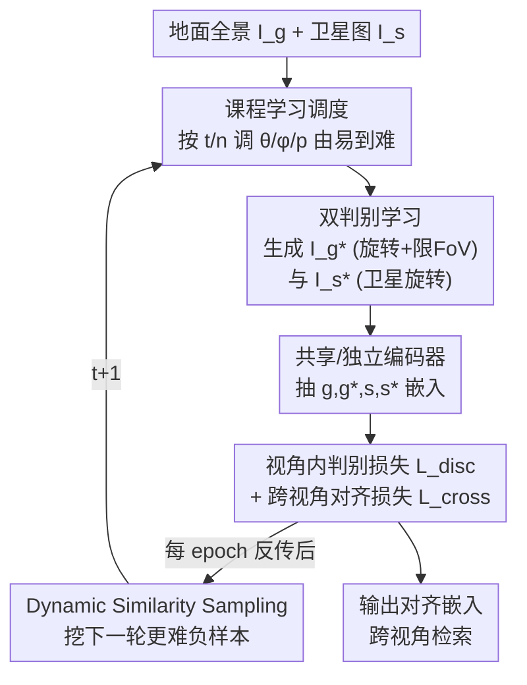

# SinGeo: Unlock Single Model's Potential for Robust Cross-View Geo-Localization

**会议**: CVPR 2026  
**论文**: [CVF Open Access](https://openaccess.thecvf.com/content/CVPR2026/html/Chen_SinGeo_Unlock_Single_Models_Potential_for_Robust_Cross-View_Geo-Localization_CVPR_2026_paper.html)  
**代码**: https://github.com/Yangchen-nudt/SinGeo  
**领域**: 遥感 / 跨视角地理定位  
**关键词**: 跨视角地理定位, 鲁棒性, 课程学习, 对比学习, 自监督

## 一句话总结
SinGeo 用「双分支判别学习 + 课程学习」让**一个模型**同时适应任意朝向和任意 FoV 的跨视角地理定位，无需为不同 FoV 各训一个模型，在 CVUSA 极端窄视场（FoV=90°/70°）下首次把 R@1 推过 70%/50%，还能即插即用地提升 ViT/CNN/混合架构的鲁棒性。

## 研究背景与动机

**领域现状**：跨视角地理定位（Cross-View Geo-Localization, CVGL）的任务是拿一张地面视角的查询图，去带 GPS 标签的卫星图库里检索匹配，从而推断拍摄位置，用于机器人导航、自动驾驶、AR 等。主流做法是用两个编码器分别抽地面图和卫星图的特征嵌入，再用对比损失（如 InfoNCE）对齐两个视角的相似度。

**现有痛点**：经典 benchmark（CVUSA、CVACT）里地面图都是**正北对齐的全景图**，性能早已饱和；但真实场景里手机/车载相机拍的图**朝向未知、FoV 受限**（常见 70°–180°），现有方法在这种条件下会严重崩溃。已有的鲁棒方法各有短板：一类靠显式视角变换（极坐标变换、BEV 投影）来缩小跨视角差异，但会引入图像畸变、依赖预设参数；另一类靠数据增强，从全景图里裁出**固定 FoV** 的样本来训练。

**核心矛盾**：固定 FoV 训练范式带来一个根本困境——**模型只在训练用的那个 FoV 上表现好，换到没见过的 FoV 就大幅退化**。结果就是要覆盖多种 FoV 必须部署多个模型。有人尝试过随机 FoV 训练（ConGeo、TransGeo 试过 0°–360° 随机），但反而打不过它们自己的固定 FoV 版本——因为这种做法**隐含假设了所有 FoV 难度相同**，把简单的全景和极难的窄视场一锅乱炖。而且过往工作普遍**只盯着地面分支**，忽视了卫星分支自身的判别力。

**本文目标**：不靠任何显式变换、不加任何额外模块，让**单个模型**在朝向和 FoV 都变化时都保持一致的高性能。

**切入角度**：作者把人类做地理定位的过程类比成一个循序渐进的学习过程——初到陌生地点先做 360° 全景扫视来定位，越来越熟练后只看一小块视野就能在地图上对上号。这启发了「难度从易到难调度」的课程学习思路；同时，作者认为窄视场下**视角内（intra-view）的判别力**才是抽出有意义特征的关键，于是要同时强化地面和卫星两个分支。

**核心 idea**：用「双判别学习架构 + 课程引导的渐进训练」替代「为每个 FoV 单训一个模型」，让一个 backbone 自适应跨 FoV/朝向的鲁棒定位。

## 方法详解

### 整体框架

SinGeo 的输入是一对地面全景图 $I_g$ 和卫星图 $I_s$，输出是两个视角对齐后的特征嵌入，用于检索。整条流程围绕两个**无模块（module-free）**的设计展开，因此可以直接套进任意 CVGL backbone（ViT / CNN / CNN+Attention）。

第一块是**双判别学习（Dual Discriminative Learning, DDL）**：在地面分支上对全景做「随机旋转 + 限制 FoV」生成正样本 $I_g^*$，在卫星分支上对卫星图做旋转生成正样本 $I_s^*$，于是同时构造出视角内自监督对 $(I_g, I_g^*)$、$(I_s, I_s^*)$ 和跨视角对，逼模型先把每个分支自身的判别区域学好，再做跨视角对齐。第二块是**课程学习（Curriculum Learning, CL）**：把数据增强里控制难度的参数（FoV 角度 $\theta$、卫星旋转角 $\phi$/概率 $p$）写成随训练进度 $t/n$ 单调变化的调度函数，让训练从「易」（接近全景）平滑过渡到「难」（窄视场、大旋转）。每个 epoch 反向传播更新编码器后，再用更新后的编码器做 Dynamic Similarity Sampling 为下一轮挖更难的负样本，形成一个「难度递进 + 负样本递进」的闭环。

### 关键设计

**1. 双判别学习架构（DDL）：同时强化地面与卫星两个分支的视角内判别力**

针对「过往方法只优化地面分支、且 InfoNCE 这类纯跨视角对齐容易走捷径（shortcut）」的痛点，SinGeo 在两个分支上各自做自监督。地面分支用变换 $T_g^1(\alpha,\theta)$ / $T_g^2(\alpha,\theta)$ 生成正样本 $I_g^*$：CNN 版把全景水平随机平移角度 $\alpha$ 再裁出 FoV 为 $\theta$ 的视图；ViT 版进一步把裁出的视图用零填充回原全景尺寸。卫星分支则对 $I_s$ 做旋转生成 $I_s^*$，提供连续的外接/内接旋转 $T_s^1(\phi)$、$T_s^2(\phi)$ 和离散旋转 $T_s^3(p)$（以概率 $p$ 顺时针转 90°/180°/270°），全部叠加亮度、饱和度等色彩增强。

判别损失对每个分支各做一遍视角内对比：$L(g^*, G) = -\log \frac{\exp(g^*\cdot g^+/\tau)}{\sum_{g_i\in G}\exp(g^*\cdot g_i/\tau)}$，卫星分支 $L(s^*,S)$ 同理定义，合起来 $L_{disc}=L(g^*,G)+L(s^*,S)$。其中 $g^+$ 是与 $g^*$ 唯一匹配的正样本，$G$ 里其余都是负样本。这一步的关键在于：让模型被迫去关注每个分支**自身真正重要的区域**（卫星图里的判别性区域），而不是只盯着「地面图和卫星图哪里对得上」，从而避免对单一分支的过拟合偏置。跨视角对齐则用更丰富的样本组合：

$$L_{cross} = L(g, S) + \omega_1 L(g^*, S) + \omega_2 L(g, S^*) + \omega_3 L(g^*, S^*)$$

总目标 $L_{total} = L_{cross} + \gamma L_{disc}$，$\gamma$ 平衡判别性与跨视角对齐。

**2. 课程学习驱动的渐进训练（CL）：把「所有 FoV 一样难」的错误假设换成由易到难的难度调度**

针对「随机 FoV 训练隐含假设所有 FoV 难度相同、反而打不过固定 FoV」的痛点，SinGeo 把增强参数写成训练进度的函数，让模型先在接近全景的简单条件下学好基础，再逐步逼近窄视场、大旋转的困难条件。形式上，对任一难度参数 $\eta\in\{\theta,\phi,p\}$（初值 $\eta_{init}$ 对应易、终值 $\eta_{final}$ 对应难）：

$$\eta(t) = \eta_{init} + (\eta_{final}-\eta_{init})\cdot f(t/n)$$

其中 $f(\cdot)$ 是单调递增的调度函数。实验里 FoV 从 $\theta_{init}=360°$ 收到 $\theta_{final}=70°$（$\eta_{init}>\eta_{final}$ 故 $\theta$ 递减），离散旋转概率 $p$ 从 25% 升到 100%。$f$ 有三种变体对应不同的人类学习节奏：线性 $f_1(x)=x$（匀速）；快到慢的指数 $f_2(x)=\frac{1-\exp(-\lambda x)}{1-\exp(-\lambda)}$；慢到快的指数 $f_3(x)=\frac{\exp(\lambda x)-1}{\exp(\lambda)-1}$（主实验用线性 $f_1$）。课程之所以有效，是因为早期在简单 FoV 下习得的知识能显著促进后期极端 FoV 的学习——这也解释了为什么 SinGeo 在 90°/70° 这种极窄视场下反超那些专门为极端 FoV 训练的模型。每个 epoch 还会接 Dynamic Similarity Sampling，用更新后的编码器按视觉相似度挖下一轮负样本，让负样本难度和课程难度同步递进。

### 损失函数 / 训练策略
主实验 backbone 用 ConvNeXt-B，权重 $\omega_1=\omega_2=\omega_3=0.25$、$\gamma=0.5$；InfoNCE 用 0.1 的 label smoothing；卫星侧主实验用离散旋转 $T_s^3(p)$，调度函数用线性 $f_1$。以 Sample4Geo 为 baseline，训练 80 epoch、batch size 16，AdamW（初始学习率 1e-4）+ cosine 调度。

## 实验关键数据

### 主实验：CVUSA / CVACT 单模型对比（未知朝向 + 限制 FoV，R@1）

| 数据集 | FoV | Sample4Geo | SinGeo | ConGeo（FoV 专训，灰底参考） |
|--------|-----|-----------|--------|------------------------------|
| CVUSA | 360° | 93.3 | **96.8** | 96.6 |
| CVUSA | 180° | 84.6 | **91.8** | 92.3 |
| CVUSA | 90° | 55.1 | **70.1** | 55.5 |
| CVUSA | 70° | 40.9 | **58.0** | 49.1 |
| CVUSA | Avg. | 68.5 | **79.1** | 73.4 |
| CVACT | 90° | 27.9 | **42.6** | 40.6 |
| CVACT | 70° | 18.8 | **29.0** | 24.6 |

单模型 SinGeo 在几乎所有场景刷新 SOTA，且在 CVUSA 上**首次让 FoV=90°/70° 的 R@1 突破 70%/50%**；它甚至超过 ConGeo 为各 FoV 单独训练的多个模型（仅 180° 略低于 ConGeo）。在更难的非中心对齐数据集 VIGOR 上，Same-Area 的 FoV=90° R@1 从 ConGeo 的 8.5 提到 **24.0**；在 University-1652 这种数据稀缺、无全景的场景也优于 ConGeo/LPN。

### 消融实验：DDL 各组件 + CL（CVUSA，R@1）

| $I_g^*$ | $I_s^*$ | CL | 360° | 180° | 90° | 说明 |
|:---:|:---:|:---:|------|------|-----|------|
| × | × | × | 93.3 | 84.6 | 55.1 | baseline |
| ✓ | × | × | 85.2 | **92.3** | 55.9 | 只加地面正样本：180° 涨但 360°/90° 掉 |
| ✓ | ✓ | × | 91.5 | 80.6 | 47.8 | 加卫星正样本但无 CL：限 FoV 反而受损 |
| ✓ | × | ✓ | 96.2 | 92.1 | 66.9 | 加 CL：全面回升 |
| ✓ | ✓ | ✓ | **96.8** | 91.8 | **70.1** | 完整模型，90° 最佳 |

### 关键发现
- **CL 是把双分支判别力「兑现」成鲁棒性的关键**：单看 DDL（$I_g^*+I_s^*$ 无 CL）在限制 FoV 下甚至掉点（90° 仅 47.8），只有叠加 CL 才在极端 FoV 大幅回升（90° → 70.1），印证 DDL 与 CL 的协同。
- **跨架构即插即用**：把 SinGeo 训练策略迁到 Sample4Geo 的 ViT 变体，360° R@1 从 16.7 飙到 **76.0**；迁到 GeoDTR 360° R@1 提升超 47 个点，均优于同为即插即用的 ConGeo。
- **一致性与鲁棒性强相关**：作者用 Grad-CAM 热图的归一化 SSIM 定义朝向一致性（OC）与 FoV 一致性（FC），SinGeo 的 $OC_{grd}=0.81$、$OC_{sat}=0.92$、$FC_{grd}=0.66$ 全面领先（ConGeo $OC_{grd}$ 仅 0.38），说明视角变化时 SinGeo 关注区域更稳定。
- **不牺牲传统场景**：在正北对齐的标准设置（Tab.2）下 SinGeo 仍有竞争力（CVUSA R@1=97.3），与 Sample4Geo 的小差距源于后者专门的采样策略。

## 亮点与洞察
- **「单模型替代多模型」的范式转变**：以往要覆盖多种 FoV 得部署多个专训模型，SinGeo 用一个 backbone 全包，且在极端 FoV 上反超专训模型——这对真实部署（手机/车载任意视场）非常实用。
- **课程学习首次用于鲁棒 CVGL**：把「FoV/旋转难度」做成随 epoch 单调变化的可调度量，并与 Dynamic Similarity Sampling 的负样本挖掘同步递进，是一个干净、可迁移的训练范式，而非堆模块。
- **卫星分支自监督的洞察**：旋转卫星图做自监督，逼模型关注卫星图里真正有判别力的区域，而非盲目找「地面-卫星对应块」，这个「别只盯一个分支」的思路可迁移到其他跨域检索任务。
- **一致性度量（OC/FC）作为可解释工具**：用 Grad-CAM 热图的 SSIM 一致性把「为什么更鲁棒」量化出来，为后续研究提供了可衡量鲁棒性的客观视角，而不只是看 recall。

## 局限与展望
- 作者承认：SinGeo **训练时需要全景图先验**；在没有对齐全景的数据集（如 University-1652）上如何取得同样优异的性能仍是挑战。
- ⚠️ 消融里「只加 $I_s^*$ 无 CL」会损害限制 FoV 性能（90° 掉到 47.8），说明 DDL 与 CL 强耦合、单独用 DDL 并不稳，缺一不可——对想只借用其中一块的人是个提醒。
- 调度函数三变体、卫星旋转三变体、各权重的细致消融都放在补充材料，正文只给主结论，复现时需查补充材料确认超参。
- 改进思路：把课程难度调度做成自适应（按当前 batch 难度动态调 $\theta/p$）而非预设的 $f(t/n)$，或探索无全景先验下的课程构造，可能进一步打开 University-1652 这类受限场景。

## 相关工作与启发
- **vs ConGeo（即插即用对齐）**：ConGeo 对齐全景与其裁剪版的嵌入，但只支持**固定 FoV** 训练，换 FoV 就退化；SinGeo 用课程让单模型覆盖全 FoV，且作为即插即用增强器在 ViT/CNN/混合架构上普遍超过 ConGeo。
- **vs Sample4Geo（强 baseline）**：Sample4Geo 用单 CNN + InfoNCE + 难负样本采样，无额外模块但不专攻鲁棒 CVGL；SinGeo 以它为 baseline，借其 Dynamic Similarity Sampling 并叠加 DDL+CL，在限制 FoV 下大幅领先。
- **vs DSM / ArcGeo / GAL（显式变换 / 固定 FoV 增强）**：这些方法靠极坐标变换、BEV 投影或固定 FoV 裁剪，引入畸变或只在单一 FoV 见效；SinGeo 完全无显式变换、无额外模块，靠训练范式取胜。

## 评分
- 新颖性: ⭐⭐⭐⭐ 首次把课程学习引入鲁棒 CVGL，并提出双分支判别 + OC/FC 一致性度量，组合新颖。
- 实验充分度: ⭐⭐⭐⭐⭐ 四个数据集、跨架构迁移、一致性量化、完整消融，验证扎实。
- 写作质量: ⭐⭐⭐⭐ 动机清晰、图表完整；部分关键超参与变体消融压到补充材料。
- 价值: ⭐⭐⭐⭐⭐ 「单模型覆盖全 FoV」直击真实部署痛点，且能即插即用增强已有方法。

<!-- RELATED:START -->

## 相关论文

- [\[CVPR 2026\] GeoBridge: A Semantic-Anchored Multi-View Foundation Model Bridging Images and Text for Geo-Localization](geobridge_a_semantic-anchored_multi-view_foundation_model_bridging_images_and_te.md)
- [\[CVPR 2026\] PAUL: Uncertainty-Guided Partition and Augmentation for Robust Cross-View Geo-Localization under Noisy Correspondence](paul_uncertainty-guided_partition_and_augmentation_for_robust_cross-view_geo-loc.md)
- [\[CVPR 2026\] RHO: Robust Holistic OSM-Based Metric Cross-View Geo-Localization](rho_robust_holistic_osm-based_metric_cross-view_geo-localization.md)
- [\[CVPR 2026\] Geo2: Geometry-Guided Cross-view Geo-Localization and Image Synthesis](geo2_geometry-guided_cross-view_geo-localization_and_image_synthesis.md)
- [\[CVPR 2026\] UniGeoRS: A Unified Benchmark for Tri-view Geo-Localization](unigeors_a_unified_benchmark_for_tri-view_geo-localization.md)

<!-- RELATED:END -->
