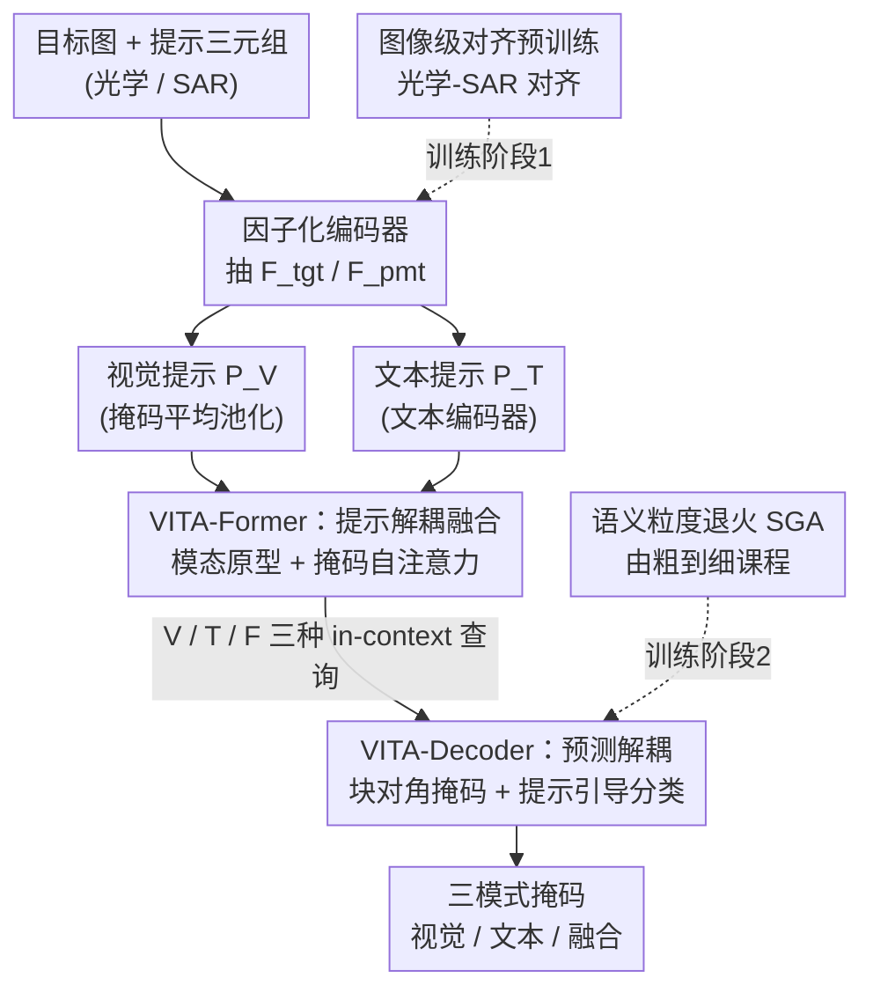

# SkySense-VITA: Towards Universal In-context Segmentation of Multi-modal Remote Sensing Imagery

**会议**: CVPR 2026  
**论文**: [CVF Open Access](https://openaccess.thecvf.com/content/CVPR2026/html/Wu_SkySense-VITA_Towards_Universal_In-context_Segmentation_of_Multi-modal_Remote_Sensing_Imagery_CVPR_2026_paper.html)  
**代码**: https://kang-wu.github.io/SkySense-VITA （项目页）  
**领域**: 遥感 / 通用分割  
**关键词**: 遥感分割, In-context 分割, 多模态提示, 光学-SAR, 语义层级

## 一句话总结
SkySense-VITA 用一套「提示-预测解耦」架构把视觉提示、文本提示及二者融合统一进同一个免微调的 in-context 分割模型，同时原生支持光学和 SAR 影像，配合由粗到细的语义粒度退火预训练，在 18 个遥感数据集上平均 mIoU 领先 10% 以上。

## 研究背景与动机

**领域现状**：遥感语义分割长期是「一模型一任务」范式——为每个数据集/类别单独训练专用模型，依赖昂贵的大规模标注。近年出现两条路：遥感基础模型（RSFM）靠自监督预训练学通用表征，但下游仍要微调；SAM 这类通用分割模型免微调，但要靠逐图人工交互。

**现有痛点**：作者把现有遥感通用分割方法的局限归纳为三条。**其一，模态支持单一**——遥感天然是多模态的（光学给纹理细节、SAR 提供全天候全天时能力），但现有方法几乎只为光学设计，无法处理 SAR。**其二，提示类型单一**——纯视觉提示有「任务粒度歧义」（标一辆车，到底指这辆车、车这个类、还是交通工具超类？），纯文本提示有「语义歧义」（plant 既可指植被也可指电厂）且无法编码同类内部巨大的视觉差异（如不同大洲房屋外观迥异）。**其三，忽视语义层级**——遥感类别天然有层级（car ⊂ vehicle），现有方法把类别当扁平列表，逼模型从零硬学细粒度类，既丢了粗粒度上下文先验，又加剧类间混淆。

**核心矛盾**：要让一个免微调模型同时吃下视觉/文本提示，简单做「早融合」会让两种提示互相干扰、融合模式反而不如单模态；而要同时支持视觉-only、文本-only、融合三种推理模式，又会在共享解码器里出现分支间相互拉扯。换句话说，**融合**和**保留单模态特异性**之间存在张力。

**本文目标**：造一个统一的 in-context 分割模型，(1) 同时支持光学/SAR，(2) 灵活支持视觉/文本/融合三种提示，(3) 利用语义层级。这里「in-context」指：用外部提示（视觉样例、文本描述符或二者组合）作条件来分割，无需针对任务微调。

**切入角度**：把「提示融合」和「预测生成」两件事彻底解耦——融合阶段保留每个模态的独立通路、只让一个专门的融合通路去吸收跨模态信息；解码阶段为三种模式各开一条独立查询分支、用块对角掩码隔离，避免互相干扰。

**核心 idea**：以「prompt-and-prediction decoupling」为骨架，用 VITA-Former 做提示解耦融合、VITA-Decoder 做预测解耦，再叠加光学-SAR 对齐预训练和由粗到细的语义粒度退火课程。

## 方法详解

### 整体框架

SkySense-VITA 有两条数据流：**目标流（target flow）**编码待分割的目标图并最终产出掩码；**提示流（prompt flow）**编码视觉和/或文本提示，产出「in-context 查询」。整条管线分三段——多模态特征提取 → VITA-Former 多模态提示融合 → VITA-Decoder 提示引导解耦解码。骨干沿用 SkySense 的因子化（factorized）编码器，并引入可学习的「模态原型（modality prototypes）」来弥合光学/SAR 差异。训练上采用渐进式两阶段：先做图像级光学-SAR 对齐，再做像素级 in-context 预训练（带语义粒度退火）。整模型 1.1B 参数，其中图像编码器 969M、文本编码器 149M（CLIP），而 VITA-Former + VITA-Decoder 合计仅 18M，非常轻量。

给定目标图 $x_{tgt}$ 和提示三元组 $(x_{pmt}, v_{pmt}, t_{pmt})$（提示图、视觉标注、类名）：用因子化编码器抽出 $F_{tgt}$、$F_{pmt}$；对提示侧做按类掩码平均池化得到视觉提示 token $P_V$，对类名用文本编码器得到文本提示 token $P_T$。

### 关键设计

**1. VITA-Former：提示解耦融合，让融合分支吸收跨模态信息又不污染单模态**

直接把视觉和文本 token 拼起来做注意力，会让两种提示互相干扰，导致融合模式还不如单模态——这正是「融合 vs 保留单模态特异性」的矛盾。VITA-Former 用一套精心设计的掩码自注意力解决：先把可学习的**模态原型** $P_M$（光学/SAR 各一个，跨层共享、端到端更新）通过 cross-attention 注入视觉 token，得到域适配后的 $P'_V$；再把 $[P'_V, P_T, P_F]$ 拼接（融合 token $P_F$ 由 $P_T$ 线性投影初始化），用一个**带掩码的自注意力**强制：(i) $P'_V$ 与 $P_T$ 互相隔离以保住各自的单模态特异性，(ii) 只有 $P_F$ 能同时 attend 视觉和文本去吸收跨模态线索。最后与目标特征 $F_{tgt}$ 做 cross-attention，产出三种 in-context 查询 $\{Q^k_{ctx}\}_{k\in\{V,T,F\}}$。这样融合分支既拿到了跨模态互补信息，又没把噪声反灌进单模态分支。消融显示：朴素融合（通道拼接+卷积）常常比最好的单模态还差，VITA-Former 则在三种模式上都更优。

**2. VITA-Decoder：预测解耦，让三种模式在同一模型里各练各的、互不拖累**

即便融合做对了，三种模式共享一个解码器仍会相互拉扯。VITA-Decoder 沿用 query-based（Mask2Former 风格）设计，但把可学习的分割查询复制成三份 $Q^V_{seg}, Q^T_{seg}, Q^F_{seg}$，各自与对应的 in-context 查询 $Q^k_{ctx}$ 配对。所有查询先过一个 Query Embedding 层做模态/类型编码，再进解码器栈，关键是用**块对角掩码自注意力**把三种模式严格隔开（减少跨分支干扰）+ 对 $F_{tgt}$ 做 cross-attention。掩码预测沿 Mask2Former：$M_k = \mathcal{F}_{mask}(Q'^k_{seg}, \phi(F_{tgt}))$。分类则抛弃固定分类器，改为**全提示引导的分类**——用分割查询与 in-context 查询的相似度算类别概率：

$$\mathcal{P}_k = \mathrm{softmax}\!\left(\mathrm{norm}(Q'^k_{seg})\,\mathrm{norm}(Q'^k_{ctx})^{\top}/\tau\right)$$

其中 $\mathrm{norm}(\cdot)$ 是 $\ell_2$ 归一化、$\tau$ 是温度。最终输出由 $M_k$ 和 $\mathcal{P}_k$ 组合。消融里，只用融合提示训练的 baseline 在推理时若只给单模态会「性能崩塌」（mIoU 掉 24% 以上），而解耦解码让单模态推理也保持强劲（FloodNet 仅文本提示仍有 57.52% mIoU），同时融合模式还更上一层。

**3. 图像级对齐预训练：用间接对齐把 SAR 拉进光学-文本空间**

SAR 与光学之间的域差是 SAR 难学的根因。第一阶段采用**间接对齐**：冻结光学编码器 $E_{opt}$、只训 SAR 编码器 $E_{SAR}$。对配准好的 $(x_{opt}, x_{SAR})$，造两个 SAR 增广视图 $x^a_{SAR}, x^b_{SAR}$，全局平均池化得 $\{f_{opt}, f^a_{SAR}, f^b_{SAR}\}$，优化两项目标——SAR 内部对比损失 $\mathcal{L}_{CL}(f^a_{SAR}, f^b_{SAR})$ 学鲁棒 SAR 特征，跨模态对齐损失 $\mathcal{L}_{CMA}(f^a_{SAR}, f_{opt})$ 把 SAR 锚到固定的光学空间：$\mathcal{L}_{img} = \lambda_{CL}\mathcal{L}_{CL} + \lambda_{CMA}\mathcal{L}_{CMA}$。这一步在 ETCI-Flood 上带来 +2.76、C2S-SAR 上 +3.14 mIoU，验证它确实缩小了光学-SAR 鸿沟。

**4. 语义粒度退火 SGA：用平滑概率课程做由粗到细的层级学习**

遥感类别天然分层（如 car ⊂ vehicle）。作者用 Qwen3 对 $C$ 个类构建深度 $L$ 的语义树（叶子是细类、祖先是超类）。SGA 不用硬阶段切换（那会让某些数据集的粗类灾难性遗忘），而是**平滑概率课程**：先定义连续目标粒度 $\mu(t)\in[1,L]$，随训练步用余弦调度从 1（粗）平滑过渡到 $L$（细）：

$$\gamma(t)=\frac{1-\cos(\pi\cdot\min(1,t/T))}{2},\quad \mu(t)=1+\gamma(t)(L-1)$$

每步从一个以 $\mu(t)$ 为中心、温度 $\tau_{SGA}$ 控制的分布 $p(l\mid t)\propto\exp(-|l-\mu(t)|/\tau_{SGA})$ 采样一个离散粒度 $l$，让带叶标签 $c_i$ 的像素去预测它在第 $l$ 层的祖先 $c^{(l)}_i$。早期偏粗类、逐步转细类，既缓解遗忘又稳定训练（对粒度深度不齐的混合数据集尤为重要）。像素级损失对三模式 $k\in\{V,T,F\}$ 求和、按第 $l$ 层目标做匈牙利匹配，分类用交叉熵、掩码用 Dice+Focal。SGA 在 iSAID +2.18、FloodNet +1.16 mIoU。

### 损失函数 / 训练策略

两阶段渐进式预训练：阶段一图像级对齐（80×A100），阶段二像素级 in-context 预训练（8×A100，Sky-VT-300k 上训 10,000 步、batch 64）。阶段一损失 $\mathcal{L}_{img}$ 如上；阶段二像素损失

$$\mathcal{L}_{pixel}=\sum_{k\in\{V,T,F\}}\sum_{i=1}^{N_q}\big[\lambda_{cls}\mathcal{L}_{cls}(\mathcal{P}_k(i),c^{(l)}_{\hat\sigma(i)})+\lambda_{mask}\mathcal{L}_{mask}(M_k(i),a^{(l)}_{\hat\sigma(i)})\big]$$

其中第 $l$ 层目标由 SGA 给出，未匹配查询按 no-object 监督。为支撑训练，作者构建了 **Sky-VT-300k** 数据集：30 万+ 样本、176 类、跨 7 个卫星平台、含光学与 SAR 两种模态，提供像素级掩码 + 对齐的视觉样例与文本描述符。

## 实验关键数据

### 主实验

In-distribution（1-shot 视觉 / zero-shot 文本设定）部分数据集 mIoU 对比：

| 数据集 | SkySense++（V）| SkySense-O（T）| VITA（V）| VITA（T）| VITA（V+T）|
|--------|------|------|------|------|------|
| Potsdam | 62.70 | 23.42 | 71.34 | 81.53 | **81.94** |
| FBP | 41.62 | 8.09 | 47.04 | **58.87** | 57.26 |
| LoveDA | 47.25 | 34.61 | 56.11 | 60.54 | **62.08** |
| iSAID | 47.74 | 20.93 | 56.07 | 61.55 | 59.89 |
| ETCI-Flood（SAR）| — | — | 27.40 | 29.27 | **29.58** |

VITA 相比公平重训的 SkySense++ 平均提升 18%+；竞品几乎都不支持 SAR（ETCI-Flood 列基本为「-」），而 VITA 原生支持双极化（VV/VH）SAR。

Out-of-distribution（域泛化 + 类泛化）：

| 数据集 | 类型 | SkySense++（V）| VITA（V）| VITA（T）| VITA（Fused）|
|--------|------|------|------|------|------|
| GLH-Water | 域泛化 | 74.28 | 82.02 | 86.09 | **86.85** |
| Vaihingen | 域泛化 | 55.37 | 51.62 | 60.94 | **62.75** |
| FloodNet | 类泛化 | 54.92 | 53.19 | 57.52 | **62.19** |
| GLVM-Post | 类泛化 | 18.50 | 14.20 | 44.97 | **46.08** |

融合模式在 FloodNet 上比最好的单模态（文本）再高 4%+，体现视觉+文本协同对发现新类的价值。

### 消融实验

| 配置 | FloodNet V-only | T-only | Fused | 说明 |
|------|------|------|------|------|
| w/o VITA-Former（朴素融合）| 49.48 | 55.19 | 47.96 | 融合反而最差 |
| w/ VITA-Former | 53.19 | 57.52 | **62.19** | 三模式全升、融合最高 |
| w/o Decoupled（只训融合）| 33.12 | 34.57 | 59.31 | 单模态推理崩塌 |
| w/ Decoupled | 53.19 | 57.52 | 62.19 | 单模态保持强劲 |

| 模块 | 数据集 | 去掉后 | 加上后 |
|------|--------|------|------|
| 模态原型（Cross-Attn）| ETCI-Flood | 25.81 | **29.58** |
| 模态原型（Cross-Attn）| FloodNet | 59.12 | **62.19** |
| 图像级对齐 | C2S-SAR | 13.68 | **16.82** |
| SGA | iSAID | 57.71 | **59.89** |

模态原型若用简单「相加」反而掉点（ETCI-Flood 跌到 14.39），说明原型编码的是需用注意力智能融合的丰富模态信息，而非简单偏移。

### 关键发现
- **解耦解码是单模态推理不崩的关键**：不解耦时只给单模态推理 mIoU 暴跌 24%+，解耦后 FloodNet 仅文本提示仍有 57.52%。
- **朴素融合常输给单模态**：通道拼接+卷积的融合在多个数据集上比最好的单模态还差，VITA-Former 的选择性融合才把融合做成正收益。
- **视觉提示越精确越好**：Point(5) → Box → Mask，V-only mIoU 在 iSAID 从 23.97 升到 56.07；叠加文本提示在三种视觉提示类型上都再加一截。
- **视觉提示可扩展**：FloodNet 上随视觉样例数增加性能稳升，约 8 个后趋于饱和。
- ⚠️ vs SAM 系列：在 intra-image 视觉-only 设定下 SAM 更强（专为此优化），但 VITA 一旦融入文本提示就反超 SAM2 约 7.52 mIoU，且原生支持 SAR——两者任务设定不同（intra-image vs inter-image in-context），不宜直接比大小。

## 亮点与洞察
- **「解耦」贯穿融合与解码两端**：提示侧用掩码隔离保单模态特异性、只放一条融合通路吸收跨模态；预测侧用块对角掩码让三模式各练各的。这种「既要融合又要保独立」的双解耦设计很值得迁移到任何多提示/多模态共享解码器的场景。
- **模态原型当作可学习「翻译插头」**：仅两个跨层共享的原型 token + cross-attention 就把 SAR 拉进光学空间，且必须用注意力融合而非相加——这点对处理异构传感器很有启发。
- **SGA 把课程学习写成连续概率调度**：用余弦 $\mu(t)$ + 软采样替代硬阶段切换，天然避免粗类遗忘，比离散 curriculum 更平滑，可迁移到任何带层级标签的训练。
- **极轻量的任务头**：VITA-Former+Decoder 仅 18M（占 1.1B 模型 1.6%），却撑起三模式统一，说明大部分能力来自骨干+预训练，融合逻辑可以做得很薄。

## 局限与展望
- 作者承认：1-shot 下小目标类的视觉提示质量低，融合模式偶尔不如纯文本（可靠增加视觉提示数量缓解）。
- ⚠️ 自己发现：intra-image 视觉-only 仍输给 SAM，说明在「精修单图」这类任务上专用模型仍占优，VITA 的优势主要在跨图 in-context + 多模态灵活性。
- SGA 依赖 Qwen3 构建语义树，树的质量/层级划分会直接影响课程效果，论文未深入分析树噪声的敏感性。
- 1.1B 参数 + 两阶段（80×A100 阶段一）成本不低，复现门槛偏高。
- 可改进：把视觉提示从「掩码池化」升级为更结构化的样例编码，或让 SGA 的层级权重随类频自适应，可能进一步缓解小目标/长尾问题。

## 相关工作与启发
- **vs SkySense++**：同为遥感 in-context，SkySense++ 引入语义带做随机化索引分割但只支持视觉提示、不支持 SAR；VITA 在对齐设定下重训公平对比仍平均高 18%+，且支持文本/融合与 SAR。
- **vs SkySense-O / SegEarth-OV（开放词汇）**：它们只靠文本提示、无视觉参照，每类 in-context 能力弱；VITA 用视觉+文本协同补上同类内部视觉差异的编码。
- **vs SegGPT / Painter（自然图 in-context）**：在遥感任务上迁移很差（Painter 在多数据集 mIoU 个位数），VITA 靠遥感专用骨干+Sky-VT-300k 大幅领先。
- **vs SAM/SAM2**：SAM 为 intra-image 交互式分割优化，VITA 面向 inter-image 免交互 in-context，且原生支持 SAR 与文本融合，定位互补而非直接替代。

## 评分
- 新颖性: ⭐⭐⭐⭐⭐ 提示-预测双解耦 + 光学/SAR/视觉/文本/融合全统一，遥感 in-context 里少见的「全都要」且做成了。
- 实验充分度: ⭐⭐⭐⭐⭐ 18 数据集 + in/out-of-distribution + 6 个消融，覆盖很全。
- 写作质量: ⭐⭐⭐⭐ 三大痛点—三大设计对应清晰，公式和消融自洽；个别图依赖正文补充。
- 价值: ⭐⭐⭐⭐⭐ 免微调、原生 SAR、平均领先 10%+ mIoU，对实际遥感部署很有意义。

<!-- RELATED:START -->

## 相关论文

- [\[CVPR 2026\] SegEarth-R2: Towards Comprehensive Language-guided Segmentation for Remote Sensing Images](segearth-r2_towards_comprehensive_language-guided_segmentation_for_remote_sensin.md)
- [\[CVPR 2026\] HySeg: Learning Generative Priors for Structure-Aware Remote Sensing Segmentation](hyseg_learning_generative_priors_for_structure-aware_remote_sensing_segmentation.md)
- [\[ICCV 2025\] SkySense V2: A Unified Foundation Model for Multi-Modal Remote Sensing](../../ICCV2025/remote_sensing/skysense_v2_a_unified_foundation_model_for_multi-modal_remote_sensing.md)
- [\[CVPR 2026\] ReAttnCLIP: Training-Free Open-Vocabulary Remote Sensing Image Segmentation via Re-defined Attention in CLIP](reattnclip_training-free_open-vocabulary_remote_sensing_image_segmentation_via_r.md)
- [\[CVPR 2026\] CrossEarth-Gate: Fisher-Guided Adaptive Tuning Engine for Efficient Adaptation of Cross-Domain Remote Sensing Semantic Segmentation](crossearth-gate_fisher-guided_adaptive_tuning_engine_for_efficient_adaptation_of.md)

<!-- RELATED:END -->
