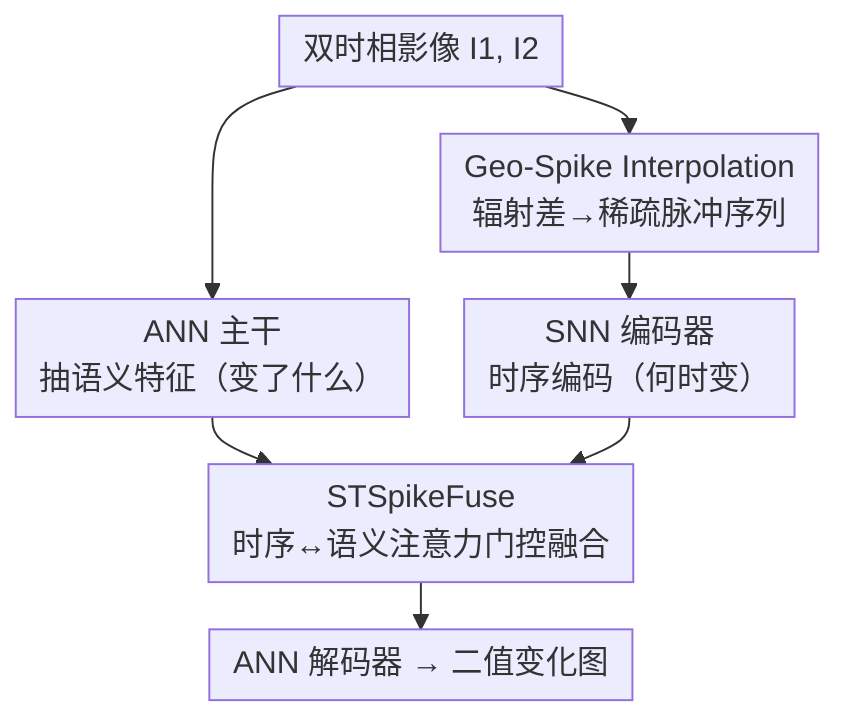

# Sparsely Timing the Change: A Spiking Temporal Framework for Remote Sensing Interpretation

**会议**: CVPR 2026  
**论文**: [CVF Open Access](https://openaccess.thecvf.com/content/CVPR2026/html/Li_Sparsely_Timing_the_Change_A_Spiking_Temporal_Framework_for_Remote_CVPR_2026_paper.html)  
**代码**: 无  
**领域**: 遥感变化检测  
**关键词**: 变化检测, 脉冲神经网络, 时间到首脉冲, 双时相, 时空融合

## 一句话总结
针对遥感变化检测「只有两张时相图、难以建模稀疏时间演化」的痛点，本文提出 SpikeAdapter：用脑启发的「时间到首脉冲」机制把双时相辐射差异编码成稀疏脉冲序列（GSI-P），再用脉冲网络（SNN）抽时序线索、用 STSpikeFuse 把它与 ANN 主干的语义特征自适应融合，在 LEVIR-CD / CLCD / SYSU-CD 上 F1/IoU 全面超过 CNN、Transformer、Mamba 与伪视频方法。

## 研究背景与动机

**领域现状**：遥感变化检测要刻画同一地点不同时相之间地物的动态变化，是城市规划、生态监测、灾害评估的基础任务。主流做法是 Siamese 双分支架构——对两张图分别提特征、做差分（feature differencing）来定位变化区域；后来引入 Transformer（ChangeFormer、BIT）和状态空间模型（ChangeMamba、CDMamba）增强全局空间建模。

**现有痛点**：现实里一个地点往往**只有两张时相影像**，时间信息极度稀疏。三类已有思路各有问题：(1) Siamese 差分本质是「静态做差」，根本没有显式建模变化的时序顺序与结构关系；(2) 序列模型（LSTM、Mamba）擅长长序列，但只给两帧时它们退化成抽取瞬时差异，构造不出有意义的稀疏时序线索；(3) 伪视频插值方法（P2V-CD、Change3D）想重建连续变化过程，但高分辨率遥感图里变化通常只发生在**局部小块**，稠密插值会在大量未变像素上塞进冗余、物理不一致的「假变化」，既丢了稀疏性又抬高了算力。

**核心矛盾**：在双时相约束下，**时间信息缺失**与**稠密插值带来的冗余**之间存在 trade-off——补得太少没时序线索，补得太密又被未变像素淹没。

**切入角度**：作者从大脑对刺激的感知响应出发——对新出现的信息给出快速兴奋反应、对消退的信号给出延迟抑制反应。这天然就是「稀疏 + 有时序」的：只有真正发生变化的地方才在某个时刻「放电」，且变化越剧烈放电越早。

**核心 idea**：用「时间到首脉冲」（Time-to-First-Spike）把辐射差异映射成放电延迟，构造稀疏可解释的伪时序脉冲序列，再用 SNN 抽「何时变」、ANN 抽「变了什么」，两路解耦协同后融合——以稀疏脉冲编码替代稠密插值来补回缺失的时间维度。

## 方法详解

### 整体框架
SpikeAdapter 是一个轻量增强框架，挂在常规 ANN 主干（ViT-SAM Large + LoRA）之上。输入是同一地点的双时相影像 $I_1, I_2$，输出是二值变化图。整体分四步走：① ANN 主干抽强语义特征（「变了什么」）；② **GSI-P** 把双时相辐射差异转成稀疏的、带首脉冲时序特性的脉冲序列 $E' \in \{0,1\}^{B \times T \times 2C \times H \times W}$；③ SNN 编码器在时间轴上编码这些脉冲，捕捉「何时变」的时序线索；④ **STSpikeFuse** 把 SNN 时序特征自适应融合进 ANN 语义特征，最后 ANN 解码器输出变化图。核心是两个新模块 GSI-P（造脉冲）和 STSpikeFuse（融合脉冲）。

### 关键设计

**1. Geo-Spike Interpolation（GSI-P）：把辐射差异编码成稀疏的「时间到首脉冲」序列**

这是全框架的核心，要解决「双时相下怎么造出稀疏又有结构的时序线索」。GSI-P 是一个可微映射 $E' = F_{\text{GSIP}}(I_1, I_2)$，整体遵循一条物理直觉：**变化越快的像素越早放电，变化越慢越晚放电**，未变像素干脆不放电。它分五步：

- **Step 1 辐射差计算**：取两图逐通道绝对差 $M = |I_2 - I_1|$，再归一化得 $\tilde{M} = M / (\max_{x,y} M + \epsilon)$ 保证数值稳定。
- **Step 2 地理一致性调制**：直接用 $\tilde{M}$ 映射延迟，隐含假设所有地物变化速率相同，但植被/水体渐变、城建/裸土突变。作者引入地理响应图 $G(x,y) = \tanh(\lambda_s S(x,y) + \lambda_g C(x,y))$，其中 $S$ 是光谱指数差（反映材质光谱变化）、$C$ 是梯度方向相似度（反映结构一致性），再用指数项做延迟调制 $\hat{M}(x,y,c) = \tilde{M}(x,y,c) \cdot e^{-\alpha G(x,y)}$——地理一致性 $G$ 越高、响应延迟越低，从而优先放电结构显著的变化、压制噪声响应。
- **Step 3 局部时序校正**：地理调制管不住光照/视角引起的局部「伪变化」，于是加一个轻量可学习校正网络 $\tilde{M}'= \hat{M}\cdot\sigma(f_\theta(I_1,I_2)) + \tanh(g_\theta(I_1,I_2))$，用卷积生成缩放/偏置因子抑制假阳性。
- **Step 4 延迟映射与极性建模**：把校正后的差异线性映射成延迟 $\tau(x,y,c) = \text{round}\big((1-\tilde{M}')(T-1)\big)$，每个像素在 $t=\tau$ 时刻触发事件。同时引入**正负极性**区分增强与衰减：$E^{\text{on}}$ 捕捉 $D>0$ 的方向（出现）、$E^{\text{off}}$ 捕捉 $D<0$ 的方向（消失），各自再带时间对齐 $\mathbb{1}\{t=\tau\}$ 与显著性 $\mathbb{1}_{\text{pres}}$，拼接成 $E = \text{concat}(E^{\text{on}}, E^{\text{off}})$。
- **Step 5 时序平滑与稀疏化**：离散触发会产生孤立脉冲、破坏时序连续性，沿时间轴卷一个三角平滑核 $w_\delta \propto (k-|\delta|+1)$，核宽 $k$ 按 $G$ 的全局统计自适应（动态区域用宽窗补连续、静态区域保稀疏），最后阈值二值化 $E' = \mathbb{1}\{E'_t > \varepsilon\}$ 抑制弱响应、保住稀疏。

和稠密插值的本质区别：稠密插值往每个时间间隙填帧、未变像素也被反复处理；GSI-P 只让真变化在「对的时刻」放一次电，天然稀疏、可解释，还把地理先验编进了延迟里。

**2. STSpikeFuse：解耦的 SNN↔ANN 时空融合**

GSI-P 给出的脉冲信号活在「脉冲域」，和 ANN 主干的语义表示不在一个空间，若不协调，时序线索在传播中会退化成静态统计量。STSpikeFuse 的定位就是把脉冲时序特征映射进语义空间做跨模态融合，分两阶段：

第一阶段**时序抽取**，并行两条：**Soft-TfS**（软化的首脉冲时间）用 softargmin 在时间轴上加权 $t_{\text{soft}}(x,y) = \sum_t t \cdot \text{softmax}(-M_t/\tau_{\text{temp}})$（温度 $\tau_{\text{temp}}=0.1$），可微地近似「第一次放电的时刻」，回答「何时变」；无放电位置赋值 $T$ 以区分。**TIMR**（时间积分膜电位表示）给每个脉冲通道一个可学习衰减率 $\delta_c=\sigma(\theta_c)\in(0,1)$，做归一化指数加权 $\alpha_{t,c}=\delta_c^t / (\sum_u \delta_c^u + \varepsilon)$，再 $\text{TIMR}(x,y,c)=\sum_t \alpha_{t,c} s_t(x,y,c)$，刻画「变化持续多久」——$\alpha$ 大关注长期稳定演化、小则对短时突变敏感。

第二阶段**时空对齐融合**：先用 $t_{\text{soft}}$ 反向调制主干特征 $x' = x \odot (1 - \text{norm}(t_{\text{soft}}))$，让放电越早（变化越快）的位置响应越强；再以 $x'$ 生成 query $Q$、TIMR 作 key/value，注意力里加时序偏置 $\text{Attn} = \text{softmax}(QK^\top/\sqrt{d} + \beta e^{-\gamma t_{\text{soft}}})\cdot V$；最后用轻量卷积门控 $g=\sigma(\text{Conv}([x;\text{Attn}]))$、$\hat{x}=g\cdot x + (1-g)\cdot \text{Attn}$ 自适应平衡语义稳定与时序敏感。这种「SNN 管何时变、ANN 管变了什么、门控按需注入」的解耦协同，比简单 Add（坍塌时序线索）或 Concat（缺动态显著性引导）都更稳。

**3. SNN/ANN 双路解耦协同的整体设计哲学**

把这套框架串起来看，真正的创新不只是两个模块，而是「时间和语义解耦、各管一摊再融合」的范式：SNN 分支以事件驱动、稀疏放电专门承载时序显著性（when），ANN 主干以稠密激活承载高层语义判别（what），两者本来是不同的信息形态。GSI-P 负责把物理辐射差「翻译」成 SNN 能吃的脉冲语言并注入地理先验，STSpikeFuse 负责把翻译结果再「翻译」回语义空间。相比 Siamese 静态差分或稠密伪视频，这条路用极稀疏的脉冲就补回了缺失的时间维度，且每一步（延迟、极性、衰减）都有可解释的物理对应。

## 实验关键数据

### 主实验
三个数据集：LEVIR-CD（建筑变化）、CLCD（农田变化）、SYSU-CD（复杂多类变化）。主干 ViT-SAM Large + LoRA，单卡 RTX 4090，AdamW，100 epoch 余弦退火。

| 数据集 | 指标 | SpikeAdapter | 之前最佳 | 说明 |
|--------|------|--------------|----------|------|
| LEVIR-CD | F1 / IoU | **93.08 / 87.05** | 92.06 / 85.29 (DWTCD-Net, Video) | 超伪视频/Mamba/Transformer 全类 |
| CLCD | F1 / IoU | **82.96 / 70.88** | 78.03 / 63.97 (Change3D, Video) | 大幅领先 ~+4.9 F1 |
| SYSU-CD | F1 / IoU | **84.11 / 72.58** | 82.66 / 70.44 (CD-Lamba, Mamba) | 复杂场景仍最佳 |

跨范式对比可见：CNN（FC-Siam-Di、SNUNet）受限于感受野表现一般，Transformer（ChangeFormer、TTP）靠全局建模有提升，Mamba 与伪视频进一步增强时序，但 SpikeAdapter 在三个数据集上 F1/IoU 全面登顶，尤其在变化稀疏、地物多样的 CLCD 上领先最明显。

### 消融实验
四组消融均在 LEVIR-CD（256 分辨率）上：

| 消融维度 | 配置 | F1(%) | IoU(%) | 结论 |
|----------|------|-------|--------|------|
| 延迟映射形式 | Inverse | 92.84 | 86.63 | 早期过度聚集 |
| | Learned-MLP | 92.88 | 86.71 | 多峰不稳定 |
| | **Linear** | **93.08** | **87.05** | 单峰平滑、时序最连贯 |
| 时序平滑核 | No / Mean / Gaussian | 92.65–92.85 | 86.31–86.66 | 噪声/边界更差 |
| | **Triangular** | **93.08** | **87.05** | 时序边界最锐 |
| STSpikeFuse 融合策略 | Baseline(TTP) | 92.10 | 85.60 | 无脉冲 |
| | +GSI-P (Add) | 92.40 | 85.87 | 时序坍塌 |
| | +GSI-P (Concat) | 92.87 | 86.69 | 缺动态引导 |
| | **+GSI-P (STSpikeFuse)** | **93.08** | **87.05** | F1/IoU +0.21 / +0.7 |

### 关键发现
- **延迟映射形式很关键**：$\tau$ 分布分析显示 inverse 形式把延迟挤到早期时间步、MLP 产生不稳定多峰，唯有线性映射 $\tau=(1-\tilde{M}')(T-1)$ 给出平滑单峰、时序进程一致——简单线性反而最契合「变化快→放电早」的物理直觉。
- **融合策略决定时序线索能否保住**：直接 Add 会让时序信息坍塌（仅 +0.3 F1），Concat 缺乏动态显著性引导；STSpikeFuse 用 Soft-TfS + 时间衰减做跨域对齐，是把 GSI-P 价值兑现出来的必要环节。
- **门控融合优于直接输出**：另一组融合策略消融里，Direct Output 直接把 F1 砸到 75.67%，可学习门控才能在空间稳定与时序敏感间取得最佳折中。

## 亮点与洞察
- **用 SNN 的「时间到首脉冲」给变化检测补时间维度**：把神经科学里「新刺激快兴奋、旧刺激慢抑制」直接对应到「变化快早放电、慢晚放电」，既稀疏又可解释，巧妙绕开了稠密伪视频的冗余问题。
- **极性建模区分「出现 vs 消失」**：用 $E^{\text{on}}/E^{\text{off}}$ 双极性显式编码变化方向，是普通差分图丢掉的信息，对建筑「新建 vs 拆除」这类任务尤其有用。
- **解耦「when / what」可迁移**：SNN 管时序显著性、ANN 管语义、门控按需注入的范式，可推广到任何「需要时序线索但帧数稀少」的场景（如医学随访影像、低帧率监控）。
- **轻量挂载**：SpikeAdapter 作为 adapter 挂在冻结 ViT-SAM 主干 + LoRA 上，工程上易于复用既有强主干。

## 局限性 / 可改进方向
- **仅限双时相二值变化检测**：方法围绕「两张图」设计，多时相序列（>2 帧）下是否还优于成熟序列模型未验证；也只做二值变化图，未涉及语义变化检测（变成了什么类）。
- **依赖强主干**：用 ViT-SAM Large 大主干 + SAM 预训练，提升里有多少来自脉冲编码、多少来自主干，正文未充分剥离（虽有 TTP 同主干 baseline，但仅 LEVIR 一处）。
- **多处公式/超参细节下放到附录**：极性建模、SNN 编码器结构、帧数 $T$ 的影响等关键分析都在补充材料，正文可复现性受限。⚠️ 部分公式（如极性 $\mathbb{1}_{\text{pres}}$ 的精确定义）以原文/附录为准。
- **地理响应图的光谱/梯度先验**对传感器和波段较敏感，跨数据集泛化时 $\lambda_s, \lambda_g, \alpha$ 等超参可能需重调。

## 相关工作与启发
- **vs Siamese 差分（FC-Siam-Di / SNUNet）**：它们做静态特征差分，本文用脉冲序列显式建模时序顺序与方向，区别在于把「差」变成「何时以多快速度变」，在所有数据集上大幅领先。
- **vs 序列模型（ChangeMamba / CDMamba）**：Mamba 类擅长长序列累积，但双帧下退化为瞬时差异；本文用首脉冲编码主动「构造」稀疏时序，而非依赖序列长度，CLCD 上 F1 领先逾 10 个点。
- **vs 伪视频插值（P2V-CD / Change3D）**：它们靠稠密插值补时间，但在局部变化的高分图上引入冗余假变化；GSI-P 只在真变化处放电，稀疏且物理一致，F1/IoU 全面更优。

## 评分
- 新颖性: ⭐⭐⭐⭐⭐ 首次把 SNN 时间到首脉冲 + 极性 + 地理调制系统用于遥感变化检测，范式新颖
- 实验充分度: ⭐⭐⭐⭐ 三数据集 + 四组消融较扎实，但关键分析多在附录、缺主干贡献剥离
- 写作质量: ⭐⭐⭐⭐ 动机与方法逻辑清晰，公式密集但部分极性/SNN 细节下放附录
- 价值: ⭐⭐⭐⭐ 为「帧数稀少下补时序」提供了一条可解释、轻量的新思路，可迁移性好

<!-- RELATED:START -->

## 相关论文

- [\[CVPR 2026\] RECS4R: Bridging Semantics and Geometry for Referring Remote Sensing Interpretation](recs4r_bridging_semantics_and_geometry_for_referring_remote_sensing_interpretati.md)
- [\[CVPR 2026\] Remote Sensing Image Super-Resolution for Imbalanced Textures: A Texture-Aware Diffusion Framework](remote_sensing_image_super-resolution_for_imbalanced_textures_a_texture-aware_di.md)
- [\[CVPR 2026\] UniChange: Unifying Change Detection with Multimodal Large Language Model](unichange_unifying_change_detection_with_multimodal_large_language_model.md)
- [\[ICLR 2026\] TAMMs: Change Understanding and Forecasting in Satellite Image Time Series with Temporal-Aware Multimodal Models](../../ICLR2026/remote_sensing/tamms_change_understanding_and_forecasting_in_satellite_image_time_series_with_t.md)
- [\[CVPR 2026\] GeoCoT: Towards Reliable Remote Sensing Reasoning with Manifold Perspective](geocot_towards_reliable_remote_sensing_reasoning_with_manifold_perspective.md)

<!-- RELATED:END -->
