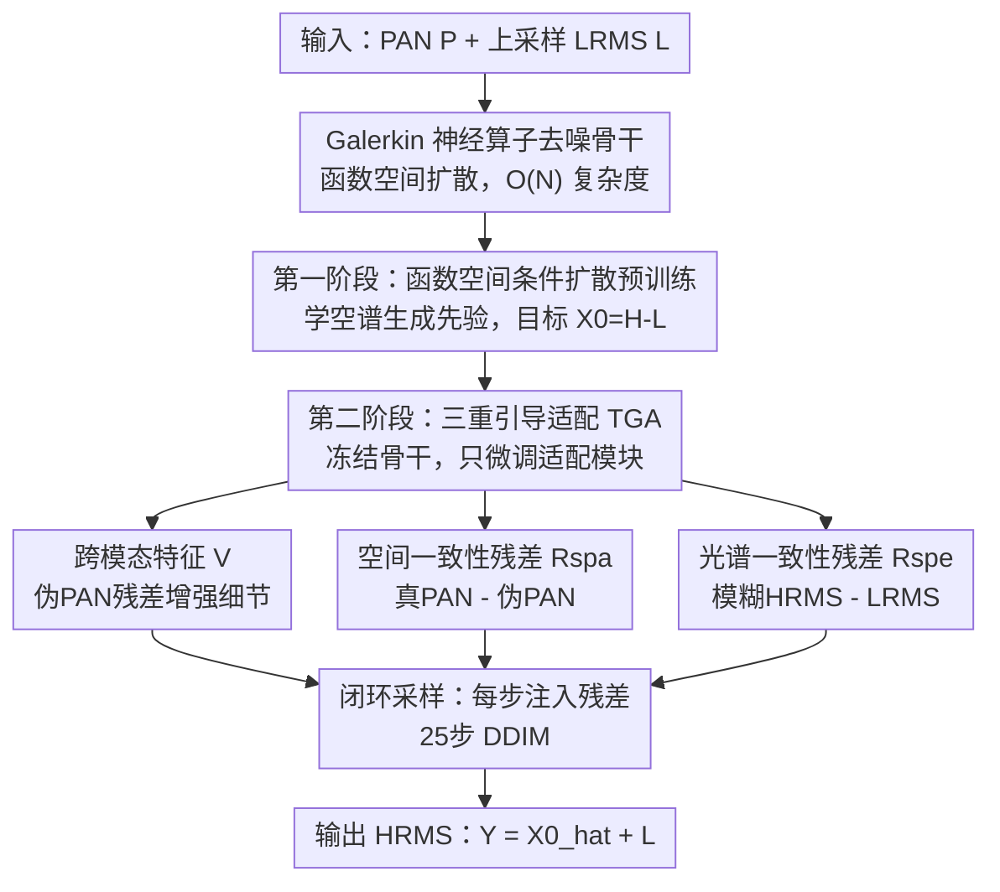

# Spatial-Spectral Residuals Informed Diffusion Neural Operator for Pan-sharpening

**会议**: CVPR 2026  
**论文**: [CVF Open Access](https://openaccess.thecvf.com/content/CVPR2026/html/Huang_Spatial-Spectral_Residuals_Informed_Diffusion_Neural_Operator_for_Pan-sharpening_CVPR_2026_paper.html)  
**代码**: 有（论文称 code is available，具体仓库待确认）  
**领域**: 遥感图像融合 / 扩散模型 / 神经算子  
**关键词**: 全色锐化, 神经算子, 函数空间扩散, 空谱残差, Galerkin注意力

## 一句话总结
SRINO 把全色锐化的扩散去噪骨干从注意力换成 Galerkin 型神经算子（把生成过程搬到连续函数空间、显著省 FLOPs 和显存），再在每一步反向采样里直接把像素级的空间/光谱一致性残差当条件喂进去做闭环引导，在 WV3/GF2/QB 三个数据集上既超过现有 SOTA 又比注意力扩散省好几倍算力。

## 研究背景与动机
**领域现状**：全色锐化（pan-sharpening）要把纹理丰富但单波段的全色图（PAN）和光谱丰富但低分辨率的多光谱图（LRMS）融合成高分辨率多光谱图（HRMS），是遥感的基础预处理。方法从传统的成分替换（CS）、多分辨率分析（MRA）、变分优化（VO）一路演进到深度学习，近两年生成式扩散模型把融合质量推到了新高度。

**现有痛点**：扩散模型质量虽好，但代价是巨大的算力与显存开销——自注意力去噪骨干的复杂度是 $O(N^2)$（$N=H\times W$ 是像素数），在大尺度遥感图上直接 OOM；预训练要海量算力，部署到星上硬件又受存储和推理时延的硬约束。即便用低秩微调、知识蒸馏去压，瓶颈仍源自标准扩散架构本身。

**核心矛盾**：一是骨干太重（注意力的平方复杂度与高分辨率天然冲突）；二是引导方式不灵活——现有扩散全色锐化要么用静态条件（PAN/LRMS 一次性喂进去，去噪过程中不再调整），要么用「梯度引导」（拿无监督 loss 的梯度去更新噪声估计），后者会在多个 loss 项之间产生梯度冲突，还得费劲调引导权重。

**本文目标**：做一个又省又好的生成式扩散框架，既能装进星上硬件，又能在去噪全程动态地校准空间细节和光谱保真。

**切入角度**：神经算子（Neural Operator, NO）本是为解偏微分方程而生，直接学函数空间之间的映射，天生具备离散无关性与分辨率泛化能力，而且 Galerkin 型注意力能把复杂度从 $O(N^2)$ 压到 $O(Nd_v^2)$。作者由此想：把扩散过程整个搬进算子学习空间，用 NO 当去噪骨干，就能在连续函数域里统一「表示学习」和「生成精修」。

**核心 idea**：用 Galerkin 神经算子替换注意力去噪骨干换取效率，再把像素级空谱一致性残差直接作为去噪网络的额外输入（而非 loss 梯度）形成闭环引导——既绕开梯度冲突，又让生成过程「知道」当前差在哪、该补什么纹理/光谱。

## 方法详解

### 整体框架
SRINO（Spatial-spectral Residuals Informed Neural Operator）是一个两阶段训练的函数空间条件扩散模型。**第一阶段**在高分辨率参考图上预训练一个 NO 去噪器，学到连续函数空间里高质量的空间/光谱生成先验，给后续任务打底；**第二阶段**冻结这个预训练去噪器，只微调一组「三重引导适配（TGA）」模块——把跨模态特征、空间一致性残差、光谱一致性残差注入冻结的去噪器，逐步把生成结果拉向纹理丰富、光谱真实的 HRMS。推理时用 25 步 DDIM 迭代，每步都重新计算残差并注入，形成动态闭环。

一个关键设定是：扩散的目标不是直接生成 HRMS，而是预测 HRMS 与上采样 LRMS 之间的残差 $X_0 = H - L$，最终结果用 $Y = \hat{X}_0 + L$ 重建。这让网络只学「该补什么」，建模难度更低。

### 关键设计

**1. Galerkin 神经算子去噪骨干：把扩散搬进连续函数空间换效率**

针对注意力扩散在高分辨率遥感图上 $O(N^2)$ 复杂度导致 OOM、星上跑不动的痛点，作者把去噪网络换成神经算子。神经算子学的是两个无限维函数空间 $\mathcal{A}\to\mathcal{U}$ 之间的映射，由投影层和若干算子层堆叠：$G_\theta = P_{out}\circ M_L\circ\cdots\circ M_1\circ P_{in}$，每层核心是一个核积分算子 $K(\phi)(\xi)=\int_\Omega \kappa(\phi(\xi),\phi(\eta))\phi(\eta)d\eta$，离散化后在高分辨率网格上求和。若把核 $\kappa$ 参数化为 query-key-value 内积，它自然退化成注意力——但标准注意力又回到平方复杂度。于是作者采用 Galerkin 型注意力做线性近似：

$$\phi_{out} = Q(\tilde{K}^\top \tilde{V})/N,\quad Q=W_q\phi,\ \tilde{K}=\text{Norm}(W_k\phi),\ \tilde{V}=\text{Norm}(W_v\phi)$$

先算 $\tilde{K}^\top\tilde{V}$（一个 $d_v\times d_v$ 的小矩阵）再左乘 $Q$，把复杂度从 $O(N^2)$ 降到 $O(Nd_v^2)$，同时保留全局感受野。这样既享受了算子学习的离散无关性（换分辨率不用重训），又把扩散的迭代去噪成本压下来，是「又省」的来源。

**2. 残差作为扩散目标 + 函数空间条件扩散预训练：先学可靠的空谱先验**

如果第二阶段直接拿真实 PAN/LRMS 去训，去噪器还没建立起对「自然 HRMS 长什么样」的概念，引导信号会很飘。所以第一阶段先在高分辨率参考图 $H$ 上做条件扩散预训练：前向过程把残差 $X_0=H-L$ 按余弦噪声表逐步加噪，$X_t=\sqrt{\bar{\alpha}_t}X_0+\sqrt{1-\bar{\alpha}_t}\varepsilon$；反向过程让 NO 去噪器直接预测残差 $\hat{X}_0=G_\theta(X_t,H,t)$，用 $H$ 当条件，目标是 L1 损失 $\mathcal{L}_I=\mathbb{E}\|X_0-G_\theta(X_t,H,t)\|_1$。这一步的意义是把扩散过程「锚」到一个空间、光谱都可靠的解空间，给下游全色锐化打一个稳的地基；预测残差而非整图也降低了学习难度。

**3. 三重引导适配（TGA）：把空谱残差直接当条件喂进去噪器，做闭环引导**

这是全文最核心、也是区别于「梯度引导」的地方。痛点是：旧的梯度引导扩散拿无监督 loss 的梯度更新噪声估计，多个 loss 项一起会梯度冲突，引导权重还得手调（实验里改权重几乎不起作用）。SRINO 改成把残差当**输入**直接注入冻结去噪器的每一层，分三路：

- **跨模态特征 $V$**：先用预训练的「光谱→空间」映射网络 $f_{M2P}$ 把 LRMS 变成伪 PAN，算真 PAN 与伪 PAN 的差 $P-f_{M2P}(L)$（捕捉 LRMS 缺的纹理），再把它和 PAN/LRMS 拼起来过一个轻量辅助预测器 $\Phi$：$V=\Phi([P,L,(P-f_{M2P}(L))])$，并得到伪 HRMS $\hat{H}=\text{Conv}_{3\times3}(V)+L$ 在第二阶段替代 $H$。$V$ 在每层先和噪声特征融合：$\tilde{F}_t^l=\text{Conv}_{3\times3}([F_t^l,V])+F_t^l$。
- **空间一致性残差 $R_{spa}^{(t)}$**：把上一步的干净估计 $\hat{Y}^{(t+1)}=L+\hat{X}_0^{(t+1)}$ 过 $f_{M2P}$ 得到伪 PAN，残差 $R_{spa}^{(t)}=P-f_{M2P}(\hat{Y}^{(t+1)})$ 衡量当前结果空间细节差多少，投影后融进特征：$Z_t^l=\text{CB}(\text{Cat}[\tilde{F}_t^l,\text{Proj}(R_{spa}^{(t)})])+\tilde{F}_t^l$。
- **光谱一致性残差 $R_{spe}^{(t)}$**：用光谱核估计网络 $f_{KE}$ 生成 $11\times11$ 模糊核去模糊 $\hat{Y}^{(t+1)}$，再减 LRMS：$R_{spe}^{(t)}=(f_{KE}([P,L])\circledast\hat{Y}^{(t+1)})-L$，衡量光谱保真差多少；投影后与空间增强特征拼接，并经通道注意力门控 $\omega_t^{l+1}=\sigma(\text{MLP}([\text{GAP},\text{GMP}]))$ 调制后送入冻结算子层 $M_l$ 得到下一层特征。

这三路残差都是**在采样过程中动态计算**的——每一步用上一步的输出回算「现在差在哪」，再把这个差当条件引导下一步，形成像素级的闭环反馈。因为残差是直接拼进网络输入而非反传梯度，所以彻底绕开了梯度冲突与权重调参；又因为引导信号随采样动态更新，比静态条件扩散更能在去噪全程持续校准空间细节和光谱保真。第二阶段目标为 $\mathcal{L}_{II}=\mathbb{E}\|X_0-G_\theta(X_t,P,L,R_{spa}^{(t)},R_{spe}^{(t)},t)\|_1$。

### 损失函数 / 训练策略
两阶段都用 L1 损失。优化器 AdamW（动量 0.9/0.999），初始学习率 $4\times10^{-5}$，每 10000 次迭代衰减 0.5，batch 32，patch $64\times64$。扩散用余弦噪声表 500 步，推理用 25 步 DDIM。第二阶段冻结 NO 去噪器，只训 TGA 适配模块。

## 实验关键数据

### 主实验
在 WorldView-3（WV3）、GaoFen-2（GF2）、QuickBird（QB）三个数据集上，按 Wald 协议从原始卫星图模拟得到训练/测试数据（来自 PanCollection）。降分辨率用 PSNR/SAM/ERGAS/Q2n 四个有参考指标，全分辨率用 $D_\lambda$/$D_s$/HQNR 三个无参考指标。

WV3 降分辨率主结果（节选代表性方法）：

| 方法 | PSNR↑ | SAM↓ | ERGAS↓ | Q2n↑ |
|--------|------|------|--------|------|
| FusionNet | 38.042 | 3.325 | 2.467 | 0.904 |
| PanDiff（扩散） | 37.860 | 3.316 | 2.492 | 0.906 |
| LFormer | 39.075 | 2.899 | 2.165 | 0.919 |
| ADWM（次优） | 39.170 | 2.914 | 2.145 | 0.919 |
| **SRINO（本文）** | **39.305** | **2.869** | **2.111** | **0.922** |

WV3 全分辨率（无参考）SRINO 取得 $D_\lambda=0.019$、HQNR=0.950，均为最佳。在 GF2/QB 上同样全面领先：GF2 PSNR 44.228（次优 LFormer 44.196），QB PSNR 38.864（次优 LFormer 38.674）。

效率方面（Figure 1）：相比注意力去噪骨干，SRINO 大幅降低 FLOPs 和显存，尤其大尺度下注意力直接 OOM 而 SRINO 仍能跑，推理有数倍加速。

### 消融实验
空谱残差消融（WV3）：

| 配置 | $R_{spa}$ | $R_{spe}$ | PSNR↑ | SAM↓ | ERGAS↓ | Q2n↑ |
|------|------|------|-------|------|--------|------|
| I（baseline） | ✗ | ✗ | 39.013 | 2.945 | 2.187 | 0.919 |
| II | ✓ | ✗ | 39.177 | 2.912 | 2.145 | 0.920 |
| III | ✗ | ✓ | 39.124 | 2.937 | 2.163 | 0.920 |
| Ours | ✓ | ✓ | 39.305 | 2.869 | 2.111 | 0.922 |

去噪骨干消融（Figure 8）：CNN 最差、FNO 居中、Galerkin NO（本文）最好。引导策略消融（Figure 7）：梯度引导改引导权重（α=1/10/100）几乎不动指标，本文残差引导明显更优且推理无需算梯度。

### 关键发现
- 空间残差和光谱残差各自单开都能涨点（PSNR 从 39.013 分别升到 39.177/39.124），两者一起开达到 39.305，说明二者互补——一个管空间细节、一个管光谱保真，缺一不可。
- 梯度引导对引导权重几乎不敏感（调权重没用），反衬出「直接把残差当输入」比「拿 loss 梯度更新噪声」更可控，也省掉了调参与梯度冲突。
- 去噪骨干从 CNN→FNO→Galerkin NO 逐级变好，证明 Galerkin 算子更适合在扩散框架里建模空谱依赖，而不仅仅是为了省算力的妥协。
- 特征图随去噪层加深（Layer2→4→6）纹理越来越锐、细节越来越可分，可视化上印证了函数空间扩散在逐步精修。

## 亮点与洞察
- **把神经算子当扩散去噪骨干**：不是把 NO 当超分上采样或条件提供者（如 DiffFNO 那样仍在常规扩散范式里），而是把扩散过程整个搬进算子学习空间，用 Galerkin 线性注意力同时拿到「分辨率泛化 + 线性复杂度」，这套思路可迁移到任何高分辨率生成任务。
- **残差即条件，闭环引导**：用「真值 - 当前估计」的像素级残差直接当网络输入，比梯度引导更稳、更可控，是个很干净的「让生成过程知道自己差在哪」的范式，对其他需要一致性约束的逆问题（去模糊、超分、医学重建）都有借鉴价值。
- **预测残差 $X_0=H-L$ 而非整图**：让扩散只学增量，降低建模难度，是遥感融合里实用的小 trick。
- 作者在结论里也点出这套「把生成反馈内化进去噪器」的范式不限于全色锐化，可推广到更广的视觉任务。

## 局限与展望
- **依赖多个预训练辅助网络**：跨模态特征和空谱残差都要用到预训练的光谱→空间映射网络 $f_{M2P}$ 和光谱核估计网络 $f_{KE}$，这些子网络的质量直接影响残差信号的可靠性，论文未充分讨论它们的误差如何传播。
- **每步要回算残差**：闭环引导虽好，但每个 DDIM 步都要重算 $\hat{Y}^{(t+1)}$、过 $f_{M2P}$/$f_{KE}$ 再投影注入，相比纯静态条件扩散在单步上增加了开销；论文主打的效率优势主要来自骨干换算子，残差引导本身的额外成本未单列。
- **仅在模拟数据上评测**：训练/测试都按 Wald 协议从卫星图模拟，全分辨率虽用了无参考指标但仍是同源数据，跨传感器/跨地物的真实泛化未验证。
- **可改进**：能否把 $f_{M2P}$/$f_{KE}$ 与主网络联合训练、或用更轻的残差近似减少每步开销，是值得探索的方向。

## 相关工作与启发
- **vs PanDiff / 常规扩散全色锐化**：它们用注意力骨干 + 静态条件，质量好但算力重、且去噪全程不调整条件；SRINO 换 Galerkin 算子骨干省算力，又用动态残差做闭环引导，效率和质量同时改善。
- **vs 梯度引导扩散（如 dynamic guidance 范式）**：它们拿无监督 loss 的梯度更新噪声估计，有梯度冲突、要调引导权重；SRINO 把残差当输入而非梯度，绕开冲突与调参，实验显示对权重不敏感的梯度引导反而吃亏。
- **vs DiffFNO / NO+扩散超分**：那些工作把 NO 当超分骨干或上采样条件，仍在常规扩散范式内；SRINO 把扩散过程本身放进连续算子学习空间，统一了表示学习与生成精修。
- **vs CNN/Transformer 全色锐化（FusionNet/LFormer/ADWM）**：本文在 WV3/GF2/QB 上全面超过这些确定性方法，且作为生成式方法还带来效率优势。

## 评分
- 新颖性: ⭐⭐⭐⭐ 「神经算子当扩散去噪骨干 + 残差闭环引导」两点结合在全色锐化里是新颖且自洽的组合，不过 NO 和扩散各自都有先例。
- 实验充分度: ⭐⭐⭐⭐ 三数据集 + 降/全分辨率 + 四组消融（残差、引导策略、骨干、可视化）相当完整，但只在模拟同源数据上、缺跨传感器泛化验证。
- 写作质量: ⭐⭐⭐⭐ 动机清晰、公式完整、图示到位，TGA 三路注入的符号略密但可读。
- 价值: ⭐⭐⭐⭐ 针对星上硬件约束的效率痛点给出实用方案，残差闭环引导范式对其他生成式逆问题有迁移价值。

<!-- RELATED:START -->

## 相关论文

- [\[CVPR 2026\] Multigrain-aware Semantic Prototype Scanning and Tri-Token Prompt Learning Embraced High-Order RWKV for Pan-Sharpening](multigrain-aware_semantic_prototype_scanning_and_tri-token_prompt_learning_embra.md)
- [\[ICCV 2025\] Pan-Crafter: Learning Modality-Consistent Alignment for Pan-Sharpening](../../ICCV2025/remote_sensing/pan-crafter_learning_modality-consistent_alignment_for_pan-sharpening.md)
- [\[CVPR 2026\] Fast Kernel-Space Diffusion for Remote Sensing Pansharpening](fast_kernel-space_diffusion_for_remote_sensing_pansharpening.md)
- [\[CVPR 2026\] LNEM: Lunar Neural Elevation Model](lnem_lunar_neural_elevation_model.md)
- [\[CVPR 2026\] Semantic-Adaptive Diffusion for Dynamic Spatiotemporal Fusion](semantic-adaptive_diffusion_for_dynamic_spatiotemporal_fusion.md)

<!-- RELATED:END -->
