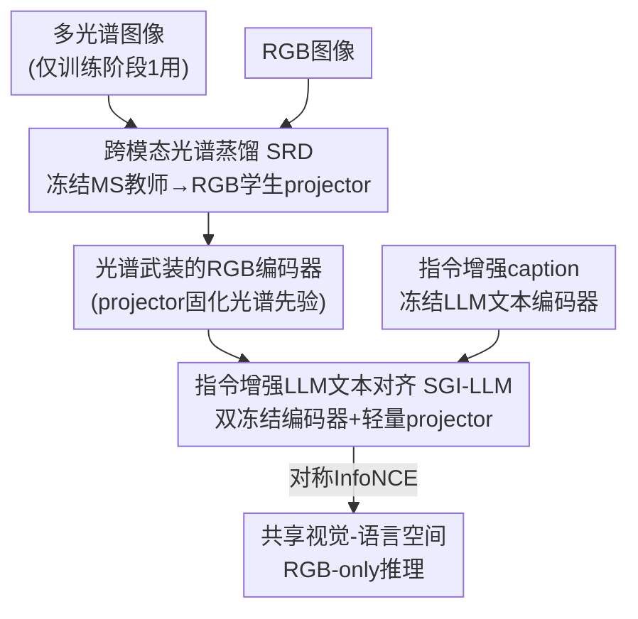

# Spectrally Distilled Representations Aligned with Instruction-Augmented LLMs for Satellite Imagery

**会议**: CVPR 2026  
**论文**: [CVF Open Access](https://openaccess.thecvf.com/content/CVPR2026/html/Kha_Spectrally_Distilled_Representations_Aligned_with_Instruction-Augmented_LLMs_for_Satellite_Imagery_CVPR_2026_paper.html)  
**代码**: https://ikhado.github.io/sattxt/ (项目页)  
**领域**: 遥感 / 视觉语言基础模型  
**关键词**: 卫星图像, 光谱蒸馏, 视觉语言对齐, 指令增强LLM, RGB推理

## 一句话总结
SATtxt 通过「光谱表征蒸馏 + 指令增强 LLM 对齐」两阶段训练，把多光谱先验灌进一个**只吃 RGB** 的视觉编码器、再把它与冻结的 LLM 文本嵌入对齐，只训练几个轻量 projector，就在零样本分类、检索、开放词表分割、线性探测四类卫星任务上全面超过依赖多光谱输入的 SOTA。

## 研究背景与动机
**领域现状**：视觉语言基础模型（VLFM，如 CLIP、SigLIP、DINOtxt）靠大规模对比学习把图像和文本对齐，在地球观测里特别有用——卫星图像标注稀缺且需要领域专家，能用文本 prompt 做零样本分类/检索几乎是刚需。遥感领域已有 RemoteCLIP、GeoRSCLIP、SkyCLIP，以及支持多光谱（MS）输入的 Llama3-MS-CLIP 和 DOFA-CLIP。

**现有痛点**：两个具体问题卡住了落地。其一，卫星影像天然是多光谱的，可现有模型**用不好这些波段**——额外波段虽带来互补信息，但也引入冗余和波段间错位，实测显示加波段收益递减甚至不稳定（Llama3-MS-CLIP 在超过 10 个波段后反而退化）；而且大气条件或传感器退化常导致完整光谱栈拿不到，运营系统更想要 RGB-only 推理。其二，这些 VLFM 仍卡在 **CLIP 式文本编码器**的表达力上——无论是继续预训练双编码器、冻结文本编码器（DOFA-CLIP）还是冻结图像主干（DINOv3txt 的 LiT 设计），文本侧始终是瓶颈，限制了细粒度跨模态对齐。

**核心矛盾**：想要光谱先验（提升判别力）就得在推理时喂多光谱（部署贵、波段还可能缺）；想要强语义对齐就得换更强的文本编码器，但传统 CLIP 文本塔的 77-token 预算和浅层语义撑不住卫星 caption 里的长描述。两个需求都被「输入模态」和「文本塔容量」绑死了。

**本文目标**：造一个推理时只用 RGB、却**保留光谱知识**，同时文本侧足够表达力的卫星 VLFM。

**切入角度**：光谱知识不一定要在推理时反复喂 MS 输入——可以在训练阶段**蒸馏一次**就固化进 RGB 编码器；而文本表达力瓶颈可以用指令增强的 LLM（已被证明是强力文本编码器）来突破，且 LLM 冻结后嵌入能预先缓存、几乎不增加训练成本。

**核心 idea**：用「冻结 MS 教师 → RGB 学生」的跨模态蒸馏把光谱先验灌进 RGB 空间，再用「冻结指令增强 LLM」替代 CLIP 文本塔，全程只训练轻量 projector，实现 RGB-only 推理 + 富语义对齐。

## 方法详解

### 整体框架
SATtxt 是一个两阶段预训练管线，两个阶段都遵循同一条原则：**两端的大编码器全部冻结，只训练夹在中间的轻量 projector**。第一阶段 SRD（Spectral Representation Distillation）让一个 vision projector 学会从 RGB 特征**重建**多光谱教师的输出分布，把光谱先验蒸进 RGB 通路，从此 MS 输入只在这一阶段用一次，之后再也不需要。第二阶段 SGI-LLM（Spectrally Grounded Alignment with Instruction-Augmented LLMs）冻住已被光谱知识武装的 RGB 编码器和一个指令增强 LLM 文本编码器，只训练两个 projector，用对称对比损失把视觉描述子和 LLM 句向量拉到同一空间。推理时文本标签嵌入可全部预缓存，每次查询只剩一次 RGB 前向 + projector。

### 关键设计

**1. 跨模态光谱蒸馏 SRD：把多光谱先验一次性灌进只吃 RGB 的编码器**

针对「推理时喂 MS 既贵又可能缺波段、还收益不稳」这个痛点，SRD 把光谱知识当作**可蒸馏的一次性资产**：用一个冻结的预训练 MS 编码器 $E_{ms}$（SpectralGPT）当教师，一个冻结的预训练 RGB 编码器 $E_{rgb}$（卫星预训练的 DINOv3 ViT-L）当学生骨干，唯一可训练的是夹在中间的轻量 vision projector $G_v$，外加一个仅本阶段用的线性头 $W_{ms}$ 来桥接维度。给一张 MS 图，构造两组增强视图：MS 侧用全分辨率全波段全局视图，RGB 侧用 multi-crop（局部裁剪 + 全局视图）。三个表征定义为

$$z^{rgb}_v = E_{rgb}(\tilde x^{(v)}_{rgb}),\quad z^{ms}_u = \mathrm{Pool}(E_{ms}(\tilde x^{(u)}_{ms})),\quad \hat z^{ms}_v = W_{ms}(G_v(z^{rgb}_v))$$

也就是让 projector 把 RGB 特征**映射回 MS 教师的表征空间**。训练沿用 DINO 的 centering + 温度锐化，但关键改动是教师**固定不动**（DINO 里教师是 EMA 更新的），从而提供一个稳定的光谱参考、防止 RGB 特征去捕捉超出自身光谱范围的信息时发生漂移。具体地，设 $\mu$ 是教师 pre-softmax 输出的 EMA 中心、$\tau_t<\tau_s$ 为教师/学生温度，

$$q_u = \mathrm{softmax}\!\left(\frac{z^{ms}_u-\mu}{\tau_t}\right),\quad p_v = \mathrm{softmax}\!\left(\frac{\hat z^{ms}_v}{\tau_s}\right)$$

最小化所有 RGB-MS 视图对的平均交叉熵 $L_{SRD}=\frac{1}{|V_{rgb}||V_{ms}|}\sum_{v}\sum_{u}(-q_u^\top \log p_v)$，中心则按 $\mu \leftarrow m_c\mu + (1-m_c)\frac{1}{|V_{ms}|}\sum_u \mathrm{sg}(z^{ms}_u)$ 滑动更新。这个设计有效的原因有三：教师固定给了稳定的光谱靶子；双编码器冻结让模型容量集中在跨模态映射上、抑制过拟合和算力开销；非对称的「RGB 多裁剪对 MS 全局视图」配对既增加了 RGB 视图多样性又维持了一致的光谱目标。蒸馏完成后，$G_v$ 已经内化了光谱先验，直接作为第二阶段的初始化。

**2. 指令增强 LLM 文本对齐 SGI-LLM：用冻结大模型替掉 CLIP 文本塔的表达瓶颈**

针对「CLIP 式文本编码器语义浅、token 预算小、细粒度对齐弱」的痛点，本阶段把文本侧整个换成一个**指令增强的冻结 LLM**（Llama-3.1-8B，由 LLM2Vec 初始化），并且——和 LiT「冻图像、训文本」相反——**两端编码器全冻，只训练 projector**。给一张 RGB 图 $x_{rgb}$ 和「caption $C$ + 指令 $I$」的组合 prompt，视觉侧产生 $H_v = G_v(E_{rgb}(x_{rgb}))\in\mathbb{R}^{(1+n)\times d_v}$（1 个 class token + n 个 patch token），按 DINOtxt 把 class token 和 patch token 均值拼成紧凑描述子

$$z_v = [\,H^{\langle cls\rangle}_v;\ \mathrm{mean}(H^{patch}_v)\,]\in\mathbb{R}^{2d_v}$$

文本侧由冻结 LLM 编码指令增强 prompt，对所有 token 做均值池化得句向量 $\tilde z_t=\mathrm{mean}(H_t)$，再经轻量线性 projector $G_t$ 投到共享空间 $z_t = G_t(\tilde z_t)\in\mathbb{R}^{2d_v}$。用 LLM 当文本编码器有两个实打实的好处：一是它冻结后 $H_t$ 可**按 prompt 预计算并缓存一次**，大幅省训练时间；二是它支持远超 CLIP 77-token 上限的长指令输入，能塞进更丰富的语义和任务感知信号，从而强化细粒度对齐——正是这一点让相似度图里「river」「residential」这类目标的响应更锐利、上下文关系更清晰。

**3. 对称 InfoNCE 对齐目标：让双向跨模态一致**

在共享空间里，用对称 InfoNCE 把 $z_v$ 和 $z_t$ 对齐。设 $s(\cdot,\cdot)$ 为余弦相似度、$\tau$ 为温度，图到文与文到图损失为

$$L_{v\to t}=-\frac{1}{|B|}\sum_{i\in B}\log\frac{\exp(s(z_{v,i},z_{t,i})/\tau)}{\sum_{j\in B}\exp(s(z_{v,i},z_{t,j})/\tau)},\quad L_{t\to v}\ \text{同理对称}$$

最终目标取两个方向的均值 $L_{SGI\text{-}LLM}=\tfrac12(L_{v\to t}+L_{t\to v})$，保证视觉和文本双向一致。之所以两个方向都要，是因为零样本分类靠「文→图」检索、而 caption 检索靠「图→文」，单向对齐会让其中一类任务吃亏。这一阶段把第一阶段固化的光谱先验真正「接地」到富语义文本空间，得到的就是既懂光谱又懂语义的跨模态表征。

### 损失函数 / 训练策略
两阶段独立训练，损失分别为 $L_{SRD}$（DINO 式交叉熵蒸馏）和 $L_{SGI\text{-}LLM}$（对称 InfoNCE）。训练集是 SSL4EO-S12（约 100 万张 12 波段全球影像），caption 来自公开的 Llama3-SSL4EO-S12 v1.1（与 Llama3-MS-CLIP 同源）。vision projector 仅 2 个 transformer block（对齐 DINOtxt 配置），文本 projector 为单层线性。全程 8×H200 GPU，阶段一约 4 小时、阶段二约 3 小时，**总计约 7 小时**——冻结主干 + 缓存 LLM 嵌入让预训练成本极低。

## 实验关键数据

### 主实验
在 EuroSAT、BigEarthNet、ForestNet 三个未见卫星基准上做零样本分类与文本-图像检索（下表为准确率 / mAP@100）：

| 模型 | 输入 | EuroSAT-CLS | BigEarthNet-CLS | ForestNet-CLS | EuroSAT-检索 | ForestNet-检索 |
|------|------|------|------|------|------|------|
| CLIP | RGB | 46.90 | 54.85 | 8.30 | 56.92 | 11.78 |
| GeoRSCLIP | RGB | 52.92 | 58.80 | 8.33 | 51.36 | 15.84 |
| FT-DINOv3txt | RGB | 58.58 | 58.14 | 16.74 | 70.60 | 16.25 |
| DOFA-CLIP | MS | 59.04 | 56.58 | 17.02 | 71.54 | 19.55 |
| Llama3-MS-CLIP | MS | 67.86 | 59.63 | – | 75.26 | – |
| **SATtxt (ours)** | **RGB** | **73.40** | **60.18** | **17.61** | **78.97** | **22.59** |

平均提升：零样本分类 +4.2%、检索 +5.9%、线性探测 +2.7%、开放词表分割 +2.8%。开放词表分割上 SATtxt 达 **31.23 mIoU**，超过依赖多光谱的 Llama3-MS-CLIP（28.58）和 FT-DINOv3txt（26.81）。线性探测（下表为 mAP/准确率）SATtxt 在低数据 regime 优势尤其明显：

| 模型 | 输入 | EuroSAT | BigEarthNet-10% | BigEarthNet-100% | ForestNet |
|------|------|------|------|------|------|
| Terramind (MIM) | MS | 96.13 | 75.84 | 84.68 | 48.64 |
| DOFA-CLIP | MS | 94.59 | 78.63 | 81.98 | 47.33 |
| Llama3-MS-CLIP | MS | 95.00 | 78.90 | 82.44 | – |
| **SATtxt (ours)** | **RGB** | **98.04** | **80.73** | **84.80** | **53.27** |

### 消融实验
组件消融（从 FT-DINOv3txt 基线逐步叠加，下表为分类/检索）：

| 配置 | EuroSAT-CLS | BigEarthNet-CLS | ForestNet-检索 | 说明 |
|------|------|------|------|------|
| Baseline (FT-DINOv3txt) | 58.6 | 58.1 | 16.3 | 起点 |
| + SRD + CLIPtext | 65.4 | 58.3 | 19.7 | 加光谱蒸馏 |
| + SRD + Mistral-7B | 68.2 | 59.1 | 20.1 | 换 LLM 文本塔 |
| + SRD + Llama-3.1-8B | 70.1 | 59.9 | 22.2 | 更强 LLM |
| Llama-3.1-8B + Inst.（无 SRD） | 65.3 | 58.3 | 22.0 | 缺光谱蒸馏 |
| **+ SRD + Llama-3.1-8B + Inst.（Full）** | **73.4** | **60.2** | **22.6** | 完整模型 |

### 关键发现
- **三个组件各自有效、且互补**：单加 SRD 就把 EuroSAT 分类从 58.6 拉到 65.4；把 CLIP 文本塔换成 Llama-3.1-8B 再涨到 70.1；指令增强 prompt 再补到 73.4。对比「Llama-3.1-8B + Inst. 但无 SRD」只有 65.3，可见**光谱蒸馏和 LLM 文本塔缺一不可**，二者贡献相互独立。
- **文本侧 mean pooling 最稳**：对比 [bos]/[eos]/mean 三种池化，均值池化最优——它比依赖单个特殊 token 更平衡、对 prompt 长度变化更鲁棒，这与 LLM2Vec 的结论一致。
- **对 MS 教师不敏感**：把教师从 SpectralGPT 换成较弱的 SatMAE，性能几乎不变（EuroSAT 73.40 vs 71.65，且都超过最强基线），说明 SRD 能可靠迁移光谱先验、不依赖某个特定教师，更强教师只带来边际增益。
- **跨传感器泛化**：ForestNet 用的是 Landsat-8（训练用 Sentinel-2），SATtxt 仍是最优，说明光谱-空间预训练学到的表征能跨传感器配置迁移。

## 亮点与洞察
- **「光谱知识可以蒸馏一次、永久受益」是核心洞察**：把多光谱从「推理时的输入负担」变成「训练时的一次性先验」，既绕开了波段冗余/错位/缺失，又保住了判别力——RGB-only 推理还能反超多光谱模型，这个反直觉结果很有说服力。
- **冻结 LLM 当文本编码器 + 预缓存嵌入**是极高性价比的 trick：换来更长 token 预算和更强语义，却几乎不加训练成本（总训练仅 7 小时），这个范式可直接迁移到任何「文本塔是瓶颈」的对比学习任务。
- **「双冻结 + 只训 projector」的桥接式设计**优雅地避开了大模型微调的算力墙：用 DINOtxt 风格的视觉描述子拼接和轻量线性投影，把两个互不相干、模态不同的强编码器接到一起。
- 把 DINO 的自蒸馏机制改造成「固定教师、跨模态、单向」蒸馏是个值得复用的思路——任何「强教师在模态 A、想武装模态 B 的便宜学生」的场景都适用。

## 局限与展望
- **作者承认**：当前设计只覆盖光学影像，没扩展到 SAR、热红外等其他传感器；虽然标签嵌入可缓存，但用 8B 级 LLM 当文本编码器相比 CLIP 文本塔仍**增加内存占用**。
- **自己观察**：BigEarthNet 在 100% 全监督线性探测下，SATtxt 与 Terramind 等 MS 模型只是「可比」（84.80 vs 84.68 量级），优势主要体现在零样本和低数据场景——也就是说在数据充足时光谱蒸馏的边际收益会收窄。ForestNet 的绝对分数仍偏低（分类 17.61），说明跨传感器的难样本上离实用还有距离。
- **改进方向**：把 SRD 教师扩成多教师（SAR + 热红外 + 光学）做异构光谱蒸馏；探索更小的 LLM 文本塔或蒸馏 LLM 嵌入以压内存；以及让指令 $I$ 随下游任务自适应生成而非固定模板。

## 相关工作与启发
- **vs Llama3-MS-CLIP**：它也用 LLM 相关的丰富 caption，但**推理仍需多光谱输入**且文本侧仍是 CLIP 框架；SATtxt 把光谱蒸进 RGB、文本侧直接用冻结 LLM，做到 RGB-only 推理且全面反超（如 EuroSAT 零样本 73.40 vs 67.86）。
- **vs DOFA-CLIP**：它靠 wavelength-based patch embedding 适配可变波段、冻结文本编码器；但多光谱增益不稳（Fig.1 波动），且文本塔仍轻量。SATtxt 用蒸馏规避波段问题、用 LLM 补强文本表达力。
- **vs DINOv3txt / LiT**：LiT 冻图像主干、训文本编码器；SATtxt 反其道而行**两端全冻**，只训 projector，把语义表达力外包给现成的指令增强 LLM，训练成本更低。
- **vs MIM 类遥感基础模型（SatMAE/SpectralGPT/Terramind）**：它们靠重建学光谱-空间先验，但偏低层统计、需重任务微调且无法注入语言语义；SATtxt 把这类模型当**冻结教师**蒸馏，既继承光谱先验又叠加跨模态语义。

## 评分
- 新颖性: ⭐⭐⭐⭐⭐ 「光谱一次性蒸馏 + 冻结 LLM 文本塔」的组合在卫星 VLFM 里是干净且有说服力的新范式。
- 实验充分度: ⭐⭐⭐⭐ 四类任务、四个基准、三维度消融（组件/池化/教师）扎实，但缺更多传感器（SAR/热红外）和更大规模消融。
- 写作质量: ⭐⭐⭐⭐ 动机清晰、公式与流程交代完整，图表对应到位。
- 价值: ⭐⭐⭐⭐⭐ RGB-only 推理 + 7 小时训练成本极低，对地球观测的可扩展部署有直接实用价值。

<!-- RELATED:START -->

## 相关论文

- [\[ECCV 2024\] Learning Representations of Satellite Images From Metadata Supervision](../../ECCV2024/remote_sensing/learning_representations_of_satellite_images_from_metadata_supervision.md)
- [\[ICCV 2025\] WildSAT: Learning Satellite Image Representations from Wildlife Observations](../../ICCV2025/remote_sensing/wildsat_learning_satellite_image_representations_from_wildlife_observations.md)
- [\[CVPR 2026\] AVION: Aerial Vision-Language Instruction from Offline Teacher to Prompt-Tuned Network](avion_aerial_visionlanguage_instruction_from_offli.md)
- [\[CVPR 2026\] SkySense-VITA: Towards Universal In-context Segmentation of Multi-modal Remote Sensing Imagery](skysense-vita_towards_universal_in-context_segmentation_of_multi-modal_remote_se.md)
- [\[CVPR 2026\] GeoSANE: Learning Geospatial Representations from Models, Not Data](geosane_learning_geospatial_representations_from_models_not_data.md)

<!-- RELATED:END -->
