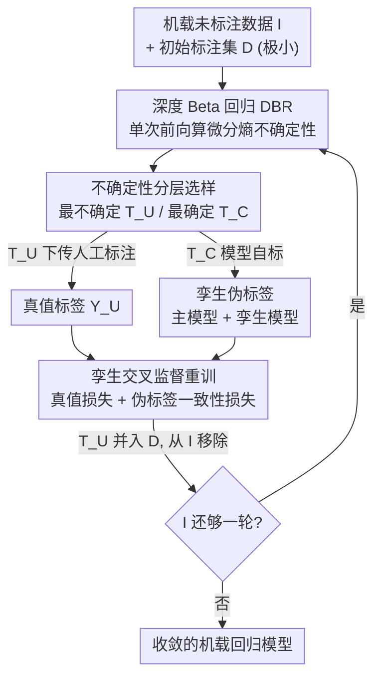

# Uncertainty-Guided Edge Learning for Deep Image Regression in Remote Sensing

**会议**: CVPR2026  
**arXiv**: [2605.05590](https://arxiv.org/abs/2605.05590)  
**代码**: https://github.com/anh-vunguyen/UGEL  
**领域**: 遥感  
**关键词**: 边缘学习, 不确定性估计, 深度Beta回归, 主动学习, 半监督学习

## 一句话总结
针对在轨卫星上算力受限的"边缘学习"场景，提出 UGEL 算法：用一次前向就能算出的"深度 Beta 回归"不确定性，挑出最不确定的样本交人工标注、最确定的样本做伪标签，从而比主动学习/半监督学习更快地收敛重训机载回归模型。

## 研究背景与动机

**领域现状**：遥感卫星正在搭载神经网络加速器，直接在轨对地球影像做推理（如预测云覆盖率、地表覆盖率这类 $y\in[0,1]$ 的标量回归），把决策留在天上、避免昂贵的数据下传。但部署在轨的模型会因传感器漂移、域差（训练数据与在轨实采数据分布不一致）而精度下降，必须定期重训——这就是"边缘学习"（Edge Learning, EL）。

**现有痛点**：星上算力和电力都极其紧张，重训只能用未标注数据 $\mathcal{I}$ 中很小的一个子集 $\mathcal{T}\subset\mathcal{I}$。问题在于挑哪些样本、怎么从未标注数据里提取监督信号，都依赖"预测不确定性"的估计；而 $|\mathcal{I}|\gg|\mathcal{T}|$，对整个 $\mathcal{I}$ 算不确定性的开销反而会盖过重训本身。主流不确定性方法两头不讨好：MC Dropout 每个样本要跑 10~30 次前向，耗电；深度证据回归（DER）虽一次前向搞定，却假设预测分布是无界的高斯，而云/地表覆盖率天然被框在 $[0,1]$ 且大量样本堆在 0 和 1 两端，高斯会给出有偏的不确定性。

**核心矛盾**：主动学习（AL，挑不确定样本送人工标）和半监督学习（SSL，用模型给未标注数据打伪标签）各有所长，但在模型尚未适应新环境、初始标注极少（如 $M=12$）时，如何平衡两者的贡献是难题；而平衡的前提——一个既准又便宜、还尊重 $[0,1]$ 边界的不确定性估计器——恰恰缺失。

**本文目标**：(1) 设计一个把 AL 与 SSL 用同一套不确定性原则性地统一起来的边缘学习算法；(2) 给它配一个单次前向、支持有界分布的不确定性估计器。

**核心 idea**：用"深度 Beta 回归（DBR）"的微分熵作为统一的不确定性度量——按它把样本分成"最不确定"（送人工标，相当于 AL）和"最确定"（打伪标签，相当于 SSL）两堆，让两类监督信号互补，从而以最少的标注预算最快收敛。

## 方法详解

### 整体框架

UGEL 要解决的是"在极少标注预算下，如何用机载未标注数据 $\mathcal{I}$ 把回归模型 $f_{\hat{\mathbf{w}}}$ 重训到收敛"。它是一个**逐轮迭代**的过程：每一轮都用当前模型的不确定性估计器 $h_{\hat{\mathbf{w}}}$ 扫一遍 $\mathcal{I}$，挑出两个互不相交的子集——模型最**不确定**的 $\mathcal{T}_U$（大小 $B_U$，下传给人工打真值标签）和模型最**确定**的 $\mathcal{T}_C$（大小 $B_C$，由模型自己打伪标签）；然后用真值损失 + 伪标签一致性损失同时更新主模型和一个孪生模型；最后把新标注的 $\mathcal{T}_U$ 并入标注集 $\mathcal{D}$、从 $\mathcal{I}$ 里移除，进入下一轮，直到 $\mathcal{I}$ 用尽。

整个 pipeline 的关键是不确定性估计器：它由"深度 Beta 回归（DBR）"提供——网络输出一个 Beta 分布的参数，其微分熵就是不确定性，且只需一次前向即可算出。同时 UGEL 对估计器是解耦的（agnostic），DBR 是为遥感这类 $[0,1]$ 有界回归量身定制的最佳搭配。

### 关键设计

**1. UGEL：用同一把"不确定性尺子"统一 AL 与 SSL**

针对"AL 和 SSL 在模型未适应新环境时难以平衡"的痛点，UGEL 不再像传统 ASSL 那样简单地"用 AL 给 SSL 找几个真值样本"，而是用**同一个不确定性度量 $h_{\hat{\mathbf{w}}}$ 把数据分到两端**。每轮选出的子集 $\mathcal{T}=\mathcal{T}_U\cup\mathcal{T}_C$ 由两部分组成：$\mathcal{T}_U$ 取模型最不确定的 $B_U$ 个样本

$$\mathcal{T}_U=\underset{\mathcal{S}\subset\mathcal{I},\,|\mathcal{S}|=B_U}{\arg\max}\sum_{x_i\in\mathcal{S}}h_{\hat{\mathbf{w}}}(x_i)$$

下传给人工标注（扮演 AL 角色）；$\mathcal{T}_C$ 取模型最确定的 $B_C$ 个样本

$$\mathcal{T}_C=\underset{\mathcal{S}\subset\mathcal{I},\,|\mathcal{S}|=B_C}{\arg\min}\sum_{x_i\in\mathcal{S}}h_{\hat{\mathbf{w}}}(x_i)$$

由模型打伪标签（扮演 SSL 角色），两者天然 $\mathcal{T}_U\cap\mathcal{T}_C=\emptyset$。这套设计的巧妙之处在于它是一个**统一框架**：当 $B_U>0,B_C=0$ 退化为基于不确定性的 AL；当 $B_U=0,B_C=N$ 退化为带交叉伪监督的 SSL；当 $B_U>0,B_C=N-B_U$ 退化为 Yao 等人的 ASSL。换句话说，UGEL 把这三者放进同一个旋钮上，关键收益正来自"只挑最确定的样本做伪标签"——而非像 ASSL 那样把全部伪标签一股脑灌进去导致噪声稀释真值。

**2. 深度 Beta 回归（DBR）：单次前向、尊重 [0,1] 边界的不确定性估计器**

针对"MC Dropout 太贵、DER 高斯假设越界"的痛点，DBR 让网络 $f_{\mathbf{w}}$ 直接输出一个 Beta 分布的参数。Beta 分布支撑集就是 $[0,1]$，正好匹配云/地表覆盖率。作者采用均值-精度参数化 $\mu=\alpha/(\alpha+\beta)\in(0,1)$、$\nu=\alpha+\beta>0$，网络输出 $(\hat{\mu},\hat{\nu})=f_{\mathbf{w}}(x)$，并直接把 $\hat{\mu}$ 当作标量预测 $\hat{y}$。不确定性则用拟合出的 Beta 分布的**微分熵**度量：

$$h_{\mathbf{w}}(x)=\log\frac{\Gamma(\hat{\mu}\hat{\nu})\Gamma((1-\hat{\mu})\hat{\nu})}{\Gamma(\hat{\nu})}+(\hat{\nu}-2)\psi(\hat{\nu})-(\hat{\mu}\hat{\nu}-1)\psi(\hat{\mu}\hat{\nu})-((1-\hat{\mu})\hat{\nu}-1)\psi((1-\hat{\mu})\hat{\nu})$$

其中 $\psi(\cdot)$ 是 digamma 函数。熵越高（分布越接近 $[0,1]$ 上的均匀分布）说明模型越不确定，越低（密度越集中）说明越确定。相比 MC Dropout 需要 $P$ 次前向取后验统计量，$h_{\mathbf{w}}(x)$ 只依赖一次前向得到的 $(\hat{\mu},\hat{\nu})$；相比 DER 的高斯会延伸到 $[0,1]$ 之外，Beta 密度始终落在 $[0,1]$ 内——这对真值大量堆在 0/1 两端的遥感数据尤为关键。

**3. 孪生模型与交叉监督：从伪标签里安全地榨取监督信号**

为了给最确定子集 $\mathcal{T}_C$ 提供伪标签并避免单模型自我强化偏差，UGEL 在边缘上额外维护一个**孪生模型** $f_{\mathring{\mathbf{w}}}$：它与主模型 $f_{\hat{\mathbf{w}}}$ 结构相同、在同一份 $\mathcal{D}$ 上预训练，但**初始化不同**（$\hat{\mathbf{w}}\neq\mathring{\mathbf{w}}$）。$\mathcal{T}_C$ 由两个模型分别打出伪标签 $\hat{\mathcal{Y}}_C$ 和 $\mathring{\mathcal{Y}}_C$。重训时一致性项 $\mathcal{L}_{RMSE}$ 度量两个模型在所有样本（含伪标签样本）上预测的不一致，最小化它等价于让主模型和孪生模型互相"交叉监督"——一个模型的预测被另一个模型的预测约束，从而比单模型自训练更稳健地利用未标注数据。

**4. 自适应的 $B_C=|\mathcal{D}|$：让伪标签随标注集一起长大**

初期标注集 $\mathcal{D}$ 极小（如 $M=12$）、$\mathcal{T}_U$ 也很小（如 $B_U=6$），此时模型和不确定性估计器都还不准。若直接把 $\mathcal{I}$ 里全部（可达 $N=10k$）伪标签样本喂进去，会因伪标签噪声远超真值而导致训练发散。作者的处理是令 $B_C=|\mathcal{D}|$：伪标签子集大小**与当前标注集同步增长**——初期小、随着 $\mathcal{D}$ 扩张而变大。这个简单的耦合让伪标签的"话语权"始终和真值规模匹配，避免了 ASSL 那种伪标签淹没真值的塌缩。

### 损失函数 / 训练策略

DBR 的预训练是多任务优化，同时压回归误差和负对数似然：

$$\mathcal{L}_s=\mathcal{L}_{RMSE}(\hat{\mathcal{U}},\mathcal{Y})+\lambda\,\mathcal{L}_{NLL}(\hat{\mathcal{U}},\hat{\mathcal{V}},\mathcal{Y})$$

其中 $\mathcal{L}_{RMSE}$ 用预测均值 $\hat{\mu}$ 监督回归精度，$\mathcal{L}_{NLL}$ 是 Beta 分布的负对数似然、负责拟合用于估计不确定性的预测密度，$\lambda$ 权衡两者。UGEL 每轮的整体损失再加上孪生交叉监督项：

$$L=\mathcal{L}_s(\hat{\mathcal{Y}},\mathcal{Y})+\mathcal{L}_s(\mathring{\mathcal{Y}},\mathcal{Y})+\tau\,\mathcal{L}_{RMSE}(\hat{\mathcal{Y}}\cup\hat{\mathcal{Y}}_C,\mathring{\mathcal{Y}}\cup\mathring{\mathcal{Y}}_C)$$

前两项是主/孪生模型各自在真值上的监督损失，第三项是两模型在所有样本（含伪标签）上的预测一致性损失，$\tau$ 为系数。$L$ 同时更新主模型和孪生模型。实验超参：$B_U=6$、$B_C=|\mathcal{D}|$、$\tau=2$，初始 $M=12$、batch $b=6$，骨干用轻量网络（ResNet18 / MobileNetV3 / MobileNetV4），Adam（lr=0.001），**每轮随机重初始化后重训 12 epoch**——因为从上一轮 checkpoint 续训会因灾难性遗忘掉点。

## 实验关键数据

### 主实验

在三个真实遥感数据集上对比 UGEL+DBR 与 AL（随机采样 Rand、BALD）、SSL、ASSL，骨干 ResNet18 / MobileNetV3，指标为测试集 RMSE（越低越好），每实验重复 10 次。下表为 Wilcoxon 符号秩检验 p 值（< 0.05 表示 UGEL 显著更优）：

| 数据集 | 对比 | Rd.2/5 | Rd.4/10 | Rd.6/15 | Rd.8/20 |
|--------|------|--------|---------|---------|---------|
| RSRC-S2 | UGEL vs Rand | 0.019 | 0.001 | 0.005 | 0.002 |
| RSRC-S2 | UGEL vs BALD | 0.042 | 0.002 | 0.053 | 0.002 |
| RSRC-S2 | UGEL vs SSL | 0.014 | 0.001 | 0.005 | 0.001 |
| RSRC-S2 | UGEL vs ASSL | 0.016 | 0.008 | 0.008 | 0.008 |
| RSRC-L8 | UGEL vs SSL | 0.001 | 0.001 | 0.001 | 0.001 |
| RSRC-L8 | UGEL vs ASSL | 0.001 | 0.001 | 0.001 | 0.001 |
| RSLC | UGEL vs BALD | 0.002 | 0.001 | 0.001 | 0.001 |

定性结论：AL（Rand/BALD）虽随轮数降 RMSE 但波动大，且 BALD 并不优于随机采样（在 RSLC 上随机采样反而更快，与既有文献一致）；ASSL 初期略有提升但很快平台化（被大量噪声伪标签稀释）；UGEL+DBR 则**持续保持更低 RMSE 和更小方差**，因为它只用最确定的伪标签。注意各方法差距随轮数变小——渐近上所有样本终会被选中标注，EL 的真正价值是"用最少样本最快降错"。RSLC 第 1 轮多数 p 值不显著（如 vs SSL 0.839、vs ASSL 0.577），说明起步阶段优势尚未显现，从第 2 轮起才拉开。

### 消融实验

**T1：UGEL 中替换不同不确定性估计器**（DBR vs RAN 常数不确定性 / MCD MC Dropout P=10 / DER），ResNet18，下表为 p 值：

| 数据集 | 对比 | Rd.5 | Rd.10 | Rd.15 | Rd.20 |
|--------|------|------|-------|-------|-------|
| RSRC-S2 | DBR vs RAN | 0.005 | 0.002 | 0.116 | 0.019 |
| RSRC-S2 | DBR vs MCD | 0.001 | 0.003 | 0.08 | 0.003 |
| RSRC-S2 | DBR vs DER | 0.001 | 0.001 | 0.005 | 0.032 |
| RSRC-L8 | DBR vs MCD | 0.003 | 0.001 | 0.004 | 0.003 |
| RSLC | DBR vs DER | 0.138 | 0.042 | 0.065 | 0.042 |

DBR 在 UGEL 中优于其他不确定性方法，早期轮次差距尤其明显；RSLC 上对 RAN 的优势不显著（地表覆盖物种类多、目标多样性高时增益下降）。

**T2：不同真值标签分布**：在晴空 patch 上合成不同分布的云掩膜，DBR 仍以高统计显著性给出最佳回归精度（细节见补充材料）。

**T3 运行时**（Jetson Orin NX，RSRC-S2，单位秒，前 10 轮 min–max）：

| 方法 | 不确定性估计↓ | 模型重训↓ |
|------|--------------|-----------|
| UGEL w. RAN | n/a | 7.05–11.64 |
| UGEL w. MCD | 495.84–514.18 | 7.18–12.54 |
| UGEL w. DER | 82.01–85.47 | 7.23–13.29 |
| UGEL w. DBR | 68.04–74.53 | 7.43–12.02 |

### 关键发现
- **不确定性估计的开销远大于重训**：在 RSRC-S2 上重训只要约 7–13 秒，而 MC Dropout 估不确定性要 ~500 秒，DER ~82–85 秒，DBR 最省 ~68–75 秒——印证了"$|\mathcal{I}|\gg|\mathcal{T}|$ 导致估计开销主导"的动机，也是 DBR 单次前向的直接价值。
- **"只挑最确定的伪标签"是 UGEL 跑赢 ASSL 的关键**：ASSL 把全部伪标签灌入导致噪声稀释真值、性能很快饱和；UGEL 通过 $B_C=|\mathcal{D}|$ 控制伪标签规模，持续受益于 SSL。
- **目标多样性是软肋**：RSLC（地表覆盖类别多）上 UGEL 相对随机采样的优势减弱，作者明确承认这是局限。

## 亮点与洞察
- **把"不确定性的两端"都变成监督信号**：传统 AL 只用"最不确定"的样本，本文额外把"最确定"的样本拿来打伪标签，等于让一把尺子同时驱动 AL 和 SSL——这个统一视角既优雅又能用参数 $(B_U,B_C)$ 平滑退化成 AL/SSL/ASSL，是最让人"啊哈"的地方。
- **Beta 分布是有界回归不确定性的天然容器**：当回归量被框在 $[0,1]$ 且真值堆在边界时，高斯假设会越界产生有偏不确定性；改用 Beta + 微分熵，既尊重边界又保持单次前向。这个思路可直接迁移到任何有界标量回归（比例、概率、归一化指标）的不确定性估计。
- **$B_C=|\mathcal{D}|$ 这个"让伪标签随标注集长大"的小设定**，用极低成本解决了半监督训练初期发散的老问题，简单但有效，值得在其他自训练场景借鉴。

## 局限性 / 可改进方向
- **目标多样性高时增益下降**：作者承认在地表覆盖（RSLC，物体种类多）这类场景，框架的提升明显缩水，对 RAN 甚至不显著。
- **孪生模型带来额外开销**：维护第二个模型增加了训练时的算力、显存和功耗——这在本就电力紧张的卫星上是真实代价，作者计划研究"无孪生模型"的高效半监督方案。
- **方法绑定标量有界回归**：DBR 的优势建立在 $y\in[0,1]$ 上，对多维输出、无界回归或分类任务需另作设计；微分熵也只刻画了 Beta 这一族分布，对更复杂的多峰预测分布表达力有限。
- 实验主要以 RMSE 和 p 值呈现，缺少绝对 RMSE 数值表，"快多少轮收敛"的量化（如达到某 RMSE 阈值省了几轮标注）若能补上会更有说服力。

## 相关工作与启发
- **vs MC Dropout（Bayesian 近似）**：MC Dropout 每样本要 10~30 次带 dropout 的前向取后验统计量，在边缘设备上耗电（实测 ~500 秒）；DBR 单次前向得到 Beta 参数即可算熵（~70 秒），更适合在轨。
- **vs DER（深度证据回归）**：DER 同样单次前向，但在高斯似然上放证据先验，预测分布无界、会延伸出 $[0,1]$；对真值堆在 0/1 两端的遥感回归会产生有偏不确定性，导致选出的 $\mathcal{T}$ 失效。DBR 用有界 Beta 分布修正了这一点。
- **vs 传统 ASSL（Yao 等）**：传统 ASSL 把 AL 仅当作"给 SSL 找真值"的工具，并假设数据都在算力无限的数据中心；UGEL 面向边缘约束，用同一不确定性度量原则性地融合两者，并只取最确定的伪标签，避免噪声稀释——本质区别是"$B_C=N-B_U$ 全用 vs $B_C=|\mathcal{D}|$ 选择性用"。
- **vs 交叉伪监督 CPS（Chen 等）**：UGEL 的孪生交叉监督借鉴了 CPS 的双模型互监督思想，但把它嵌入到不确定性引导的逐轮边缘学习框架里，并与人工标注的真值样本联合训练。

## 评分
- 新颖性: ⭐⭐⭐⭐ 用 Beta 分布微分熵做有界回归的边缘不确定性估计、并以此统一 AL/SSL，角度新且贴合真实卫星约束。
- 实验充分度: ⭐⭐⭐⭐ 三个真实遥感数据集 + 三种轻量骨干 + 真实 Jetson 运行时 + 10 次重复显著性检验，较扎实；但缺绝对 RMSE 表、部分结果在补充材料。
- 写作质量: ⭐⭐⭐⭐ 动机层层递进、算法与公式清晰，统一框架的退化关系讲得漂亮。
- 价值: ⭐⭐⭐⭐ 面向在轨遥感这一真实受限场景，方法轻量可落地，DBR 思路对一切有界标量回归的不确定性估计有迁移价值。

<!-- RELATED:START -->

## 相关论文

- [\[CVPR 2026\] QuCNet: Quantum Deep Learning Driven Multi-Circuit Network for Remote Sensing Image Classification](qucnet_quantum_deep_learning_driven_multi-circuit_network_for_remote_sensing_ima.md)
- [\[CVPR 2026\] PAUL: Uncertainty-Guided Partition and Augmentation for Robust Cross-View Geo-Localization under Noisy Correspondence](paul_uncertainty-guided_partition_and_augmentation_for_robust_cross-view_geo-loc.md)
- [\[CVPR 2026\] SegEarth-R2: Towards Comprehensive Language-guided Segmentation for Remote Sensing Images](segearth-r2_towards_comprehensive_language-guided_segmentation_for_remote_sensin.md)
- [\[CVPR 2026\] Robust Remote Sensing Image–Text Retrieval with Noisy Correspondence](robust_remote_sensing_image-text_retrieval_with_noisy_correspondence.md)
- [\[CVPR 2026\] Improving Visual Grounding in Remote Sensing via Cluster-Guided Refinement and Model Ensemble Voting](improving_visual_grounding_in_remote_sensing_via_cluster-guided_refinement_and_m.md)

<!-- RELATED:END -->
