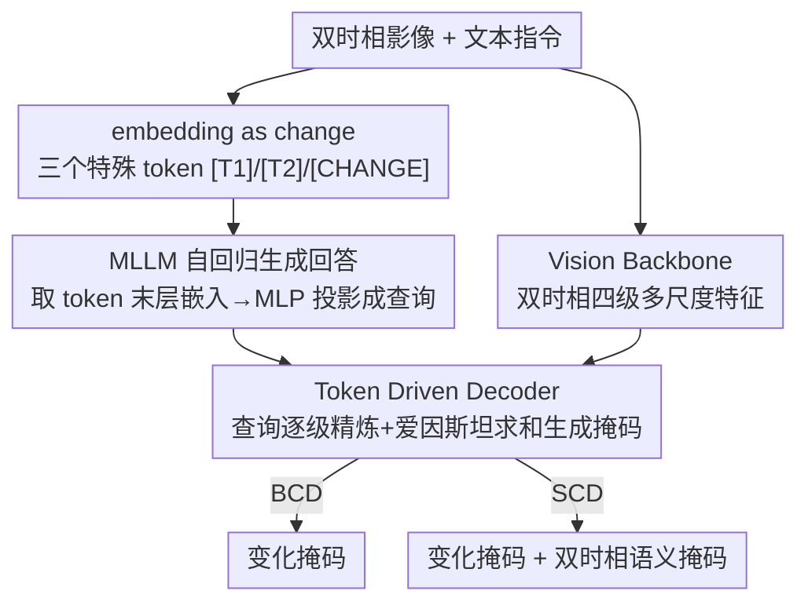

# UniChange: Unifying Change Detection with Multimodal Large Language Model

**会议**: CVPR 2026  
**论文**: [CVF Open Access](https://openaccess.thecvf.com/content/CVPR2026/html/Zhang_UniChange_Unifying_Change_Detection_with_Multimodal_Large_Language_Model_CVPR_2026_paper.html)  
**代码**: https://github.com/NKU-HLT/UniChange  
**领域**: 遥感 / 多模态VLM  
**关键词**: 变化检测, 多模态大模型, 特殊 token, 多源联合训练, 语义变化检测

## 一句话总结
UniChange 把二值变化检测（BCD）和语义变化检测（SCD）统一进一个基于 MLLM 的框架，靠 `[T1]`、`[T2]`、`[CHANGE]` 三个特殊 token 的嵌入作为"查询"去驱动分割解码器，用文本提示替代固定分类头，从而能在类别定义互相冲突的多源遥感数据集上联合训练，在 WHU-CD、S2Looking、LEVIR-CD+、SECOND 四个基准上 IoU 分别达 90.41 / 53.04 / 78.87 / 57.62，全面刷新 SOTA。

## 研究背景与动机
**领域现状**：遥感变化检测（CD）要对同一地区不同时间的两张影像做对比，找出地表覆盖的变化。它分两个子任务：BCD 只判断"哪里变了"（二值掩码），SCD 还要判断"从什么变成什么"（如森林→城市，from-to 语义转换）。十多年来主流范式是孪生网络（FC-Siam-diff、IFN）+ 双时相特征交互（BiT、ChangeFormer、Changer），近期开始把视觉基础模型 VFM（SAM、RSBuilding）搬进来。

**现有痛点**：作者点出领域里两个一直没被解决的结构性问题。其一是**数据集不兼容**——同一类地物在 A 数据集里是正样本（如"建筑"变化），在 B 数据集里却被当作负的背景（专做"植被"变化的数据集里建筑根本不标），这种语义冲突让传统模型没法把多个数据集放一起训。其二是**架构不兼容**——BCD 模型只需一个变化解码器，SCD 模型却要双编码器+双解码器+变化解码器（见原文 Fig. 2a/2b），结构上根本对不齐。

**核心矛盾**：因为这两个不兼容，领域里长出了一大堆"高度专用"的模型——每个模型只从单一标注类型（要么 BCD 要么 SCD）的单个数据集里学到有限知识，彼此独立、互不通用。结果就是泛化差、通用性弱，换个数据集就得重训一个专用模型。

**本文目标**：做一个**既能同时支持 BCD 和 SCD、又能在语义冲突的多源数据集上联合训练**的单一端到端模型。

**切入角度**：MLLM 自带语言先验和"统一不同任务"的能力——它本来就是用同一套自回归框架处理 caption、VQA、grounding 等异构任务。作者的观察是：变化检测的"任务差异"本质是"问什么"的差异，而这正好可以用语言提示来承载，用文本而非固定分类头来指定要找的变化类别。

**核心 idea**：提出 **"embedding as change"** 范式——把 BCD/SCD 都重述为"通过特殊 token 的嵌入去查询变化"。给 MLLM 词表加三个特殊 token `[T1]`、`[T2]`、`[CHANGE]`，让 MLLM 按指令自回归地把它们生成在回答里，再取这些 token 的末层嵌入当作分割解码器的动态查询。这样不同任务、不同类别冲突的数据集都被"文本指令 + token 嵌入"这套统一接口接住了。

## 方法详解

### 整体框架
UniChange 由三大件构成：一个理解变化的 **MLLM**（LLaVA-7B）、一个从双时相影像抽特征的 **Vision Backbone**（RSBuilding-ViT-L，SAM 结构但用遥感影像预训练）、以及一个把 MLLM 的高层指令翻译成像素级掩码的 **Token Driven Decoder**。

整条流水线是这样转的：输入是一对双时相遥感影像 $x_{img1}, x_{img2}$ 加一段文本指令 $x_{txt}$（如"请分割所有发生变化的区域，并给出变化区域的语义掩码"）。MLLM 以这三者为输入，自回归生成回答序列 $y_{txt} = F_{MLLM}(x_{img1}, x_{img2}, x_{txt})$；当它想为某个变化生成掩码时，会在回答里恰当位置吐出对应的特殊 token。然后系统从 $y_{txt}$ 里抽出该 token 位置的 MLLM 末层嵌入 $h_{task}$，过一个专用 MLP 投影到视觉空间 $\hat{h}_{task} = \text{MLP}(h_{task})$，作为"指令驱动的稀疏查询"。与此同时 Vision Backbone 抽出双时相的四级多尺度特征 $\{F_1^i\}, \{F_2^i\}$。最后查询嵌入和多尺度视觉特征一起送进 Token Driven Decoder 解出最终掩码 $\hat{M}_{task} = F_{dec}(\{F_1^i\}, \{F_2^i\}, \hat{h}_{task})$。训练上只对 MLLM 的语言解码器做 LoRA 微调，其余组件全量微调。

### 关键设计

**1. embedding as change：用三个特殊 token 的嵌入统一 BCD 与 SCD**

这一设计直击"BCD/SCD 架构不兼容"和"多源数据集语义冲突"两个痛点。做法是往 MLLM 词表里塞三个特殊 token：`[T1]`、`[T2]` 分别代表"在 T1 / T2 时相影像里的某类地物"，`[CHANGE]` 代表"变化区域"。MLLM 在条件指令 $x_{txt}$ 下自回归生成回答 $y_{txt}$，并把这些 token **按任务需要嵌进句子里**。比如 BCD 任务回答里只放 `[CHANGE]`（"变化的建筑区域是 `[CHANGE]`"）；SCD 任务则会放一串带类别的 `[T1]`/`[T2]`（"时刻 1 变化的建筑区域是 `[T1]`，时刻 1 变化的低矮植被区域是 `[T1]`……时刻 2 的建筑区域是 `[T2]`……"）。

关键在于**用文本提示来指定要找的变化类别，彻底扔掉了固定分类头**。传统模型靠一个预定义的 N 类分类头输出语义，N 一旦定死，A 数据集的"建筑=正类"和 B 数据集的"建筑=背景"就在同一个分类头上打架，没法联合训练。而 UniChange 里"找什么"完全由语言指令决定——同一个 `[T1]` token 配不同的文本就能指向不同类别，模型从多源数据集学到的是"如何根据指令查询变化"的统一能力，类别冲突在文本层面被天然化解。这就是 BCD（只生成 `[CHANGE]` 掩码）和 SCD（生成 `[T1]`/`[T2]` 语义掩码 + `[CHANGE]` 变化掩码）能共用一套端到端框架的原因。

**2. Token Driven Decoder：让 token 嵌入作为查询，逐级精炼后用爱因斯坦求和"过滤"出掩码**

光有 token 嵌入还不够，得把这些"高层语义查询"翻译成像素级掩码——这是 Token Driven Decoder（受 RSBuilding 启发）干的活。它先把三个投影后的查询拼接成初始查询 $E^0 = \Phi_{Cat}(\hat{h}_{t1}, \hat{h}_{t2}, \hat{h}_{change})$，然后过四层 SAM 风格解码层逐级精炼。每一层把双时相的第 $i$ 级特征 $F_1^i, F_2^i$ 拉平并拼成统一视觉序列 $T^i = \Phi_{Cat}(\Phi_{Flat}(F_1^i), \Phi_{Flat}(F_2^i))$，然后查询和视觉序列**双向交互**：

$$E^i = FF_{FN}(A_{cross}(A_{self}(E^{i-1}), T^i)), \quad \hat{T}^i = A_{cross}(T^i, E^i)$$

即查询先自注意、再交叉注意视觉序列、过 FFN；反过来视觉序列也被新查询更新（所有注意力都加位置编码）。四级精炼后，把各级精炼视觉序列 $\{\hat{T}^i\}$ 拆回 2D 特征图 $\{\hat{F}_1^i\}, \{\hat{F}_2^i\}$，再分别对 T1 特征、T2 特征、以及二者逐元素差 $\hat{F}_1^i - \hat{F}_2^i$ 做上采样+拼接+融合，得到 $F_{t1}, F_{t2}, F_{change}$。最后把末级精炼查询 $E^4$ 拆投影成 $\hat{e}_{t1}, \hat{e}_{t2}, \hat{e}_{change}$，用每个查询去**爱因斯坦求和过滤**对应特征，生成最终掩码：$\hat{M}_{task} = M_{gen}(F_{task}, \hat{e}_{task})$，$task \in \{t1, t2, change\}$。

这个设计巧在：**变化信号 $F_{change}$ 直接用双时相特征差构造**（符合 CD 的物理直觉），而 T1/T2 的语义掩码和变化掩码共享同一套精炼后的查询和特征，三路输出从一个解码器里"按需"长出来——用户问 BCD 就只取 change 路，问 SCD 就三路全取。这正是"用一套结构灵活生成不同掩码"的落地方式。

**3. 双时相语义监督 + 条件化的统一损失：BCD/SCD 用同一目标但语义项按需开关**

要让一个模型同时学好二值和语义两种约束，损失必须能"一套接口、按数据集类型自适应"。总损失 $L_{total} = L_{txt} + L_{mask}$：$L_{txt}$ 是 MLLM 生成 token 序列的标准自回归交叉熵（保证它学会在对的位置吐对的 token）；$L_{mask}$ 是四项之和：

$$L_{mask} = \lambda_{BCE}L_{BCE} + \lambda_{Dice}L_{Dice} + \lambda_{SS}L_{SS} + \lambda_{SC}L_{SC}$$

其中 $L_{BCE}$、$L_{Dice}$（权重 2.0 / 0.5）监督变化掩码；$L_{SS}$（语义分割交叉熵，权重 0.5）逐像素惩罚双时相语义误分类；$L_{SC}$（语义变化损失，权重 1.0）是亮点——它基于二值 GT 掩码在双时相语义特征图间算**余弦嵌入距离**，强制未变化区域特征相似、变化区域特征发散，从而拉开双时相表示的可判别性。

关键的工程取舍是**条件化开关**：在 BCD 数据集上训练时，$L_{SS}$ 和 $L_{SC}$ 直接置零，只有在 SCD 数据集上才计算。这一招让同一个损失框架既能吃只有变化标注的 BCD 数据，也能吃带语义标注的 SCD 数据——多源联合训练能跑通，正是靠损失项随数据类型自适应开关，而不是为每种数据单独设计目标。

### 损失函数 / 训练策略
基座为 LLaVA-7B-v1-1，视觉骨干 RSBuilding-ViT-L。在 4×H100(80G) 上训 10 epoch（每 epoch 400 步），AdamW，基础学习率 $5\times10^{-5}$，per-device batch=1、梯度累积 8，用 DeepSpeed。仅语言解码器做 LoRA（rank=8，alpha=2×rank），其余全量微调。损失权重 $\lambda_{BCE}=2.0$、$\lambda_{Dice}=0.5$、$\lambda_{SS}=0.5$、$\lambda_{SC}=1.0$。

## 实验关键数据

### 主实验
BCD 在 WHU-CD / S2Looking / LEVIR-CD+ 上对比（IoU 为主）：

| 数据集 | 指标 | UniChange | 之前最好 | 提升 |
|--------|------|-----------|----------|------|
| WHU-CD | IoU | 90.41 | 90.08 (ChangeCLIP) | +0.33 |
| WHU-CD | F1 | 94.96 | 94.78 (ChangeCLIP) | +0.18 |
| S2Looking | IoU | 53.04 | 50.96 (LSKNet) | +2.08 |
| S2Looking | F1 | 69.32 | 67.52 (LSKNet) | +1.80 |
| LEVIR-CD+ | IoU | 78.87 | 76.12 (SFCD-Net) | +2.75 |
| LEVIR-CD+ | F1 | 88.19 | 86.44 (SFCD-Net) | +1.75 |

SCD 在 SECOND 上对比（含二值 + 语义指标）：

| 方法 | IoU | mIoU | Fscd | Fbcd | SeK |
|------|-----|------|------|------|-----|
| MambaSCD* | 57.24 | 72.73 | 62.83 | 72.81 | 21.31 |
| HGINet* | 56.13 | 71.73 | 62.88 | 71.90 | 21.83 |
| SCD-SAM* | 56.82 | 71.92 | 60.71 | 72.46 | 20.60 |
| **UniChange** | **57.62** | **72.85** | **63.50** | **73.12** | **23.02** |

UniChange 在 SECOND 上**五个指标全部第一**。值得注意的是 SeK（衡量语义判别力、抑制未变化类影响的硬指标）从次好的 21.83 跳到 23.02，提升最显著——说明它在最难的"语义判别"维度上优势最大，而非只靠二值定位刷分。

### 消融实验
| 配置 | 关键指标 (WHU-CD IoU / S2Looking IoU) | 说明 |
|------|---------|------|
| 双时相语义监督 T1+T2 | 90.41 | 完整配置 |
| 仅 T2 监督 | 90.06 | 去掉 T1 监督 |
| 仅 T1 监督 | 89.74 | 去掉 T2 监督 |
| 无语义监督 | 89.46 | 基线，掉 0.95 |
| Vision Backbone: RSBuilding-ViT-L(ft) | 53.04 (S2L) | 完整配置，SeK 23.02 |
| SAM2(ft) | 50.85 (S2L) | 换骨干，SeK 22.82 |
| SAM(冻结) | 42.36 (S2L) | 冻结骨干，SeK 仅 14.63 |
| LoRA rank=8 | 90.41 / 53.04 | 最优 |
| LoRA rank=32 | 90.13 / 51.70 | 过大反掉点 |

### 关键发现
- **双时相语义监督有协同效应**：同时监督 T1 和 T2（90.41）> 只监督 T2（90.06）> 只监督 T1（89.74）> 不监督（89.46），单调递增，说明两个时相的语义约束互补，一起用才把特征判别力拉满。
- **遥感预训练骨干 + 微调是关键**：RSBuilding-ViT-L(ft) 全面优于 SAM/SAM2；且微调版始终碾压冻结版（冻结 SAM 的 SeK 只有 14.63，微调到 RSBuilding 后飙到 23.02），说明通用 VFM 直接拿来做遥感变化检测远不够，必须遥感预训练 + 解冻适配。
- **LoRA rank 不是越大越好**：rank=8 最优，加到 16/32 反而掉点，提示在这个规模下语言解码器只需小幅适配，过度微调会损害语言先验。
- **联合训练数据越多越好**：A→A+B→A+B+C→A+B+C+D 逐步加数据集，所有指标单调上升（WHU-CD IoU 89.68→90.41），直接验证了"统一接口能跨语义冲突数据集联合受益"这一核心卖点。

## 亮点与洞察
- **"embedding as change"是一个干净的统一抽象**：把"BCD vs SCD 架构分裂"和"多源数据集类别冲突"两个看似无关的痛点，用"特殊 token 嵌入 + 文本指令查询"一招打通——因为分类语义被搬到了语言侧，固定分类头消失了，冲突自然化解。这种"用语言提示替代固定输出头"的思路可迁移到任何被"类别集合不一致"卡住联合训练的稠密预测任务（如跨数据集语义分割、开放词表检测）。
- **变化路用特征差显式构造**很务实：$F_{change}$ 直接来自 $\hat{F}_1^i - \hat{F}_2^i$，把 CD 的物理先验（变化=两时相之差）硬编码进解码器，而不是指望模型自己学出来，省了样本也更稳。
- **损失项条件化开关**是让异构标注数据共训的简单有效 trick：BCD 数据上关掉语义项，SCD 数据上打开，一套目标吃两类数据，比为每种数据设计独立 pipeline 优雅得多。
- **SeK 提升最大**这一点很说明问题：在最考验"语义判别"的硬指标上优势最明显，反驳了"MLLM 方法只是堆参数刷二值定位"的质疑。

## 局限与展望
- **作者未明确承认的局限**：模型很重（LLaVA-7B + ViT-L + SAM 风格解码器，4×H100 训练），相比纯 CNN/Transformer 的轻量 CD 模型，推理成本和部署门槛高得多，论文没报推理速度/参数量对比。
- **SCD 只在 SECOND 单一数据集上验证**：语义变化检测的泛化结论建立在一个数据集上，跨域 SCD 能力存疑；BCD 虽测了三个数据集但都偏建筑/城市场景。
- **文本指令是人工模板化的**：SCD 的指令需要逐类别枚举（"建筑区域是 `[T1]`，植被区域是 `[T1]`……"），类别多时指令会很长，且依赖预先知道数据集有哪些类，离"真正开放词表"还有距离。
- **改进思路**：可探索更轻量的基座（如 1-3B MLLM）+ 蒸馏；把指令生成自动化/层次化以支持更多类别；在跨域、跨传感器的零样本变化检测上验证"语言先验带来泛化"的承诺。

## 相关工作与启发
- **vs 孪生网络 BCD（FC-Siam-diff / BiT / Changer）**：它们靠双时相特征做差/交互 + 固定分类头，每个数据集训一个专用模型；UniChange 用 MLLM + token 查询统一接口，能跨多源数据集联合训练，泛化更强，代价是模型重得多。
- **vs SCD 专用架构（HRSCD / Bi-SRNet / SCD-SAM）**：它们为 SCD 设计双编码器双解码器的专用结构，与 BCD 架构对不齐；UniChange 用同一个 Token Driven Decoder 按需输出二值或语义掩码，架构层面真正统一。
- **vs RSBuilding**：RSBuilding 也用 VFM 做联合训练，但只局限于"建筑"相关任务，没法扩展到其他地物类别；UniChange 借鉴了它的 token 驱动解码思路，但靠语言指令把类别打开，覆盖任意地物变化。
- **vs 遥感 MLLM（RSGPT / GeoChat / GeoPixel）**：这些主要做单图解读（caption/VQA/grounding），不适合双时相对比分析；UniChange 是首个把 MLLM 用于双时相像素级变化检测 grounding 的工作，填补了这一空白。

## 评分
- 新颖性: ⭐⭐⭐⭐⭐ 首个 MLLM 统一变化检测框架，"embedding as change"用语言提示化解多源类别冲突，抽象干净且打通了 BCD/SCD 两个长期分裂的子任务。
- 实验充分度: ⭐⭐⭐⭐ 四基准刷 SOTA + 五组消融（语义监督/骨干/LoRA/联合训练）扎实，但 SCD 仅验证单数据集、缺推理成本对比。
- 写作质量: ⭐⭐⭐⭐ 动机与公式推导清晰，框架图配合到位；部分组件（如各 $\Phi$ 算子）符号略密集。
- 价值: ⭐⭐⭐⭐⭐ 给遥感变化检测提供了"统一接口 + 多源联合训练"的新范式，代码开源，对跨数据集稠密预测有迁移意义。

<!-- RELATED:START -->

## 相关论文

- [\[CVPR 2026\] VLM4RSDet: Collaborative Optimization with Vision-Language Model for Enhancing Remote Sensing Object Detection](vlm4rsdet_collaborative_optimization_with_vision-language_model_for_enhancing_re.md)
- [\[CVPR 2026\] GeoDiT: A Diffusion-based Vision-Language Model for Geospatial Understanding](geodit_a_diffusion-based_vision-language_model_for_geospatial_understanding.md)
- [\[CVPR 2026\] Data Leakage Detection and De-duplication in Large Scale Geospatial Image Datasets](data_leakage_detection_and_de-duplication_in_large_scale_geospatial_image_datase.md)
- [\[ICCV 2025\] Information-Bottleneck Driven Binary Neural Network for Change Detection](../../ICCV2025/remote_sensing/information-bottleneck_driven_binary_neural_network_for_change_detection.md)
- [\[CVPR 2026\] Sparsely Timing the Change: A Spiking Temporal Framework for Remote Sensing Interpretation](sparsely_timing_the_change_a_spiking_temporal_framework_for_remote_sensing_inter.md)

<!-- RELATED:END -->
