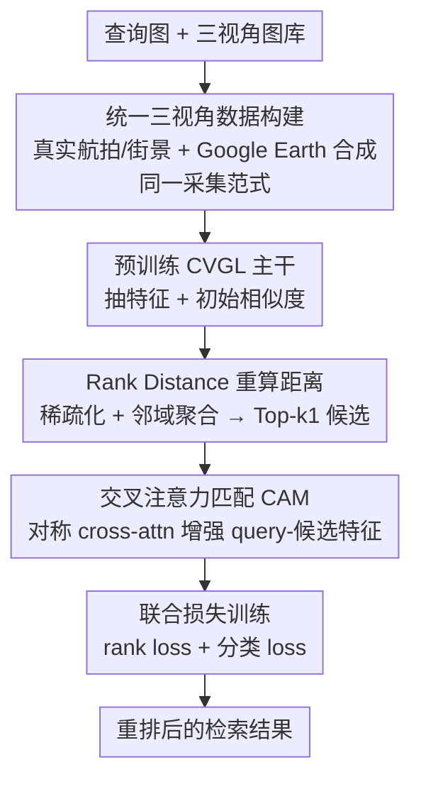

# UniGeoRS: A Unified Benchmark for Tri-view Geo-Localization

**会议**: CVPR 2026  
**论文**: [CVF Open Access](https://openaccess.thecvf.com/content/CVPR2026/html/Liang_UniGeoRS_A_Unified_Benchmark_for_Tri-view_Geo-Localization_CVPR_2026_paper.html)  
**领域**: 遥感 / 跨视角地理定位  
**关键词**: 跨视角地理定位, 三视角数据集, 卫星-无人机-地面, 交叉注意力重排, 真实+合成数据

## 一句话总结
UniGeoRS 构建了首个把卫星、无人机、地面三种视角统一在一起、且同时混合真实与合成影像的跨视角地理定位（CVGL）基准数据集（1154 个目标、约 14 万张图），并配套提出一个即插即用的二阶段重排模块 CAME，用 Rank Distance + 交叉注意力挖掘候选集内部的平台间/平台内关系，在多个主流 CVGL 模型上稳定提升 Recall@1 与 AP。

## 研究背景与动机
**领域现状**：跨视角地理定位（Cross-View Geo-Localization, CVGL）想在不依赖卫星导航信号的前提下，靠视觉相似度把一张查询图（地面街景、无人机航拍等）和一批已知地理坐标的参考图（通常是卫星图）匹配上，从而推断查询图的地理位置，服务于自动驾驶、无人机导航、视觉监控等场景。这几年靠深度学习 + 度量学习，地面↔卫星、无人机↔卫星这两类成对匹配已经做得相当成熟。

**现有痛点**：问题出在数据和任务设定两头。数据上，采集成本高，现有数据集要么只有两个平台（地面+卫星 或 无人机+卫星），要么虽号称三视角（如 University-1652）但地面视角严重不足——平均每个地点只有 3.38 张地面图，且全是合成。任务上，绝大多数方法只针对某一个子任务（ground→satellite 或 drone→satellite）单独设计，没人把三个平台真正放进一个统一框架里联合推理。

**核心矛盾**：根子上是「三个平台的特征分布差异巨大」与「现有数据/方法只覆盖其中两个、且各自为政」之间的脱节。卫星图强调大尺度结构、地面图捕捉精细纹理、无人机是介于两者之间的中间视角——视角、内容、域特性三重差异，使得统一的三视角 CVGL 既缺数据训练、也缺方法建模。此外纯合成无人机数据迁移到真实场景会有明显域差，而采集多视角真实无人机影像又昂贵费力，真实/合成之间也是一对矛盾。

**本文目标**：拆成两个子问题——(1) 造一个真正覆盖三平台、地面/无人机视角都丰富、且真实与合成混合的大规模基准；(2) 设计一个能被现有 CVGL 模型直接套用、显式利用平台间/平台内关系来改善匹配的模块。

**切入角度**：作者观察到，单阶段模型算完初始相似度后，Top 排名里仍混着错配——因为它把 gallery 里每张图当成孤立个体，忽略了候选之间的「亲和关系」。于是把改进放到第二阶段「重排」里，专门去挖候选集内部的关系。

**核心 idea**：用「统一三视角基准 UniGeoRS（真实+合成）」补齐数据短板，再用「Rank Distance 重算距离 + 交叉注意力增强特征」的二阶段重排模块 CAME 当作通用插件，挂到任意 CVGL 主干上拔高匹配精度。

## 方法详解
这篇论文是「数据集 + 配套方法」型工作，所以「方法」要分两块看：一块是**数据怎么造出来的**（UniGeoRS 的采集与构建管线），另一块是**配套算法 CAME 怎么做重排**。

### 整体框架
UniGeoRS 的数据侧：围绕 1154 个目标建筑，为每个目标采集卫星图（1 张/目标，0.5 米/像素）、无人机图（真实航拍 + Google Earth 虚拟飞行，平均 90.17 张/目标）、地面图（三脚架实拍 + Google Street View 街景，平均 32.39 张/目标），真实与合成走**同一套采集范式和数据格式**以保证跨域可比；最终切成标准块（卫星 1024×1024、无人机/地面 1920×1080），过滤遮挡/低质/文字 logo，按 854/300 个建筑划分训练/测试。

CAME 的算法侧是一个挂在现成 CVGL 模型之后的二阶段重排器：第一阶段用预训练 CVGL 主干抽特征算初始相似度；第二阶段先用 Rank Distance（RD）模块根据 gallery 内部关系重算距离、产出 Top-$k_1$ 候选序列，再用 Cross-Attention Matching（CAM）对每个 query–候选对做对称交叉注意力增强特征、重新打分排序，最后用 rank loss + 分类 loss 联合监督训练。

### 关键设计

**1. 统一三视角数据构建：用同一套范式把真实与合成、三个平台拼成一个可比的基准**

UniGeoRS 要解决的核心痛点是「三视角数据要么缺平台、要么缺多样性、要么真合成混不到一起」。作者的做法是给三个平台都定一套标准采集流程，并且让真实与虚拟两路走相同的数据格式与处理管线，保证可比性。卫星图无论真实还是虚拟都从 Google Earth 取 0.5 米/像素、做辐射校正与几何配准后裁成 1024×1024。无人机图分两路：真实路是实际 UAV 飞行，每个目标定三个相对飞行高度、每个高度做环绕飞行、每次至少均匀采 18 张（1920×1080）；虚拟路是在 Google Earth 的 3D 环境里设计虚拟航线，飞行半径和高度按建筑高度与底面积自动调整以保证全覆盖，每栋约 90 张、俯仰角 30°–60°。地面图同样分真实（三脚架相机每目标约 20 张）和虚拟（Google Street View API 取景、人工筛后保留 30 帧、仰角 20°–60° 以突出建筑立面）两路。

这样造出来的数据集规模上是 1154 个目标、104,051 张无人机图、1154 张卫星图、37,376 张地面街景图，其中 42 个真实目标用实体设备采了 3645 张。和 University-1652（地面仅 3.38 张/目标且纯合成）相比，UniGeoRS 把地面视角提到 32.39 张/目标、无人机到 90.17 张/目标，且真实+合成并存（见下方对比表）。因为版权限制，公开版只放标准化裁剪块，保留空间与结构信息以支持可复现实验。它的价值不在算法巧妙，而在于第一次把「三平台 + 真实/合成 + 地面多样性」这几件事凑齐，让统一 CVGL 有了训练和评测的土壤。

**2. Rank Distance 模块：不再把候选当孤立点，用图库内部关系重算检索距离**

单阶段模型直接拿 query–gallery 的欧氏/余弦相似度排序，把每张 gallery 图当成互不相关的个体，忽略了候选之间的亲和信息，导致 Top 排名里夹着错配。RD 模块的思路是「联合 query–gallery 相似度矩阵 $S_{qg}$ 和 gallery–gallery 相似度矩阵 $S_{gg}$ 一起修正距离」。具体三步：先做**选择性稀疏化**，每行只保留 Top-$k_1$ 的相似度、其余置零，$\hat{S}^{ij}_{qg} = S^{ij}_{qg}$ 当 $S^{ij}_{qg} \ge v_i$（$v_i$ 是该行第 $k_1$ 大的值）否则为 0，对 $S_{gg}$ 同样处理得 $\hat{S}_{gg}$，把不可靠的弱相似度过滤掉；再做**邻域聚合**，把 $\hat{S}_{gg}$ 每行按其 Top-$k_2$ 近邻取平均

$$\tilde{S}^i_{gg} = \frac{1}{k_2}\sum_{l \in \mathcal{I}_i} \hat{S}^l_{gg},$$

用图库内部一致性来抑制离群点；最后用

$$d_{RD} = 1 - S_{qg} - \hat{S}_{qg}\tilde{S}_{gg}$$

重算 query–gallery 距离，并据此为每个 query 选出 Top-$k_1$ 候选序列 $R_q$ 喂给后续的 CAM。RD 本质是把传统 k-reciprocal 重排的「邻域投票」思想嵌进 CVGL，靠 gallery 间关系把错配往后压。

**3. Cross-Attention Matching：对称交叉注意力让 query 与候选互相对齐跨视角特征**

RD 给出候选后，真正缩小「卫星—无人机—地面」三域特征鸿沟的是 CAM。对候选集 $R_q$ 里的每个 query–候选对 $(q, g_j)$，取出特征 $f_q, f_{g_j}$，用一组可学习投影 $W_Q, W_K, W_V$ 做**对称**交叉注意力：$r_q = \text{Attn}(f_q, f_{g_j})$、$r_{g_j} = \text{Attn}(f_{g_j}, f_q)$，其中 $\text{Attn}(A,B) = \text{Softmax}\!\left(\frac{(AW_Q)(BW_K)^\top}{\sqrt{d}}\right)BW_V$——即让 query 的特征去「读」候选的上下文、候选也反过来读 query，双向对齐。再加残差 $\tilde{r}_q = r_q + f_q$、$\tilde{r}_{g_j} = r_{g_j} + f_{g_j}$ 保持与原特征空间一致。最终相似度在 $s$ 个特征条带（stripe）上算余弦再平均：

$$S^{CAM}_{q,g_j} = \frac{1}{s}\sum_{i=1}^{s} \frac{\tilde{r}^{(i)}_q \cdot \tilde{r}^{(i)}_{g_j}}{\|\tilde{r}^{(i)}_q\|_2 \|\tilde{r}^{(i)}_{g_j}\|_2}.$$

之所以有效，是因为每个 query 特征条带都被它对应候选的注意力加权上下文「调制」过，跨视角的语义/几何错位被显式建模并拉近——这正是它在 Satellite→Ground、Drone→Ground 这类「高空↔地面」差异最大的任务上提升最猛的原因。和事后做的 k-reciprocal 重排不同，CAM 是在训练阶段直接优化特征交互，属于更内在、更任务自适应的改进。

### 损失函数 / 训练策略
CAME 用两个互补目标联合训练：rank loss 强制度量一致性（正样本在精炼后的嵌入空间里要比负样本更靠近 query），外加在 MLP 头上对 $\tilde{r}_q, \tilde{r}_{g_j}$ 算交叉熵（CE）loss 来保持特征判别性，总目标 $L_{sum} = \lambda_1 L_{Rank} + \lambda_2 L_{CE}$。实现细节：输入为预抽取的卫星/无人机/地面特征对，RD 取 $k_1=90, k_2=10$，CAM 用单个 8 头交叉注意力模块、隐藏维等于输入特征维，AdamW（lr $1\times10^{-4}$、batch 16、$\lambda_1=1, \lambda_2=0.5$）训 30 epoch、单张 RTX 3090。

## 实验关键数据

### 数据集对比（UniGeoRS vs 现有 CVGL 数据集）
| 数据集 | 年份 | 无人机图 | 无人机来源 | 地面图 | 每地点地面图 | 平台数 |
|--------|------|---------|-----------|--------|-------------|--------|
| University-1652 | ACM2020 | 37,854 | 虚拟 | 5,580 | 3.38 | 三平台 |
| SUES200 | TCSVT2023 | 40,000 | 真实 | 无 | – | 两平台 |
| DenseUAV | TIP2024 | 18,198 | 真实 | 无 | – | 两平台 |
| GTA-UAV | AAAI2025 | 33,764 | 虚拟 | 无 | – | 两平台 |
| VIGOR | ACM2021 | 无 | – | 238,696 | 1 | 两平台 |
| **UniGeoRS (本文)** | – | **104,051** | **真实+虚拟** | **37,376** | **32.39** | **三平台** |

可见 UniGeoRS 的核心卖点是同时把无人机规模（10 万+，真实/合成混合）和地面多样性（32.39 张/目标，是 University-1652 的近 10 倍）都拉满，且唯一一个真实+虚拟混合的三平台集。

### 主实验：CAME 作为插件挂到主流 CVGL 模型上（六向检索任务的 R@1/AP，节选）
| 模型 | 方法 | Drone→Ground AP | Satellite→Ground AP | Drone→Satellite AP |
|------|------|----------------|--------------------|--------------------|
| University-1652 | baseline | 10.05 | 3.47 | 58.72 |
| University-1652 | +CAME | **21.87** | **13.08** | 60.21 |
| LPN | baseline | 14.33 | 13.47 | 71.69 |
| LPN | +CAME | **24.04** | **23.73** | **72.19** |
| FSRA | baseline | 17.10 | 14.07 | 83.76 |
| FSRA | +CAME | **30.65** | **27.54** | 80.12 |
| Game4loc | baseline | 27.06 | 31.22 | 57.60 |
| Game4loc | +CAME | **37.77** | **44.35** | **58.62** |

整体 AP：University-1652 从 11.94%→17.17%、LPN 16.99%→23.44%、FSRA 18.83%→27.24%，提升在「高空↔地面」方向（Drone→Ground、Satellite→Ground）最明显。

### 消融实验（LPN + CAME，分析各组件与 RD 超参，节选 Drone→Ground / Satellite→Ground AP）
| 配置 | Drone→Ground AP | Satellite→Ground AP | 说明 |
|------|----------------|--------------------|------|
| baseline | 14.33 | 13.47 | 原始 LPN |
| extra training | 13.73 | 13.33 | 仅延长训练，无增益（反而略降） |
| w/o CAM | 18.44 | 14.03 | 只用 RD 也比 baseline 好 |
| w/o RD | 23.87 | 23.71 | 只用 CAM（欧氏距离输入）也涨 |
| **CAME (full)** | **24.04** | **23.73** | RD + CAM 协同最佳 |

### 数据集增益消融（控制训练样本总量基本不变）
| 训练数据 | Drone→Satellite AP | Satellite→Drone AP |
|----------|--------------------|--------------------|
| SUES200 only | 73.59 | 67.61 |
| SUES200 + UniGeoRS | **74.26** | **70.66** |
| University-1652 only | 83.98 | 81.11 |
| University-1652 + SUES200 | 85.70 | 82.27 |
| University-1652 + UniGeoRS | **86.21** | **82.78** |

### 关键发现
- **RD 与 CAM 互补、缺一不可**：单独去掉 CAM（只用 RD）或去掉 RD（只用 CAM）都比 baseline 强，但都不如二者协同；说明「图库内部关系重算距离」和「query-候选交叉注意力对齐」是两条正交的增益来源。
- **延长训练不是免费午餐**：单纯多训同样 epoch 数（extra training）性能不升反微降，证明 baseline 已近饱和，CAME 的提升来自结构而非更多训练步。
- **CAME 在「高空↔地面」任务上收益最大**：Satellite→Ground、Drone→Ground 这种视角/语义鸿沟最大的方向 AP 提升最猛（如 FSRA 的 Drone→Ground AP 17.10→30.65），契合「交叉注意力专门拉近异质视角」的设计初衷。
- **少数 Drone→Satellite / Ground→Satellite 任务有波动**：作者解释是这些方向的 gallery 是一对一（每地点只有 1 张卫星图），限制了「图库内邻域聚合」的发挥空间——这是 RD 思路的固有边界。
- **作为辅助数据，UniGeoRS 比 SUES200 更能涨点**：在控制总样本量的前提下，University-1652+UniGeoRS 比 University-1652+SUES200 更好，说明其多样性带来更强泛化。

## 亮点与洞察
- **真实+合成走同一采集范式**：很多数据集真实/合成各搞一套格式，导致两者难以联合训练；UniGeoRS 刻意让两路共用裁剪尺寸、处理流程、标注格式，这个工程上的「对齐」是它能把真实与合成混进同一基准的前提，值得复用。
- **把重排从「事后处理」搬进「训练阶段」**：传统 k-reciprocal 是 inference 时的后处理，CAME 的 CAM 直接在训练里优化 query-候选的特征交互，是更内在的改进——这个「把后处理可学习化」的思路可迁移到行人重识别、图像检索等任何带重排的任务。
- **对称交叉注意力 + 残差的小而稳设计**：双向 Attn 让 query 和候选互相读上下文、残差保持原特征空间，模块小（单个 8 头注意力）却能稳定地挂在 University-1652/LPN/FSRA/Samp4Geo/Game4loc 等多个主干上涨点，作为即插即用插件很实用。
- **「高空↔地面是最难方向」的实证**：实验把六个方向拆开看，清楚显示 Satellite/Drone→Ground 是 baseline 最弱、CAME 增益最大的方向，为后续 CVGL 工作指出了该重点攻关的子任务。

## 局限与展望
- **作者承认的局限**：当前只覆盖有限城市，未涉及不同季节、天气条件；未来要扩展城市/季节/天气，并研究三平台特征的联合学习与融合，追求超越「平台间/平台内相关性」的统一空间理解。
- **RD 对一对一 gallery 失灵**：Drone→Satellite、Ground→Satellite 方向因每地点仅一张卫星图，邻域聚合无从发挥，这些方向的提升微弱甚至波动——RD 的有效性强依赖 gallery 内部有足够多同类候选。
- **合成数据占比偏大、真实仅 42 目标**：真实采集目标只有 42 个（3645 张），绝大部分无人机/地面数据来自 Google Earth/Street View 合成，真实世界的极端光照、动态遮挡覆盖仍有限，真合成域差对下游影响有待更细评估。
- **版权裁剪可能损失上下文**：公开版只放标准化裁剪块，丢掉了周边大场景上下文，可能影响依赖全局布局线索的方法复现。
- **CAME 依赖预抽取特征**：训练输入是冻结主干的预抽取特征，重排器与主干没端到端联合优化，主干本身的表征上限会卡住整体效果。

## 相关工作与启发
- **vs University-1652**：同是三平台数据集，University-1652 首创三视角框架但地面视角仅 3.38 张/目标且纯合成、偏重无人机↔卫星；UniGeoRS 把地面提到 32.39 张/目标、引入真实+合成混合，补齐了它最薄弱的地面短板，并在「+UniGeoRS 比 +SUES200 更涨点」上量化了多样性优势。
- **vs 两平台数据集（SUES200 / DenseUAV / GTA-UAV / VIGOR / CVUSA）**：这些要么只有无人机+卫星、要么只有地面+卫星，且各自为政地服务单一子任务；UniGeoRS 第一次把三平台塞进一个基准支持统一 CVGL 评测。
- **vs k-reciprocal 重排**：传统 k-reciprocal 是 inference 时基于邻域关系的后处理；CAME 的 RD 借鉴了「邻域投票」思想但与可学习的 CAM 交叉注意力结合、在训练阶段优化，实验中整体优于或互补于 k-reciprocal。
- **vs 主流 CVGL 方法（LPN / FSRA / TransGeo / Samp4Geo / Game4loc）**：这些聚焦单阶段特征提取与对齐架构；CAME 不替换它们，而是作为第二阶段重排插件挂上去，对多种主干都稳定加分，定位是「正交增益」。

## 评分
- 新颖性: ⭐⭐⭐⭐ 首个真实+合成混合的三平台统一 CVGL 基准填补了明确空白，CAME 模块本身是已有重排/交叉注意力思想的稳健组合而非全新机制。
- 实验充分度: ⭐⭐⭐⭐ 六向检索 × 5 个主干的主实验 + 组件/超参/数据集三类消融，验证较扎实；但真实目标仅 42 个、未含跨季节/天气评测。
- 写作质量: ⭐⭐⭐⭐ 数据构建管线和 RD/CAM 公式交代清晰，图表完整；个别表格方向波动的解释略简。
- 价值: ⭐⭐⭐⭐ 数据集 + 即插即用插件双交付，对统一三视角地理定位社区有直接落地价值，数据与代码承诺开源。

<!-- RELATED:START -->

## 相关论文

- [\[CVPR 2026\] Geo2: Geometry-Guided Cross-view Geo-Localization and Image Synthesis](geo2_geometry-guided_cross-view_geo-localization_and_image_synthesis.md)
- [\[CVPR 2026\] SinGeo: Unlock Single Model's Potential for Robust Cross-View Geo-Localization](singeo_unlock_single_models_potential_for_robust_cross-view_geo-localization.md)
- [\[CVPR 2026\] GeoBridge: A Semantic-Anchored Multi-View Foundation Model Bridging Images and Text for Geo-Localization](geobridge_a_semantic-anchored_multi-view_foundation_model_bridging_images_and_te.md)
- [\[CVPR 2026\] PAUL: Uncertainty-Guided Partition and Augmentation for Robust Cross-View Geo-Localization under Noisy Correspondence](paul_uncertainty-guided_partition_and_augmentation_for_robust_cross-view_geo-loc.md)
- [\[AAAI 2026\] UniABG: Unified Adversarial View Bridging and Graph Correspondence for Unsupervised Cross-View Geo-Localization](../../AAAI2026/remote_sensing/uniabg_unified_adversarial_view_bridging_and_graph_correspondence_for_unsupervis.md)

<!-- RELATED:END -->
