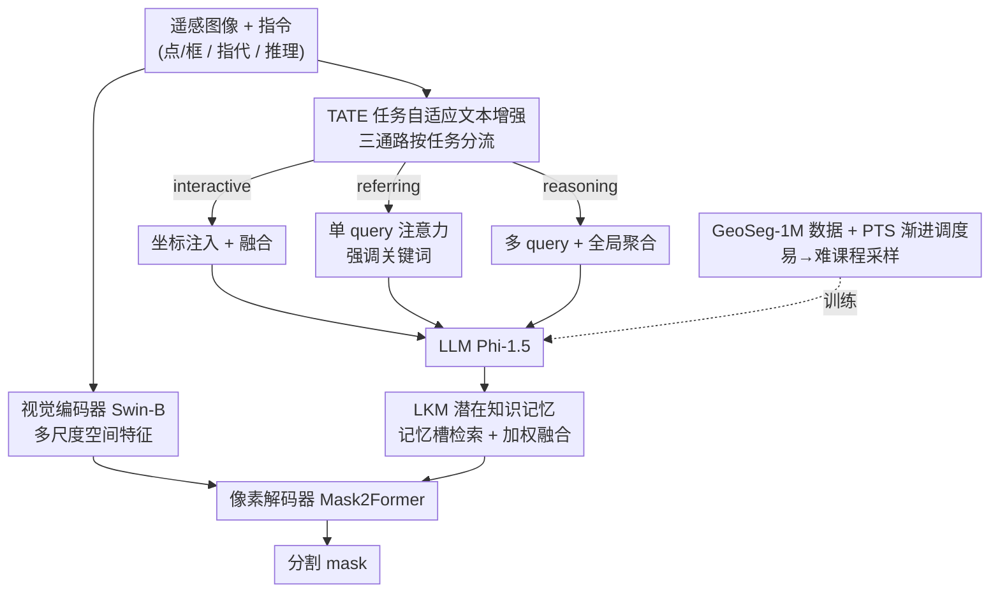

# UniGeoSeg: Towards Unified Open-World Segmentation for Geospatial Scenes

**会议**: CVPR 2026  
**arXiv**: [2511.23332](https://arxiv.org/abs/2511.23332)  
**代码**: https://github.com/MiliLab/UniGeoSeg (有)  
**领域**: 遥感 / 指令驱动分割 / 多模态  
**关键词**: 遥感分割, 指令驱动分割, 推理分割, 百万级数据集, 多任务统一框架

## 一句话总结
作者构建了首个百万级遥感指令分割数据集 GeoSeg-1M（590K 图、117 类、1.1M 三元组）与配套 benchmark GeoSeg-Bench，并提出统一框架 UniGeoSeg——用任务自适应文本增强（TATE）+ 潜在知识记忆（LKM）+ 渐进式任务调度（PTS）把 referring / interactive / reasoning 三类分割塞进一个模型，在 GeoSeg-Bench 与多个公开 benchmark 上全面 SOTA 且零样本泛化强。

## 研究背景与动机
**领域现状**：遥感里的"指令驱动分割"（用自然语言/点框提示生成像素 mask）正快速发展——RRSIS-D 做指代分割、SegEarth-R1 做地理推理分割、受 SAM 启发的方法加入视觉提示。这类范式让地理空间分析对非专业用户更友好，可用于城市规划、环境监测、灾害评估。

**现有痛点**：现有工作存在两个硬伤。其一是**任务定义碎片化**——模型大多只做单一类型（要么 referring、要么 interactive、要么 reasoning），各自为政，无法利用任务间的互补性，跨任务迁移能力差。其二是**数据规模与多样性不足**——现有遥感指令分割数据集在图像量、文本复杂度、类别覆盖上都偏小（最大的 RemoteSAM 也只 71K 图、270K 样本），难以支撑对复杂地理指令的鲁棒泛化，导致模型在需要上下文推理的开放世界场景里频频失败。

**核心矛盾**：要做"统一的开放世界分割"，既需要一份**同时覆盖三类任务、且文本语义足够丰富**的大规模数据，又需要一个**能在单一模型里消化异质指令**的架构——但三类任务的语义焦点、难度、数据量差异巨大（交互式只需空间理解且数据多，推理式需长文本+全局上下文+外部知识且高质量样本稀缺），直接混训会让各任务学到割裂的表示、互不增益。

**本文目标**：(1) 造一份百万级、三任务统一的遥感指令分割数据；(2) 设计一个统一框架，在不为每个任务单开模型的前提下，让异质指令各得其所、并促进跨任务知识共享。

**切入角度**：不同分割范式的指令在"语义焦点"和"与视觉内容对齐方式"上本质不同——交互式靠坐标提示、指代式靠关键词定位、推理式靠关系/属性/因果推断——所以与其用一套文本编码硬扛，不如给每类任务一条**轻量、任务专属**的文本增强通路；同时用一块共享记忆把跨任务知识沉淀下来，再用课程学习式的采样调度平滑任务难度差。

**核心 idea**：「百万级三任务数据 + 任务自适应文本增强 + 共享潜在记忆 + 渐进式难度调度」，把碎片化的遥感指令分割统一进一个强 baseline。

## 方法详解

### 整体框架
UniGeoSeg 的骨架是一个标准的视觉-语言分割三件套：分层视觉编码器（Swin-B）抽多尺度空间特征、LLM（Phi-1.5）解析文本指令、像素解码器（Mask2Former）生成 mask。本文的贡献是在这条骨架上插入三个机制让它"一鱼三吃"：输入的指令先经 **TATE（任务自适应文本增强）** 按任务类型走不同增强通路，得到任务专属的文本嵌入送进 LLM；LLM 输出的隐状态序列再经 **LKM（潜在知识记忆）** 与一组共享记忆槽做注意力检索、把跨任务知识融回来；融合后的表示连同多尺度视觉特征喂给解码器出 mask。训练侧则用 **PTS（渐进式任务调度）** 按课程学习的方式动态调整三类任务的采样比例。数据层面，GeoSeg-1M 由一条"mask 过滤 + 指令自动生成"的管线从多个公开遥感数据集合成而来。

### 关键设计

**1. GeoSeg-1M 数据构建管线：mask 过滤 + 三任务指令自动生成**

遥感公开数据集虽多带像素标注，但 mask 普遍存在碎片区域、边界不准、类别标签不一致，直接拿来当监督会污染训练。作者先做**系统化 mask 过滤**：把 mask 分解成连通区域、剔除不可靠区域，再用 InternVL3 配合专门设计的 prompt 自动评估剩余区域质量，只保留高质量 mask。在此基础上用**两阶段框架自动生成指令**——GPT-4o 负责生成、再由开源模型 InternVL3-78B 与 QwenVL2-72B 交叉打分做质控。三类任务各有专属生成策略：**推理分割**对某类别唯一区域生成"属性推理"问题、对有 1-2 个同类区域的情形用不同颜色高亮并生成"上下文/关系推理"问题（语义过滤更严，约 105K 样本）；**指代分割**用专门 prompt 引导 GPT-4o 生成强调相对位置、邻域上下文、物体间空间关系的表达，而非直接的视觉描述（约 336K）；**交互分割**直接从 mask 几何生成固定格式指令——紧致外接框 + mask 内随机采 1-3 个点，模拟点/框交互（约 481K）。最终 590,413 图、1,148,504 个图-mask-文本三元组，117 个语义类别（合并后并对每类设上限缓解长尾），空间分辨率横跨 0.05m–153m，是该领域首个百万级多模态分割数据集。

**2. TATE 任务自适应文本增强：给三类指令各开一条轻量增强通路**

不同分割范式的指令语义焦点天差地别，用一个文本编码器硬编码会顾此失彼。TATE 的做法是按任务分流：**交互式**把用户给的空间坐标 $\mathbf{C}_t$ 经线性投影到与文本嵌入 $\mathbf{E}_t$ 同维，再用融合层显式注入——$\tilde{\mathbf{E}}_{\text{int}}=\mathrm{Fusion}(\mathbf{E}_t,\mathbf{Proj}(\mathbf{C}_t))$，让分割直接 condition 在用户提示上；**指代式**用单个可学习 query $\mathbf{q}$ 对 token 做注意力、选择性放大关键词与物体相关线索——$\tilde{\mathbf{E}}_{\text{ref}}=\mathrm{softmax}\big(\frac{\mathbf{q}\cdot\mathbf{E}_t^\top}{\sqrt{d}}\big)\mathbf{E}_t$；**推理式**因为要捕捉空间关系、属性约束、因果线索等多维语义，用 $h$ 个 query 做多头注意力、每个 query 学一个推理维度，再并联一个线性层做全局聚合，最后接 dropout + LayerNorm 增强长文本稳定性：

$$\mathbf{E}_{\text{res}}=\frac{1}{h}\sum_{i=1}^{h}\mathrm{softmax}\Big(\frac{\mathbf{q}_i\cdot\mathbf{E}_t^\top}{\sqrt{d}}\Big)\mathbf{E}_t+\mathbf{E}_t\mathbf{W}_G$$

三条通路的输出按当前任务类型选择性送入 LLM。每条通路都很轻量，不引入显著算力开销，却让模型对异质指令各取所需——消融显示统一用 referring 或 reasoning 一条通路硬扛三任务都更差，证明"任务专属"才是关键。

**3. LKM 潜在知识记忆：用共享记忆槽促进跨任务知识迁移**

多任务训练虽能让一个模型处理三类任务，但每个任务往往各学各的、表示割裂，跨任务语义迁移有限。LKM 引入 $N$ 个可学习记忆槽 $\{\mathbf{M}_n\}_{n=1}^N$，存储从历史指令-mask 对中蒸馏出的任务无关潜在表示。对 LLM 输出的隐状态序列 $\mathbf{H}\in\mathbb{R}^{L\times d}$，用注意力相似度从记忆槽检索知识 $\mathbf{Z}=\sum_{n=1}^N\mathrm{softmax}(\mathbf{H}\mathbf{M}_n^\top)\mathbf{M}_n$，再以加权方式融回原嵌入——$\tilde{\mathbf{H}}=(1-\lambda)\mathbf{H}+\lambda\mathbf{Z}$，$\lambda$ 控制记忆影响、避免过度依赖先验。融合后的 $\tilde{\mathbf{H}}$ 连同多尺度视觉特征送进解码器。这块共享记忆相当于一个跨任务的"知识公共区"，让交互/指代里学到的空间定位能力反哺数据稀缺的推理任务（消融中 LKM 对 reasoning 增益明显）。

**4. PTS 渐进式任务调度：按难度做课程学习式采样**

三类任务难度和数据量极不均衡：交互式最易且样本多（约 481K，只需空间理解），指代式中等（需上下文推理+定位），推理式最难（长文本+全局上下文+外部知识，但高质量样本最少，约 105K）。若均匀采样，简单任务会主导、难任务学不透。PTS 借鉴课程学习：训练中**逐步降低交互式样本比例（最终降到 0.7，剩余权重分给推理）、保持指代式稳定、动态增加推理式比例**。早期靠交互任务打好基础空间推理能力，后期减权防过拟合、把注意力逼向更难的推理任务，从而提升开放世界泛化。这实现了从易到难的平滑过渡。

### 损失函数 / 训练策略
语言骨干 Phi-1.5、视觉编码器 Swin-B（训练时冻结）、解码器 Mask2Former（用预训练权重初始化）。bfloat16 精度，AdamW，初始学习率 $1\times10^{-4}$ + cosine 衰减，图像 resize 到 512×512，batch size 16，训练 3 epoch，8 张 A800。PTS 中交互式采样权重渐降至 0.7。

## 实验关键数据

### 主实验
评测指标为 gIoU（逐样本 IoU 均值，主指标）与 cIoU（全像素累计 IoU）：

$$\text{gIoU}=\frac{1}{N}\sum_{i=1}^N\frac{|M_i^{\text{pred}}\cap M_i^{\text{gt}}|}{|M_i^{\text{pred}}\cup M_i^{\text{gt}}|},\quad \text{cIoU}=\frac{\sum_i|M_i^{\text{pred}}\cap M_i^{\text{gt}}|}{\sum_i|M_i^{\text{pred}}\cup M_i^{\text{gt}}|}$$

GeoSeg-Bench（gIoU，含 GeoSeg-1M 微调后的强对手）：

| 方法 | Interactive gIoU | Referring gIoU | Reasoning gIoU |
|------|------|------|------|
| PSALM (FT) | 74.10 | 71.15 | 49.59 |
| Earthmind (FT) | 70.89 | 49.24 | 25.71 |
| LISAT (FT) | 73.00 | 62.46 | 31.25 |
| Segearth-R1 (FT) | 75.00 | 72.98 | 51.56 |
| **UniGeoSeg** | **75.56** | **74.58** | **53.12** |

未微调的通用/遥感大模型在 GeoSeg-Bench 上几乎崩盘（如 LISA reasoning 仅 5.77 gIoU），微调后大幅提升但仍落后本文，尤其推理任务最难拉开差距。EarthReason 测试集上本文相对此前最佳取得 **+6.65 cIoU / +2.16 gIoU**；RRSIS-D 上 gIoU 69.25 同样领先。

### 消融实验
| 配置 | Interactive | Referring | Reasoning | 说明 |
|------|------|------|------|------|
| baseline | 82.51 | 64.62 | 32.88 | 无 TATE/LKM |
| + TATE | 84.61 (+2.10) | 64.70 | 35.64 (+2.76) | 单加 TATE |
| + LKM | 81.97 (-0.54) | 65.21 (+0.59) | 33.85 (+0.97) | 单加 LKM |
| + TATE + LKM | 84.84 (+2.33) | 66.37 (+1.75) | 37.06 (+4.18) | 完整 |

TATE 内部分支消融（Tab.7）：三任务统一用同一条 referring 或 reasoning 分支都更差，任务专属增强（完整 TATE）在三任务上分别 +2.87 / +1.16 / +3.21 gIoU。LKM 超参（Tab.8）：$N=4,\lambda=0.2$ 最优（referring 66.37 / reasoning 37.06）。PTS（Tab.9）：相比均匀采样，在不损交互性能下小幅提升 referring(+0.07)/reasoning(+0.31)。

### 关键发现
- **TATE 贡献最大**：单加 TATE 就让 reasoning +2.76、interactive +2.10 gIoU；而 LKM 单加时甚至略损交互（-0.54），但两者组合后 reasoning 总增益达 +4.18，说明 TATE 负责"把异质指令理顺"、LKM 负责"跨任务知识共享"，二者协同才放大效果。
- **推理任务是公认短板**：即便微调过的强 baseline，reasoning gIoU 也只在 50 上下，远低于 interactive/referring 的 70+，印证遥感推理分割对长文本+外部知识的高要求。
- **零样本泛化强**：SIOR 零样本交互分割（point 提示 gIoU 86.60，明显超 SAM2 的 76.45）、RSVG-DIOR 零样本视觉定位（gIoU 59.67 vs 此前最佳 34.49）都大幅领先，体现统一训练带来的空间建模迁移力。

## 亮点与洞察
- **"一份数据三种任务统一合成"的管线很实用**：mask 过滤（连通区域分解 + InternVL3 质检）+ GPT-4o 生成 + 双开源模型交叉打分，把碎片化遥感标注自动升级成百万级指令监督，这套 LLM-in-the-loop 的数据工厂思路可直接迁到其他像素级任务。
- **TATE 的"按任务分流"很巧**：与其堆一个万能文本编码器，不如承认三类指令本质不同、给每类一条轻量通路——交互注坐标、指代单 query 聚焦、推理多 query 抓多维关系。这种"轻量任务专属头"模式比统一编码更省且更准。
- **LKM 把多任务的隐知识显式存进可学习记忆槽**，用注意力检索 + λ 加权融合，是一种简洁的跨任务知识共享机制，可复用到任何多任务隐状态融合场景。

## 局限与展望
- **推理分割绝对性能仍偏低**：reasoning gIoU 仅 53，离实用尚远，长文本+外部知识推理仍是瓶颈。
- **依赖闭源 GPT-4o 造数据**：指令生成核心靠 GPT-4o，复现成本与可控性受限，数据质量也受其 RS 领域理解上限约束。
- **PTS 增益偏小**：相比均匀采样仅小幅提升（reasoning +0.31），课程调度的收益不如 TATE 显著，调度策略（仅线性降交互权重到 0.7）还较粗糙，有更精细设计空间。
- **冻结视觉编码器**：Swin-B 训练时冻结，可能限制对遥感特有纹理/尺度的适配，端到端微调或专用遥感视觉预训练或可进一步提升。

## 相关工作与启发
- **vs SegEarth-R1**: 都做遥感推理分割，但 SegEarth-R1 是单任务推理专用；本文用统一框架同时吃下 referring/interactive/reasoning，在 EarthReason 上反超 +6.65 cIoU，证明多任务统一带来的互补增益。
- **vs RRSIS-D / RemoteSAM**: 它们分别是指代分割数据集和带视觉提示的分割，规模与任务覆盖都受限（RemoteSAM 270K 样本、单一 referring）；GeoSeg-1M 以 1.1M 三元组、三任务统一、117 类、最广分辨率覆盖全面超越。
- **vs PSALM / LISA（通用多任务分割）**: 它们在自然图像上设计，因自然图与遥感图的语义鸿沟在地理场景上泛化差；本文针对遥感空间关系与上下文推理定制 TATE/LKM，微调后仍稳定领先这些通用框架。

## 评分
- 新颖性: ⭐⭐⭐⭐ 数据集是首个百万级三任务统一遥感指令分割集，框架机制（TATE/LKM/PTS）属合理组合创新而非全新范式。
- 实验充分度: ⭐⭐⭐⭐⭐ 自建 benchmark + 多个公开集 + 零样本交互/定位 + 4 张消融表，覆盖全面。
- 写作质量: ⭐⭐⭐⭐ 结构清晰、公式完整，部分模块描述（记忆槽蒸馏来源）偏简略。
- 价值: ⭐⭐⭐⭐⭐ 数据集+benchmark+强 baseline+开源，为遥感指令分割提供可扩展基座，社区价值高。

<!-- RELATED:START -->

## 相关论文

- [\[CVPR 2026\] Prompt-Free Unknown Label Generation for Open World Detection in Remote Sensing](prompt-free_unknown_label_generation_for_open_world_detection_in_remote_sensing.md)
- [\[CVPR 2026\] ReAttnCLIP: Training-Free Open-Vocabulary Remote Sensing Image Segmentation via Re-defined Attention in CLIP](reattnclip_training-free_open-vocabulary_remote_sensing_image_segmentation_via_r.md)
- [\[CVPR 2026\] MM-OVSeg: Multimodal Optical-SAR Fusion for Open-Vocabulary Segmentation in Remote Sensing](mm-ovseg_multimodal_optical-sar_fusion_for_open-vocabulary_segmentation_in_remot.md)
- [\[CVPR 2026\] SegEarth-R2: Towards Comprehensive Language-guided Segmentation for Remote Sensing Images](segearth-r2_towards_comprehensive_language-guided_segmentation_for_remote_sensin.md)
- [\[CVPR 2026\] HySeg: Learning Generative Priors for Structure-Aware Remote Sensing Segmentation](hyseg_learning_generative_priors_for_structure-aware_remote_sensing_segmentation.md)

<!-- RELATED:END -->
