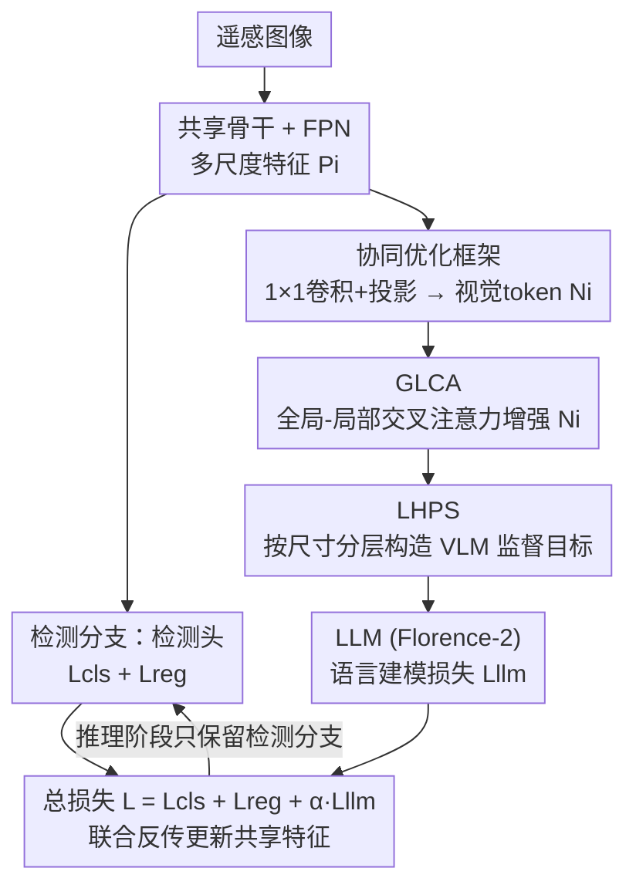

# VLM4RSDet: Collaborative Optimization with Vision-Language Model for Enhancing Remote Sensing Object Detection

**会议**: CVPR 2026  
**论文**: [CVF Open Access](https://openaccess.thecvf.com/content/CVPR2026/html/Shi_VLM4RSDet_Collaborative_Optimization_with_Vision-Language_Model_for_Enhancing_Remote_Sensing_CVPR_2026_paper.html)  
**代码**: https://github.com/cszzshi/VLM4RSDet （有）  
**领域**: 遥感目标检测 / 多模态VLM  
**关键词**: 遥感目标检测, 视觉语言模型, 协同训练, 密集小目标, Florence-2

## 一句话总结
VLM4RSDet 让一个常规闭集检测器和一个视觉语言模型（Florence-2）在训练阶段共享视觉骨干、联合反传，把 VLM 的先验知识"灌"进检测器的特征里；推理时直接扔掉 VLM、只留标准检测分支，因此**零额外开销**地把检测精度推到 SOTA（VisDrone2019 上 mAP$_{0.5:0.95}$ 比之前最好方法高 7.5%）。

## 研究背景与动机

**领域现状**：遥感目标检测（卫星图、无人机航拍）这几年在标签分配、尺度变化、任意朝向、背景噪声等问题上做了大量改进，闭集（closed-set，类别固定）检测的精度一路在涨。另一条线是把视觉语言模型（VLM）引进来——VLM 自带海量先验知识和上下文推理能力，理论上能帮检测器"看懂"复杂场景。

**现有痛点**：但现有把 VLM 用进检测的工作（LLMDet、YOLO-World、Grounding DINO 等）几乎都瞄准**开放词表**（open-vocabulary）场景。把它们直接搬到闭集遥感检测上有两个硬伤：一是精度反而打不过现代的常规闭集检测器；二是因为挂着大语言模型或额外模块，推理成本和部署开销都很高。也就是说，VLM 的先验很香，但"用法"不对——为了开放词表的灵活性，牺牲了闭集任务最看重的精度和效率。

**核心矛盾**：精度提升所依赖的 VLM 先验知识，和部署效率所要求的"轻量、无额外模块"之间存在天然冲突。你想要 VLM 的知识，就得在推理时背着它；想轻量，就用不上它。

**本文目标**：在**不增加任何推理 / 部署开销**的前提下，借 VLM 的先验知识打破常规闭集遥感检测器的精度瓶颈。

**切入角度**：作者的关键观察是——VLM 的价值其实是在**训练阶段**塑造视觉特征，而不是必须在推理阶段在场。如果让检测器和 VLM 共享同一套视觉特征提取网络、在训练时把两边的梯度都回传到这套共享特征上，VLM 就能把它的知识"刻"进特征里；推理时把 VLM 拆掉，留下的检测器仍然受益于这套被"养"得更好的特征。

**核心 idea**：用"训练时协同、推理时只留检测器"的协同优化框架，把 VLM 当成训练阶段的"特征导师"而非推理组件，再针对遥感密集小目标补两个模块（GLCA、LHPS）增强 VLM 这一支的感知与输出精度。

## 方法详解

### 整体框架
整个流程在训练阶段是"双分支共享主干"：一张遥感图先过骨干网络（如 ResNet-50）和 FPN，得到一组多尺度特征 $P_i$（$i=1{,}\dots{,}5$，通道 256）。这组 $P_i$ 被**同时**喂给两条分支——检测分支照常进检测头算分类损失 $\mathcal{L}_{cls}$ 和回归损失 $\mathcal{L}_{reg}$；VLM 分支则把 $P_i$ 转换成视觉 token，经 GLCA 增强、和文本 prompt 拼接后送进 Florence-2 的大语言模型，算语言建模损失 $\mathcal{L}_{llm}$。三个损失加权求和后**一起反传**，梯度都流回共享的骨干+FPN，于是 VLM 的先验知识就通过共享特征"渗"进了检测器。推理阶段把整条 VLM 分支删掉，只跑标准检测架构（下图红框区域对应的部分），所以参数量、FLOPs、FPS 都和原始检测器一模一样。

把 $P_i$ 接进 VLM 之前要先做格式转换：用 $1{\times}1$ 卷积把通道压到 $d_v{=}1024$，再用 `interpolate`+`reshape` 整成 $\mathbb{R}^{N\times L_v\times d_v}$（$L_v{=}32{\times}32$），最后过投影器（projector）映到 LLM 输入维度 $d$，得到视觉 token $N_i$：

$$N_i = \mathrm{Proj}(\mathrm{Reshape}(\mathrm{Inter}(\mathrm{Conv}_{1\times 1}(P_i))))$$

GLCA 把 $N_i$ 增强成 $T_i^v$，再和文本特征 $T^t$ 沿序列维拼接成 $T_i=\mathrm{Concat}(T_i^v, T^t)$ 喂进 LLM。LLM 的监督目标是把图里的框写成一串文本 token：HBB 用"类别+左上+右下"两点坐标，OBB 用四个顶点顺时针坐标，同类多个目标之间用 `<sep>` 分隔。

### 关键设计

**1. 协同优化框架：训练时共享特征、推理时只留检测器**

这一招直接对准核心矛盾——既想要 VLM 的先验，又不想背它的推理开销。做法是让常规检测器和 Florence-2-Base 共用同一套骨干+FPN 抽出来的多尺度特征 $P_i$：检测器这边照常算 $\mathcal{L}_{cls}+\mathcal{L}_{reg}$，VLM 那边把 $P_i$ 转成视觉 token 走语言建模算 $\mathcal{L}_{llm}$，总损失为

$$\mathcal{L} = \mathcal{L}_{cls} + \mathcal{L}_{reg} + \alpha\cdot\mathcal{L}_{llm}$$

由于 $\mathcal{L}_{llm}$ 数量级远大于另外两项，权重 $\alpha$ 取 0.05 来平衡（消融显示 0.05 最优）。关键在于：梯度从 VLM 分支回传时会经过**共享的**骨干+FPN，所以 VLM 的知识不是停留在它自己的参数里，而是被注入到了检测器也在用的那套特征上。推理时直接移除整条 VLM 分支，留下的检测器结构和原版一字不差——这就是它能"白嫖" VLM 先验却零额外开销的根本原因。和 LLMDet、YOLO-World 那种推理时仍挂着语言模块的开放词表方案相比，本文把 VLM 彻底限定在训练阶段，是效率上的本质区别。

**2. GLCA（全局-局部交叉注意力）：用最高层全局上下文增强各尺度特征**

VLM 分支拿到的 $N_i$ 是逐尺度独立的，缺少跨尺度的全局语境，感知能力不够。GLCA 的观察是：特征金字塔里最高层 $N_5$ 天然携带全局信息，而当前层 $N_i$ 保留局部细节，二者应该融合。具体做法是把局部特征 $N_i$（$i=1{,}2{,}3{,}4$）当 Query，全局特征 $N_5$ 当 Key 和 Value 做交叉注意力，再残差加回 $N_i$：

$$T_i^v = \begin{cases} \mathrm{Softmax}\!\left(\dfrac{N_i N_5^{\top}}{\sqrt{d}}\right) N_5 + N_i, & i=1,2,3,4 \\[4pt] N_5, & i=5 \end{cases}$$

这样每个尺度的视觉 token 都被注入了来自最高层的全局上下文，再喂给 LLM 时感知更完整。它解决的是"VLM 分支看每个尺度都是井底之蛙"的问题，且因为只动 VLM 分支、推理时连同 VLM 一起被丢掉，所以这点增益完全是免费的。

**3. LHPS（可学习分层预测策略）：按目标尺寸把检测分摊到不同特征层**

Florence-2 默认只用**单个**特征层去预测一张图里的所有目标。但遥感图像目标密度极高（VisDrone 里 60% 以上目标小于 20 像素），一层硬扛一大堆框，输出精度撑不住。LHPS 借鉴常规检测器"不同尺度目标交给不同 FPN 层"的思路：把一张图里所有目标按尺寸升序排好，分成 5 组，让自底向上的多尺度特征 $T_i$（$i=1{,}\dots{,}5$）各自负责一组。每组该装多少个目标不是写死的，而是引入一组**可学习参数** $\beta_i$ 表示各组占比，先归一化再向上取整：

$$\beta_i^{\ast} = \frac{\beta_i}{\sum_{j=1}^{5}\beta_j}, \qquad M_i = \lceil \beta_i^{\ast}\times M \rceil$$

其中 $M$ 是图里目标总数，$\lceil\cdot\rceil$ 向上取整保证不漏目标。于是每层 VLM 的监督目标 $Y_i^{llm}$ 就由对应那组目标的标签构成。这把"密集目标全压给一层"拆成了"按尺寸分层、每层只管自己量级的目标"，且分摊比例随训练自适应，针对的是遥感密集小目标这个具体痛点。

### 损失函数 / 训练策略
总损失 $\mathcal{L}=\mathcal{L}_{cls}+\mathcal{L}_{reg}+\alpha\mathcal{L}_{llm}$，$\alpha{=}0.05$。VLM 用预训练好的 Florence-2-Base，视觉输入 resize 到 $32{\times}32$、1024 通道，最大生成 token 长度 2048。AI-TOD / VisDrone 用 SGD（momentum 0.9、weight decay 1e-4，初始 lr 0.02），分别走标准 2x / 1x 训练；DOTA 用 AdamW 训 30 epoch；全部在 4×RTX 4090 上基于 MMDetection / MMRotate 实现。值得一提的是协同训练只要 12 epoch，远少于单独微调 Florence-2 所需的 50 epoch。

## 实验关键数据

### 主实验
覆盖两个 HBB 遥感集（AI-TOD、VisDrone2019）、两个 OBB 遥感集（DOTA-v1.0/v1.5）和一个通用集（MS COCO），VLM4RSDet 作为"插件"接到多种检测器上都能涨点：

| 数据集 | 指标 | 基线检测器 | +VLM4RSDet | 提升 |
|--------|------|-----------|-----------|------|
| AI-TOD | mAP$_{0.5:0.95}$ | DetectoRS 14.8 | 28.5 | +13.7 |
| VisDrone2019 | mAP$_{0.5:0.95}$ | DetectoRS 25.7 | 31.4 | +5.7 |
| VisDrone2019 | mAP$_{0.5:0.95}$ | DN-FPN 37.8（前SOTA） | 45.3 | **+7.5** |
| DOTA-v1.0 | mAP$_{0.5}$ | LEGNet-S 80.03 | 84.07（新SOTA） | +4.04 |
| DOTA-v1.5 | mAP$_{0.5}$ | LEGNet-S 72.89 | 78.42 | +5.53 |
| MS COCO | mAP$_{0.5:0.95}$ | Faster R-CNN 37.4 | 42.0 | +4.6 |

在 DOTA-v1.0 上 VLM4RSDet 把 Florence-2-Base / Large 这种"纯 VLM 检测器"分别甩开 34.90 / 29.30 个点的 mAP$_{0.5}$——说明同样用 Florence-2，"协同训练+丢弃"的用法远胜"直接当检测器"。

### 消融实验
基于 DetectoRS、在 VisDrone2019 上逐模块拆解（Table 6）：

| 配置 | mAP$_{0.5:0.95}$ | 相对基线 |
|------|------------------|---------|
| DetectoRS 基线 | 25.7 | — |
| + 协同框架（New Structure） | 28.5 | +2.8 |
| + 协同框架 + GLCA | 29.8 | +1.3 |
| + 协同框架 + LHPS | 30.2 | +1.7 |
| + 协同框架 + GLCA + LHPS（完整） | 31.4 | +5.7 |

开销侧（Table 8）：推理阶段三个基线检测器加上 VLM4RSDet 后，参数量 / FLOPs / FPS **完全不变**；相比微调版 Florence-2-Base，平均省下 73.8% 参数和 74.0% FLOPs，同时 mAP$_{0.5:0.95}$ 平均高 4.1、推理 FPS 平均高 21.4%。$\alpha$ 消融（Table 7）显示 0.03→0.07 区间内 0.05 最优。

### 关键发现
- **协同框架本身是涨点主力**：单是"双分支共享特征"就带来 +2.8 的 mAP，比 GLCA（+1.3）、LHPS（+1.7）各自的增量都大，印证了"VLM 当训练导师"这条主线的价值。
- **GLCA 与 LHPS 互补且叠加有效**：两者单独加各涨 1.3 / 1.7，一起上能到 +5.7（超过两者之和 +3.0 之上还有协同效应），说明"增强 VLM 感知"和"按尺寸分层输出"针对的是不同瓶颈。
- **真正的卖点是"免费午餐"**：推理零额外开销下还能把 DN-FPN 这种强基线再推高 7.5 个点，且在通用 COCO 上也稳定 +4~5，证明方法不挑检测器、不挑任务。
- **$\alpha$ 不能太大也不能太小**：因 $\mathcal{L}_{llm}$ 量级远大于检测损失，$\alpha$ 偏大会让 VLM 主导训练、检测分支被带偏，0.05 是平衡点。

## 亮点与洞察
- **"训练时协同、推理时丢弃"是个很干净的范式**：它把"要不要在推理时背着 VLM"这个两难直接绕开了——VLM 只在训练时通过共享梯度塑造特征，推理结构和原检测器完全一致。这个思路可以迁移到任何"想借大模型先验但又怕部署重"的任务。
- **同一个 Florence-2，用法决定上限**：直接拿 Florence-2 当检测器只有 40~55 的 mAP$_{0.5}$，但当"训练导师"协同进来能把 LEGNet 推到 84+，34 个点的差距说明"知识蒸馏式协同"远比"硬当检测头"高效。
- **LHPS 把检测器的金字塔思想反向输出给 VLM**：常规检测器早就用 FPN 按尺度分工，但 Florence-2 这类生成式 VLM 默认一层输出所有框。LHPS 用可学习占比 $\beta_i$ 把"分层预测"补回 VLM 的文本输出端，是把检测领域成熟经验迁回 VLM 的巧思。

## 局限与展望
- **作者承认的局限**：方法只服务于**闭集**任务——因为推理时把 VLM 拆了，开放词表那套灵活性也一起没了。作者把"完整保留 VLM、做高效开放词表检测"列为未来工作。
- **协同框架仅在训练时受益，VLM 的推理推理能力被完全舍弃**：对需要语言交互、可解释输出的遥感应用（如 VQA、指代检测）帮不上忙，本质上只是"用 VLM 把特征训得更好"。
- **训练成本仍非零**：虽然推理零开销、且 epoch 数（12）远少于微调 Florence-2（50），但训练阶段要同时跑两条分支、训练 FPS 明显下降，显存和单步成本高于纯检测器。
- **GLCA 固定用 $N_5$ 当全局**：把最高层当唯一全局上下文是个较强假设，遥感场景里全局语义未必只在最高层，可探索更灵活的全局特征选取。

## 相关工作与启发
- **vs 开放词表 VLM 检测（LLMDet / YOLO-World / Grounding DINO）**：它们推理时仍挂着语言模块、瞄准开放词表，精度和效率都打不过现代闭集检测器；本文反其道，把 VLM 限定在训练阶段、推理只留检测器，用闭集换来的精度和零开销。
- **vs 纯 VLM 检测器（Florence-2、LMM-Det）**：直接微调 VLM 当检测器部署重、闭集精度不行；本文证明同样的 Florence-2 当"协同导师"远比当"检测主体"划算（DOTA 上 +34.9 mAP$_{0.5}$）。
- **vs 遥感专用检测器（LSKNet / PKINet / LEGNet / DN-FPN）**：这些方法靠大核卷积、轻量骨干等结构改进提精度，但缺少外部先验知识；VLM4RSDet 不替换它们，而是当插件接上去再涨一截（LEGNet-S 在 DOTA 上 80.03→84.07）。
- **vs coarse-to-fine 遥感框架（UFPMP-Det / AdaZoom / YOLC）**：那类方法靠"先粗检再细检"提精度但训练推理双重涨开销；本文只在训练涨开销、推理零开销，定位互补。

## 评分
- 新颖性: ⭐⭐⭐⭐ "训练协同、推理丢弃 VLM" 的范式干净且首次用于闭集遥感检测，GLCA/LHPS 是合理但常规的补强
- 实验充分度: ⭐⭐⭐⭐⭐ 5 个数据集（HBB+OBB+通用）、多种基线检测器、模块/权重/开销三类消融齐全
- 写作质量: ⭐⭐⭐⭐ 结构清晰、公式完整，但部分模块（LHPS 的分组细节）描述偏简
- 价值: ⭐⭐⭐⭐ 即插即用、零推理开销还能稳定涨点，对落地友好；局限于闭集是主要短板

<!-- RELATED:START -->

## 相关论文

- [\[CVPR 2026\] UniChange: Unifying Change Detection with Multimodal Large Language Model](unichange_unifying_change_detection_with_multimodal_large_language_model.md)
- [\[CVPR 2026\] GeoDiT: A Diffusion-based Vision-Language Model for Geospatial Understanding](geodit_a_diffusion-based_vision-language_model_for_geospatial_understanding.md)
- [\[CVPR 2026\] Rotation Invariant and Symmetry Aware Pixel Difference Network for Remote Sensing Object Detection](rotation_invariant_and_symmetry_aware_pixel_difference_network_for_remote_sensin.md)
- [\[CVPR 2026\] ORSATR-X: A Foundation Model based on Differential-and-Excitation Networks for Optical Remote Sensing Object Recognition](orsatr-x_a_foundation_model_based_on_differential-and-excitation_networks_for_op.md)
- [\[CVPR 2026\] CF-IPT: Cross-Modal Fusion Interactive Prompt Tuning of Vision-Language Pre-Trained Model for Multisource Remote Sensing Data Classification](cf-ipt_cross-modal_fusion_interactive_prompt_tuning_of_vision-language_pre-train.md)

<!-- RELATED:END -->
