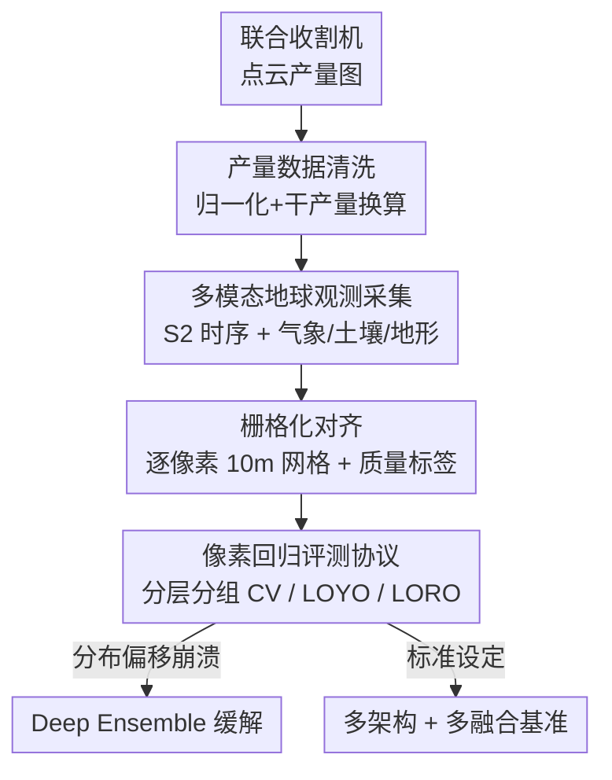

# YieldSAT: A Multimodal Benchmark Dataset for High-Resolution Crop Yield Prediction

**会议**: CVPR 2026  
**论文**: [CVF Open Access](https://openaccess.thecvf.com/content/CVPR2026/html/Miranda_YieldSAT_A_Multimodal_Benchmark_Dataset_for_High-Resolution_Crop_Yield_Prediction_CVPR_2026_paper.html)  
**代码**: https://yieldsat.github.io/ (有)  
**领域**: 遥感 / 地球观测 / 多模态融合  
**关键词**: 作物产量预测, 像素回归, 多模态遥感, Sentinel-2, 分布偏移

## 一句话总结
YieldSAT 把作物产量预测做成「逐像素回归」任务，构建了首个覆盖 4 国 4 种作物、含 2,173 块专家校验田、1,220 万个 10 米分辨率产量标签的多模态遥感基准，配套 Sentinel-2 时序影像与气象/土壤/地形辅助数据，并系统揭示了真实场景下产量分布偏移导致的模型崩溃、用 Deep Ensemble 给出缓解方案。

## 研究背景与动机
**领域现状**：数字农业把作物产量预测当成支撑减产保险、政策制定、气候适应的关键能力。技术上它是一个处理多模态时序数据的图像回归问题——Sentinel-2（S2）这类卫星持续提供高时空分辨率影像，从播种到收获完整刻画作物的植被、含水量、养分、生化状态，于是「用遥感 + 深度学习预测产量」近年很热。

**现有痛点**：地球观测（EO）数据本身海量且免费，但**带标签**的 EO 数据极度稀缺——只占未标注总量的 0.1%。落到产量预测上，公开数据集要么只覆盖单一作物、单一地区、单一年份（如 SwissYield 只有瑞士 73 块田），要么分辨率太粗（如 CropNet 只到 9 km 区域级、没有像素级真值）。在这种数据上训出来的模型，一旦换地区/换年份就严重崩溃，导致业界对部署高度怀疑。

**核心矛盾**：产量真值采集成本极高（要靠联合收割机逐点测量）、数据质量参差、还受隐私法规约束，所以「想要大规模、高分辨率、跨地域跨作物的高质量标注」与「采集现实」之间存在根本张力。没有这样的数据集，逐像素产量回归这类任务就一直被搁置。

**本文目标**：发布一个大规模、高质量、多模态、可直接训练深度模型的子田级（像素级）产量预测数据集，并在其上系统比较多种深度学习架构与融合策略，把真实世界里最棘手的分布偏移问题摆到台面上。

**切入角度**：把产量预测显式建模成**逐像素回归**（每个 10 m 像素一个产量标签），输入只用全球公开、免费、有全球覆盖的数据，保证可复现、可推广；同时把联合收割机的原始测量当成「需要严格清洗的脏数据」来对待，而非现成标签。

**核心 idea**：用「联合收割机点云 → 栅格化产量图」拿到像素级真值，配上 S2 时序 + 气象/土壤/地形多模态输入，建成首个像素级、多模态、跨国跨作物的产量基准；并用 Deep Ensemble 直面分布偏移下的泛化崩溃。

## 方法详解

### 整体框架
这是一篇数据集 + 基准论文，「方法」=**数据构建管线** + **评测协议**。整条管线把一次收割的脏点云，变成可直接喂给深度模型的、像素对齐的多模态时序张量；评测部分则定义了从标准交叉验证到留一年/留一区的难度阶梯，专门压测泛化。

数据从一台装了产量监测仪的联合收割机出发：收割时它沿田块行进，按固定频率记录带地理坐标的点（湿产量、含水量、经纬度、时间），所有点构成一块田的「产量图」（point vector）。随后对产量图做清洗、单位/语言归一化、剔除异常、湿产量换算干产量；再围绕每块产量图采集 S2 多光谱时序与气象/土壤/地形辅助模态（ADM）；最后把所有模态栅格化到 S2 的 10 m 网格、逐像素对齐成时序，并打上专家质量标签。成品提供两种格式：拼接好的 24 时间步融合张量（开箱即训），以及保留各模态的灵活版（供设计高级融合模型）。

### 关键设计

**1. 联合收割机产量清洗与干产量归一化：把脏测量变成可信的像素级真值**

像素级产量真值的根本难点在于：联合收割机的原始数据在农户、地区、国家之间高度不一致——不同机器、不同语言的字段命名、不同单位、不同管理习惯，还普遍存在传感器误差、定位漂移、测量延迟、转弯时的异常值。作者用一条标准化管线统一处理：先把非 shapefile 格式转格式，再做字段命名的自动/半自动多语言翻译、统一到公制、从 WGS84 投影到 UTM 坐标系；然后按专家规则剔除零产量点、生物学上不可能的点（含作物特定的最大产量上限），并按 $\pm 3\sigma$ 过滤离群。最关键的一步是把湿产量换算成干产量（scaled yield）：

$$y_s = y_w \cdot \frac{1 - m_m}{1 - m_s}$$

其中 $y_s$ 是干产量、$y_w$ 是湿产量、$m_m$ 是实测含水量、$m_s$ 是标准含水量。之所以用干产量，是因为它对天气、收割时间这类测量噪声更不敏感，也是真正决定农户/贸易商/保险收益的指标。每块产量图还由农业专家人工打上 good/average/bad 质量标签，让下游能按质量分层使用。这一步是整个数据集「高质量」标签的来源，没有它后面的逐像素回归就是在拟合噪声。

**2. 多模态地球观测采集 + 栅格化逐像素对齐：把异构分辨率模态压到同一张 10m 网格上**

光有 S2 还不够——S2 常因云遮挡丢时间步，引入不确定性。作者按四条准则（对产量有实证/理论影响、开放免费、全球覆盖、尽量高分辨率）补三类辅助模态（ADM）：气象（ERA5，日级，温度/降水）、土壤（SoilGrids，250 m，有机碳/氮/黏土/pH 等，且分 6 个深度层并带不确定性）、地形（SRTM，30 m，并用 RichDEM 工程出坡度/曲率/坡向/地形湿度指数 TWI）。S2 取 L2A 全部 13 个波段、从播种到收获约每 5 天一景，低分辨率波段用最近邻上采样到 10 m，并**刻意不预先算 NDVI/NDWI** 等指数以保留下游灵活性；同时保留 Scene Classification Layer（SCL）做逐像素云/植被标记。

难点是这些模态的空间/时间/光谱分辨率天差地别。栅格化解决对齐：以 S2 的 10 m 网格覆盖产量图，把落在同一像素内的所有产量点取平均，得到与 S2 严格逐像素对齐的产量图像；土壤/地形栅格用三次样条插值上采样到 10 m。没有产量点的像素被 mask 掉不参与训练。作者还诚实地指出栅格化会因收割机路径密度、幅宽、速度、定位延迟引入「空间相关的支撑度不确定性」，所以额外为每个像素提供 (i) 产量点数、(ii) 标准差两个标签，方便后续研究建模这种不确定性。共计每个样本 72 个特征。

**3. 像素回归评测协议（分层分组 CV + LOYO/LORO）：把「跨年/跨区泛化」做成可量化的压测**

数据集的价值要靠协议兑现。所有模型在像素级训练（每个像素当独立样本），用 **分层分组 10 折交叉验证**——像素按田块分组（保证同一块田的像素整块进训练或测试集，杜绝信息泄漏）、按地区分层。评测同时报子田（像素）级和田级（同田像素平均后比对）两套指标，并按国家×作物分子集汇报，因为数据高度异质、实际使用也是分子集用。为了直面真实世界的分布偏移，作者再加两个更难的协议：**留一年（LOYO）** 和 **留一区（LORO）**（区 = 某个农户或本地数据商的田块集合），在没见过的年份/地区上评估泛化。这套阶梯让「标准设定能做但换分布就崩」这一现象第一次被量化出来。

**4. Domain-informed Deep Ensemble：用权重空间多模态探索缓解分布偏移崩溃**

LOYO/LORO 暴露的崩溃是这篇基准想解决的核心挑战。作者用 5 个成员的 Deep Ensemble（DE），并优先选轻量的 3D-LSTM（带空间局部性归纳偏置、且早期实验里性价比高，因为训 DE 计算昂贵），只用 ARG 的 S2 数据训练。之所以有效，作者用权重空间分析给了解释：在标准 10 折 CV 下集成成员的权重分布完全重叠；而在 LOYO/LORO 下，每折的权重在 t-SNE 里形成互不重叠的清晰簇——这既解释了为什么单模型在分布偏移下泛化差（被困在单一模态），也解释了 DE 为何更鲁棒（它探索权重空间的多个模态/mode，而确定性基线只探索单一 mode）。训练轨迹进一步佐证：两个集成成员训练初期权重余弦相似度高、随训练逐渐分离。把空间局部性这个额外归纳偏置（3D-LSTM）叠加进来，会进一步拉大集成相对基线的优势。

## 实验关键数据

### 数据集规模对比

| 数据集 | 国家 | 作物 | 年份 | 田块数 | 像素级 | 光学分辨率 | 特征数 | 专家校验 |
|--------|------|------|------|--------|--------|-----------|--------|----------|
| SwissYield | 1 | 2 | 2017–2021 | 73 | ✓ | 10 m | 14 | ✗ |
| CropNet | 1 | 4 | 2017–2022 | 0 | ✗ | 9 km | 13 | ✗ |
| **YieldSAT (本文)** | **4** | **4** | **2016–2024** | **2,173** | **✓** | **10 m** | **72** | **✓** |

YieldSAT 总计约 1,220 万个 10 m 产量标签、113,555 张标注 S2 影像，覆盖阿根廷/巴西/乌拉圭/德国，含玉米/油菜/大豆/小麦，标注面积约 138,288 ha。大豆田最多（1,305 块），油菜最少（111 块）。

### 多架构基准（节选，R²↑ / RMSE↓ t/ha）

| 模态 | 融合 | 模型 | ARG-S 田级 R² | ARG-S 田级 RMSE | URG-S 田级 R² |
|------|------|------|------|------|------|
| S2 | ✗ | 3D-ConvLSTM | 0.79 | 0.55 | 0.77 |
| S2 | ✗ | LSTM | 0.72 | 0.64 | 0.66 |
| S2+ADM | Input Fusion | 3D-ConvLSTM | 0.82 | 0.52 | 0.78 |
| S2+ADM | Feature Fusion (AFF) | 3D-LSTM | **0.84** | **0.49** | **0.81** |

最佳子集（阿根廷大豆 ARG-S）田级 R² 最高到 0.84、RMSE 低至 0.49 t/ha。

### 分布偏移与 Deep Ensemble（阿根廷子集，田级）

| 作物 | 模型 | LOYO R²↑ | LORO R²↑ |
|------|------|----------|----------|
| 大豆 | Baseline LSTM | 0.50 | 0.64 |
| 大豆 | DE-3D-LSTM | 0.63 | **0.73** |
| 玉米 | Baseline LSTM | 0.46 | 0.47 |
| 玉米 | DE-3D-LSTM | **0.63** | **0.76** |

### 关键发现
- **空间相关性建模收益最大**：用 3D-CNN block 建模像素邻域（3D-LSTM、3D-ConvLSTM、AFF）相比逐像素独立建模显著提升，即便只用 S2 也很强；田级一致比子田级分数高。
- **ADM 有用但要看融合方式**：加入气象/土壤/地形通常提升性能，但收益依赖架构与融合策略——简单的 input fusion 配复杂时空模型（3D-LSTM）反而会掉点，因为不同模态的时空分辨率没被妥善协调；需要高级 feature fusion（AFF/MMGF）才能调和。
- **分布偏移导致显著崩溃**：大豆 LOYO 相比标准 CV，R² 下降 22 个百分点；LORO 下降 8 个百分点。崩溃在所有架构上一致。
- **DE 稳健回血**：玉米 LORO 上 DE-3D-LSTM 相对基线提升 29 个百分点、R² 达 0.76，几乎追平基线在标准 CV 下的水平；权重空间分析显示偏移下各折权重分簇、DE 探索多个 mode 是其鲁棒性来源。
- **结果强依赖国家×作物**：不同子集表现差异大，主要源于真值数据质量差异；t-SNE 显示不同国家/作物的地表反射率分布显著不同，跨环境泛化天然困难。

## 亮点与洞察
- **把农业脏数据工程当成一等公民**：论文没有掩饰联合收割机数据的混乱，而是把「多语言字段翻译、单位/坐标统一、$\pm 3\sigma$ 过滤、干产量换算、专家质量分级」整套清洗写清楚——这对任何想复现遥感回归真值的人都是可迁移的实操清单。
- **像素级支撑度不确定性被显式标注**：为每个像素额外提供产量点数和标准差，承认栅格化引入的空间相关噪声，给后续做不确定性建模/加权回归留了接口，是很负责任的数据集设计。
- **用权重空间几何解释泛化崩溃**：把「分布偏移下性能下降」和「集成成员在权重空间分簇/探索多 mode」联系起来，给 Deep Ensemble 的有效性提供了可视化证据，而不只是报个涨点数字——这个分析思路可迁移到其他 EO 回归任务。
- **刻意不算植被指数**：保留原始 13 波段而非预先算 NDVI/NDWI，把特征工程的自由度留给下游，体现「基准应中立」的取舍。

## 局限与展望
- **跨作物/跨国评测尚未打通**：作者坦言初步实验里 cross-crop、cross-country 设定在没有域适应时直接模型崩溃，因此只做了 LOYO/LORO，这两类更激进的泛化留给未来工作。
- **DE 实验范围窄**：分布偏移与权重空间分析只在阿根廷子集、只用 S2、只用 5 成员 DE 上做（因 DE 训练昂贵），结论能否推广到其他国家/作物/模态组合需进一步验证。
- **栅格化平均损失子像素信息**：逐像素平均虽是收割机数据的 SOTA 处理，但会抹掉像素内的细粒度变异，且支撑度在空间上相关，可能给产量建模引入系统性偏差。
- **真值质量国别差异大**：good/average/bad 标签揭示了数据集内部质量参差，弱质量子集上的基准分数更多反映标签噪声而非模型能力，横向比较需带 caveat。

## 相关工作与启发
- **vs SwissYield**：同为像素级、10 m 分辨率，但 SwissYield 仅瑞士 73 块田、单一国家少量作物且未做专家校验；YieldSAT 把规模扩到 4 国 2,173 块田并系统化质量分级。
- **vs CropNet**：CropNet 只到 9 km 区域级、无像素级真值、时空分辨率低且只配单波段衍生量；YieldSAT 提供真正的子田级产量图 + 全 13 波段 S2 + 多模态 ADM。
- **vs 单一 LSTM/Transformer 产量预测工作**：以往研究多局限单作物/单地区/单年份、易在真实场景崩溃；本文用跨年跨区协议把崩溃量化，并提供 DE 缓解路径，把研究重心从「刷标准 CV 分数」推向「鲁棒泛化」。
- **启发**：把回归任务的真值采集链路（脏传感器 → 清洗 → 栅格对齐 → 质量分级 → 不确定性标注）模板化，可迁移到其他物理量稠密回归（如深度估计、土壤湿度反演）；权重空间多模态分析也是诊断分布偏移的通用工具。

## 评分
- 新颖性: ⭐⭐⭐⭐ 首个像素级、多模态、跨国跨作物的产量基准，填补了真实的数据空白，但建模方法本身用的是已有架构。
- 实验充分度: ⭐⭐⭐⭐ 多架构×多融合×多子集的扎实基准 + LOYO/LORO 偏移压测 + 权重空间分析，DE 部分覆盖面略窄。
- 写作质量: ⭐⭐⭐⭐ 数据构建与协议讲得清楚、对局限诚实，图表信息密度高。
- 价值: ⭐⭐⭐⭐⭐ 公开的高质量产量基准对数字农业与 EO 回归社区是稀缺且高影响的基础设施。

<!-- RELATED:START -->

## 相关论文

- [\[CVPR 2026\] PhenoYieldNet: Learning Crop-Aware Phenological Responses for Multi-Crop Yield Prediction](phenoyieldnet_learning_crop-aware_phenological_responses_for_multi-crop_yield_pr.md)
- [\[CVPR 2026\] RAMEN: Resolution-Adjustable Multimodal Encoder for Earth Observation](ramen_resolution-adjustable_multimodal_encoder_for_earth_observation.md)
- [\[CVPR 2026\] ZoomEarth: Active Perception for Ultra-High-Resolution Geospatial Vision-Language Tasks](zoomearth_active_perception_for_ultra-high-resolution_geospatial_vision-language.md)
- [\[CVPR 2026\] Cross-Scale Pansharpening via ScaleFormer and the PanScale Benchmark](cross-scale_pansharpening_via_scaleformer_and_the_panscale_benchmark.md)
- [\[CVPR 2026\] UniGeoRS: A Unified Benchmark for Tri-view Geo-Localization](unigeors_a_unified_benchmark_for_tri-view_geo-localization.md)

<!-- RELATED:END -->
