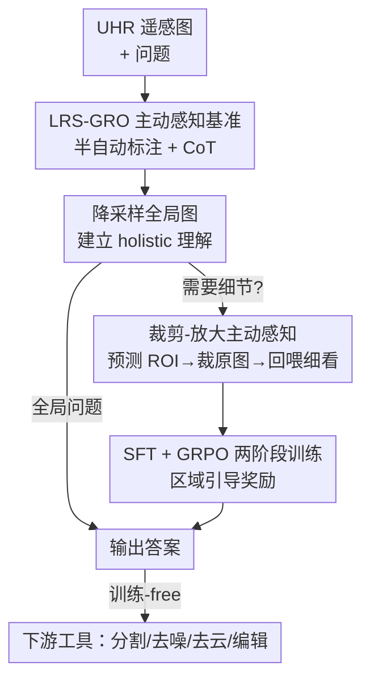

# ZoomEarth: Active Perception for Ultra-High-Resolution Geospatial Vision-Language Tasks

**会议**: CVPR 2026  
**论文**: [CVF Open Access](https://openaccess.thecvf.com/content/CVPR2026/html/Liu_ZoomEarth_Active_Perception_for_Ultra-High-Resolution_Geospatial_Vision-Language_Tasks_CVPR_2026_paper.html)  
**代码**: https://earth-insights.github.io/ZoomEarth (有，承诺开源数据与代码)  
**领域**: 遥感 / 多模态VLM  
**关键词**: 超高分辨率遥感, 主动感知, 裁剪-放大, GRPO, 区域引导奖励

## 一句话总结
针对超高分辨率（UHR）遥感影像「整张喂进去信息冗余、缩小又丢细节」的死结，ZoomEarth 让一个 3B 的 VLM 像人一样先看全局再「放大」感兴趣区域：模型自己预测 ROI 框、从原始高清图裁出局部回喂细看，靠 SFT + GRPO 两阶段训练，并用一个新的「区域引导奖励」缓解 IoU 奖励在 UHR 上恒为零的稀疏问题，在自建基准 LRS-GRO 和三个公开 UHR 遥感基准上零样本拿下 SOTA。

## 研究背景与动机

**领域现状**：把多模态大模型（MLLM/VLM）用到遥感影像上已经能做 VQA、grounding、分割等任务。但卫星/航拍图常常覆盖广阔地理区域，分辨率高达 5000×5000 甚至上万像素，怎么高效地「喂进」模型并处理是核心难题。现有应对方式有两类：**动态分辨率**（直接吃高清输入，但计算量爆炸）和**token 剪枝**（按人工规则去掉背景 token，如聚类去背景）。

**现有痛点**：作者把这两类都归为「被动感知（passive perception）」范式——模型只有**一次**视觉输入。当模型想要更细的视觉信息时，只能整体提高输入分辨率，于是被迫吞下大量与问题无关的冗余视觉 token，反而被干扰。token 剪枝那套人工规则也只在特定场景（如大水体背景里查桥梁）才有效，遇到背景复杂的遥感图就失灵。

**核心矛盾**：「看得清」和「不被冗余淹没」在单次输入范式下是 trade-off——分辨率拉高→细节有了但冗余也来了；分辨率压低→冗余少了但小目标看不见。遥感图里小目标又多又密、目标常是「工业区」这种大范围区域而非孤立物体，这个矛盾尤其尖锐。

**本文目标**：换掉被动感知，让模型能**重访（revisit）**与问题相关的区域。要落地这件事在 UHR 遥感上有两个拦路虎：(1) 没有显式记录「主动感知过程」的遥感数据集；(2) 难以让模型学会自适应地选区域、主动探索。已有的工具增强方法（让模型调用 OCR、目标检测来主动感知）依赖文字线索和离散物体实例，遥感图既缺文字、目标又是大片区域，直接搬不过来。

**切入角度**：人类看大图时是「先扫全局拿到 holistic 理解，再盯着可疑区域凑近细看」。把这种视觉搜索行为搬给 VLM——先看降采样的全局图，再主动框出 ROI、从原始高清图裁出来放大回看。

**核心 idea**：用「主动感知（active perception）」代替被动感知——模型自适应地调用「裁剪-放大」工具去重访信息密集的小区域；同时为了训得动，造一个带 ROI 框和思维链标注的 UHR 遥感基准 LRS-GRO，并设计一个适配遥感空间分布的「区域引导奖励」把稀疏的 IoU 奖励变稠密。

## 方法详解

### 整体框架
ZoomEarth 解决的是「UHR 遥感图怎么既看全局又看清细节」。整套系统有两条主线：一条是**造数据**（LRS-GRO 基准 + 半自动标注管线），另一条是**训模型**（在 Qwen2.5-VL-3B 上做 SFT→GRPO 两阶段训练 + 区域引导奖励）。

推理时的转法很简单：模型先吃一张**降采样的全局图**建立整体理解；对需要细节的问题，它输出一个 ROI 的边界框 `{"bbox_2d": [...], "label": ...}`，系统把这个框从**原始高清图**里裁出来（即「zooming」，恢复到原生高分辨率）再回喂模型细看，最后给出答案。全局类问题（如数大桥、判断城乡）不裁，直接答。训练好的模型还能把这个「裁剪-放大」能力当成统一接口，免训练地接上分割/去噪/去云/图像编辑等下游模型，变成一个遥感 agent。

### 关键设计

**1. LRS-GRO：把「主动感知过程」显式标进数据集**

痛点是没有任何遥感数据集记录了「模型该去看哪、怎么一步步看」，没法监督主动感知。作者构造了 LRS-GRO 基准：图像来自 FAIR1M-1.0、GLH-Bridge、STAR，1224 张高清图（4000–5000 px）、3592 个边界框、13245 个问题，并定义了 17 类问题，按空间层级分成 **Global / Region / Object** 三级（如 Global 有计数/季节/城乡/场景类型；Region 有存在性/状态/功能；Object 有材质/颜色/形状/相对位置等）。关键在于：细节类问题都配了 ROI 的精确边界框，并显式区分「区域级框」（机场、住宅区、工业区这种由多个语义物体组成的规划地块）和「物体级框」（房屋、飞机、船这种语义单一的单体），这个层级结构让模型能据问题尺度**自适应判断是否需要裁剪**。SFT 子集（1000 样本）里每条还配了一段思维链——先定位 ROI、再对裁剪细节做推理。这套「带框 + 带 CoT」的标注让主动感知第一次变得**可监督、可评测**。

**2. 半自动标注管线：绕开 GPT 在 UHR 上的幻觉**

痛点是前作 LRS-VQA 那种全自动标注在 UHR 遥感图上 GPT 幻觉严重，给不出准的 BBox。作者改成半自动：第一步**人工**标注 BBox 及类别（用「最上方的桥」「黄屋顶建筑」这种空间特征描述），并人工区分区域级/物体级；第二步把整图、裁剪区域、放大的物体裁块分别喂给 GPT-4o 生成关于颜色/形状/状态等属性的候选 QA。共生成 4 万条候选，再**人工过滤精修**保留质量最高的 1.3 万条并维持答案均衡。这种「人工定框 + GPT 出题 + 人工把关」的流程，把准确度和规模做了折中——表 1 里 LRS-GRO 的标注方式标为半自动（✓✗），平均分辨率 5000×5000，是少数真正面向主动感知（Active Perception = Y）的遥感 VQA 基准。

**3. SFT + GRPO 两阶段训练：先学格式、再学决策**

痛点是「先看全局、定位、裁剪、再答」这套复杂行为很难一步学会。作者分两阶段：**Stage 1 SFT** 在 Qwen2.5-VL-3B 上微调，让模型吸收遥感领域知识、学会工具调用的固定输出格式、并初步建立「区分任务层级、判断该不该定位」的能力——SFT 教的是**模仿**。**Stage 2 RL** 用 GRPO（Group Relative Policy Optimization），它免 critic 的设计省显存，特别适合 UHR 图产生的超长视觉 token 序列；RL 教的是**更鲁棒、可泛化的决策策略**。一个有意思的发现（表 5）：只做 SFT 时，让模型调用裁剪工具反而掉点（Overall 42.80→41.30），说明 SFT 只帮模型学会了输出格式，真正让「带工具推理 + 主动感知」生效的是 RL 阶段。

**4. 区域引导奖励（Region-Guided Reward）：把恒为零的 IoU 奖励变稠密**

痛点是 RL 阶段最难的是奖励设计。以前 VLM 的 RL 多用 IoU 当主奖励，但 VLM 在 UHR 图上定位本就弱，预测框常常和 GT 差很远，导致 IoU 恒为 0、没有学习信号（图 5 里 BBox 1/BBox 2 的 $r_{IoU}$ 都是 0）。作者的观察是：地理物体有强空间关联（飞机常在航站楼附近），所以**离 GT 越近的预测就该给奖励**。区域引导奖励按预测框中心到 GT 框中心的欧氏距离给出稠密信号：

$$r_{R\text{-}G} = \mathrm{sigmoid}\left(\frac{\alpha}{\text{distance} + \epsilon}\right)$$

其中 $\alpha$ 是与分辨率相关的尺度系数，$\text{distance}$ 是预测框与 GT 框中心的欧氏距离，$\epsilon$ 是防溢出的小常数。这样即使 IoU=0，只要预测靠近 GT 就有正反馈（图 5 中 BBox 2 比 BBox 1 离得近，$r_{R\text{-}G}$ 给到 0.5 vs 0.1）。最终奖励是多项加权：

$$\text{Reward} = r_{IoU} + r_{R\text{-}G} + r_{answer} + \beta \, r_{pattern}$$

$r_{IoU}$ 同 VLM-R3；$r_{answer}$ 是基于词相似度归一化的答案奖励；$r_{pattern}$ 是输出格式奖励（正确为 1、错误为 0），系数 $\beta=0.05$。消融（表 6）显示去掉区域引导奖励掉 0.97%、比去掉 IoU 奖励掉的 0.82% 更多，证明在 UHR 遥感上区域引导奖励比 IoU 奖励更关键。

### 损失函数 / 训练策略
两阶段：SFT 学习率 3e-5，在 SFT 子集上微调（需工具/不需工具样本按 2:1）；RL 阶段用 GRPO，学习率 1e-7，采样温度 0.7（评测时固定 0.01），用 2500 样本增强工具使用与泛化。训练输入分辨率 512 px（裁剪前），全程 8×NVIDIA A800。

## 实验关键数据

### 主实验

在 LRS-GRO 上，3B 的 ZoomEarth 即使初始输入分辨率只有 512，也全面超过支持更高分辨率的更大模型，尤其在需要主动定位的 Region/Object 任务上：

| 模型 | 规模/最大输入 | Global | Region | Object | Avg. Acc | APO IoU |
|------|------|------|------|------|------|------|
| InternVL3-8B | 3200×3200 | 71.60 | 44.58 | 47.80 | 53.67 | - |
| Qwen2.5-VL-3B | 3333×3333 | 58.90 | 31.76 | 38.66 | 42.83 | - |
| VLM-R3 (w/ tools) | 512×512 | 69.72 | 44.83 | 37.40 | 50.17 | 19.93 |
| **ZoomEarth (ours)** | **512×512** | 63.09 | **46.11** | **51.80** | **53.76** | **34.39** |

相比同样带工具调用的 VLM-R3，平均准确率高 3.59%，APO IoU（34.39 vs 19.93）大幅领先；相比 InternVL3-8B，Region/Object 分别 +1.53%、+4.00%。Global 类略低于更大模型是预期内的（全局题靠整体上下文、ZoomEarth 主打的是局部细节）。

零样本泛化（在三个 >5000×5000 的公开 UHR 遥感基准，输入分辨率统一 1024）也拿下 SOTA：

| 模型 | MME-RealWorld-RS | XLRS-bench | GeoLLava-8k | Avg. Acc |
|------|------|------|------|------|
| InternVL3-8B | 41.00 | 36.70 | 37.60 | 38.43 |
| VLM-R3 (w/ tools) | 39.80 | 39.10 | 34.74 | 37.88 |
| **ZoomEarth (ours)** | **44.10** | **40.20** | **38.61** | **40.97** |

### 消融实验

| 配置 | LRS-GRO | MME-R-W | XLRS | GeoLLaVA-8k | 说明 |
|------|------|------|------|------|------|
| ZoomEarth（不裁剪） | 51.10 | 42.10 | 30.00 | 34.30 | 去掉裁剪-放大 |
| + Cropping | 53.64 ↑2.57 | 44.10 ↑2.00 | 40.20 ↑10.20 | 38.61 ↑4.31 | 加回主动感知 |

裁剪-放大在四个数据集平均带来 4.39% 提升，XLRS 上猛涨 10.20%。RL 与奖励的消融见下：

| 阶段 | + Cropping 后 Overall 变化 | 说明 |
|------|------|------|
| SFT only | 42.80 → 41.30（↓1.50） | 只模仿格式，调工具反而掉点 |
| RL | 42.10 → 44.10（↑2.00） | RL 才让带工具推理真正生效 |

奖励消融（表 6）：同时用 $r_{R\text{-}G}$ + $r_{IoU}$ 时 Avg. Acc 53.76 最高；去掉区域引导奖励掉 0.97%、去掉 IoU 奖励掉 0.82%；只加区域引导奖励能把 Region QA 拉高 2.44%。

### 关键发现
- **裁剪-放大是最大功臣**，且 RL 是它生效的前提：单做 SFT 时调用裁剪工具会掉点（说明模型只学会了格式没学会决策），加上 RL 后裁剪才稳定带来 +2% 以上增益。
- **区域引导奖励 > IoU 奖励**：在 UHR 遥感上 IoU 常恒为 0 无信号，按距离给稠密奖励更有效，对区域级理解题增益尤其明显（+2.44%）。
- **盲目提分辨率没用**（表 7）：不裁剪时把输入从 512 提到 3333，Avg. Acc 几乎不动（50.86→50.92）甚至局部下降，且速度从 3.69 it/s 掉到 2.04；而在 512 输入下加裁剪就能涨 2% 以上（53.76）——证明问题不在分辨率不够，而在冗余 token 干扰，主动感知正好对症且省算力。

## 亮点与洞察
- **「主动 vs 被动感知」的范式重构很到位**：把动态分辨率、token 剪枝都归为「单次输入的被动感知」，再用「裁剪-放大重访」对立起来，框架清晰且实验（表 7）证明了被动地堆分辨率确实没用，论点立得住。
- **区域引导奖励解决了一个真实的工程死结**：RL 训 grounding 时 IoU 恒为 0 是很多人踩过的坑，用「中心距离 sigmoid」把奖励稠密化，简单但击中要害，且有空间关联的物理直觉支撑，可迁移到任何「目标稀疏、初始定位差」的 RL grounding 场景。
- **3B 打赢 8B**：靠主动感知而非堆参数/堆分辨率，512 输入的 3B 模型在局部任务上压过 3200 输入的 8B，对算力受限的遥感落地很有吸引力。
- **裁剪-放大当统一工具接口**：训练好的 ROI 定位能力免训练地接上去云/去噪/分割/编辑，把 VQA 模型升格成遥感 agent，是个能复用的设计模式。

## 局限与展望
- **下游任务全是 training-free 的定性演示**：去云/去噪/分割/编辑只展示了能调用、没有定量对比，去云那块还得靠图像编辑模型「模拟」云图（缺真数据），实用价值待验证。
- **单步裁剪、缺多轮迭代**：方法主要是「全局→一次裁剪→细看」，没有展开多轮 zoom-in-zoom-out 的迭代探索，对需要逐级深入或多 ROI 协同的复杂问题可能不够。
- **依赖人工标注**：半自动管线虽避开了 GPT 幻觉，但人工标 BBox + 人工过滤 4 万→1.3 万的成本高，扩展到更多遥感场景/更大规模时受限。
- **Global 题偏弱**：主动感知对全局上下文类问题帮助有限，Global 准确率仍落后更大模型，说明该框架是「局部细节增强器」而非全能解法。

## 相关工作与启发
- **vs 动态分辨率（Qwen2.5-VL 等）**：它们直接吃高清输入做原生理解，但计算开销大且易被冗余 token 干扰；ZoomEarth 用 512 低分辨率全局 + 按需裁剪原图局部，既省算力又避冗余（表 7 直接对比）。
- **vs token 剪枝 / GeoLLava-8k / LRS-VQA**：靠人工规则或注意力图去背景 token，只在特定场景（大水体背景查桥）有效、泛化差；ZoomEarth 让模型**自主**决定看哪、主动获取局部特征，不依赖预定义外部规则。
- **vs 工具增强 VLM（VLM-R3 等）**：它们主要靠 OCR/目标检测构造监督数据，依赖文字线索和离散物体，搬不到缺文字、目标是大片区域的遥感图；ZoomEarth 引入区域/物体多尺度定位 + 区域引导奖励，专门适配遥感的空间分布，APO IoU 几乎翻倍（34.39 vs 19.93）。

## 评分
- 新颖性: ⭐⭐⭐⭐ 「主动感知 + 区域引导奖励」组合在 UHR 遥感场景里是站得住的新切入，但裁剪-放大思路在自然图像（Groundlight、VLM-R3）已有先例，属于扎实的领域迁移与改进。
- 实验充分度: ⭐⭐⭐⭐ 主结果 + 零样本泛化 + 四组消融（裁剪/RL/奖励/分辨率）覆盖到位，自洽性好；下游任务只有定性演示是短板。
- 写作质量: ⭐⭐⭐⭐ 范式对比图清晰、动机链条完整，奖励设计讲得明白；部分图表信息密集需要对照原文。
- 价值: ⭐⭐⭐⭐ 给出了高质量 UHR 遥感主动感知基准 + 一套小模型打大模型的实用方案 + 可扩展的遥感 agent 雏形，对遥感 VLM 社区有较强参考价值。

<!-- RELATED:START -->

## 相关论文

- [\[CVPR 2026\] GeoDiT: A Diffusion-based Vision-Language Model for Geospatial Understanding](geodit_a_diffusion-based_vision-language_model_for_geospatial_understanding.md)
- [\[CVPR 2026\] YieldSAT: A Multimodal Benchmark Dataset for High-Resolution Crop Yield Prediction](yieldsat_a_multimodal_benchmark_dataset_for_high-resolution_crop_yield_predictio.md)
- [\[CVPR 2026\] AVION: Aerial Vision-Language Instruction from Offline Teacher to Prompt-Tuned Network](avion_aerial_visionlanguage_instruction_from_offli.md)
- [\[CVPR 2026\] VLM4RSDet: Collaborative Optimization with Vision-Language Model for Enhancing Remote Sensing Object Detection](vlm4rsdet_collaborative_optimization_with_vision-language_model_for_enhancing_re.md)
- [\[CVPR 2026\] LookasideVLN: Direction-Aware Aerial Vision-and-Language Navigation](lookasidevln_direction-aware_aerial_vision-and-language_navigation.md)

<!-- RELATED:END -->
