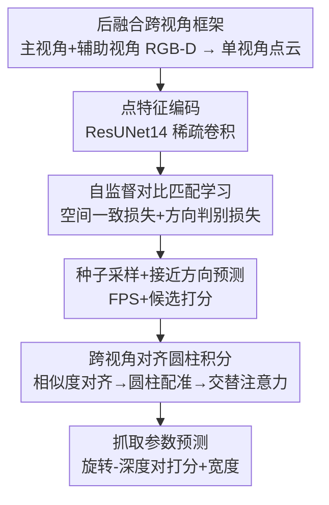

# A Cross-view Fusion Framework for Robust 6-DoF Grasp Pose Estimation

**会议**: CVPR 2026  
**论文**: [CVF Open Access](https://openaccess.thecvf.com/content/CVPR2026/html/Zhu_A_Cross-view_Fusion_Framework_for_Robust_6-DoF_Grasp_Pose_Estimation_CVPR_2026_paper.html)  
**代码**: 有（论文称已开源，链接见正文 GitHub）  
**领域**: 机器人 / 具身智能  
**关键词**: 6-DoF 抓取, 跨视角融合, 自监督对比学习, 点云配准, 圆柱坐标

## 一句话总结
针对单视角点云在「角落视角（corner view）」因遮挡丢失几何信息、导致 6-DoF 抓取不稳的问题，本文用机械臂顺手多看一眼的**辅助视角**做**后融合（post-fusion）**——用自监督对比学习把跨视角点特征拉成「空间一致 + 方向可辨」，再用一个「跨视角对齐圆柱积分」模块在抓取相关的圆柱邻域里融合两视角几何，在 GraspNet-1Billion 上 Seen 分割 AP 达 74.08（RealSense，+3.55），真实机械臂清桌成功率 96%。

## 研究背景与动机

**领域现状**：6-DoF 抓取位姿估计是机器人操作、重排、具身智能的基础任务。早期 CNN 方法只在 2D 图像上检测可抓矩形（3-DoF）；近年主流是从**单视角 RGB-D** 反投影出的场景点云上直接预测 6-DoF 位姿（GraspNet、GSNet、EconomicGrasp 等），GraspNet-1Billion 提供了大规模真实标注。

**现有痛点**：单视角观测天然有遮挡——尤其是相机斜着看场景的「角落视角」，物体大量自遮挡，关键抓取几何（接近面、对称结构）直接缺失，导致估计不鲁棒。一种补救是「边抓边重建场景」（边预测边补全几何），但需要重建标签且后处理拖慢运行；另一种是「多视角先重建完整场景再抓」（VGN、GeneGN），但完整重建耗时（论文实测 5.4 s），RVT 等靠多台标定外部相机又抬高硬件成本、降低环境灵活性。

**核心矛盾**：想用多视角补几何，又不想为此付出「先重建完整场景」的时间代价；同时，跨视角特征若不专门约束，角落视角的特征会偏离训练分布、无法和清晰视角对齐融合。也就是**几何完整性 ↔ 抓取时延**、以及**跨视角特征一致性�vs抓取方向可辨性**两对张力。

**本文目标**：(1) 用机械臂顺手获得的**一个辅助视角**补全角落视角几何，而不做完整重建；(2) 让跨视角点特征既空间一致又方向可辨，从而支撑融合；(3) 在抓取相关的局部几何上做细粒度跨视角交互。

**切入角度**：作者注意到腕装相机靠机械臂运动就能轻松换姿态多看一眼，于是放弃「先建场景再抓」的 **pre-fusion**，改成**先各自抽特征、只在抓取相关区域做后融合的 post-fusion**——既保留单视角高分辨率几何细节，又只需一个辅助视角，时延友好。

**核心 idea**：用「辅助视角 + 后融合」替代「完整重建 + pre-fusion」，并用**跨视角关联**自监督正则点特征、在**圆柱坐标的抓取邻域**里融合两视角几何，专攻角落视角的鲁棒性。

## 方法详解

### 整体框架
输入是一对跨视角 RGB-D 观测（主视角 + 辅助视角），各自反投影成单视角点云；输出是一组 6-DoF 抓取 $g=\{R,t,w\}$（旋转、平移、夹爪宽度）。整条流水线按 GraspNet 的解耦思路把旋转拆成**接近方向** $A\in\mathbb{R}^3$ 和**平面内旋转** $r$，平移由种子点 $p_s$ 加沿 $A$ 的接近深度 $d$ 决定，网络不直接回归这些连续量，而是对一组**预定义候选**打分。

整体分三段：① 用稀疏卷积 ResUNet14 对每个单视角点云抽点特征，并预测物体/可抓性、采样抓取种子、预测接近方向（脚手架）；② 训练时用**自监督对比匹配学习**，借跨视角点对（match/non-match）正则点特征，使其空间一致且方向可辨；③ 在每个种子的圆柱邻域里，用**跨视角对齐圆柱积分模块**把主、辅视角及其对齐区域的几何融成一个综合表征，再 MLP 预测各「旋转-深度」对上的抓取分数与宽度。其中 ② 是训练期的特征正则，③ 是推理期的几何融合，两者一起保证角落视角下的鲁棒预测。

### 关键设计

**1. 后融合跨视角框架：用一个辅助视角补几何，但不付完整重建的时延**

痛点是单视角角落视角遮挡丢几何，而「先重建完整场景再抓」的 pre-fusion 既要重建标签又慢（5.4 s）。本文的做法是 **post-fusion**：两个视角各自经共享 backbone 抽**高分辨率单视角点特征**，只在与抓取相关的局部区域做融合，而不去拼一个完整场景。这样既避免 pre-fusion 把多视角拍平时丢掉的几何细节，又把多视角带来的额外开销压到「只多看一个辅助视角」。消融里直接做 pre-fusion（同样给辅助视角）AP 只涨 0.32，而本文框架涨 6.41，作者归因于 pre-fusion 丢几何细节、且网络对跨视角相对变换泛化差——这正反衬出「各自抽特征 + 局部后融合」的必要性。真实实验里重建开销从多视角的 5.4 s 降到 1.2 s，相比单视角只多 1.4 s 却换来 +14% 成功率。

**2. 自监督对比匹配学习：用跨视角点对把特征拉成「空间一致 + 方向可辨」**

光做单视角监督有两个隐患：角落视角里部分可见区域的特征容易偏离训练分布；同一物体上不同抓取方向的可抓点却共享相同监督标签，特征被压得彼此雷同、方向不可分。作者用共享 backbone 编码跨视角点云，在训练时生成大量 match / non-match 点对：**match** 是两视角对应同一 3D 位置的点，**non-match** 是同一物体上抓取接近方向差异很大的点对。由此定义两个损失——空间一致损失把 match 点拉近

$$\mathcal{L}_{con}=\frac{1}{N_{mat}}\sum_{N_{mat}}\|f^{1}_{mat}-f^{2}_{mat}\|_2^2,$$

让角落视角里被遮挡区域的特征直接被清晰视角的对应点特征「监督」，从而在 3D 空间保持一致、不跑偏；方向判别损失则用带自适应间隔的 hinge 把方向不同的 non-match 点推开

$$\mathcal{L}_{dis}=\frac{1}{N_{non}}\sum_{N_{non}}\max(0,\,M-\|f^{1}_{non}-f^{2}_{non}\|_2)^2,$$

其中自适应间隔 $M=1-\cos(\theta)$，$\theta$ 是两点接近方向夹角——方向差越大、被推得越开，从而恢复方向判别力。总损失 $\mathcal{L}=\mathcal{L}_{sup}+\lambda_{self}(\mathcal{L}_{con}+\mathcal{L}_{dis})$（$\lambda_{self}=0.2$）。t-SNE 可视化显示：baseline 特征跨视角不一致；只加一致损失会一致但不可辨；两者齐上才同时做到一致与可辨。

**3. 跨视角对齐圆柱积分模块：在圆柱邻域里对齐、配准、交替注意力融合两视角几何**

种子要预测准确抓取参数，就需要其局部几何的综合表征，而单视角邻域可能被遮挡。该模块分三步把辅助视角接进来。**相似度对齐（SimAli）**：以种子坐标 $p_s$ 和接近方向 $A$ 定一个固定尺度圆柱区域，分组采样 $K$ 个邻点，用相对变换把两视角点投到对齐坐标系；考虑到深度传感器噪声 + 机械臂运动误差会累积，作者借点云配准思路用**坐标与特征联合相似度**建立跨视角对应

$$\mathbf{S}_{ij}=-\|p_i^{v_1}-p_j^{v_2}\|_2^2+\lambda_{feat}\left\langle \tfrac{f_i^{v_1}}{\|f_i^{v_1}\|_2}, \tfrac{f_j^{v_2}}{\|f_j^{v_2}\|_2}\right\rangle,$$

对满足阈值的匹配对取坐标与特征平均，得到去噪后的对齐点对 $\bar{\mathcal P}_K,\bar{\mathcal F}_K$。**圆柱坐标配准（CylReg）**：把欧氏坐标 $p=(x,y,z)$ 转成圆柱坐标 $p'=(\theta,r,d)$，其中 $\theta=\mathrm{atan2}(z,y)$、$r=\sqrt{y^2+z^2}$、$d=x$——妙处在于 $(\theta,r,d)$ **正好对应平面内旋转、抓取宽度、抓取深度三个抓取参数**，网络不必再从欧氏坐标里费劲推抓取参数，还显式强调了点云的旋转对称性；坐标经 MLP 位置编码后加回特征 $\hat f=f+\mathrm{MLP}(p')$。**交替注意力（AltAtt）**：为保细粒度几何，特征序列要长、但全局自注意力开销大，作者借 VGGT 的多帧 transformer 设计，交替用**局部自注意力**（在各单视角及其重叠区内提局部结构）和**种子交叉注意力**（把跨视角上下文聚到种子特征 $\tilde f_s$），在降算力的同时实现显式跨视角交互。

### 损失函数 / 训练策略
总损失 = 监督损失 $\mathcal{L}_{sup}$（点级物体分类交叉熵 + 可抓质量 $L_2$ 回归；种子级对预定义接近方向、夹爪宽度、旋转-深度抓取分数的 $L_2$）+ 自监督项 $\lambda_{self}(\mathcal{L}_{con}+\mathcal{L}_{dis})$。关键超参：采样 $N=15000$ 点、特征维 $C=512$、种子 $N_s=1024$、预定义接近方向 $N_A=300$、圆柱邻居 $K=8$、平面内旋转 $N_r=12$、接近深度 $N_d=4$；损失权重 $\lambda_g=10,\lambda_A=100,\lambda_w=10,\lambda_G=15,\lambda_{self}=0.2$。在 GraspNet-1Billion 训练集训 8 epoch，单卡 RTX TITAN；测试时辅助视角从同场景 256 个视角里随机采。

## 实验关键数据

### 主实验
GraspNet-1Billion（190 场景、256 视角、RealSense/Kinect 双相机），按物体熟悉度分 Seen/Similar/Novel。下表为 AP（RealSense/Kinect）：

| 方法 | Seen AP | Similar AP | Novel AP |
|------|---------|-----------|----------|
| GSNet | 65.70/61.19 | 53.75/47.39 | 23.98/19.01 |
| EconomicGrasp | 68.21/62.59 | 61.19/51.73 | 25.48/19.54 |
| ZeroGrasp | 70.53/— | 62.15/— | 26.46/— |
| **本文（2 视角）** | **74.08/64.20** | **62.38/53.41** | **27.27/21.38** |

相比 RealSense 上的 SOTA（ZeroGrasp），Seen/Similar/Novel 分别 +3.55/+0.23/+0.81；Kinect 上相比 EconomicGrasp +1.61/+1.68/+1.84，三个分割全面提升。

真实机械臂清桌（Dobot CR5 + RealSense D435，12 个未见物体，每场景重复 3 次）：

| 方法 | 成功率 SR | 重建耗时 |
|------|-----------|----------|
| GraspNet-Baseline | 77% | — |
| GSNet（单视角） | 82% | — |
| 多视角(6 views) | — | 5.4 s |
| **本文** | **96%** | **1.2 s** |

本文比 GSNet/GraspNet-Baseline 分别高 14%/19%；重建从多视角的 5.4 s 降到 1.2 s，总耗时 4.6 s（单视角 3.2 s），多花 1.4 s 换 +14% SR，效率-精度权衡良好。

### 消融实验
RealSense 测试集，逐组件累加（基于 baseline，最后两列为本行 ΔAP 与相对 baseline 的累计提升）：

| 配置 | Seen AP | ΔAP（本行） | 累计提升 |
|------|---------|-------------|----------|
| baseline | 63.80 | 0.00 | 0.00 |
| 直接 pre-fusion（给辅助视角） | 64.34 | +0.32 | +0.32 |
| + SpaCon（空间一致损失） | 67.26 | +1.97 | +2.29 |
| + DirDis（方向判别损失） | 69.36 | +1.20 | +3.49 |
| + SimAli + CylReg（对齐+圆柱配准） | 70.61 | +0.82 | +4.31 |
| + AltAtt（交替注意力） | 72.39 | +1.34 | +5.65 |
| + Auxi-view（启用辅助视角） | **74.08** | +0.76 | **+6.41** |

### 关键发现
- **后融合 ≫ 前融合**：同样给辅助视角，直接 pre-fusion 只 +0.32，而完整框架 +6.41——作者归因于 pre-fusion 丢几何细节、网络对跨视角相对变换泛化差，这是本文方法成立的核心反例。
- **自监督对比学习贡献最大**：仅用单视角观测时，SpaCon+DirDis 就在 Seen/Similar/Novel 分别带来 +5.56/+2.63/+2.28；圆柱积分模块再叠加辅助视角又 +4.72/+2.85/+1.19。
- **专治角落视角**：在 Seen 里挑 20 个 baseline AP<40 的困难「角落视角」样本，平均增益 28.11，远超整体平均增益 10.28，多数样本提升超 20 点——验证跨视角观测对遮挡场景的鲁棒性。
- **圆柱坐标的设计意义**：$(\theta,r,d)$ 与抓取参数（平面内旋转/宽度/深度）一一对应，省去网络从欧氏坐标推参数的负担并显式利用旋转对称性。

## 亮点与洞察
- **「顺手多看一眼」而非「先建完整场景」**：把腕装相机的机动性用在后融合上，只多一个辅助视角就显著去遮挡，时延远低于完整重建——这是把机器人系统约束（时延、硬件）写进算法设计的好例子。
- **用跨视角对应当免费监督信号**：match 点跨视角对齐 = 把清晰视角的特征「借」给被遮挡视角，是很巧的自监督正则；non-match 用方向夹角做自适应间隔，直接解决「同标签压垮方向判别力」的隐疾。
- **圆柱坐标对齐抓取语义**：把局部几何注册进圆柱系，让坐标轴天然对应抓取参数，可迁移到任何「输出量本身有旋转对称/极坐标语义」的位姿回归任务。
- **借 VGGT 的交替注意力压算力**：长序列保细粒度几何 + 局部自注意力/种子交叉注意力交替，是在「细粒度 vs 算力」间的实用折中。

## 局限与展望
- **依赖已知跨视角相对变换**：模块要用相对变换把两视角投到对齐系，论文称可由标定多相机或机器人运动学得到——一旦标定/里程计误差大，相似度对齐虽能去噪但上限受限（⚠️ 论文未给变换误差较大时的退化曲线）。
- **辅助视角靠运动获取**：需要机械臂能移动腕装相机再观测一次，对固定单相机、不可动平台不适用；辅助视角位置（实验里放在中心下方右侧 0.4 m）的选取策略未深入探讨。
- **测试时辅助视角随机采样**：从 256 视角随机选辅助视角，未研究「主动选最优辅助视角」是否能进一步提升——这是一个自然的主动感知延伸方向。
- **仍是候选打分范式**：旋转/深度/方向都靠预定义候选打分，候选粒度（$N_A=300,N_r=12,N_d=4$）限制了精度上限。

## 相关工作与启发
- **vs GSNet/EconomicGrasp（单视角 6-DoF）**：它们在单视角点云上预测，受角落视角遮挡困扰；本文沿用其种子+候选打分框架，但额外引入辅助视角与跨视角正则，角落视角鲁棒性显著更好。
- **vs VGN/GeneGN（多视角 pre-fusion 重建）**：它们先从多视角重建完整场景再抓，慢且丢局部细节；本文用后融合只保留抓取相关圆柱区域的细粒度几何，时延从 5.4 s 降到 1.2 s。
- **vs 边抓边重建（ZeroGrasp 等）**：那类方法需重建标签 + 后处理补全几何；本文不重建场景，用自监督跨视角对应直接正则特征，省标签也省后处理。
- **vs 点云配准（DCP/Predator 类）**：借用其跨部分视角建立对应的思想做 SimAli，但目标不是配准位姿，而是去噪并融合抓取相关几何。

## 评分
- 新颖性: ⭐⭐⭐⭐ 「辅助视角后融合 + 跨视角自监督正则 + 圆柱坐标对齐抓取语义」组合新颖且动机清晰，单点技术多为已有思想的巧妙再组合。
- 实验充分度: ⭐⭐⭐⭐ GraspNet-1Billion 全分割 + 真机清桌 + 逐组件消融 + 角落视角专项分析 + t-SNE 可视化，较完整；缺变换误差敏感性曲线。
- 写作质量: ⭐⭐⭐⭐ 动机—方法—消融逻辑顺，图 2 流水线清晰；部分公式排版（缓存里）较乱但原文应正常。
- 价值: ⭐⭐⭐⭐ 真机 96% 成功率 + 时延友好，对可动平台抓取系统有直接工程价值。

<!-- RELATED:START -->

## 相关论文

- [\[CVPR 2026\] GraspGen-X: Cross-Embodiment 6-DOF Diffusion-based Grasping](graspgen-x_cross-embodiment_6-dof_diffusion-based_grasping.md)
- [\[CVPR 2026\] RoboTAG: End-to-end Robot Pose Estimation via Topological Alignment Graph](robotag_end-to-end_robot_pose_estimation_via_topological_alignment_graph.md)
- [\[ECCV 2024\] An Economic Framework for 6-DoF Grasp Detection](../../ECCV2024/robotics/an_economic_framework_for_6-dof_grasp_detection.md)
- [\[CVPR 2026\] Learning to Act Robustly with View-Invariant Latent Actions](learning_to_act_robustly_with_view-invariant_latent_actions.md)
- [\[CVPR 2026\] HQC-NBV: A Hybrid Quantum-Classical View Planning Approach](hqc-nbv_a_hybrid_quantum-classical_view_planning_approach.md)

<!-- RELATED:END -->
