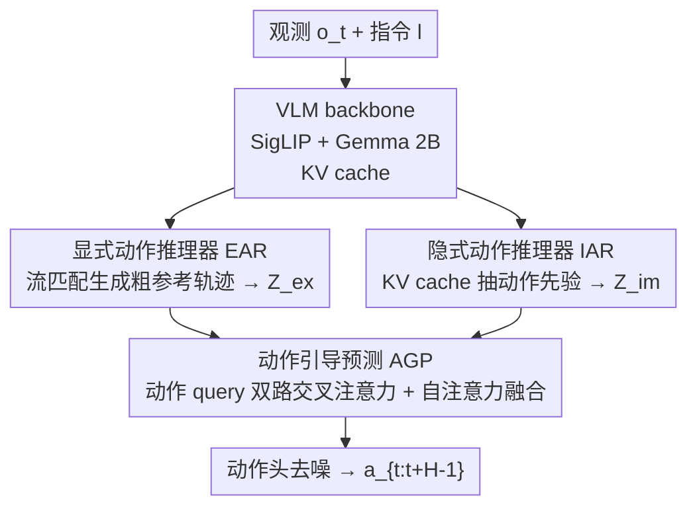

# ACoT-VLA: Action Chain-of-Thought for Vision-Language-Action Models

**会议**: CVPR 2026  
**论文**: [CVF Open Access](https://openaccess.thecvf.com/content/CVPR2026/html/Zhong_ACoT-VLA_Action_Chain-of-Thought_for_Vision-Language-Action_Models_CVPR_2026_paper.html)  
**代码**: https://github.com/AgibotTech/ACoT-VLA  
**领域**: 机器人 / 具身智能  
**关键词**: VLA, 动作思维链, 机器人操作, 流匹配, 显式/隐式推理

## 一句话总结
把 VLA 的"中间推理"从语言子任务或目标图像换成**动作空间里的粗粒度参考动作序列**（Action Chain-of-Thought），用一个显式动作推理器生成参考轨迹、一个隐式动作推理器从 VLM 的 KV cache 里抽动作先验，两路共同给动作头做条件，在 LIBERO/LIBERO-Plus/VLABench 三个仿真基准和真机上都刷到 SOTA。

## 研究背景与动机

**领域现状**：主流 VLA（Vision-Language-Action）模型用预训练 VLM 把图像+指令编码成隐表征，再让动作解码器直接吐动作。为了让这个"输入→动作"映射更准，近两年出现两类"加中间推理"的做法：一类是**语言 CoT**（先预测子任务，如 π0.5、ThinkAct），一类是**视觉 CoT / 世界模型**（先合成目标图像或预测未来观测，如 CoT-VLA、WorldVLA、DreamVLA）。

**现有痛点**：不管是语言子任务还是合成的目标图，这些中间产物都活在**视觉-语言（输入）空间**里，和最终要执行的**低层动作（输出）空间**存在异质性。VLM backbone 是在 web 级语料上为"语义对齐、问答"预训练的，它的表征擅长语言理解，**不擅长物理动力学**；世界模型预测的也是视觉状态。于是这些中间推理只能提供"间接、抽象"的指引，没法把精确动作执行所需的细粒度运动信息完整传给动作头。

**核心矛盾**：作者把它命名为 **semantic-kinematic gap（语义-运动学鸿沟）**——高层抽象输入与低层可执行电机指令之间存在根本性断裂。要弥合这个鸿沟，指引信号必须是**运动学上自洽的**，而不是纯语义/纯视觉的。

**本文目标 + 核心 idea**：与其在输入空间里绕弯子，不如让"思考"过程本身就发生在动作空间。作者提出 **Action Chain-of-Thought (ACoT)**：把 CoT 的"thought"重新定义为一串**显式的、运动学接地的动作意图（粗粒度参考动作序列）**，直接给策略喂运动线索。难点随之而来：怎么从原始多模态输入里稳健、高效地合成这种高维运动线索？作者的回答是动作信息有显式（可观测轨迹）和隐式（"伸手""抓取"这类语言/视觉里暗含的动作分布）两种形态，于是设计两个互补模块分别去捞，再融合进动作头。

## 方法详解

### 整体框架

ACoT-VLA 建在 π0.5 之上，输入是当前视觉观测 $o_t$ 和语言指令 $l$，输出是动作序列 $a_{t:t+H-1}$。所有模块共享同一个 VLM backbone（SigLIP 视觉编码器 + Gemma 2B，$N=18$ 层）抽出的 key-value cache，整条 pipeline 由三个部件串成：

1. **显式动作推理器 EAR**：一个轻量 Transformer，吃带噪参考动作序列，借 VLM 的 KV cache 做交叉注意力，用流匹配生成一条**粗粒度参考轨迹** $a^{ref}$，再投影成显式动作引导 $Z^{ex}$。这是"在动作空间里先打个草稿"。
2. **隐式动作推理器 IAR**：对 VLM 每一层的 KV cache 用可学习 query 做交叉注意力，把藏在视觉-语言表征里的动作语义（affordance、动作倾向）抽出来，聚合成隐式动作引导 $Z^{im}$。这是"把 VLM 里暗含的动作分布榨出来"。
3. **动作引导预测 AGP**：把带噪动作段当作 query，分别和 $Z^{ex}$、$Z^{im}$ 做双路交叉注意力，再用自注意力融合，喂给动作头去噪，产出最终可执行动作。

这里的关键概念是 ACoT 把传统 VLA 的引导信号 $g$ 从语言级 $g_{lang}$、视觉级 $g_{vis}$ 扩展出第三类——**动作级 $g_{action}$**，并进一步拆成显式 $g^{ex}_{action}$（参考动作序列）和隐式 $g^{im}_{action}$（上下文里暗含的动作分布），分别由 EAR、IAR 来产生。

### 关键设计

**1. 显式动作推理器 EAR：在动作空间里先生成一条"草稿轨迹"当显式引导**

痛点是：语言子任务、目标图都隔着输入空间，给动作头的引导是间接的。EAR 的做法是直接在动作空间里先生成一条**粗粒度参考动作序列**当显式线索。它实现成一个轻量 Transformer（同样 $N=18$ 层），吃一段带噪参考动作 $\tilde a_{t:t+H^{ref}-1}$，先嵌入成初始隐表征 $h^{ref}_0$；每一层做自注意力捕捉动作序列内的时序依赖，同时和**对应 VLM 层**的 KV cache 做交叉注意力把多模态上下文先验注进来：

$$\tilde h^{ref}_i = \text{Self-Attn}(h^{ref}_{i-1}) + \text{CrossAttn}(h^{ref}_{i-1}, K^{VLM}_i, V^{VLM}_i)$$

再经残差式 FFN 更新 $h^{ref}_i = h^{ref}_{i-1} + \text{FFN}(\tilde h^{ref}_i)$。整个 EAR 用**流匹配**训练，学到一个动作轨迹分布，输出去噪后的参考序列 $a^{ref}$，最后 MLP 投影成 $Z^{ex}$。作者点明这本质上是生成模型里 **self-conditioning** 的"动作空间版"——先给模型一个动作先验估计再去精修，已知能显著提升采样质量。为什么有效：参考轨迹给"观测→动作"的映射注入了强归纳偏置，直接压低了映射的歧义性（消融里单加 EAR 平均成功率 96.9%→98.3%）。

**2. 隐式动作推理器 IAR：把 VLM 的 KV cache 里暗含的动作先验榨出来**

光有显式轨迹还不够——VLM 的多模态隐空间里其实还藏着大量隐式动作线索（视觉 affordance、"reach""grasp"这类动作语义），扔掉可惜。IAR 直接在 VLM 的 KV cache 上操作：对每一层 $i$，初始化一个可学习矩阵 $Q_i\in\mathbb{R}^{M\times d}$（$M$ 是超参，论文里 $M=1$）。考虑到 KV cache 冗余大、算力贵，先把 key-value 下采样到低维 $d'\ll d$（$d'=128$）：

$$Q_i' = Q_i W_Q^{(i)},\quad K_i' = K_i^{VLM} W_K^{(i)},\quad V_i' = V_i^{VLM} W_V^{(i)}$$

再做交叉注意力抽动作相关信息，经平均池化 + MLP 投影，得到第 $i$ 层的隐式动作语义 $z^{im}_i = \text{MLP}(\text{Pool}(\text{CrossAttn}(Q_i', K_i', V_i')))$；跨层聚合成隐式引导 $Z^{im}$。这一路和 EAR 互补：EAR 给的是运动学线索（怎么动），IAR 给的是潜在动作倾向（可行动作的分布），让策略更贴近任务一致的行为模式。消融里单加 IAR 也有 96.9%→98.1%。一个有意思的发现是"先下采样再聚合"的策略最好（见 Table 6），说明 VLM 特征对动作预测确实有冗余。

**3. 动作引导预测 AGP：用动作 query 双路检索显式/隐式先验再融合去噪**

有了 $Z^{ex}$ 和 $Z^{im}$ 两路引导，怎么用？不同于以往把带噪动作嵌入直接塞进动作头，AGP 把它当作**动作 query** $Q_{action}$，分别去两路先验里"检索"互补信息——做两次交叉注意力：

$$S^{ex} = \text{CrossAttn}(Q_{action}, Z^{ex}, Z^{ex}),\quad S^{im} = \text{CrossAttn}(Q_{action}, Z^{im}, Z^{im})$$

虽然两者都编码动作信息，但侧重不同（显式偏运动学线索，隐式偏潜在动作倾向），所以再把它们拼起来过一个自注意力融合块整合成统一表征 $\bar h = \text{Self-Attn}([S^{ex};S^{im}])$，喂给动作头 $\pi^{head}_\theta$ 去噪出 $a_{t:t+H-1}$。这样设计的好处是显/隐两类引导被动作 query 自适应地"按需取用"再融合，而不是简单相加。

### 损失函数 / 训练策略

整个框架在标准**流匹配 MSE** 目标下训练，loss 由两部分组成——EAR（$\pi^{ref}_\theta$）和动作头（$\pi^{head}_\theta$）各自的流匹配 MSE：

$$\mathcal{L}_{total} = \lambda_1 \mathcal{L}_{\pi^{ref}_\theta} + \lambda_2 \mathcal{L}_{\pi^{head}_\theta}$$

论文取 $\lambda_1=\lambda_2=0.5$。

一个关键 trick 是 **Teacher Forcing 稳定化**：训练早期 EAR（$\pi^{ref}_\theta$）的输出不稳定，如果直接拿它的预测算 $Z^{ex}$，会干扰动作头的优化。所以训练时 $Z^{ex}$ 直接用**真值参考轨迹**算（teacher forcing），避免误差传导；推理时再切回**全自条件模式**，由 EAR 自主生成参考动作来引导动作头。训练用 8×H100、bf16，cosine 学习率（peak 5e-5，warm-up 10K），AdamW + EMA(0.999)；推理在单张 RTX 4090。默认参考动作 horizon $H^{ref}=15$、策略输出 horizon $H=10$，action shift 分别为 2 和 1（shift 指相对专家示范的时间间隔，1=帧对齐，2=跳一帧）。

## 实验关键数据

### 主实验

LIBERO 四个 track（Spatial / Object / Goal / Long），每 track 10 任务、每任务 50 次试验共 2000 rollout，指标为平均成功率（%）。Ours† 表示训练时冻结 LLM backbone。

| 方法 | 引导类型 | Spatial | Object | Goal | Long | 平均 |
|------|---------|---------|--------|------|------|------|
| Diffusion Policy | – | 78.3 | 92.5 | 68.3 | 50.5 | 72.4 |
| CoT-VLA | 视觉 | 87.5 | 91.6 | 87.6 | 69.0 | 81.1 |
| π0.5（baseline） | 语言 | 98.8 | 98.2 | 98.0 | 92.4 | 96.9 |
| VLA-Adapter | 语言 | 97.8 | 99.2 | 97.2 | 95.0 | 97.3 |
| **Ours†**（冻结 LLM） | **动作** | **99.4** | **99.6** | 98.8 | 96.0 | **98.5** |
| **Ours** | **动作** | 98.6 | 99.0 | **99.4** | **97.0** | **98.5** |

相比此前 SOTA 的 π0.5，平均 +1.6%；在最难的 **LIBERO-Long**（长程、误差容忍度低）上 92.4→97.0（+4.6），印证"动作级中间推理对长程操作鲁棒性帮助最大"。

LIBERO-Plus（7 个分布偏移维度、10030 episode）下两种协议都领先：

| 协议 | 方法 | Camera | Robot | Language | Avg. |
|------|------|--------|-------|----------|------|
| Zero-Shot | π*0.5 | 75.8 | 79.4 | 83.3 | 85.7 |
| Zero-Shot | **Ours** | 72.6 | **82.6** | **87.5** | **86.6** |
| SFT | π†0.5 | 70.3 | 41.7 | 81.1 | 75.7 |
| SFT | **Ours** | **96.6** | **70.4** | 79.7 | **88.0** |

零样本下对机器人初始状态扰动（+3.2%）、语言变化（+4.2%）尤其鲁棒。VLABench 上（IS/PS 双指标）Ours† 也拿到 IS 63.5 / PS 47.4 全场最佳，未见纹理 track 上 IS +12.6、PS +7.2。

### 消融实验

模块消融（LIBERO，baseline=π0.5）：

| 配置 | EAR | IAR | 平均成功率 | 说明 |
|------|-----|-----|-----------|------|
| Baseline | | | 96.9 | π0.5 |
| #1 | ✓ | | 98.3 | 单加 EAR，+1.4 |
| #2 | | ✓ | 98.1 | 单加 IAR，+1.2 |
| #3 | ✓ | ✓ | **98.5** | 两者互补，最高 |

IAR 内部 KV-cache 交互策略对比（Table 6）：

| 策略 | 平均成功率 | 说明 |
|------|-----------|------|
| Baseline | 96.9 | – |
| Query（直接对原 KV 做 query） | 97.0 | 增益最小 |
| Attention Pooling（池化后 query） | 97.3 | 中等 |
| Downsample（先降维再聚合） | **98.1** | 最佳 |

### 关键发现
- **EAR 和 IAR 真互补**：单加各 +1.2~1.4，合起来 +1.6，说明显式轨迹线索和隐式动作先验捞的是动作的不同侧面，不是冗余。
- **IAR 里"先下采样再聚合"最优**（98.1 > 97.3 > 97.0），反过来说明 VLM 的 KV cache 对动作预测存在明显冗余，直接用反而被噪声拖累。
- **参考动作参数较宽容**（Table 5）：多种 action shift / horizon 组合都稳超 baseline，其中"较短 horizon + 适中 shift"增益相对更大，说明 ACoT 的收益主要来自"有动作引导"这件事本身，而非精调参数。
- **真机有效且跨本体**：AgiBot G1 上三任务（擦污渍 / 倒水 / 开放集抓取）平均成功率 66.7%，超 π0.5（61.0）和 π0（33.8）；换到 AgileX 平台同样改善，说明方法跨机器人本体可迁移。

## 亮点与洞察
- **"在动作空间里想"这个 reframe 很干净**：把 CoT 的中间产物从语言/视觉换成"粗动作序列"，一句话点破了 semantic-kinematic gap，且天然同质（引导和输出都是动作）。这种"换中间表征的空间"的思路可迁移到任何带中间推理的生成/控制任务。
- **EAR = 动作空间的 self-conditioning**：把扩散里"先给个粗估计再精修"搬到动作轨迹上，理论上有依据、实现上轻量（一个小 Transformer），是个可复用的 trick。
- **IAR 直接薅 VLM 的 KV cache**：不额外造模块去"理解"动作，而是承认动作先验本就藏在 VLM 表征里、用可学习 query 去抽——还顺手发现"先下采样去冗余"反而更好，对所有想复用大模型内部表征的工作有借鉴意义。
- **Teacher forcing 稳定化**是个务实的小设计：训练用真值参考轨迹避免 EAR 早期噪声污染动作头，推理切自条件，干净地解决了"自生成引导不稳定"的工程难题。

## 局限与展望
- **参考轨迹是"粗粒度"的**：EAR 生成的是 coarse trajectory，对需要极精细接触动力学的任务（如柔性体、高精度装配）是否够用，论文没深入；倒水这类接触丰富任务真机成功率 66.7% 也说明还有空间。⚠️
- **多了两个模块和一次额外流匹配生成**，推理时 EAR 要自条件生成参考动作，相比纯 π0.5 的额外开销/延迟论文没给量化数据，部署成本待评估。
- **强依赖底座 π0.5 + Gemma 2B**：所有结论都在这个配置下得到，换更小/更大 backbone 是否保持互补增益未验证。
- **隐式引导 IAR 的 $M=1$**：可学习 query 行数只取 1，这么强的压缩为何不掉点、放大 $M$ 会怎样，缺更系统的分析。

## 相关工作与启发
- **vs 语言 CoT（π0.5 / ThinkAct / π0-FAST）**：他们预测子任务文本当中间推理，本文换成动作序列。区别在引导信号所在空间——语言级 $g_{lang}$ 隔着语义鸿沟，动作级 $g_{action}$ 同质直达；LIBERO 上本文全面超过 π0.5（+1.6 平均、Long +4.6）。
- **vs 视觉 CoT / 世界模型（CoT-VLA / WorldVLA / DreamVLA）**：他们合成目标图/预测未来视觉状态来引导，引导仍系于视觉表征。本文认为视觉引导对动作执行同样间接，直接在动作空间给线索更接地；CoT-VLA 平均 81.1 远低于本文 98.5。
- **vs 纯扩散/流匹配策略（Diffusion Policy / π0）**：他们直接"观测→动作"无中间推理，本文在中间插了显式参考轨迹 + 隐式先验两路 ACoT 引导，本质是给映射加强归纳偏置降歧义。

## 评分
- 新颖性: ⭐⭐⭐⭐⭐ 首个把 CoT 中间推理放进动作空间的 VLA 范式，概念清晰、定位准。
- 实验充分度: ⭐⭐⭐⭐⭐ 三仿真基准 + 真机 + 跨本体 + 完整模块/参数/策略消融，覆盖很全。
- 写作质量: ⭐⭐⭐⭐ 动机推导（semantic-kinematic gap）和显/隐拆分讲得清楚，部分公式排版（缓存里）较乱但逻辑完整。
- 价值: ⭐⭐⭐⭐⭐ 多基准 SOTA + 真机验证 + 开源，对 VLA 社区是一个干净可复用的新引导范式。

<!-- RELATED:START -->

## 相关论文

- [\[CVPR 2026\] TRM-VLA: Temporal-Aware Chain-of-Thought Reasoning and Memorization for Vision-Language-Action Models](trm-vla_temporal-aware_chain-of-thought_reasoning_and_memorization_for_vision-la.md)
- [\[CVPR 2026\] Unifying Perception and Action: A Hybrid-Modality Pipeline with Implicit Visual Chain-of-Thought for Robotic Action Generation (VITA)](unifying_perception_and_action_a_hybrid-modality_pipeline_with_implicit_visual_c.md)
- [\[CVPR 2025\] CoT-VLA: Visual Chain-of-Thought Reasoning for Vision-Language-Action Models](../../CVPR2025/robotics/cot-vla_visual_chain-of-thought_reasoning_for_vision-language-action_models.md)
- [\[CVPR 2026\] AT-VLA: Adaptive Tactile Injection for Enhanced Feedback Reaction in Vision-Language-Action Models](at-vla_adaptive_tactile_injection_for_enhanced_feedback_reaction_in_vision-langu.md)
- [\[CVPR 2026\] MoEActok: A MoE-based Action Tokenizer for Vision-Language-Action Models](moeactok_a_moe-based_action_tokenizer_for_vision-language-action_models.md)

<!-- RELATED:END -->
