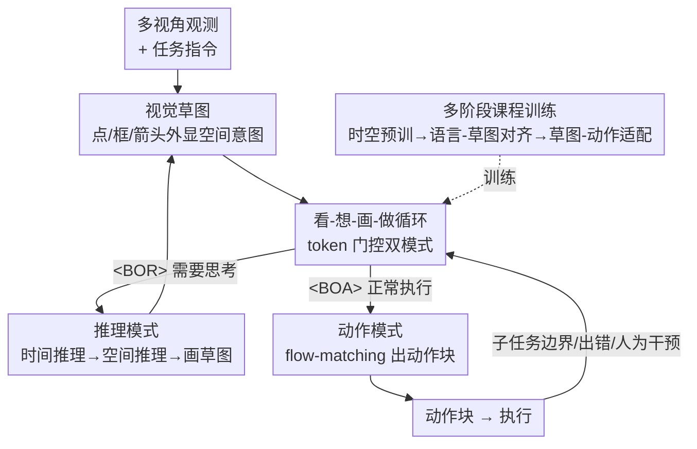

# Action-Sketcher: From Reasoning to Action via Visual Sketches for Robotic Manipulation

**会议**: CVPR 2026  
**论文**: [CVF Open Access](https://openaccess.thecvf.com/content/CVPR2026/html/Tan_Action-Sketcher_From_Reasoning_to_Action_via_Visual_Sketches_for_Robotic_CVPR_2026_paper.html)  
**代码**: [项目主页](https://action-sketcher.github.io)（代码状态待确认）  
**领域**: 机器人 / 具身智能  
**关键词**: VLA、视觉草图、长程操作、人在回路、思考-行动

## 一句话总结
本文提出 Action-Sketcher：让 VLA 模型在"看-想-画-做"（See-Think-Sketch-Act）循环里，先把空间意图画成一张由点、框、箭头组成的**视觉草图**（Visual Sketch）作为人可读、可改的中间表示，再据此生成动作；在长程、杂乱、指代模糊的真实操作任务上显著超过 π0.5、OpenVLA-OFT 等强基线，且草图允许人在回路里直接修改来进一步把成功率拉高。

## 研究背景与动机

**领域现状**：当前主流的视觉-语言-动作（VLA）模型把多视角观测和语言指令直接映射成动作。端到端策略（OpenVLA、Octo、扩散策略）短程表现强；分层 VLA 用"规划器+控制器"试图改善长程行为；近期还出现"先想后做"（think-before-act）的路线，如 EO-1、OneTwoVLA、ThinkAct，在动作前插入显式推理。

**现有痛点**：这些方法有一个共同的"意图被藏起来"的问题。① 端到端策略把计划意图压进潜在表示，导致任务难以分解、动作缺乏因果解释；② 分层 VLA 的推理往往是瞬时、局部的，没有对全局意图（人的目标在变、错误在累积、历史状态）的持续建模；③ 即便是"先想后做"，如果中间证据**只是文本**，那么"在哪接触、往哪靠近、物体之间什么关系"这些空间指代仍然是隐式的——人无法核验，控制器也拿不到低熵的几何引导。

**核心矛盾**：长程操作真正难在两处。空间上，自然语言指令天生有歧义（多个杯子时"把茶倒进杯子"指哪个？）或欠定（"把书放在杯子左边"到底放哪个精确位姿？），纯文本线索无法把语言关系翻译成可执行约束；时间上，人在回路的协同很弱，可解释的计划产物很少暴露出来，小错误就会悄悄传播、累积成失败。

**本文目标**：造一个让"意图既可见、又可操作"的中间接口，同时解决空间指代消歧（where/how to act）和时间上的可纠错性（早发现、早恢复）。

**切入角度**：作者主张把空间意图**外显**到"语言→控制"的接口上——不要让它停留在文本或潜在向量里，而是直接画在机器人当前视图上。人能看懂、能批准、能改的草图，本质上是高层推理和底层控制之间的一份"可核验的契约"。

**核心 idea**：用一张由点/框/箭头构成的**视觉草图**替代纯文本中间表示来锚定空间意图，并用一个 token 门控的"看-想-画-做"循环把推理与动作自适应地交织起来。

## 方法详解

### 整体框架

Action-Sketcher 把长程操作建模成一个在**混合输出空间**（离散 token + 连续动作）上的序列建模问题，学习一个策略 $\pi_\theta$，让 agent 在每个时刻自主决定该"推理"还是该"动作"。输入上下文是一串 token：多视角图像（左腕、右腕、底座相机）、任务指令、已完成子任务的历史、当前子任务、以及视觉草图图像。模型以 π0 为骨干，在单一模型内同时自回归生成文本（推理链、子任务计划、草图的结构化描述）和用 flow-matching 预测连续动作块。

整个系统跑一个由特殊 token 门控的双模式事件驱动循环：

- **推理模式（Reasoning Mode）**：当模型判断需要思考时（完成一个子任务、遇到错误、或收到人为干预），它生成 `<BOR>`（begin-of-reasoning），然后做**时间推理**（结合总指令与历史推断下一个该做的子任务）和**空间推理**（针对该子任务，分析场景里物体的布局和关系，产出点/框/箭头的文本形式），以 `<EOR>` 结束。文本草图随后被渲染到当前参考视图上，变成图像形式的视觉草图，更新进上下文。
- **动作模式（Action Mode）**：当模型认为不必再推理（如场景一致、子任务正常执行中），它生成 `<BOA>`（begin-of-action），触发动作专家用 flow-matching 生成动作块。

初始时已完成子任务、当前子任务、草图图像都是空的，所以模型必须从推理模式起步把这些字段填上，之后才能在两种模式间流畅切换，兼顾精度与实时性。

### 关键设计

**1. 视觉草图：把空间意图外显成点、框、箭头的可核验契约**

痛点直接对准"纯文本中间表示讲不清空间"。视觉草图在每一步 $t$ 是一个稀疏几何原语元组 $S_t = (B_t, P_t, A_t)$，全部定义在机器人 ego-view 图像平面上（用自我视角作为跨平台通用参考系）：

- **框 $B_t$**：物体级 affordance 线索，每个框 $b_i=(x_{1,i},y_{1,i},x_{2,i},y_{2,i})$ 用左上/右下像素坐标圈出可操作区域。它在杂乱场景里消歧物体指代——"拿离杯子最近的那个"可以直接用一个框锁定目标（如苹果），抽掉外观细节但保留尺度和位置。
- **点 $P_t$**：关键点 $p_i=(x_i,y_i)$ 指定精确交互/参考位置，可表示部件级 affordance、运动路标或几何参考。以"倒茶"为例，茶壶嘴尖 $p_{spout}$、杯心 $p_{cup}$、把手稳定接触点 $p_{handle}$——抬壶时盯 $p_{handle}$ 作抓取锚，移动时用 $(p_{spout}, p_{cup})$ 作对齐参考。
- **箭头 $A_t$**：连接静态关键点与实际动作的动态环节。作者把复杂的 SE(3) 操作**因式分解**成投影到 2D 平面的平移轨迹和旋转线索，$A_t = A^{trans}_t \cup A^{rot}_t$。平移箭头 $a^{trans}_i=(p^{start}_i, p^{end}_i)$ 是锚在关键点上的有序序列（如 $p_{spout}\to p_{cup}$ 引导壶嘴对准杯心）；旋转箭头 $a^{rot}_i=(p_i, \text{axis}\in\{x,y,z\}, \text{dir}\in\{\circlearrowright,\circlearrowleft\})$ 指定绕某规范轴的转动（如绕 ego-view x 轴转出倒茶所需的倾斜）。

为什么有效：草图是**持续的、人可编辑的、一次只画一个子任务**的——因为不必把整条轨迹都编码进去，它反而能表达比粗糙轨迹更丰富精确的动作原语（接触关键点、旋转箭头、放置线索），既给控制器低熵几何引导，又给人留下核验/修改的入口。

**2. 看-想-画-做循环：token 门控的推理/动作双模式自适应切换**

痛点是"瞬时推理 vs 实时执行"难以兼得，且小错误无处被拦截。本文不固定推理频率，而是用 `<BOR>`/`<BOA>` 这对门控 token，让模型**自己**根据观测状态、预测风险、用户反馈在两个模式间转换：需要全局重规划时 `<BOR>` 触发一次完整的时间+空间推理并刷新草图，常规执行时 `<BOA>` 触发动作专家以 flow-matching 直接出动作块，无需重复推理。

为什么有效：这种事件驱动设计让"慎重思考"只在真正需要的时刻（子任务边界、场景变化、出错、人为介入）发生，其余时间保持低延迟动作预测——既支持反应式纠正和人机交互，又不牺牲实时性。而且草图渲染回视图、再喂回上下文，使推理-动作形成闭环：人或模型一旦发现草图错了，可以在动作执行前就拦截、改正，避免错误传播。

**3. 多阶段课程训练 + 模式均衡采样 + 草图扰动增强：让单模型同时学会推理、画图、动作和切换**

痛点是一个模型要同时掌握时空推理、语言到草图的精确绑定、草图到动作的鲁棒映射、以及何时切换模式——直接联合训练很难收敛。作者用三阶段课程逐步堆叠能力：

- **Stage 1 基础时空学习**：用 340 万空间样本（视觉 grounding 出框、空间 pointing 出关键点、场景理解、VQA）和 87 万时间序列（EgoPlan、ShareRobot、AgiBot-World），并用 GPT-4o 给其中 20% 标上文本推理，打底通用时空推理与指令跟随。
- **Stage 2 推理到草图增强**：在 2.1 万样本（含真实采集的 2.6k 条 2–16 子任务长程 episode + 从 LIBERO/RoboTwin 2.0 标注的 1.7k 条轨迹）上，训练模型完整跑通"时间推理→空间推理→生成下一子任务及其文本草图"。
- **Stage 3 草图到动作 + 模式适配**：联合训练动作策略和模式切换。一方面教模型在子任务边界/场景变化时该出 `<BOR>`、常规执行时出 `<BOA>`；另一方面用带动作标签的数据训练动作专家。

这里有两个关键加固。其一是**草图扰动增强**：为模拟推理时不可避免的草图误差，对框做随机扰动但保持 IoU≥0.8，对点在小半径 $c$ 圆内重采样、箭头随点调整，使动作专家对小误差鲁棒。其二是**模式均衡采样**：动作模式步数远多于推理模式，为防止模型偏向更频繁的 `<BOA>`，按

$$P(d) = \begin{cases} \dfrac{1}{2|D_R|}, & d \in D_R \\[6pt] \dfrac{1}{2|D_A|}, & d \in D_A \end{cases}$$

让推理样本集 $D_R$ 和动作样本集 $D_A$ 各占一半采样质量，直接消除数据失衡导致的模式偏置。消融显示去掉 Stage 3 会直接 0% 成功，说明这一阶段是把"草图翻译成动作"的命门。

## 实验关键数据

### 主实验

LIBERO 标准基准上 Action-Sketcher 平均成功率与最强基线持平（96.9% vs OpenVLA-OFT 97.1%），但在最考验长程规划的 **Long** 子集上明显领先：

| 数据集 / 子集 | 指标 | 本文 | π0.5 | OpenVLA-OFT |
|---------------|------|------|------|-------------|
| LIBERO-Long | 成功率 % | **96.0** | 92.4 | 94.5 |
| LIBERO-Object | 成功率 % | **99.6** | 98.2 | 98.4 |
| LIBERO-Avg | 成功率 % | 96.9 | 96.8 | 97.1 |

真正拉开差距的是更难的长程/强空间任务（RoboTwin 2.0 仿真 + 真实双臂平台），本文在所有任务上一致大幅领先：

| 任务 | π0 | π0.5 | OpenVLA-OFT | 本文 |
|------|----|----|-------------|------|
| Stack Blocks（仿真）| 4.0 | 7.0 | 12.4 | **34.5** |
| Place A2B Left（仿真）| 12.0 | 11.0 | 21.0 | **43.0** |
| Tidy Table（真实）| 23.0 | 31.2 | 36.0 | **52.0** |
| Pick & Place（真实）| 30.0 | 34.5 | 52.5 | **67.0** |
| Pour Tea（真实）| 16.0 | 20.0 | 15.0 | **27.6** |

这印证了核心假设：当计划很长、空间目标复杂时，把意图隐式塞进潜在空间是不够的；显式的看-想-画-做流程让 agent 能稳健分解问题、把动作锚在可解释的空间表示上。

### 人在回路（RQ2）

失败分析显示 66% 的失败来自推理模式，其中绝大多数（占全部失败 61%）出在空间推理——即草图生成本身，是首要瓶颈。但因为草图是显式可读接口，恰好是人介入的天然入口。允许人暂停并对草图做小修改后，最难的真实任务成功率几近翻倍：

| 真实任务 | 原始 % | + 人在回路 % | 提升 |
|----------|--------|--------------|------|
| Tidy Table | 52.0 | 75.0 | +23.0 |
| Pour Tea | 27.6 | 44.0 | +16.4 |
| Pick & Place | 67.0 | 85.5 | +18.5 |

### 消融实验

在代表性任务 Stack Blocks（仿真成功率）/ Tidy Table（真实子任务完成度）上：

| 配置 | 成功率 % | 完成度 % | 说明 |
|------|---------|---------|------|
| Action-Sketcher（完整）| 34.5 | 52.0 | 完整模型 |
| w/o 空间推理 | 13.8 | 23.9 | 去掉空间推理，掉到约 1/3 |
| w/o 视觉草图 | 9.8 | 15.0 | 完全去草图，跌至最低 |
| w/o 框 | 31.2 | 49.0 | 去框，消歧能力下降 |
| w/o 关键点 | 26.6 | 43.6 | 去关键点，掉最多——坐标 grounding 最关键 |
| w/o 箭头 | 29.9 | 48.2 | 去箭头，动态引导受损 |
| w/o Stage 1 | 29.2 | 39.7 | 跳过时空预训练，中等下降 |
| w/o Stage 2 | 18.1 | 21.9 | 缺推理微调，草图不连贯，急剧下降 |
| w/o Stage 3 | 0.0 | 0.0 | 去掉最终适配，完全失败 |

### 关键发现
- **视觉草图是命门而非装饰**：完全去掉草图，成功率从 34.5% 跌到 9.8%，证明它是把语言落地成可执行动作的根本桥梁，不是辅助可视化。
- **三种原语里关键点最关键**：去掉关键点掉到 26.6%（降幅最大），因为它提供精确坐标 grounding；框和箭头分别负责消歧和动态引导，去掉也都明显伤害可靠性。
- **Stage 3 不可或缺**：去掉它直接 0%，说明"把草图翻译成动作"的适配阶段是整个系统能否落地的瓶颈；Stage 2 缺失会让草图不连贯（→18.1%）。
- **错误集中在草图生成**：61% 的失败源于空间推理阶段的草图不准，但这恰恰是显式接口的优势——人改一改草图就能把最难任务推到接近满分。

## 亮点与洞察
- **"可核验契约"这个定位很巧**：把中间表示从潜在向量/纯文本换成画在视图上的点框箭头，一举拿到三个好处——消歧、可监督（标注/自动标注简单）、可调试（人能读懂改正）。这是别的 think-before-act 方法（计划压进不可编辑潜变量）拿不到的。
- **SE(3) 操作因式分解成 2D 平移+旋转箭头**：把复杂 6 自由度运动投影成图像平面上的平移箭头和绕规范轴的旋转箭头，既保留了关键运动语义，又让草图始终停留在 2D 视图上、可渲染可编辑，这套表示方式可迁移到任何需要把动作意图画出来的具身任务。
- **token 门控的双模式自适应切换**：用 `<BOR>`/`<BOA>` 让模型自己决定何时慢思考、何时快执行，配合模式均衡采样防偏置，是把"推理频率"做成可学习行为而非固定超参的实用思路。
- **一次只画一个子任务**：不编码整条轨迹反而让草图能表达更精细的原语（接触点、旋转），这个"局部优于全局"的取舍值得借鉴。

## 局限与展望
- 作者承认草图生成（空间推理）是最大瓶颈：61% 失败源于此，目前需要靠人在回路兜底，自主空间 grounding 的精度还不够。
- ⚠️ 文中 RoboTwin / 真实任务的绝对成功率仍偏低（Stack Blocks 34.5%、Pour Tea 27.6%），说明在高难长程任务上离实用还有距离，横向"大幅领先"是相对基线而言，不应理解为已解决任务。
- 草图扰动增强用固定的 IoU≥0.8、小半径 $c$ 等启发式来模拟推理误差，但真实推理误差的分布是否被这套增强覆盖、$c$ 如何取值，文中未深入分析。
- 自我视角图像平面作为唯一参考系，对严重遮挡或需要俯视全局布局的任务可能不利；2D 投影对纯平面外（如沿相机光轴深度方向）的精细动作表达能力有限。
- 改进方向：让模型对自己生成的草图给出置信度、在低置信时主动请求人介入，把"被动等人改"变成"主动求助"；或引入多视角草图融合缓解单视角投影局限。

## 相关工作与启发
- **vs 纯文本 think-before-act（EO-1、OneTwoVLA、ThinkAct）**: 它们在动作前插入显式推理，但中间证据是文本或被压成不可编辑的潜在计划，空间指代（接触点、靠近方向、物体关系）仍隐式；本文用画在视图上的草图把空间意图外显成人可读可改的接口，既给控制器低熵几何引导、又给人核验入口。
- **vs 机器人视觉提示/轨迹（RT-Trajectory、RT-Sketch、TraceVLA、RoVI、MolmoAct）**: 这些工作也用图像平面上的几何/图形线索表达动作意图，但要么把提示当作静态输入冻结，要么把整条轨迹压进不可编辑表示；本文的草图是持续、人可编辑、一次一个子任务生成的，因而能表达接触关键点、旋转箭头、放置线索等更精确的原语，而非粗轨迹。
- **vs 分层 VLA（planner-controller）**: 它们用规划器+控制器改善长程行为，但推理常是瞬时局部、缺乏对全局意图的持续建模；本文用看-想-画-做闭环维持持续可核验的意图，并在子任务边界/出错/人为介入时刷新全局推理。

## 评分
- 新颖性: ⭐⭐⭐⭐⭐ 把空间意图外显成人可读可改的视觉草图、并用 token 门控双模式编织推理与动作，是一个清晰且有说服力的新接口
- 实验充分度: ⭐⭐⭐⭐ 仿真+真实双臂、三类消融（框架/原语/课程）、人在回路实验都有，但绝对成功率偏低、部分真实任务样本量与统计细节略薄
- 写作质量: ⭐⭐⭐⭐ 动机-方法-实验逻辑顺畅，草图三原语定义清晰；图 1/2 信息密度偏高
- 价值: ⭐⭐⭐⭐⭐ 可核验、可纠错的草图接口对长程操作和人机协同有很强的实用与可迁移价值

<!-- RELATED:START -->

## 相关论文

- [\[CVPR 2026\] Unifying Perception and Action: A Hybrid-Modality Pipeline with Implicit Visual Chain-of-Thought for Robotic Action Generation (VITA)](unifying_perception_and_action_a_hybrid-modality_pipeline_with_implicit_visual_c.md)
- [\[CVPR 2026\] Language-Grounded Decoupled Action Representation for Robotic Manipulation (LaDA)](lada_robotic_manipulation.md)
- [\[CVPR 2026\] ActiveVLA: Injecting Active Perception into Vision-Language-Action Models for Precise 3D Robotic Manipulation](activevla_injecting_active_perception_into_vision-language-action_models_for_pre.md)
- [\[CVPR 2026\] FLARE: A Failure-Aware Framework for Autonomous Correction and Recovery in Visual-Language Robotic Manipulation](flare_a_failure-aware_framework_for_autonomous_correction_and_recovery_in_visual.md)
- [\[CVPR 2026\] Counterfactual VLA: Self-Reflective Vision-Language-Action Model with Adaptive Reasoning](counterfactual_vla_self-reflective_vision-language-action_model_with_adaptive_re.md)

<!-- RELATED:END -->
