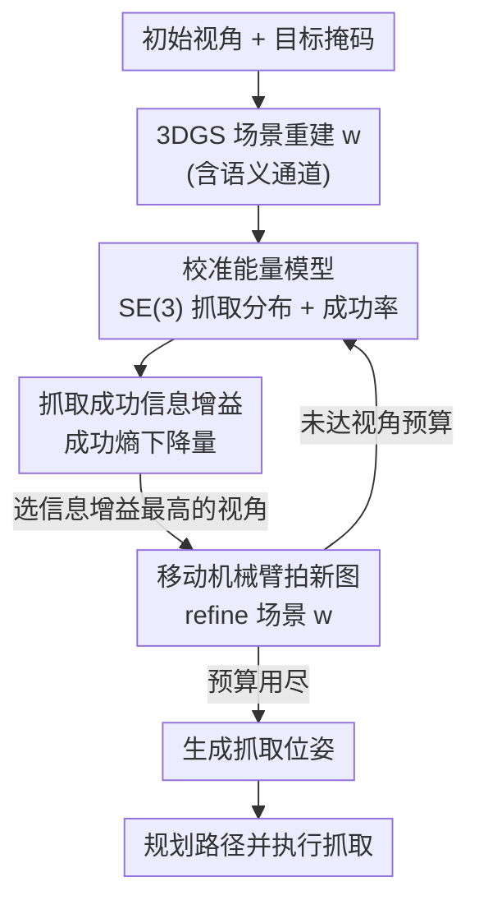

# ActiveGrasp: Information-Guided Active Grasping with Calibrated Energy-based Model

**会议**: CVPR 2026  
**arXiv**: [2511.12795](https://arxiv.org/abs/2511.12795)  
**代码**: https://rpfey.github.io/activegrasp/ (项目主页)  
**领域**: 机器人 / 主动感知 / 抓取  
**关键词**: 主动抓取, Next-Best-View, 能量模型, SE(3) 流形, 模型校准

## 一句话总结
针对杂乱场景下机器人靠有限视角难以抓准目标的问题，ActiveGrasp 用一个**校准过的能量模型**直接在 SE(3) 流形上建模抓取分布，把"下一最佳视角"的信息增益定义为**抓取成功熵的下降量**，从而把机器人引导到"抓取最不确定"的区域，在仿真和真机上以更少视角预算取得最高成功率（仿真 79% SR）。

## 研究背景与动机
**领域现状**：在密集杂乱的桌面场景里抓取目标物体很难，初始视角往往看不到目标的可抓部位。一类做法是用更大的数据和更强的模型硬抗（甚至 π0.5 这种 VLA 大模型），但作者指出缺少主动信息收集时仍然抓不准。另一类是 **Next-Best-View (NBV)** 主动感知：在生成抓取位姿之前，先选若干个"信息增益最高"的视角去补充观测。

**现有痛点**：NBV 的核心是估计候选视角对抓取任务的信息增益，而现有方法的信息增益估计是"有偏"的。作者从信息论角度列出三条必要标准，现有方法都至少违反一条：① 很多方法用**可见性 / 场景完整度**算信息增益，这会偏向"把场景补全"而不是"把抓取看清"；② 即便基于抓取分布，也常把它压到 **2D 或 3D 投影**上，丢掉了抓取位姿在 SE(3) 流形上的旋转结构，从而偏向抓取的位置；③ 即便建模了抓取分布，分布本身**没有校准**到真实成功率，在它之上算的信息增益依然有偏。

**核心矛盾**：要让信息增益"无偏"，必须同时满足"从抓取分布算 + 在 SE(3) 上建模 + 分布被校准到真实成功率"三条，而能直接估计密度 $p(g\mid w)$ 的能量模型并不天然知道每个抓取的**成功率** $s(g,w)$——密度高不等于成功率高。

**本文目标**：构造一个既能在 SE(3) 流形上表达抓取多模态分布、其能量又**校准**到真实成功率的模型，并用它给出一个干净、无启发式的 NBV 信息增益。

**切入角度**：把"信息增益"重新定义为**抓取成功熵的减少量**，而不是抓取分布的香农熵。作者用图说明：观测后抓取分布的香农熵 $\tilde{\mathbf{H}}$ 反而会**上升**（发现更多抓取候选），与"看清后应该更确定"的直觉相反；而以成功事件为条件的熵 $\mathbf{H}$ 会随着发现更多成功抓取而**下降**，这才是抓取任务真正想减少的不确定性。

**核心 idea**：用"校准能量模型 + 高斯后验近似"把抓取成功熵的二阶展开算出来，**最大化成功熵在新观测后的下降量**作为信息增益来选下一个视角。

## 方法详解

### 整体框架
ActiveGrasp 是一个"主动观测—重建—选视角"的闭环 pipeline。输入是一组初始固定视角 $\mathcal{D}$ 和目标掩码，输出是在目标物体上执行的抓取。流程是：先用 **3D Gaussian Splatting (3DGS)** 从初始视角重建带语义通道的场景表示 $w$；校准能量模型在 $w$ 和采样抓取 $g$ 上估计**抓取成功熵** $\eta(w)$；对 $K$ 个候选视角，用 $\nabla_w^2\eta(w)$ 结合场景后验的高斯近似算每个视角的**信息增益** $\mathbf{I}$；选信息增益最高的视角，驱动机械臂去那里拍一张新图、refine 场景 $w$；如此循环直到视角预算用尽；最后用 refined 的 $w$ 让能量模型预测抓取位姿，规划器生成路径并在机械臂上执行。

### 关键设计

**1. 场景增强的 SE(3) 能量模型：在流形上直接建模抓取多模态分布**

现有方法把抓取分布压到 2D/3D 投影会丢掉旋转结构，作者改用能量模型 $E_\theta: w\times g\to\mathbb{R}$ 直接在 SE(3) 流形上建模条件分布 $p(g\mid w)=e^{-E_\theta(g,w)}/Z$，其中 $g\in SE(3)$、$w$ 是 3DGS 场景。模型基于 SE(3) Diffusion Field 扩展，额外条件于噪声尺度 $\sigma_k$，用**去噪分数匹配**在流形上训练：对真值成功抓取加噪 $\hat g=g\exp(\sigma_k\hat\epsilon)$，让能量梯度对齐扰动分布 $\zeta$ 的对数梯度（$\mathcal{L}_{\text{dsm}}$），采样时用退火 Langevin 动力学在 SE(3) 上迭代。"场景增强"指把 3DGS 的高斯均值与 one-hot 语义向量融合成 $\mathcal{P}\in\mathbb{R}^{N\times2\times3}$（前景点语义置 1、背景置 0，$N=1024$），用 VNN 提特征，夹爪用固定锚点经 $g$ 变换到世界系再过 MLP，二者拼接送入 PointNet，使能量模型"看见"完整场景而不只是孤立点云。这是后续算信息增益的基础——只有把抓取分布建在 SE(3) 上，信息增益才不会偏向位置而忽略朝向。

**2. 抓取成功熵与二阶信息增益：把 NBV 变成"成功不确定性下降最大"**

这是论文信息论核心。作者把抓取的熵定义为**条件熵** $\eta(w)=\mathbf{H}[S\mid G,W]=\mathbb{E}_{p(g\mid w)}[h(g,w)]$，其中单个抓取的成功 $S$ 是参数为成功率 $s(g,w)$ 的 Bernoulli 分布，单抓取熵为 $h(g,w)=-s\log s-(1-s)\log(1-s)$。这与抓取分布的香农熵 $\tilde{\mathbf{H}}[G\mid W]=\mathbb{E}[-\log p(g\mid w)]$ **本质不同**：观测后 $\tilde{\mathbf{H}}$ 会上升（候选变多），而 $\eta$ 会下降（成功抓取被确认），后者才是抓取任务该减少的量。当场景从观测估计时，整体熵为 $\mathbf{H}[S\mid G,W,\mathcal{D}]=\mathbb{E}_{p(w\mid\mathcal{D})}[\eta(w)]$。作者对 $\eta(w)$ 在 MAP 估计 $w^*$ 处做二阶 Taylor 展开，再代入场景后验的**高斯近似 (GAP)** $p(w\mid\mathcal{D})\sim\mathcal{N}(w^*,\mathbf{H}''[w\mid\mathcal{D}]^{-1})$，得到

$$\mathbf{H}[S\mid G,W,\mathcal{D}]=\eta(w^*)+\tfrac{1}{2}\,\mathrm{tr}\!\left(\nabla_w^2\eta(w^*)\,\mathbf{H}''[w^*\mid\mathcal{D}]^{-1}\right).$$

候选视角 $x_{\text{acq}}$ 的信息增益就是新观测前后这个熵的**下降量**

$$\mathbf{I}\approx\tfrac{1}{2}\,\mathrm{tr}\!\left\{\nabla_w^2\eta(w^*)\left[\mathbf{H}''[w^*\mid\mathcal{D}]^{-1}-\mathbf{H}''[w^*\mid x_{\text{acq}},\mathcal{D}]^{-1}\right]\right\},$$

其中场景 Hessian 用 Gauss-Newton 近似成对角形式 $\mathbf{H}''[w\mid\mathcal{D}]\approx\sum_x\mathrm{diag}(\nabla_w f\,\nabla_w f^T)+\lambda I$（$f$ 是 3DGS 渲染方程），$\nabla_w^2\eta$ 实践中用 $\nabla_w\eta\,\nabla_w\eta^T+\lambda I$ 近似。选信息增益最高的视角即可，**没有任何额外启发式**，这正是它比基于可见性/affordance 的方法更"对症"的原因。

**3. 能量校准：让能量直接等于成功率，信息增益才无偏**

第 2 点要算 $\eta$ 必须知道成功率 $s(g,w)$，但普通能量模型只给密度、不给成功率，所以必须把能量**校准**到真实成功率。JEM 用对比散度 (CD) 给分类器校准，但这里条件变量 $w$ 连续高维，CD 算不动。作者改造为一个面向抓取的实用校准：把抓取成功/失败当二分类，网络输出 logits $(a_S,a_F)$，定义 $p_S=\frac{e^{a_S}}{e^{a_S}+e^{a_F}+2}$、$p_F=\frac{e^{a_F}}{e^{a_S}+e^{a_F}+2}$，能量取 $E_S=-\log p_S$、$E_F=-\log p_F$——这样能量天然可解释为成功概率。训练上用**双向分数匹配** $\mathcal{L}^+/\mathcal{L}^-$：让能量梯度同时对齐成功抓取的扰动、远离失败抓取的扰动，使采样既靠近成功区又避开失败模式。为了不破坏 DSM 学到的精细能量结构，作者**不用**会"过度约束"的交叉熵，而用 **AP (Average Precision) Loss**：把抓取按预测概率软分配到等距 bin（权重 $w_i^j=\max(0,1-|p^i-b_j|/\Delta)$），优化可微的平均精度——这是一种"懒惰"监督，一旦正样本排序稳定高于负样本就停止给梯度，只施加恰好够校准的约束。最后再把能量模型默认固定的温度 $T=1$ 改为**可学习温度**，让网络自动调节能量尺度以保持数值稳定。总损失为 $\mathcal{L}_{\mathrm{EBM}}=\frac{\mathcal{L}^++\mathcal{L}^-}{2}+\lambda_1\mathcal{L}_{\text{ap}}+\lambda_2\mathcal{L}_{\text{sdf}}$。校准后能量模型的 ECE 从 0.40 一路压到 0.02，这是整套信息增益成立的前提。

### 损失函数 / 训练策略
能量模型在 Acronym 数据集上训练 200k 步，batch 24，Adam，学习率 1e-3，$\lambda_1=1,\lambda_2=0.1$；噪声调度 $\sigma_k=(\sigma^{2k}-1)/\log\sigma,\ \sigma=0.5$；AP Loss 只在低噪声 $k<0.01$ 的样本上计算。3DGS 每加一个新视角后再训 1k 步，语义通道用渲染分割图的交叉熵训练，用 DBSCAN 过滤 2D 分割噪声，前/背景高斯各下采样到 512 点送入能量模型；候选视角用球面 Fibonacci 采样在半径 0.3–0.5 m 球面上取 128 个。

## 实验关键数据

### 主实验
仿真用 PyBullet + YCB 物体搭建 10 物体杂乱场景，7-DoF Franka 机械臂腕装 RGBD，跑 400 个 trial；每个 trial 给 2 个固定初始视角 + 主动选 2 个视角。下表把"抓取生成方法 + 主动学习方法"组合对比（SR 越高越好，ECE 越低越好）：

| 方法组合 | Success | SR | ECE |
|----------|---------|------|------|
| ACE + ACE | 90 | 22.50% | 0.35 |
| Contact GraspNet + ActiveNGF | 130 | 32.50% | 0.32 |
| GSNet + ActiveNGF | 249 | 62.00% | 0.30 |
| Se3diff + ActiveNGF | 233 | 58.25% | 0.40 |
| Se3diff Calib + ActiveNGF | 296 | 74.00% | 0.06 |
| Se3diff Calib + Random | 297 | 74.25% | 0.06 |
| Se3diff Calib + Random† (多取 8 视角) | 306 | 76.50% | 0.05 |
| **Ours (Se3diff Calib + ActiveGrasp)** | **316** | **79.00%** | **0.02** |

本文完整方法 SR 79%，比同样用校准模型、换其他 NBV 算法的最佳 74.25% 高出近 5 个点；即使让 Random 多取 8 个视角（76.5%）也仍不及本文用更少视角的结果，说明信息增益选视角确实选得准。同时本文 ECE 最低 0.02。

### 消融实验
在 Acronym 上对能量模型逐步加组件（AP 越高越好，ECE 越低越好）：

| 配置 | AP ↑ | ECE ↓ | ECE (Bullet) ↓ | 说明 |
|------|------|-------|----------------|------|
| Se3diff | 34.69 | 0.17 | 0.35 | 原始 SE(3) 扩散模型 |
| +Scene | 66.00 | 0.15 | 0.30 | 加场景增强 |
| +Scene+AP | 83.31 | 0.14 | 0.17 | 加 AP Loss |
| +Scene+FSM+AP | 83.13 | 0.03 | 0.08 | 再加失败抓取双向匹配 (FSM) |
| +Scene+FSM+AP+T | **87.84** | **0.03** | **0.05** | 再加可学习温度，完整模型 |

### 关键发现
- **校准是成功率的来源**：校准后 Se3diff-Calib 单看抓取检测就比所有现成抓取模型成功率高，作者归因于"执行的是预测成功率最高的抓取，而预测被校准"，等于给执行成功率上了保险。
- **场景增强贡献最大**：把 3DGS 场景融入能量模型让 AP 从 34.69 跳到 66.00，是单步提升最大的组件。
- **FSM + 可学习温度专治校准**：加入失败抓取双向分数匹配把 ECE 从 0.14 砍到 0.03，可学习温度进一步把 Bullet 执行 ECE 压到 0.05，验证了"温度可学"对校准收敛的关键作用。
- **真机一致**：在红杯/红薯片瓶/红番茄罐三个真机场景，本文 9/10、8/10、9/10 成功，均优于 Breyer、ActiveNGF、ACE 等对比方法。

## 亮点与洞察
- **重新定义"该减少的熵"**：把信息增益从"抓取分布的香农熵"换成"抓取成功的条件熵"，一句话击中要害——观测后香农熵反而上升、成功熵才下降。这个区分是整篇论文的灵魂，也解释了为何旧方法选视角"看着信息多但抓不到"。
- **让能量= -log 成功率**：通过 $(a_S,a_F)$ 双 logit + 分母 +2 的归一化设计，使能量天然可解释为成功概率，把"密度模型不知道成功率"这个老问题优雅绕开。
- **AP Loss 当"懒惰校准器"**：用一旦排序正确就停止给梯度的 AP Loss 代替交叉熵，既校准又不破坏 DSM 学到的能量结构——这种"只给恰好够的监督"的思路可迁移到任何"既要排序对、又怕破坏已有结构"的训练场景。
- **GAP + Gauss-Newton 把二阶量算得动**：用 3DGS 渲染雅可比近似对角 Hessian，让"成功熵的二阶 Taylor 展开 + 后验高斯近似"在实际系统里可计算，是把信息论漂亮地落地的关键工程。

## 局限与展望
- **依赖 3DGS 重建质量与 2D 分割**：场景表示靠 3DGS、目标靠 2D 分割 + DBSCAN 提取，分割噪声或重建退化会直接影响信息增益估计；论文用 DBSCAN 过滤但未量化分割失败时的鲁棒性。
- **多处近似叠加**：Hessian 用 Gauss-Newton 对角近似、$\nabla_w^2\eta$ 用外积 + $\lambda I$ 近似、后验用高斯近似，理论无偏性在这些近似下能保持多少未充分讨论。
- **视角预算很小**：实验是 2 初始 + 2 主动共 4 个视角，更大预算或更密集杂堆下信息增益的边际收益如何递减未展开。
- **训练数据为单物体渲染**：能量模型在 Acronym 单物体渲染上训练，迁移到 10 物体真实杂堆主要靠场景增强，跨域 gap 的来源值得进一步分析。

## 相关工作与启发
- **vs ActiveNGF (Ma et al.)**：ActiveNGF 用 graspness 与 TSDF 特征平面的不一致性当信息增益，仍是 3D/投影层面的代理；本文直接在 SE(3) 上算成功熵下降，信息增益更"对症抓取任务"，同样校准模型下 SR 79% vs 74%。
- **vs Breyer (体素可见性)**：Breyer 数候选视角里之前被遮挡的体素数量，本质是"场景完整度"代理，会偏向补全场景而非看清抓取；本文显式区分二者并只优化成功熵。
- **vs ACE (Zhang et al.)**：ACE 建 tri-plane 特征预测未观测视角的 affordance 分数做选视角，仍在特征/affordance 层面；本文不依赖 affordance 代理，直接从校准分布求熵。
- **vs SE(3) Diffusion Fields (Urain)**：本文复用其在 SE(3) 上学到的能量函数，但把它从"生成抓取"扩展到"算信息增益 + 校准成功率"，是对该能量模型的再利用与增强。
- **vs JEM (Grathwohl et al.)**：JEM 发现能量模型分类器能自校准，但只在分类任务、用 CD 损失；本文指出 CD 在连续高维条件 $w$ 上不可行，首次在**抓取位姿检测（回归）**任务上做能量校准。

## 评分
- 新颖性: ⭐⭐⭐⭐⭐ 把信息增益重定义为抓取成功熵下降 + 首次在抓取检测上校准能量模型，角度新且自洽。
- 实验充分度: ⭐⭐⭐⭐ 仿真 400 trial + 真机三场景 + 逐组件消融，但视角预算和场景规模偏小。
- 写作质量: ⭐⭐⭐⭐ 信息论推导清晰、图 3 直观区分两种熵；多处近似的代价讨论略少。
- 价值: ⭐⭐⭐⭐⭐ 提供可复现主动抓取 benchmark + 一套有理论支撑的 NBV 框架，对主动操作研究有实用价值。

<!-- RELATED:START -->

## 相关论文

- [\[CVPR 2026\] EnergyAction: Unimanual to Bimanual Composition with Energy-Based Models](energyaction_unimanual_to_bimanual_composition_with_energy-based_models.md)
- [\[CVPR 2026\] QuantVLA: Scale-Calibrated Post-Training Quantization for Vision-Language-Action Models](quantvla_scale-calibrated_post-training_quantization_for_vision-language-action_.md)
- [\[CVPR 2026\] GeniNav: Generative Model Driven Image-Goal Navigation via Imagination-Guided Consistency Flow Matching](geninav_generative_model_driven_image-goal_navigation_via_imagination-guided_con.md)
- [\[CVPR 2026\] Obstruction Reasoning for Robotic Grasping](obstruction_reasoning_for_robotic_grasping.md)
- [\[CVPR 2026\] FloVerse: Floor Plan-Guided Multi-Modal Navigation](floverse_floor_plan-guided_multi-modal_navigation.md)

<!-- RELATED:END -->
