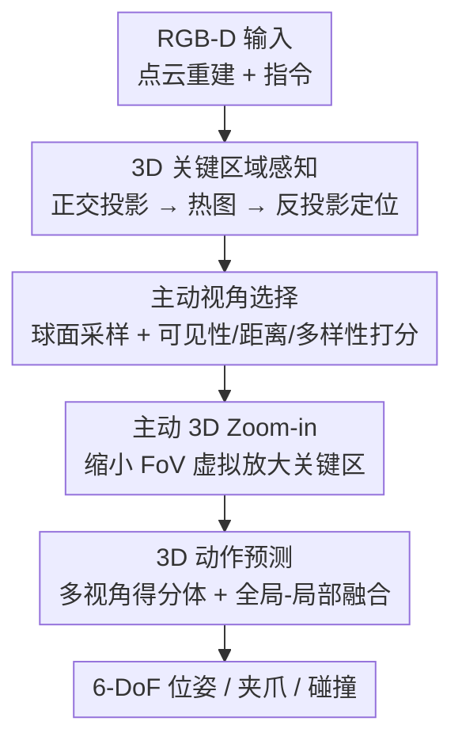

# ActiveVLA: Injecting Active Perception into Vision-Language-Action Models for Precise 3D Robotic Manipulation

**会议**: CVPR 2026  
**论文**: [CVF Open Access](https://openaccess.thecvf.com/content/CVPR2026/html/Liu_ActiveVLA_Injecting_Active_Perception_into_Vision-Language-Action_Models_for_Precise_3D_CVPR_2026_paper.html)  
**代码**: [项目页](https://ZhenyangLiu.github.io/ActiveVLA)（未见开源仓库）  
**领域**: 机器人 / 具身智能  
**关键词**: VLA、主动感知、3D 操作、视角选择、虚拟 Zoom-in

## 一句话总结
ActiveVLA 给 3D 视觉-语言-动作（VLA）模型加上「主动感知」：先用多视角正交投影+热图定位 3D 关键区域，再围绕该区域主动挑选最优虚拟相机视角、并对关键区做虚拟 Zoom-in 提分辨率，从而在遮挡和精细操作场景下显著提升成功率（RLBench 平均 91.8%）。

## 研究背景与动机
**领域现状**：把预训练 VLM 接上动作头形成 VLA 已成为机器人操作的主流范式；进一步引入 3D 点云结构线索（3D-aware policy）能带来更好的样本效率和空间推理能力，是当前的活跃方向。

**现有痛点**：绝大多数 VLA 用的是**固定的、装在手腕上的相机**，提供的是一个以末端执行器为中心的固定视角。这意味着模型在执行任务过程中**无法自适应地切换视角或调整分辨率**——一旦目标被遮挡（图 1 里苹果被玩偶羊挡住），或者要操作很小的零件（拧灯泡、插销钉），固定视角要么看不见要么看不清，长程任务和精细操作就容易失败。

**核心矛盾**：感知被当成了「被动接收传感器输入」的过程，而真正的具身智能需要的是「主动假设检验」——主动去寻找、选择、验证与当前任务相关的信息（作者引 Richard Gregory「感知是主动的假设检验过程」）。固定相机从根上断掉了这种主动性。

**本文目标**：让机器人在执行时能（1）自己决定从哪个视角看，（2）自己决定要不要把关键区域放大看清。

**切入角度**：既然已经重建了 3D 点云，就不必受物理相机束缚——可以在 3D 场景里**自由摆放虚拟相机、合成任意视角的图像**。于是「主动感知」退化成一个在点云上挑视角 + 调 FoV 的几何问题，无需真的移动机械臂去探查。

**核心 idea**：用「粗到细」两阶段把被动 VLA 改造成主动 VLA——粗阶段定位 3D 关键区域，细阶段围绕它**主动选视角 + 主动 Zoom-in**，再做动作预测。

## 方法详解

### 整体框架
ActiveVLA 要解决的是「固定视角看不见/看不清」，整体是一条 **coarse-to-fine 的感知-动作闭环**：输入是多台标定相机的 RGB-D，先重建场景点云；**粗阶段**把点云正交投影成多视角 2D 图喂给 PaliGemma 主干，预测热图并反投影回 3D，定位出本次任务的「关键 3D 区域」；**细阶段**以该区域为中心，先用假设检验式的打分主动挑出若干最优虚拟视角，再对最优视角做虚拟 Zoom-in 放大关键区；最后把这些精炼后的视角重新过一遍（共享权重的）PaliGemma 生成热图，反投影累积成 3D 得分体，配合全局-局部融合预测出 6-DoF 位姿、夹爪开合与碰撞标志。

整条流水线里只有「3D 关键区域感知」「主动视角选择」「主动 3D Zoom-in」三处是本文真正的贡献节点；点云重建/正交投影/PaliGemma 编码/动作解码属于通用脚手架。

### 关键设计

**1. 3D 关键区域感知：把「看哪儿」先粗定位到 3D 空间**

痛点是 VLM 主干的全局表征不足以做精确的空间定位，但又必须先知道任务关心的是场景里哪一块，才能围绕它做后续主动感知。ActiveVLA 的做法是：给定重建好的点云，从**俯视、正视、右视三个正交方向**各渲染一张图，每张图 7 通道——RGB(3) + 深度(1) + 该像素对应点在世界系下的坐标 (x,y,z)(3)。坐标通道很关键：不同视角里若像素共享同一 $(x,y,z)$，就对应 3D 中同一个点，从而能跨视角对齐。渲染时每个像素取**投影到该像素、深度最小的点**的颜色，天然处理了遮挡：

$$I^{(v)}(u_x,u_y)=\sum_{i=1}^{N}\mathbf{c}_i\cdot\delta\big((u_x,u_y)-\pi^{(v)}(\mathbf{p}_i)\big)$$

把三张图喂给 VLM 后，作者不直接用全局表征，而是把输出的 patch token 按空间位置重排成特征网格，再过一个**凸上采样（convex upsampling）块** $\mathcal{U}(\cdot)$ 恢复到输入图分辨率，得到热图 $\mathbf{H}=\mathcal{U}\big(\mathrm{Rearrange}(\{\mathbf{t}_i\})\big)$。凸上采样是学出来的逐像素权重（而非固定插值），能恢复更细的空间细节。热图用交叉熵监督训练，三视角热图反投影回 3D 交汇处即为「关键 3D 区域」。这一步等价于把「看哪儿」这个问题从 2D 提到了 3D，为后面在 3D 里摆相机提供了锚点。

**2. 主动视角选择：用假设检验式打分挑出「看得最全、最不被遮」的视角**

固定/手腕相机的根本问题是视角不可调，遮挡时只能干瞪眼。ActiveVLA 把「该从哪看」formalize 成一个在关键区域 $p_f$ 周围球面上的多目标优化。先在以 $p_f$ 为球心的球面上**均匀撒候选相机位**——用对正二十面体递归细分的测地采样（geodesic sampling），避免经纬度参数化的采样偏置，$k$ 级细分后顶点数为 $V(k)=12+\tfrac{20}{3}(4^k-1)$，可通过细分级数平滑控制视角密度。

每个候选位 $c_i$ 用三项准则打分：
- **可见性**：沿 $c_i \to p_f$ 的视线均匀采样 $N$ 个点 $q_k$，用 KDTree 最近邻查询它们到点云表面的最近距离 $d_k=\min_{s\in\mathcal{S}}\|q_k-s\|$；若所有点都离表面够远（$d_k\ge r,\forall k$）说明视线没被几何挡住，$v(c_i,p_f)=1$，否则为 0。
- **距离**：把 $\|c_i-p_f\|$ 归一化并跨候选标准化，偏好「不远不近」的观察距离（兼顾视野和细节）。
- **多样性**：让选出的几个视角彼此朝向尽量分散，$S_{\text{div}}(c_i)=\sum_{j\ne i}\arccos(\mathbf{v}_i\cdot\mathbf{v}_j)$，角分离越大越分散。

三项 Z-归一化后加权合并 $s_i=w_{\text{vis}}s_{\text{vis}}+w_{\text{dis}}s_{\text{dis}}+w_{\text{div}}s_{\text{div}}$（权重和为 1），取 top-K 作为下一步观察位姿，每台虚拟相机用 look-at（eye=$c_i$，target=$p_f$）配置。这相当于让机器人在虚拟空间里「绕着目标转一圈、挑几个看得最清楚又互补的角度」，得分最高的那个还会留给下一步 Zoom-in。

**3. 主动 3D Zoom-in：缩小 FoV 做无损「光学变焦」看清小目标**

挑好视角解决了「看得见」，但精细任务（如往孔里插焊枪）还要「看得清」。固定相机分辨率有限，小物体占的像素太少。ActiveVLA 的做法是：选定最优视角后，**从同一相机位姿、但用更窄的视场角重新渲染一次**——视场窄了，关键区在画面里就被放大，而像素分辨率保持不变，等于在虚拟渲染空间里实现了「光学变焦」。设原始视场角 $\alpha$、变焦因子 $z>1$、相机到目标距离 $d$，则渲染图横向覆盖宽度为：

$$W(z)=2d\tan\!\Big(\frac{\alpha}{2z}\Big)$$

$W(z)$ 随 $z$ 增大而减小，而分辨率 $R=\text{图像宽(像素)}/W(z)$ 随之升高，关键区细节更清晰。因为是基于点云做尺度无关的视图合成，放大不引入几何损失。作者强调这把**探索（选视角）和利用（Zoom-in 看清）解耦**成层次化感知策略：A-VS 管「往哪看」，A-3Z 管「看多近」。

> 动作预测部分（脚手架）：把精炼视角的热图反投影累积成多视角得分体 $S(\mathbf{g})=\sum_{v=1}^{3}w_v\,h_v(\pi_v(\mathbf{g}))$，取 $\arg\max$ 得平移目标；旋转用欧拉角各离散成 72 bin，再用全局（对各正交投影 max-pool 得 3 个全局 token）+ 局部（ROI 采样的细粒度 token）融合后过 MLP 头，输出旋转、夹爪状态和碰撞标志。

### 损失函数 / 训练策略
关键区域感知阶段用**交叉熵损失**监督热图预测（把 ground-truth 关键点位置当作分类目标）。VLM 主干沿用 BridgeVLA：基于 PaliGemma（SigLIP 编码器 + Gemma 解码器），在 120K 张 RoboPoint 子集图像上预训练。粗/细两阶段的 PaliGemma **共享权重**。超参上，选 3 个视角、Zoom-in 因子设为 4（见消融）。

## 实验关键数据

### 主实验
三个仿真基准（RLBench 18 任务、COLOSSEUM 14 种扰动泛化、GemBench 分层泛化 L1–L4），均报告成功率 (%)。

| 基准 | 指标 | ActiveVLA | 之前 SOTA (BridgeVLA) | 提升 |
|------|------|-----------|-----------------------|------|
| RLBench | 平均成功率 ↑ | **91.8** | 88.2 | +3.6 |
| RLBench | 平均排名 ↓ | **1.22** | 2.44 | — |
| COLOSSEUM | 平均成功率 ↑ | **65.9** | 64.0 | +1.9 |
| COLOSSEUM | 平均排名 ↓ | **1.07** | 2.07 | — |
| GemBench | 平均成功率 ↑ | **51.3** | 50.0 | +1.3 |

在 RLBench 18 个任务里 ActiveVLA 拿下 10 个第一；对遮挡敏感的任务提升明显（Place Cups 58.4→65.6，Insert Peg 88.0→92.4，Stack Cups 81.6→84.8）。COLOSSEUM 上对尺寸/颜色/光照/纹理扰动都更鲁棒（MO-SIZE 72.4%、Camera Pose 76.3%、Table Color 78.3%）。GemBench 在 L1–L3 全面领先（92.4/66.3/45.1），但最难的 L4 仅 1.2%（几乎所有方法都接近 0）。

### 消融实验
A-VS = 主动视角选择，A-3Z = 主动 3D Zoom-in；报告「成功率(%)/单次推理时间(s)」。

| 配置 | RLBench | COLOSSEUM | GemBench |
|------|---------|-----------|----------|
| 固定视角 baseline | 87.6 / 0.26 | 63.6 / 0.33 | 48.9 / 0.21 |
| + A-VS | 89.4 / 0.45 | 64.5 / 0.51 | 49.4 / 0.48 |
| + A-VS + A-3Z（完整） | **91.8 / 0.53** | **65.9 / 0.62** | **51.3 / 0.59** |

超参分析（RLBench）：视角数 1→3 把成功率从 82.2% 拉到 91.8%，超过 3 后饱和（4/5/6 视角约 92.0/91.7/91.8%）；Zoom-in 因子 1→4 提到 91.8%，再大（5/6）反而掉到 91.4/90.9%（放太大丢失上下文）。故定为 3 视角、因子 4。

### 关键发现
- **两个模块各司其职、可叠加**：A-VS 决定「往哪看」（+1.8% on RLBench），A-3Z 决定「看多近」（再 +2.4%），合起来构成层次化感知；代价是推理时间从 0.26s 增到 0.53s（约翻倍）。
- **主动感知对遮挡任务收益最大**：Place Cups 这类高遮挡任务提升最显著，印证了「主动换视角解遮挡」的核心假设。
- **多视角有边际递减**：3 个视角已足够覆盖空间并缓解遮挡，再加只增算力不增分；Zoom-in 也存在「过放大丢上下文」的甜点。
- **L4 几乎全军覆没**：最难的组合泛化任务上所有方法（含本文）都接近 0，说明主动感知改善的是「看不清/被遮挡」，而非根本的组合泛化能力。

## 亮点与洞察
- **「主动感知」在 3D-VLA 里几乎零成本实现**：因为已有点云，挑视角、变焦都退化成虚拟渲染里的几何操作，不用真的移动机械臂去探查——把一个看似很贵的具身能力变成了纯计算。这是最巧妙的地方。
- **探索/利用解耦**：A-VS（看哪、看全，对抗遮挡）和 A-3Z（看清、看细，对抗低分辨率）正交分工，分别打中「长程遮挡」和「精细操作」两类失败模式，消融上也确实各自独立加分。
- **正交投影图带坐标通道做跨视角对齐**是个可复用 trick：7 通道里塞进世界坐标，让 2D 热图能无歧义反投影回 3D，避免了显式做多视角匹配。
- **测地球面采样**避免经纬度采样在两极聚集的偏置，且能用细分级数平滑控制候选密度，是个干净的几何工程选择。

## 局限性 / 可改进方向
- **依赖较好的点云重建与标定**：整套主动感知建立在「已有干净点云」之上，真实场景里深度噪声/重建误差会直接污染视角打分和 Zoom-in。
- **组合泛化没解决**：L4 仅 1.2%，说明本文改善的是感知质量而非任务级组合推理；遇到全新动作原语组合仍会失败。
- **推理变慢约一倍**（0.26→0.53s/步），细阶段要重渲染多视角，长程任务累积起来对实时性有压力。
- **打分权重 $w_{\text{vis}},w_{\text{dis}},w_{\text{div}}$ 与阈值 $r$ 的设置**论文未给敏感性分析 ⚠️（以原文为准），不同场景几何下是否需要重调存疑。
- 改进方向：把视角选择从「规则打分」换成可学习/可微的策略，并端到端联合优化感知与动作，或许能进一步压时间、提泛化。

## 相关工作与启发
- **vs BridgeVLA（最强 baseline，也是本文主干来源）**：BridgeVLA 把 2D 热图对齐做高效 3D VLA，但仍是被动固定视角；ActiveVLA 直接复用其 PaliGemma 主干，额外加上主动视角选择 + Zoom-in，在三基准全面超越（RLBench +3.6）。核心区别就是「被动→主动」。
- **vs SpatialVLA / PointVLA / Lift3D 等 3D-VLA**：它们把 3D 信息（位置编码 Ego3D、点云编码器、隐式 3D 特征）注入 2D 模型来增强空间推理，但都缺乏感知的「灵活性」——不能动态调视角/分辨率。ActiveVLA 强调的不是「编码更多 3D 特征」，而是「主动去获取更好的观测」。
- **vs RVT / RVT-2 / Act3D（多视角投影类 3D policy）**：它们也用多视角正交投影 + 粗到细，但视角是**预设固定的**；ActiveVLA 的视角是任务相关、在线挑出来的，这正是性能差距（RVT-2 81.4 → 91.8）的来源。
- **启发**：「在重建的 3D 表征上做虚拟相机的主动感知」这一思路可迁移到任意有 3D/NeRF/点云表征的任务——如主动重建、主动 VQA、遮挡下的检测，凡是「换个角度/放大就能看清」的场景都适用。

## 评分
- 新颖性: ⭐⭐⭐⭐ 把「主动感知」干净地落进 3D-VLA，视角选择+虚拟 Zoom-in 的组合直击遮挡与精细操作两类痛点。
- 实验充分度: ⭐⭐⭐⭐ 三个仿真基准 + 真机，消融把两模块的贡献和超参甜点都讲清了；唯打分权重敏感性缺失。
- 写作质量: ⭐⭐⭐⭐ 粗到细脉络清晰，公式与动机对得上；个别符号在 OCR 文本里略糊。
- 价值: ⭐⭐⭐⭐ 思路通用、几乎零额外硬件成本，对遮挡/精细操作场景实用性强。

<!-- RELATED:START -->

## 相关论文

- [\[CVPR 2026\] SaPaVe: Towards Active Perception and Manipulation in Vision-Language-Action Models for Robotics](sapave_active_perception_manipulation_vla_roboti.md)
- [\[CVPR 2026\] GeoPredict: Leveraging Predictive Kinematics and 3D Gaussian Geometry for Precise VLA Manipulation](geopredict_leveraging_predictive_kinematics_and_3d_gaussian_geometry_for_precise.md)
- [\[CVPR 2026\] MoEActok: A MoE-based Action Tokenizer for Vision-Language-Action Models](moeactok_a_moe-based_action_tokenizer_for_vision-language-action_models.md)
- [\[CVPR 2026\] ACoT-VLA: Action Chain-of-Thought for Vision-Language-Action Models](acot-vla_action_chain-of-thought_for_vision-language-action_models.md)
- [\[CVPR 2026\] Language-Grounded Decoupled Action Representation for Robotic Manipulation (LaDA)](lada_robotic_manipulation.md)

<!-- RELATED:END -->
