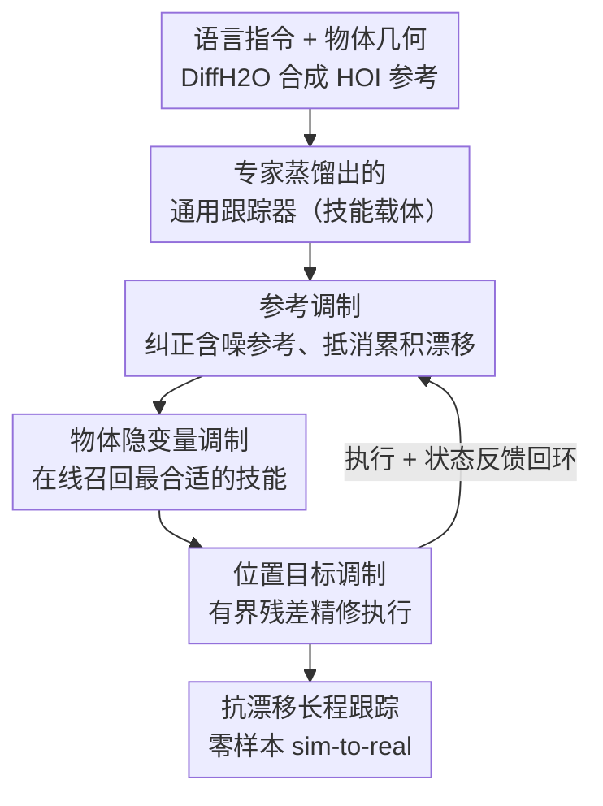

# AdaDexTrack: Dynamic Modulation for Adaptive and Generalizable Dexterous Manipulation Tracking

**会议**: CVPR 2026  
**论文**: [CVF Open Access](https://openaccess.thecvf.com/content/CVPR2026/html/Adalibieke_AdaDexTrack_Dynamic_Modulation_for_Adaptive_and_Generalizable_Dexterous_Manipulation_Tracking_CVPR_2026_paper.html)  
**代码**: 项目页 https://janebek.github.io/AdaDexTrack （未见公开代码仓库）  
**领域**: 机器人 / 具身智能  
**关键词**: 灵巧操作, 手物交互跟踪, 语言引导, 在环调制, sim-to-real  

## 一句话总结
AdaDexTrack 把"语言指令 → 灵巧手物交互"重新定义为**可调制的跟踪**：用一个蒸馏出来的通用跟踪器当"技能载体"，再在反馈环里塞一个 RL 训练的调制器，从「参考轨迹 / 物体隐变量 / 位置目标」三个接口实时纠偏，从而把含噪的文本生成参考稳定地执行成长程、抗漂移的操作，并实现零样本 sim-to-real。

## 研究背景与动机

**领域现状**：用自然语言指挥多指灵巧手做手物交互（HOI）很有吸引力——给一句指令和物体几何，先用 text-to-motion 合成一条时间索引的手物参考轨迹，再让灵巧手去跟踪执行。代表方法 DexTrack 通过把多个专家策略蒸馏进一个通用跟踪器，扩大了覆盖面。

**现有痛点**：这套两段式系统有两个致命问题。其一是**参考本身就脏**：运动合成不完美，而且人手到机器手的重定向（retargeting）会引入"具身偏差"（embodiment bias），参考轨迹未必是机器手能精确复现的。其二是**开环假设下的固定参考跟踪**：绝大多数跟踪器把参考当成固定不变的目标 [17,20]，执行一旦偏离，控制器就被迫去"追"那条它已经跟不上的轨迹——策略变得激进、接触失稳、漂移加速，长程下小误差像滚雪球一样累积，系统最终彻底丢失跟踪。

**核心矛盾**：跟踪器再强也是"不完美但覆盖广"的，而参考是"含噪且带具身偏差"的。把这两个不完美硬凑在一条开环管线里，误差没有任何被纠正的机会，只会单向累积。

**本文目标**：在不抛弃"跟踪"这个干净接口的前提下，给系统一个在线纠偏的能力——既能修正参考的噪声，又能在执行偏离时把控制器拉回可行轨迹，从而稳住长程、文本引导的轨迹。

**切入角度**：作者观察到，跟踪器的"短程精度"其实很高，只是长程会漂。那就不要让它去精确跟踪那条固定参考，而是把"它看到什么、它执行什么"放进反馈回路里动态调整——用短程精度去抵消长程累积误差。

**核心 idea**：用"调制（modulation）"代替"固定参考跟踪"。保留一个蒸馏好的通用跟踪器作为技能库载体，在它前面加一个与之**目标对齐**的在环调制器，从参考、物体隐变量、位置目标三个接口实时纠偏。

## 方法详解

### 整体框架
AdaDexTrack 要解决的是"含噪文本参考 + 具身错配 → 长程漂移"这个问题，整体拆成两个阶段。**第一阶段（离线）造跟踪器**：用现成的 DiffH2O 从语言提示合成大规模手物轨迹，重定向到机器手后，为每条参考用 PPO 训练一个**专家跟踪策略**，再把成千上万个专家的成功轨迹通过行为克隆（BC）蒸馏进**单个通用跟踪器** $\pi_{\text{track}}$。这个通用器覆盖广但不完美——而这恰恰是调制器发挥价值的地方。**第二阶段（在环）加调制器**：在通用跟踪器前面放一个 RL 训练的调制器 $\pi_{\text{modulate}}$，把整体组织成分层策略，每一步从三个接口纠偏——改参考、改物体隐变量、改位置目标。关键在于调制器和跟踪器**共享同一个任务目标**（同一套跟踪奖励），保证两者紧耦合，而不是各优化各的目标。

下面这张图自上而下就是数据/控制的流向：离线把"专家→通用"蒸馏出技能载体，在线由调制器在反馈环里逐步纠偏后再交给跟踪器执行。

### 关键设计

**1. 专家→通用蒸馏的跟踪器：把一个强但不完美的"技能载体"先造出来**

光靠语言条件参考训不出泛化跟踪器，因为含噪、多样、规模大。作者的做法是先把问题"切碎再合并"：对 DiffH2O 合成（并用 GPT-5 做语义等价改写来扩充语言多样性、同时保持在 DiffH2O 生成分布内以减少分布偏移）的每条参考，单独用 PPO 训一个**专家** $\pi_{\text{track}}^{i}$。每个专家只负责一条语义一致的窄行为，这样大幅压缩了 RL 探索空间、加速收敛。专家的观测是 $o_t^{\text{track}}=(s_t^{\text{track}}, \hat s_t^{\text{track}})$，当前状态 $s_t^{\text{track}}=(s_t^{\text{prop}}, s_t^{o}, f^{o})$ 拼接了机器人本体感受、物体位姿和**物体隐变量** $f^{o}=E_{pc}(P)$（点云编码器对物体点云的编码），参考状态还额外纳入了 $k\in\{1,2,4,12\}$ 的**近未来参考**。奖励对齐手/物状态并鼓励手物接近：

$$r_t = \omega_1\|q_t^{h}-\hat q_t^{h}\|_2^2 + \omega_2\|p_t^{h}-\hat p_t^{h}\|_2^2 + \omega_3\|p_t^{o}-\hat p_t^{o}\|_2^2 + \omega_4\|p_t^{h}-p_t^{o}\|_2^2$$

收集专家的成功轨迹后，用**离线 BC**（而非需要反复在环查询专家的 DAgger）蒸馏成单个通用策略——因为专家数量巨大，DAgger 的多轮交互成本太高，离线 BC 在这个规模下更高效。通用器观测空间和专家完全一致，可直接部署到真机、不需要 oracle 状态。这一步的价值不在于"完美"，而在于造出一个把 $(o_t^{\text{track}}, f^o)\to a_t$ 学成**连续映射**的载体——这是后面物体隐变量调制能起效的前提。

**2. 参考调制：用短程精度去抵消长程累积误差**

跟踪器不完美，长程跟不准就会漂、状态跑到分布外（OOD）。参考调制的思路是：既然跟踪器短程很准，那就**动态把目标往近未来推**。每一步对 $k\in\{1,2,4,12\}$ 的近未来参考施加一个统一更新规则 $\hat s_{t+k}^{x}\leftarrow \hat s_{t+k}^{x}+\lambda^{x} a_{t+k}^{\text{ref},x}$（$x\in\{h,o\}$ 分别是手和物），其中 $a_{t+k}^{\text{ref},x}$ 是调制器输出的参考残差动作，$\lambda^{x}$ 控制调整幅度、把修改后的参考约束在原轨迹附近。直观效果（论文图 4 的"签名"）是：当执行轨迹漂出去时，被调制后的参考会和已执行路径在 x–y 平面**相交**，制造一个低误差的"重新汇合点"，把策略拉回可行轨迹。和"死跟固定参考"相比，它不是让控制器去追那条它已经跟不上的线，而是把线本身朝着控制器能跟上的方向小幅挪动，从而持续抵消累积误差、抑制长程漂移。

**3. 物体隐变量调制：把离散的"技能菜单"变成连续可插值的流形**

通用跟踪器在推理时把物体隐变量 $f^{o}$ 在任务开始时算一次、全程冻结，行为就被钉死了。但蒸馏时记录的 $(o_t^{\text{track}}, a_t)$ 数据里 $f^{o}$ 是显式嵌入观测的——这些数据天然构成了一个**以物体隐子空间为条件的状态-动作技能库**。调制器的做法是放开这个限制，在线产出一个被调制的隐变量 $\tilde f_t^{o}\in\mathbb{R}^{64}$，组成 $\tilde s_t^{\text{track}}=(s_t^{\text{prop}}, s_t^{o}, \tilde f_t^{o})$ 喂给跟踪器。由于 BC 学出的是 $(o_t^{\text{track}}, f_t^{o})\to a_t$ 的连续映射，$f_t^{o}$ 一变，跟踪器行为就在不同专家之间**平滑滑动**——调制器借此在运行时"召回"最匹配当前参考的技能基元。虽然技能库是从有限锚点 $\{f_i^{o}\}$ 建的，但调制器把 $\tilde f_t^{o}$ 当作**连续控制变量**，等于把一个离散的"能力菜单"变成可以在物体锚点之间插值/切换的连续流形。论文实验里这个隐变量被解释成手张开度的"旋钮"：reach 阶段偏大隐变量让手张开避免撞物，grasp 阶段切小隐变量收紧手保证接触——这是有语义、分阶段的技能召回。

**4. 位置目标调制：吸收跟踪器吃不下的执行级高频偏差**

参考和隐变量都改了，但执行层面仍有跟踪器自己捕捉不到的快速、局部、高频非理想因素（接触瞬态、延迟等）。位置目标调制就给跟踪器的命令叠加一个**小而有界的残差**：给定 $a_t=\pi_{\text{track}}(o_t^{\text{track}})$，调制器输出残差 $\Delta a_t$，最终命令为 $a_t' = a_t + \Delta a_t$。直观上 $a_t$ 携带蒸馏学到的技能的低频结构，$\Delta a_t$ 提供平滑的小幅补偿来提精度和鲁棒性——既快速从漂移中恢复，又始终让跟踪器"掌舵"、不会被残差喧宾夺主。这三个接口（参考/隐变量/位置目标）合起来覆盖了"看什么、用什么技能、怎么执行"三个层级的纠偏。

### 损失函数 / 训练策略
跟踪器侧：专家用 PPO 训练，目标是最小化机器手状态与参考的差距（奖励见上式）；通用器用离线 BC 从专家成功轨迹蒸馏。调制器侧：用 RL 训练，**共享跟踪器的同一套任务奖励**，确保目标紧对齐。sim-to-real 侧：用 CMA-ES 做系统辨识，最小化仿真与真机关节状态差 $L=\sum_{m}\sum_{t}\|q_{m,t}^{s}-q_{m,t}^{r}\|_2^2$ 来标定关节刚度 $P$ 与阻尼 $D$；再叠加域随机化（机器人动力学小幅、物体动力学大幅随机化，本体感受与动作注高斯噪声，物体初始位姿随机化），并对指尖和物体贴高摩擦胶带以提升成功率。

## 实验关键数据

数据集：用 DiffH2O 从 1,333 条标注中过滤出 505 条单手、无碰撞、可达的参考，再各扩 9 条语义等价文本，扩到 5,050 条，重新做可行性过滤后得到 2,765 条有效序列、覆盖 50 个物体。划分两种测试集：unseen-trajectory（2,212 训 / 553 测）和 unseen-object（45 物体 2,520 序列训 / 留出 5 物体 245 序列测）。仿真在 Isaac Gym 中进行。成功率以 Mean-error/Completion 两个变体报告（单位 %）。

### 主实验（Isaac Gym，仿真）

| 测试集 | 方法 | To (cm↓) | Th (cm↓) | E_finger (rad↓) | Succ.% (Mean/Compl.↑) |
|--------|------|----------|----------|------------------|------------------------|
| Unseen Traj. | ObjDex | 4.95 | 8.02 | 0.6872 | 51.72 / 44.59 |
| Unseen Traj. | DexTrack | 6.93 | 9.17 | 0.2823 | 76.13 / 73.89 |
| Unseen Traj. | Vanilla RL (PPO) | 12.10 | 13.30 | 0.3595 | 43.03 / 53.94 |
| Unseen Traj. | **Ours (R+O+T)** | **4.49** | 8.77 | 0.2714 | **88.99 / 77.92** |
| Unseen Obj. | ObjDex | 20.29 | 11.24 | 0.6833 | 28.16 / 37.82 |
| Unseen Obj. | DexTrack | 18.06 | 10.32 | 0.2953 | 39.59 / 47.37 |
| Unseen Obj. | Vanilla RL (PPO) | 23.20 | 9.63 | 0.2533 | 25.71 / 44.24 |
| Unseen Obj. | **Ours (R+O+T)** | **15.45** | **9.21** | 0.2922 | **46.12 / 53.78** |

在两种测试集上，AdaDexTrack 的成功率都全面超过 ObjDex、DexTrack 和 Vanilla RL。尤其 unseen-trajectory 上 Mean-error 成功率 88.99% 远超 DexTrack 的 76.13%，物体位置误差也最低（4.49cm）。

### 消融实验（逐步加调制接口，Table 1）

| 配置 | Unseen-Traj Succ.% | Unseen-Obj Succ.% | 说明 |
|------|--------------------|--------------------|------|
| General Tracker | 62.20 / 65.01 | 24.08 / 42.52 | 仅通用跟踪器，无调制 |
| + R | 67.09 / 68.14 | 25.71 / 42.89 | 加参考调制 |
| + R + T | 84.45 / 80.42 | 37.55 / 47.51 | 再加位置目标调制 |
| + R + O + T | 88.99 / 77.92 | **46.12 / 53.78** | 完整模型（全部三接口） |

### 真机零样本 sim-to-real（Table 2，Completion %）

| 方法 | Unseen Traj | Unseen Obj |
|------|-------------|-------------|
| Ours (w/o modulator) | 26.63% | 22.27% |
| **Ours** | **52.36%** | **36.71%** |

真机用 XArm6 + LEAP Hand，FoundationPose 估物体位姿（因旋转对称物体位姿有歧义而排除瓶类）。加调制器后两个集上 Completion 几乎翻倍，直接验证了"在环调制"对抗感知噪声/标定漂移/延迟的价值。

### 关键发现
- **位置目标调制（T）贡献巨大**：unseen-trajectory 上从 +R 的 67.09% 跳到 +R+T 的 84.45%，是单接口里提升最猛的——说明执行级高频残差补偿在长程接触任务里极其关键。
- **物体隐变量调制（O）在泛化到新物体时价值最大**：unseen-object 上从 +R+T 的 37.55% 提到 +R+O+T 的 46.12%，印证了"召回最合适技能"对未见物体的泛化作用；而在 unseen-trajectory 的 Mean-error 上加 O 后反而把 Completion 从 80.42 略降到 77.92，⚠️ 说明 O 的增益依赖任务类型、不同测试集不可直接比大小。
- **增益来自适应而非单纯模型规模**：消融显示加调制接口稳定涨点，作者据此论证收益来自"在环纠偏"而非更大的模型。
- **数据规模单调有益**：下采样训练集做 data-scaling 分析，两个测试集上成功率都随数据量稳步上升，且始终高于 tracker-only 基线。

## 亮点与洞察
- **"调制跟踪"这个重构很漂亮**：不去训一个完美跟踪器（不现实），而是承认跟踪器"强但不完美"，把纠错责任交给一个轻量在环调制器——这是把无法解决的问题转化成可解决问题的思路。
- **物体隐变量当连续控制旋钮**：把蒸馏时离散嵌入的 $f^o$ 在推理时放开成连续变量 $\tilde f_t^o$，等于把"离散技能菜单"插值成"连续技能流形"。这个把表示空间当控制空间用的技巧，可迁移到任何"用隐编码召回技能"的分层策略里。
- **三接口对应三个抽象层级**：参考（看什么）/ 隐变量（用什么技能）/ 位置目标（怎么执行），层级清晰、互不替代，消融上也各有独立贡献——是很干净的设计分解。
- **调制器与跟踪器共享任务目标**：避免了分层方法常见的"上下层目标错配"导致的累积偏差，这点比 ObjDex 这类松耦合 planner-over-controller 更稳。

## 局限与展望
- **依赖显式 6-DoF 位姿估计**：真机里需要 FoundationPose 这类位姿估计器，对**轴对称物体**（瓶子等）位姿有歧义，作者直接把这类物体排除了——这是适用范围上的硬约束。
- 作者给的改进方向：走"无位姿"路线，直接从点云驱动跟踪与调制，学习对称感知、SE(3) 等变的嵌入来做参考匹配和隐变量调制。
- 自己发现的局限：参考由 DiffH2O 合成、再用 GPT-5 改写扩充，整个语言→运动的多样性受限于 DiffH2O 的生成分布；调制幅度由 $\lambda^x$、残差有界等人工约束控制，这些超参对稳定性的影响在正文未充分剖析。⚠️ 调制器为何不会"过度纠偏"把跟踪器带偏，主要靠"小而有界"约束保证，缺少理论分析。

## 相关工作与启发
- **vs DexTrack**: 同样靠"多专家蒸馏成单通用跟踪器"，但 DexTrack 把跟踪当成单体控制器、测试时用固定参考，在含噪、有具身偏差的接触场景里脆弱；本文保留跟踪接口但加在环调制器，从三接口在线纠偏，长程更稳。
- **vs ObjDex**: ObjDex 是分层 planner-over-controller，主要在动作/腕部空间纠偏、且上下层目标不一致，参考和物体编码留在反馈环外，偏差会累积；本文在参考/隐变量/位置三个层级都纠偏，且调制器与跟踪器目标紧对齐。
- **vs 经典轨迹调制（DMP / RMP）**: 这类方法能改运动但依赖人工设计的显式动力学表示；本文用学习出的在环调制器，不靠手工动力学模型。

## 评分
- 新颖性: ⭐⭐⭐⭐⭐ 把语言条件灵巧操作重构为"可调制跟踪"，三接口在环调制 + 物体隐变量当连续控制旋钮，视角新颖。
- 实验充分度: ⭐⭐⭐⭐⭐ 大规模仿真 + 逐接口消融 + 数据规模分析 + 真机零样本 sim-to-real，覆盖完整。
- 写作质量: ⭐⭐⭐⭐ 方法和动机讲得清楚，但部分公式符号密集、隐变量调制的语义解释主要靠定性图说明。
- 价值: ⭐⭐⭐⭐⭐ 抗漂移长程跟踪 + 零样本真机迁移，对语言引导灵巧操作的落地很有参考价值。

<!-- RELATED:START -->

## 相关论文

- [\[AAAI 2026\] Dexterous Manipulation Transfer via Progressive Kinematic-Dynamic Alignment](../../AAAI2026/robotics/dexterous_manipulation_transfer_via_progressive_kinematic-dynamic_alignment.md)
- [\[CVPR 2026\] Dexterous World Models](dexterous_world_models.md)
- [\[CVPR 2026\] Structural Action Transformer for 3D Dexterous Manipulation](structural_action_transformer_for_3d_dexterous_manipulation.md)
- [\[CVPR 2026\] AffordGen: Generating Diverse Demonstrations for Generalizable Object Manipulation with Affordance Correspondence](affordgen_generating_diverse_demonstrations_for_generalizable_object_manipulatio.md)
- [\[CVPR 2026\] UAST: Unified Active Search and Tracking for Arbitrary Targets with UAVs](uast_unified_active_search_and_tracking_for_arbitrary_targets_with_uavs.md)

<!-- RELATED:END -->
