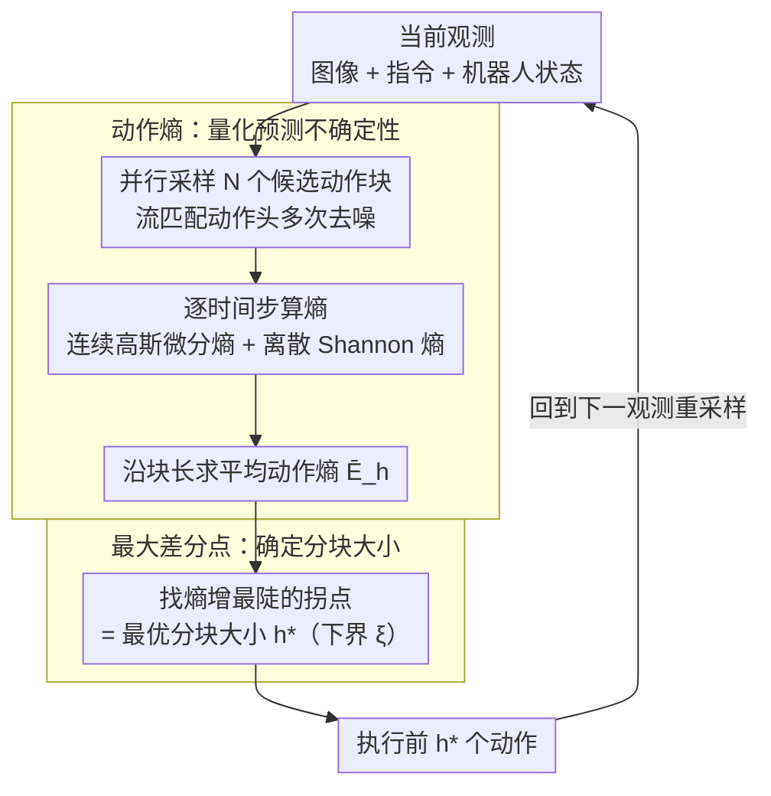

# Adaptive Action Chunking at Inference-time for Vision-Language-Action Models

**会议**: CVPR 2026  
**arXiv**: [2604.04161](https://arxiv.org/abs/2604.04161)  
**代码**: [https://lance-lot.github.io/adaptive-chunking.github.io/](https://lance-lot.github.io/adaptive-chunking.github.io/)  
**领域**: 机器人 / VLA模型  
**关键词**: 动作分块, VLA模型, 自适应推理, 动作熵, 机器人操作

## 一句话总结
提出自适应动作分块(AAC)策略，利用动作熵作为线索在推理时动态确定最优分块大小，无需额外训练或架构修改，在RoboCasa和LIBERO等基准上持续提升GR00T N1.5和π0.5的任务成功率。

## 研究背景与动机

**领域现状**：VLA模型中，动作分块（一次性执行一组动作而不中间重新规划）是提高机器人操作能力的关键技术。当前主流VLA模型（GR00T N1.5、π0、SmolVLA）都使用固定的分块大小。

**现有痛点**：(1) 大分块→响应性差，无法及时适应新信息；(2) 小分块→mode-jumping，分块间不连续导致抖动；(3) **不同任务的最优分块大小不同**（实验证明：同一模型在不同RoboCasa任务上，最优分块从4到16不等）。现有方法如ACT用EMA平滑、BID搜索最优分块，但都使用固定大小。

**核心矛盾**：需要在一致性（大分块）和反应性（小分块）之间动态平衡，但固定分块大小无法实现。

**切入角度**：动作熵反映预测的不确定性——低熵→高可靠性→可执行大分块；高熵→低可靠性→应缩小分块频繁重新规划。

**核心idea**：计算不同分块大小对应的平均动作熵，找最大差分点确定最优分块大小。

## 方法详解

### 整体框架
AAC 想解决的是「分块大小该多大」这个被现有 VLA 写死成超参的问题，而且它不碰训练、不改架构，纯粹塞进推理循环里。每来一个新观测，模型先并行采样 N 个候选动作块，然后沿着块内每个未来时间步算出**动作熵**，得到一条「熵随分块长度增长」的曲线；接着在这条曲线上找熵增最陡的拐点（**最大差分点**），把它当成本步该用的分块大小 $h^*$，执行前 $h^*$ 个动作后再回到观测、重新采样。整套流程的直觉是：模型自己有多确定，就让它一口气走多远。

### 关键设计

**1. 动作熵：把「模型对未来多确定」量化成一条曲线**

痛点在于分块大小本质上要回答「这组预测往后第几步开始不可信」，而这件事没有现成的标尺。AAC 用 N 个候选块在每个时间步上的发散程度来度量不确定性，并且区分两类动作分别计算。连续动作（平移、旋转）服从高斯，用微分熵 $E_t = \frac{1}{2}\log\!\big[(2\pi e)^d \det(\Sigma_t)\big]$，其中协方差 $\Sigma_t$ 直接从 N 个候选块在该步的取值估出；离散动作（夹爪开合）用 Shannon 熵 $E_{dis} = -\sum p(a)\log p(a)$，概率 $p(a)$ 用候选里各取值的频率估计。把同一步上平移、旋转、夹爪三项相加，再沿块长 $h$ 做平均，就得到平均动作熵

$$\bar{E}_h = \frac{1}{h}\sum_{i=t}^{t+h-1}\sum_{j \in \{t,r,g\}} E_j^i$$

它正是后续选分块大小所依赖的那条曲线。这样做的好处是熵完全由现成的多次采样估出，连续和离散动作用同一套加和框架，不挑机器人形态。

**2. 最大差分点：从哪一步起再走就不靠谱了**

有了 $\bar{E}_h$ 曲线还得回答「在哪截断」。AAC 的判据是找平均熵增长最快的那一步：

$$h^* = \max\Big(\arg\max_h(\bar{E}_{h+1} - \bar{E}_h),\ \xi\Big)$$

差分 $\bar{E}_{h+1} - \bar{E}_h$ 最大的位置，意味着从这个分块长度往后再多执行一步，不确定性就会陡增——所以这里正是一致性（大分块省重规划）和反应性（小分块能及时纠偏）之间的最佳切换点，超过它就是在拿可靠性换效率。外层再套一个下界 $\xi$，保证分块不会缩到太小，既维持最小动作幅度、又避免每步都重规划带来的计算开销。算出 $h^*$ 后执行前 $h^*$ 个动作，再回到新观测重新采样。

这条判据为什么有效，从它在实机上自然涌现的行为就能看出：因为分块大小完全跟着熵走，机械臂靠近目标物体、需要精细对位时预测发散、熵高，$h^*$ 自动缩小、频繁重规划；进入长距离运输、轨迹平滑可预测时熵低，$h^*$ 放大、一口气高效移动。这条「分块大小随任务语义阶段起伏」的曲线和人类「粗动作大步走、精动作小步挪」的直觉吻合，论文用可视化做了验证——也从侧面印证了用熵的最大差分点定截断是合理的。

### 损失函数 / 训练策略
AAC 不引入任何训练目标，全部计算发生在推理时——熵直接从流匹配（flow-matching）动作头的多次采样里估出。因此它兼容所有基于扩散 / 流匹配的 VLA 模型，属即插即用。

## 实验关键数据

### 主实验（RoboCasa + LIBERO）

| 方法 | RoboCasa Avg | LIBERO Avg |
|------|-------------|------------|
| GR00T (h=16, 默认) | 59.7% | 94.1% |
| GR00T (h=2) | 47.0% | 90.2% |
| GR00T (h=4) | 56.2% | 92.6% |
| GR00T (h=8) | 61.2% | 94.7% |
| **GR00T + AAC** | **62.0%** | **95.0%** |

LIBERO-Long (最难子集): 88.8% → **92.8%** (+4.0%)

### 跨Backbone验证

| 方法 | LIBERO Avg |
|------|------------|
| π0.5 (基线) | 97.0% |
| **π0.5 + AAC** | **97.9%** |

### OOD鲁棒性（LIBERO-Pro位置扰动）

| 扰动级别 | GR00T | GR00T+AAC |
|----------|-------|-----------|
| ×0.2 | 基线 | +提升 |
| ×0.3 | 基线 | +提升 |
| ×0.4 | 基线 | +提升 |

### 关键发现
- **没有单一固定分块大小在所有任务上最优**：LIBERO-Spatial最优h=4，LIBERO-Goal最优h=16
- AAC在所有固定分块大小的平均值之上，且不需要任何手动调参
- 在长视界任务(LIBERO-Long)上提升最显著(+4%)，因为这类任务对反应性要求最高
- 分块大小的时间分布与任务语义阶段高度吻合：运输→大块，操作→小块

## 亮点与洞察
- **零训练开销的推理优化**：AAC完全在推理时工作，不需修改模型架构或重新训练，即插即用
- **动作熵作为通用不确定性度量**：跨连续/离散动作空间的统一熵计算框架，可泛化到不同机器人形态（单臂/双臂/人形）
- **与人类直觉的一致性**：可视化分析显示分块大小与任务语义阶段完美对应——粗操作大块、精操作小块，验证了方法的物理合理性

## 局限与展望
- N个候选块的并行采样引入额外推理延迟（N越大估计越准但越慢）
- 最大差分点策略是启发式的，不保证全局最优
- $\xi$ 最小分块下界是超参，不同任务可能需要不同值
- 当前仅在桌面操作任务上验证，更复杂的移动操作（如导航+操作组合）有待探索

## 相关工作与启发
- **vs ACT (EMA平滑)**: ACT每步生成新块用EMA融合，分块大小仍固定。AAC自适应选择大小
- **vs BID/TV-BID**: BID从多候选块中选最优块但大小固定，AAC同时自适应大小
- **vs 基于RL的自适应方法**: 需要额外训练和任务特定奖励信号，AAC无需训练

## 评分
- 新颖性: ⭐⭐⭐⭐ 动作熵驱动的分块选择简洁有效，但原理相对直观
- 实验充分度: ⭐⭐⭐⭐⭐ 多基准、多backbone、OOD测试、真机实验、定性分析全面
- 写作质量: ⭐⭐⭐⭐⭐ 动机清晰、方法简洁、可视化出色
- 价值: ⭐⭐⭐⭐⭐ 对VLA部署有直接实用价值，零开销即插即用

<!-- RELATED:START -->

## 相关论文

- [\[CVPR 2026\] SaPaVe: Towards Active Perception and Manipulation in Vision-Language-Action Models for Robotics](sapave_active_perception_manipulation_vla_roboti.md)
- [\[CVPR 2026\] QuantVLA: Scale-Calibrated Post-Training Quantization for Vision-Language-Action Models](quantvla_scale-calibrated_post-training_quantization_for_vision-language-action_.md)
- [\[ICLR 2026\] Real-Time Robot Execution with Masked Action Chunking](../../ICLR2026/robotics/real-time_robot_execution_with_masked_action_chunking.md)
- [\[CVPR 2026\] AVA-VLA: Improving Vision-Language-Action models with Active Visual Attention](ava_vla_improving_vision_language_action_models_with_active_visual_attention.md)
- [\[CVPR 2026\] HiF-VLA: Hindsight, Insight and Foresight through Motion Representation for Vision-Language-Action Models](hif-vla_hindsight_insight_and_foresight_through_motion_representation_for_vision.md)

<!-- RELATED:END -->
