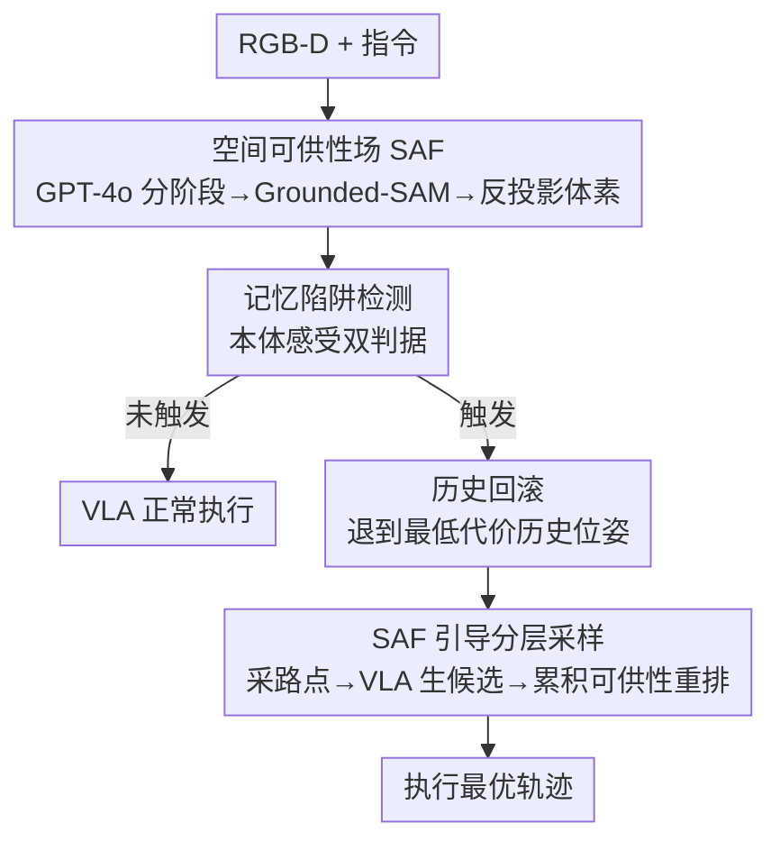

# Affordance Field Intervention: Enabling VLAs to Escape Memory Traps in Robotic Manipulation

**会议**: CVPR 2026  
**论文**: [CVF Open Access](https://openaccess.thecvf.com/content/CVPR2026/html/Xu_Affordance_Field_Intervention_Enabling_VLAs_to_Escape_Memory_Traps_in_CVPR_2026_paper.html)  
**代码**: https://vla-afi.github.io/ (项目页)  
**领域**: 具身智能 / VLA 机器人操作  
**关键词**: VLA, 空间可供性场, 记忆陷阱, 分布偏移, 即插即用干预

## 一句话总结
针对 VLA 模型在场景扰动下"照搬训练轨迹、把机械臂开向旧位置"的记忆陷阱问题，本文用一个无需训练的 3D 空间可供性场（SAF）作为即插即用插件：靠本体感受检测陷阱、回滚到安全历史位姿、再用 SAF 采样路点并对 VLA 候选轨迹按累积可供性打分重排，在真实平台 OOD 场景上平均提升 23.5%。

## 研究背景与动机
**领域现状**：Vision-Language-Action（VLA）模型把视觉观测 + 语言指令端到端映射成动作序列，靠大规模模仿学习成为机器人操作的主流"运动规划器"，能完成抓取、重排等多样任务且无需逐任务工程。

**现有痛点**：这类端到端模型在分布偏移（OOD）下很脆弱——当目标物体被挪动、换色、换背景时，VLA 不去适配新场景，而是**机械地复现训练时记住的轨迹**，把末端执行器（EEF）开向物体原来的位置。作者把这个失败模式命名为"记忆陷阱（Memory Trap）"。

**核心矛盾**：根因在端到端设计本身——VLA 只是隐式拟合"视觉语言输入→动作"的映射，缺乏对 3D 空间中"哪里可交互"的显式感知与推理，因此在陌生环境里没有真正的规划能力，只能退回背诵的轨迹。已有的可供性方案（如 VoxPoser、ReKep 这类 VLM 规划器）虽能生成 3D 可供性场，但成功率低：一是 VLM 生成的运动计划缺乏细粒度几何理解、常给出物理不可行的动作；二是严重依赖逐任务的 prompt 工程，脆弱且跨场景不可迁移。

**本文目标**：在**不重训、不加演示数据、不改 VLA 参数**的前提下，让 VLA 能从记忆陷阱里逃出来，导航到高可供性区域，从而提升成功率。

**切入角度**：把"语义理解强但几何弱"的 VLA 和"几何约束强但运动规划弱"的可供性场做职责分工——SAF 只在需要时介入，给出 3D 几何线索作为"软约束"，而具体动作仍交给 VLA 生成，取两者之长。

**核心 idea**：把 3D 空间可供性场（SAF）当成 VLA 的一个**按需插件**——检测到记忆陷阱时才触发"回滚 + SAF 引导采样 + 可供性打分重排"的闭环干预，用显式空间锚点打破 VLA 的僵化背诵。

## 方法详解

### 整体框架
系统输入是 RGB-D 观测 + 语言指令，输出是真实执行的动作轨迹。底座是任意预训练 VLA（π0 / π0.5 等），SAF 作为旁路插件挂在上面。

整条流程分两层。**离线/前置层**先构建 SAF：用 GPT-4o 把指令分解成有序子目标（pick→move→place）并抽出每阶段目标词（如"carrot""blue pan"），把目标词喂给 Grounded-SAM 做开放词表分割得到 2D mask，再结合深度图与相机内参反投影到 3D，配合场景点云在 $N\times N\times N$ 体素网格上算出连续可供性代价场 $V_\text{SAF}$（值越低越"好"：靠近目标、远离障碍）。**在线干预层**是本文核心：每个时间步监控 EEF 状态检测记忆陷阱；一旦触发，先回滚到历史低代价位姿，再做两阶段树搜索——先用 SAF 采样若干中间路点，再让 VLA 在每个路点生成多条候选轨迹，最后用 SAF 对所有候选按累积可供性打分、选最优执行。整个干预不更新任何参数，纯靠几何线索"软纠偏"。

### 关键设计

**1. 空间可供性场（SAF）构建：把语言目标变成可打分的 3D 代价场**

这是后续一切干预的"度量衡"，解决"VLA 不知道哪里可交互"的根本缺失。SAF 不是单一标量，而是两个互补子场的加权融合。**目标引导场** $V_\text{target}$ 编码对目标的吸引：对每个体素 $v_{ijk}$ 算它到目标质心 $c_\text{target}=\frac{1}{|P_\text{target}|}\sum_{p\in P_\text{target}}p$ 的欧氏距离并做距离变换，离目标越远代价越高，从而把 EEF 往目标"拉"。**障碍回避场** $V_\text{obst}$ 编码对场景障碍的排斥：被场景点云占据或临近障碍的体素赋高代价；为避免过度保守，还做启发式掩膜——豁免 EEF 紧邻区域（允许近距操作）、在目标周围留缓冲带（允许抓取所需的接近动作）。两者线性融合：

$$V_\text{SAF} = w_\text{target} V_\text{target} + w_\text{obst} V_\text{obst}$$

再对两个子场做欧氏距离变换、高斯平滑（核 $\sigma$）以保证空间梯度平滑，最后归一化到 $[0,1]$。值越低代表越"宜动"。值得注意的是当 VLM 检测到子目标切换（如从抓盖子转到放盖子）时，目标识别会自动更新，SAF 随之动态重建，支撑多阶段任务。

**2. 基于本体感受的记忆陷阱检测：只在真陷阱时才介入**

要解决"何时该干预"。如果一直干预会破坏 VLA 在目标附近的精细操作，所以需要精准识别。本文用机械臂自身的本体感受（proprioception），在两个条件**同时满足**时才判定陷阱：(1) 一个时间窗 $\Delta t$ 内 EEF 位移 $\lVert p_t - p_{t-\Delta t}\rVert$ 低于阈值 $\epsilon_\text{stuck}$；(2) 当前到目标距离 $\lVert p_t - c_\text{target}\rVert$ 超过阈值 $\epsilon_\text{far}$。第一个条件抓"准静止"状态，但准静止既可能是靠近目标时的精细抓取、也可能是卡死；第二个条件正是用来消歧——如果 EEF 静止却**离目标还很远**，说明它卡住或在抓错对象，而非在做合理的精细操作。这套双判据保证只在真正的记忆陷阱出现时干预，避免在目标附近合理停顿时误触发。

**3. 可供性引导的历史回滚：先退到安全起点再纠偏**

检测到陷阱后，VLA 此刻往往已偏离到一个糟糕位姿，直接在原地采样路点也救不回来（消融里去掉回滚成功率从 65% 掉到 40%）。本文维护一个长度 $M$ 的历史位姿缓冲 $P_\text{hist}=\{p_{t-M},\dots,p_{t-1}\}$，把回滚目标选为其中 SAF 代价最低的位姿：

$$p_\text{rollback} = \arg\min_{p\in P_\text{hist}} V_\text{SAF}(p)$$

机械臂执行一段短回滚轨迹回到 $p_\text{rollback}$，它既是一个安全低代价状态、又充当后续树搜索的根节点。这一步把"已经跑偏"的影响先消掉，给后面的重定向一个干净起点。

**4. 分层探索选最优轨迹：SAF 选路点、VLA 补动作、SAF 再打分**

这是干预的落点，把 SAF 的空间推理和 VLA 的任务能力拼起来。从 $p_\text{rollback}$ 出发做两阶段树搜索。**阶段一·SAF 局部采样中间路点**：在半径 $r$ 的局部邻域 $\mathcal{N}(p_\text{rollback}, r)$ 里采样候选位置，取代价最低的 $N$ 个作为一级子节点（论文实证 $N=10$ 最优）：

$$\{p_i^\text{way}\}_{i=1}^N = \mathop{\arg\min{}^N}_{p\in\mathcal{N}(p_\text{rollback}, r)} V_\text{SAF}(p)$$

这些路点是"空间上有利的中间靶点"，把机械臂往低代价区引、打破对旧轨迹的背诵。**阶段二·VLA 在路点生成轨迹**：机械臂依次导航到每个路点 $p_i^\text{way}$，在更新后的观测上查询 VLA 生成 $K$ 条多样候选动作（扩散类策略用不同噪声温度/种子采样）；每条候选是一个动作 chunk（horizon $H$ 的关节序列），用正运动学转成 EEF 轨迹 $\xi_{i,k}=\{p_j^{i,k}\}_{j=1}^H$，再算累积可供性代价：

$$\mathcal{V}(\xi_{i,k}) = \sum_{j=1}^{H} V_\text{SAF}(p_j^{i,k})$$

由此得到 $N\times K$ 个叶节点候选，全局选累积代价最小者执行：$\xi^* = \arg\min_{i,k}\mathcal{V}(\xi_{i,k})$。这种"SAF 管选路点、VLA 管补轨迹、SAF 管打分重排"的分工，让几何约束以软约束形式介入，而不替代 VLA 的语义与抓取能力。

## 实验关键数据

### 主实验（真实机械臂 AgileX Piper）
每个任务每种场景 20 次试验报成功率。下表为四个任务在五种条件（同分布 + 位置/颜色/任务属性/背景四种 OOD）下的平均成功率，AFI 全面优于裸 VLA。

| 任务 | 方法 | 平均成功率 | 相对提升 |
|------|------|-----------|---------|
| Place Carrot | ReKep（VLM 规划器） | 36.0% | — |
| Place Carrot | π0 | 61.0% | — |
| Place Carrot | π0-AFI | **87.0%** | ↑26.0% |
| Remove Lid | π0 → π0-AFI | 63.0% → **80.0%** | ↑17.0% |
| Slot Pen | π0 → π0-AFI | 60.0% → **82.0%** | ↑22.0% |
| Stack Tape | π0 → π0-AFI | 64.0% → **86.0%** | ↑22.0% |
| Stack Tape | π0.5 → π0.5-AFI | 61.0% → **82.0%** | ↑21.0% |
| Stack Tape | π0+π0.5-AFI（集成） | — → **89.0%** | ↑25.0% |

整体真实平台 OOD 平均提升 23.5%。最难的 Task shift（物理属性变化 + 干扰物）也有大幅改善，如 Remove Lid 加干扰物从 25% 提到 55%（+30%）。对比纯 VLM 规划器 ReKep 仅 36%，印证"VLM 懂语义但缺细粒度运动规划"，混合方案才能两者兼得。骨干无关性也得到验证：OpenVLA-OFT（自回归）和 SpatialVLA（带深度的 3D 感知）分别 +20%、+25%。

### 仿真（LIBERO-Pro，加空间扰动）

| 套件 | π0.5 | π0.5-AFI |
|------|------|----------|
| LIBERO-Spatial（表内均值行） | 54.0% | 75.7% |
| LIBERO-Object（表内均值行） | 56.4% | 73.2% |

⚠️ 论文正文叙述给出的均值与上表"Average"行不一致：正文写 Spatial 78.2% vs 52.4%、Object 82.5% vs 67.3%，而表 2 的 Average 行是 75.7% vs 54.0% 和 73.2% vs 56.4%；摘要又概括为 LIBERO 整体 +20.2%。此处以原文表格为准，具体数字以原文为准。无论按哪套口径，结论方向一致：AFI 在空间扰动下显著提升。子任务里提升最猛的是 Place(salad dressing) 16%→64%、Pick(next to plate) 54%→82% 这类强扰动场景。

### 消融实验

| 配置（位置偏移场景，20 次） | 成功率 | 说明 |
|------|------|------|
| π0（裸） | 6/20 (30%) | 基线 |
| π0-AFI（完整） | 13/20 (65%) | 完整方法 |
| w/o Rollback | 8/20 (40%) | 去回滚，掉 25 个点 |
| Fixed-step at 30 | 12/20 (60%) | 固定第 30 步介入 |
| Fixed-step at 60 | 11/20 (55%) | 固定第 60 步 |
| Fixed-step at 90 | 9/20 (45%) | 固定第 90 步 |

| 路点数量 | 3 | 8 | 10 | 13 |
|----------|----|----|----|----|
| 成功率 | 35.0% | 50.0% | **65.0%** | 60.0% |

### 关键发现
- **回滚是最关键组件**：去掉后 65%→40%。没有回滚，VLA 偏离太远，SAF 路点也救不回失败位姿——回滚提供了一个安全低代价的"重启点"。
- **自适应检测胜过固定步介入**：固定步最高才 60%（Step 30），不如本体感受实时监控的 65%，说明"在陷阱真正发生时才精准介入"很重要。
- **路点数量非越多越好**：3 个太少（35%，几乎没改善），10 个最优（65%），13 个反而退化到 60%。原因是 SAF 路点是沿目标质心的近似直线路径、为空间引导而非抓取规划设计；路点太多会把 VLA 过度约束在这条直线上，虽 SAF 评分最高却常不利于实际抓取，需要给 VLA 留自主空间。
- **低延迟可实时部署**：SAF 重建 120ms/帧（RTX 4090 上 Grounded-SAM + 点云），路点生成 + 重排仅 15ms，端到端 185ms，支持 5Hz 控制；相比之下纯 MPC 优化每步 500ms+。

## 亮点与洞察
- **"记忆陷阱"是个好命名 + 好诊断**：把 VLA 在 OOD 下"开向旧位置"的现象点透，并用本体感受双判据（准静止 + 离目标远）把它和"目标附近合理停顿"区分开——这个消歧设计很巧，避免了干预破坏精细操作。
- **SAF 当"打分器 + 选路器"而非"动作生成器"**：把几何能力用在它擅长的评估/选择上，把动作生成留给 VLA，规避了 VLM 直接规划轨迹"几何不可行"的老毛病，这个职责切分可迁移到任何"强语义弱几何"的策略上。
- **即插即用、模型无关**：不改参数、不要演示数据，挂在 π0/π0.5/OpenVLA-OFT/SpatialVLA 上都涨点，还天然支持多策略集成（π0+π0.5 候选合并后 SAF 选优到 89%）——这种"外挂式鲁棒性增强"对已部署的 VLA 很有吸引力。

## 局限与展望
- **依赖外部感知链**：SAF 构建依赖 GPT-4o 分阶段 + Grounded-SAM 分割 + 深度反投影，任一环节失败（分割漏目标、深度噪声）都会污染可供性场；论文未深入分析这条链的失败传播。
- **路点是近似直线、偏向到达而非抓取**：作者自己指出路点过多会过约束抓取，说明 SAF 引导的几何先验和真实抓取姿态之间存在张力，复杂抓取（精插、堆叠）下这个矛盾可能更突出。
- **⚠️ 仿真数值口径不一致**：表 2 均值行与正文/摘要叙述对不上（见上文），削弱了仿真部分数字的可信度，读者需以原文表格为准。
- **改进思路**：可探索让 SAF 路点学习曲线路径或耦合抓取位姿先验，减少对 VLA 自主性的挤占；或把记忆陷阱检测从本体感受扩展到视觉一致性，覆盖"动起来但方向错"的隐性陷阱。

## 相关工作与启发
- **vs ReKep / VoxPoser（VLM 规划器）**：它们让 VLM/LLM 直接组合 3D 价值图并规划轨迹，本文只让 VLM 构建 SAF 当评分器、动作交给 VLA。区别在于把"运动生成"从 VLM 手里拿走，规避其几何不可行问题；实证 ReKep 仅 36% vs 本文 87%。
- **vs RL 微调 VLA**：RL 路线靠在线交互/奖励适配 OOD，但奖励信号难获取、扩展到大规模真实环境代价高。本文完全免训练、免奖励，靠几何外挂实现鲁棒性，部署门槛更低，但代价是不更新策略本身、纠偏能力受 SAF 质量上限约束。
- **vs SpatialVLA（3D 感知骨干）**：SpatialVLA 把深度特征烧进 VLA 参数里，本文则把 3D 推理外置成插件；二者可叠加——SpatialVLA + AFI 仍涨 25%，说明显式几何干预和隐式 3D 感知互补而非替代。

## 评分
- 新颖性: ⭐⭐⭐⭐ "记忆陷阱"命名 + SAF 作即插即用打分器/选路器的职责切分清晰，但 SAF、可供性引导、树搜索各组件多属已有工具的巧妙组合。
- 实验充分度: ⭐⭐⭐⭐ 真实平台 4 任务×5 条件 + 多骨干 + LIBERO 仿真 + 消融齐全；扣分因仿真均值数字口径不一致。
- 写作质量: ⭐⭐⭐⭐ pipeline 与公式交代清楚、图示直观；正文与表格数值不一致是瑕疵。
- 价值: ⭐⭐⭐⭐ 免训练、模型无关、低延迟可实时部署，对提升已有 VLA 的 OOD 鲁棒性有直接工程价值。

<!-- RELATED:START -->

## 相关论文

- [\[CVPR 2026\] Beyond Success: Refining Elegant Robot Manipulation from Mixed-Quality Data via Just-in-Time Intervention](beyond_success_refining_elegant_robot_manipulation_from_mixed-quality_data_via_j.md)
- [\[CVPR 2026\] PALM: Progress-Aware Policy Learning via Affordance Reasoning for Long-Horizon Robotic Manipulation](palm_progress-aware_policy_learning_via_affordance_reasoning_for_long-horizon_ro.md)
- [\[CVPR 2026\] CycleManip: Enabling Cycle-based Manipulation via Effective History Perception and Understanding](cyclemanip_enabling_cycle-based_manipulation_via_effective_history_perception_an.md)
- [\[CVPR 2026\] CycleManip: Enabling Cyclic Task Manipulation via Effective Historical Perception and Understanding](cyclemanip_enabling_cyclic_task_manipulation_via_effective_historical_percepti.md)
- [\[ICLR 2026\] MemoryVLA: Perceptual-Cognitive Memory in Vision-Language-Action Models for Robotic Manipulation](../../ICLR2026/robotics/memoryvla_perceptual-cognitive_memory_in_vision-language-action_models_for_robot.md)

<!-- RELATED:END -->
