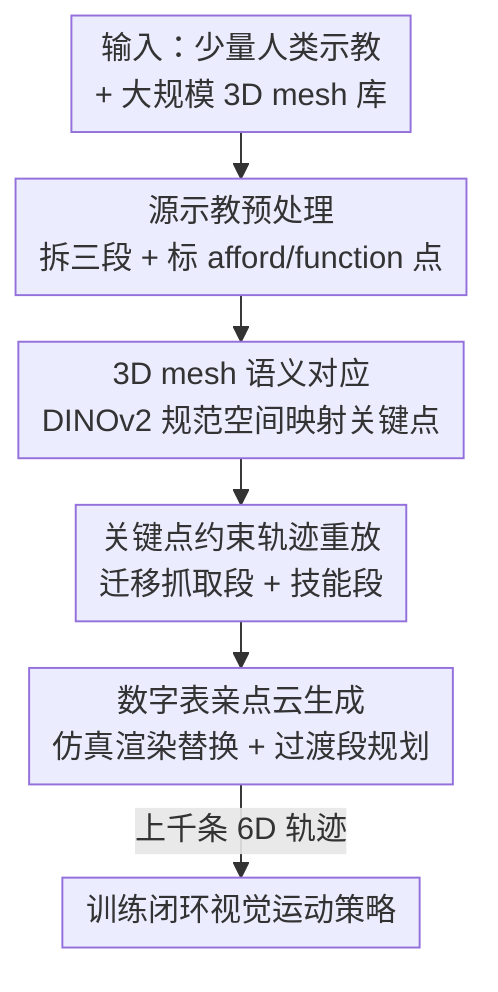

# AffordGen: Generating Diverse Demonstrations for Generalizable Object Manipulation with Affordance Correspondence

**会议**: CVPR 2026  
**论文**: [CVF Open Access](https://openaccess.thecvf.com/content/CVPR2026/html/Zhang_AffordGen_Generating_Diverse_Demonstrations_for_Generalizable_Object_Manipulation_with_Affordance_CVPR_2026_paper.html)  
**代码**: 无  
**领域**: 机器人 / 具身智能  
**关键词**: 模仿学习, 数据生成, 语义对应, affordance, 跨类别泛化  

## 一句话总结
AffordGen 把"affordance 语义对应"从在线规划信号改造成**离线数据生成的先验**：用 DINOv2 在大规模 3D mesh 之间建立关键点对应，把一条人类示教里的抓取段和技能段批量迁移到成百上千个新物体上，合成出覆盖全 6D 位姿、跨类别的轨迹数据集，再用这些数据训练闭环视觉运动策略，从而对**真正没见过的物体**实现零样本泛化。

## 研究背景与动机
**领域现状**：视觉运动模仿学习（visuomotor imitation learning）在机器人操作上效果很好，但严重依赖大规模高质量人类示教。为缓解数据瓶颈，出现了两条合成数据路线——一条是 DemoGen/CPGen 这类**轨迹自适应**，把一条示教扩展成上百条空间多样的轨迹；另一条是 GenSim/RoboGen 这类用 LLM 从零生成任务和脚本求解器。

**现有痛点**：DemoGen 一类方法本质上只对**单个物体实例**做空间增广，继承了源示教的语义范围，换一个形状不同的物体（哪怕同类别）就垮；而且它们偏重平移不变性，对不同朝向适应能力弱。另一条 affordance 路线（Robo-ABC、DenseMatcher、FUNCTO）虽然能跨类别迁移操作技能，但都是**规划中心、开环执行**——策略只是照着预先算好的轨迹走，完全依赖映射点和规划器的精度，一旦关键点被遮挡或视角差异大就失败，缺少学习型闭环策略的反应能力。

**核心矛盾**：affordance 提供了"语义泛化能力"（知道不同物体哪里能抓、哪里起作用），端到端学习提供了"闭环鲁棒性"，但二者一直被割裂——affordance 被当成静态映射信号喂给规划器，没有系统化的方法把它注入到学习型 pipeline 里。

**本文目标**：在不增加人类示教成本的前提下，让单条（或少量）示教既能跨**几何形状**又能跨**物体类别**泛化，同时保留闭环策略的反应鲁棒性。

**核心 idea**：与其在线用 affordance 做规划，不如把它当作**生成数据的指挥棒**——用语义对应把源轨迹复制到海量新 mesh 上，造出一个大而多样的 affordance-aware 数据集，再在上面训练一个反应式闭环策略，让它同时继承 affordance 的语义泛化和端到端学习的鲁棒性。

## 方法详解

### 整体框架
AffordGen 的输入是少量人类专家示教（点云 + 末端轨迹）外加一个大规模 3D mesh 库，输出是一个能在没见过的物体上工作的闭环视觉运动策略。整条 pipeline 分三步串行：先把源示教**拆解**成抓取段、技能段、过渡段并标出两个关键点；再用视觉基础模型在源 mesh 和大量目标 mesh 之间**建立 3D 关键点对应**；最后据此把任务相关段**迁移并重放**到每个新 mesh、用运动规划补全过渡段、并重渲染出对齐的混合点云，从而把一条示教扩成上千条轨迹。这批数据再喂给 DP3 风格的闭环策略训练。

任务被形式化为三个阶段 $\Omega=\{\Omega_G, \Omega_S, \Omega_T\}$：$\Omega_G$ 抓取阶段（夹爪闭合握住物体）、$\Omega_S$ 技能阶段（操纵物体完成任务，如把茶倒进杯子）、$\Omega_T$ 过渡阶段（无碰撞地连接前两者）。每个时刻策略接收点云观测 $o^e_t$ 和本体感受 $o^s_t$，输出动作 $a_t$。用点云做输入是因为它在 3D 空间里结构简单、便于直接编辑来生成新数据。

### 关键设计

**1. 源示教预处理：把一条轨迹拆成可迁移的语义部件**

要复用示教，先得知道哪些信息值得复用。AffordGen 从一条专家示教里抽三类信息：夹爪闭合时刻 $t_{grasp}$（直接从末端状态读出）、真正决定任务成败的**技能段** $\tau_s$（用 VLM 的视频推理能力检测或人工标注），以及操纵物体上的两个关键点——**affording point**（夹爪与物体的接触点，决定"抓哪里"）和 **function point**（物体作用于目标物的点，如壶嘴、刀刃，决定"用哪里干活"），两点都定义在 3D 空间并由 VLM/人标出。点云侧则用 SAM2 把 RGB 图分成 robot/object/goal/others 四类，把 2D 标签映射回点云，再去掉背景地面、用最远点采样（FPS）下采样得到工作空间点云 $O^e\subset\mathbb{R}^3$。这一步的意义在于：把"一条连续轨迹"解构成"语义部件 + 关键点"，后面才谈得上把部件搬到别的物体上。

**2. 3D mesh 上的语义对应：DINOv2 在规范空间里跨物体配点**

源物体的关键点要搬到新 mesh，就得知道新 mesh 上的对应位置在哪。2D 语义对应已经很成熟，但机器人操作要的是**精确的 3D 对应**；已有的 3D 对应方法（如 DenseMatcher）只在小数据集上训练过，精度不够。作者的做法简单有效：先用 6D 位姿估计器把所有 mesh 归一化到统一的**规范空间（canonical space）**，再把 2D 对应抬升到 3D。具体地，对源关键点 $x\in\mathbb{R}^3$，从 $n$ 个相机视角并行渲染 RGB-D 图 $I_i$，每张图过 DINOv2 得到语义特征 $S_i$；取 $x$ 邻域内 $m$ 个 mesh 顶点 $v_j$ 投影到图上得像素 $u_{ij}$，在目标图特征空间里按余弦相似度找最匹配像素：

$$u^{tg}_{ij}=\arg\max_u \mathrm{CosSim}\!\big(S^{src}_i[u_{ij}],\, S^{tg}_i[u]\big),\quad w_{ij}=\mathrm{CosSim}\!\big(S^{src}_i[u_{ij}],\, S^{tg}_i[u^{tg}_{ij}]\big).$$

把所有匹配像素反投影回 3D 得到候选对应 $v^{tg}_{ij}$ 及其相似度权重 $w_{ij}$，最后加权平均出目标关键点 $x'=\frac{\sum_{i,j} w_{ij} v^{tg}_{ij}}{\sum_{i,j} w_{ij}}$。规范空间 + 多视角投票让对应在跨实例甚至跨类别时仍然稳定。

**3. 关键点约束的轨迹重放：把抓取段和技能段搬到新物体上**

有了对应点，怎么把源轨迹真正"长"到新物体上？作者基于一个朴素但关键的假设：**同一功能类（function class）的物体，末端相对 affording point 的轨迹相似，function point 相对目标物的轨迹也相似**。这里"功能类"比"物体类别"更宽——茶壶和马克杯都属于"往杯里倒水"这一功能类。于是抓取段 $\tau_g$ 先归一化到源 mesh 局部系 $[\tau_g]_{local}=T_{init}^{-1}\cdot[\tau_g]_{world}$，再平移到新 affording point：$[\tau'_g]_{local}=[\tau_g]_{local}-x_{aff}+x'_{aff}$。技能段则先用末端到 function point 的相对变换 $T^{fun}_{ee}$ 把 $\tau_s$ 转成 function point 轨迹，归一化后再平移到新 function point：$[\tau'_{fun}]_{local}=[\tau_{fun}]_{local}-x_{fun}+x'_{fun}$。对任意随机位姿 $T'$，新轨迹就能解出 $[\tau'_g]=T'\cdot[\tau'_g]_{local}$、$[\tau'_s]=T^{ee}_{fun}\cdot T'\cdot[\tau'_{fun}]_{local}$，每个 waypoint 的关节角再由逆运动学（IK）求解。这一步是 DemoGen 只做"单物体空间平移"和 AffordGen 做"跨物体 + 全 6D 位姿"的分水岭——关键点对应把"任务语义"绑在了物体的功能部位上，而不是物体的绝对坐标上。至于信息量最少的过渡段 $\tau_m$，因为不涉及动态交互，直接当成无碰撞自由运动，用运动规划或球面线性插值（slerp）补出来：$\tau'_m=\mathrm{MotionPlan}(\tau'_g[-1],\tau'_s[0])$。

**4. 数字表亲点云生成：让点云跟着新轨迹和新 mesh 对齐**

光有新轨迹还不够，作为策略输入的点云也要跟着变成"新物体在新位姿下"的样子。DemoGen 因为只做位置平移，简单地对原点云全局平移旋转就够；但 AffordGen 要的是工作空间内**多样的 3D 模型 + 多样 6D 位姿**，全局变换满足不了。作者的做法是直接从仿真里渲染机器人和被操纵物体的点云，**替换掉**源示教里对应的部分，得到一份真实-仿真混合点云——既缓解了 sim-to-real gap，又省掉了在仿真里完整重建整个场景的繁琐。整个渲染用并行方式保证吞吐量，并对技能段做了专门修改来处理遮挡问题。最终一条源示教被扩成上千条带配对动作和观测的 affordance-aware 轨迹。

## 实验关键数据

### 主实验
仿真用 ManiSkill3，构造茶壶倒水、挂马克杯、切菜、整理鞋子四个任务；每个任务只采 1 条专家示教生成 1000 条轨迹，mesh 随机分成 seen（用于生成）和 unseen（用于评测），每个 mesh 测 50 次随机初始位姿。对比 DemoGen 和 CPGen。下表为同类别泛化的 unseen 成功率（节选最优 100×10 配置等）：

| 方法 (Mesh×Demo) | 茶壶倒水 unseen | 挂马克杯 unseen | 切菜 unseen | 整理鞋子 unseen |
|--------|------|------|------|------|
| DemoGen (1×1000) | 0.131 | 0.402 | 0.224 | 0.212 |
| CPGen (1000×1) | 0.169 | 0.502 | 0.424 | 0.266 |
| **AffordGen (100×10)** | 0.519 | **0.707** | 0.510 | **0.588** |
| **AffordGen (50×20)** | **0.553** | 0.664 | 0.535 | 0.302 |

在 source mesh 上三者都能做到空间泛化（保持源物体任务信息），但在 unseen 物体上 AffordGen 在最优配置下平均比最强 baseline 高 **24.1%**。真实世界（每任务 10 条示教生成 1000 条）也是同一模式，AffordGen 在 unseen 物体上稳定超过 DemoGen/CPGen，并额外对比了规划型的 FUNCTO——FUNCTO 在关键区域清晰时（如切菜）尚可，但遇到大朝向变化和遮挡（如挂马克杯）就成为最差，印证了开环规划对关键点精度的脆弱依赖。

### 零样本跨类别
把茶壶倒水→马克杯倒水、挂马克杯→挂手提包、切菜→锯切，直接用生成数据训练新类别策略的成功率：

| 方法 | 茶壶→马克杯(仿真) | 马克杯→手提包(仿真) | 刀→锯(仿真) | 茶壶→马克杯(真实) |
|------|------|------|------|------|
| DemoGen | 0.70% | 0.27% | 1.56% | 0/27 |
| CPGen | 2.70% | 0.67% | 1.11% | 3/27 |
| **AffordGen** | **55.00%** | **83.07%** | **40.22%** | **14/27** |

AffordGen 是唯一在跨类别物体上取得**有意义非零成功率**的方法，baseline 几乎全军覆没。

### 关键发现
- 关键点语义对应是跨类别泛化的根本：DemoGen/CPGen 只增广源物体几何，换类别直接归零，而 AffordGen 靠 afford/function point 对应把技能"长"到功能相同的新物体上。
- 物体级生成能力**先升后降**：随着把生成扩展到更多 unseen 物体，泛化能力先涨后跌，作者指出这为未来跨实例生成工作给出了警示（生成范围并非越大越好）。⚠️ 论文未给出该拐点的精确量化，以原文为准。
- 闭环训练补上了规划型方法的短板：在大规模生成数据上训练后，策略隐式学到了 afford point、function point 与物体形状的关系，有效化解了规划型方法常见的关键点遮挡问题。

## 亮点与洞察
- **affordance 用法的范式转换**：把 affordance 从"在线规划的映射信号"重新定位成"离线数据生成的先验"，一句话点破了 affordance 语义泛化与端到端闭环鲁棒性之间长期割裂的痛点——这是全文最"啊哈"的地方。
- **规范空间 + 多视角 DINOv2 投票**做 3D 关键点对应，绕开了"需要在大规模 3D 数据上专门训练对应模型"的死胡同，用现成 VFM 就拿到了跨类别精度，这个 trick 可迁移到任何需要跨实例 3D 配点的任务。
- **数字表亲点云**（仿真渲染替换真实点云）巧妙地在"全局变换太弱"和"完整仿真重建太贵"之间找到中间路线，既给了 6D 位姿多样性又压住了 sim-to-real gap。
- 把"功能类"概念显式提出来（茶壶和马克杯同属"倒水"功能类），为"什么物体之间可以互相迁移技能"给了一个可操作的判据。

## 局限与展望
- 强依赖 afford/function point 的标注质量与 VLM 的技能段检测，两个关键点选错或语义对应失配会直接污染整批生成数据。
- 功能类假设（末端相对 afford point、function point 相对目标物的轨迹"相似"）对刚性、单步交互任务成立，但对柔性物体、多步精细装配、需要力反馈的任务是否成立存疑（论文任务都是刚体短程操作）。
- 物体级生成能力"先升后降"说明盲目扩大生成物体范围会反噬，如何自动判定生成边界仍是开放问题。
- 过渡段用运动规划/插值粗略补全，长程多物体任务（如整理鞋子）成功率明显偏低，过渡段的质量可能是瓶颈之一。

## 相关工作与启发
- **vs DemoGen**: DemoGen 用纯合成 pipeline 从点云编辑生成配对观测-动作，但只对单物体做空间平移增广，换形状/类别就失效；AffordGen 在 DemoGen 风格的轨迹合成之上，用关键点对应把生成扩展到跨实例、跨类别和全 6D 位姿，泛化范围质变。
- **vs CPGen**: CPGen 通过拉伸/变形源 mesh 增加形状多样性，比 DemoGen 在 unseen 上更好，但仍局限于源物体的几何变体，跨类别几乎为零；AffordGen 直接换成语义对应的新 mesh，跨类别成功率高一两个数量级。
- **vs FUNCTO（规划型 affordance）**: FUNCTO 靠 LLM+VFM 做关键点对应后开环规划执行，对应点一被遮挡/视角差异大就崩；AffordGen 把 affordance 当生成源、训练闭环策略，把语义知识"内化"进反应式策略，规避了开环规划的脆弱性。

## 评分
- 新颖性: ⭐⭐⭐⭐⭐ 把 affordance 从在线规划信号改造成数据生成先验，是清晰且有说服力的范式转换
- 实验充分度: ⭐⭐⭐⭐ 仿真+真实、同类别+跨类别都覆盖，但任务均为刚体短程操作，缺力反馈/柔性场景
- 写作质量: ⭐⭐⭐⭐ 三步 pipeline 与公式推导清晰，"功能类""先升后降"等概念点明到位
- 价值: ⭐⭐⭐⭐⭐ 用一条示教换上千条跨类别轨迹，数据效率提升对真实机器人学习有直接实用意义

<!-- RELATED:START -->

## 相关论文

- [\[CVPR 2025\] ManiVideo: Generating Hand-Object Manipulation Video with Dexterous and Generalizable Grasping](../../CVPR2025/robotics/manivideo_generating_hand-object_manipulation_video_with_dexterous_and_generaliz.md)
- [\[ICLR 2026\] MoMaGen: Generating Demonstrations under Soft and Hard Constraints for Multi-Step Bimanual Mobile Manipulation](../../ICLR2026/robotics/momagen_generating_demonstrations_under_soft_and_hard_constraints_for_multi-step.md)
- [\[CVPR 2026\] GraspLDP: Towards Generalizable Grasping Policy via Latent Diffusion](graspldp_towards_generalizable_grasping_policy_via_latent_diffusion.md)
- [\[CVPR 2026\] BiPreManip: Learning Affordance-Based Bimanual Preparatory Manipulation through Anticipatory Collaboration](bipremanip_learning_affordance-based_bimanual_preparatory_manipulation_through_a.md)
- [\[CVPR 2026\] AdaDexTrack: Dynamic Modulation for Adaptive and Generalizable Dexterous Manipulation Tracking](adadextrack_dynamic_modulation_for_adaptive_and_generalizable_dexterous_manipula.md)

<!-- RELATED:END -->
