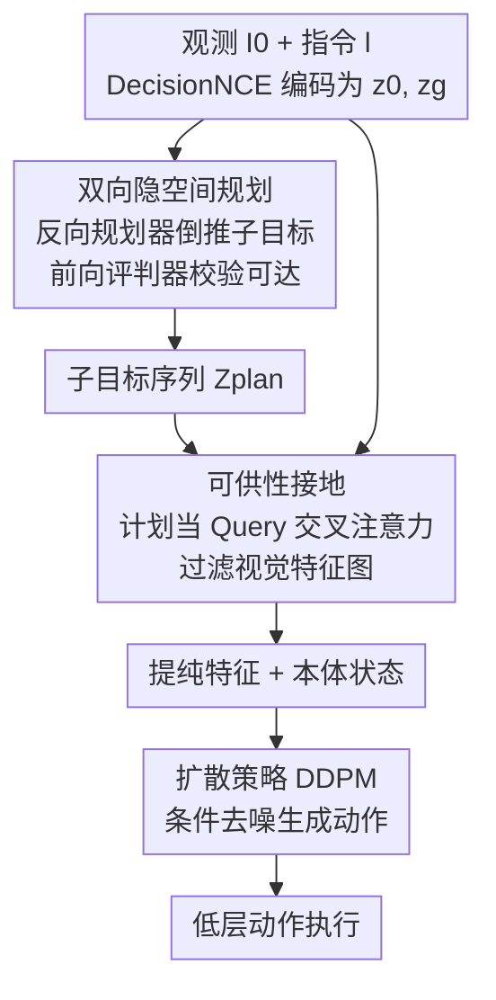

# AGiLe: Learning Robust Long-Horizon Manipulation via Affordance-Grounded Bidirectional Latent Planning

**会议**: CVPR 2026  
**论文**: [CVF Open Access](https://openaccess.thecvf.com/content/CVPR2026/html/Chen_AGiLe_Learning_Robust_Long-Horizon_Manipulation_via_Affordance-Grounded_Bidirectional_Latent_Planning_CVPR_2026_paper.html)  
**代码**: 项目主页 https://agile-long.github.io （未见公开代码）  
**领域**: 机器人 / 具身智能  
**关键词**: 长程操作, 隐空间规划, 视觉可供性, 扩散策略, 语言引导操作

## 一句话总结
AGiLe 用「反向规划器 + 前向评判器」联合训练生成既贴合目标又动态可达的隐空间子目标序列（时间鲁棒性），再把这些抽象子目标当 Query 通过交叉注意力过滤视觉特征、隐式地接地到像素级可供性来驱动动作（空间鲁棒性），在 LIBERO-LONG 上平均成功率 97.1%，比此前最强基线 LBP 提升 8.5%。

## 研究背景与动机
**领域现状**：长程操作（long-horizon manipulation）的主流范式是「高层子目标规划 + 低层策略执行」分层做——先把"把两个摩卡壶放到灶台上"这类长任务拆成一串中间子目标，再让策略逐段执行。

**现有痛点**：这条范式在两个互不相同的维度上各有短板。一是**时间维度**：细粒度的前向预测方法（如逐帧预测的 Seer）算力开销巨大；粗粒度的前向规划方法（如 SuSIE）则会**累积误差**——早期一点小偏差会随时间滚雪球，让计划逐渐偏离最终目标。二是**空间维度**：即便计划在时间上是对的，高层抽象计划落到连续的感知-动作空间时也会"接不上地"——子目标"抓住第一个壶"逻辑上没问题，但策略可能因视觉歧义找不到精确抓取点。

**核心矛盾**：近期的隐空间反向规划 LBP 从最终目标倒推子目标，缓解了时间漂移，但它**单向**——倒推出的计划可能与当前状态不一致、不可达；而且 LBP 根本没碰空间接地问题。所以一个鲁棒框架必须**同时**拿下时间鲁棒性（连贯一致的子目标序列）和空间鲁棒性（有效的感知接地），而现有方法总是顾此失彼。

**本文目标**：在一个统一框架里同时解决"计划要时间上连贯可达"和"计划要空间上接地到像素"两个问题。

**切入角度**：作者把执行问题显式拆成"做什么"（what to do，由计划负责）和"怎么做"（how to do it，由可供性接地负责），并让规划本身从单向倒推升级为双向——倒推保证逻辑连贯、前向校验保证可达。

**核心 idea**：用「反向规划器 + 前向评判器」的双向训练把可达性约束蒸馏进规划器（时间鲁棒），再用「计划当 Query 过滤视觉特征」的可供性接地把抽象计划锚到任务相关像素（空间鲁棒）。

## 方法详解

### 整体框架
AGiLe 是一个语言引导的长程操作框架，输入是初始观测 $I_0$ 和语言指令 $l$，输出是低层动作序列。整条流水线分两个串行阶段、对应两个核心创新。**第一阶段**：双向隐空间规划器在预训练 DecisionNCE 的共享隐空间里，把目标和初始状态编码为 $z_g, z_0$，反向规划器 $P_{back}$ 倒推出一段子目标序列 $Z_{plan}$，前向评判器 $V_{fwd}$ 校验这些子目标能否到达目标——两者联合优化后，规划器内化了可达性约束，推理时只用规划器即可。**第二阶段**：冻结规划器，训练可供性接地模块——把 $Z_{plan}$ 与 $z_0$ 融合成一个任务 Query，通过交叉注意力去过滤视觉骨干提取的特征图，得到只保留任务相关信息的"提纯"特征；再把它和机器人本体感知状态拼接，喂给一个条件扩散策略（DDPM）生成精确动作。

### 关键设计

**1. 双向隐空间规划：反向倒推保连贯、前向校验保可达**

这一设计针对的是 LBP 单向倒推"可能生成与当前状态不一致、不可达计划"的痛点。所有组件都在冻结的 DecisionNCE（RN50-CLIP）隐空间里工作：初始状态编码为 $z_0$、语言目标编码为 $z_g$、专家子目标编码为 $Z_{gt}=(z_1,\dots,z_K)$。**反向规划器** $P_{back}$ 由一个初始预测器 $P_{init}$ 和递归 Transformer $P_{recursive}$ 组成：先从目标倒推出最远的子目标 $\hat{z}_1 = P_{init}(\text{concat}(z_0,z_g))$，再自回归地递归生成后续子目标 $\hat{z}_i = P_{recursive}(\text{tgt}=\hat{z}_{1:i-1}, \text{memory}=[z_0,z_g])$，用余弦模仿损失对齐专家计划：$\mathcal{L}_{backward}=\sum_{i=1}^{K}\mathcal{L}_{cosine}(\hat{z}_i, z_i)$。

光有倒推还不够，还要保证倒推的计划"从当前状态真能走到目标"。**前向评判器** $V_{fwd}$ 是一个 MLP 隐空间前向模型，从任意候选子目标 $z$ 和状态 $z_0$ 预测最终目标 $\hat{z}_g = V_{fwd}(\text{concat}(z,z_0))$，并同时在专家子目标和规划器预测子目标上施加一致性约束：

$$\mathcal{L}_{fwd\_gt}=\sum_{i=1}^{K}\mathcal{L}_{cosine}(V_{fwd}(z_i,z_0),z_g), \quad \mathcal{L}_{fwd\_pred}=\sum_{i=1}^{K}\mathcal{L}_{cosine}(V_{fwd}(\hat{z}_i,z_0),z_g)$$

规划模块总损失为 $\mathcal{L}_{planner}=\mathcal{L}_{backward}+\lambda_c(\mathcal{L}_{fwd\_gt}+\mathcal{L}_{fwd\_pred})$。这里"双向"是**训练意义上**的：联合优化让评判器把"可达性/动态一致性"的知识蒸馏进规划器参数（通过 $\mathcal{L}_{fwd\_pred}$ 逼规划器满足评判），于是**推理时可直接丢掉评判器**，零额外开销就拿到时间鲁棒性。概念上这相当于一次约束模仿学习——规划器学模仿专家这个主任务，评判器当"老师"提供目标对齐的监督。

**2. 子目标的可供性接地：把抽象计划当 Query 过滤视觉特征，提纯出任务相关区域**

这一设计针对的是"计划只活在隐空间、和真实像素世界没有直接连接"的接地缺口。作者把执行拆成"看哪里"（可供性接地）和"做什么"（动作生成）两个协同子任务，用一个**多头交叉注意力**实现信息瓶颈，它吃两路输入：任务 Query 和视觉上下文。任务 Query 这样得到——原始计划 $Z_{plan}$ 是序列，先用规划器对初始状态的编码 $z_0$ 作为 query 去注意整段序列（$Z_{plan}$ 当 Key/Value），融合得 $z_{fused}=F_{fuse}(z_0,Z_{plan})$，再经线性投影 $P_{proj}$ 得到 $q_{task}$。视觉上下文则来自视觉骨干（Swin Transformer，训练中微调）对观测 $I_t$ 提取的特征图 $F_{vis}\in\mathbb{R}^{B\times D_v\times H'\times W'}$，展平成序列 $V_{seq}$ 当 Key/Value。

核心接地一步显式计算"任务意图"与"空间视觉上下文"的对齐：$\mathbf{A}, f_{temp}=\text{CrossAttn}(\text{Query}=q_{task},\ \text{Key}=V_{seq},\ \text{Value}=V_{seq})$。这一步有两个关键产物：注意力权重 $\mathbf{A}$ reshape 后就是一张**隐式、动态的可供性图**，高亮出 $I_t$ 中与任务 query 最相关的区域；输出 $f_{temp}$ 是可供性加权的视觉证据，再过一个标准 Transformer 块得 $f_{attended}=\text{LayerNorm}(f_{temp}+\text{FFN}(f_{temp}))$，作为信息瓶颈只保留任务相关特征。和传统做法（用大量显式可供性标注做监督/自监督预测）不同，AGiLe 把可供性当**结构引导**而非独立预测任务，端到端学会让抽象子目标对齐到任务相关视觉区域，无需任何可供性标注。

**3. 扩散策略 + 统一动作损失：让接地的提纯特征端到端驱动精确动作**

可供性接地给出任务相关特征 $f_{attended}$，最后一步是把它变成精确动作。作者用一个条件去噪扩散概率模型（DDPM）当策略解码器 $\pi_\theta$，在扩散时间步 $k$ 上预测加噪专家动作 $a_t^k$ 里的噪声 $\epsilon$，条件是融合上下文 $c_{fused}=\text{concat}(f_{attended}, p_t)$（$p_t$ 为本体感知状态）：

$$\mathcal{L}_{action}=\mathbb{E}_{t,k,a_t,\epsilon,c}\left[\|\epsilon-\epsilon_\theta(a_t^k,k,\text{concat}(f_{attended},p_t))\|^2\right]$$

关键在于这是一个**统一损失**同时更新策略解码器和可供性模块（交叉注意力 + 投影层）——动作误差的梯度同时流回两边，逼着注意力权重 $\mathbf{A}$ 学到"对降低最终动作误差直接有用"的对齐，确保接地是任务相关的、而不是为了重建画面而注意。这就把"看哪里"和"做什么"真正绑在一个目标上协同训练。

### 损失函数 / 训练策略
两阶段训练：第一阶段训双向规划器（$\mathcal{L}_{planner}$）后冻结；第二阶段端到端训可供性接地模块 + 扩散策略（$\mathcal{L}_{action}$）。所有组件共享冻结的 DecisionNCE RN50-CLIP 隐空间。优化器 AdamW + 余弦退火 + 线性 warmup，在 2 张 NVIDIA A5000 上用 DDP 训练。

## 实验关键数据

### 主实验
在 LIBERO-LONG（10 个多阶段长程任务，每任务 50 条专家示范）上，对每任务取 top-3 checkpoint、各 10 次 rollout 平均成功率（%）：

| 方法 | 平均成功率 ↑ | 完美任务数(100%) |
|------|------|------|
| MTACT | 41.0 | — |
| OpenVLA | 54.0 | — |
| MVP | 68.2 | — |
| SuSIE | 76.3 | — |
| MPI | 77.3 | — |
| Seer | 87.7 | 1 / 10 |
| LBP (此前 SOTA) | 88.6 | 3 / 10 |
| **AGiLe (本文)** | **97.1 (↑8.5%)** | **7 / 10** |

AGiLe 不仅平均成功率最高，"完美任务"（100% 成功）数量从 LBP 的 3 个、Seer 的 1 个跃升到 7 个，说明它在长任务序列上能持续保持连贯计划。在最难的"把两个壶放上灶台"（需精确空间协调 + 长程依赖）和"把汤和酱放进篮子"（视觉歧义 + 复杂物体交互）等任务上，提升尤其明显。

### 消融实验
在 LIBERO-LONG 上去掉单个模块：

| 配置 | 平均成功率 | 完美任务数 | 说明 |
|------|---------|------|------|
| AGiLe (完整) | 97.1 | 7 / 10 | 完整模型 |
| w/o 前向评判器 | 89.0 | 3 / 10 | $\lambda_c{=}0$ 退化为纯反向模仿，掉 8.0% |
| w/o 可供性接地 | 90.5 | 2 / 10 | 交叉注意力换成全局平均池化特征拼接，掉 6.6% |

### 关键发现
- **去掉前向评判器掉点最多**（−8.0%，完美任务 7→3）：双向训练对维持动态一致性、时间鲁棒性是关键；前向评判器像个"一致性调节器"，过滤掉动态不一致/不稳定的计划。
- **去掉可供性接地后整体仍不差（90.5%）但很难做到"满分执行"**（完美任务仅 2/10）：可供性接地的价值在于让策略聚焦任务相关区域、抑制无关的语义和视觉干扰，从而把"基本能做"变成"精确稳定地做"。
- **真实世界随阶段数增加优势放大**：在 xArm6 + 双 RealSense D435 上做 4 个长程任务（两个 4 阶段、两个 6 阶段），采用细粒度评分（意图 25 / 抓取 50 / 搬运 75 / 放置 100，且必须满分才能进入下一阶段）。AGiLe 各阶段平均分都高于 LBP，且在 6 阶段任务后期，LBP 几乎崩溃（Task 3 仅 5%、Task 4 仅 2%），AGiLe 仍能在最后阶段取得显著成功。

## 亮点与洞察
- **把"双向"做成训练期的师生蒸馏而非推理期的双路计算**：前向评判器只在训练时当"老师"约束规划器，推理时直接丢弃——既拿到了可达性约束的好处，又不付任何部署开销，这个"训练时双向、推理时单向"的设计很巧。
- **交叉注意力一步产出两样东西**：注意力权重 $\mathbf{A}$ 当隐式可供性图、加权输出当提纯特征。可供性不再需要显式标注/独立监督，而是作为"信息瓶颈"被动作损失反向塑造出来——把可供性从"标注密集的预测任务"变成"端到端涌现的副产品"，可迁移到其他需要空间接地但缺标注的操作任务。
- **"what to do / how to do it"的显式解耦**：时间鲁棒性归规划、空间鲁棒性归接地，两条线各自有明确的失败模式诊断（消融能清楚看到去哪个模块伤哪种鲁棒性），这种正交分解让框架可解释、易扩展。

## 局限与展望
- **作者承认的局限**：当前是两阶段框架，规划器独立训练后被冻结，执行期不能自适应；未来想做端到端/在线优化，让规划器从执行反馈实时精修，并扩展到更大的域偏移和开放世界未见物体。
- **自己发现的局限**：主实验仅在 LIBERO-LONG（10 任务）+ 4 个真实任务上验证，任务种类和物体多样性有限；可供性图是"隐式涌现"的，论文未给出它与真实物理可供性吻合度的定量评估，其可解释性更多停留在定性可视化。
- **改进思路**：把前向评判器从"训练期蒸馏"升级为"执行期轻量在线校验"，在不显著增加开销的前提下让计划随真实反馈动态修正；或为可供性图加一个弱监督锚点，提升跨物体泛化。

## 相关工作与启发
- **vs LBP（隐空间反向规划）**：LBP 只从目标单向倒推子目标，改善了时间一致性但可能生成与当前状态不一致/不可达的计划，且完全不碰空间接地。AGiLe 在倒推之上加前向评判器做双向训练（保可达），又加可供性接地（保空间锚定），是直接针对 LBP 两处短板的升级。
- **vs Seer / SuSIE（前向预测规划）**：Seer 做细粒度逐帧预测，引导精细但算力开销大；SuSIE 等粗粒度前向规划易累积误差。AGiLe 在隐空间做粗粒度规划但用反向 + 前向校验抑制误差累积，兼顾效率与时间鲁棒。
- **vs 传统视觉可供性方法**：传统做法靠显式可供性标注做监督/自监督预测，标注成本高。AGiLe 把可供性当结构引导，用动作损失端到端塑造出隐式可供性图，无需标注即可桥接规划-执行鸿沟。

## 评分
- 新颖性: ⭐⭐⭐⭐ 双向训练蒸馏 + 计划当 Query 的隐式可供性接地，两点结合在长程操作里较新颖，但各组件分别脱胎于 LBP 和交叉注意力可供性思路。
- 实验充分度: ⭐⭐⭐⭐ 仿真 + 真实双场景、消融清晰能定位各模块作用；但 benchmark 规模和物体多样性偏有限，缺可供性吻合度的定量评估。
- 写作质量: ⭐⭐⭐⭐ "时间/空间鲁棒性"的正交叙事清楚，方法与消融对应工整；部分公式细节需查附录。
- 价值: ⭐⭐⭐⭐ 在长程操作这个核心难题上给出可复现的 SOTA 提升（+8.5%）和"训练时双向、推理零开销"的实用设计，对具身规划社区有参考价值。

<!-- RELATED:START -->

## 相关论文

- [\[CVPR 2026\] PALM: Progress-Aware Policy Learning via Affordance Reasoning for Long-Horizon Robotic Manipulation](palm_progress-aware_policy_learning_via_affordance_reasoning_for_long-horizon_ro.md)
- [\[CVPR 2026\] CLaD: Planning with Grounded Foresight via Cross-Modal Latent Dynamics](clad_planning_with_grounded_foresight_via_cross-modal_latent_dynamics.md)
- [\[CVPR 2026\] BiPreManip: Learning Affordance-Based Bimanual Preparatory Manipulation through Anticipatory Collaboration](bipremanip_learning_affordance-based_bimanual_preparatory_manipulation_through_a.md)
- [\[ICML 2026\] HDFlow: Hierarchical Diffusion-Flow Planning for Long-horizon Tasks](../../ICML2026/robotics/hdflow_hierarchical_diffusion-flow_planning_for_long-horizon_tasks.md)
- [\[CVPR 2026\] Recurrent Reasoning with Vision-Language Models for Estimating Long-Horizon Embodied Task Progress](recurrent_reasoning_with_vision-language_models_for_estimating_long-horizon_embo.md)

<!-- RELATED:END -->
