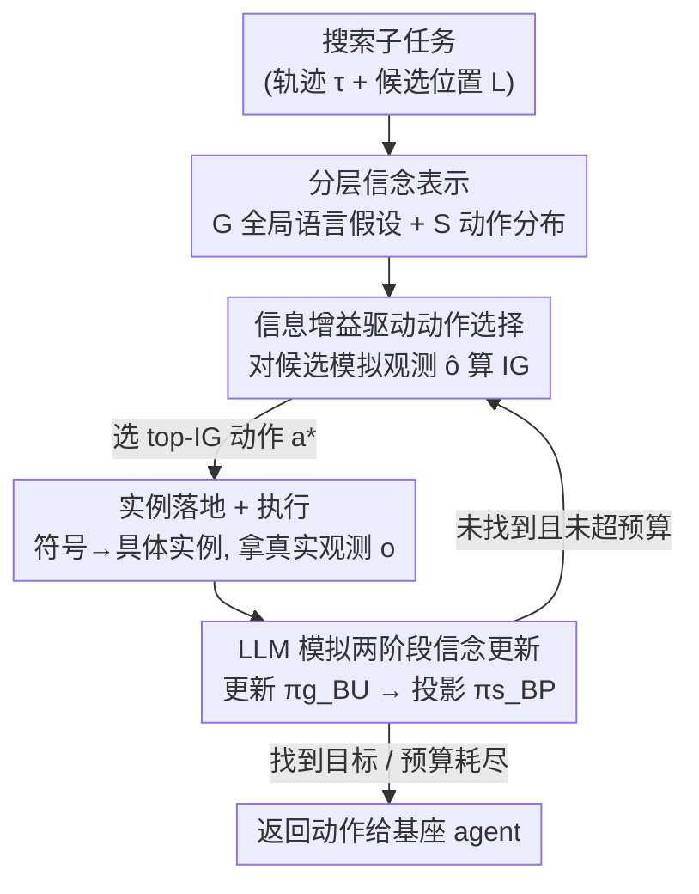

# Align While Search: Belief-Guided Exploratory Inference for World-Grounded Embodied Agents

**会议**: CVPR 2026  
**论文**: [CVF Open Access](https://openaccess.thecvf.com/content/CVPR2026/html/Bae_Align_While_Search_Belief-Guided_Exploratory_Inference_for_World-Grounded_Embodied_Agents_CVPR_2026_paper.html)  
**代码**: https://github.com/LGAI-Research/AWS-agent (有)  
**领域**: 具身智能 / LLM Agent  
**关键词**: 部分可观测, 信念推断, 信息增益, 测试时自适应, 物体搜索  

## 一句话总结
针对 LLM 具身 agent 在部分可观测环境下「搜索物体时只会机械重放训练轨迹」的问题，AWS 把搜索建模成单状态的贝叶斯自适应控制——在测试时维护一个分层信念（全局语言假设 + 低层动作分布），用冻结 LLM 模拟观测来做「更新→投影」的信念刷新，并按预测信息增益选动作，**不更新任何梯度**就把搜索成功率和 token 开销同时压过了推理时扩展与训练时世界模型基线。

## 研究背景与动机
**领域现状**：让 LLM 在 ALFWorld、VirtualHome 这类具身环境里做任务，主流是两条路：一是训练时用监督/强化学习优化策略（ETO、WKM、MPO 等），二是推理时扩展（ReAct、Reflexion、RAP、RAFA、ReflAct 等用 prompt 增强或检索增强来「想得更多」）。

**现有痛点**：训练时方法成本高、部署不灵活；推理时方法虽然便宜，但**缺乏与环境的自适应交互**——它们要么外挂模拟器/学得的 critic，要么只维护「问答式」的信念摘要，**没有人显式维护一个关于潜在环境配置和物体位置的概率分布**。作者还做了个关键诊断（图 2）：base 模型 GPT-4o-mini 的动作熵只有 1.94、不同轨迹占比 0.21，**换了房间布局也照搬同一套搜索顺序**；更糟的是，即使用专家轨迹做了 SFT，agent 在测试环境里仍有 80.7% 的搜索序列在硬重放训练时的访问顺序，近 50% 的失败发生在「训练式」序列上——它根本没在「看到什么就调整」，而是闭着眼按训练好的模式走。

**核心矛盾**：搜索的难点其实**不在世界本身复杂**，而在于 agent 没能利用环境里**本就良好定义的潜在语义结构**。作者用 PCA 展示（图 3）：不同住户的客厅物品使用会自然聚成簇（科技宅 vs 极简风），每簇有各自的物体偏好。这种潜在结构没被显式建模和利用，是浪费。

**本文目标**：在不训练、不更新梯度的前提下，让 agent 在搜索时**显式维护并更新一个关于「目标在哪」的信念**，用这个信念去做信息搜集型的探索决策，既提高找到目标的概率、又减少搜索步数。

**切入角度**：把部分可观测下的搜索看成**近似贝叶斯自适应控制（Bayes-adaptive MDP）**——引入潜在变量 $\phi$（环境类型）和 $\ell$（物体位置），agent 维护后验 $p(\phi,\ell\mid\tau_t)$，并选择能在信念空间最大化「任务回报 + 信息增益」trade-off 的动作。

**核心 idea**：用一个**外挂的、由冻结 LLM 实现的分层信念模块**取代「记忆化的策略」，在测试时边搜索边对齐世界（Align While Search）——信念更新和动作打分全靠 prompt 同一个 LLM，不碰权重。

## 方法详解

### 整体框架
AWS 跑在一个现成 LLM agent 之上，**只在搜索子任务期间被调用**。它把一个 episode 拆成「先找到目标（FIND）→ 再操作（ACT）」，并对其中的搜索阶段做一个关键抽象：搜索时**物理世界是静态的**（物体位置不变），变的只是 agent 对「目标在哪」的信念。于是搜索被建模成一个**单状态 MDP** $M_{\text{search}}=\langle\{s^\star\}, A_{\text{search}}, T_{\text{search}}, R_{\text{search}}, \gamma\rangle$：唯一的「真实状态」是哑状态 $s^\star$，所有动态都被推进信念里。动作 $a_t=\text{CHECK}(\ell_t)$ 表示「去位置 $\ell_t$、必要时打开、检查它」（把导航和低层操作打包成一个原子操作），环境返回文本观测 $o_t$（如「看到一个苹果」/「抽屉是空的」），奖励稀疏：找到目标得 1，否则得 0。这本质上是个 bandit 式的单状态决策问题，只有位置上的信念 $b_t\in\Delta L$ 在演化。

整条 pipeline 是一个闭环：给定当前轨迹，AWS 维护一个分层信念 $(G,S)$；每一步对每个候选 CHECK 动作，先**模拟观测**并做一次「更新→投影」得到假想的新信念，按**预测信息增益**给候选打分，选出 top 动作返回给基座 agent；agent 执行后拿到真实观测，AWS 再做一次**真实的**信念更新，进入下一步，直到找到目标或步数预算耗尽。

### 关键设计

**1. 分层信念表示：把「环境长什么样」和「该查哪」分两层显式建模**

痛点是：以往推理时 agent 要么没有信念、要么只有一句模糊的文字摘要，无法支撑「按概率挑动作」。AWS 用一对分层结构 $(G,S)$ 来表达 agent 的认知不确定性。$G$ 是一组**全局假设** $B^G_t$，用自然语言存住对用户习惯和场景布局的猜测（如「厨房很整洁；橱柜里通常放杯子；马克杯常出现在水槽附近」），每个 episode 从初始观测用一次 LLM prompt 初始化。$S$ 是一个**低层动作信念** $b^S_t$，是候选位置上的类别分布，定义为

$$b^S_t(a) = \Pr(\text{执行 } a \text{ 后找到目标}),\quad \forall a\in L_S,$$

其中 $L_S$ 是所有检查某个位置的符号 CHECK 动作。从贝叶斯视角看，$(G,S)$ 是对联合潜变量 $z=(\phi,\ell)$ 后验的一个**摊还（amortized）变分近似** $q_\psi(z\mid\tau_t)=q_\psi(\phi\mid\tau_t)\,q_\psi(\ell\mid\phi,\tau_t)$：$q_\psi(\phi\mid\tau_t)$ 由文本全局假设 $B^G$ 表示，$q_\psi(\ell\mid\phi,\tau_t)$ 由动作级信念 $b^S$ 表示。分两层的好处在于：高层用语言承载「软」的语义先验（可被 LLM 灵活改写），低层落成「硬」的可执行分布（可被信息增益直接打分），二者各司其职。

**2. LLM 模拟的两阶段信念更新（更新→投影）：用冻结 LLM 当摊还推断算子**

有了信念还得能更新它，且不能训练。AWS 把信念更新拆成两步串联的 LLM 调用（公式 4）：

$$B^G_t \xrightarrow{\ \pi^g_{BU}(\hat o)\ } B^G_{t+1} \xrightarrow{\ \pi^s_{BP}\ } b^S_{t+1}.$$

第一步 $\pi^g_{BU}$ 是**更新**：给定观测 $\hat o$ 修订全局文本假设（如观测到水槽是空的，就删掉「马克杯常在水槽」这条假设）。第二步 $\pi^s_{BP}$ 是**投影**：把更新后的文字信念落成可执行的符号位置分布。整个 $B^G_t \to B^G_{t+1}\to b^S_{t+1}$ 被看作一个黑盒摊还推断映射 $F_\psi$，$q_\psi(z\mid\tau_{t+1})=F_\psi(q_\psi(z\mid\tau_t),a_t,o_t)\approx p(z\mid\tau_{t+1})$——全部由 prompt 一个**冻结**的 LLM 实现，不更新任何参数。投影这步给了两种变体：**相似度投影**用候选符号和更新后假设之间的词法相似度来微调信念分数（局部、平滑的细化）；**LLM 投影**直接问 LLM「给定假设和位置列表，该提升/压制哪些符号」（可做语义跳变）。两者诱导出不同的探索风格（局部精修 vs 语义跳跃）。

**3. 信息增益驱动的探索动作选择：在信念空间里挑「最能减少不确定性」的动作**

光会更新信念还不够，得让动作主动去**收集信息**。AWS 对每个候选动作 $a$ 在信念空间算期望效用（公式 2）：

$$a^*_t = \arg\max_{a\in A_{\text{search}}} \mathbb{E}_{\hat o\sim p(\hat o\mid a, b_t)}\big[\,U\big(b_t, b_{t+1}(b_t,a,\hat o)\big)\,\big],$$

并把效用 $U$ 实例化为**信息增益**（公式 3）：

$$\text{IG}(a) = \mathbb{E}_{\hat o}\big[\,H(b_t) - H(b_{t+1}\mid a,\hat o)\,\big],$$

其中 $H(\cdot)$ 是动作级信念的熵。关键在于对 $\hat o$ 的期望是用**LLM 模拟观测**来近似的：AWS 先让 LLM 想象「如果去查这个位置，会看到什么」，再走一遍设计 2 的「更新→投影」算出假想新信念的熵，从而估出这一步能消掉多少不确定性。选 IG 最高的动作，等价于一个定义在单状态搜索子任务上的**上下文贝叶斯 bandit**。这套轻量 IG 代理（surrogate）就是把「探索」从启发式变成了可打分的量：实验里它既鼓励早期广探索去 debias 错误假设、又能在证据足够后迅速把概率质量收敛到少数可信位置。

**4. 实例落地与终止：把符号信念接回真实环境**

$b^S_t$ 定义在符号位置上（如 cabinet、countertop），但环境要的是具体实例（如 cabinet3）。AWS 选出符号动作后，从该符号对应的物体集合里**均匀采样一个实例**执行，环境返回真实奖励和观测，再做一次真实的信念更新。终止条件是任务满足（找到并放置目标）或步数预算耗尽；此外还用一个**观测对齐分数**（比较 LLM 预测观测与真实反馈的一致性）来检测是否已收敛到稳定假设。⚠️ 终止判据与完整伪代码在原文附录，正文只给了概述，以原文为准。

### 一个完整示例
以 ALFWorld 的「把马克杯放进垃圾桶」为例（论文图 10 定性分析）：搜索阶段先要找到马克杯。初始时 $G$ 里有「马克杯常在水槽/橱柜」等假设，$b^S$ 在 cabinet、countertop 等位置上大致均匀。每步 AWS 对每个候选位置先用 LLM 模拟「去查会看到什么」，算 IG——开局 IG 倾向于鼓励去查语义上「远」的位置以打破错误先验，所以信念的熵会先上升；一旦在某次（真实或模拟）观测里拿到支持 cabinet 的证据，$\pi^g_{BU}$ 删掉被证伪的假设、$\pi^s_{BP}$ 把概率质量投向 cabinet，熵急剧下降，后续动作聚焦到少数可信位置。相似度投影的信念曲线平滑局部地变化，LLM 投影则会出现「先短暂分给别的容器、再猛收回」的语义跳变——但两者最终都比 SFT agent 更快把质量压到正确位置（净熵降 0.87 vs 0.39）。

## 实验关键数据

### 主实验
ALFWorld 上对比推理时基线（成功率 %，按子任务）：

| Backbone | 方法 | CLEAN | COOL | HEAT | PICK | PICK-2 | Avg. |
|----------|------|-------|------|------|------|--------|------|
| GPT-4 | ReAct | 70.9 | 0.0 | 0.0 | 83.3 | 35.2 | 35.5 |
| GPT-4 | Reflexion | 64.5 | 90.5 | 95.7 | 83.3 | 58.8 | 82.1 |
| GPT-4 | ReflAct | 96.8 | 95.2 | 78.3 | 95.8 | 94.1 | **93.3** |
| GPT-4 | **AWS** | 96.8 | 100.0 | 91.3 | 91.6 | 94.1 | 90.0 |
| LLaMA-70B | ReAct | 22.5 | 0.0 | 0.0 | 75.0 | 35.2 | 22.1 |
| LLaMA-70B | ReflAct | 38.7 | 66.7 | 56.5 | 83.3 | 52.9 | 60.5 |
| LLaMA-70B | **AWS** | 93.5 | 80.9 | 65.2 | 95.8 | 76.4 | **76.0** |

在开源 LLaMA-70B 上 AWS 平均 76.0%，大幅领先 ReflAct 的 60.5%；在 GPT-4 上 90.0% 排第二（仅次于 ReflAct 93.3），但在 12 个子任务中拿下 7 个最优/并列最优、且全部进前三。

与训练时基线对比（成功率 %，Seen/Unseen）：

| 方法 | VirtualHome Seen/Unseen | ALFWorld Seen/Unseen |
|------|--------------------------|----------------------|
| SFT | 64.9 / 57.7 | 79.3 / 71.6 |
| STeCa | 69.6 / 63.6 | — |
| MPO | — | 80.7 / 81.3 |
| **AWS（无梯度更新）** | **69.6 / 65.2** | **87.5 / 85.3** |

不更新任何权重，AWS 在两个环境上都超过了 STeCa、MPO 等训练时 SOTA。论文图 1 还显示 AWS 在 token 用量上比强推理时基线少 2–5×。

### 消融实验
四种搜索策略对照（同一 backbone，成功率 % / 平均步数）：

| 配置 | Prior | Update | IG | MCTS | SR(%) | Steps↓ |
|------|:---:|:---:|:---:|:---:|------|--------|
| Random Search | × | × | × | × | 74.6 | 19.8 |
| Flat Prior | ✓ | × | × | × | 82.8 | 14.5 |
| Greedy (No IG) | ✓ | ✓ | × | × | 82.4 | 11.7 |
| MCTS (No IG) | ✓ | ✓ | × | ✓ | 85.0 | 14.7 |
| **Ours (full)** | ✓ | ✓ | ✓ | ✓ | **87.4** | 13.8 |

两种投影变体在不同 base 模型上的增益（ALFWorld-Text 成功率 %）：

| Base 模型 | Vanilla | LLM 投影 | 相似度投影 |
|-----------|---------|----------|-----------|
| LLaMA-3.1-8B (SFT) | 81.3 | 88.8 (+9.2%) | 91.7 (+12.8%) |
| LLaMA-3.1-8B (instruct) | 46.2 | 52.9 (+14.5%) | 67.9 (+46.8%) |
| LLaMA-3.1-70B | 85.0 | 91.0 (+7.1%) | 94.0 (+10.6%) |
| GPT-4o-mini | 76.8 | 86.6 (+12.7%) | 89.5 (+16.5%) |

### 关键发现
- **信念更新和 IG 缺一不可且需协同**：单独加信念更新几乎无收益（Flat Prior 82.8 → Greedy 82.4），但配上结构化探索（MCTS）和 IG 后才显现——去掉 IG（Ours→MCTS）成功率从 87.4 掉到 85.0、步数从 13.8 涨到 14.7，说明轻量 IG 代理提供了强信号。
- **IG 与信念质量真的对得上**：AWS 的每步信息增益（$\Delta H_t$ 0.11 vs SFT 0.05）和净熵降（$\Delta H$ 0.87 vs 0.39）都约为 SFT 两倍，发生「信念变锐」的 episode 占比 84% vs 59%；按预测 IG 分桶后，高 IG 桶的观测对齐增益更大，证明 IG 是个可靠的序数信号。
- **选 top-IG 动作最优**：强制选次优或最低 IG 动作会让成功率单调变差；命中位置的信念分数显著高于落空位置（0.45 vs 0.31，$p\ll10^{-10}$），说明信念先验确实对齐了真实物体存在性。
- **与世界模型可叠加**：AWS 叠在 MPO 上把 ALFWorld-Text (Unseen) 刷到 94.0% 的新 SOTA；换成 VLM backbone 不改算法即可处理图像渲染环境。

## 亮点与洞察
- **把「搜索」从 POMDP 降维成单状态贝叶斯 bandit**：抓住「搜索阶段世界静止、只有信念在变」这一观察，把复杂的具身动态全推进信念里，方法因此变得极轻量却仍有贝叶斯解释——这个建模简化是全文的支点。
- **用冻结 LLM 当摊还推断算子**是很可复用的思路：把「更新→投影」两步 prompt 看成变分后验的近似映射 $F_\psi$，等于免训练地拿到了一个可微调（靠 prompt）的信念更新器。
- **IG 用 LLM 模拟观测来估**，把「探索价值」变成可打分的量，避开了 MCTS 那种盲目展开；而且 IG 只当序数排名用、不要求标定，反而稳健。
- **诊断驱动设计**：先用熵和「训练序列重放率 80.7%」量化出 SFT agent 的「闭眼搜索」病灶，再对症下药，动机非常具体而非套话。

## 局限与展望
- **强依赖底座 LLM**：性能取决于 base 模型能否模拟出合理的家居动态和物体布局；小模型（Mistral-7B、DeepSeek-8B）常生成不可靠的假想观测，IG 排名会塌缩成近乎静态的先验。
- **测试时开销更大**：每步要对多个候选动作各模拟观测 + 信念更新，wall-clock 和 token 都比单趟 SFT agent 高（虽然总步数更少、整体 token 反而更省）。
- **只覆盖单状态静态搜索**：建模假设搜索期间世界静止、episode 可拆成 FIND-THEN-ACT，匹配 ALFWorld/VirtualHome，但**无法直接处理物体位置非平稳、多 agent 并发、或更纠缠的长程目标**。
- **信念更新与 IG 全靠手工代理**：后验 $q_\psi$ 靠 prompt + 相似度/boost-suppress 规则实现，IG 只当序数信号，**没有形式化最优性保证**，对 prompt 和超参敏感。作者把「学得的世界模型 + 可训练信念更新器」列为未来方向。

## 相关工作与启发
- **vs 推理时扩展（Reflexion / RAP / RAFA / ReflAct）**：它们靠 prompt/检索增强或问答式信念摘要，常外挂模拟器或学得的 critic，且**不维护显式的位置概率分布**；AWS 维护显式分层信念并按 IG 选动作，在更低 token 开销（少 2–5×）下取得相当或更高成功率。
- **vs 训练时策略优化（ETO / WKM / MPO / STeCa）**：它们更新模型权重、成本高、部署不灵活；AWS 全程测试时自适应、零梯度，却在 VirtualHome/ALFWorld 上超过这些训练时 SOTA，还能叠在 MPO 上进一步提升。
- **vs 经典物体搜索 POMDP（如 correlational object-search）**：思想同源（联合潜变量、利用相关结构），但 AWS 用 LLM 摊还后验取代了显式 POMDP 规划，把语义先验交给语言模型承载，免去手写转移/观测模型。

## 评分
- 新颖性: ⭐⭐⭐⭐⭐ 把测试时具身搜索干净地表述成单状态贝叶斯自适应控制，并用冻结 LLM 实现摊还信念更新 + IG 动作选择，角度新颖。
- 实验充分度: ⭐⭐⭐⭐ 覆盖 ALFWorld/VirtualHome/BabyAI、文本与图像、多 backbone，消融拆到 Prior/Update/IG/MCTS 四因素，但多模态与部分对比放在附录。
- 写作质量: ⭐⭐⭐⭐ 诊断→建模→方法逻辑顺，贝叶斯叙事清晰；公式记号偏密、部分关键细节（终止判据、投影规则）压在附录。
- 价值: ⭐⭐⭐⭐⭐ 免训练即超训练时 SOTA、token 省 2–5×、可叠加世界模型，对落地部署很有吸引力。

<!-- RELATED:START -->

## 相关论文

- [\[CVPR 2026\] AGENTSAFE: Benchmarking the Safety of Embodied Agents on Hazardous Instructions](agentsafe_benchmarking_the_safety_of_embodied_agents_on_hazardous_instructions.md)
- [\[ICLR 2026\] Test-Time Mixture of World Models for Embodied Agents in Dynamic Environments](../../ICLR2026/robotics/test-time_mixture_of_world_models_for_embodied_agents_in_dynamic_environments.md)
- [\[CVPR 2026\] UAST: Unified Active Search and Tracking for Arbitrary Targets with UAVs](uast_unified_active_search_and_tracking_for_arbitrary_targets_with_uavs.md)
- [\[NeurIPS 2025\] Benchmarking Egocentric Multimodal Goal Inference for Assistive Wearable Agents](../../NeurIPS2025/robotics/benchmarking_egocentric_multimodal_goal_inference_for_assist.md)
- [\[CVPR 2026\] Adaptive Action Chunking at Inference-time for Vision-Language-Action Models](adaptive_action_chunking_at_inference-time_for_vision-language-action_models.md)

<!-- RELATED:END -->
