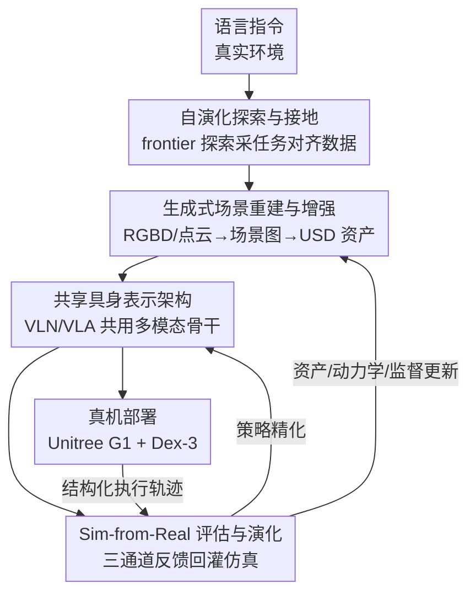

# Arcadia: Toward a Full-Lifecycle Framework for Embodied Lifelong Learning

**会议**: CVPR 2026  
**论文**: [CVF Open Access](https://openaccess.thecvf.com/content/CVPR2026/html/Gao_Arcadia_Toward_a_Full-Lifecycle_Framework_for_Embodied_Lifelong_Learning_CVPR_2026_paper.html)  
**代码**: 论文称开源标准化评测接口，但正文未给出明确仓库链接 ⚠️ 以原文为准  
**领域**: 机器人 / 具身智能  
**关键词**: 具身终身学习、real-to-sim-to-real 闭环、生成式场景重建、共享多模态骨干、部署反馈

## 一句话总结
Arcadia 把具身学习从"单阶段优化"重新定义为"全生命周期问题"，用一条紧耦合的 real→sim→real 闭环把自主探索采数、生成式场景重建、导航/操作共享骨干、部署反馈回灌四个环节串成一个自我改进系统，在导航/操作 benchmark 上分别平均提升 7.07% / 11.08%，真机成功率远超 NaVILA、OpenVLA。

## 研究背景与动机
**领域现状**：当前具身智能的主流做法是把流水线切成独立环节各自优化——要么在静态模拟器里训练，要么直接部署而不收集反馈。近期工作如 GRUtopia（统一仿真场景/agent/benchmark）、NaVILA（把高层语言指令接到底层电机控制并在真机验证）已经开始打通部分环节。

**现有痛点**：但这些工作都只是"加宽"了流水线的覆盖面，没有真正闭环。GRUtopia 主要扩展仿真侧，NaVILA 主要把执行延伸到真机，二者都没有建立"从部署经验持续回流到仿真资产/监督信号"的常驻通路。作者把割裂归纳成四个具体短板：(1) **外源数据依赖**——用 YouTube 视频、四足机器人数据等离分布语料训练人形机器人，形态/视角错配，收益有限；(2) **预渲染环境**——Matterport3D、Habitat 这类静态场景物理属性有限、不可编辑，部署时的新变化插不进去；(3) **模型架构碎片化**——导航（VLN，常建模成有向 bbox）和操作（VLA，固定相机+末端控制）各搭一套互不兼容的栈，跨任务的信用分配被堵死；(4) **真实反馈稀疏**——部署被当成一次性的"打个成功/失败标签"，长程错误无法定位、部分进度与环境漂移喂不回去。

**核心矛盾**：这四点的根子不是孤立的算法缺陷，而是**生命周期耦合的断裂**——数据采集、仿真、表示、部署监督之间没有形成持续回流的闭环，于是系统退化成"一次性训练"，无法持续改进或跨场景泛化。

**本文目标**：搭一个面向具身生命周期的平台，要同时满足：(i) 采集经验与目标任务强对齐；(ii) 把真实观测转成可编辑的生成式仿真资产；(iii) 用一个共享、可扩展的具身表示跨任务学习；(iv) 把结果驱动的部署反馈回灌到资产和策略。

**核心 idea**：用一条**不可分解的紧耦合闭环**（去掉任一环就退回一次性训练）把"采数→建仿真→共享表示学习→部署反馈"四个阶段绑在一起，让真实经验持续更新仿真、表示与策略，实现终身自我改进。

## 方法详解
给定一条自然语言指令（如"把桌上的杯子拿给我"），Arcadia 走一整圈 real→sim→real：先在真实环境里自主探索采数（3.1），把多模态数据生成式重建成可编辑的仿真资产（3.2），在仿真里用共享具身骨干训练导航与操作策略（3.3），最后真机部署产生结构化反馈再回灌到仿真去同时修资产和策略（3.4）。四个组件既能各自独立工作，又作为一个耦合闭环协同——每个解决生命周期里一个不同瓶颈，合起来驱动持续自我改进。

### 整体框架

整条管线的关键不在某个单点 SOTA，而在于 E 阶段产生的反馈通过两条回边（虚线）持续修正仿真资产和共享策略，把"仿真"从静态代理变成主动驱动适应的引擎。

### 关键设计

**1. 自演化探索与接地：让采数从"外源借数据"变成"在部署现场自己采任务对齐数据"**

针对外源数据依赖这个短板，Arcadia 在与部署完全相同的物理环境里自主采数，保证感知/控制模型在真实条件下学习。它基于 Isaac ROS + Nvblox 做 SLAM 与三维重建，用 **frontier-based（边界点）探索策略**最大化信息增益：frontier 点是已探索/未探索区域的边界，按"期望熵减"打分，机器人用底层运动 API 去访问得分最高的点，地图与 frontier 集合持续更新，产生在覆盖率、效率、语义相关性之间平衡的自适应轨迹。相比 grid/脚本式探索，这种策略更强调对下游任务关键的区域，提升样本效率与任务接地的覆盖度。探索结束后输出同步的多模态数据（RGB-D、LiDAR、IMU、里程计、位姿），并**保留完整观测历史**而非丢弃中间帧，为后续重建和策略学习提供稠密、时序接地的监督，减小 real-to-sim gap。

**2. 生成式场景重建与增强：把真实观测变成可编辑、任务对齐的仿真资产，取代静态扫描/检索拼装**

针对预渲染环境不可编辑的痛点，本设计用生成式重建把真实环境直接转成 simulator 兼容的资产。从 3.1 的多模态输入出发，视频与点云被解析成结构化的三维**场景图** $G=(V,E)$（物体/建筑元素是节点、空间关系是边，用 SpatialLM 这类场景解析模块实现）。关键区别在于：不从数据库检索网格，而是用基于 **Gaussian-splat 的重建器**直接从多视角观测合成资产，产出几何、纹理、语义一致的 USD 物体，再经自动化管理接口导入 Isaac Sim。这样无需人工干预即可广域扩展、减少资产偏差、保留真实世界观测到的任务语义——用生成式合成替代手工检索，让仿真既逼真又多样，支撑可扩展的终身学习。

**3. 共享具身表示架构：用一个多模态骨干统一 VLN 与 VLA，打掉导航/操作的架构碎片化**

针对模型架构碎片化，Arcadia 不再为运动和操作各搭独立栈，而是用一个**联合训练的统一多模态骨干** + 轻量任务专属解码器（动作解码器 / 语言解码器）。监督信号在仿真里生成：导航侧采样 start–goal 对、用 **A\*** 产出无碰撞路径，表达成一个 **7 基元离散控制空间**（前进带步幅、旋转、后退、停止、位置、朝向等），可跨机器人形态泛化；操作侧用 **RRT** 生成物理可行轨迹。所有轨迹在输入端做语言条件化，按 VLN-CE / BridgeData V2 格式组织，经共享感知/状态编码器送入各自解码器。联合训练在同一个潜空间里同时编码"导航的全局布局/可达目标/接近策略"和"操作的局部 affordance/接触行为"，从而减少模态漂移、促进任务间表示迁移，让长程语言指令能被连贯推理。消融里这个共享骨干掉点最小，反而印证了 VLN 与 VLA 可以共用一个 VLM 骨干。

**4. Sim-from-Real 评估与演化：把部署当成"额外监督阶段"，三通道反馈回灌闭环**

针对真实反馈稀疏，本设计把部署从"只打成功/失败标签的终点"改成主动监督源：真机 rollout 被记录、分解成结构化反馈、再回灌仿真去同时更新策略与环境。反馈分三个通道——**任务反馈**把每个任务拆成步级动作，时刻 $t$ 的反馈定义为 $F^T_t = \lambda_1 R_t + \lambda_2 \lVert s_{t+1}-s_t \rVert + \lambda_3 L_{conf}(o_t,\hat{o}_t) + \lambda_4 L_{goal}(s_t,s_g)$，其中 $R_t$ 是标量奖励、$\lVert s_{t+1}-s_t \rVert$ 度量状态转移幅度、$L_{conf}$ 是预测与观测的感知一致性、$L_{goal}$ 是到目标状态的距离，$\lambda_i$ 为权重——把原始轨迹转成同时编码奖励/动力学/感知/目标对齐的监督信号，既能全局打分又能定位局部错误。**场景反馈**用 RGB/深度/LiDAR/IMU 刻画环境动态与感知质量，把"弱光下建图退化""出现未见物体"等失败记录下来，据此实例化新资产或注入扰动，让未来仿真反映部署条件而非固定预渲染场景。**机器人反馈**监控硬件遥测（关节状态、执行器负载、通信稳定性），把越限（如超过允许台阶高度、超载）记成 $F^R$ 信号，用于安全门控和把运动策略适配到平台限制。三通道一起回灌仿真，更新资产、动力学与监督目标，形成双向 real-to-sim-to-real 循环——在训练时就缩小 sim-to-real gap，而不是部署时再补偿。

## 实验关键数据

实验回答四个问题：Arcadia 是否提升 VLN（Q1）、是否提升 VLA 操作（Q2）、迁移真机如何（Q3）、各组件贡献多大（Q4）。高层骨干用 Qwen2.5-VL，真机用 Unitree G1（操作用 Dex-3 机械手），仿真在 Isaac Sim。

### 主实验：VLN 导航

在 VLN-CE-Isaac、R2R Val-Unseen、RxR Val-Unseen、ScanQA 上对比（SR=成功率，SPL=路径加权成功率，NE=导航误差越低越好）：

| 方法 | R2R SR↑ | R2R SPL↑ | RxR SR↑ | RxR SPL↑ | ScanQA Meteor↑ |
|------|---------|----------|---------|----------|----------------|
| Tuning（单阶段微调） | 44.9 | 38.5 | 47.1 | 41.3 | 13.4 |
| NaVILA | 45.1 | 40.1 | 51.6 | 47.5 | 16.3 |
| Arcadia w/o feedback | 48.7 | 43.6 | 54.2 | 49.4 | 19.0 |
| Arcadia w/ feedback | **50.1** | **45.0** | **55.9** | **49.8** | **19.1** |

同架构同训练预算下，仅把第一阶段轨迹换成 Arcadia 自采的任务对齐数据（w/o feedback），平均 SR 就比 NaVILA 高 2.7%；再加真机反馈闭环（w/ feedback）全 benchmark 最优，证明增益主要来自数据质量与闭环精化而非单纯堆数据量。

### 主实验：VLA 操作

LIBERO（Spatial/Object/Goal/10）与 BridgeData V2 成功率（%）：

| 方法 | LIBERO-Spatial | LIBERO-Object | LIBERO-Goal | LIBERO-10 | BridgeData V2 |
|------|---------------|---------------|-------------|-----------|---------------|
| OpenVLA | 84.7 | 88.4 | 79.2 | 53.7 | 39.6 |
| Arcadia w/o feedback | 87.3 | 92.1 | 86.9 | 74.0 | 47.3 |
| Arcadia w/ feedback | **88.1** | **94.2** | **88.5** | **77.8** | **52.4** |

在 BridgeData V2 上反馈带来的提升尤其明显（39.6→52.4），说明反馈增强了物体接地与长程稳定性。论文报告导航/操作相对 baseline 平均提升 7.07% / 11.08%。

### 真机评估

100 个导航 + 100 个操作任务，人工评测；导航全程 **zero-shot**（无任务微调），操作微调了一个双臂模型处理桌面四方块：

| 方法 | 导航成功 | 操作成功 |
|------|---------|---------|
| NaVILA / OpenVLA（baseline） | 13 | 9 |
| **Arcadia** | **46** | **27** |

在 baseline 全军覆没的多目标导航/多物体操作场景，Arcadia 仍保持 17% 成功率（常能完成初始子任务，但在扩展/组合指令上吃力）。

### 消融实验

逐个把四个模块换成次优替代，看成功率（%）掉多少：

| 配置 | VLN-CE-Isaac | LIBERO | 说明 |
|------|:---:|:---:|------|
| Backbone（无任一组件） | 44.9 | 76.5 | 起点 |
| 换静态训练集（ScaleVLN+RLBench） | 43.0 | 72.9 | 比起点还低，外源静态数据有害 |
| 换检索式场景重建 | 46.1 | 81.4 | 失去生成式可编辑性 |
| 换掉联合训练（拆开） | 49.8 | 87.0 | 掉点最小 |
| 换稀疏反馈（仅二值成败） | 48.8 | 85.3 | 反馈被砍后明显回落 |
| **Arcadia（完整）** | **50.1** | **87.2** | — |

### 关键发现
- **静态训练集是负贡献**：换成 ScaleVLN+RLBench 这类静态外源数据后，VLN/LIBERO 都掉到 baseline 以下（43.0 / 72.9），直接印证"外源数据依赖"是真实短板——不是数据越多越好，而是任务对齐才有用。
- **共享骨干掉点最小**：拆开联合训练只小幅回落（49.8 / 87.0），说明 VLN 与 VLA 确实能共用一个 VLM 骨干，这反过来支持把导航+操作统一进单一框架的方向。
- **反馈与生成式重建都重要**：砍掉稠密反馈（仅二值成败）或换成检索式重建都明显掉点，呼应"去掉任一环就退回一次性训练"的不可分解论断。

## 亮点与洞察
- **把"工程流水线"重新框成"生命周期问题"**：最大的"啊哈"是论点本身——很多工作在优化单环节，Arcadia 指出真正缺的是 real→sim→real 的闭环耦合，并用消融"去掉任一组件都崩"来论证耦合的不可分解性。
- **部署即监督**：$F^T_t$ 把一条真机轨迹拆成奖励/动力学/感知/目标对齐四项加权，既能全局打分又能定位局部错误，比"只记成功/失败"信息密度高得多，这个反馈结构可迁移到任何带真机回流的具身系统。
- **场景反馈直接改写仿真资产**：弱光建图退化、出现新物体这类失败被用来实例化新资产/注入扰动，让仿真持续逼近部署分布——这是把"domain randomization"从手工先验升级成"数据驱动的自适应"。
- **生成式资产取代检索拼装**：用 Gaussian-splat 直接从多视角合成 USD 资产而非数据库检索，可编辑、保语义，是 real-to-sim 的关键可复用 trick。

## 局限与展望
- **作者承认**：实现局限在 Unitree G1 + Isaac Sim 单一平台，受硬件成本所限只验证了 7B 级 VLM，大规模评测范围受限；未来要扩到更多本体与仿真环境（如 InternRobot）。
- **真机仍有明显差距**：导航 46%、操作 27% 的绝对成功率说明离实用还远，组合/长程指令是主要失败点（多目标场景仅 17%）。
- **自己发现的局限**：(1) 论文未给出明确开源仓库链接 ⚠️，"标准化接口可复现"的承诺难以核验；(2) $F^T_t$ 里四个 $\lambda_i$ 权重如何设定、对结果敏感度多大未充分披露；(3) 真机评测是人工打分的 100+100 任务，规模偏小、主观性需注意；(4) 闭环"持续自我改进"主要靠单轮 w/o→w/ feedback 的对比体现，缺多轮迭代曲线来证明真正的"终身"累积增益。

## 相关工作与启发
- **vs NaVILA**：NaVILA 把高层语言接到底层电机控制并在真机验证、用外源 QA 语料补数据稀缺；Arcadia 沿用其层次化架构（高层 VLM + 底层控制器），但把第一阶段轨迹换成自采的任务对齐数据，并加上反馈回灌闭环——区别在于 NaVILA 只扩"执行跨度"不闭环，Arcadia 建立了 sim↔real 的双向常驻通路。
- **vs GRUtopia**：GRUtopia 统一了仿真场景/agent/benchmark，但依赖有限资产库 + 检索式场景变体，生成式适应受限；Arcadia 用生成式重建替代检索，让部署经验能编辑进新场景。本文操作侧的机械臂平台也复用了 GRUtopia。
- **vs OpenVLA**：OpenVLA 是单阶段操作 baseline；Arcadia 同数据规模下把轨迹全换成仿真管线生成的数据并加反馈，在 BridgeData V2 上从 39.6 提到 52.4，体现闭环数据质量优于单纯规模。

## 评分
- 新颖性: ⭐⭐⭐⭐ 把具身学习重构成全生命周期闭环、提出 Sim-from-Real 三通道反馈机制，框架级创新清晰，但各子模块多是成熟组件（frontier 探索、Gaussian-splat、A*/RRT）的整合。
- 实验充分度: ⭐⭐⭐⭐ 覆盖 VLN/VLA 多 benchmark + 真机 + 逐组件消融，论证耦合不可分解；但真机规模偏小、缺多轮迭代的"终身"增益曲线。
- 写作质量: ⭐⭐⭐⭐ 痛点→设计的对应关系讲得很清楚，四短板与四组件一一对照；个别符号（$F^R$、$\lambda_i$）披露不足。
- 价值: ⭐⭐⭐⭐ 为通用具身 agent 提供了可复用的 real-to-sim-to-real 范式与标准化评测思路，若开源到位影响力可观。

<!-- RELATED:START -->

## 相关论文

- [\[CVPR 2026\] Lifelong Imitation Learning with Multimodal Latent Replay and Incremental Adjustment](lifelong_imitation_learning_multimodal_latent_rep.md)
- [\[NeurIPS 2025\] MindForge: Empowering Embodied Agents with Theory of Mind for Lifelong Cultural Learning](../../NeurIPS2025/robotics/mindforge_empowering_embodied_agents_with_theory_of_mind_for_lifelong_cultural_l.md)
- [\[CVPR 2026\] Dejavu: Towards Experience Feedback Learning for Embodied Intelligence](dejavu_towards_experience_feedback_learning_for_embodied_intelligence.md)
- [\[CVPR 2026\] CUBic: Coordinated Unified Bimanual Perception and Control Framework](cubic_coordinated_unified_bimanual_perception_and_control_framework.md)
- [\[CVPR 2026\] A Cross-view Fusion Framework for Robust 6-DoF Grasp Pose Estimation](a_cross-view_fusion_framework_for_robust_6-dof_grasp_pose_estimation.md)

<!-- RELATED:END -->
