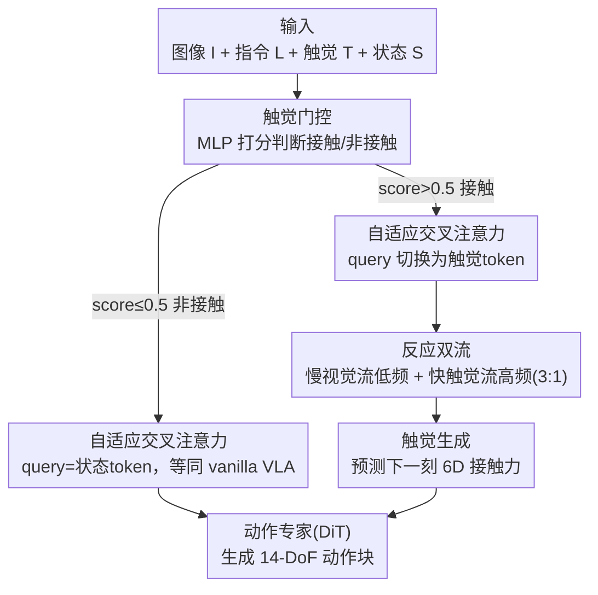

# AT-VLA: Adaptive Tactile Injection for Enhanced Feedback Reaction in Vision-Language-Action Models

**会议**: CVPR 2026  
**论文**: [CVF Open Access](https://openaccess.thecvf.com/content/CVPR2026/html/Li_AT-VLA_Adaptive_Tactile_Injection_for_Enhanced_Feedback_Reaction_in_Vision-Language-Action_CVPR_2026_paper.html)  
**代码**: [项目页](https://sites.google.com/view/at-vla)（暂无开源代码）  
**领域**: 机器人 / 具身智能  
**关键词**: VLA、触觉反馈、接触密集操作、自适应注入、双流策略

## 一句话总结
AT-VLA 在预训练 VLA（GO-1）上引入一个可学习的触觉门控，只在机器人「接触物体」的瞬间才把触觉信号注入动作专家，避免新模态破坏预训练的视觉定位能力；并用慢视觉流 + 快触觉流的双频解耦实现 0.04s 闭环反应，在拉拉链、盖章、擦花瓶、拧瓶盖等真实接触密集任务上把平均成功率从 vanilla 的 0.22 提到 0.50。

## 研究背景与动机
**领域现状**：Vision-Language-Action（VLA）模型把视觉感知、语义推理和动作生成统一进一个框架，借助大规模操作数据集和基础模型，已经能让机器人把语言指令落到感知、完成多样化任务。主流做法（如 π0、GO-1）用 VLM 输出作为条件、再用扩散/flow matching 的动作专家生成动作块。

**现有痛点**：这类模型在「接触密集（contact-rich）」任务上仍然吃力——拉拉链、拧盖子这类任务需要精确的物理交互力反馈，而纯视觉-语言的 VLA 看不到接触力，经常拉链卡住、盖章把末端撞到桌面、擦花瓶撞到瓶颈。为了补这一课，已有工作在下游微调阶段直接把触觉模态塞进来，让模型去「读懂」触觉信号（多模态对齐 / CoT 推理）。

**核心矛盾**：触觉信号和预训练用的视觉/语言数据本质上是不同类型的信息，预训练阶段几乎从没见过。作者做了一个关键实验：把触觉 token 直接拼进动作专家全程参与，结果不但没涨，反而连抓取定位都变差了——注意力图显示触觉输入把模型的注意力从目标物体推向了周围区域（详见 Tab.3 的 Ex1 比 Ex0 还低 9%）。也就是说，**新模态会破坏预训练的感知聚焦**。另一个矛盾是 VLA 推理本来就慢，跟不上高频触觉反馈，导致闭环调整不及时。

**本文目标**：① 在不破坏预训练能力的前提下融入触觉；② 让模型对高频触觉反馈做出实时、准确的动作调整。

**切入角度**：视觉和触觉是互补的——视觉负责上下文定位，触觉负责精确接触反馈。那就应该让模型在「非接触阶段」保持 vanilla VLA 的行为（吃视觉），只在「接触发生时」才引入触觉，这样能最大限度复用预训练表征。

**核心 idea**：用一个可学习的「触觉门控」动态决定**何时何地**注入触觉（Adaptive Tactile Injection），并用**慢视觉流 + 快触觉流**的双频解耦让触觉反应跑进 0.04s 闭环。

## 方法详解

### 整体框架
AT-VLA 以预训练的 GO-1 为 vanilla VLA（InternVL-2B 作 VLM、DiT 作动作专家），额外挂一个轻量 MLP 触觉编码器。策略 $\pi_\theta$ 的输入是三路相机图像 $I=\{I_h, I_r, I_l\}$、语言指令 $L$、触觉反馈 $T$（从触觉传感器提取的合力，含 3D 法向 + 3D 切向分量）、本体状态 $S$，输出是双臂 14-DoF 末端位姿的动作块 $A=\pi_\theta(I,L,T,S)$。

整条流水线的关键在两个「开关行为」：先由**触觉门控**判断当前是否接触；门控关闭时，模型的输入和结构跟 vanilla VLA 完全一致（不碰预训练表征）；门控打开后，**自适应交叉注意力**把动作专家的 query 从状态 token 切换成触觉 token，同时**反应双流**让触觉以 3:1 的高频被处理、视觉-语言以低频更新，外加一个**触觉生成**目标预测下一刻接触力来强化物理动态理解。三者一致地围绕「只在接触时、以最小侵入注入触觉」这条主线。

### 关键设计

**1. 自适应触觉注入：用门控决定「何时」注入，避免新模态污染预训练表征**

这是针对「直接塞触觉反而把注意力从目标物体带偏」这个痛点。作者拆成两步。第一步是**触觉门控（Tactile Gating）**：触觉编码器先把触觉信号编成 token $z_T$，再过一个轻量门控网络（MLP）输出一个接触分数。监督方式是人工把训练 episode 的每一帧标 0（非接触）/ 1（接触），用二元交叉熵门控损失 $L_g$ 训练；当分数超过阈值（如 0.5）门控就激活。这样模型自动学会「机器人碰到物体了」这个时刻。

第二步是**自适应交叉注意力（Adaptive Cross Attention）**，解决「门控两种状态下动作专家结构要统一」的问题。vanilla VLA 的动作专家交叉注意力里，图像 token $z_I$ 和文本 token $z_L$ 当 key/value，状态 token $z_S$ 当 query。AT-VLA 的巧妙之处是**只换 query 来源**：门控未激活时 query 仍是状态 token（输入和结构与 vanilla VLA 完全相同，预训练表征零扰动）；门控激活时 query 被替换成触觉 token $z_F$。整个过程不改模型结构、不改特征维度，所以非接触阶段保留了强视觉定位能力（如靠近目标物体），接触阶段才开始把触觉当成动作生成的条件。

**2. 触觉反应双流：用慢-快双频解耦实现 0.04s 闭环，跟上高频触觉**

针对「VLA 推理慢、跟不上高频触觉」的痛点。作者把感知处理拆成两条不同频率的流：**慢流**用大 VLM 低频处理视觉+语言，负责任务理解和视觉感知，输出潜在特征当动作专家交叉注意力的 key/value；**快流**高频处理触觉反馈，当交叉注意力的 query 条件。也就是动作专家的输入是「异步频率 + 异构模态」。

具体地，基于动作分块策略，时刻 $t_n$ 的视觉-语言观测可以指导未来 $H$ 步动作 $(t_n{:}t_{n+H})$，所以慢流输出在接下来 $H$ 步内当作时间上的潜在条件；快流则在每一步用最新的触觉反馈 $t_{n+k}\,(0<k<H)$ 生成可执行动作，同时条件在周期性更新的慢流输出上。训练时快慢流频率比随机设为 $h{:}1\,(1<h<H)$，推理时固定 3:1（慢流推一次、快流连推三次），在效率和性能间取平衡，把闭环反应压进 0.04s。门控未激活时快慢流同频，等同 vanilla VLA。

**3. 触觉生成：预测下一刻接触力，逼模型真正理解物理动态**

光会「读」当前触觉还不够，作者想让快流对触觉有更深的预测性理解。于是加一个**触觉生成（Tactile Generation）**辅助目标：从动作专家之后取触觉 token，过一个轻量解码器，预测下一时刻的 3D 法向力 + 3D 切向力，用 MSE 生成损失 $L_r$ 对齐真实触觉测量。这逼模型建立更完整的物理动态表征，把「瞬时接触感知」和「预测式交互推理」桥接起来——消融里它带来 4% 提升。

### 损失函数 / 训练策略
所有目标同时训练，总损失为
$$L = L_a + \lambda_1 L_g + \lambda_2 L_r,$$
其中 $L_a$ 是动作损失、$L_g$ 是门控二元交叉熵损失、$L_r$ 是触觉生成 MSE 损失，$\lambda_1=\lambda_2=0.01$ 用来平衡不同损失的量纲。推理时门控未激活则完全等同原始 VLA（快慢流同频、query 同 vanilla）；门控激活则启动 3:1 异步频率、query 切换为触觉 token。

## 实验关键数据

硬件用 AgiBot Genie1（双 7-DoF 臂 + 前视 + 双腕相机），触觉用 Xense Robotics 的带触觉传感器夹爪。评测 4 个接触密集任务（拉拉链、盖章、擦花瓶、拧瓶盖）+ 2 个非接触任务（抓放、开抽屉），每任务采 30-50 条示范、测 15 次。

### 主实验：接触密集任务成功率
报告各子阶段成功率，Overall 为整任务成功率。

| 任务 | 指标 | GO-1（vanilla） | π0.5 | AT-VLA（本文） |
|------|------|------|------|------|
| Unzip Bag | Overall | 0.20 | 0.0 | **0.33** |
| Stamp | Overall | 0.33 | 0.20 | **0.46** |
| Wipe Vase | Overall | 0.07 | 0.33 | **0.33** |
| Unscrew Lid | Overall | 0.27 | **0.47** | 0.46 |

AT-VLA 在接触前的抓取阶段和 GO-1/π0.5 相当（说明预训练的视觉定位没被破坏），接触阶段全面超过它们；对比同样用触觉的 VTLA/RDP 也更好。唯一略逊的是拧瓶盖——因为对 VTLA/RDP 作者人工把机器人摆到理想抓握姿态，而 AT-VLA 是端到端抓取，偶尔夹不够紧导致打滑。

### 消融实验：逐组件贡献（4 个接触密集任务平均）

| 配置 | 平均成功率 | 说明 |
|------|-----------|------|
| Ex0 Vanilla VLA | 0.22 | GO-1 基线，无触觉 |
| Ex1 + 自适应交叉注意力（直接注入触觉，无门控） | 0.13 | 比基线还低 9%，抓取定位变差 |
| Ex2 + 触觉门控 | 0.39 | 比基线 +17%，门控保住了预训练知识 |
| Ex3 + 触觉生成 | 0.43 | 比 Ex2 再 +4% |
| Ex4 + 反应双流（完整模型） | **0.50** | 比 Ex3 再 +7%，高频反应必要性 |

### 模态无关鲁棒性

| 方法 | Pick Place | Open Drawer | Stamp | AVG |
|------|-----------|-------------|-------|-----|
| GO-1 | 1.0 | 0.93 | 0.13 | 0.68 |
| π0.5 | 1.0 | 0.93 | 0.20 | 0.70 |
| AT-VLA w/o.（推理不给触觉） | 1.0 | 0.93 | 0.20 | 0.70 |
| AT-VLA w/.（推理给触觉，上界） | 1.0 | 0.93 | **0.46** | **0.79** |

### 关键发现
- **门控是性能的命门**：Ex1（直接注入、无门控）比 vanilla 还低 9%，加了门控（Ex2）反而 +17%——证实「不分场景全程注入触觉」会污染预训练表征，而「只在接触时注入」才是正解。
- **训练带触觉、推理不带触觉也能涨**：AT-VLA w/o. 在 Stamp 上（0.20）甚至略高于 GO-1（0.13），因为训练时学到了接触动态和跨模态关联，测试时能从视觉隐式推断触觉线索；这对真实场景里传感器失效/缺失非常重要。
- **触觉格式越低维越稳**：对比 6D 力 / 2D marker / 视觉-触觉图像，6D 力最好。作者推测高维触觉输入会引入更多 token、过度扰动预训练表征空间——再次印证「新模态影响要和预训练保持适当平衡」这条主线。直接注入下三种格式（Ex1/Ex5/Ex7）都掉点，而本文方法下 Ex6 比 Ex5 高 27%、Ex8 比 Ex7 高 38%，说明框架对触觉格式鲁棒。

## 亮点与洞察
- **「只换 query 不改结构」是真的优雅**：自适应交叉注意力靠切换 query 来源就实现了「非接触=零侵入、接触=融触觉」，不增加 token 序列、不改维度，完美保住预训练 token 序列建模——这正是对比那些「拼接触觉 token」工作的核心差异点。
- **把 VLA 的双系统范式用在触觉上**：以往双流把视觉/点云当快流，本文第一次把高频触觉当快流，天然契合接触事件需要快反应、更安全的物理交互。
- **门控 + 帧级标注是低成本可复用 trick**：用人工标 0/1 接触帧 + BCE 训一个轻量门控，就能让模型自动识别接触时刻，这套「学习触发时机」的思路可迁移到其他「只在特定时刻才需要某模态」的多模态任务。

## 局限与展望
- **门控依赖人工接触帧标注**：每条示范都要逐帧标 0/1 接触标签，扩展到更多任务/更大数据有成本。
- **抓握稳定性是短板**：拧瓶盖任务略逊于被「人工摆好理想抓姿」的基线，暴露端到端抓取偶尔夹不紧、打滑的问题——说明 AT-VLA 改善的是接触阶段反应，而非抓握本身的力闭环。
- **全在真实机上小样本验证**：每任务仅 30-50 条示范、15 次测试，任务种类有限；作者也承认未来要扩到更复杂任务和更多样真实环境。
- **3:1 频率比是经验设定**：快慢流频率比靠经验取，不同任务的最优比值是否一致、能否自适应未探究。

## 相关工作与启发
- **vs TA-VLA / VTLA（触觉 VLA）**: 它们专注让模型「读懂」触觉语义（如 VTLA 把触觉当视觉-触觉图像、加 ViT 提特征），但可能牺牲原有视觉感知；AT-VLA 强调在接触/非接触两阶段都管好「预训练知识 vs 新触觉」的平衡，且推理可不依赖触觉。
- **vs 现有触觉门控工作**: 它们门控激活时通常靠「扩充 token 序列」加触觉，且所有模态同频处理；AT-VLA 观察到拼接未见模态会扰乱 VLA 预训练 token 序列建模，于是改成「换 query 而非加 token」并解耦快慢频率。
- **vs Groot-N1 等双系统 VLA**: 同样慢推理快执行，但 Groot-N1 用视觉流当快流，AT-VLA 用高频触觉当快流，专门服务接触事件的实时反应。
- **vs RDP（Diffusion Policy + 触觉）**: RDP 用 PCA 降维的 marker 偏移当触觉输入做高频反馈，但无大规模预训练；AT-VLA 站在预训练 VLA 肩上，兼顾通用感知定位与接触反应。

## 评分
- 新颖性: ⭐⭐⭐⭐⭐ 「换 query 不加 token」的自适应注入 + 触觉当快流的双频解耦，首次平衡预训练知识与触觉学习
- 实验充分度: ⭐⭐⭐⭐ 真实机 6 任务 + 完整组件消融 + 触觉格式对比 + 模态无关评测，但每任务样本/试次偏少
- 写作质量: ⭐⭐⭐⭐ 动机推导清晰、消融逐行可追，框架图和符号略密
- 价值: ⭐⭐⭐⭐⭐ 给「如何把新模态安全注入预训练 VLA」提供了可复用范式，对接触密集操作落地很实用

<!-- RELATED:START -->

## 相关论文

- [\[CVPR 2026\] Counterfactual VLA: Self-Reflective Vision-Language-Action Model with Adaptive Reasoning](counterfactual_vla_self-reflective_vision-language-action_model_with_adaptive_re.md)
- [\[CVPR 2026\] ACoT-VLA: Action Chain-of-Thought for Vision-Language-Action Models](acot-vla_action_chain-of-thought_for_vision-language-action_models.md)
- [\[CVPR 2026\] Adaptive Action Chunking at Inference-time for Vision-Language-Action Models](adaptive_action_chunking_at_inference-time_for_vision-language-action_models.md)
- [\[CVPR 2026\] Test-Time Perturbation Tuning with Delayed Feedback for Vision-Language-Action Models](test-time_perturbation_tuning_with_delayed_feedback_for_vision-language-action_m.md)
- [\[CVPR 2026\] TRM-VLA: Temporal-Aware Chain-of-Thought Reasoning and Memorization for Vision-Language-Action Models](trm-vla_temporal-aware_chain-of-thought_reasoning_and_memorization_for_vision-la.md)

<!-- RELATED:END -->
