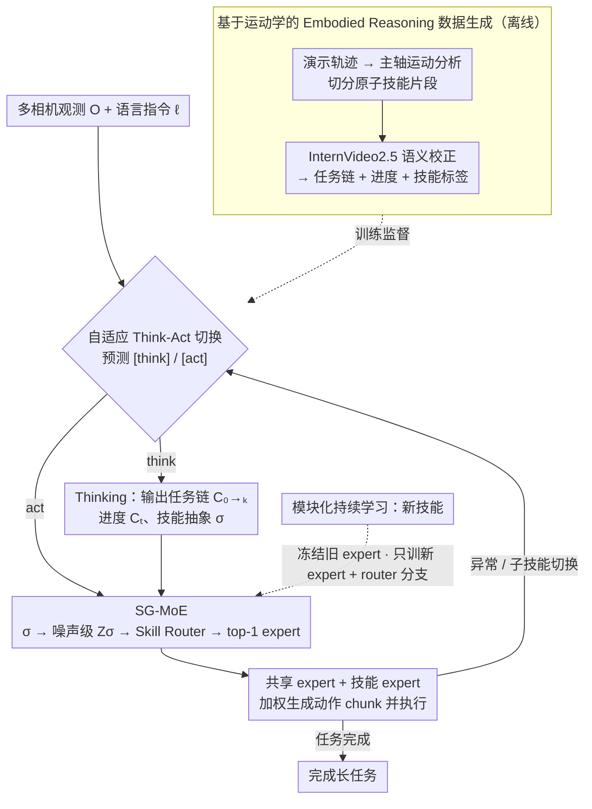

# AtomicVLA: Unlocking the Potential of Atomic Skill Learning in Robots

**会议**: CVPR 2026  
**arXiv**: [2603.07648](https://arxiv.org/abs/2603.07648)  
**机构**: 中山大学、鹏城实验室、银旺智能
**领域**: 机器人操作 / 视觉-语言-动作模型  
**关键词**: VLA, 原子技能, Mixture-of-Experts, 持续学习, 任务规划, 技能路由

## 一句话总结

提出AtomicVLA，在π₀基础上构建统一规划-执行框架，通过自适应Think-Act切换生成原子技能抽象，并用技能引导的MoE（SG-MoE）将动作路由到专精expert执行，LIBERO-LONG成功率从85.2%提升至95.2%（+10%），真实Franka长任务+18.3%，持续学习+21%。

## 研究背景与动机

- **现有瓶颈**：当前VLA模型（π₀、OpenVLA等）使用单一动作解码器，将所有技能知识混合在同一组参数中。面对多步长任务时缺乏显式规划能力，面对新技能学习时存在灾难性遗忘。
- **两阶段方法的不足**：SayCan、Inner Monologue等方法用外部LLM做高层规划+独立底层控制器执行，但规划器与执行器之间缺乏相互感知，导致指令过时或不相关，且存在系统延迟。
- **核心需求**：机器人模型需要同时支持 (1) 高层推理与任务规划，(2) 精细动作生成，(3) 可扩展的持续学习——现有方法无法同时满足这三点。
- **核心思路**：将复杂任务分解为可复用的原子技能（如grasp、push、rotate），每个技能由专属expert处理，通过模块化设计实现技能库的持续扩展。

## 方法详解

### 整体框架

AtomicVLA基于π₀构建端到端框架，统一thinking和acting两种模态。输入为多相机观测 $O_t^{1:n}$ 和语言指令 $\ell$，模型首先自适应预测当前应进入thinking还是acting模式：

- **Thinking模式**：在任务开始或子技能切换时激活，生成三部分输出——任务链 $C_{0 \to k}$（将指令分解为有序子目标）、当前进度 $C_t$、原子技能抽象 $\sigma$
- **Acting模式**：在正常执行阶段激活，基于最新技能抽象 $\sigma$ 和本体感知状态 $s_t$，通过SG-MoE生成动作chunk $A_t$

离线侧先用运动学数据生成造出"任务链+进度+技能标签"的监督；运行时则在 think/act 之间自适应切换，act 阶段由 SG-MoE 把动作路由到专精 expert，执行中检测到异常或子技能切换就回到 think 重规划；新技能则通过"只加不改"的方式扩展技能库：

### 关键设计

**1. 自适应 Think-Act 切换：让模型自己决定该想还是该做**

逐帧都跑一遍高层规划是浪费——大部分时间机器人只是在把一个已经想清楚的子目标执行下去；可一旦完全砍掉规划，模型遇到多步长任务又会迷失方向。AtomicVLA 把"想"和"做"做成一个由模型自己决定的开关：词表里加入两个特殊 token [think] 和 [act]，每个决策步先预测该进哪个模式。预测到 [think] 就进入规划，吐出任务链 $C_{0 \to k}$（把指令拆成有序子目标）、当前进度 $C_t$ 和当前要执行的原子技能抽象 $\sigma$；预测到 [act] 就直接生成动作 chunk。

这样规划只发生在真正需要的时刻——任务起点和子技能切换点——中间执行阶段省去重复推理。更关键的是它带来了错误恢复能力：执行中途如果物体掉落，模型会检测到异常、自动切回 [think] 重新生成技能抽象，再恢复执行，而不是沿着过时的计划一路错下去。

**2. SG-MoE：用语义明确的技能标签做路由，让 expert 真正专精**

标准 MoE 在 token 级别做路由，结果是每个 expert 仍然被迫学一锅混合技能，谈不上专精。SG-MoE 把路由信号换成原子技能抽象 $\sigma$ 本身：借鉴扩散模型的思路，每个原子技能映射到一个标量噪声级别 $\sigma \in [0,100]$，再经可学习嵌入函数转成高维向量 $Z_\sigma = E(\text{norm}(\log(\sigma)))$，Skill Router 在 $Z_\sigma$ 上算出 expert 概率分布并激活 top-1 技能 expert。

架构上同时保留一个共享 expert（继承 π₀ 预训练权重，所有 token 都经过它，维持通用动作能力）和一组原子技能 expert（每个专精一种技能，靠训练自然分化）。最终动作是两者的加权组合：

$$F_{out} = (1-w_k) \cdot F_{share}(x_t) + w_k \cdot F_k(x_t)$$

因为路由键是语义明确的技能标签而非单个 token，同一技能的全部动作 token 都被送到同一个 expert，技能之间的相互干扰被从源头隔开——消融里这一点带来的提升远超 token 级 MoE。

**3. 模块化持续学习：只加不改，从架构层面规避遗忘**

传统 VLA 学新技能靠全量微调，代价是灾难性遗忘——π₀.₅ 学完新技能后旧技能平均掉了 15%。AtomicVLA 把"学新技能"变成纯粹的加法：引入一个新原子技能时，只新增一个随机初始化的技能 expert、把 skill router 的嵌入空间扩展到覆盖新标签，然后冻结所有已有 expert，只训练这个新 expert 和更新后的 router 分支。

旧 expert 一个参数都不动，遗忘自然就无从发生；router 用复制原有权重的方式初始化新分支，保证新技能平滑接入而不扰乱已有路由。这条路线不依赖 EWC 之类的正则化，也不需要经验回放，纯靠架构隔离解决问题。

**4. 基于运动学的 Embodied Reasoning 数据生成：用物理先验替代 VLM 分割**

thinking 模式需要"任务链 + 进度 + 技能标签"这样的高质量监督数据，而传统做法靠 VLM 做视频理解或光流特征来切分动作，歧义多、噪声大，往往要大量人工后处理。AtomicVLA 改用两阶段、以物理运动学为先验的流水线：先对演示轨迹做主轴运动分析，比较平移与旋转分量的大小并追踪夹爪开合状态，据此把轨迹自动切成原子技能片段（例如 z 轴持续下降叠加夹爪闭合就判为 "pick"）；再用 InternVideo2.5 对每个片段做语义标注，校正并丰富初始的原子动作标签。运动学切分给出的边界比 VLM 更精确，也大幅减少了人工标注。

### 一个完整示例：真实 Franka 上"把物体放进微波炉"

以一条需要多步协同的长任务走一遍，看 think-act 闭环和 SG-MoE 路由怎么接力。任务起点，模型预测 [think]，生成任务链 $C_{0 \to k}=$[开微波炉门 → 抓物体 → 放入 → 关门]，进度 $C_t$ 指向第 1 步，并吐出当前原子技能抽象 $\sigma=$"open"。这个 $\sigma$ 被映射成噪声级别、经 router 激活"open"专精 expert，模型随即切到 [act]，连续生成开门的动作 chunk。

开门完成、进入下一子目标时触发子技能切换，模型再次 [think]，把 $\sigma$ 换成"grasp"，router 相应切到 grasp expert，[act] 执行抓取。假如途中物体滑落，模型检测到异常会自动回到 [think]、重新生成 $\sigma=$"grasp" 并恢复抓取，而不是带着错误状态继续。如此 open → grasp → place → close 一路接力，整条链上的 5 个原子技能由 5 个不同的技能 expert 分别承接，共享 expert 始终在背景提供通用动作能力。

### 训练策略

- **Think模式**：交叉熵损失，预测任务链、进度和技能标签的token序列
- **Act模式**：Flow matching损失（继承π₀），预测连续动作chunk
- **总损失**：$\mathcal{L}_{total} = \mathcal{L}_{think} + \mathcal{L}_{act}$
- **Expert配置**：LIBERO和真实机器人实验使用5个技能expert，CALVIN使用8个技能expert
- **两种变体**：AtomicVLA基于π₀构建，AtomicVLA\*基于π₀.₅构建

## 实验关键数据

### 主实验：LIBERO Benchmark（成功率%）

| 方法 | Spatial | Object | Goal | Long | Avg. |
|------|---------|--------|------|------|------|
| Octo | 78.9 | 85.7 | 84.6 | 51.1 | 75.1 |
| OpenVLA | 84.9 | 88.4 | 79.2 | 53.7 | 76.5 |
| CoT-VLA | 87.5 | 91.6 | 87.6 | 69.0 | 81.1 |
| π₀ | 96.4 | 98.8 | 95.8 | 85.2 | 94.2 |
| π₀.₅ | 98.8 | 98.2 | 98.0 | 92.4 | 96.9 |
| **AtomicVLA** | 96.8 | 98.0 | 96.4 | **95.2** | **96.6** |
| **AtomicVLA\*** | **98.8** | **98.8** | **97.2** | **96.2** | **97.8** |

### 主实验：CALVIN ABC→D（长任务序列完成率%）

| 方法 | 1任务 | 2任务 | 3任务 | 4任务 | 5任务 | Avg.Len↑ |
|------|-------|-------|-------|-------|-------|----------|
| π₀ | 94.3 | 87.0 | 77.9 | 68.5 | 59.4 | 3.87 |
| π₀.₅ | 91.9 | 84.6 | 79.4 | 75.5 | 71.0 | 4.02 |
| **AtomicVLA** | 95.0 | 87.8 | 81.9 | 75.0 | 69.1 | **4.09** |
| **AtomicVLA\*** | 94.1 | **88.7** | **85.2** | **81.7** | **77.6** | **4.27** |

### 真实Franka机器人：长任务（成功率%）

| 方法 | 物体入盘 | 物体入抽屉 | 物体入微波炉 | Avg. | ΔAvg. |
|------|----------|------------|-------------|------|-------|
| π₀ | 45 | 55 | 10 | 36.7 | — |
| π₀.₅ | 65 | 35 | 35 | 45.0 | — |
| AtomicVLA | 65 | 60 | 45 | 56.7 | +20.0 |
| AtomicVLA\* | **75** | **60** | **55** | **63.3** | **+18.3** |

### 持续学习：技能扩展实验（成功率%）

| 方法 | Grasp | Stack | Close | Press | Open(新) | Avg. | ΔAvg. |
|------|-------|-------|-------|-------|----------|------|-------|
| π₀.₅ (基线) | 85 | 65 | 70 | 90 | — | 77.5 | — |
| π₀.₅ (持续学习) | 70 | 45 | 60 | 75 | 55 | 61.0 | **-15.0** |
| AtomicVLA\* (基线) | 95 | 80 | 70 | 100 | — | 86.3 | — |
| AtomicVLA\* (持续学习) | 90 | 80 | 80 | 100 | 70 | **82.0** | **-1.3** |

### 消融实验：SG-MoE路由机制（LIBERO-LONG%）

| 方法 | LIBERO-LONG |
|------|-------------|
| π₀ (无MoE) | 85.2 |
| + 标准token级MoE | 88.6 (+3.4) |
| + MoDE (去噪步路由) | 89.5 (+4.3) |
| + **SG-MoE (原子技能路由)** | **95.2 (+10.0)** |

### 关键发现

- **LIBERO-LONG提升最显著**：AtomicVLA在最具挑战性的长序列任务上提升10%，证明显式规划+技能分解对多步任务至关重要
- **SG-MoE远超标准MoE**：标准token级MoE和MoDE仅分别提升3.4%和4.3%，而SG-MoE提升10%——因为前两者仍是token级路由，expert学习混合技能；SG-MoE确保同一技能的所有token由同一expert处理
- **持续学习几乎无遗忘**：π₀.₅学习新技能后旧技能平均下降15%（Stack最严重降20%），AtomicVLA\*仅下降1.3%，从架构层面解决遗忘问题
- **混合训练技能干扰**：不同夹爪状态需求的任务混合训练会互相干扰（如抽屉开启不需闭合夹爪，影响抓取任务），SG-MoE通过技能隔离有效缓解
- **错误恢复能力**：AtomicVLA在执行失败时能自动检测异常并重新规划（如物体掉落后重新生成技能抽象），但CALVIN评测框架不认可恢复后的完成，报告数字可能低估真实能力

## 亮点与洞察

- **Think-Act统一范式**：不是简单的chain-of-thought叠加，而是将规划与原子技能抽象深度耦合——thinking的输出直接驱动MoE的路由决策，规划和执行在同一模型中形成闭环
- **噪声调度式技能嵌入**：借鉴扩散模型的思路将离散技能标签映射到连续嵌入空间做路由，设计巧妙且实验证明优于通用token路由
- **"只加不改"的持续学习**：不依赖正则化（EWC等）或经验回放，而是从架构设计上冻结旧expert、只训练新expert，简单有效
- **主轴分析数据生成**：用运动学主轴分析替代VLM视频理解做原子动作分割，物理先验更可靠且不依赖人工标注

## 局限性

- 原子技能标签质量依赖InternVideo2.5的生成能力，对罕见或高度专业化操作可能标注不准
- SG-MoE采用top-1路由，需要多技能协同的动作（如"边推边转"）可能需要top-k路由
- 每新增一个技能就增加一个expert，长期参数量线性增长——缺乏expert合并或剪枝机制
- CALVIN上提升（+0.22 avg len）相对LIBERO较小，可能因CALVIN任务粒度与原子技能对齐不够紧密
- 混合训练异构任务时仍存在干扰（如夹爪状态冲突），SG-MoE缓解但未完全消除

## 相关工作与启发

- **vs π₀/π₀.₅**：纯flow matching动作预测，无显式规划。AtomicVLA在其基础上增加thinking和技能路由，LIBERO-Long +10%验证规划的价值
- **vs SayCan/Inner Monologue**：外部LLM做规划+独立控制器执行，规划与执行分离导致模态gap。AtomicVLA统一在同一模型中
- **vs MoDE**：用去噪时间步做路由信号，本质仍是token级路由。SG-MoE用语义明确的技能标签路由，+5.7%证明技能级路由更优
- **MoE技能路由的通用性**：噪声调度式嵌入路由可迁移到多任务NLP——用任务描述嵌入做expert路由
- **模块化持续学习范式**：冻结旧expert+新增新expert的策略可用于视觉大模型的领域持续预训练

## 评分

- 新颖性: ⭐⭐⭐⭐⭐ Think-Act统一 + SG-MoE噪声调度路由 + 模块化持续学习，三大创新点自洽
- 实验充分度: ⭐⭐⭐⭐ LIBERO四子集 + CALVIN + 真实Franka + 消融 + 持续学习，数据充实
- 写作质量: ⭐⭐⭐⭐ 动机-方法-实验逻辑清晰，SG-MoE架构图直观，算法伪代码规范
- 价值: ⭐⭐⭐⭐⭐ 对VLA持续学习和长任务规划有重要贡献，SG-MoE思路具有通用启发价值

<!-- RELATED:START -->

## 相关论文

- [\[NeurIPS 2025\] Policy Compatible Skill Incremental Learning via Lazy Learning Interface](../../NeurIPS2025/robotics/policy_compatible_skill_incremental_learning_via_lazy_learning_interface.md)
- [\[CVPR 2026\] MergeVLA: Cross-Skill Model Merging Toward a Generalist Vision-Language-Action Agent](mergevla_cross-skill_model_merging_toward_a_generalist_vision-language-action_ag.md)
- [\[ICCV 2025\] iManip: Skill-Incremental Learning for Robotic Manipulation](../../ICCV2025/robotics/imanip_skill-incremental_learning_for_robotic_manipulation.md)
- [\[NeurIPS 2025\] Periodic Skill Discovery](../../NeurIPS2025/robotics/periodic_skill_discovery.md)
- [\[ICLR 2026\] RoboCasa365: A Large-Scale Simulation Framework for Training and Benchmarking Generalist Robots](../../ICLR2026/robotics/robocasa365_a_large-scale_simulation_framework_for_training_and_benchmarking_gen.md)

<!-- RELATED:END -->
