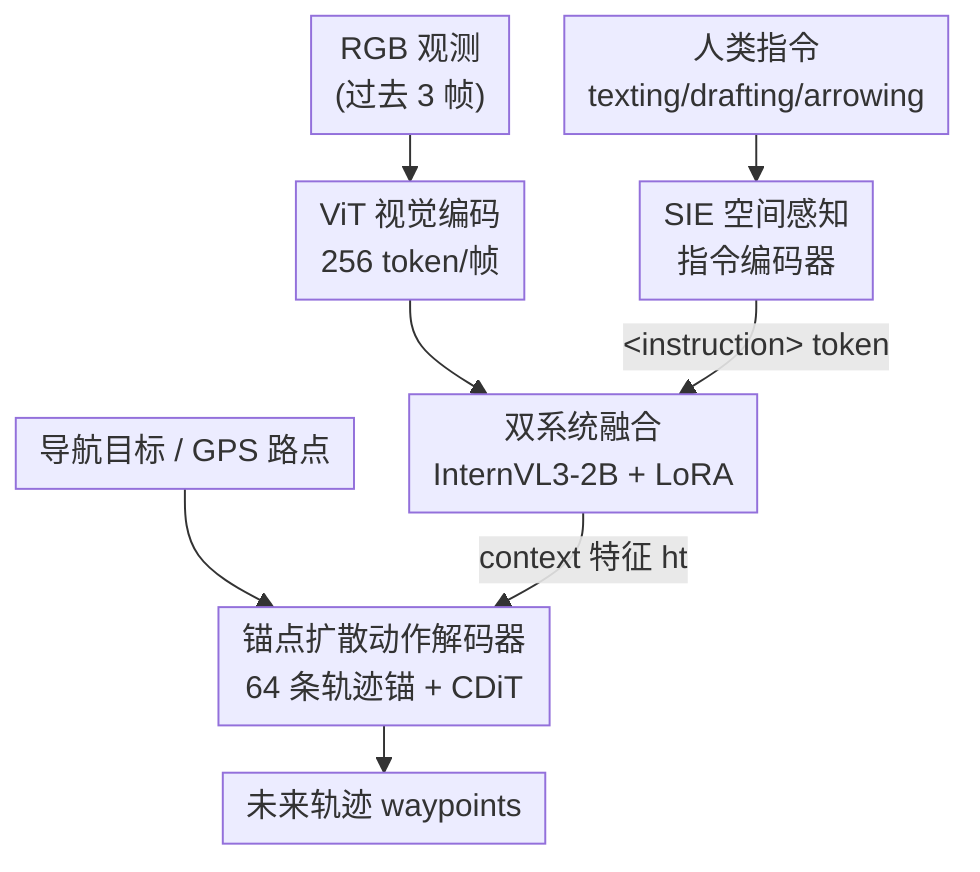

# AURA: Multi-modal Shared Autonomy for Urban Navigation

**会议**: CVPR 2026  
**论文**: [CVF Open Access](https://openaccess.thecvf.com/content/CVPR2026/html/Ma_AURA_Multi-modal_Shared_Autonomy_for_Urban_Navigation_CVPR_2026_paper.html)  
**代码**: 项目页 https://vail-ucla.github.io/aura/ （未见独立代码仓）  
**领域**: 具身智能 / 机器人导航  
**关键词**: 共享自治, 视觉-语言-动作 (VLA), 城市人行道导航, 扩散策略, 指令跟随

## 一句话总结
AURA 把城市人行道导航拆成「人给高层指令、AI 做低层控制」的分层共享自治，用一个 SIE 把文字/画线/箭头三类人类指令对齐到场景的语义与几何，再用锚点扩散策略生成轨迹，在仿真和真实世界把接管频率降了 44%、人类操作成本降了 70%+。

## 研究背景与动机
**领域现状**：人行道上的配送机器人、辅助轮椅等"移动机器"，目前普遍靠人在环（human-in-the-loop）远程遥操作或贴身监督来保证安全。学界提出的共享自治（shared autonomy）让 AI 在训练或测试阶段辅助人类操作机器，目标是把人解放出来只做"监控 + 失败兜底"。

**现有痛点**：现有共享自治方法几乎都假设人和 AI 工作在**同一个低层动作空间**——即都直接控制轮速/转向，于是人必须以和 AI 相同的频率持续操作。对城市人行道送货这类长程任务来说，这种耦合既低效又认知负担极重：人要一直盯着方向盘级别的细节。

**核心矛盾**：长程导航真正需要人介入的是**高层策略判断**（怎么绕过人群、走哪条替代路线），但现有框架却把人锁死在**高频低层控制**上；同时纯语言指令（RLHF/InstructGPT 那套离线对齐）只能表达高层意图，无法支撑导航所需的实时、高频、安全攸关的细粒度纠正。

**本文目标**：设计一个能理解多模态人类指令、又能自己干低层控制的共享自治系统，让人只在需要时用低带宽方式介入，从而大幅降低操作成本。

**切入角度**：把城市导航按抽象层级"分工"——人负责高层指令（推理 corner case、提议路线），AI 负责低层执行（车道保持、避障）。关键观察是：人类介入有三种天然的低带宽方式——打字（texting）说意图、在画面上画一条路径（drafting）、画箭头（arrowing）给速度方向，都比连续摇杆轻松。

**核心 idea**：用一个双系统 VLA 模型，把"理解多模态人类指令"和"扩散策略生成轨迹"接到一起，并专门设计 SIE 把指令里的几何信息显式接地到场景空间，让人用一句话/一条线/一个箭头就能引导机器人。

## 方法详解

### 整体框架
AURA 是一个端到端的共享自治框架，输入是机器人第一视角的 RGB 观测（过去 3 帧）加上可选的人类指令，输出是控制机器人的未来轨迹 waypoints。它提供两种模式：**Autopilot**（自动驾驶档）下输入稀疏 GPS 路点，自己做人行道跟随与避障；**Takeover**（接管档）下当 GPS 不可靠、目标含糊或遇到处理不了的 corner case 时，人通过 texting / drafting / arrowing 介入提示。整个系统只靠单目 RGB 感知，不需要预建地图或显式定位模块，把导航建模为序贯决策。

架构上是**双系统**：一个多模态编码器把观测和指令编码成 context 特征，一个基于扩散的策略执行器据此生成轨迹。具体地，过去/当前 RGB 帧先过 ViT 视觉编码器（resize 到 448×448，每帧投影成 256 个 image token）；人类指令经 SIE 编码后通过一个特殊的 `<instruction>` token 注入；两路 token 在 InternVL3-2B 这个预训练 LLM（挂 LoRA 适配器）里融合，从第 12 层抽中间表示 $h_t$（在推理速度和表示质量间折中），并挂一个轻量 text head 解码可读的推理 trace 做语言监督。最后 $h_t$ 被 DiT 动作解码器交叉注意，条件化地生成连续轨迹。

### 关键设计

**1. 分层共享自治与双系统架构：把人锁在高频低层控制里解放出来**

针对"人和 AI 被迫共享同一低层动作空间、人要全程高频操作"这个痛点，AURA 把导航显式拆成两个抽象层：人只在 Takeover 档给高层指令，AI 在 Autopilot 档自己跑低层控制，两档之间按需切换（hierarchical takeover）。落到模型上就是双系统：多模态 VLM 编码器负责"读懂人想干什么"，扩散策略负责"算出怎么走"。这种 VLA 设计的好处是 AI 当"自动驾驶助手"可以无硬件改造地插进现有配送机器人，人不再需要连续摇杆，只要偶尔用低带宽指令纠偏；和"全人操作 ↔ 全 AI 控制"硬切换的旧范式相比，它把人类介入的粒度从"每帧控制"降到"偶发的高层提示"。

**2. SIE 空间感知指令编码器：让 VLM 真正"接地"人类指令的几何**

共享自治最难的是理解含糊的人类指令并把它接地到周围空间，而标准 VLM 语义强、空间几何弱。SIE（Spatial-Aware Instruction Encoder）专门补这块。它先把指令（轨迹线、转向箭头）**渲染**到观测图上当 visual prompt，用同一个视觉编码器编出指令视觉特征 $V_c$，借 ViT 现成的语义理解力；再为不同模态注入**几何**嵌入。对 drafting（画线），沿投影轨迹线在归一化图像空间采 $K$ 个像素点 $p_d=\{(u_i,v_i)\}$，仿照 Segment Anything 用可学习高斯随机矩阵 $w$ 的 Fourier 位置编码

$$PE(p_{d,i}) = [\sin(w^\top p_{d,i}),\ \cos(w^\top p_{d,i})]$$

并加可学习的序号嵌入保住点序：$E^{(i)}_d = PE(p_{d,i}) + \mathrm{PosEmbed}(i)$，再过 MLP + 自注意力得 $E_d$。对 arrowing（画箭头，给速度 $v$ 与朝向 $\omega$），用一个对前后运动都成立的旋转不变编码

$$E_s = \mathrm{MLP}\big([\cos(\omega'),\ \sin(\omega'),\ \log(1+|v|)]\big),\quad \omega' = \omega + \pi\cdot \mathbb{1}_{v<0}$$

几何嵌入 $E\in\{E_d,E_s\}$ 再与指令视觉特征 $V_c$ 做带残差的交叉注意力，过 4 头自注意力和 MLP 得到 instruction-aware 特征注入 LLM。实验显示：visual prompt 管短期跟踪准、几何编码管长期空间一致与目标记忆——两者结合才能在指令过时（4 秒前下达）时仍稳。

**3. 锚点扩散动作解码器：用运动基元锚点而非高斯噪声起步**

低层控制要在连续长程轨迹上生成多模态可行解。AURA 用一个基于扩散的 DiT 策略，但**不从高斯噪声起步**，而是从 MM-CoS 聚类出的 $m=64$ 条轨迹锚点（直行、转弯、停止等运动基元）初始化扩散过程。沿用作者前作 MIMIC，一个轻量 transformer 解码器在 context 特征 $h_t$、导航目标 $g_t$、扩散时间步嵌入 $t_d$ 条件下去噪，输出精修轨迹及其置信分。训练时损失是模式分类 + 轨迹回归

$$L = L_{cls} + L_{reg}$$

其中 $L_{cls}$ 用交叉熵选出离 GT 最近的模式，$L_{reg}$ 最小化预测与 GT 轨迹的 L2 距离。从锚点起步既给扩散一个结构化先验、又天然支持多模态轨迹（anchor-based 回归 + 分类），比纯噪声起步更稳更快。

**4. MM-CoS 数据集与自动标注流水线：把遥操作日志变成多模态指令监督**

要训这套模型缺数据：现有数据集多在校园/室内/广场，缺真实人行道；且缺高质量、能解释动作的文字说明。AURA 复用作者前作 50 小时、3040 条真实人行道遥操作轨迹（CoS），再融合 RECON / SCAND / EgoWalk 构成 MM-CoS。自动标注分两步选帧：先用 InternVL3-8B 给视频帧按视觉复杂度（行人交互、障碍、地形变化）打"interestingness"先验，再融合滑窗内的运动统计（加速度、转向率）得到加权运动显著性，据此排序优先标注信息量大的帧；随后用 Qwen2.5VL-72B 生成 command 式指令加长描述。每帧产出三类互补标注——texting（短动词短语如"go straight / slow down"）、drafting（由 GT 未来轨迹渲染的路径）、arrowing（瞬时速度），正好镜像共享自治里的三种人类接口，让人能在不同抽象层介入而无需连续遥操作。

### 损失函数 / 训练策略
两阶段训练。**第一阶段**做指令条件化的 VLM 适配：冻结视觉编码器和原始视觉→语言投影 MLP，只训新引入的 SIE 模块，并对 LLM 用 LoRA 高效适配；用生成的轨迹 caption 上的语言建模损失训练，让 VLM 学会通过自然语言接地来编码语义-空间指令信号。**第二阶段**端到端训扩散策略：冻结多模态编码器，从头训扩散解码器和辅助编码器（目标、相机、轨迹锚编码器），损失即上面的 $L = L_{cls} + L_{reg}$。

## 实验关键数据

### 主实验
开环评测（MM-CoS 测试集，预测轨迹对比 GT；`*` 表示在本文数据集上重训）。AURA 四个变体分别用不同指令模态，arrowing 变体 L2 最低、drafting 变体 mAP 最高：

| 方法 | minADE@1s↓ | minFDE@1s↓ | L2@1s↓ | L2@2s↓ | mAP↑ |
|------|-----------|-----------|--------|--------|------|
| GNM‡ | 0.594 | 0.988 | 0.988 | - | - |
| NoMaD‡ | 0.523 | 0.858 | 1.072 | 2.182 | 0.216 |
| CityWalker | 0.648 | 1.125 | 1.125 | - | - |
| ViNT* | 0.247 | 0.450 | 0.425 | 0.925 | - |
| CityWalker* | 0.180 | 0.353 | 0.353 | 0.786 | - |
| **AURA (arrowing)** | **0.108** | 0.220 | **0.150** | **0.473** | 0.750 |
| **AURA (drafting)** | 0.122 | 0.218 | 0.244 | 0.557 | **0.844** |

arrowing 变体 L2@2s 0.473，比最强基线 CityWalker*（0.786）低 **39.8%**；整体看几何指令（drafting/arrowing）比纯语言指令给出更强的空间引导。

真实世界闭环（8 场景 16 路线约 2.8 km），AURA 在所有人类成本指标上最低：

| 方法 | HO(%)↓ | NIR↓ | ODR↓ | TSR↑ |
|------|--------|------|------|------|
| NoMaD | 9.74 | 43.2 | 11.3 | 89.0 |
| CityWalker | 14.56 | 48.29 | 20.0 | 80.3 |
| Gemini | 16.9 | 255.7 | 32.0 | 63.2 |
| **AURA** | **1.73** | **16.99** | **10.5** | **89.3** |

（HO=人类操作占比，NIR=每 100 米紧急介入次数，ODR=偏离距离比，TSR=有效自主时间率。）

### 消融实验
指令理解能力（ROUGE-L 与用 QwenVL2.5-72B 算的 Intent/Qwen Score）：

| 配置 | Finetune | Visual Prompt | SIE | ROUGE-L↑ | Intent Score↑ |
|------|----------|---------------|-----|----------|---------------|
| InternVL3-2B | ✗ | ✗ | ✗ | 0.167 | 2.019 |
| InternVL3-8B | ✗ | ✗ | ✗ | 0.184 | 2.818 |
| InternVL3-2B | ✓ | ✓ | ✗ | 0.532 | 4.885 |
| AURA | ✓ | ✗ | ✓ | 0.534 | 4.842 |
| **AURA** | ✓ | ✓ | ✓ | **0.581** | **5.446** |

### 关键发现
- **微调 + 数据集贡献最大**：在合成标注数据上微调后，小模型 InternVL3-2B 的指令跟随大幅超过未微调版，甚至超过更大的 InternVL3-8B（0.532 vs 0.184 ROUGE-L），说明任务对齐比单纯堆参数更关键。
- **visual prompt 和 SIE 几何编码互补**：只用 SIE projector 就能逼平"原 VLM + visual prompt"；两者合用才最好（ROUGE-L 0.581 / Intent 5.446）。端到端规划里，缺语义表示的模型在预测 4 秒前的旧指令时最差、甚至不如无目标输入；几何编码在长程上靠稳定空间结构和目标记忆顶住，visual prompt 则随视野变化失效——二者结合短期准、长期稳。
- **共享控制成本大降**：伪仿真里只给高层指令时人类操作时间降 9.9%、操作频率 0.498（相对降 **44%**）；真实世界 HO 仅 1.73%，远低于 NoMaD 的 9.74%。

## 亮点与洞察
- **三种低带宽人类接口的统一**：texting/drafting/arrowing 既是推理时的人机交互方式，又被自动标注流水线镜像成三类训练标签，接口与监督信号同构——这个"交互即监督"的设计很值得迁移到其他需要人类介入的具身任务。
- **几何接地的巧法**：把 SAM 式 Fourier 位置编码搬来编画线轨迹点、用旋转不变编码处理前后箭头，是把"VLM 语义强但空间弱"这个老问题落到可训练嵌入上的具体解法。
- **从运动基元锚点起步的扩散**：用 64 条聚类锚点代替高斯噪声初始化，给扩散策略一个结构化先验，是在连续长程轨迹生成上提稳的实用 trick。

## 局限与展望
- 论文未给独立代码仓（仅项目页），可复现性依赖附录细节与前作 MIMIC/CoS。
- 真实世界 pilot 规模较小（8 场景 16 路线 2.8 km，单一轮式机器人），泛化到不同机型/极端天气仍待验证。
- 伪仿真用规则化 judgment 模块判定是否需接管，并假设每次接管固定 2 秒，人类介入的随机性被简化，⚠️ 与真实人类行为可能有差距。
- 横向比较需注意：表 1 中部分基线缺 mAP/L2@2s（确定性单轨迹输出或更短预测视野），不可直接按数值大小一概而论。

## 相关工作与启发
- **vs 同动作空间的共享自治（如 CityWalker、HACO 类）**：它们让人和 AI 共享低层动作空间、人要高频操作；AURA 按抽象层分工，人只给高层指令，把接管频率降 44%。
- **vs 纯语言指令 VLA（InstructGPT/RLHF 式离线对齐）**：纯语言只能表达高层意图、撑不起导航所需的高频实时纠正；AURA 引入 drafting/arrowing 几何指令 + SIE 接地，补上细粒度空间引导。
- **vs 视觉导航基础模型（GNM/ViNT/NoMaD）**：它们靠海量视频做点目标/图像目标导航，偏全自动；AURA 在其上叠加人类指令通道与扩散策略，定位是"人机协同的辅助自治"而非纯端到端自动。

## 评分
- 新颖性: ⭐⭐⭐⭐ 把分层共享自治、多模态几何指令接地 (SIE) 与锚点扩散策略系统地组合到城市人行道导航，问题设定新颖。
- 实验充分度: ⭐⭐⭐⭐ 开环 + 伪仿真 + 真实世界三层评测，消融拆清 SIE 语义/几何分量，但真实世界规模偏小。
- 写作质量: ⭐⭐⭐⭐ 动机清晰、模块与公式交代到位，个别符号 (OCR 致) 需对原文核对。
- 价值: ⭐⭐⭐⭐ 对人行道配送/辅助机器人这类 human-in-the-loop 场景有直接落地价值，接口即监督的思路可迁移。

<!-- RELATED:START -->

## 相关论文

- [\[CVPR 2026\] FloVerse: Floor Plan-Guided Multi-Modal Navigation](floverse_floor_plan-guided_multi-modal_navigation.md)
- [\[CVPR 2026\] Multi-SpatialMLLM: Multi-Frame Spatial Understanding with Multi-Modal Large Language Models](multi-spatialmllm_multi-frame_spatial_understanding_with_multi-modal_large_langu.md)
- [\[CVPR 2026\] HTNav: A Hybrid Navigation Framework with Tiered Structure for Urban Aerial Vision-and-Language Navigation](htnav_a_hybrid_navigation_framework_with_tiered_structure_for_urban_aerial_visio.md)
- [\[CVPR 2026\] CLaD: Planning with Grounded Foresight via Cross-Modal Latent Dynamics](clad_planning_with_grounded_foresight_via_cross-modal_latent_dynamics.md)
- [\[CVPR 2026\] DiffuView: Multi-View Diffusion Pretraining for 3D-Aware Robotic Manipulation](diffuview_multi-view_diffusion_pretraining_for_3d_aware_robotic_manipulation.md)

<!-- RELATED:END -->
