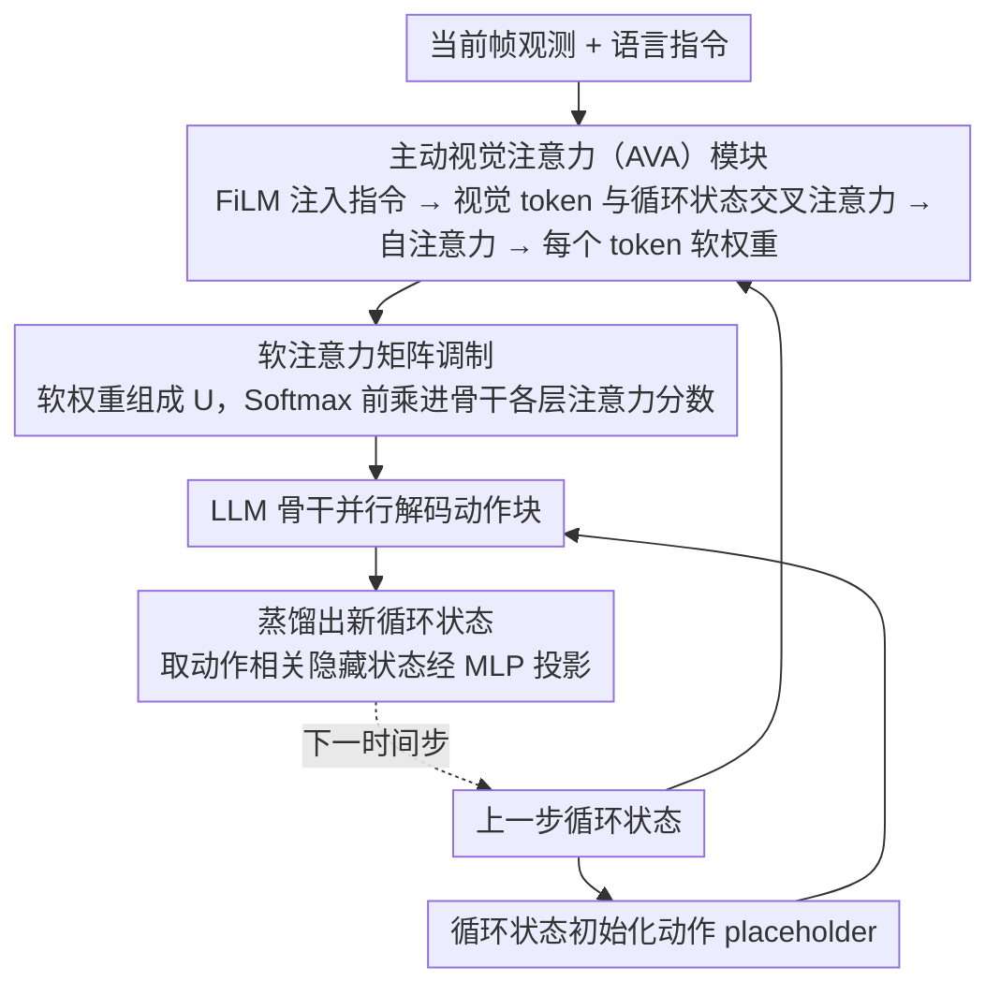

# AVA-VLA: Improving Vision-Language-Action models with Active Visual Attention

**会议**: CVPR 2026 Highlight  
**arXiv**: [2511.18960](https://arxiv.org/abs/2511.18960)  
**代码**: [项目页面](https://liauto-dsr.github.io/AVA-VLA-Page)  
**领域**:机器人
**关键词**: VLA模型, 主动视觉注意力, POMDP, 循环状态, 视觉token调制

## 一句话总结

从POMDP视角重新审视VLA模型的视觉处理，提出AVA-VLA框架通过循环状态和主动视觉注意力模块，根据历史上下文动态调制当前帧的视觉token重要性，在LIBERO和CALVIN等基准上达到SOTA。

## 研究背景与动机

视觉-语言-动作（VLA）模型在机器人操作任务中展现了显著进展，但大多数方法在每个时间步独立处理视觉观测，隐式地将机器人操作建模为马尔可夫决策过程（MDP）。这种无历史设计存在根本缺陷：

1. 真实机器人控制本质上是部分可观测的（POMDP），当前帧无法完整描述环境状态
2. 视觉注意力仅由静态语言指令引导，无法根据历史动作抑制时间冗余信息
3. 模型无法预判"接下来应该关注什么"，视觉系统是被动的而非主动的

例如，在"打开炉灶并把摩卡壶放上去"的任务中，vanilla OpenVLA-OFT无法定位任务关键的"炉灶开关"，而AVA-VLA通过利用历史上下文可以稳定聚焦。

## 方法详解

### 整体框架

AVA-VLA 想解决的是 VLA 模型"逐帧独立看图"带来的盲区：每一步都把当前帧当成完整状态来处理，既看不出哪些视觉信息已经在前几步用过、可以忽略，也无法根据历史经验提前判断"接下来该盯哪里"。论文的解法是给模型挂一条贯穿时间步的循环状态，把它当作 POMDP 信念状态的近似，再用这条历史去主动重新分配当前帧视觉 token 的注意力。

整条流水线按时间步循环推进：当前帧观测先和上一时间步留下的循环状态一起喂进 AVA 模块，算出每个视觉 token 的软权重；这组权重被写进 LLM 骨干每一层的注意力矩阵，抬高关键区域、压低冗余区域；循环状态同时用来初始化动作 placeholder，骨干并行解码出一个动作块；最后从这一步骨干的隐藏状态里再蒸出新的循环状态，交给下一时间步。这样视觉处理就从"被动接收"变成了"带着记忆主动聚焦"。

### 关键设计

**1. 循环状态：用一条压缩历史近似 POMDP 的信念状态**

机器人控制本质是部分可观测的（POMDP），理论上每一步都该维护一个对环境真实状态的信念分布，但精确计算信念状态在高维视觉输入下根本不可行。AVA-VLA 退而求其次，用一条循环状态向量当作信念状态的神经近似：它从上一时间步 LLM 最后一层里与动作相关的隐藏状态出发，经一个 MLP 投影压缩得到，因此天然携带了"前面发生了什么、动作进行到哪一步"的上下文。这条状态有两个去处——一是作为历史条件输入下面的 AVA 模块，二是直接用来初始化当前步的动作 placeholder，让动作解码一开始就带着历史先验，而不是从空白起步。

**2. 主动视觉注意力（AVA）模块：让历史来决定当前帧该看哪里**

光有历史还不够，得让历史真正作用到"看图"这件事上。AVA 模块先用 FiLM 把语言指令特征注入视觉特征，做一次指令条件化，保证聚焦方向和任务语义对齐；接着把视觉 token 当 Query、把循环状态当 Key/Value 做交叉注意力，再叠一层自注意力，让每个视觉 token 既问"按历史经验我重不重要"、又彼此协调。模块最终为每个视觉 token 吐出一个软权重——可以理解为"增强 / 削弱"二分类经过加权后得到的连续分数。和只靠静态语言指令引导注意力的做法相比，这里的权重是随历史动态变化的，所以能抑制那些已经看过、对当前决策冗余的时间信息，把注意力让给真正关键的区域（比如任务里那个还没操作的"炉灶开关"）。

**3. 软注意力矩阵调制：把软权重灌进骨干每一层而不动其结构**

AVA 算出的软权重要落地，得改写 LLM 骨干的注意力计算。论文把这组权重组织成一个软注意力矩阵 $U$，只对视觉 token 所在的位置施加权重，并在 Softmax 之前把它乘进原始注意力分数里——即先缩放再归一化，让被增强的视觉 token 在后续每一层都更容易被读取。关键是这个 $U$ 在骨干各层之间共享，保证全网络对同一批关键区域保持一致聚焦，而不会层层漂移；同时整个调制只是在已有注意力分数上做逐位置加权，不新增分支、不改骨干结构，因此能即插即用地挂到现成的 VLA 骨干上。

### 损失函数 / 训练策略

- 动作预测 MAE 损失 + L2 正则化，正则项把软权重均值约束到目标值 $c$ 附近，避免权重过于分散、退化成"什么都看"。
- 采用截断时间反向传播（T=4 步），在计算可行性和时间动态学习之间取平衡。
- 初始循环状态设为零向量，每个 episode 开始时重置。

## 实验关键数据

### 主实验

| 基准 | 指标 | AVA-VLA | OpenVLA-OFT | 提升 |
|------|------|---------|-------------|------|
| LIBERO (全部4套) | 平均SR | 98.0% | 96.8% | +1.2% |
| LIBERO-Long | SR | 97.6% | 95.3% | +2.3% |
| CALVIN ABC→D | 平均长度 | 4.65 | 4.28 | +0.37 |
| 真实机器人 | 平均SR | 最高 | 次高 | 多任务提升 |

### 消融实验

| 配置 | LIBERO平均SR | 说明 |
|------|-------------|------|
| OpenVLA-OFT基线 | 96.8% | 无历史信息 |
| + 状态初始化 | 97.5% | 循环状态注入动作placeholder |
| + AVA模块 | 97.5% | 视觉token重加权 |
| + 两者结合 | 98.0% | 互补效果 |

### 关键发现

- 视觉token裁剪实验：裁剪70%视觉token后性能仍超过基线OpenVLA-OFT（97.3 vs 96.8），验证AVA模块有效识别了关键区域
- 不同骨干实验：在OpenVLA-7B、LLaMA2-7B、Qwen2.5-0.5B上均有提升，通用性好
- 可视化显示AVA权重一致聚焦于机器人接触区域和目标物体

## 亮点与洞察

- POMDP理论视角为VLA模型的历史建模提供了优雅的理论基础
- AVA模块轻量且即插即用，不改变LLM骨干结构
- 软权重的副产品——视觉token裁剪潜力，为VLA效率优化提供方向
- 在最具挑战性的LIBERO-Long和CALVIN长序列任务上改进最显著

## 局限与展望

- 截断反向传播（T=4）限制了长期依赖的学习
- 循环状态仅来自上一步，未探索更长记忆窗口
- 软权重仅调制注意力矩阵，未直接修改视觉特征表示
- 真实机器人实验数据量较少（30-450条演示）

## 相关工作与启发

- **vs OpenVLA/UniVLA**: 自回归解码动作，无历史建模；AVA-VLA通过循环状态保留时间上下文
- **vs CoT-VLA**: 使用思维链进行推理但不显式建模视觉注意力的时间动态
- **vs SP-VLA/FLOWER**: 关注视觉token效率裁剪，但不基于历史上下文做主动聚焦

## 评分

- 新颖性: ⭐⭐⭐⭐ POMDP视角+主动视觉注意力的结合在VLA领域新颖
- 实验充分度: ⭐⭐⭐⭐⭐ LIBERO/CALVIN/真实机器人全覆盖，消融/可视化/裁剪分析充分
- 写作质量: ⭐⭐⭐⭐ 动机清晰，理论推导简洁，实验呈现规范
- 价值: ⭐⭐⭐⭐ 为VLA模型提供了时间感知的视觉处理新范式

<!-- RELATED:START -->

## 相关论文

- [\[CVPR 2026\] SaPaVe: Towards Active Perception and Manipulation in Vision-Language-Action Models for Robotics](sapave_active_perception_manipulation_vla_roboti.md)
- [\[CVPR 2026\] ACoT-VLA: Action Chain-of-Thought for Vision-Language-Action Models](acot-vla_action_chain-of-thought_for_vision-language-action_models.md)
- [\[AAAI 2026\] TTF-VLA: Temporal Token Fusion via Pixel-Attention Integration for Vision-Language-Action Models](../../AAAI2026/robotics/ttf-vla_temporal_token_fusion_via_pixel-attention_integratio.md)
- [\[CVPR 2026\] HiF-VLA: Hindsight, Insight and Foresight through Motion Representation for Vision-Language-Action Models](hif-vla_hindsight_insight_and_foresight_through_motion_representation_for_vision.md)
- [\[CVPR 2026\] Adaptive Action Chunking at Inference-time for Vision-Language-Action Models](adaptive_action_chunking_at_inference-time_for_vision-language-action_models.md)

<!-- RELATED:END -->
