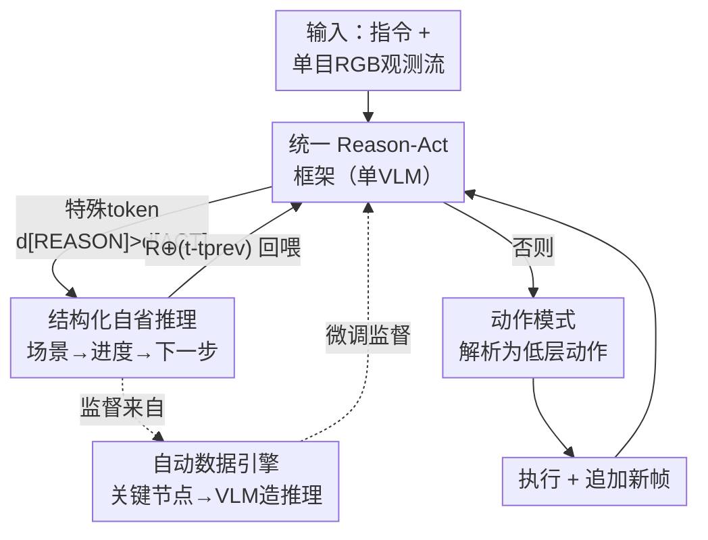

# AwareVLN: Reasoning with Self-awareness for Vision-Language Navigation

**会议**: CVPR 2026  
**arXiv**: [2605.22816](https://arxiv.org/abs/2605.22816)  
**代码**: https://gwxuan.github.io/AwareVLN/ (项目主页)  
**领域**: 机器人 / 具身导航 / 多模态VLM  
**关键词**: 视觉语言导航, 自我感知推理, 稀疏推理, 自动数据引擎, VLN-CE

## 一句话总结
AwareVLN 给端到端 VLN 模型装上"自我感知推理"能力——只在关键导航节点（子任务完成 / 走偏 / 停错）稀疏触发结构化推理，并用一个无需人工标注的自动数据引擎生成这种自省式监督，使纯单目 RGB 智能体在 R2R-CE / RxR-CE 上大幅超过此前 SOTA。

## 研究背景与动机
**领域现状**：视觉语言导航（VLN）要求智能体把自然语言指令落地为自己在 3D 环境中的真实移动。当前两条主线：一是传统的显式建图派（拓扑图 + SLAM + 启发式规划），效果好但依赖额外 3D 传感器、难以做大规模视觉语言预训练；二是近期火起来的端到端 VLM 派（NaVid / NaVILA / StreamVLN 等），直接把指令和 RGB 观测映射到低层动作，只靠 RGB 就能跑、泛化性强。

**现有痛点**：端到端 VLM 派几乎都在"驯服 VLM 去预测动作"，却**没用上 VLM 本身的推理能力**。结果是导航过程像黑盒——不知道自己走到哪一步、有没有走偏、该不该停，缺乏纠错和精细规划能力。最接近的 Nav-R1 虽然尝试用双系统机制在**固定间隔**做推理，但它的推理监督数据是拿通用 VLM 查询历史观测生成的，缺乏真正的"自我感知"知识，推理往往浮于表面、且只是文本输出，并不指导后续动作。

**核心矛盾**：要让智能体"懂自己"，就得有高质量、贴合真实导航进度的推理监督；但这种监督既难人工标注、又不能像 Nav-R1 那样固定间隔无脑触发（每步都推理既低效又信息冗余）。**何时该推理、推理什么内容、推理如何反过来指导动作**，三者都没解决好。

**本文目标**：(1) 让模型自己决定"什么时候值得停下来想一想"；(2) 想的时候做结构化、有深度的自省（我在哪、进度如何、下一步怎么走）；(3) 推理结果要真正喂回后续动作生成；(4) 这些推理监督要能规模化、零人工标注地造出来。

**切入角度**：作者观察到——真正需要推理的是**关键节点**（一个子指令刚完成、发现走偏了、快到终点却对不上目标描述），而不是每一帧。在这些节点稀疏触发结构化推理，既高效又能逼出真正的自我感知。

**核心 idea**：用"稀疏触发的结构化自省推理 + 进度感知的自动数据引擎"替代"密集/固定间隔的浅层推理"，把自我感知做进一个统一的 reason-act 模型里。

## 方法详解

### 整体框架
AwareVLN 把推理和动作预测统一进**同一个 VLM**（而非两个分离模型），让"想"和"做"的知识在一个模型里互相增强。给定指令 $\mathcal{I}=\{w_1,\dots,w_l\}$ 和单目 RGB 观测流 $\mathcal{O}_t=\{\mathbf{x}_0,\dots,\mathbf{x}_t\}$（无深度、无位姿，均匀采样 8 帧作为视觉输入），模型每步先输出一个**特殊 token 的 logit** $d$ 来决定进入哪种模式：$d_{\texttt{[REASON]}}>d_{\texttt{[ACT]}}$ 就进推理模式、生成一段结构化自省文本 $\mathcal{R}$；否则进动作模式、输出一条可解析为低层动作（FORWARD / TURN-LEFT / TURN-RIGHT / STOP）的指令。上一轮推理结果 $\mathcal{R}$ 会和"距上次推理的步数差"拼接后回喂下一步（$\mathcal{R}'=\mathcal{R}\oplus(t-t_{\mathrm{prev}})$），形成时序自我感知的闭环。训练监督则由一个**自动数据引擎**离线造好：在 Habitat 里收集轨迹、用房间语义+真值路点自动找出关键节点、再让通用 VLM（Qwen-VL-Max）把节点上下文转成结构化推理文本。

### 关键设计

**1. 统一 Reason-Act 框架：用一个特殊 token 在"想"和"做"之间切换**

痛点是现有方法要么只预测动作（黑盒、不会纠错），要么像 RT-H 那样用两个分离的 VLM（推理和动作各管各的，知识不互通）。AwareVLN 把两者塞进**同一个策略** $\pi_\theta$，每步只先解码一个特殊 token 的 logit 来分流：$d,y_t=\pi_\theta\big(f_{\mathrm{tok}}(\mathcal{I}),f_{\mathrm{tok}}(\mathcal{R}'),f_{\mathrm{vis}}(\mathcal{O}_t)\big)$，再按

$$\mathcal{D}=\begin{cases}\texttt{[REASON]},&\text{if }d_{\texttt{[REASON]}}>d_{\texttt{[ACT]}}\\\texttt{[ACT]},&\text{otherwise}\end{cases}$$

决定是把 $y_t$ 当作新的推理 $\mathcal{R}$ 存下来，还是解析成低层动作执行。关键在于推理文本会**回喂**——下一步把上一轮 $\mathcal{R}$ 连同"距上次推理的步数差" $(t-t_{\mathrm{prev}})$ 一起作为输入，这样推理不再是一次性的文本副产品，而是真正参与了后续决策。统一架构让模型把"推理维度"和"动作维度"的知识内化到同一组参数里，二者互相增强，这也是它比 Nav-R1（推理只当文本输出）更有效的根本原因

**2. 关键节点稀疏触发的结构化推理：只在三类"该想的时刻"做三段式自省**

如果每一帧都推理，既低效（推理是计算密集操作）又冗余。AwareVLN 让模型自己学会**只在关键状态触发**：(i) 子任务完成（检测到一条子指令如"走到门口"已达成，总结进度、确认子目标、规划下一步）；(ii) 路径偏离（发现观测到的视觉线索与预期不符——地标缺失或空间对不上——进入推理分析错误并给出纠正动作）；(iii) 停止错误（接近终点时发现当前视觉上下文与目标描述有出入，触发推理分析差异、调整计划，避免停错位置）。触发后产出的不是随便一段话，而是固定的**三元结构**：① 场景描述（关键节点处简洁的视觉上下文）→ ② 进度评估（指令哪些部分已完成、是否有偏离）→ ③ 下一步规划（高层意图）。这套"先描述、再评估、后规划"的因果结构把感知、推理、规划统一进同一个语言空间，是模型真正"懂自己"的载体；稀疏 + 结构化的组合既保了效率又保了自省深度

**3. 进度感知的自动数据引擎：零人工标注地造出贴合真实进度的自省监督**

自我感知监督是最难得的——人工标注成本高，而 Nav-R1 那种"拿通用 VLM 查历史观测"造出的数据缺乏真实进度信息。本文设计了一个**无需人工标注**的数据引擎：先在 Habitat 里用两种互补策略收轨迹——真值跟随（严格走参考轨迹，造"正确推理"样本）和 DAgger 采集（用早期 VLN 模型执行预测动作、走偏时拉回最近路点，造带"自然犯错+纠正"的真实轨迹，专门喂错误识别与恢复的推理）；再用模拟器的**房间级语义 + 真值路点**自动定位三类关键节点：子任务完成靠房间类别变化判定（如"离开卧室右转进客厅"，并把一次纠正过程的完成也算作子任务边界），路径偏离/停止错误靠"执行轨迹与真值路点的空间偏差超阈值"判定并记录后续纠正观测。最后把每个节点的多模态上下文（节点类型、节点前的降采样观测、房间转移信息、已行进距离/总路长的进度比，偏离节点额外给纠正过程的观测）喂给 Qwen-VL-Max，用**多轮对话**渐进引导它先建立全局理解、再逐节点产出因果可解释的三段式推理。这条管线让高质量、对齐真实进度的推理监督可规模化获取，是整套自我感知能力的训练基础

### 损失函数 / 训练策略
两阶段训练。**预训练**沿用 NaVILA 的配置，除常规导航数据外还混入大规模视觉问答数据，保住视觉 grounding 和语言对齐能力。**微调**用自动数据引擎产出的"推理增强导航轨迹"，外加无推理监督的人类视频以提升泛化。训练在 4 节点 NVIDIA H20 GPU 上完成；推理时用单张 RTX 4090，速度约 1 FPS。

## 实验关键数据

### 主实验
在 VLN-CE 的 R2R-CE / RxR-CE Val-Unseen 上对比（R2R-CE 1,839 episodes，RxR-CE 11,006 episodes，环境来自 MP3D）。AwareVLN 只用单目 RGB（S.RGB），却超过那些用了全景/深度/里程计、甚至模拟器预训练路点预测器的方法。

| 数据集 | 方法 | 观测 | NE↓ | SR↑ | SPL↑ | nDTW↑ |
|--------|------|------|------|------|------|-------|
| R2R-CE | NaVILA | S.RGB | 5.22 | 54.0 | 49.0 | - |
| R2R-CE | StreamVLN | S.RGB | 4.98 | 56.9 | 51.9 | - |
| R2R-CE | **AwareVLN** | S.RGB | **4.02** | **65.4** | **55.1** | - |
| RxR-CE | StreamVLN | S.RGB | 6.22 | 52.9 | 46.0 | 61.9 |
| RxR-CE | NaVILA | S.RGB | 6.77 | 49.3 | 44.0 | 58.8 |
| RxR-CE | **AwareVLN** | S.RGB | **3.95** | **67.6** | **56.1** | **65.7** |

R2R-CE 上 SR 从此前纯 RGB 最强的 StreamVLN 的 56.9 提到 65.4（+8.5），NE 从 4.98 降到 4.02；RxR-CE 上 SR 从 52.9 提到 67.6（+14.7）、nDTW 提到 65.7。（RxR 行四个数 3.95/67.6/56.1/65.7 依次为 NE/SR/SPL/nDTW，与 Table 3 的 RxR SR=67.6、SPL=56.1 一致。）

**真实世界评测**（Corridor / Home / Office 三类环境 × 简单/复杂，18 条指令，部署于四足机器人）：

| 环境-难度 | NaVid SR↑ | NaVILA SR↑ | AwareVLN SR↑ |
|-----------|-----------|------------|--------------|
| Corridor-简单 | 0.33 | 0.33 | **1.00** |
| Home-简单 | 0.67 | 0.67 | **1.00** |
| Office-简单 | 0.33 | 0.67 | **1.00** |
| Corridor-复杂 | 0.00 | 0.33 | **0.67** |
| Home-复杂 | 0.33 | 0.67 | **1.00** |
| Office-复杂 | 0.00 | 0.33 | **0.67** |

仅用模拟器数据训练却在真实四足机器人上全面领先，验证了自省推理对 sim-to-real 泛化的帮助。

### 消融实验
**(A) 自动数据引擎中各关键节点的作用**（R2R-CE / RxR-CE Val-Unseen）：

| 配置 | R2R NE↓ | R2R SR↑ | R2R SPL↑ | RxR SR↑ | 说明 |
|------|---------|---------|----------|---------|------|
| Complete Reasoning Data | 4.02 | 65.4 | 55.1 | 67.6 | 完整 |
| w/o Subtask Completion | 4.92 | 52.3 | 50.7 | 52.7 | 掉点最多 |
| w/o Path Deviation | 4.70 | 55.1 | 51.5 | 54.0 | 失去纠错能力 |
| w/o Stopping Error | 4.76 | 60.0 | 57.5 | 61.2 | 终点定位变差 |

**(B) 架构与推理调度**（R2R-CE Val-Unseen）：

| 配置 | NE↓ | SR↑ | SPL↑ | 说明 |
|------|-----|------|------|------|
| w/ special tokens（完整） | 4.02 | 65.4 | 55.1 | 稀疏 + 特殊 token |
| w/o special tokens | 4.60 | 62.5 | 53.3 | 去掉 token 直接预测 |
| Reason with action densely | 4.27 | 63.8 | 54.2 | 每帧密集推理 |

### 关键发现
- **去掉"子任务完成"节点掉点最猛**（R2R SR 65.4→52.3，−13.1），因为模型失去了对整体指令进度的跟踪，这印证了"自我感知"中"知道自己走到哪一步"是最核心的能力。
- **稀疏推理优于密集推理**：每帧都推理（densely）反而把 SR 拉低到 63.8，说明在该想的时候才想不仅更高效（推理只在必要时触发），决策质量也更好——无脑密集推理是噪声。
- **特殊 token 不可省**：去掉后 SR 从 65.4 掉到 62.5，结构化的模式切换 token 对清晰的任务分解是必要的。
- 自动数据引擎里 DAgger 采集的"犯错+纠正"轨迹对路径偏离/停止错误这类纠错推理尤其关键，靠真值跟随轨迹学不到。

## 亮点与洞察
- **"何时推理"被做成一个可学习的 token 决策**：不是固定间隔（Nav-R1）、也不是每帧（密集变体），而是让模型自己学会在三类关键节点稀疏触发。这把"推理预算"花在刀刃上，既省算力又提质量，是很可复用的设计哲学。
- **推理结果回喂动作生成**：上一轮自省 $\mathcal{R}$ 加上"步数差"再输入下一步，让推理真正参与决策闭环，而不是像很多 CoT 方法那样推理完就丢。这一步是它区别于"推理只当解释文本"方法的本质。
- **自动数据引擎用模拟器特权信息造监督**：房间语义 + 真值路点是模拟器才有的"上帝视角"，用它们自动定位关键节点、再让通用 VLM 把上下文翻译成自省文本——零人工标注却拿到了贴合真实进度的高质量监督，这套"特权信息蒸馏成可解释推理"的思路能迁移到操作、探索等其他具身任务。
- **三段式结构化推理（场景→进度→下一步）** 把感知、进度评估、规划统一进语言空间，让导航过程可解释，真实机器人 rollout 里能看到它自我纠正"右转"误解、识别子任务完成。

## 局限与展望
- 作者承认：在真实机器人上**对 3D 环境的感知有时不够精确**——偶尔会撞门、或在离目标稍有偏差处停下。未来计划从单目 RGB 学更鲁棒的 3D 场景表示来提升精度。
- 自我发现的局限：自动数据引擎**强依赖模拟器的房间级语义和真值路点**，离开 Habitat（MP3D）这类带丰富标注的环境，关键节点的自动定位机制能否照搬存疑；真实世界训练数据缺这些特权信号。
- 推理监督由 Qwen-VL-Max 离线生成，推理质量的上界受这个通用 VLM 的能力和 prompt 设计影响；若节点上下文有歧义，生成的自省文本可能引入噪声标签。
- 推理速度约 1 FPS（RTX 4090），稀疏触发已缓解但对实时性要求高的场景仍是瓶颈；真实世界评测仅 18 条指令、每格 3 次试验（SR 以 0/0.33/0.67/1.00 计），样本量偏小，结论需更大规模验证。

## 相关工作与启发
- **vs Nav-R1**: 两者都想给导航加显式推理。Nav-R1 用双系统在**固定间隔**触发，监督数据靠通用 VLM 查历史观测、缺真实进度信息，推理只当文本输出不指导动作。AwareVLN 改为**关键节点稀疏触发** + 推理回喂动作 + 进度感知数据引擎，自省更深、且真正参与决策。
- **vs NaVILA / StreamVLN / Uni-NaVid**: 这些端到端 VLM 方法只把指令+RGB 直接映射到低层动作，不推理自身状态/进度，纠错和精细规划能力弱。AwareVLN 在同样纯 RGB 输入下，靠自我感知推理把 R2R-CE SR 从 StreamVLN 的 56.9 提到 65.4。
- **vs 显式建图派（ETPNav / BEVBert 等带 Depth+Pano+Odo）**: 建图派靠 3D 传感器和路点预测器拿高分但部署重、难做大规模视觉语言预训练。AwareVLN 只用单目 RGB 就超过它们中不依赖模拟器预训练路点预测器的方法，部署更友好。
- **启发自操作领域的"关键步触发推理"**（OneTwoVLA 在 critical step 才推理）和"语言 CoT"（EmbodiedCoT / CotVLA），AwareVLN 把这套思路首次系统性引入导航，并补上了"自动造自省监督"这块此前导航里缺失的拼图。

## 评分
- 新颖性: ⭐⭐⭐⭐⭐ 把"稀疏关键节点触发 + 结构化自省 + 推理回喂动作 + 自动数据引擎"组合成统一 reason-act 框架，首次在 VLN 里把自我感知推理做扎实
- 实验充分度: ⭐⭐⭐⭐ R2R/RxR 大幅超 SOTA、消融清晰、还有真实四足机器人验证；但真实评测样本量小、缺更大规模 sim-to-real 统计
- 写作质量: ⭐⭐⭐⭐ 动机清晰、framework/data engine 讲得透；个别表格指标列对齐（RxR SR/SPL/nDTW）需对照才不混淆
- 价值: ⭐⭐⭐⭐⭐ 纯单目 RGB、部署友好、可解释、能纠错，对落地端到端 VLN 很有参考价值

<!-- RELATED:START -->

## 相关论文

- [\[CVPR 2026\] Progress-Think: Semantic Progress Reasoning for Vision-Language Navigation](progress-think_semantic_progress_reasoning_for_vision-language_navigation.md)
- [\[CVPR 2026\] FantasyVLN: Unified Multimodal Chain-of-Thought Reasoning for Vision-and-Language Navigation](fantasyvln_unified_multimodal_chain-of-thought_reasoning_for_vision-and-language.md)
- [\[CVPR 2026\] Counterfactual VLA: Self-Reflective Vision-Language-Action Model with Adaptive Reasoning](counterfactual_vla_self-reflective_vision-language-action_model_with_adaptive_re.md)
- [\[CVPR 2026\] Towards Open Environments and Instructions: General Vision-Language Navigation via Fast-Slow Interactive Reasoning](towards_open_environments_and_instructions_general_vision-language_navigation_vi.md)
- [\[CVPR 2026\] ProFocus: Proactive Perception and Focused Reasoning in Vision-and-Language Navigation](profocus_proactive_perception_and_focused_reasoning_in_vision-and-language_navig.md)

<!-- RELATED:END -->
