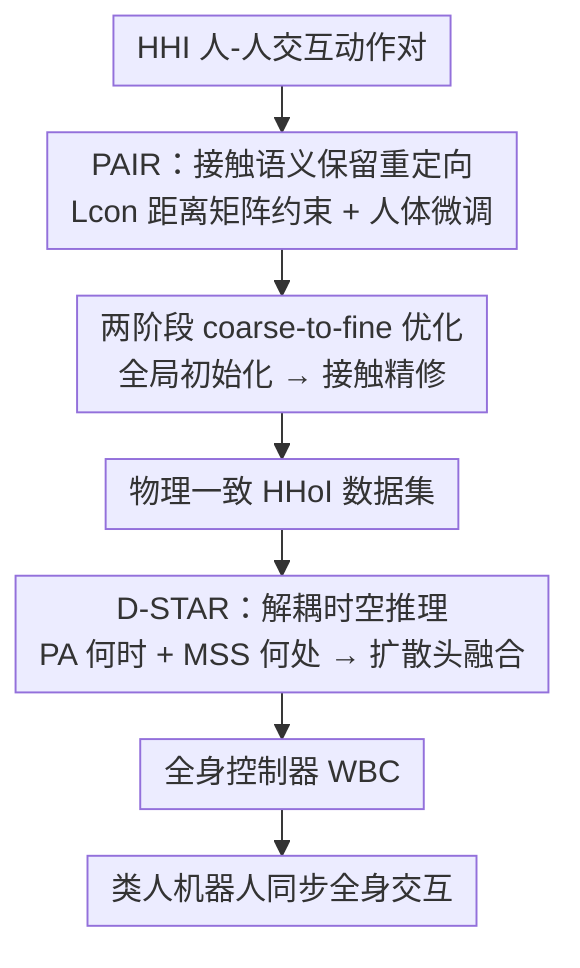

# Beyond Mimicry: Learning Whole-Body Human-Humanoid Interaction from Human-Human Demonstrations

**会议**: CVPR 2026  
**论文**: [CVF Open Access](https://openaccess.thecvf.com/content/CVPR2026/html/Huang_Beyond_Mimicry_Learning_Whole-Body_Human-Humanoid_Interaction_from_Human-Human_Demonstrations_CVPR_2026_paper.html)  
**代码**: 无（未公开）  
**领域**: 机器人 / 具身智能  
**关键词**: 类人机器人, 人-机器人交互, 动作重定向, 扩散策略, 全身控制  

## 一句话总结
为了让类人机器人学会拥抱、握手、击掌这类全身物理交互，本文先用接触语义保留的重定向（PAIR）把海量"人-人交互"数据翻译成物理一致的"人-机器人交互"数据，再用一个把"何时动"与"何处动"解耦的分层扩散策略（D-STAR）学会同步交互，在 6 类交互任务上平均成功率达 75.4%，并在 Unitree G1 实机部署。

## 研究背景与动机
**领域现状**：让类人机器人融入人类空间、做出握手/拥抱这类人-机器人交互（HHoI）是机器人领域的关键前沿。但训练这类策略需要大量交互数据，真实遥操作数据高保真却昂贵、缓慢、不安全且多样性差。一个更可扩展的思路是借用海量已有的"人-人交互"（HHI）数据，通过动作重定向把人的动作映射到机器人身上。

**现有痛点**：作者发现两个连环失败。**第一**，标准重定向直接搬关节角度/位置，只追求运动学相似，却**忽略人与机器人之间的形态差异**——一个 1.7m 的人和 1.3m 的机器人握手，照搬人类轨迹会让机器人的手停在离对方手几寸远的空中，关键的物理接触被打破，交互失去意义。**第二**，即便有了高质量数据，常规模仿学习也只会"复刻平均轨迹"，学到的是一个没有关系几何理解、没有时机感的"平均动作"，无法对人做出响应式的同步交互。

**核心矛盾**：交互的本质是**接触语义**（手碰手、合适的社交距离），而运动学相似与接触保留在形态不匹配时是冲突的；同时，交互策略需要同时推理"什么时候该动"（时序意图）和"动到哪里"（空间接触点），把这两件事混在一起学会相互干扰。

**本文目标**：(1) 把 HHI 数据无损地转成物理一致的 HHoI 训练数据；(2) 学出一个能理解时机与几何、做出同步全身交互的策略。

**核心 idea**：在**数据层**用以接触为中心的重定向（PAIR）显式保住接触语义，在**策略层**把"何时动（when）"与"何处动（where）"解耦再融合（D-STAR），两端都"超越简单模仿"。

## 方法详解

### 整体框架
整条管线是一个"数据→策略"的闭环：左半段 PAIR 负责造数据，把一对人-人交互动作 $(M_{Hp}, M_{Hs})$ 通过接触感知的两阶段优化，重定向成物理一致的人-机器人交互片段；右半段 D-STAR 在这批数据上训练一个分层扩散策略，把交互推理拆成"何时动"的相位注意力（PA）和"何处动"的多尺度空间模块（MSS），由扩散头融合成高层动作目标，最后交给标准全身控制器（WBC）在仿真/实机上执行。

### 关键设计

**1. PAIR：以接触为中心的重定向，把"保接触"写进损失函数**

针对"照搬关节角度会打断物理接触"这个痛点，PAIR 不再只惩罚机器人与（形态对齐后的）人体骨架之间的逐关节误差，而是把整段重定向写成一个分层的优化目标：

$$L_{retarget} = w_{con}L_{con} + w_{kin}L_{kin} + w_{hum}L_{hum} + w_{reg}L_{reg}.$$

其中真正的创新是**接触保留损失** $L_{con}$：它不去逐点对齐某根手指，而是约束**整段交互的成对距离矩阵**保持一致。设 $D^{orig}_t$ 与 $D^{opt}_t$ 分别是原始人-人交互、优化后人-机器人交互在 $t$ 时刻、由一组任务关键点算出的 $N\times N$ 距离矩阵，则

$$L_{con} = \frac{1}{T}\sum_{t=1}^{T}\big\lVert D^{opt}_t - D^{orig}_t \big\rVert_F^2.$$

这种矩阵级约束把"手-手接触""合适的社交距离"这类**关系几何**整体保住，比脆弱的逐点惩罚稳健得多。$L_{kin}$ 仍负责让机器人动作风格像人（但它正是打断接触的根源，故要被 $L_{con}$ 矫正）；$L_{hum}=\frac{1}{T}\sum_t\lVert p'_{Hp,t}-p_{Hp,t}\rVert_2^2$ 是**人体保真损失**，只允许人类伙伴的肩/肘/腕做小幅、必要的适配（如为矮机器人抬高手臂），避免为强行制造接触而把人的动作扭曲成另一个动作；$L_{reg}$ 是时序平滑 + 关节角正则，保证动作不抖不别扭。

**2. 两阶段 coarse-to-fine 优化：绕开"差一点就碰到"的局部最优**

$L_{con}$ 让目标函数变得复杂、非凸，单阶段直接优化常收敛到"差几寸就碰到"的物理失败近似最优（握手变成抓空气）。作者因此用**两阶段**而非单纯调超参来引导求解器穿过这个能量地形。**阶段一（全局运动学初始化）**：用一个中等的接触权重 $w_{con}$ 在整段序列上优化完整目标，先得到一个全局一致、运动学合理的动作，把求解器放进一个理想的"吸引盆"。**阶段二（接触与稳定精修）**：以阶段一结果为热启动，把 $w_{con}$ 显著调大重跑，激进地纠正细微的接触错位、强制物理稳定，把"差一点"打磨成"严丝合缝"。消融显示，把两阶段塌缩成单阶段会让接触 F1 从 0.841 掉到 0.788，正是收敛到了"运动学合理但物理错误"的近似最优。

**3. D-STAR：把"何时动"与"何处动"解耦再融合的分层扩散策略**

针对"模仿学习把时机与目标混在一起、退化成平均轨迹"的痛点，D-STAR 把策略推理拆成两条互补的流，再由单一扩散头融合，既隔离能力、避免互相干扰，又保证动作连贯。输入是 $h$ 帧观测历史（机器人本体感知 $s^R_t$ + 人类 SMPL 关节 $s^H_t$，正文用 12 帧历史预测覆盖 2 秒的 5 锚点 horizon），先经一个**长短时编码器（LSTE）**：长时编码器 $E_{long}$ 看全 $h$ 帧抓交互阶段的上下文，短时编码器 $E_{short}$ 看最近 $h'$ 帧抓精细空间配合，拼成 $f^{temp}_t=\text{Concat}(E_{long}(\cdot), E_{short}(\cdot))$。

在此之上，**相位注意力 PA（何时）**预测当前交互处于哪个相位——采用"准备 / 动作 / 收尾"三相位划分并配一个过渡一致性损失抑制边界噪声——再用相位去加权专门化的自注意力块，得到相位条件时序特征 $f^{Phase}_t$，相当于给下游决策一个"时序门控"。**多尺度空间模块 MSS（何处）**用绝对位置、成对距离、相对朝向三类编码器刻画人-机器人的多尺度几何关系，聚合近/中/远线索得到空间特征 $f^{MSS}_t$，回答"接触几何在哪"。两路特征连同一段选择交互类型的**文本指令 token**一起条件化**扩散规划头**，生成高层参考动作，再交给低频运行的 WBC 转成可执行关节目标（策略比控制器更新率低以保稳定）。解耦的好处在消融里很直接：去掉 PA 或 MSS 都会在需要精确时序/空间协调的任务上掉点。

### 损失函数 / 训练策略
PAIR 用上面的 $L_{retarget}$ 组合目标做两阶段优化（数据生成阶段，非神经网络训练）。D-STAR 联合训练长短时编码器、PA、MSS 与扩散规划头，目标是扩散动作预测损失 + 相位分类辅助损失 + 几何一致性项的组合（完整公式与权重在附录）。部署时用一段短文本指令选交互类型，无需任务特定权重或调参。

## 实验关键数据

实验围绕四个问题：Q1 重定向是否有效？Q2 分层策略是否超越标准基线？Q3 解耦模块是否必要？Q4 是否对未见的人体形态/行为变化鲁棒？仿真在 Isaac Gym + Unitree G1（50 Hz）上做定量对比，实机做可执行性验证。

### 主实验

重定向质量（接触保留 F1 @0.35m 阈值、运动学误差 JPE、平滑度 Jerk）：

| 方法 | JPE↓ | 接触F1@0.35m↑ | Jerk Mean↓ |
|------|------|---------------|------------|
| Simple MSE | 0.188 | 0.688 | 0.0026 |
| IK Baseline | 0.337 | 0.649 | 0.0348 |
| ImitationNet†（SOTA） | 0.181 | 0.502 | 0.0015 |
| **PAIR（本文）** | **0.174** | **0.841** | **0.0008** |

PAIR 在 0.35m 阈值的接触 F1 达 0.841，相对 ImitationNet 提升 **67.5%**、相对最强非交互基线 Simple MSE 提升 22.2%；同时拿到最好的运动学相似度（JPE 0.174）和最平滑动作（相比 Simple MSE 抖动降低 69%），说明保接触并未牺牲其他质量。

策略成功率（6 类交互任务，Success Rate %）：

| 方法 | Hug | High-Five | Handshake | Avg. |
|------|-----|-----------|-----------|------|
| Naive Mimicry (BC only) | 0.0 | 0.0 | 0.0 | 0.0 |
| Pure RL | 46.7 | 7.4 | 19.4 | 51.6 |
| Transformer Policy | 73.3 | 44.4 | 32.3 | 64.3 |
| Diffusion Policy | 73.3 | 3.7 | 38.7 | 58.7 |
| **D-STAR（完整）** | **100.0** | 40.7 | **61.3** | **75.4** |

完整 D-STAR 平均成功率 75.4%，显著领先；尤其在接触密集的 Hug（100%）、Handshake（61.3%）上拉开差距。值得注意 Naive Mimicry 全 0——简单复刻轨迹完全无法完成交互；用同样数据和控制器的 Diffusion Policy 也只有 58.7%，凸显"解耦推理"而非"换个强策略骨架"才是关键。

### 消融实验

| 配置 | 重定向F1@0.35m | 策略Avg.成功率 | 说明 |
|------|----------------|----------------|------|
| 完整模型 | 0.841 | 75.4 | — |
| w/o Human Adaptation | 0.823 | — | 去掉人体微调，接触精度下降 |
| w/o Contact Loss $L_{con}$ | 0.821 | — | 去掉接触损失，接触精度下降 |
| w/o Two-Stage | 0.788 | — | 塌缩成单阶段，掉点最多→近似最优陷阱 |
| w/o PA | — | 65.9 | 去掉相位注意力 |
| w/o MSS | — | 64.3 | 去掉多尺度空间，Handshake 从 61.3→32.3 |
| w/o PA + MSS | — | 68.3 | 两者皆去 |

### 关键发现
- **两阶段优化贡献最大**（重定向侧）：单阶段化让接触 F1 掉到 0.788，远多于去掉 $L_{con}$/HA 的 0.821/0.823，证明复杂接触目标必须靠 coarse-to-fine 才能避开"差一点"局部最优。
- **MSS 对空间精确任务最关键**：去掉 MSS 后握手成功率从 61.3% 暴跌到 32.3%，说明"动到哪里"的几何编码是接触型任务的命脉；PA 则更影响整体时序协调（去掉后 Avg. 65.9%）。
- **鲁棒性矩阵**：在人类伙伴尺度 ×0.8~×1.2、速度 ×0.8~×1.2 的组合扰动下，成功率从中心 75.4% 向边缘平滑退化（最低约 62.7%），呈现"优雅降级"而非崩溃，说明策略学到的是关系几何而非记忆轨迹。

## 亮点与洞察
- **把"接触"从逐点约束升级为距离矩阵约束**：$L_{con}$ 用 $N\times N$ 成对距离矩阵保住整段交互的关系几何，这个思路巧妙在它天然对形态差异不敏感（约束的是相对距离而非绝对位置），可迁移到任何需要保持多体相对几何的重定向/生成任务。
- **"何时 vs 何处"解耦**是最让人"啊哈"的设计：交互失败往往不是不会动，而是时机或落点错了；把这两条推理流隔离、用单扩散头融合，既避免互相干扰又保持动作连贯，这种"分而治之 + 统一规划头"的范式可迁移到其他需要时空协同的具身任务。
- **数据-策略闭环**：作者刻意先暴露"标准重定向打断接触"，再暴露"有了好数据模仿学习仍退化"，两个失败串成一条因果链，方法的每个组件都对应一个被诊断出的具体失败模式，论证逻辑很扎实。

## 局限性 / 可改进方向
- **定量对比只在仿真**：作者明确为了控制器公平性把定量比较留在仿真，实机仅做可执行性验证（Hug/Handshake/High-Five），缺乏实机上的成功率统计，sim-to-real gap 的量化不足。⚠️
- **交互类型有限**：只覆盖 6 类预定义交互（拥抱/握手/击掌/挥手/弯腰/飞吻），且靠文本指令选类型，对开放式、连续切换或多人交互的泛化未验证。
- **High-Five 成功率偏低**（40.7%）：即便完整模型，快速精准的击掌仍较难，说明高速接触瞬间的时空对齐仍是瓶颈，可能需要更高频感知或更细的相位划分。
- **依赖 HHI 数据质量与 SMPL 估计**：重定向上限受源人-人交互数据与人体姿态估计精度限制，噪声会沿管线传播。

## 相关工作与启发
- **vs XBG / RHINO（端到端遥操作学 HHoI）**：他们直接从遥操作示范学，高保真但昂贵且 RHINO 仍以上半身为主；本文改从海量 HHI 数据经重定向获得全身监督，可扩展性更强。
- **vs ImitationNet（SOTA 无监督重定向）**：它优化运动学/风格相似度，在形态不匹配时接触 F1 仅 0.502；PAIR 通过显式 $L_{con}$ + 两阶段优化把 F1 提到 0.841，专门补上"接触语义"这一块。
- **vs Diffusion Policy（同数据同控制器的强基线）**：同样的扩散骨架与数据，DP 平均仅 58.7%；差距说明 D-STAR 的增益来自"解耦时空推理"，而非扩散建模本身。

## 评分
- 新颖性: ⭐⭐⭐⭐⭐ 数据层接触矩阵重定向 + 策略层 when/where 解耦，两端都给出针对性创新，闭环设计完整。
- 实验充分度: ⭐⭐⭐⭐ 重定向 18 指标 + 6 任务策略 + 鲁棒矩阵 + 实机部署，较全面；但定量仅限仿真、实机无成功率统计。
- 写作质量: ⭐⭐⭐⭐⭐ "失败诊断→针对性修复"的叙事把每个组件的动机讲得很清楚，逻辑链扎实。
- 价值: ⭐⭐⭐⭐ 为"从人-人数据学全身人-机交互"提供了可复用的数据生成 + 策略范式，对具身交互社区有实际意义。

<!-- RELATED:START -->

## 相关论文

- [\[CVPR 2026\] Towards Motion Turing Test: Evaluating Human-Likeness in Humanoid Robots](towards_motion_turing_test_evaluating_human-likeness_in_humanoid_robots.md)
- [\[CVPR 2026\] RoboWheel: A Data Engine from Real-World Human Demonstrations for Cross-Embodiment Robotic Learning](robowheel_a_data_engine_from_real-world_human_demonstrations_for_cross-embodimen.md)
- [\[CVPR 2026\] End-to-End Language-Action Model for Humanoid Whole Body Control](end-to-end_language-action_model_for_humanoid_whole_body_control.md)
- [\[AAAI 2026\] Theory of Mind for Explainable Human-Robot Interaction](../../AAAI2026/robotics/theory_of_mind_for_explainable_human-robot_interaction.md)
- [\[CVPR 2026\] Scalable Trajectory Generation for Whole-Body Mobile Manipulation](scalable_trajectory_generation_for_whole-body_mobile_manipulation.md)

<!-- RELATED:END -->
