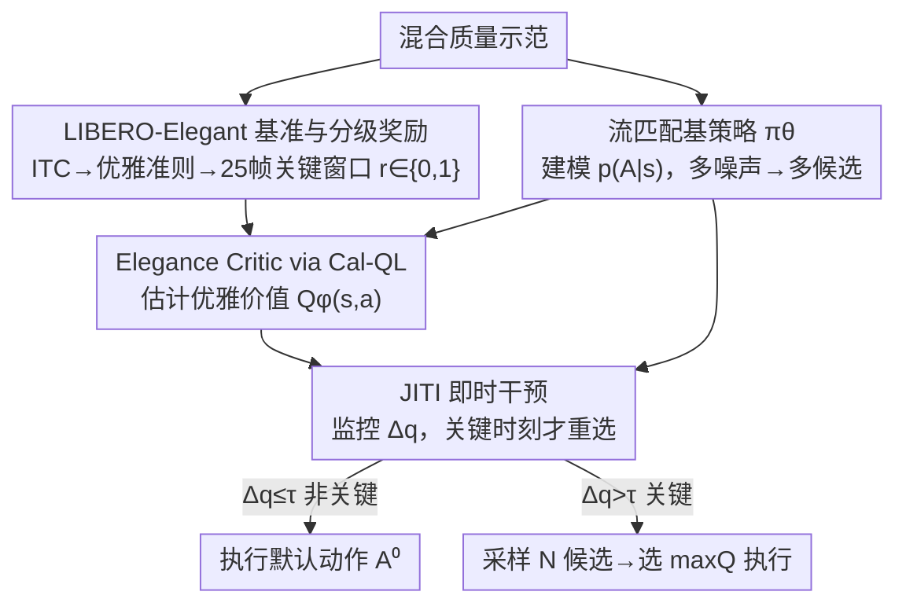

# Beyond Success: Refining Elegant Robot Manipulation from Mixed-Quality Data via Just-in-Time Intervention

**会议**: CVPR 2026  
**论文**: [CVF Open Access](https://openaccess.thecvf.com/content/CVPR2026/html/Mao_Beyond_Success_Refining_Elegant_Robot_Manipulation_from_Mixed-Quality_Data_via_CVPR_2026_paper.html)  
**代码**: 论文称在 GitHub 开源代码与基准，未给明确链接（⚠️ 以原文为准）  
**领域**: 机器人 / 具身智能  
**关键词**: VLA、机器人操作、离线强化学习、混合质量数据、推理时引导  

## 一句话总结
针对 VLA 策略从混合质量人类示范里学到"会成功但动作不优雅"的问题，本文不重训基策略，而是离线训一个 Elegance Critic（用 Cal-QL 估计动作的"优雅价值"），并在推理时通过监控 Q 值波动只在少数"决策关键时刻"触发多候选重选，在 LIBERO-Elegant 与真机上把 Elegant Success Rate 从约 50% 提到 67%（真机 +23.7 pts）。

## 研究背景与动机
**领域现状**：Vision-Language-Action（VLA）大模型靠互联网规模示范做模仿学习，已能听懂语言指令并泛化到新场景，是当前通用机器人操作的主流范式。

**现有痛点**：这些模型的执行质量参差不齐——同一个"放置"任务，策略时而能平稳对齐地放下物体，时而过早松手让物体掉落或弹跳。能力是存在的，但不能可靠地表达出来。

**核心矛盾**：根因在于训练数据本身是**混合质量（mixed-quality）**的。真实人类示范是专家级操作、犹豫的纠正、低效动作甚至失败的噪声混合体。标准行为克隆（BC）会原封不动地继承这整个行为分布 $p(A_t\mid s_t)$，于是把"漂亮的"和"将就的"动作一起学了进去。问题在于：示范虽然都标成"成功"，但它们对"动作该怎么做"的隐含规则只是**部分满足**。

**本文目标**：(1) 把"动作做得好不好"这件超出二元成功的事变得可度量；(2) 在不重训、不污染基策略的前提下，把执行质量拉上来。

**切入角度**：作者借鉴人类打磨动作技能的方式——人不会沿整条轨迹均匀地纠正自己，而是只在少数"牵一发动全身"的关键时刻做微调。这启发出"边执行边评估（evaluate while executing）"的分工：预训练 VLA 负责宽口径的任务执行，一个轻量 Critic 只负责评估质量，并只在关键时刻介入。

**核心 idea**：把"优雅执行"形式化为满足隐含任务约束（Implicit Task Constraints, ITC），训一个 Elegance Critic 给候选动作打"优雅分"，再用即时干预（JITI）只在 Q 值剧烈波动的关键时刻触发多候选重选——用一个解耦的、非侵入式的 critic 替代对基策略的重训。

## 方法详解

### 整体框架
方法是一个**三阶段解耦框架**，核心主张是"执行与评估分离、只在关键时刻评估"。Stage 1 在混合质量数据上训一个生成式基策略 $\pi_\theta$（流匹配模型），它能对同一状态采样出一批**多样**的候选动作；Stage 2 用 LIBERO-Elegant 的分级奖励标注、通过 Calibrated Q-Learning 训一个 Elegance Critic $Q_\phi$，专门估计动作的"优雅价值"；Stage 3 的 Just-in-Time Intervention（JITI）把两者在推理时串起来——平时直接执行基策略默认动作，只有当 critic 的 Q 值出现剧烈波动（判定为关键时刻）时，才采样 $N$ 个候选、用 critic 选优雅分最高的那个执行。整个过程不改、不重训 $\pi_\theta$。

### 关键设计

**1. Elegant Execution 形式化 + LIBERO-Elegant 基准与分级奖励：让"动作做得好不好"可度量**

痛点是：LIBERO 里每条示范都标"成功"，但它们对隐含规则的满足程度差很多，没有信号能把"优雅"和"将就"区分开。作者先把**优雅执行**定义为：在完成任务的同时满足隐含任务约束（ITC）——包括恰当的松手时机、精确放置、姿态对齐、避免意外碰撞。然后在 LIBERO 上构建 LIBERO-Elegant：精选 8 个对执行质量敏感的操作任务（精确放置、受控插入、无碰撞推动等），每个任务同时用两套准则评判——沿用 LIBERO 原目标条件的 **Success Criteria**，以及沿四个维度评质量的 **Elegance Criteria**（任务序列完整性、目标位姿精度、姿态对齐、无碰撞执行）。

监督信号上，作者在 ITC 最相关的**短时间片**上标注二元奖励 $r_t\in\{0,1\}$：过早松手或错位放置记 0，受控的、满足约束的过渡记 1，由此把每条示范扩成 Elegance-Enriched Dataset $\mathcal{D}_{\text{elegant}}$。规模上：8 个任务、327 段示范、约 52.7K 帧同步 RGB-D 与本体感受数据；其中 148 段为高质量执行获得正奖励，每段只在一个 **25 帧窗口**（ITC 最关键的那一刻）上标注。这种"稀疏 + 分级"的奖励正是后面 Critic 能学出细粒度偏好、Q 值能在关键点产生波动的来源。

**2. 流匹配基策略 + 多候选采样：把"质量参差"变成可被挑选的多样性**

痛点是：要做推理时重选，得先能对同一状态拿出一批**不同**的候选动作。Stage 1 故意不区分好坏示范，而是把 $\pi_\theta$ 训成建模整个混合质量分布 $p(A_t\mid s_t)$ 的生成模型，用流匹配（flow-matching）实现：一个 Transformer 网络 $v_\theta$ 学一个连续时间向量场，把噪声样本变成干净动作。训练时从数据采真值 $A_t$、采高斯噪声 $\epsilon$，构造带噪动作 $A_t^\tau=\tau A_t+(1-\tau)\epsilon$，优化预测向量场与目标方向的均方误差：

$$\mathcal{L}_{\text{FM}}(\theta)=\mathbb{E}_{\tau,(s_t,A_t),\epsilon}\big[\|v_\theta(A_t^\tau,s_t)-(A_t-\epsilon)\|_2^2\big]$$

推理时从初始噪声 $A_t^0\sim\mathcal{N}(0,I)$ 出发，用前向 Euler 等数值解法把 $v_\theta$ 沿 $\tau\in[0,1]$ 积分得到动作。关键在于：**用多组不同噪声初始化，就能为同一状态生成一组多样候选**——这正是 JITI 在关键时刻"采样多个再挑最优雅"的前提。把"质量参差"重新理解成"候选池里既有好的也有差的"，是这个设计的巧处。

**3. Elegance Critic via Cal-QL：从混合质量数据里学到不被高估的"优雅价值"**

痛点是双重的：critic 既要对编码 ITC 的**分级细粒度奖励**敏感（学得出优雅与否），又不能对落在数据支撑外的低质量/未见动作**高估**价值（离线 RL 的 OOD 通病）。架构上，critic 复用 Stage 1 冻结的 VLM backbone 提取 $s_t,s_{t+1}$ 的多模态表示，再接一个 **VLM-based refinement head** 把表示重定向到价值估计，得到上下文嵌入 $f_s,f_{s'}$，与动作 $a_t$、奖励 $r_t$ 拼接后送入 Cal-QL 模块更新 $\phi$——这样既借了预训练知识，又不动编码器、保持解耦。

学习目标上采用 Calibrated Q-Learning：校准正则项

$$R_{\text{cal}}(\phi)=\mathbb{E}_{s\sim\mathcal{D}}\Big[\max\big(\mathbb{E}_{a\sim\pi(\cdot\mid s)}Q_\phi(s,a),\,V_\mu(s)\big)-\mathbb{E}_{a\sim\mathcal{D}(\cdot\mid s)}Q_\phi(s,a)\Big]$$

它的作用是：当 critic 对分布内动作的估值已经低于行为价值 $V_\mu(s)$ 时，就不再继续往下压，从而把 critic 的"信心"校准到行为分布上，给出保守但准确的估值。完整目标是 Bellman 一致性加校准正则：

$$\mathcal{L}_{\text{Cal-QL}}(\phi)=\mathcal{L}_{\text{Bellman}}(\phi)+\lambda_{\text{cal}}R_{\text{cal}}(\phi)$$

其中 $\mathcal{L}_{\text{Bellman}}(\phi)=\mathbb{E}\big[(Q_\phi(s_t,a_t)-(r_t+\gamma\max_{a'}Q_{\phi'}(s_{t+1},a')))^2\big]$，$Q_{\phi'}$ 是缓慢更新的目标网络。这一保守 + 校准的组合，既让 critic 在数据支撑内保留对优雅的敏感，又对未见行为保守——为 Stage 3 的价值引导提供可靠信号。

**4. JITI 即时干预：用 Q 值波动只在关键时刻花高成本重选**

痛点是：最朴素的"全程引导（Full-Guidance）"每一步都采样多候选、全部评估、选最优雅——有效但昂贵且没必要，因为大多数决策局部是无歧义的，真正左右整条轨迹优雅度的只有少数关键时刻。JITI 的关键洞察正是：轨迹的整体优雅主要由这一小撮关键时刻决定，于是设计成**事件驱动、即插即用**的机制，只在策略表现出不确定性时才启动高成本的多候选评估。

如何识别关键时刻？用 critic 自己的 Q 值波动。当基策略在熟悉区域提出与"优雅"一致的动作时，Q 值预测稳定且高置信；一旦遇到 OOD 状态或给出次优动作（不稳的抓取、低效轨迹），置信度下降，表现为 Q 值的**剧烈波动**——无论是骤降（价值流失）还是骤升（进入高风险关键段）。作者把它量化为 $\Delta q_t=|q_t-\bar q_t|$，其中 $q_t=Q_\phi(s_t,A_t^0)$ 是对默认动作的评估，$\bar q_t$ 是短历史窗口上的移动平均。$\Delta q_t$ 小表示时间一致、置信高；骤变则标记决策关键时刻。值得注意的是这种波动是 critic 双重训练动态的自然产物：尖峰来自稀疏分级奖励触发的 Bellman 回传（划定高奖励关键段），骤降来自 Cal-QL 保守正则对 OOD/不优雅动作的惩罚。

推理算法（Algorithm 1）：每步先采默认动作 $A_t^0\sim\pi_\theta$、算 $q_t$、更新窗口与 $\Delta q_t$；若 $\Delta q_t\le\tau$ 视为非关键，直接执行 $A_t^0$（只需一次 critic 评估）；若 $\Delta q_t>\tau$ 视为关键，则采样 $N$ 个候选、逐一用 $Q_\phi$ 打分、执行 $\arg\max_a Q_\phi(s_t,a)$。如此在日常决策保持单候选的高效，只在不确定性抬头时按需重选，不重训 $\pi_\theta$ 就过滤掉次优行为。

## 实验关键数据

### 主实验
指标为 **Elegant Success Rate（ESR）**：一个 episode 必须既完成任务目标、又满足全部预设优雅约束才算"优雅成功"，每任务 50 次 rollout 取平均。在 LIBERO-Elegant 8 个任务（T-0~T-7）上对比：

| 方法 | Avg. ESR (%) |
|------|------|
| π0.5 | 44.2 |
| Isaac GR00T N1 | 40.2 |
| SmolVLA (Base, 450M) | 49.8 |
| Isaac GR00T N1.5 (Base, 3B) | 46.0 |
| **Ours (JITI) + SmolVLA** | **67.2** |
| **Ours (JITI) + GR00T N1.5** | **67.2** |

JITI 给 SmolVLA 带来 +17.4 pts、给 GR00T N1.5 带来 +21.2 pts，且两个不同容量的 VLA 都被拉到 67.2%，验证了 critic 的**模型无关、即插即用**特性。

### 消融实验

**(a) JITI vs 全程引导（图 4，8 任务平均）**：

| 配置 | Avg. ESR (%) | 每 episode 平均干预次数 |
|------|------|------|
| SmolVLA (Base) | 49.8 | — |
| Full-Guidance（每步都重选） | 53.8 | 16.25 |
| **Ours (JITI)** | **67.2** | **6.26** |

JITI 不仅 ESR 高于全程引导（67.2% vs 53.8%），干预次数还少 60%+——事件驱动的定向重选比无脑全程重选**又好又省**。

**(b) 奖励形式消融（表 2，8 任务平均）**：

| 奖励类型 | Avg. ESR (%) |
|------|------|
| Binary Reward（仅 episode 末稀疏成功标签） | 56.8 |
| **Task-Specific（本文分级优雅奖励）** | **67.2** |

稀疏二元反馈不足以学出定义优雅的细粒度偏好（差 10.4 pts），说明有效的优雅细化既需要 JITI 这种不确定性感知的干预，也需要足够信息量的 critic 训练信号。

### 泛化与真机

**泛化（表 3，LIBERO-Object，critic 在见过物体上训、直接用于未见但语义相似物体，零样本）**：

| 设置 | SmolVLA (Base) | Ours (JITI) |
|------|------|------|
| Seen 任务 Avg. ESR | 54.6% | 72.0% |
| Unseen 任务 Avg. ESR | 53.0% | 68.6% |

未见任务仍 +15.6 pts，说明 critic 学到的是**可迁移的行为先验**而非记住特定任务的运动模式。

**真机（SO-100 机械臂，SmolVLA，6 个家务任务各 50 rollout）**：平均 ESR 从 34.3% 提到 **58.0%（+23.7 pts）**，提升最大的是堆叠、放置等对精度要求高的任务。

### 关键发现
- 贡献最大的是 JITI 的"按需干预"与"分级奖励"两件事叠加：去掉分级奖励掉到 56.8%，把按需变全程掉到 53.8%，二者缺一都明显回落。
- JITI 的效率优势很硬：用约 1/3 的干预次数反而拿到更高 ESR，说明大多数时刻确实无需重选，价值波动是个低成本而有效的触发指标。
- 真机增益（+23.7）大于仿真（+17.4），且集中在精度敏感任务上，说明该机制对真实环境的延迟、不确定性与随机性有较好鲁棒性。

## 亮点与洞察
- **把"质量参差"从缺点变成资源**：混合质量数据通常被当噪声去过滤，本文反过来用流匹配把整个分布学下来当"候选池"，再靠 critic 在推理时挑选——既不丢数据也不重训，思路很轻。
- **Q 值波动作为"关键时刻"探测器**：复用 critic 训练动态的副产物（Cal-QL 保守正则的骤降 + 稀疏奖励 Bellman 回传的尖峰）当干预信号，几乎零额外成本，且可解释。
- **解耦 + 非侵入**：基策略完全冻结，critic 是挂在外面的模块，天然 plug-and-play，对 SmolVLA(450M) 与 GR00T(3B) 都奏效——这种"评估器外挂"范式可迁移到其他需要质量约束但不想重训大模型的控制任务。

## 局限与展望
- **依赖人工标注的关键窗口**：Elegance-Enriched Dataset 靠人标 25 帧窗口和二元奖励、多人交叉验证，扩到新任务族需要重新标注，"优雅准则"的四维定义也带主观性。
- **阈值 $\tau$、窗口 $k$、候选数 $N$ 的敏感性**：JITI 的触发完全由 $\Delta q_t>\tau$ 决定，论文未充分展示这些超参的鲁棒区间（⚠️ 以原文为准），$\tau$ 过松会退化成全程引导、过紧会漏掉关键时刻。
- **"优雅"仍受限于 ITC 的人定维度**：四个维度覆盖了时机/位姿/碰撞，但更复杂的"优雅"（力控柔顺、能耗、与人协作安全）尚未纳入，泛化实验也只测了语义相似的 pick-and-place。
- 真机仅在 SO-100 单臂、6 任务上验证，多臂/长程任务的表现仍待观察。

## 相关工作与启发
- **vs 数据中心方法（过滤/重加权/重采样混合质量数据）**：它们改造静态数据集后再做 BC，本文不动数据分布而是学一个能推理长期后果的价值函数，并把判断推迟到推理时——避免了"重塑数据集"的短视。
- **vs 在线 RL 微调 VLA**：在线 RL 需要昂贵且不安全的真机交互、微调易不稳定且有灾难性遗忘；本文走离线、且完全不微调基策略。
- **vs 侵入式离线 RL（直接 fine-tune VLA）**：那类方法有灾难性遗忘风险；本文属于解耦的推理时引导阵营（保留基模型 + 轻量 critic 指导输出），但目标更细——不是泛泛提质量，而是对准 ITC 定义的"优雅"。
- **vs 全程价值引导（Full-Guidance）**：同样用 critic 选动作，但本文用 Q 值波动把高成本评估限定在关键时刻，效率与质量都更优。

## 评分
- 新颖性: ⭐⭐⭐⭐ 把"超越成功的执行质量"形式化为 ITC，并用"Q 值波动触发即时干预"这一巧妙机制实现非侵入细化，角度新但部件多为已有技术组合（流匹配 + Cal-QL）。
- 实验充分度: ⭐⭐⭐⭐ 仿真主实验 + JITI/奖励双消融 + 零样本泛化 + 真机 6 任务，覆盖两种 VLA 架构；但缺 $\tau/N$ 等关键超参的系统敏感性分析。
- 写作质量: ⭐⭐⭐⭐ 动机—方法—实验逻辑清晰，三阶段框架与图配合好；部分公式（如 $V_\mu$ 的具体来源）交代偏简。
- 价值: ⭐⭐⭐⭐ 提供了一个不重训大 VLA 就能提升执行质量的即插即用范式，并配套了可复用的 LIBERO-Elegant 基准，对落地友好。

<!-- RELATED:START -->

## 相关论文

- [\[CVPR 2026\] SPEAR-1: Scaling Beyond Robot Demonstrations via 3D Understanding](spear-1_scaling_beyond_robot_demonstrations_via_3d_understanding.md)
- [\[CVPR 2026\] Affordance Field Intervention: Enabling VLAs to Escape Memory Traps in Robotic Manipulation](affordance_field_intervention_enabling_vlas_to_escape_memory_traps_in_robotic_ma.md)
- [\[CVPR 2026\] IGen: Scalable Data Generation for Robot Learning from Open-World Images](igen_scalable_data_generation_for_robot_learning_from_open-world_images.md)
- [\[CVPR 2026\] DynBridge: Bridging Imagination and Control through Interaction Dynamics for Robot Manipulation](dynbridge_bridging_imagination_and_control_through_interaction_dynamics_for_robo.md)
- [\[ICLR 2026\] Real-Time Robot Execution with Masked Action Chunking](../../ICLR2026/robotics/real-time_robot_execution_with_masked_action_chunking.md)

<!-- RELATED:END -->
