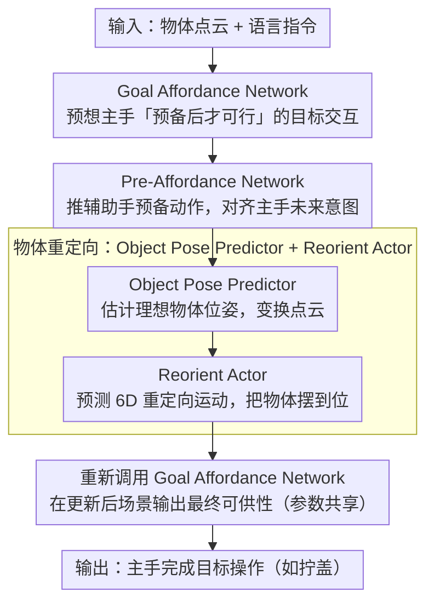

# BiPreManip: Learning Affordance-Based Bimanual Preparatory Manipulation through Anticipatory Collaboration

**会议**: CVPR 2026  
**arXiv**: [2603.21679](https://arxiv.org/abs/2603.21679)  
**代码**: [项目页面](https://sites.google.com/view/bipremanip)  
**领域**: 机器人操作 / 人体理解  
**关键词**: 双臂协作操作, 视觉可供性, 预备操作, 预期推理, 点云

## 一句话总结
提出 BiPreManip 框架，基于视觉可供性表示实现双臂预备操作：先预想主手的目标交互区域，再引导辅助手进行预备动作（如翻转瓶子使瓶盖朝向主手），在仿真和真实环境中大幅优于基线。

## 研究背景与动机
**领域现状**: 双臂操作研究近年取得长足进展（ACT、RDT-1B、3D FlowMatch Actor 等），覆盖了对称、顺序独立、互补角色等多种协作模式。

**现有痛点**: 现有方法假设两只手都能直接与物体交互，但很多日常场景需要一只手先"改变物体状态"才能让另一只手操作——例如把平板电脑推到桌边才能抓起、把笔立起来才能拔笔帽。

**核心矛盾**: 预备操作需要不对称的预期协调和长时程相互依赖规划——辅助手必须理解主手的未来意图，同时避免干扰主手的预期交互区域。

**本文要解决**: 定义并解决"协作预备操作"新问题类别，让机器人学会先预备再操作的双臂协调行为。

**切入角度**: 可供性（affordance）驱动——先用可供性图预想最终目标动作，再逆向推导辅助手的预备行为。

**核心idea**: 通过预期可供性图（anticipatory affordance map）实现跨臂推理，让辅助手的每个动作都服务于主手的最终目标。

## 方法详解

### 整体框架
BiPreManip 针对的是「一只手要先改变物体状态，另一只手才能操作」的协作预备操作——比如先把瓶子翻过来让瓶盖朝向主手，主手才能拧。它的关键在于反过来想：先用 Goal Affordance Network 预想主手最终要在哪、怎么交互，再用 Pre-Affordance Network 推出辅助手该做什么预备动作，接着 Anticipatory Object Pose Predictor 估计理想物体位姿、Reorient Actor 执行重定向，最后再调一次 Goal Affordance Network 完成主手的目标操作。输入只需物体点云加语言指令。

### 关键设计

**1. Goal Affordance Network：预想「预备完成后」才可行的目标交互**

如果像反应式策略那样只看当前状态，就会在物体还没摆好时给出不可行的抓取。这个网络先用 PointNet++ 编码点云特征 $f_p$、CLIP 编码语言指令为 $f_l$，MLP 融合后对每个点预测可供性分数 $s$（该点作为接触区域的可能性），再用 cVAE 预测目标夹爪朝向 $d_{\text{goal}} \in SO(3)$，与接触点组合成 6D 目标动作 $a_{\text{goal}} \in SE(3)$。关键是它预测的是「预期」而非「反应」——预想的是预备操作完成之后才可行的交互，用可供性而非直接动作序列来表达「哪里能抓、怎么抓」，泛化性更好。

**2. Pre-Affordance Network：让辅助手的预备动作对齐主手的未来意图**

辅助手不能盲目抓取，它的每个动作都得服务于主手的最终目标。这个网络条件化于上一步的预期目标可供性，融合 $(f_p, f_l, f_{p_{\text{goal}}}, f_{d_{\text{goal}}})$ 预测预备可供性图，再由 cVAE 采样辅助夹爪朝向 $d_{\text{pre}}$ 得到预备动作 $a_{\text{pre}} \in SE(3)$。因为输入里带了主手目标的位置和朝向特征，辅助手的预备行为天然与主手未来的交互空间对齐，不会去占用或干扰那块区域。

**3. Anticipatory Object Pose Predictor + Reorient Actor：把「调整物体朝向」显式建出来**

很多预备任务的本质是把物体转到合适朝向（如旋转瓶子使盖朝向主手），端到端学这一步既不可控也难成功。这里先估计让主手能无碰撞接触目标区域的理想物体位姿 $T^{\text{obj}} = (t^{\text{obj}}, r^{\text{obj}}) \in SE(3)$，按它变换点云 $O' = T^{\text{obj}} \cdot O$，再由 Reorient Actor 接收变换后点云和当前抓取场景预测 6D 重定向运动。把目标位姿单独预测出来，重定向就有了明确的落点，比端到端直接出动作更可控。

### 一个完整示例：把瓶子翻给主手拧盖
以「拧一个瓶盖朝下放着的瓶子」为例走一遍：Goal Affordance Network 先预想主手最终要在瓶盖处、以某个朝向去拧——但当前瓶盖朝下，这个目标暂时不可行；Pre-Affordance Network 据此判断辅助手该去抓瓶身做翻转，而不是去碰瓶盖；Pose Predictor 估计出「瓶盖朝向主手」的理想物体位姿，Reorient Actor 让辅助手把瓶子翻过来；物体到位后再调一次 Goal Affordance Network，主手就能按最初预想的姿态完成拧盖。整条链路里辅助手的每个动作都倒推自主手的最终目标。

### 损失函数 / 训练策略
- 可供性分数: $\ell_1$ loss 监督，正负样本均来自示范
- 夹爪朝向: 测地距离损失 $\mathcal{L}_{\text{ori}} = \arccos\frac{\text{Tr}(d^\top d^*) - 1}{2}$ + KL 正则
- 预期阶段无直接标注，通过执行阶段的位姿变换构造监督：$R_{\text{grp,ant}} = R_{\text{obj,init}} \cdot R_{\text{obj,fin}}^\top \cdot R_{\text{grp,fin}}$
- 位姿预测器和重定向执行器均为 cVAE，组合测地损失 + $\ell_1$ + KL

## 实验关键数据

### 主实验（成功率 %，训练/未见物体）

| 类别 | BiPreManip | ACT | 3DFA | Heuristic | W2A |
|------|-----------|-----|------|-----------|-----|
| Bowl (Edge-Push) | **49/52** | 32/27 | 3/0 | 15/21 | 0/0 |
| Cap | **71/74** | 22/36 | 5/14 | 31/37 | 2/4 |
| Pen-Button (Artic.) | **67/72** | 15/9 | 14/25 | 27/34 | 0/0 |
| Lighter | **43/58** | 34/30 | 41/36 | 21/32 | 2/0 |
| Plate (PerAct2) | **85/82** | 30/26 | 71/68 | 81/78 | 4/4 |

### 消融实验

| 配置 | Bottle | Pen-button | Pen-cap | 说明 |
|------|--------|-----------|---------|------|
| 完整模型 | **30/26** | **67/72** | **26/32** | 最优 |
| w/o Ant-Aff | 27/13 | 48/58 | 23/10 | 去掉预期可供性，性能明显下降 |
| w/o ObjPosePred | 24/15 | 51/50 | 21/8 | 去掉位姿预测，重定向失败 |

### 关键发现
- 在 18 个物体类别上，BiPreManip 在大多数任务上显著优于所有基线
- 对未见物体的泛化能力强，部分类别未见物体成功率甚至高于训练物体
- 预期可供性和物体位姿预测都是关键组件
- 真实世界人-机器人递交实验也验证了方法的实用性

## 亮点与洞察
- 定义了全新的"协作预备操作"问题类别，填补了双臂操作研究的重要空白
- 可供性驱动的预期推理非常优雅——"先想后做"的思路与人类行为高度一致
- 参数共享使预期阶段和执行阶段语义一致，确保"想象"和"执行"的连贯性
- 18 个物体类别、882 个实例的基准测试具有很好的系统性

## 局限与展望
- cVAE 的多模态建模能力有限，更复杂的操作可能需要扩散模型
- 依赖完整点云观测，遮挡严重时可能失效
- 目前只支持两步预备（抓取+重定向），更长序列的预备操作未探索
- 可结合语言模型进行更复杂的任务分解

## 相关工作与启发
- Where2Act 等单臂可供性方法是基础，但不支持协调推理
- ACT 的 Transformer 架构适合一般双臂预测，但缺乏预期推理能力
- 启示：对于需要序列化协调的操作任务，显式建模"意图"比端到端学习更有效

## 评分
- 新颖性: ⭐⭐⭐⭐⭐ 全新问题定义 + 预期可供性驱动的双臂协调框架
- 实验充分度: ⭐⭐⭐⭐ 仿真 + 真实世界、18 个类别、多基线多消融
- 写作质量: ⭐⭐⭐⭐ 逻辑清晰，图示直观
- 价值: ⭐⭐⭐⭐⭐ 推动了双臂操作向更实用场景的发展

<!-- RELATED:START -->

## 相关论文

- [\[CVPR 2026\] AGiLe: Learning Robust Long-Horizon Manipulation via Affordance-Grounded Bidirectional Latent Planning](agile_learning_robust_long-horizon_manipulation_via_affordance-grounded_bidirect.md)
- [\[CVPR 2026\] PALM: Progress-Aware Policy Learning via Affordance Reasoning for Long-Horizon Robotic Manipulation](palm_progress-aware_policy_learning_via_affordance_reasoning_for_long-horizon_ro.md)
- [\[ICML 2025\] BiAssemble: Learning Collaborative Affordance for Bimanual Geometric Assembly](../../ICML2025/robotics/biassemble_learning_collaborative_affordance_for_bimanual_geometric_assembly.md)
- [\[CVPR 2026\] AffordGen: Generating Diverse Demonstrations for Generalizable Object Manipulation with Affordance Correspondence](affordgen_generating_diverse_demonstrations_for_generalizable_object_manipulatio.md)
- [\[CVPR 2026\] DynBridge: Bridging Imagination and Control through Interaction Dynamics for Robot Manipulation](dynbridge_bridging_imagination_and_control_through_interaction_dynamics_for_robo.md)

<!-- RELATED:END -->
