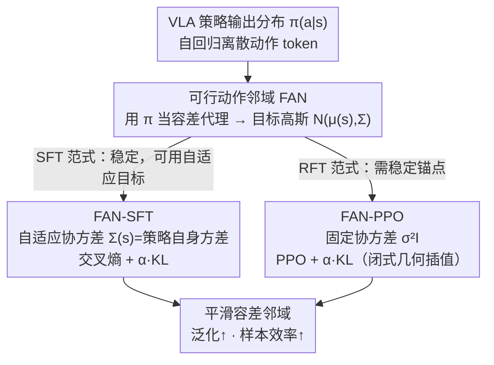

# Boosting Vision-Language-Action Finetuning with Feasible Action Neighborhood Prior

**会议**: CVPR 2026  
**arXiv**: [2604.01570](https://arxiv.org/abs/2604.01570)  
**代码**: 无  
**领域**: 机器人操作 / VLA 微调  
**关键词**: VLA微调, 可行动作邻域, 高斯正则化, 强化微调, 样本效率

## 一句话总结
提出可行动作邻域（FAN）正则化器，将 VLA 模型的输出分布塑造为与物理动作容差匹配的高斯形状，在 SFT 和 RFT 两种微调范式下均显著提升成功率、泛化性和样本效率（RFT 仅需 1/3 训练步数达到 90% 成功率）。

## 研究背景与动机
**领域现状**: VLA 模型（如 OpenVLA、$\pi_0$）将视觉感知、语言理解和低级控制统一到单一模型，通过离散化动作 token 进行自回归预测。实践中通常先预训练后微调（SFT 或 RFT）。

**现有痛点**: VLA 训练方法直接沿用语言模型的训练范式（one-hot 交叉熵或 PPO），但**物理动作具有固有的容差**——附近的动作可能产生完全等效的任务进展。这一根本差异被忽视了。

**核心矛盾**: SFT 将概率质量坍缩到单一示范动作上（过拟合），导致泛化差；RFT 虽能扩展分布但样本效率极低，需要大量探索才能隐式发现容差结构。

**本文要解决**: 如何在 VLA 微调中显式利用物理动作空间的容差结构？

**切入角度**: 形式化"可行动作邻域"（FAN）概念，并观察到策略分布形状（尖锐 vs 平滑）与泛化性能高度相关。

**核心idea**: 引入 FAN 引导的高斯正则化器，将策略分布从"过度自信的尖峰"塑造为"平滑的容差邻域"，无需修改模型架构即可同时适用于 SFT 和 RFT。

## 方法详解

### 整体框架
这篇论文针对 VLA 微调直接照搬语言模型训练范式（one-hot 交叉熵或 PPO）的问题——它忽视了物理动作天然有容差：附近的动作往往产生等效的任务进展。FAN 不改模型架构，只在每个状态 $s$ 上把策略预测的动作分布 $\pi(a|s)$ 朝一个目标高斯 $\mathcal{N}(\mu(s), \Sigma)$ 拉拢，把「过度自信的尖峰」塑造成「平滑的容差邻域」。同一套正则器从一个共享的 FAN 概念出发，分别接进 SFT 和 RFT 两条微调路径：SFT 稳定，用随策略几何自适应的协方差；RFT 需要稳定锚点，用固定协方差。两条路最终都把策略分布塑成容差邻域，提升泛化与样本效率，自回归离散解码全程保持不变。

### 关键设计

**1. 可行动作邻域（FAN）：把动作容差形式化成可观测代理**

容差结构以前是被隐式忽视的，FAN 把它显式定义出来：对给定状态 $s$，FAN 是所有 Q 值接近最优的动作集合
$$\mathbb{N}_\delta(s) \subseteq \{a \in A: Q(s, a^*(s)) - Q(s, a) \leq \delta\}$$
物理操作天然有非平凡的 FAN。但 Q 值难直接拿到，作者用策略分布 $\pi(a|s)$ 当 FAN 的实用可观测代理——分布越尖锐对应 FAN 越小、泛化越差，越平滑则 FAN 越大、泛化越好。这个对应来自经验观察：分布形状和成功率高度相关，于是「塑形分布」就成了「调控容差」的抓手。

**2. FAN-SFT：用自适应高斯抵消示范过拟合**

SFT 会把概率质量坍缩到单一示范动作上，过拟合导致泛化差。FAN-SFT 在标准交叉熵之外加一项 KL，把策略拉向以自身统计量定义的高斯：
$$\mathcal{L}_{\text{FAN-SFT}} = -\frac{1}{n}\sum_{i,t}\left(\log\pi_\theta(a_t^i|s_t^i, l^i) + \alpha D_{\text{KL}}(\pi_\theta(\cdot|s_t^i)\|\mathcal{N}(\cdot|\mu(s_t^i), \Sigma(s_t^i)))\right)$$
协方差动态取策略自身方差 $\Sigma(s) = \text{diag}(\sum_a \pi(a|s)(a-\mu(s))^2)$。因为 SFT 本身稳定，可以放心用这种随策略几何属性自适应的目标，鼓励分布按当前状态该有的容差宽度摊开，而不是坍缩到一个点。

**3. FAN-PPO：用固定高斯锚定强化微调**

RFT 虽能扩展分布，但样本效率极低，要靠大量探索才隐式发现容差结构。FAN-PPO 在 PPO 目标上加固定协方差高斯的 KL：
$$\max_\pi \mathbb{E}[\frac{\pi(a|s)}{\pi_t(a|s)}A^{\pi_t}] - \alpha \mathbb{E}[D_{\text{KL}}(\pi\|\mathcal{N}(\mu(s), \sigma^2 I))]$$
这里用固定 $\Sigma = \sigma^2 I$（超参直接控制目标 FAN 大小）。它有闭式最优策略
$$\pi_{t+1} \propto \mathcal{N}^{\frac{\alpha}{\alpha+\beta^*}} \cdot \pi_t^{\frac{\beta^*}{\alpha+\beta^*}} \cdot \exp(\frac{Q}{\alpha+\beta^*})$$
即新策略是旧策略与目标高斯的几何插值再用 Q 值重加权，$\alpha$ 控制高斯拉力、$\beta^*$ 控制保守程度。RFT 需要稳定锚点，固定协方差正好提供一致的目标，让模型不必从零探索就直接获得容差先验，样本效率大幅提升。

### 损失函数 / 训练策略
- FAN 正则化与标准 SFT/PPO 损失相加，$\alpha$ 控制权重
- OpenVLA: $\sigma=0.3, \alpha=1.0$; OpenVLA-OFT: $\sigma=0.2, \alpha=0.1$
- GAE 估计优势函数，价值网络用 MSE 损失训练

## 实验关键数据

### 主实验（ManiSkill，成功率 %）

| 方法 | 分布内 | OOD-视觉 | OOD-语义 | OOD-执行 | OOD 平均 |
|------|--------|---------|---------|---------|---------|
| OpenVLA + SFT | 78.1 | 76.6 | 57.4 | 40.4 | 58.1 |
| **OpenVLA + FAN-SFT** | **89.8** | **81.7** | **63.5** | **44.8** | **63.3** |
| 提升 | +11.7 | +5.1 | +6.1 | +4.4 | +5.2 |
| OpenVLA + PPO | 95.9 | 80.1 | 79.7 | 85.8 | 81.9 |
| **OpenVLA + FAN-PPO** | **97.4** | **85.0** | **86.7** | **92.6** | **88.1** |
| 提升 | +1.5 | +4.9 | +7.0 | +6.9 | +6.2 |

### 消融实验（样本效率）

| 配置 | 达到 90% 成功率所需步数 | 说明 |
|------|----------------------|------|
| OpenVLA + PPO | ~X 步 | 基线 |
| OpenVLA + FAN-PPO | **~X/3 步** | 仅需约 1/3 训练步数 |

| 数据量 | SFT | FAN-SFT | 提升 |
|--------|-----|---------|------|
| 1.6K | 较低 | 较高 | FAN 在各数据量下一致有效 |
| 16K | 较高 | **更高** | 大数据量下仍有提升 |

### 关键发现
- FAN-PPO 的提升在 OOD-执行场景最显著（+6.9~11.1%），说明 FAN 显著增强了动作空间泛化
- 样本效率提升最抢眼——FAN-PPO 仅需基线 1/3 步数达到同等性能
- 真实机器人实验也验证了 FAN-SFT 的空间泛化能力（在未见位置上成功率更高）
- FAN 不同于最大熵——最大熵是无结构的探索鼓励，FAN 是利用物理先验的结构化正则

## 亮点与洞察
- FAN 的形式化虽然简单但非常深刻——揭示了语言训练目标与物理动作空间之间的本质不匹配
- 正则化器不修改架构、不改变解码方式，真正即插即用
- 闭式最优策略的推导（Proposition 1）提供了清晰的理论理解
- SFT 和 RFT 两种范式的统一处理具有很好的普适性

## 局限与展望
- 高斯假设可能过于简单——实际 FAN 可能是非凸或多模态的
- $\sigma$ 需要跨任务调节，自适应学习 FAN 大小是重要方向
- 目前仅在模拟器和简单真实任务验证，复杂灵巧操作待测
- 可探索将 FAN 与价值函数结合，动态估计每个状态的容差大小

## 相关工作与启发
- RT-2、OpenVLA 等 VLA 模型直接沿用语言训练范式，本文揭示了这一范式的根本缺陷
- RL4VLA、GRPO 等 RFT 方法只在奖励端优化，FAN 从动作空间几何端优化，互补
- Label smoothing 也是分布正则，但不利用物理结构，效果远不及 FAN
- 启示：机器人控制中"物理先验"应被更积极地融入学习目标

## 评分
- 新颖性: ⭐⭐⭐⭐⭐ FAN 概念新颖且深刻，理论和实践结合紧密
- 实验充分度: ⭐⭐⭐⭐⭐ SFT+RFT 双范式、多VLA骨干、分布内+OOD、样本效率、真实机器人
- 写作质量: ⭐⭐⭐⭐⭐ 从动机到理论到实验的链条完整流畅
- 价值: ⭐⭐⭐⭐⭐ 为 VLA 微调提供了新的基本原则，有广泛适用性

<!-- RELATED:START -->

## 相关论文

- [\[CVPR 2026\] Global Prior Meets Local Consistency: Dual-Memory Augmented Vision-Language-Action Model for Efficient Robotic Manipulation](global_prior_meets_local_consistency_dual-memory_augmented_vision-language-actio.md)
- [\[CVPR 2026\] MoEActok: A MoE-based Action Tokenizer for Vision-Language-Action Models](moeactok_a_moe-based_action_tokenizer_for_vision-language-action_models.md)
- [\[CVPR 2026\] Adaptive Action Chunking at Inference-time for Vision-Language-Action Models](adaptive_action_chunking_at_inference-time_for_vision-language-action_models.md)
- [\[CVPR 2026\] ACoT-VLA: Action Chain-of-Thought for Vision-Language-Action Models](acot-vla_action_chain-of-thought_for_vision-language-action_models.md)
- [\[CVPR 2026\] QuantVLA: Scale-Calibrated Post-Training Quantization for Vision-Language-Action Models](quantvla_scale-calibrated_post-training_quantization_for_vision-language-action_.md)

<!-- RELATED:END -->
