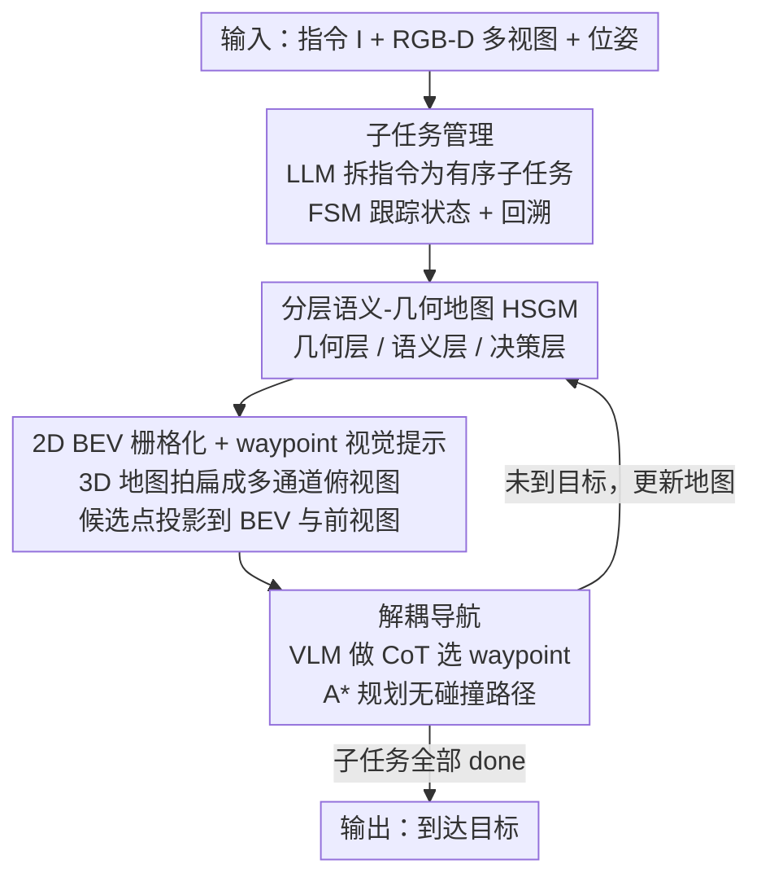

# Bridging the 2D-3D Gap: A Hierarchical Semantic-Geometric Map for Vision Language Navigation

**会议**: CVPR 2026  
**论文**: [CVF Open Access](https://openaccess.thecvf.com/content/CVPR2026/html/Li_Bridging_the_2D-3D_Gap_A_Hierarchical_Semantic-Geometric_Map_for_Vision_CVPR_2026_paper.html)  
**代码**: https://github.com/TeacherTom/HSGM_public (有)  
**领域**: 机器人 / 具身智能  
**关键词**: 视觉语言导航, 零样本VLN-CE, 语义-几何地图, VLM高层规划, 解耦控制

## 一句话总结
本文提出 HSGM——一个把 3D 几何信息栅格化成 VLM 看得懂的多通道 2D 俯视图的分层地图，让 VLM 只做"在地图上选下一个 waypoint"的高层语义决策、A* 算法负责底层无碰撞移动，从而在完全免训练的零样本设定下在 R2R-CE / RxR-CE 上达到 SR 47.9% / 41.8%，超过所有零样本方法并反超部分监督方法。

## 研究背景与动机

**领域现状**：视觉语言导航（VLN）让具身 agent 根据自然语言指令在未见环境中走到目标点。近期主流做法是直接把预训练 VLM 接进导航回路——VLM 有强大的跨模态对齐、世界知识和常识推理，能很好地理解语言指令和 2D 画面。任务还从早期的离散图遍历（R2R）转向更贴近现实的连续环境（VLN-CE，在 Habitat 里执行低层动作）。

**现有痛点**：VLM 是"几何上幼稚"的导航员。它在图文对上训练，推理被困在外观平面，对底层 3D 几何、以及空间关系如何随物理交互演化几乎没有概念。这具体表现为两个互相纠缠的弱点：① **空间理解不足**——VLM 能识别物体和局部关系（"椅子在桌子旁边"），但难以跨多个视角拼出全局空间布局，对连续空间的理解是碎片化、有歧义的，无法把"从两者之间穿过"这种指令可靠对齐到 3D 位置；② **运动规划无力**——VLM 能做高层语义规划（"走过走廊再转向沙发"），但不擅长把它翻译成可物理执行的低层动作序列（"左转 15°、前进 0.5m"）。

**核心矛盾**：先前方法（如 MapNav、AO-Planner）要么强迫 VLM 直接预测原始动作，要么直接在 2D 图像上规划路径——两条路都把**语义推理和几何执行纠缠在一起**，把 VLM 推到了它能力边界之外。问题根子在于：缺一座既"几何接地"又"对 VLM 语义可读"的桥，同时还得把高层规划和低层控制解耦开。

**本文目标**：(1) 给 VLM 一种它原生 2D 视觉管线就能消化、又保留几何线索的环境表征；(2) 把连续 3D 规划问题转成 VLM 擅长的离散选择问题；(3) 让长程导航不再"忘记进度 / 幻觉已完成"。

**切入角度**：VLM 的本职是 2D 图文理解，那就别逼它读 3D 点云——把 3D 环境**栅格化成一张俯视语义图（BEV）**喂给它，几何执行交给经典规划算法。

**核心 idea**：用一张"分层语义-几何地图（HSGM）"当信息枢纽——VLM 只在地图上挑几何上合法的 waypoint 做高层语义决策，A* 负责 waypoint 之间的无碰撞移动，整套框架**免训练**。

## 方法详解

### 整体框架

HSGM 是一个 training-free 的零样本 VLN-CE 框架，输入是用户的自然语言指令 $I$ 和 agent 的第一视角 RGB-D 多视图观测 $O_t=\{V_t^i\}_{i=1}^3$（前/左/右），输出是一串低层动作直到 agent 选择 STOP。整条 pipeline 可以理解为"先把指令拆成子任务、再边走边建一张三层地图、把地图拍扁成 VLM 能读的 2D 视觉提示、让 VLM 在上面选点、最后 A* 把点连成路"。

形式上导航是序列决策 $a_t=\pi_\theta(I,O_t,H_t)$，$H_t=\{(O_k,a_k)\}_{k<t}$ 是历史上下文。关键在于把 $\pi_\theta$ 拆成两层：高层策略 $\pi_H$ 由 VLM 承担（在地图上选 waypoint），低层策略 $\pi_L$ 由 A* 承担（把 waypoint 变成原子动作）。四个模块的协作关系如下：

### 关键设计

**1. 分层语义-几何地图 HSGM：把 3D 环境拆成几何/语义/决策三层，几何接地又语义可读**

这是全文的信息枢纽，直接针对"VLM 几何幼稚"这个根痛点。它维护一份动态更新的 3D 表征，分三个互补层级。**几何层 $M_{geo}$** 是空间骨架：沿用 InstructNav 的做法，把多视图 RGB 像素用深度图 $I_t^{i,D}$ 和相机位姿 $\xi_t$ 反投影成场景点云 $P_{scene}$，地面以上的点判为障碍 $P_{obs}$、其余为初始可行区 $P_{nav}^{init}$；为支持跨楼层，再用表面法向估计 + 倾斜平面滤波检测楼梯 $P_{stair}$ 并并入可行区：

$$P_{nav}=P_{nav}^{init}\cup P_{stair},\quad M_{geo}=P_{nav}\cup P_{obs}.$$

**语义层 $M_{sem}$** 让 VLM 从语义视角感知场景：用 YOLO-E 对第一视角 RGB 做实例分割得到掩码 $\{M_j\}$ 和类别 $\{c_j\}$，每个掩码用深度反投影回 3D 得到实例点云 $P_{obj,j}$；agent 移动时，多帧的 $P_{obj,j}$ 在 3D IoU 高、语义一致时合并，形成时序连贯的实例级语义图，点数不足的实例被当噪声丢弃，最终 $M_{sem}=\{(P_{obj,j},c_j)\}_{j=1}^{N_{obj}}$。**决策层 $M_{dec}=\{G,A_{curr}\}$** 把可行空间离散成 waypoint（详见设计 3），并记录历史轨迹 $\tau_{his}$ 和已完成子任务节点 $\{\pi_{done,k}\}$。三层叠在一起，VLM 第一次有了"全局一致 + 物体接地 + 候选可选"的环境视图，而不是碎片化的多视角拼图。

**2. 2D BEV 栅格化 + waypoint 视觉提示：把 3D 地图拍成 VLM 原生能读的俯视图**

VLM 几乎只在 2D 图文对上训练，直接喂 3D 点云它读不懂——这一步就是把设计 1 的 3D HSGM 栅格化成 agent 中心的**多通道 2D 俯视图 $M_{bev}$**，作为 VLM 的核心视觉输入。$M_{bev}$ 包含三类通道：① 几何通道（障碍 $P_{obs}$ 涂黑、可行区 $P_{nav}$ 涂灰）；② 语义通道（在物体几何中心画类别专属标记）；③ 状态标注（叠加 agent 当前位置、历史轨迹 $\tau_{his}$、已完成子任务终点）。更关键的是，把当前可选的局部 waypoint 集 $A_{curr}$ 标上**数字索引**，同时投影到 BEV 图和 agent 前视图 $V_t^{front}$ 上，已访问/未访问 waypoint 用红/灰不同颜色区分。这样一来，VLM 不必输出连续坐标，而是在画面里"看着编号选一个点"——连续 3D 规划被转成了离散选择任务，正好落在 VLM 的舒适区。

**3. 解耦导航：VLM 只做高层选点，A* 负责底层无碰撞移动，外加免训练 waypoint 采样**

针对"语义推理和几何执行纠缠"这一痛点，框架彻底解耦两层。**高层** VLM 在每步收到视觉输入（标了候选 waypoint 的 $V_t^i$ 和 $M_{bev}$）和文本输入（指令 + 推理历史），按结构化 CoT 顺序推理——Movement → Observation → Thought → Plan → Action，从动作空间 $A_t=A_{turn}\cup A_{curr}$（固定转向 + 动态 waypoint）里选一个，或输出 STOP。**底层** 一旦选中 waypoint $g$，A* 在预先构好的全局图 $G=(V,E)$ 上以欧氏距离为代价求最短路 $\tau_{path}$，再分解成"先 ROTATE 对准、再 FORWARD 前进"的原子动作，几何精度由经典算法保证。

waypoint 怎么来的同样是亮点——**全程免训练**。全局图 $G$ 的节点由 $M_{geo}$ 去噪 + 体素下采样得到候选 $A_{glob}$，每个候选 $p_c$ 做圆柱占据检查 $P_{obs}\cap \text{Cyl}(p_c,r,h)=\varnothing$（$r,h$ 是 agent 半径和高度）才算合法；边在距离 $\le 1.0\text{m}$、高差 $\le 0.3\text{m}$（允许跨楼梯）的节点对间建立，并沿线插值确认不穿障碍，得到稠密无碰撞拓扑。局部 waypoint 集 $A_{curr}$ 用更粗分辨率（如 1.0m）在当前视野里同样流程生成，再过三道启发式滤波：距离滤波（保留 0.3–3.0m 内的点）、语义滤波（优先靠近物体的点）、可达性滤波（丢掉全局图里到不了的点）。比起 value-map 方法（VLM 当打分器、严重依赖感知质量）和 waypoint 预测器方法（需训练、稀疏点间移动低效），HSGM 直接从 3D 地图采稠密、几何感知的点，既精确又不用训练。

**4. 子任务管理：把长指令拆成有限状态机，专治长程导航的"忘记进度 / 幻觉完成"**

VLM 在长程导航里容易漏指令、跳步骤、误判任务完成。这一机制先让 VLM 把复杂指令 $I$ 分解成有序可执行的子任务 $T=\{T_1,\dots,T_k\}$，每个子任务满足两个约束：**明确终止**（有可验证的终态，如"离开卧室"）和**有界复杂度**（不超过三条运动指令）。执行时一个有限状态机按 $S\in\{\text{pending, in progress, done}\}$ 强制顺序推进——VLM 一直被喂当前 in progress 子任务，直到输出 STOP 才把它置为 done、激活下一个；对最后一个子任务用**双确认**（连续两次 STOP）防止提前终止。两个辅助机制增强鲁棒性：① 历史记录——已完成子任务位置 $\pi_{done,i}$ 记到决策图并投影到 BEV，作为空间锚点防止重复探索；② 自动回溯——某子任务超出步数上限时，agent 自动退回初始位置、从已知状态重试。

### 损失函数 / 训练策略
全程 **training-free**，无任何训练 / 微调。所有实验用 GPT-5 API 当核心 VLM（同一个模型既做指令分解又做导航决策），语义分割用现成的 YOLO-E，底层路径规划用 A*。

## 实验关键数据

### 主实验

在 R2R-CE（完整 val-unseen）和 RxR-CE（随机采样 500 条英文 episode）上对比，HSGM 在所有主要指标上稳定超过全部零样本方法，并反超部分监督方法（SR↑ / SPL↑ / NE↓ / OSR↑ / nDTW↑）：

| 设定 | 方法 | R2R-CE SR | R2R-CE SPL | R2R-CE NE | RxR-CE SR | RxR-CE nDTW |
|------|------|-----------|------------|-----------|-----------|-------------|
| 监督 | NaVid (RSS24) | 37.4 | 35.9 | 5.47 | 23.8 | – |
| 监督 | MapNav (ACL25) | 39.7 | 37.2 | 4.93 | 32.6 | 43.5 |
| 监督 | ETPNav (TPAMI24) | 57.0 | 49.0 | 4.71 | 54.8 | 61.9 |
| 零样本 | AO-Planner (AAAI25) | 25.5 | 16.6 | 6.95 | 22.4 | 33.1 |
| 零样本 | DreamNav (arXiv25) | 32.8 | 28.9 | 7.06 | – | – |
| 零样本 | **HSGM (本文)** | **47.9** | **32.8** | **5.42** | **41.8** | **54.9** |

R2R-CE 上 SR 比最强零样本 DreamNav 高 15.1%、SPL 高 3.9%，且 NE 最低、OSR 最高（58.7%）。RxR-CE 这种长程 benchmark 差距更大：41.8% SR 几乎是最强零样本基线 AO-Planner（22.4%）的两倍，nDTW 54.9% 远超其 33.1%，印证子任务管理对时空对齐的作用。

### 消融实验

**BEV 地图三层逐层叠加**（R2R 300-episode 子集，去掉 BEV 图为基线）：

| 几何层 | 语义层 | 决策层 | SR ↑ | SPL ↑ |
|--------|--------|--------|------|-------|
| × | × | × | 46.0 | 30.1 |
| ✓ | × | × | 47.3 | 31.8 |
| ✓ | ✓ | × | 49.2 | 32.8 |
| ✓ | ✓ | ✓ | 51.0 | 33.7 |

**解耦导航各组件**（R2R val-unseen）：

| 配置 | SR ↑ | SPL ↑ | NE ↓ | OSR ↑ | 说明 |
|------|------|-------|------|-------|------|
| Full Model | 51.0 | 33.7 | 5.24 | 61.7 | 完整模型 |
| w/o 子任务分解 | 42.1 | 28.9 | 5.59 | 57.9 | 掉 8.9% SR |
| w/o 规划-控制分离 | 44.3 | 31.9 | 5.47 | 57.0 | 掉 6.7% SR |
| w/o 结构化 CoT | 34.0 | 18.0 | 6.48 | 55.3 | 掉 17.0% SR，最致命 |

### 关键发现
- **结构化 CoT 是命门**：去掉后 SR 从 51.0 暴跌到 34.0（−17%）、SPL 几乎腰斩（33.7→18.0），说明让 VLM 按 Movement→Observation→Thought→Plan→Action 的固定认知顺序推理，是把"看地图选点"变可靠的关键，而不只是锦上添花。
- **三层地图累积增益、各司其职**：几何层解空间歧义（+1.3%）、语义层做指令-物体接地（+1.9%）、决策层提供长程上下文（+1.8%），逐层叠加都涨，验证分层设计而非冗余。
- **子任务管理对长程更值钱**：在长指令的 RxR-CE 上提升尤其明显（nDTW 几乎翻倍），且去掉子任务分解在 R2R 上也掉 8.9% SR。
- **自动回溯能救场**：回溯在 R2R/RxR 上分别有 18.3% / 19.0% 的 episode 被触发，触发后恢复成功率 30.8% / 26.8%，说明"卡住就退回重试"确实捞回了不少本会失败的导航。

## 亮点与洞察
- **"让 VLM 干它擅长的事"这个分工思想很干净**：不逼 VLM 读 3D、不逼它吐连续动作，只让它在一张标了编号的俯视图上做离散选择——把连续 3D 规划降维成 VLM 的舒适区任务，是整套方法 work 的根本。
- **几何精度外包给 A* 是性价比极高的 trick**：无碰撞、跨楼梯、最短路这些 VLM 天生做不好的事，全交给确定性经典算法，VLM 只负责"选哪个点"，既稳又省。
- **免训练却反超监督方法**：在 R2R-CE 上零样本 47.9% SR 超过监督的 MapNav（39.7%）和 NaVid（37.4%），说明"好的环境表征 + 合理分工"能部分替代大规模域内训练数据。
- **可迁移的设计**：把 3D 结构栅格化成多通道 BEV 喂 VLM 这套表征接口，迁移到物体导航、移动操作等任何"需要全局空间布局 + VLM 决策"的具身任务都成立；有限状态机 + 双确认 + 回溯的子任务管理也可直接搬到任何长程 LLM agent 上防幻觉。

## 局限与展望
- **依赖外部感知质量**：语义层完全依赖 YOLO-E 的实例分割，地图建得准不准受限于检测器，复杂/罕见物体或恶劣视角下可能失准（作者未在此展开⚠️ 以原文为准）。
- **VLM 成本与延迟**：每步都要调用 GPT-5 做 CoT 推理，消融实验都不得不缩到 300-episode 子集"以降低 API 成本"，实机部署的实时性和费用是现实瓶颈。
- **SPL 相对偏低**：虽然 SR 高，但 R2R-CE SPL 32.8% 明显低于监督 ETPNav 的 49.0%，说明路径效率（绕路）仍有差距——选点离散 + 逐 waypoint 移动可能带来非最优路径。
- **多楼层靠启发式楼梯检测**：跨楼层能力依赖表面法向 + 倾斜平面滤波检测楼梯，这套几何启发式在非标准楼梯/坡道上的鲁棒性存疑。

## 相关工作与启发
- **vs MapNav / Dynam3D（结构化地图输入）**: 它们也给 VLM 喂标注 2D 俯视图或动态分层 3D 表征，但都**需要域内训练**让 VLM 学会解读这种结构化输入；HSGM 同时用 2D 俯视语义图做理解、3D 几何图做免训练规划，完全零样本。
- **vs InstructNav / CA-Nav（value-map 解耦）**: 它们把 VLM 当语义打分器去引导低层规划器，但地图对 VLM 不可见、且重度依赖感知质量；HSGM 让地图直接作为 VLM 可见的视觉输入，并把选择限制在几何已验证的 waypoint 上，减少不可行动作。
- **vs AO-Planner（2D affordance 推理）**: 它在 2D 图上提示 VLM 做可达性推理，把视觉可见和物理可达混为一谈、频繁碰撞；HSGM 的 waypoint 来自 3D 几何图 + 圆柱占据检查，物理可达性有几何保证。
- **vs SmartWay 等 waypoint 预测器**: 它们用训练好的预测器生成稀疏 waypoint、点间移动低效；HSGM 从 3D 地图采稠密、几何感知的点且无需训练。

## 评分
- 新颖性: ⭐⭐⭐⭐ 把"3D 栅格化成多通道 BEV 喂 VLM + 高低层彻底解耦 + 免训练 waypoint 采样"组合成一套干净的零样本框架，思路清晰但单点组件多为已有技术的巧妙拼装。
- 实验充分度: ⭐⭐⭐⭐ 两大 benchmark + 两组核心消融 + 回溯统计，结论自洽；但 API 成本逼得消融只能用 300-episode 子集，规模略受限。
- 写作质量: ⭐⭐⭐⭐⭐ 痛点—设计—公式—消融环环相扣，三层地图和解耦导航讲得很清楚。
- 价值: ⭐⭐⭐⭐⭐ 零样本反超监督方法 + 完全免训练 + 表征接口可迁移，对具身导航的实用价值高。

<!-- RELATED:START -->

## 相关论文

- [\[CVPR 2026\] TrajRAG: Retrieving Geometric-Semantic Experience for Zero-Shot Object Navigation](trajrag_retrieving_geometric-semantic_experience_for_zero-shot_object_navigation.md)
- [\[CVPR 2026\] Progress-Think: Semantic Progress Reasoning for Vision-Language Navigation](progress-think_semantic_progress_reasoning_for_vision-language_navigation.md)
- [\[CVPR 2026\] D3D-VLP: Dynamic 3D Vision-Language-Planning Model for Embodied Grounding and Navigation](d3d-vlp_dynamic_3d_vision-language-planning_model_for_embodied_grounding_and_nav.md)
- [\[CVPR 2026\] AwareVLN: Reasoning with Self-awareness for Vision-Language Navigation](awarevln_reasoning_with_self-awareness_for_vision-language_navigation.md)
- [\[CVPR 2026\] Learning to Control Physically-simulated 3D Characters via Generating and Mimicking 2D Motions](learning_to_control_physically-simulated_3d_characters_via_generating_and_mimick.md)

<!-- RELATED:END -->
