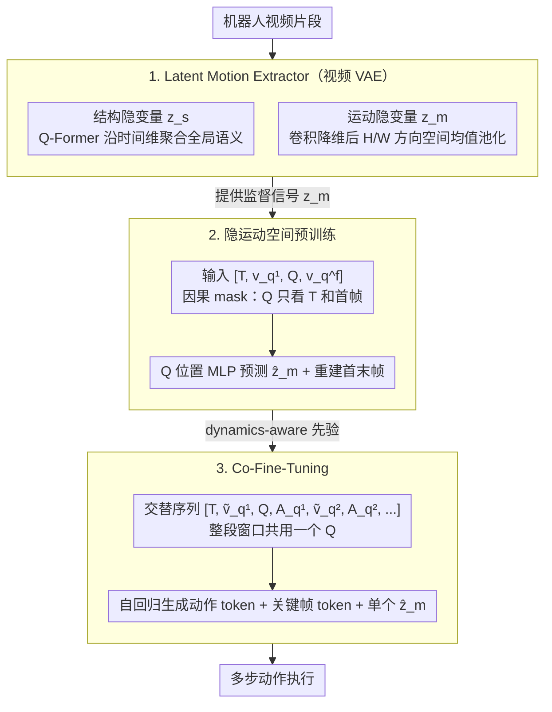

# Chain of World: World Model Thinking in Latent Motion (CoWVLA)

**会议**: CVPR 2026  
**arXiv**: [2603.03195](https://arxiv.org/abs/2603.03195)  
**代码**: [https://fx-hit.github.io/cowvla-io](https://fx-hit.github.io/cowvla-io)  
**领域**: 机器人操作 / 视觉-语言-动作模型 / 世界模型  
**关键词**: [VLA, 世界模型, 隐运动建模, 视频VAE, 关键帧预测, 动作量化]  

## 一句话总结
提出CoWVLA，统一世界模型VLA和隐动作VLA的优势：通过Latent Motion Extractor将视频分解为结构隐变量和运动隐变量，VLA在隐运动空间做世界模型预测而非重建冗余像素，配合Co-Fine-tuning交替生成关键帧和动作token，LIBERO-LONG达95.2%超越π₀(85.2%)，SimplerEnv-WidowX avg 0.560超π₀(0.425)。

## 背景与动机
将世界模型引入VLA是近期的重要趋势，核心思想是让模型不仅预测动作，还能预测未来状态——"想象"动作执行后的世界会变成什么样。然而现有两类方法各有硬伤：

1. **World-model VLA（如GR-2、UniPi）**：直接在像素空间预测未来帧。问题是场景中大量像素是静止背景（桌面、墙壁、远处物体），模型将大量capacity浪费在重建这些冗余信息上。真正对机器人决策有用的是运动相关信息（物体位移、机械臂轨迹），而这在像素空间中只占极小比例。
2. **Latent-action VLA（如LAPA、latent action pretraining）**：将动作编码到隐空间，绕过显式动作标注的限制。但这类方法仅抽取动作的隐表示，缺乏对时间连续动态的建模——不能预测"接下来会发生什么"，也没有整合世界知识来做前瞻性推理。

核心矛盾：世界模型需要预测未来，但像素级预测太浪费；隐动作节省了capacity，但丢失了世界动态信息。

## 核心问题
如何在不重建冗余背景像素的前提下，让VLA具备世界模型的预测能力——即在隐运动空间而非像素空间进行世界模型推理？

## 方法详解

### 整体框架
CoWVLA 想同时拿到两类方法的好处：世界模型 VLA 能预测未来但在像素空间重建太浪费，隐动作 VLA 省了 capacity 却丢了世界动态。它的解法是让 VLA 在「隐运动空间」而非像素空间做世界模型预测。整个系统由**两个模型、三个训练阶段**组成：**Latent Motion Extractor（视频 VAE）**先把视频片段拆成结构隐变量 $z_s$ 和运动隐变量 $z_m$，为后续提供监督信号；**VLA 解码器**则在两个阶段里做统一的自回归预测——预训练阶段从指令和首帧推断隐运动 $\hat z_m$ 并重建首末帧，Co-Fine-Tuning 阶段把这套动态推理对齐到离散动作，交替建模关键帧视觉 token 和 FAST 量化的动作 token。

### 关键设计

**1. Latent Motion Extractor：把视频拆成结构和运动，先过滤掉冗余背景**

像素空间里大量是静止背景，模型重建它们纯属浪费 capacity，真正有用的是运动信息。这个分解器是一个预训练视频 VAE，把视频片段编码成中间隐张量后分两条支路解耦：结构支路用 Q-Former（一组可学习 query 通过 cross-attention 沿时间维聚合）提取结构隐变量 $z_s$，编码全局语义和低频动态，也就是「场景是什么样的」；运动支路先用几个卷积层把隐张量降维成 $z'$，再分别沿 H、W 两个空间轴做均值池化，得到方向运动嵌入 $z_m^h$、$z_m^w$，拼接成统一的运动隐变量 $z_m$——一个轴保留水平方向的运动、另一个轴保留垂直方向，合起来构成完整的 2D 运动场。空间均值池化天然抹掉不动区域的贡献，于是 $z_m$ 自动过滤掉静态背景。三个隐分量（$z_s$、$z_m^h$、$z_m^w$）上采样后相加重建原视频，配合感知 / 对抗 / KL 损失保证分解信息无损。

**2. 隐运动空间的世界模型预训练：预测运动而不是抄答案**

光有分解还不够，要让 VLA 学会「给定当前观测和指令，预测接下来怎么动」。预训练输入序列排成 $[T, v_q^1, Q, v_q^f]$：$T$ 是语言指令 token，$v_q^1$ 是首帧视觉 token，$Q$ 是可学习的 motion query，$v_q^f$ 是末帧视觉 token（首末帧都经 VQGAN 离散化）。$Q$ 位置的隐状态过 MLP 输出 $\hat z_m$，用 MSE 对齐由 extractor 算出的真值 $z_m$。最关键的是因果注意力 mask——$Q$ 只能看 $\{T, v_q^1\}$、被屏蔽看不到末帧 $v_q^f$，保证运动预测是真「预测」而非「抄答案」。总损失 $\mathcal{L}_{pretrain} = \|\hat z_m - z_m\|_2^2 + \sum_{x\in\{1,f\}}\mathrm{CE}(\hat v_q^x, v_q^x)$：第一项让 $Q$ 准确概括从首帧到末帧的连续运动，第二项同时重建首、末帧，让模型对「动作后的世界」形成连贯预测。

**3. Co-Fine-Tuning：单个 query 聚合整段动态，对齐到多步动作**

微调阶段要把预测能力接到真实控制上。输入序列改成关键帧和动作交替排列 $[T, \tilde v_q^1, Q, \mathbf{A}_q^1, \tilde v_q^2, \mathbf{A}_q^2, \ldots, \mathbf{A}_q^N]$：$\tilde v_q^j$ 是第 $j$ 个关键帧的视觉 token（VQGAN 离散化），$\mathbf{A}_q^j$ 是第 $j$ 段动作 chunk 经 FAST 量化后的 token。关键是这里采用「整段窗口共用一个 $Q$」的设计——$Q$ 只在首个关键帧后出现**一次**，作为整个时间窗口的动态聚合器，$Q$ 位置过 MLP 只产出**一个** $\hat z_m$ 来概括从首帧到末帧的连续动态，而不是每步各预测一次。解码器自回归地同时生成动作 token 和关键帧 token，因果 mask 同样禁止 $Q$ 看未来的关键帧和动作，逼模型靠隐动态推理而非偷看未来。损失三项：$\sum_j \mathrm{CE}$(动作 token) 保证动作准确执行、$\lambda_1\|\hat z_m - z_m\|_2^2$ 让 query 忠实捕获连续动态、$\lambda_2\sum_j\mathrm{CE}$(关键帧 token) 把运动预测锚到稀疏视觉检查点。

### 损失函数 / 训练策略
- 预训练：L = MSE(ẑ_m, z_m) + CE(v_q^f reconstruction)，在大规模机器人视频数据上训练
- Co-Fine-tuning：L = CE(action tokens) + CE(keyframe tokens) + MSE(motion prediction)，在任务特定数据上微调
- FAST量化器和VQGAN独立预训练后冻结
- 推理时：自回归生成action token → 解码为连续动作，同时生成关键帧token用于可视化/验证

## 实验关键数据

| 数据集 | 指标 | CoWVLA | π₀ | OpenVLA | HPT | 提升(vs π₀) |
|--------|------|--------|-----|---------|-----|-------------|
| LIBERO-Spatial | 成功率 | **96.8%** | 92.4% | 78.8% | — | **+4.4** |
| LIBERO-Object | 成功率 | **98.4%** | 94.0% | 88.4% | — | +4.4 |
| LIBERO-Goal | 成功率 | **95.2%** | 87.2% | 68.4% | — | +8.0 |
| LIBERO-Long | 成功率 | **95.2%** | 85.2% | 56.4% | — | **+10.0** |
| LIBERO-Avg | 成功率 | **96.4%** | 89.7% | 73.0% | — | **+6.7** |
| SimplerEnv-WidowX | Avg score | **0.560** | 0.425 | 0.268 | 0.308 | **+0.135** |
| SimplerEnv-Google Robot | Avg score | **0.504** | — | 0.248 | 0.480 | — |

### 消融实验要点
- 移除motion latent预训练：LIBERO-Avg从96.4%降至92.1%，说明隐运动空间的世界模型预训练是核心贡献
- 用像素级重建替换latent motion预测：性能降至90.8%，证实像素级重建确实浪费capacity
- 移除Co-Fine-tuning中的关键帧生成：降至93.7%，关键帧提供了有用的视觉锚点
- 移除Q-Former聚合（直接concat所有视频token）：z_s过于冗长，训练不稳定
- z_m提取方式对比：H/W方向均值拼接 > 全局均值池化 > 时间差分卷积，说明保留方向信息很重要

## 亮点
- **隐运动空间世界模型的概念突破**：不在像素空间重建未来帧，而在压缩的运动隐空间做预测——既保留了世界模型的前瞻推理能力，又消除了冗余背景重建的计算浪费
- **z_m的提取方式优雅**：H/W方向均值池化天然过滤静态背景，保留运动方向信息，设计极简但有效
- **因果mask设计精巧**：Q 被屏蔽看不到未来帧，只能看指令和首帧，确保运动预测是真「预测」而非偏看未来
- **Co-Fine-Tuning 的单 query 设计**：整段窗口只用一个 Q 作为动态聚合器，产出单个 ẑ_m 概括全段连续运动，关键帧与动作 token 交替生成把世界模型思维接到决策
- **LIBERO-Long大幅领先**：95.2% vs π₀的85.2%，+10%的提升说明世界模型思维对长序列任务至关重要

## 局限与展望
- 视频VAE是预训练后冻结的——如果VAE的运动-结构分解不够好，后续所有环节都受影响。端到端联合训练VAE可能进一步提升
- z_m的H/W方向均值池化丢失了精细的空间局部运动信息——对需要精确空间定位的任务（如穿针引线）可能不够
- 关键帧的选择策略未详细描述——均匀采样还是基于运动幅度自适应选取？不同策略可能显著影响性能
- SimplerEnv-Google Robot上的改进有限（0.504），可能因Google Robot任务与预训练数据分布差异较大
- FAST和VQGAN量化器引入了离散化误差——对精细动作（如旋转瓶盖）可能产生累积偏差

## 与相关工作的对比
- **vs GR-2 / UniPi (像素级世界模型VLA)**: 这类方法在像素空间做未来帧预测/生成，计算代价高且大量capacity浪费在静态背景上。CoWVLA在隐运动空间做预测，只关注运动相关信息
- **vs LAPA (隐动作预训练)**: LAPA提取动作隐表示但不做时间连续动态建模。CoWVLA的latent motion预测包含时间动态——不仅知道"做什么动作"，还知道"世界会怎么变"
- **vs π₀ (Flow matching VLA)**: π₀用flow matching做连续动作预测，没有世界模型组件。CoWVLA通过隐运动预测赋予π₀框架世界模型能力，LIBERO-Long +10%
- **vs AtomicVLA (技能规划VLA)**: AtomicVLA通过think-act切换做任务规划，CoWVLA通过世界模型做前瞻推理——两者解决多步任务的角度不同但互补：AtomicVLA是"先想清楚做什么"，CoWVLA是"先想象做后会怎样"

## 启发与关联
- **隐运动空间的通用性**：将视频分解为structure+motion的思路可以迁移到视频理解任务——如动作识别中用motion latent做分类可能比端到端更高效
- **Co-Fine-tuning范式**：交替生成不同模态token的训练方式可以应用到其他多模态任务——如图文交错生成、视频-音频联合生成
- **与扩散世界模型的结合**：CoWVLA的latent motion可以作为扩散世界模型的条件信号——先预测z_m（快速、低维），再用z_m引导像素级扩散生成高保真未来帧

## 评分
- 新颖性: ⭐⭐⭐⭐⭐ 隐运动空间世界模型是全新概念，z_m提取方式和Co-Fine-tuning交替生成均有创新
- 实验充分度: ⭐⭐⭐⭐ LIBERO全子集 + SimplerEnv两个机器人 + 完整消融，但缺少真实机器人实验
- 写作质量: ⭐⭐⭐⭐ 动机对比（像素重建 vs 隐运动预测）非常清晰，方法描述系统化
- 价值: ⭐⭐⭐⭐⭐ 为VLA世界模型指明了新方向——从像素空间走向隐运动空间，LIBERO和SimplerEnv大幅SOTA

<!-- RELATED:START -->

## 相关论文

- [\[ICML 2026\] Dual-Stream Diffusion for World-Model Augmented Vision-Language-Action Model](../../ICML2026/robotics/dual-stream_diffusion_for_world-model_augmented_vision-language-action_model.md)
- [\[ICLR 2026\] Sparse Imagination for Efficient Visual World Model Planning](../../ICLR2026/robotics/sparse_imagination_for_efficient_visual_world_model_planning.md)
- [\[ICML 2026\] Latent Reasoning VLA: Latent Thinking and Prediction for Vision-Language-Action Models](../../ICML2026/robotics/latent_reasoning_vla_latent_thinking_and_prediction_for_vision-language-action_m.md)
- [\[CVPR 2025\] Neural Motion Simulator: Pushing the Limit of World Models in Reinforcement Learning](../../CVPR2025/robotics/neural_motion_simulator_pushing_the_limit_of_world_models_in_reinforcement_learn.md)
- [\[CVPR 2026\] CoMo: Learning Continuous Latent Motion from Internet Videos for Scalable Robot Learning](como_learning_continuous_latent_motion_from_internet_videos_for_scalable_robot_l.md)

<!-- RELATED:END -->
