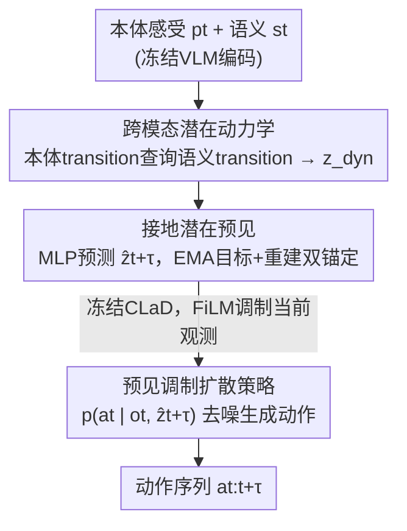

# CLaD: Planning with Grounded Foresight via Cross-Modal Latent Dynamics

**会议**: CVPR 2026  
**论文**: [CVF Open Access](https://openaccess.thecvf.com/content/CVPR2026/html/Jeong_CLaD_Planning_with_Grounded_Foresight_via_Cross-Modal_Latent_Dynamics_CVPR_2026_paper.html)  
**代码**: https://andrewwwj.github.io/clad （项目主页）  
**领域**: 机器人 / 具身智能  
**关键词**: 机器人操作, 潜在规划, 跨模态动力学, 扩散策略, 自监督预见  

## 一句话总结
CLaD 让机器人在一个紧凑的潜在空间里规划：它用「本体感受变化去查询语义变化」的非对称交叉注意力建模两种模态如何随动作共同演化，预测出被 EMA 目标和重建损失双重「接地」的潜在预见，再用它调制一个扩散策略生成动作；在 LIBERO-LONG 上仅用 0.66B 参数就拿到 94.7% 成功率，超过了 7B 的 OpenVLA。

## 研究背景与动机
**领域现状**：机器人长程操作的规划目前有两条主线。一条是「语义推理」派——用语言模型做思维链规划（SayCan、CoT），或直接生成子目标图像 / 视频（SuSIE、文本条件视频生成）当作中间目标去引导底层策略。另一条是「潜在空间规划」派——学一个前向动力学世界模型，在压缩的潜在表示里做 model-predictive control（如 RSSM、decoder-free 的隐式优化、LBP 的反向潜在规划），效率高很多。

**现有痛点**：语义推理派每一步都要迭代生成昂贵的「语义产物」（一张子目标图、一段视频或一串文本），计算开销大；潜在规划派虽然快，但它把语义信息和运动学信息**隐式地揉在一个潜在向量里**，没有任何显式约束去保证两种模态在 rollout 过程中协调演化。结果在长时序展开时，语义潜在和运动学潜在可能各自漂移、解耦，生成物理上或逻辑上不自洽的轨迹。

**核心矛盾**：机器人抓取物体时，本体感受变化（手臂在动）和语义变化（场景画面在变）其实是被同一个底层动作**因果耦合**的。但已有的跨模态表示学习只在「单个时间步」上对齐静态状态（把视觉特征和本体状态在某一帧匹配起来），从没建模过「两种状态如何在动作驱动下一起变化」，因此无法保证视觉场景的变化和机器人关节构型的变化保持一致。

**本文目标**：学一个表示，它捕捉的是**变化与变化之间**（transition-to-transition）的相关性，而不是状态与状态之间的相关性；并用这个表示预测出可靠的未来潜在状态来指导动作生成。

**切入角度**：作者的关键洞察是「一致性应该施加在 transition 上而非 static state 上」。当机器人闭合夹爪（运动学 transition）时，它在观察场景如何变化（语义 transition），这两个共现变化通过底层动作因果相连。而且方向是有偏的——运动学语境是解读视觉变化的更可靠基准（你知道自己怎么动了，才好理解画面为什么这么变）。

**核心 idea**：用**非对称交叉注意力**让本体感受 transition 去 query 语义 transition，得到共享的跨模态动力学表示 $z_{\text{dyn}}$；从它预测被「接地」的潜在预见，再用预见去条件化一个扩散策略——整个规划完全在紧凑潜在空间内完成，无需生成任何显式语义产物。

## 方法详解

### 整体框架
CLaD 是一个**两阶段**框架，输入是机器人当前的本体感受状态 $p_t$（关节角度+速度）和语义状态 $s_t$（冻结 VLM 给出的视觉-语言嵌入经 FiLM 融合），输出是一段动作序列 $a_{t:t+\tau}$。作者借用了 System 2 / System 1 的比喻：第一阶段是「慢思考」——学跨模态动力学并预测未来潜在预见（latent foresight）；第二阶段是「快反应」——一个扩散策略在预见条件下生成底层动作。两阶段解耦训练，让规划专注于「准确预测未来状态」而不被策略优化的偏置干扰，同时全程在潜在空间里运作以避免显式语义生成的开销。

具体地：第一阶段先把 $p_t$、$s_t$ 各自编码，再各自抽出**transition 表示** $z_p$、$z_s$（用过去状态+动作去 cross-attend 当前状态）；然后用非对称交叉注意力让 $z_p$ 去 query $z_s$，池化成共享动力学 $z_{\text{dyn}}$；从 $z_{\text{dyn}}$ 用轻量 MLP 预测两个模态的未来潜在预见 $\hat z^{t+\tau}_p$、$\hat z^{t+\tau}_s$，并用 EMA 目标编码器 + 重建解码器双重监督。第二阶段冻结 CLaD，把预见 $\hat z^{t+\tau}$ 用当前观测经 FiLM 调制，去条件化扩散策略。

### 关键设计

**1. 跨模态潜在动力学：让运动学语境去解读语义变化**

针对「潜在规划把两种模态隐式揉在一起、无法保证一致演化」这个痛点，CLaD 把建模对象从「静态状态对齐」换成「transition 之间的相关性」。先为每个模态抽 transition 表示：动作 horizon 是 $\tau$，于是用过去状态拼上动作序列去 cross-attend 当前状态——$z_p = \text{CrossAttn}(p_t,\, [p_{t-\tau};\, a_{t-\tau:t}])$，$z_s = \text{CrossAttn}(s_t,\, [s_{t-\tau};\, a_{t-\tau:t}])$。训练时还会**随机把动作 token 替换成一个可学习 token**（类似 MAE 的 masking），逼模型从状态差异本身去推断 transition，提升对动作噪声的鲁棒性。

核心机制是**非对称交叉注意力**：$z_{p\to s} = \text{CrossAttn}(z_p,\, z_s)$，即让本体感受 transition 当 query、语义 transition 当 key/value。这背后是一个明确的归纳偏置——机器人「知道自己怎么动」是解读「场景为什么这么变」的更可靠基准。最后用一个可学习 query $q_{\text{out}}$ 做 learnable pooling 把 $z_{p\to s}$ 压成单个紧凑向量 $z_{\text{dyn}} = \text{Pool}(q_{\text{out}},\, z_{p\to s}) \in \mathbb{R}^H$，比 mean/max pooling 更能抓住显著的跨模态动力学模式。消融（表 5）证明这个方向性很关键：对称自注意力只有 86.7%，反方向（语义 query 本体）93.8%，而本文方向 94.7%。

**2. 接地潜在预见：EMA 目标 + 重建损失双重锚定，防止表示坍缩**

光在潜在空间预测未来会遇到一个老问题——**表示坍缩**（representation collapse），模型可以把所有预测都映射到一个平凡点来「作弊」地最小化损失。CLaD 用两个互补机制把预见「接地」（grounded）到可观测量上。第一，预测目标不是在线编码器自己算的，而是来自**EMA 目标编码器** $f^{\text{target}}$（动量更新 $\theta_{\text{target}} \leftarrow m\,\theta_{\text{target}} + (1-m)\,\theta$，$m=0.995$），用真实的未来状态 $p_{t+\tau}$、$s_{t+\tau}$ 编码出慢变的稳定目标，避免在线编码器追一个移动靶。潜在损失用 L2 归一化嵌入上的 MSE，把嵌入约束到单位超球面上、只保留角度关系：

$$\mathcal{L}_{\text{latent}} = \left\| \hat z^{t+\tau}_p - \frac{\bar z^{t+\tau}_p}{\|\bar z^{t+\tau}_p\|} \right\|_2^2 + \left\| \hat z^{t+\tau}_s - \frac{\bar z^{t+\tau}_s}{\|\bar z^{t+\tau}_s\|} \right\|_2^2.$$

第二，加一个**辅助重建损失**，用轻量解码器把预见解回原始本体/视觉观测：$\mathcal{L}_{\text{recon}} = \|h_p(\hat z^{t+\tau}_p) - p_{t+\tau}\|_1 + \|h_s(\hat z^{t+\tau}_s) - s^v_{t+\tau}\|_1$。总目标 $\mathcal{L} = \mathcal{L}_{\text{latent}} + \lambda_{\text{recon}}\mathcal{L}_{\text{recon}}$（$\lambda_{\text{recon}}=0.1$）。作者强调 $\mathcal{L}_{\text{recon}}$ 不只是个正则项，而是「接地机制」：它强制潜在表示必须可解码回可观测状态，挡住表示朝过度抽象漂移。消融（表 4）显示去掉它成功率从 94.7% 掉到 86.1%（-8.6），UMAP 可视化也证实没有它时任务簇会糊成一团。两个预见都**只依赖共享的 $z_{\text{dyn}}$**（$\hat z^{t+\tau}_p = g_p(z_{\text{dyn}})$、$\hat z^{t+\tau}_s = g_s(z_{\text{dyn}})$），保证未来状态尊重同一套跨模态动力学。

**3. 预见调制扩散策略：把潜在预见当作学到的子目标**

标准扩散策略 $p(a_t \mid o_t)$ 直接从当前观测生成动作，看不到任何对未来的预期。CLaD 把它扩展成 $p(a_t \mid o_t, z_t)$——预见 $z_t$ 充当一个**学到的潜在子目标**，结构上类似目标条件策略，但子目标是潜在向量而非显式生成的图像，省掉了迭代语义生成的开销。第二阶段冻结 CLaD，先用模态专属编码器编码当前观测 $o^t_p$、$o^t_s$，再用 **FiLM 调制**把预见锚定到当下：$g_p = \text{FiLM}(\hat z^{t+\tau}, o^t_p)$、$g_s = \text{FiLM}(\hat z^{t+\tau}, o^t_s)$——当前观测提供仿射缩放和平移参数，让预测的未来与眼前真实观测对齐。策略用标准 DDPM 噪声预测目标训练：$\mathcal{L}_{\text{policy}} = \mathbb{E}\big[\|\epsilon - \hat\epsilon_\theta(a_k, k, g_p, g_s)\|_2^2\big]$，其中 $a_k = \sqrt{\bar\alpha_k}\,a_0 + \sqrt{1-\bar\alpha_k}\,\epsilon$。这一设计让扩散策略既保留多模态动作分布的表达力，又获得了对未来状态的前瞻能力。

### 损失函数 / 训练策略
- **第一阶段**（学动力学+预见）：目标 $\mathcal{L}_{\text{latent}} + 0.1\,\mathcal{L}_{\text{recon}}$，训练 25K 步、batch 128、EMA 动量 0.995，约 2 小时。
- **第二阶段**（学策略）：冻结 CLaD，用 DDPM 噪声预测 $\mathcal{L}_{\text{policy}}$，训练 200K 步、batch 128，约 20 小时。
- **规模**：隐维 $H=1024$，可学习 token $N_p=N_s=4$，动作 horizon $\tau=6$；总 0.66B 参数（VLM 0.1B + CLaD 0.33B + 策略 0.23B），VLM 用 DecisionNCE，单张 RTX 4090 训练。

## 实验关键数据

### 主实验
在 **LIBERO-LONG**（10 个长程操作任务，每个含 2-3 个连续子任务）上，CLaD 用 0.66B 参数取得 94.7% 平均成功率，超过 7B 的 OpenVLA 和 3.3B 的 π0.5，且在 10 个任务上表现更稳定。

| 方法 | 参数量 | LIBERO-LONG 平均成功率 |
|------|--------|----------------------|
| SuSIE | 0.86B | 76.3% |
| π0 | 3.3B | 82.0% |
| Seer | 0.32B | 87.7% |
| LBP | 0.19B | 88.6% |
| π0.5 | 3.3B | 93.2% |
| OpenVLA | 7B | 93.8% |
| **CLaD (本文)** | **0.66B** | **94.7%** |

效率上同样占优——推理 25 Hz、显存仅 4 GB，远低于 OpenVLA（6 Hz / 15 GB）和 π0.5（10 Hz / 19 GB）；与同为潜在规划的 UVA（90.0%）、LBP（88.6%）相比，CLaD 以 0.012s 的规划延迟换来更高成功率。

### 消融实验
| 配置 | 平均成功率 | 说明 |
|------|-----------|------|
| 完整 CLaD（双模态预见） | 94.7% | — |
| 仅语义预见 CLaD_s | 91.5% | 语义未来状态确有指导价值 |
| Policy only（无预见） | 84.8% | 去掉前瞻能力的基线 |
| 仅本体感受预见 CLaD_p | 50.4% | 无语义接地反而引入误导信号 |
| w/o $\mathcal{L}_{\text{recon}}$ | 86.1% (-8.6) | 重建损失是接地机制而非普通正则 |
| 对称自注意力 | 86.7% | 无方向的跨模态交换抓不到依赖 |
| 语义 query 本体 | 93.8% | 反方向，略逊于本文 |
| 本体 query 语义（本文） | 94.7% | 运动学语境解读视觉变化的归纳偏置最优 |

### 关键发现
- **本体感受单独预见会崩**（50.4%，远低于无预见的 84.8%）：纯运动学预测缺了语义接地就变成误导信号，这反过来印证了「运动学需要语义语境」——也是非对称注意力方向选择的实证支撑。
- **重建损失是接地核心而非锦上添花**：去掉后掉 8.6 个点，UMAP 显示潜在簇从「任务可分」糊成「重叠扩散」，说明它真正在阻止表示向过度抽象漂移。
- **方向性很重要**：对称注意力只有 86.7%，加上方向（无论哪个方向）都明显提升，而「本体 query 语义」最优，符合机器人操作的物理直觉。
- **在感知歧义任务上更稳**：任务 9（把两个相似的锅都放到灶上，需要细粒度对齐）LBP 明显退化，CLaD 仍有 81.3%，说明显式跨模态动力学有助于消解感知歧义。

## 亮点与洞察
- **「对齐 transition 而非 state」是核心洞察**：跨模态学习一直在单帧上对齐静态特征，CLaD 把一致性约束搬到「变化对变化」上，直接命中长程 rollout 中模态解耦的病根——这个视角迁移性很强，凡是多传感器协同的具身任务（力觉、触觉、视觉）都能套。
- **非对称注意力编码了物理先验**：让「我怎么动」去查询「场景怎么变」，是一个干净又有说服力的归纳偏置，消融数字（86.7 → 94.7）让这个设计选择很有底气。
- **潜在子目标 = 省掉显式生成**：把扩散策略的条件从「生成的子目标图」换成「潜在预见向量」，既保留目标条件策略的结构，又把每步迭代生成的开销砍掉，是用 0.66B 打赢 7B 的关键。
- **防坍缩的工程组合可复用**：EMA 目标 + L2 归一化超球面 + 辅助重建，这套 SSL 防坍缩配方在「潜在空间做预测」的任何场景都值得借鉴。

## 局限与展望
- **作者承认**：紧凑潜在表示可能丢失精细视觉细节，在需要精确操作 / 感知歧义大的任务上掉点（任务 9 仅 81.3%）；可考虑物体中心或带空间结构的预见来缓解。
- **训练成本**：两阶段共约 22 小时（单 4090），第一阶段动力学预训练有望在大规模异构机器人数据上摊销，顺带提升表示质量。
- **自己的观察**：评测只在 LIBERO-LONG 单一仿真 benchmark 上，缺真机和跨环境泛化验证；⚠️ 不同基线的成功率统计协议不同（†是 top-3 checkpoint × 20 rollouts，‡是单 checkpoint × 50 rollouts，部分数据取自 LIBERO-PRO 复现），横向比大小时需留意口径差异。
- 作者也指出原理上可推广到移动操作、力觉/触觉反馈等其他具身任务，但本文只验证了操作。

## 相关工作与启发
- **vs SuSIE / Seer（语义生成派）**：他们生成子目标图像或预测未来视觉帧来引导策略，CLaD 不生成任何显式语义产物、只在潜在空间预测预见，因此更省算力（同规模下比 SuSIE 高 18.2 分、比 Seer 高 6.8 分）。
- **vs LBP / UVA（潜在规划派）**：同样在潜在空间规划，但 LBP/UVA 把语义与运动学隐式混在一起，CLaD 用非对称交叉注意力显式建模二者的协同 transition，在感知歧义任务（任务 9）上更稳，整体 +6.1 / +4.7 分。
- **vs 跨模态对齐方法（语言-视觉、本体-视觉对齐）**：它们在单帧上对齐静态状态，CLaD 对齐的是「动作驱动下的 transition」，捕捉的是状态如何一起变，而非某一刻长什么样。

## 评分
- 新颖性: ⭐⭐⭐⭐⭐ 「对齐 transition 而非 state」+ 非对称交叉注意力是一个清晰且有物理直觉的新视角。
- 实验充分度: ⭐⭐⭐⭐ 消融完整、对比强 baseline，但仅 LIBERO-LONG 单 benchmark、无真机验证。
- 写作质量: ⭐⭐⭐⭐⭐ 动机层层递进，System 1/2 比喻和网球例子让抽象机制很好懂。
- 价值: ⭐⭐⭐⭐⭐ 0.66B 打平 7B，潜在规划范式 + 防坍缩配方对具身领域都有借鉴价值。

<!-- RELATED:START -->

## 相关论文

- [\[CVPR 2026\] AGiLe: Learning Robust Long-Horizon Manipulation via Affordance-Grounded Bidirectional Latent Planning](agile_learning_robust_long-horizon_manipulation_via_affordance-grounded_bidirect.md)
- [\[CVPR 2026\] ForeAct: Steering Your VLA with Efficient Visual Foresight Planning](foreact_steering_your_vla_with_efficient_visual_foresight_planning.md)
- [\[CVPR 2026\] Cross-Hand Latent Representation for Vision-Language-Action Models](cross-hand_latent_representation_for_vision-language-action_models.md)
- [\[CVPR 2026\] AURA: Multi-modal Shared Autonomy for Urban Navigation](aura_multi-modal_shared_autonomy_for_urban_navigation.md)
- [\[CVPR 2026\] FloVerse: Floor Plan-Guided Multi-Modal Navigation](floverse_floor_plan-guided_multi-modal_navigation.md)

<!-- RELATED:END -->
