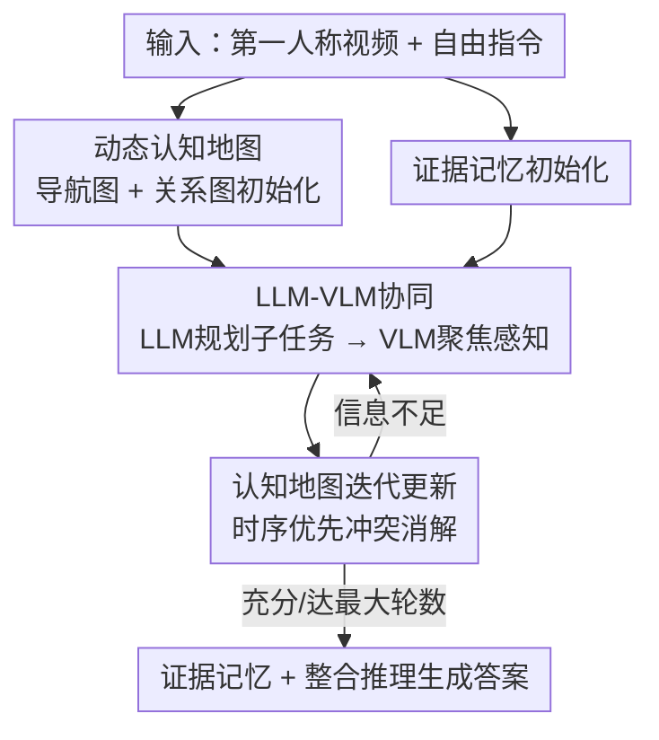

# CLiViS: Unleashing Cognitive Map through Linguistic-Visual Synergy for Embodied Visual Reasoning

**会议**: CVPR 2026  
**论文**: [CVF Open Access](https://openaccess.thecvf.com/content/CVPR2026/html/Li_CLiViS_Unleashing_Cognitive_Map_through_Linguistic-Visual_Synergy_for_Embodied_Visual_CVPR_2026_paper.html)  
**代码**: https://github.com/Teacher-Tom/CLiViS  
**领域**: 具身视觉推理 / Agent  
**关键词**: 具身视觉推理, LLM-VLM协同, 认知地图, 第一人称视频, 免训练框架  

## 一句话总结
CLiViS 把第一人称视频问答拆成"LLM 当规划者、VLM 当感知执行者"的免训练循环，二者共同维护一张会随推理逐步演化的**动态认知地图**（导航图 + 关系图），用结构化场景表征把细粒度感知和高层推理桥接起来，在 OpenEQA / EgoTempo / EgoSchema 三个 benchmark 上拿到 SOTA。

## 研究背景与动机
**领域现状**：具身视觉推理（Embodied Visual Reasoning, EVR，也叫 EM-EQA）要求模型基于第一人称视频 + 自由形式指令完成语义理解和时空推理。现有做法分两派：一派是 **Socratic 策略**——先用视频字幕模型把视频翻成文本，再丢给 LLM 推理；另一派是**端到端 VLM**，把视觉和语言在特征层融合后直接出答案。

**现有痛点**：Socratic 策略里字幕是固定的、与指令无关（instruction-agnostic），会漏掉问题真正关心的细粒度视觉细节；端到端 VLM 虽然开放词汇感知很强，却缺乏高层逻辑规划与多步推理能力，没法把"事件定位→物体识别→关系抽取"这些必要步骤有条理地组织起来。后来的视频推理方法（VideoAgent、VideoTree、Video-R1）要么训练代价大，要么把 LLM 降格成一个被动的帧选择器，依然没释放 LLM 的规划潜力。

**核心矛盾**：EVR 同时压着两个能力维度——长序列+窄视野带来的**时空感知**难题，和复杂多样指令带来的**组合推理**难题。LLM 擅长推理但看不见视频，VLM 擅长感知但不会规划，单独任何一方都会在另一维度上塌掉。

**本文目标**：在不额外训练的前提下，让一个强 LLM 和一个 VLM 互补协作，既保住开放词汇感知，又补上多步结构化推理。

**切入角度**：作者认为感知和推理之间缺一个**共享的、可演化的中间表征**。如果有一张结构化的场景图，LLM 能在上面读到"已经看到了什么"并据此规划下一步要看哪里，VLM 则按指令去补充这张图，二者就能形成"假设—验证"的闭环。

**核心 idea**：用一张随推理迭代不断刷新的**动态认知地图**当桥梁——LLM 基于地图和指令分解子任务、驱动 VLM 做聚焦感知，VLM 的观察再回写进地图，循环往复直到信息足够作答。

## 方法详解
CLiViS 是一个免训练框架，核心是把 EVR 重新形式化为"LLM-VLM 协同构建动态认知地图来支撑 LLM 推理"的任务。形式上把原本的 $R = f_\theta(V, I)$（视频 $V$、指令 $I$、答案 $R$）改写为：

$$R = \text{LLM}\!\left(M, I \,\middle|\, M = \bigcup_{T_i \in \text{LLM}(I, M)} \text{VLM}(V, T_i)\right)$$

其中 $M$ 是认知地图，$T = \{T_i\}$ 是 LLM 基于已知信息 $I$ 和当前 $M$ 分解出的一串子任务。对比此前两种范式——Socratic 的 $R = \text{LLM}(\text{Cap}(V), I)$ 和端到端的 $R = \text{VLM}(V, I)$——CLiViS 的关键差别在于 $M$ 不是一次性产物，而是在 LLM 与 VLM 的反复交互中长出来的。

### 整体框架
推理过程分三个阶段：**(1) 认知与记忆初始化**——把视频按固定时长（如 30s）切片，VLM 对每段生成粗粒度描述，LLM 再从描述中抽取实体、动作、关系，并结合指令标出"与问题最相关的关键实体"，据此搭出初始认知地图，同时初始化一个证据记忆缓冲区存问题/历史/理由；**(2) 语言-视觉协同与认知更新**——进入迭代循环，LLM 读当前地图 + 证据记忆，判断信息是否够答题，不够就针对某个时间段生成一条聚焦子指令（如"看冰箱里山楂汁左边是什么"）驱动 VLM 感知，VLM 的回答被解析成新实体/关系/理由后回写地图和记忆；**(3) 整合推理与答案生成**——一旦 LLM 判定信息充分或达到最大轮数，就整合地图与记忆产出最终答案。

### 关键设计

**1. LLM-VLM 协同范式：让 LLM 当规划者、VLM 当感知执行者**

针对"Socratic 漏细节、端到端 VLM 不会规划"的两难，CLiViS 不再让任何一方独自扛全程，而是把角色拆开：LLM 作为高层 planner，根据指令和已积累的场景认知，给 VLM 派发一串子任务（从关键物体识别、密集物体描述到关系抽取）；VLM 作为感知 executor，按子任务去对应视频段提取任务相关的视觉线索。和 VideoTree/LVNet 这类"先感知后推理"的静态一步式 pipeline 不同，CLiViS 是 LLM 主动引导 VLM 的**假设-验证循环**——LLM 提出"可能是 X"，让 VLM 去特定时间段核实，再据结果决定下一步。这一闭环正是它超过其他免训练方法的根因：静态一步推理碰到需要核验的复杂关系就卡住，而循环式协同能逐步消解歧义。整套流程完全靠提示词编排、零训练。

**2. 动态认知地图：用双子图把时空结构和实体关系结构化**

针对"感知和推理之间缺共享表征"的痛点，作者把场景显式建成一张图 $M = \{G_{nav}, G_{rel}\}$，由两个子图组成。**导航图** $G_{nav} = (V_{nav}, E_{nav})$ 捕捉视频的时间结构：每个节点 $v_i$ 是一个时间段（记录该段的区域、实体、动作及字幕，如"0~30s / 厨房 / 冰箱、锅、鸡蛋"），边 $e_{ij}$ 表示时间段之间的相邻关系。**关系图** $G_{rel} = (V_{rel}, E_{rel})$ 建模细粒度的实体级关系：节点是视觉实体或动作，边是它们之间的语义关系（空间关系、施事-受事交互、功能依赖，如"corn ← left to → hawthorn juice"）。这种"时间轴 + 关系网"的双视角让地图既能定位"什么时候在哪个区域"，又能回答"谁对谁做了什么、谁在谁旁边"，把零散的视觉观察压成 LLM 能直接读取推理的结构化 grounding。

**3. 认知地图迭代更新：用时序优先原则消解冲突、保持地图聚焦**

地图不是静态的，初始 $M^{(0)}$ 之后每轮都要刷新：

$$M^{(i)} = \text{Update}\!\left(M^{(i-1)},\ \text{VLM}(V_{T_i}, T_i)\right)$$

$\text{Update}(\cdot)$ 的难点在于"如何在加入新信息时不和旧信息打架"。具体做法是：先从 $M^{(i-1)}$ 里抽出相关的时间子图当上下文，再用专门的提示词让 LLM 从 VLM 输出里识别出图中尚不存在的新实体/关系/动作；冲突消解遵循**时序优先原则**——VLM 更新的观察会覆盖更旧的、矛盾的信息，促使 LLM 更新或删除过时元素；所有增/删/改都**原子化**处理以保持一致性；最后还会做关键实体管理，让地图始终聚焦于和问题相关的部分，不被无关信息撑爆。这套机制是地图能"逐步演化、保持最新且不膨胀"的关键，也是它区别于一次性建图方法的地方。

**4. 证据记忆与整合推理：累积可解释理由并控制循环退出**

光有感知地图还不够，作者额外加了一个轻量的**证据记忆** $E$，专门留存 LLM-VLM 交互中蒸馏出的高层语义线索，每条证据原子定义为：

$$E = (r, \tau, O)$$

其中 $r$ 是关于 query 的语言理由（rationale），$\tau$ 是对应时间段，$O$ 是涉及的物体/区域/动作集合。证据记忆同样每轮更新 $E^{(i)} = \text{Update}(E^{(i-1)}, \text{VLM}(V_{T_i}, T_i))$，它的价值在于提升推理可解释性——把"为什么这么答"的链条显式记下来。每轮 LLM 整合地图与记忆生成响应 $R_i = \text{LLM}(M^{(i)}, E^{(i)}, I)$，并据此决定是退出还是继续：

$$R_i = \begin{cases} R & \text{if } \text{Exit} = \text{True} \\ T_{i+1} & \text{if } \text{Exit} = \text{False} \end{cases}$$

即 LLM 的输出要么就是最终答案，要么被当成下一条子任务 $T_{i+1}$ 继续驱动 VLM——这让感知与推理紧密耦合在同一个循环里。

### 一个例子：冰箱里山楂汁左边能微波加热吗
问题是"冰箱里山楂汁左边的物体能放微波炉加热吗"。初始化时 VLM 对厨房段（0~30s）生成粗描述，LLM 建图标出关键实体 [冰箱, 山楂汁, 微波炉]，但此时图里没明确记录冰箱内物体的摆放。LLM 分析发现信息缺失，生成子指令"聚焦人打开冰箱的时段（00:00\~00:30），观察山楂汁左边是什么物体"驱动 VLM。VLM 回答"山楂汁左边有两根玉米，玉米可直接微波加热"，LLM 把 `corn —left to→ hawthorn juice` 写进关系图、把理由 `{rationale: 山楂汁左边是玉米, area: kitchen, obj: 山楂汁/冰箱/玉米}` 写进证据记忆，判定信息已充分，整合输出"左边是玉米，可微波加热"。整个过程展示了"LLM 发现缺口→定向提问→VLM 核实→回写→作答"的闭环。

## 实验关键数据

### 主实验
三个真实第一人称视频问答 benchmark：OpenEQA（1,079 QA）、EgoTempo（500 QA，10 类，强调时序推理）、EgoSchema（500 题，3 分钟视频，多选）。开放式 benchmark 用 Qwen2.5-Max 按 5 分 Likert 打分、≥4 算对。所有 VLM/LLM 为 7B–8B 量级，视频按 30s 切片，最大对话轮数 10。下表为各 benchmark 的 All 列对比（节选代表性方法）：

| 方法 | 范式 | OpenEQA | EgoTempo | EgoSchema | Avg. |
|------|------|---------|----------|-----------|------|
| Qwen2.5-VL + Qwen2.5-Max | Socratic | 23.0 | 5.8 | 58.6 | 29.1 |
| Qwen2.5-VL | 端到端VLM | 40.7 | 16.2 | 64.8 | 40.6 |
| InternVL3 | 端到端VLM | 53.6 | 17.0 | 66.6 | 45.7 |
| VideoLLaMA3 | 端到端VLM | 57.1 | 19.8 | 62.2 | 46.4 |
| Video-R1 | 视频推理 | 41.9 | 16.4 | 46.6 | 35.0 |
| VideoTree | 视频推理 | 16.4 | 14.8 | 60.0 | 30.4 |
| **CLiViS (InternVL3)** | **本文** | **55.4** | **23.0** | **69.4** | **49.3** |
| **CLiViS (VideoLLaMA3)** | **本文** | 57.3 | 23.4 | 64.8 | 48.4 |

CLiViS 在三个 benchmark 上均取得 SOTA（OpenEQA 55.4%、EgoTempo 23.0%、EgoSchema 69.4%），平均准确率 49.4%。相对各范式最强者：比 Socratic 高 20.2%、比端到端 VLM 高 2.9%、比视频推理方法高 14.3%。作者强调，相对 VideoTree/LVNet 这类"先感知后推理"静态方法的优势，来自其迭代式假设-验证循环。

视频时长越长，增益越大：用 Qwen2.5-VL 在 OpenEQA 上，<30s 视频上提升 3.5%，≥30s 视频上提升 6.5%，印证了迭代协同 + 动态地图在聚合长程线索上的优势。

### 模型无关性
配同一 LLM（Qwen2.5-Max）、换不同 VLM 骨干，CLiViS 都能稳定涨点：

| VLM 骨干 | OpenEQA | EgoTempo | EgoSchema | Avg. |
|----------|---------|----------|-----------|------|
| Qwen2.5-VL baseline | 40.7 | 16.2 | 64.8 | 40.6 |
| + CLiViS | 46.9 (+6.2) | 19.6 (+3.4) | 68.2 (+3.4) | 44.9 (+4.3) |
| InternVL3 baseline | 53.6 | 17.0 | 66.6 | 45.7 |
| + CLiViS | 55.4 (+1.8) | 23.0 (+6.0) | 69.4 (+2.8) | 49.3 (+3.6) |
| VideoLLaMA3 baseline | 57.1 | 19.8 | 62.2 | 46.4 |
| + CLiViS | 57.3 (+0.2) | 23.4 (+3.6) | 64.8 (+2.6) | 48.4 (+2.0) |

### 消融实验
在 EgoTempo 上（InternVL3 + Qwen2.5-Max）逐组件消融：

| 配置 | 准确率 | 说明 |
|------|--------|------|
| full model (VLM + LLM) | 23.0 | 完整模型 |
| w/o Navigation Graph | 20.6 (-2.4) | 去掉导航图，时序定位受损 |
| w/o Relation Graph | 21.4 (-1.6) | 去掉关系图，细粒度空间关系丢失 |
| w/o Evidence Memory | 22.4 (-0.6) | 去掉证据记忆，理由追踪变弱 |
| w/o 多轮交互（单轮） | 12.5 (-10.5) | 把循环压成一轮，崩盘 |
| w/ VLM 做高层推理 | 10.6 (-12.4) | 用 InternVL3 替 LLM 做规划 |
| baseline (VLM only) | 17.0 (-6.0) | 纯 VLM |

### 关键发现
- **最致命的两个组件是"框架级"而非"地图级"**：把多轮 LLM-VLM 交互塌缩成单轮直接掉 10.5%，用 VLM 替 LLM 做高层推理更是暴跌 12.4%——说明"迭代协同"和"用专门的强 LLM 当规划者"是两条底线，远比某个子图重要。
- **两个子图分工清晰**：导航图（-2.4%）管时序定位，关系图（-1.6%）管细粒度空间关系，去哪个都掉点，证明双子图设计不是冗余。
- **延迟-精度权衡有竞争力**：EgoSchema 上 CLiViS 195s / 69.4%，比 VideoTree（71s / 60.0%）精度高 9.4%，比 VideoAgent（644s / 62.0%）又快又准。⚠️ zero-shot 多轮方法的真实延迟仍是公认挑战。

## 亮点与洞察
- **"动态认知地图"是把感知和推理解耦又重新缝合的巧妙中介**：它既不是固定字幕（会漏细节），也不是黑盒特征（不可控），而是一张 LLM 能读写、能定向刷新的结构化图——这让"按需感知"成为可能，VLM 只在 LLM 提问时才去看对应片段。
- **时序优先的冲突消解 + 原子更新 + 关键实体聚焦**，三件套保证地图在长视频上不膨胀、不自相矛盾，这套"图维护"工程细节是它能处理长程依赖的实际支撑，可迁移到任何需要长期记忆的 agent。
- **消融里"VLM 替 LLM 掉 12.4%"是很有说服力的一刀**：直接证明了在具身推理里，强 LLM 的规划能力不是锦上添花而是不可替代的，给"是否值得为推理单独配一个强语言模型"提供了实证。
- **整个框架零训练、模型无关**：换 VLM 骨干都稳定涨点，工程上即插即用，是它实用价值的核心。

## 局限与展望
- **延迟仍偏高**：195s/题对实时具身应用偏重，多轮 LLM-VLM 往返是主要开销，作者自己也承认 zero-shot 多轮方法的延迟是挑战。
- **依赖强 LLM**：核心增益绑定在 Qwen2.5-Max 这类强 LLM 上，换弱 LLM 会怎样、API 成本如何，文中未充分讨论。⚠️ 实验只在 7B–8B VLM + 单一强 LLM 配置下做，规划质量对 LLM 能力的敏感性边界不清。
- **限定离线 EM-EQA 设定**：只在预采集视频上推理，不涉及主动导航（A-EQA），认知地图能否支撑需要实际行动的交互式具身任务有待验证。
- **地图更新靠提示词工程**：实体/关系抽取、冲突消解都依赖精心设计的 prompt，鲁棒性和跨域可迁移性可能受 prompt 质量影响。

## 相关工作与启发
- **vs Socratic 策略（如 VLM + LLM 两段式）**：他们用固定、与指令无关的字幕喂 LLM，会漏掉问题真正关心的细节；CLiViS 让 LLM 按需向 VLM 提问、动态补充地图，把字幕从"一次性翻译"变成"按需感知"，主实验上高出约 20%。
- **vs 端到端 VLM（Qwen2.5-VL / InternVL3 / VideoLLaMA3）**：它们感知强但缺多步规划；CLiViS 在同一 VLM 之上套规划循环，模型无关地稳定涨点（如 InternVL3 在 EgoTempo +6.0%）。
- **vs 视频推理方法（VideoAgent / VideoTree / Video-R1）**：VideoTree/LVNet 是"先感知后推理"的静态一步式，复杂核验会卡；Video-R1 靠强化学习训练代价大。CLiViS 免训练、且用假设-验证迭代循环替代单步推理，在 EgoSchema 上比 VideoTree 高 9.4% 且比 VideoAgent 快得多。

## 评分
- 新颖性: ⭐⭐⭐⭐ 把"动态认知地图 + 假设-验证循环"用作 LLM-VLM 协同的中介，角度清晰且免训练，但双子图 + 记忆缓冲的组件都有前作影子。
- 实验充分度: ⭐⭐⭐⭐ 三 benchmark、多 VLM 骨干、组件消融 + 延迟分析齐全；缺对 LLM 能力敏感性的系统扫描。
- 写作质量: ⭐⭐⭐⭐ 形式化清晰、图示直观，三阶段流程讲得明白。
- 价值: ⭐⭐⭐⭐ 免训练、模型无关、即插即用，对长程具身视觉推理有现实意义，延迟是落地短板。

<!-- RELATED:START -->

## 相关论文

- [\[CVPR 2026\] Spatial-Aware VLA Pretraining through Visual-Physical Alignment from Human Videos](spatial-aware_vla_pretraining_through_visual-physical_alignment_from_human_video.md)
- [\[CVPR 2026\] STRNet: Visual Navigation with Spatio-Temporal Representation through Dynamic Graph Aggregation](strnet_visual_navigation_with_spatio-temporal_representation_through_dynamic_gra.md)
- [\[CVPR 2026\] Action-Sketcher: From Reasoning to Action via Visual Sketches for Robotic Manipulation](action-sketcher_from_reasoning_to_action_via_visual_sketches_for_robotic_manipul.md)
- [\[CVPR 2026\] Visual-RRT: Finding Paths toward Visual-Goals via Differentiable Rendering](visual-rrt_finding_paths_toward_visual-goals_via_differentiable_rendering.md)
- [\[CVPR 2026\] Rethinking Visual Rearrangement from A Diffusion Perspective](rethinking_visual_rearrangement_from_a_diffusion_perspective.md)

<!-- RELATED:END -->
